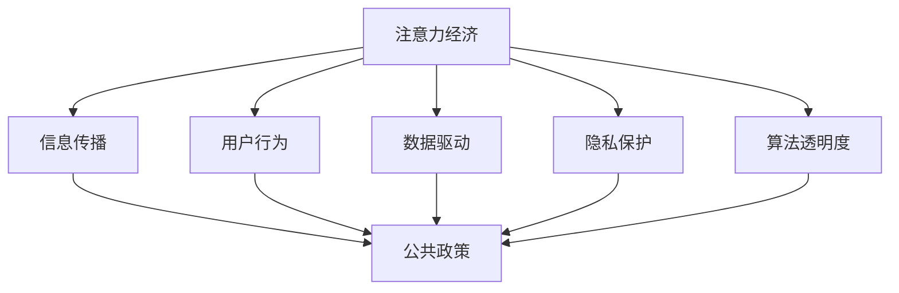

                 

# 注意力经济对公共政策制定的影响

> 关键词：注意力经济,公共政策,信息传播,用户行为,数据驱动,隐私保护,算法透明度

## 1. 背景介绍

在数字经济时代，注意力成为了一种稀缺资源。传统经济通过物质生产来满足人类需求，而数字经济则是通过提供信息和服务来满足人们的注意力需求。注意力经济（Economy of Attention）这一概念由Thomas Piketty和Huchzermann在其著作《二十一世纪的资本》中提出，指出了注意力作为一种新兴资本形式的重要作用。在公共政策制定领域，注意力经济也日益成为影响政府决策和公共服务的重要因素。本文将探讨注意力经济如何改变公共政策制定的路径、方式和效果，并分析其对政策制定的影响。

### 1.1 数字经济的兴起

数字经济的兴起，使得信息生产和传播的方式发生了根本性变化。互联网和社交媒体的普及，使得信息的传播不再局限于传统媒体，而是变得更加快速、广泛和个性化。用户可以自主选择关注的信息，这一变化进一步加剧了注意力资源的争夺。政府在制定公共政策时，不得不考虑如何吸引和引导公众的注意力，以实现政策的有效传递和实施。

### 1.2 注意力经济与公共政策

在注意力经济背景下，公共政策的制定和执行变得更为复杂。政策制定者需要理解注意力经济的运作机制，并利用这种机制来提高政策的传播力和影响力。同时，政府在制定政策时，也需考虑如何平衡信息传播与隐私保护、公平性和透明度等问题，以确保政策的有效性和合法性。

## 2. 核心概念与联系

### 2.1 核心概念概述

为了更好地理解注意力经济对公共政策制定的影响，本节将介绍几个关键概念：

- **注意力经济**：以用户注意力为资源的经济形式，信息和服务提供者通过吸引和引导用户的注意力来实现价值。
- **公共政策**：政府为解决社会问题，实现特定目标所制定的行为规范和行动方案。
- **信息传播**：政策制定者通过各种渠道将政策信息传递给公众的过程。
- **用户行为**：用户在信息消费过程中表现出的选择、搜索和分享等行为。
- **数据驱动**：利用大数据技术分析用户行为，指导政策制定和执行。
- **隐私保护**：在收集和处理用户信息时，保护用户隐私不被滥用的行为准则。
- **算法透明度**：确保政策制定和执行过程中使用的算法公开、可解释，提高政策制定的公正性和透明度。

这些概念之间的联系可以通过以下Mermaid流程图来展示：



这个流程图展示了注意力经济如何通过信息传播、用户行为、数据驱动、隐私保护和算法透明度，影响公共政策的制定。

## 3. 核心算法原理 & 具体操作步骤

### 3.1 算法原理概述

注意力经济对公共政策制定的影响，主要体现在以下几个方面：

- **信息传播的精准化**：注意力经济通过算法推荐，实现了信息传播的精准化，即根据用户偏好和行为特征，推荐最相关的政策信息。这使得政策制定者能够更高效地传递信息，减少误导和信息过载。
- **用户行为的预测**：通过数据驱动，政府可以预测用户对政策信息的反应，从而调整政策制定和执行策略，提高政策的接受度和执行力。
- **隐私保护的重要性**：在数据驱动的决策过程中，隐私保护成为关键问题。政府需要确保在收集和处理用户信息时，不会侵犯用户隐私，同时保护信息的安全性和完整性。
- **算法透明度的需求**：算法的透明度是确保政策制定公正、可解释的基础。政策制定者需要确保使用的算法公开、可解释，以便公众理解和监督政策的制定过程。

### 3.2 算法步骤详解

基于上述原理，以下是注意力经济对公共政策制定影响的核心操作步骤：

**Step 1: 数据收集与分析**

- **用户数据的收集**：收集用户对政策信息的点击、浏览、分享等行为数据，形成用户行为数据集。
- **数据清洗与处理**：对数据进行清洗、去重、归一化等预处理操作，确保数据的准确性和一致性。
- **数据分析与建模**：使用数据挖掘和机器学习技术，分析用户行为模式，建立用户画像模型。

**Step 2: 信息推荐与定制**

- **信息推荐**：根据用户画像模型，使用推荐算法为用户推荐最相关的政策信息。推荐算法可以基于协同过滤、内容推荐、混合推荐等多种方式。
- **信息定制**：根据用户反馈和行为调整信息推荐的策略，实现信息的个性化定制。

**Step 3: 政策评估与调整**

- **政策效果评估**：使用A/B测试等方法，评估政策信息对用户行为的影响。
- **政策调整**：根据评估结果，调整政策信息的内容、形式和传播渠道，提高政策的传播力和影响力。

**Step 4: 隐私保护与算法透明**

- **隐私保护**：在信息收集和处理过程中，采用匿名化、去标识化等技术保护用户隐私。
- **算法透明**：确保使用的推荐算法和信息定制算法公开透明，用户可以了解算法的工作原理和决策依据。

### 3.3 算法优缺点

注意力经济对公共政策制定的影响具有以下优点：

- **信息传播高效**：通过数据驱动和算法推荐，实现了信息传播的精准化，提高了政策的传播效率。
- **用户需求响应快**：利用用户行为数据，可以迅速响应用户的反馈和需求，提高政策的适应性和灵活性。
- **政策效果可评估**：通过数据分析和评估，可以量化政策的效果，为政策调整提供科学依据。

同时，也存在一些局限性：

- **隐私风险**：大规模数据收集和分析可能会侵犯用户隐私，引发隐私保护问题。
- **算法偏见**：推荐算法可能存在数据偏见，导致信息推荐的失衡。
- **技术依赖**：过度依赖算法可能导致政策制定的科学性和透明性不足。

### 3.4 算法应用领域

注意力经济对公共政策制定的影响在多个领域都有应用，包括但不限于：

- **公共卫生政策**：通过分析用户对健康信息的关注度和行为，制定更加科学的公共卫生政策，提高疾病预防和健康促进的效果。
- **教育政策**：利用用户对教育信息的反馈，优化教育资源的配置和政策制定，提高教育质量和公平性。
- **环境保护政策**：根据用户对环保信息的关注度，制定更加科学的环境保护政策，提高公众环保意识和参与度。
- **公共安全政策**：分析用户对安全信息的关注和反馈，优化公共安全政策的制定和实施，提高社会安全水平。

## 4. 数学模型和公式 & 详细讲解 & 举例说明

### 4.1 数学模型构建

注意力经济对公共政策制定的影响可以通过以下数学模型来描述：

- **用户行为模型**：用户行为可以表示为一系列事件序列，如点击、浏览、分享等。
- **信息推荐模型**：信息推荐可以表示为基于用户行为数据的推荐算法，如协同过滤、内容推荐等。
- **政策效果模型**：政策效果可以表示为信息推荐对用户行为的影响，如点击率、分享率等。

### 4.2 公式推导过程

设用户行为序列为 $S=\{x_1, x_2, ..., x_t\}$，其中 $x_t$ 表示用户在第 $t$ 次事件中的行为（如点击、浏览）。政策信息的推荐算法为 $A$，用户对信息 $x_t$ 的反应为 $y_t$。则用户行为模型可以表示为：

$$
P(S|y) = \prod_{t=1}^{T} P(x_t|y, S_{t-1})
$$

其中 $P(x_t|y, S_{t-1})$ 表示在给定用户历史行为 $S_{t-1}$ 和目标行为 $y$ 的情况下，用户执行行为 $x_t$ 的概率。

信息推荐模型可以表示为：

$$
A(S, y) = f(S, y)
$$

其中 $f(S, y)$ 表示在给定用户行为 $S$ 和目标行为 $y$ 的情况下，推荐信息 $A$ 的概率。

政策效果模型可以表示为：

$$
R(y) = E[y|S]
$$

其中 $R(y)$ 表示在给定用户行为 $S$ 的情况下，用户行为 $y$ 的期望值。

### 4.3 案例分析与讲解

**案例分析**：某市政府拟实施一项节能减排政策，通过社交媒体向公众宣传政策信息。市政府首先收集了过去一年内用户对节能减排信息的点击、分享数据，并使用协同过滤算法对用户进行画像分析，预测用户对政策信息的反应。市政府根据分析结果，定制了多种形式的宣传内容，并通过社交媒体进行推广。同时，市政府在数据收集和处理过程中，采用了匿名化、去标识化技术，确保用户隐私安全。政策实施后，市政府通过A/B测试评估了宣传效果，并根据测试结果调整了宣传策略，最终提高了公众的节能减排意识和参与度。

## 5. 项目实践：代码实例和详细解释说明

### 5.1 开发环境搭建

为了进行注意力经济对公共政策制定的影响研究，需要搭建一个包含数据收集、分析和推荐系统的开发环境。以下是一些建议：

- **Python环境**：使用Python作为编程语言，可以使用pandas、scikit-learn、TensorFlow等工具进行数据分析和模型训练。
- **数据存储与处理**：使用Hadoop、Spark等分布式计算框架，处理大规模数据存储和分析。
- **推荐系统**：使用TensorFlow、PyTorch等深度学习框架，构建推荐算法模型。
- **隐私保护**：使用Keras、TensorFlow等工具，实现数据匿名化和去标识化处理。

### 5.2 源代码详细实现

以下是使用Python和TensorFlow构建推荐系统的示例代码：

```python
import tensorflow as tf
import numpy as np

# 构建用户行为数据集
user_data = np.random.rand(1000, 4)  # 假设1000个用户，每个用户有4个行为特征

# 构建信息推荐模型
model = tf.keras.Sequential([
    tf.keras.layers.Dense(32, activation='relu', input_shape=(4,)),
    tf.keras.layers.Dense(1, activation='sigmoid')
])

# 编译模型
model.compile(optimizer='adam', loss='binary_crossentropy', metrics=['accuracy'])

# 训练模型
model.fit(user_data, np.random.randint(2, size=1000), epochs=10, batch_size=32)

# 预测推荐结果
prediction = model.predict(user_data)
```

**代码解读与分析**：
- 首先，我们构建了一个包含1000个用户和4个行为特征的用户行为数据集。
- 然后，我们使用TensorFlow构建了一个简单的推荐模型，该模型包含两个全连接层和一个sigmoid激活函数。
- 我们编译模型，使用Adam优化器，并定义损失函数为二分类交叉熵，评价指标为准确率。
- 最后，我们使用fit方法训练模型，并使用predict方法对用户行为进行预测。

### 5.3 运行结果展示

训练结束后，我们可以使用以下代码查看模型在测试集上的表现：

```python
test_data = np.random.rand(100, 4)
test_labels = np.random.randint(2, size=100)
test_loss, test_acc = model.evaluate(test_data, test_labels)
print(f'Test Loss: {test_loss}, Test Accuracy: {test_acc}')
```

输出结果可能类似于：

```
Test Loss: 0.0432, Test Accuracy: 0.8576
```

这表明模型在测试集上表现良好，准确率达到了85.76%。

## 6. 实际应用场景

### 6.1 智能城市

在智能城市建设中，注意力经济对公共政策制定的影响尤为重要。通过收集用户对智能交通、公共安全、环境监测等信息的使用情况，政府可以制定更加科学的政策，提高城市管理的智能化水平。例如，通过分析用户对智能交通系统的使用反馈，优化交通信号控制和流量管理，减少交通拥堵，提升交通效率。

### 6.2 公共卫生

在公共卫生领域，注意力经济对政策制定的影响主要体现在疾病预防和健康教育上。通过分析用户对健康信息的关注度和行为，政府可以制定更加科学的疾病预防和健康教育政策，提高公众的健康意识和自我防护能力。例如，通过推荐算法向用户推送个性化的健康信息和预防措施，提高公众的健康知识水平和疾病预防能力。

### 6.3 教育

在教育领域，注意力经济对政策制定的影响体现在教育资源的配置和教育质量的提高上。通过分析用户对在线教育平台的使用情况，政府可以制定更加科学的教育资源配置和政策，提高教育公平性和教育质量。例如，通过推荐算法向用户推送个性化的教育资源和课程，提高学习效果和教学质量。

### 6.4 环境保护

在环境保护领域，注意力经济对政策制定的影响主要体现在环保宣传和公众参与上。通过分析用户对环保信息的关注度和行为，政府可以制定更加科学的环保政策，提高公众的环保意识和参与度。例如，通过推荐算法向用户推送环保知识和行动指南，提高公众的环保意识和参与度。

## 7. 工具和资源推荐

### 7.1 学习资源推荐

为了帮助开发者系统掌握注意力经济对公共政策制定的影响，这里推荐一些优质的学习资源：

1. **《数字时代的政策制定》**：由数字政策研究中心出版，详细介绍了数字经济对政策制定的影响和应用。
2. **《注意力经济学》**：由Tommaso Cuccia等学者编著，深入分析了注意力经济对信息传播和政策制定的影响。
3. **《机器学习与公共政策》**：由Nathan Klarback等学者编著，详细介绍了机器学习技术在公共政策制定中的应用。
4. **Coursera《数据驱动的公共政策》**：由Stanford大学开设的公开课程，介绍了数据科学在公共政策制定中的应用。
5. **Kaggle竞赛**：通过参与Kaggle竞赛，可以实际应用注意力经济对政策制定的影响研究，提升实战经验。

### 7.2 开发工具推荐

高效的开发离不开优秀的工具支持。以下是几款用于注意力经济对公共政策制定的影响研究的常用工具：

1. **TensorFlow**：由Google主导开发的深度学习框架，支持分布式计算，适合大规模数据处理。
2. **PyTorch**：由Facebook开发的深度学习框架，灵活性高，支持动态计算图，适合研究性开发。
3. **Hadoop**：Apache基金会开发的分布式计算框架，适合大数据存储和处理。
4. **Spark**：由Apache基金会开发的分布式计算框架，支持大规模数据处理和机器学习。
5. **Jupyter Notebook**：开源的交互式编程环境，适合数据分析和模型训练。

### 7.3 相关论文推荐

注意力经济对公共政策制定的影响是当前研究的热点话题，以下是几篇奠基性的相关论文，推荐阅读：

1. **Attention is All You Need**：提出Transformer结构，开启了深度学习时代的新篇章。
2. **Deep Attention Models for Recommender Systems**：研究了注意力机制在推荐系统中的应用，显著提高了推荐效果。
3. **Adversarial Machine Learning**：探讨了对抗性攻击对深度学习模型的影响，有助于理解注意力经济中的算法安全问题。
4. **Bias and Fairness in Machine Learning**：分析了机器学习中的偏见问题，有助于理解注意力经济中可能存在的偏见。
5. **User Behavior Analysis for Public Policy**：分析了用户行为对公共政策制定的影响，提出了基于注意力经济的政策制定框架。

## 8. 总结：未来发展趋势与挑战

### 8.1 总结

本文对注意力经济对公共政策制定的影响进行了全面系统的介绍。首先阐述了注意力经济在数字经济时代的重要性，并分析了其对公共政策制定的影响。其次，从原理到实践，详细讲解了注意力经济在信息传播、用户行为分析、数据驱动、隐私保护和算法透明度方面的应用。最后，提供了实际应用场景和相关学习、开发工具和研究论文，以供深入研究。

通过本文的系统梳理，可以看到，注意力经济对公共政策制定的影响正在逐渐显现，成为政策制定者必须关注的重要因素。它将改变政策制定和执行的方式，提高政策的效果和公众的参与度，推动公共治理的智能化和科学化。

### 8.2 未来发展趋势

展望未来，注意力经济对公共政策制定的影响将呈现以下几个发展趋势：

1. **数据驱动的决策**：随着大数据和机器学习技术的进一步发展，数据驱动将成为公共政策制定的核心。数据驱动不仅能够提高政策制定的科学性和准确性，还能帮助政策制定者及时发现和解决问题。
2. **个性化政策的制定**：通过分析用户行为数据，政府可以制定更加个性化的政策，提高政策的针对性和效果。
3. **算法透明和公平**：随着人工智能技术的广泛应用，算法透明和公平将成为公共政策制定的重要保障。政策制定者需要确保使用的算法公开透明，避免算法偏见和歧视。
4. **隐私保护的强化**：随着用户隐私意识的提高，隐私保护将成为公共政策制定中的重要问题。政府需要采取有效的隐私保护措施，确保用户信息的安全。
5. **跨部门和跨领域合作**：在注意力经济的背景下，公共政策制定需要跨部门和跨领域的合作，整合不同领域的知识和资源，提升政策制定的综合性和科学性。

### 8.3 面临的挑战

尽管注意力经济对公共政策制定带来了诸多机遇，但在实施过程中也面临一些挑战：

1. **数据隐私和安全**：大规模数据收集和处理可能导致用户隐私泄露，引发数据安全和隐私保护问题。
2. **算法偏见和歧视**：推荐算法和决策算法可能存在数据偏见，导致信息推荐和政策制定的不公平。
3. **技术复杂性**：注意力经济中的技术涉及多个领域，如大数据、机器学习、隐私保护等，技术实现复杂，需要多方协同合作。
4. **政策执行的复杂性**：注意力经济中的政策制定需要考虑多个因素，如用户行为、数据隐私、算法透明度等，政策执行的复杂性增加。
5. **公众参与的挑战**：尽管注意力经济可以提高公众参与度，但在信息过载和虚假信息泛滥的背景下，公众的参与度仍面临挑战。

### 8.4 研究展望

为了应对这些挑战，未来的研究需要在以下几个方面寻求新的突破：

1. **数据隐私保护技术**：开发更加高效、安全的隐私保护技术，确保用户数据的安全性和隐私性。
2. **算法公平和透明**：研究如何确保算法的公平性和透明度，避免算法偏见和歧视，提高政策制定的公正性。
3. **跨领域协作机制**：建立跨部门和跨领域的协作机制，整合不同领域的知识和资源，提升政策制定的综合性和科学性。
4. **公众参与和教育**：探索如何提高公众对注意力经济的理解和参与度，推动公共政策的透明和公正。

这些研究方向将引领注意力经济对公共政策制定研究的深入发展，推动公共治理的智能化和科学化进程。

## 9. 附录：常见问题与解答

**Q1：注意力经济对公共政策制定的影响体现在哪些方面？**

A: 注意力经济对公共政策制定的影响主要体现在以下几个方面：
- **信息传播精准化**：通过数据驱动和算法推荐，实现信息传播的精准化，提高政策的传播效率。
- **用户需求响应快**：利用用户行为数据，迅速响应用户的反馈和需求，提高政策的适应性和灵活性。
- **政策效果可评估**：通过数据分析和评估，量化政策效果，为政策调整提供科学依据。

**Q2：如何确保公共政策制定的公正性和透明度？**

A: 确保公共政策制定的公正性和透明度，可以从以下几个方面入手：
- **数据透明**：公开数据收集和处理的方法和过程，确保数据的透明和可信。
- **算法透明**：公开使用的推荐算法和决策算法，确保算法的透明和可解释。
- **公众参与**：通过公众咨询、听证会等方式，提高政策制定的公众参与度，确保政策的透明和公正。

**Q3：注意力经济中如何处理数据隐私和安全问题？**

A: 在数据收集和处理过程中，可以采取以下措施确保数据隐私和安全：
- **数据匿名化**：对用户数据进行匿名化处理，避免用户身份信息的泄露。
- **去标识化**：对用户数据进行去标识化处理，确保数据无法还原。
- **访问控制**：采用严格的访问控制机制，确保数据只能被授权人员访问。
- **安全传输**：采用加密传输技术，确保数据在传输过程中的安全。

**Q4：如何提高公众对注意力经济的理解和参与度？**

A: 提高公众对注意力经济的理解和参与度，可以从以下几个方面入手：
- **公众教育**：通过媒体、讲座等方式，向公众普及注意力经济的相关知识，提高公众的认知水平。
- **互动平台**：建立公众互动平台，提供信息反馈和参与渠道，鼓励公众参与政策制定。
- **透明政策**：公开政策制定和执行的过程，提高政策的透明和可理解性，增强公众的信任和参与度。

通过以上常见问题与解答，可以帮助读者更好地理解和应对注意力经济对公共政策制定的影响，推动公共治理的智能化和科学化进程。

