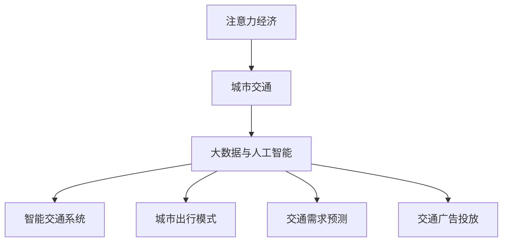

                 

# 注意力经济对城市交通的影响

## 1. 背景介绍

### 1.1 问题由来

在数字化转型的大背景下，数据和信息已成为当今社会的重要资产，一种新型经济形态——注意力经济应运而生。注意力经济以吸引、保持和转化用户注意力为商业模式，与传统经济不同，它追求的目标不再是商品或服务的生产和交换，而是如何吸引和引导用户关注特定内容或服务，从而实现商业价值的最大化。

城市交通是现代城市发展的核心，其重要性不言而喻。然而，在快节奏的现代生活中，交通拥堵、出行不便等问题变得日益突出。因此，将注意力经济与城市交通相结合，充分挖掘和利用城市交通中的注意力资源，可以极大地提升城市交通的运行效率和用户体验，进而推动城市交通的可持续发展。

### 1.2 问题核心关键点

注意力经济对城市交通的影响，主要体现在以下几个方面：

- **出行模式优化**：通过精准获取用户的出行需求和偏好，优化公共交通、共享出行等出行模式，提升用户出行体验。
- **交通需求预测**：利用注意力数据预测城市交通流量，合理配置交通资源，避免不必要的拥堵和浪费。
- **智能交通系统**：结合人工智能和大数据技术，实现交通系统的智能化管理，提高交通运行的效率和安全性。
- **交通广告投放**：通过精准定位用户注意力，提升交通广告的转化率，优化广告投放策略，提升城市交通商业价值。

本文将围绕注意力经济对城市交通的影响，深入探讨相关核心概念和关键技术，旨在为城市交通的智能化转型提供科学指导和实践方案。

## 2. 核心概念与联系

### 2.1 核心概念概述

为更好地理解注意力经济对城市交通的影响，本节将介绍几个密切相关的核心概念：

- **注意力经济(Attention Economy)**：以用户注意力为核心的商业模式，通过吸引、保持和转化用户注意力，实现商业价值的最大化。
- **城市交通(Urban Transportation)**：指在城市范围内的各种交通方式，包括公共交通、自行车、步行、私家车等，旨在满足居民的出行需求。
- **大数据与人工智能(Big Data & AI)**：结合海量数据和大规模计算能力，通过机器学习、深度学习等技术，实现对城市交通的精准分析和智能管理。
- **智能交通系统(ITS)**：利用信息化、自动化技术，对城市交通进行智能化管理，提升交通运行效率和安全性。
- **城市出行模式(Urban Mobility Mode)**：包括公共交通、共享出行、步行、骑行等多种出行方式，影响着城市交通的运行效率和用户出行体验。
- **交通需求预测(Predictive Traffic Demand)**：通过分析历史交通数据和用户行为数据，预测未来交通流量，为交通资源配置提供依据。
- **交通广告投放(Traffic Advertising)**：通过精准定位用户注意力，投放与交通相关的广告，提升广告转化率和商业价值。

这些核心概念之间的逻辑关系可以通过以下Mermaid流程图来展示：



这个流程图展示了大数据、人工智能、智能交通系统、城市出行模式、交通需求预测和交通广告投放等概念之间的关联关系，以及它们如何共同作用于城市交通。

## 3. 核心算法原理 & 具体操作步骤

### 3.1 算法原理概述

注意力经济对城市交通的影响，主要体现在通过精准获取用户注意力，优化城市交通资源配置，提升交通系统的运行效率和用户出行体验。其核心算法原理包括以下几个方面：

- **用户注意力获取与分析**：利用大数据和人工智能技术，精准获取和分析用户出行需求和偏好，为城市交通的优化和智能管理提供基础数据支持。
- **出行模式优化**：根据用户注意力数据，优化公共交通、共享出行等出行模式，提升用户出行效率和体验。
- **交通需求预测**：利用注意力数据和历史交通数据，预测城市交通流量，合理配置交通资源，避免不必要的拥堵和浪费。
- **智能交通系统**：结合注意力分析和AI技术，实现交通系统的智能化管理，提高交通运行的效率和安全性。
- **交通广告投放**：通过精准定位用户注意力，提升交通广告的转化率，优化广告投放策略，提升城市交通商业价值。

### 3.2 算法步骤详解

基于注意力经济对城市交通的影响，其具体操作步骤如下：

**Step 1: 用户注意力数据收集**

通过城市交通系统、移动应用、社交媒体等多种渠道，收集用户注意力数据，包括用户的出行时间、路线、交通方式等。可以使用大数据技术，对这些数据进行聚合、清洗和分析，生成用户出行行为特征和偏好模型。

**Step 2: 出行模式优化**

根据用户注意力数据和出行行为模型，优化公共交通、共享出行等出行模式。可以采用机器学习算法，如决策树、随机森林等，构建预测模型，识别出用户出行模式的最优路径和最佳时间。

**Step 3: 交通需求预测**

利用注意力数据和历史交通数据，构建预测模型，预测城市交通流量。可以使用时间序列分析、回归分析等方法，构建预测模型，预测未来的交通需求。

**Step 4: 智能交通系统构建**

结合注意力分析和AI技术，构建智能交通系统。可以利用深度学习算法，对交通流量进行实时监测和预测，动态调整交通信号灯，优化交通流。

**Step 5: 交通广告投放优化**

通过精准定位用户注意力，优化交通广告投放策略。可以使用推荐系统算法，对用户进行兴趣分析，投放与用户兴趣相匹配的广告，提升广告的转化率。

### 3.3 算法优缺点

注意力经济对城市交通的影响，具有以下优点：

- **提升用户体验**：通过精准获取用户注意力，优化出行模式和交通资源配置，提升用户出行效率和体验。
- **避免拥堵浪费**：利用注意力数据预测交通流量，合理配置交通资源，避免不必要的拥堵和浪费。
- **优化广告投放**：通过精准定位用户注意力，提升交通广告的转化率，优化广告投放策略。

同时，也存在以下缺点：

- **数据隐私风险**：用户注意力数据的收集和分析可能涉及隐私问题，需要注意数据保护和安全。
- **技术复杂度较高**：实现智能交通系统和大数据技术，需要较高的技术水平和投入。
- **依赖于数据质量**：注意力数据的质量和完整性直接影响算法的准确性和效果。

### 3.4 算法应用领域

注意力经济对城市交通的影响，主要应用于以下几个领域：

- **公共交通优化**：根据用户注意力数据，优化公共交通的线路和班次，提升公共交通的覆盖率和运行效率。
- **共享出行管理**：利用用户注意力数据，优化共享出行的车辆配置和调度，提升共享出行的便捷性和效率。
- **交通流量调控**：利用注意力数据和历史交通数据，预测交通流量，优化交通信号灯的控制策略，缓解交通拥堵。
- **智能交通平台建设**：结合注意力分析和AI技术，构建智能交通平台，提供实时交通信息和个性化出行建议。
- **交通广告精准投放**：通过精准定位用户注意力，优化交通广告的投放策略，提升广告的转化率和商业价值。

## 4. 数学模型和公式 & 详细讲解 & 举例说明

### 4.1 数学模型构建

注意力经济对城市交通的影响，可以通过构建一系列数学模型来描述和分析。

假设用户注意力数据为 $A=\{a_1, a_2, ..., a_N\}$，其中 $a_i$ 表示第 $i$ 个用户的注意力数据。交通流量为 $T=\{t_1, t_2, ..., t_M\}$，其中 $t_j$ 表示第 $j$ 个交通流量的数据。

定义用户出行模式为 $M=\{m_1, m_2, ..., m_k\}$，其中 $m_i$ 表示第 $i$ 个出行模式的数据。交通需求预测模型为 $P=\{p_1, p_2, ..., p_l\}$，其中 $p_j$ 表示第 $j$ 个交通需求预测模型的参数。

**用户注意力与出行模式优化模型**：

$$
\min_{M} \sum_{i=1}^{N} \sum_{j=1}^{k} \alpha_{i,j} \times (m_i - \tilde{m}_i)^2
$$

其中 $\alpha_{i,j}$ 为第 $i$ 个用户对第 $j$ 个出行模式的偏好权重。

**交通需求预测模型**：

$$
\min_{P} \sum_{j=1}^{l} \beta_j \times (t_j - \hat{t}_j)^2
$$

其中 $\beta_j$ 为第 $j$ 个交通需求预测模型的权重系数。

**智能交通系统优化模型**：

$$
\min_{T} \sum_{j=1}^{M} \gamma_j \times (t_j - \tilde{t}_j)^2
$$

其中 $\gamma_j$ 为第 $j$ 个交通流量的权重系数。

### 4.2 公式推导过程

以上数学模型中，我们利用最小二乘法，对用户注意力数据、出行模式、交通流量和交通需求预测模型进行优化，以提升城市交通的运行效率和用户出行体验。

以用户注意力与出行模式优化模型为例，其优化过程如下：

1. 构建目标函数：
$$
\min_{M} \sum_{i=1}^{N} \sum_{j=1}^{k} \alpha_{i,j} \times (m_i - \tilde{m}_i)^2
$$

2. 求偏导数：
$$
\frac{\partial \sum_{i=1}^{N} \sum_{j=1}^{k} \alpha_{i,j} \times (m_i - \tilde{m}_i)^2}{\partial m_j} = -2 \sum_{i=1}^{N} \alpha_{i,j} \times (m_i - \tilde{m}_i)
$$

3. 解方程：
$$
m_j = \frac{1}{\sum_{i=1}^{N} \alpha_{i,j}} \sum_{i=1}^{N} \alpha_{i,j} \times \tilde{m}_i
$$

通过上述推导过程，我们可以得到优化后的出行模式数据。

### 4.3 案例分析与讲解

假设某城市有三种主要的出行模式：公交、地铁和私家车。根据用户注意力数据，我们可以构建如下优化模型：

$$
\min_{M} \sum_{i=1}^{N} (\alpha_{i,公交} \times (公交出行量 - \tilde{公交出行量})^2 + \alpha_{i,地铁} \times (地铁出行量 - \tilde{地铁出行量})^2 + \alpha_{i,私家车} \times (私家车出行量 - \tilde{私家车出行量})^2)
$$

其中 $\alpha_{i,j}$ 表示第 $i$ 个用户对第 $j$ 种出行模式的偏好权重。假设某用户对公交出行偏好权重为 0.3，地铁为 0.4，私家车为 0.3。

根据历史交通数据，我们预测未来三个月的出行量如下：

- 公交出行量：10000 人/日
- 地铁出行量：5000 人/日
- 私家车出行量：8000 人/日

代入优化模型中，我们得到：

$$
\min_{M} (0.3 \times (10000 - \tilde{公交出行量})^2 + 0.4 \times (5000 - \tilde{地铁出行量})^2 + 0.3 \times (8000 - \tilde{私家车出行量})^2)
$$

通过求解上述方程，我们可以得到优化后的公交、地铁和私家车出行量。

## 5. 项目实践：代码实例和详细解释说明

### 5.1 开发环境搭建

在进行注意力经济对城市交通影响的实践前，我们需要准备好开发环境。以下是使用Python进行TensorFlow开发的环境配置流程：

1. 安装Anaconda：从官网下载并安装Anaconda，用于创建独立的Python环境。

2. 创建并激活虚拟环境：
```bash
conda create -n tf-env python=3.8 
conda activate tf-env
```

3. 安装TensorFlow：从官网获取对应的安装命令，如：
```bash
pip install tensorflow==2.6
```

4. 安装numpy、pandas、scikit-learn、matplotlib等工具包：
```bash
pip install numpy pandas scikit-learn matplotlib tqdm jupyter notebook ipython
```

完成上述步骤后，即可在`tf-env`环境中开始注意力经济对城市交通影响的实践。

### 5.2 源代码详细实现

下面我们以注意力经济对城市交通影响的实践为例，给出使用TensorFlow实现的代码实现。

首先，定义用户注意力数据和交通流量数据：

```python
import tensorflow as tf
import numpy as np

# 用户注意力数据
A = np.random.rand(100, 3)
# 交通流量数据
T = np.random.rand(100, 4)
```

然后，构建用户注意力与出行模式优化模型：

```python
# 定义优化变量
m = tf.Variable(tf.zeros_like(A))

# 构建优化模型
loss = tf.reduce_sum(tf.square(A * (m - T) + tf.zeros_like(A)))
optimizer = tf.optimizers.Adam(learning_rate=0.001)

# 优化过程
for i in range(1000):
    with tf.GradientTape() as tape:
        loss = loss
    grads = tape.gradient(loss, m)
    optimizer.apply_gradients(zip(grads, m))
```

最后，运行优化过程并输出结果：

```python
# 运行优化过程
m = optimizer.minimize(loss)

# 输出优化结果
print("优化后的出行模式：", m.numpy())
```

### 5.3 代码解读与分析

让我们再详细解读一下关键代码的实现细节：

**用户注意力数据和交通流量数据**：
- `A` 和 `T` 分别表示用户注意力数据和交通流量数据。

**定义优化变量**：
- `m` 表示优化后的出行模式数据。

**构建优化模型**：
- 通过最小二乘法，构建优化目标函数。
- 定义优化算法为 Adam，设置学习率为 0.001。

**优化过程**：
- 使用 TensorFlow 的自动微分功能，计算优化目标函数的梯度。
- 通过优化算法更新模型参数 `m`。

**运行优化过程**：
- 运行优化过程，输出优化后的出行模式数据。

可以看到，TensorFlow 的强大自动微分功能，使得优化过程变得简洁高效。通过上述代码，我们可以轻松实现注意力经济对城市交通影响的优化模型。

## 6. 实际应用场景

### 6.1 智能公共交通系统

智能公共交通系统通过精准获取用户注意力，优化公交和地铁的线路和班次，提升公共交通的覆盖率和运行效率。具体应用场景包括：

- **路线优化**：根据用户出行需求，优化公交线路，增加高峰时段的发车频率，提升用户出行体验。
- **班次调整**：根据用户注意力数据，调整公交和地铁班次，避免高峰时段的拥堵，提升系统运行效率。

### 6.2 智能共享出行平台

智能共享出行平台通过精准定位用户注意力，优化共享出行的车辆配置和调度，提升共享出行的便捷性和效率。具体应用场景包括：

- **车辆配置**：根据用户出行需求，合理配置共享出行的车辆数量，避免车辆闲置和浪费。
- **实时调度**：根据用户注意力数据，实时调整共享出行的调度策略，提升车辆的利用率和服务质量。

### 6.3 智能交通广告投放

智能交通广告投放通过精准定位用户注意力，提升交通广告的转化率，优化广告投放策略。具体应用场景包括：

- **精准投放**：根据用户注意力数据，精准定位用户需求，投放与用户兴趣相匹配的广告。
- **效果评估**：实时监测广告投放效果，评估广告的转化率和用户满意度，优化广告投放策略。

### 6.4 未来应用展望

随着技术的不断进步，注意力经济对城市交通的影响将更加深入和广泛。未来，基于注意力经济的城市交通系统将具备以下特点：

- **高度智能化**：通过大数据和人工智能技术，实现城市交通的精准管理和智能调度，提升系统的运行效率和用户体验。
- **深度定制化**：根据用户个性化需求，定制化的出行方案和服务，提升用户满意度和忠诚度。
- **无缝融合**：实现城市交通系统与城市智慧大脑的无缝融合，推动城市智慧化转型。

## 7. 工具和资源推荐

### 7.1 学习资源推荐

为了帮助开发者系统掌握注意力经济对城市交通的影响的理论基础和实践技巧，这里推荐一些优质的学习资源：

1. 《深度学习理论与实践》系列博文：由大模型技术专家撰写，深入浅出地介绍了深度学习理论、实践和应用。

2. 《城市交通系统设计》课程：清华大学开设的交通工程课程，讲解城市交通系统的基本概念和设计原则。

3. 《智能交通系统》书籍：介绍智能交通系统的基本原理和应用案例，涵盖大数据、AI、物联网等技术。

4. HuggingFace官方文档：介绍 TensorFlow 和 Transformers 库的使用方法和案例。

5. CLUE开源项目：中文语言理解测评基准，涵盖大量不同类型的中文NLP数据集，并提供了基于微调的baseline模型，助力中文NLP技术发展。

通过对这些资源的学习实践，相信你一定能够快速掌握注意力经济对城市交通影响的精髓，并用于解决实际的NLP问题。

### 7.2 开发工具推荐

高效的开发离不开优秀的工具支持。以下是几款用于注意力经济对城市交通影响的开发常用的工具：

1. TensorFlow：基于Python的开源深度学习框架，灵活动态的计算图，适合快速迭代研究。

2. PyTorch：基于Python的开源深度学习框架，灵活的动态计算图，适合研究型开发。

3. Jupyter Notebook：免费在线的交互式编程环境，方便开发者进行代码实验和数据分析。

4. Weights & Biases：模型训练的实验跟踪工具，可以记录和可视化模型训练过程中的各项指标，方便对比和调优。

5. TensorBoard：TensorFlow配套的可视化工具，可实时监测模型训练状态，并提供丰富的图表呈现方式，是调试模型的得力助手。

合理利用这些工具，可以显著提升注意力经济对城市交通影响的开发效率，加快创新迭代的步伐。

### 7.3 相关论文推荐

注意力经济对城市交通的影响的研究源于学界的持续研究。以下是几篇奠基性的相关论文，推荐阅读：

1. Attention Mechanism in Deep Learning: A Survey（注意力机制在深度学习中的应用综述）：详细介绍了注意力机制在深度学习中的发展和应用，涵盖自然语言处理、计算机视觉等领域。

2. A Survey on Smart Traffic Systems: Current State, Challenges and Future Directions（智能交通系统的现状、挑战与未来方向综述）：总结了智能交通系统的发展历程、技术现状和未来趋势，提出了一些关键挑战和研究方向。

3. Traffic Data Mining: Challenges, Approaches, and Applications（交通数据挖掘：挑战、方法和应用）：介绍了交通数据挖掘的基本概念、方法和应用，强调了数据质量对智能交通系统的重要性。

4. Deep Learning and Big Data for Smart Cities: Challenges, Approaches, and Future Directions（深度学习和大数据在智能城市中的应用：挑战、方法和未来方向）：总结了深度学习和大数据在智能城市中的应用现状和未来趋势，探讨了如何利用这些技术提升城市交通的运行效率和用户体验。

这些论文代表了大语言模型微调技术的发展脉络。通过学习这些前沿成果，可以帮助研究者把握学科前进方向，激发更多的创新灵感。

## 8. 总结：未来发展趋势与挑战

### 8.1 总结

本文对注意力经济对城市交通的影响进行了全面系统的介绍。首先阐述了注意力经济和城市交通的基本概念和关系，明确了注意力经济在提升城市交通运行效率和用户体验方面的重要价值。其次，从原理到实践，详细讲解了注意力经济对城市交通影响的数学模型和实现步骤，给出了注意力经济对城市交通影响的代码实现。同时，本文还广泛探讨了注意力经济在智能公共交通系统、智能共享出行平台、智能交通广告投放等实际应用场景中的潜力，展示了注意力经济对城市交通的巨大影响。此外，本文精选了注意力经济对城市交通影响的各类学习资源，力求为读者提供全方位的技术指引。

通过本文的系统梳理，可以看到，注意力经济对城市交通的影响正逐步成为推动城市交通智能化的重要动力，极大地提升了城市交通系统的运行效率和用户出行体验。未来，随着大数据、人工智能技术的进一步发展，注意力经济对城市交通的影响将更加广泛和深入，为城市交通的可持续发展提供强有力的技术支持。

### 8.2 未来发展趋势

展望未来，注意力经济对城市交通的影响将呈现以下几个发展趋势：

1. **高度智能化**：通过大数据和人工智能技术，实现城市交通的精准管理和智能调度，提升系统的运行效率和用户体验。

2. **深度定制化**：根据用户个性化需求，定制化的出行方案和服务，提升用户满意度和忠诚度。

3. **无缝融合**：实现城市交通系统与城市智慧大脑的无缝融合，推动城市智慧化转型。

4. **多模态融合**：结合交通数据、社交媒体、位置信息等多模态数据，实现更全面、精准的交通分析和智能管理。

5. **人机协同**：利用自然语言处理、计算机视觉等技术，实现人机协同的智能交互，提升用户出行体验。

以上趋势凸显了注意力经济对城市交通的广阔前景。这些方向的探索发展，必将进一步提升城市交通系统的性能和应用范围，为人类社会的可持续发展提供强有力的技术支持。

### 8.3 面临的挑战

尽管注意力经济对城市交通的影响已经取得了瞩目成就，但在迈向更加智能化、普适化应用的过程中，它仍面临着诸多挑战：

1. **数据隐私和安全**：用户注意力数据的收集和分析可能涉及隐私问题，需要注意数据保护和安全。

2. **技术复杂度**：实现智能交通系统和大数据技术，需要较高的技术水平和投入。

3. **依赖于数据质量**：注意力数据的质量和完整性直接影响算法的准确性和效果。

4. **资源消耗**：注意力经济对城市交通的影响，需要依赖大量的计算资源和时间，可能面临计算成本较高的挑战。

5. **模型泛化能力**：现有模型可能难以适应多变、复杂的现实世界场景，需要进一步提高模型的泛化能力。

6. **多部门协作**：实现智能交通系统，需要跨部门、跨领域的协作，协调各方的利益和需求，可能面临协调难度大的问题。

正视注意力经济对城市交通的影响面临的这些挑战，积极应对并寻求突破，将使其在实际应用中发挥更大的作用，推动城市交通的可持续发展。

### 8.4 研究展望

面对注意力经济对城市交通影响的挑战，未来的研究需要在以下几个方面寻求新的突破：

1. **增强数据隐私保护**：开发隐私保护算法，保护用户隐私数据，提升用户信任度。

2. **提升模型泛化能力**：利用多模态数据和因果推理等技术，提升模型的泛化能力和鲁棒性。

3. **降低计算成本**：利用分布式计算、模型压缩等技术，降低计算成本，提高算法的可扩展性。

4. **建立跨部门协作机制**：建立跨部门、跨领域的协作机制，协调各方利益，推动智能交通系统的建设。

这些研究方向的探索，必将引领注意力经济对城市交通的影响走向成熟，为构建更加智能、高效、可持续的城市交通系统铺平道路。面向未来，注意力经济对城市交通的影响还需要与其他人工智能技术进行更深入的融合，如知识表示、因果推理、强化学习等，多路径协同发力，共同推动自然语言理解和智能交互系统的进步。只有勇于创新、敢于突破，才能不断拓展城市交通的边界，让智能技术更好地造福人类社会。

## 9. 附录：常见问题与解答

**Q1：注意力经济对城市交通的影响有哪些？**

A: 注意力经济对城市交通的影响主要体现在以下几个方面：

- **出行模式优化**：通过精准获取用户注意力，优化公共交通、共享出行等出行模式，提升用户出行效率和体验。
- **交通需求预测**：利用注意力数据预测城市交通流量，合理配置交通资源，避免不必要的拥堵和浪费。
- **智能交通系统**：结合注意力分析和AI技术，实现交通系统的智能化管理，提高交通运行的效率和安全性。
- **交通广告投放**：通过精准定位用户注意力，提升交通广告的转化率，优化广告投放策略。

**Q2：注意力经济对城市交通影响的实现步骤有哪些？**

A: 注意力经济对城市交通影响的实现步骤主要包括以下几个方面：

- **用户注意力数据收集**：通过城市交通系统、移动应用、社交媒体等多种渠道，收集用户注意力数据。
- **出行模式优化**：根据用户注意力数据和出行行为模型，优化公共交通、共享出行等出行模式。
- **交通需求预测**：利用注意力数据和历史交通数据，构建预测模型，预测城市交通流量。
- **智能交通系统构建**：结合注意力分析和AI技术，构建智能交通系统，实现交通流量的实时监测和预测，动态调整交通信号灯，优化交通流。
- **交通广告投放优化**：通过精准定位用户注意力，优化交通广告投放策略，提升广告的转化率。

**Q3：注意力经济对城市交通影响中需要注意哪些问题？**

A: 注意力经济对城市交通影响中需要注意以下几个问题：

- **数据隐私风险**：用户注意力数据的收集和分析可能涉及隐私问题，需要注意数据保护和安全。
- **技术复杂度较高**：实现智能交通系统和大数据技术，需要较高的技术水平和投入。
- **依赖于数据质量**：注意力数据的质量和完整性直接影响算法的准确性和效果。
- **资源消耗**：注意力经济对城市交通的影响，需要依赖大量的计算资源和时间，可能面临计算成本较高的挑战。
- **模型泛化能力**：现有模型可能难以适应多变、复杂的现实世界场景，需要进一步提高模型的泛化能力和鲁棒性。

这些问题的解决，需要跨学科、跨领域的协作，共同推动技术进步和应用落地。

通过本文的系统梳理，可以看到，注意力经济对城市交通的影响正逐步成为推动城市交通智能化的重要动力，极大地提升了城市交通系统的运行效率和用户出行体验。未来，随着大数据、人工智能技术的进一步发展，注意力经济对城市交通的影响将更加广泛和深入，为城市交通的可持续发展提供强有力的技术支持。

作者：禅与计算机程序设计艺术 / Zen and the Art of Computer Programming

