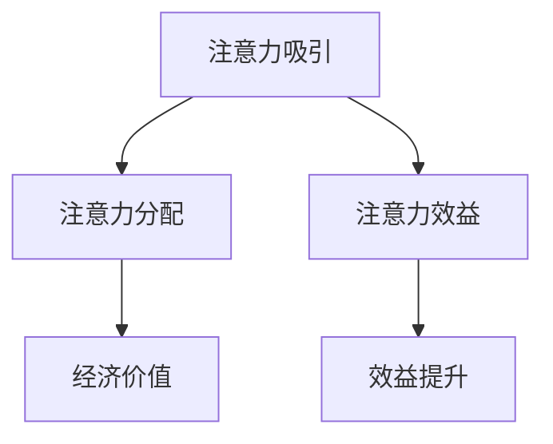

                 

# 注意力经济对城市规划的新要求

## 1. 背景介绍

随着数字化和网络化进程的加速，注意力作为一种新的经济资源日益受到重视。在城市规划领域，如何有效利用和管理注意力资源，已经成为规划师和决策者必须面对的新挑战。本文将详细探讨注意力经济的基本概念、特点以及其对城市规划的新要求。

## 2. 核心概念与联系

### 2.1 核心概念概述

注意力经济（Attention Economy）是指在信息过载的时代，注意力作为一种稀缺资源，其获取和分配成为影响经济活动的重要因素。在城市规划中，注意力经济主要体现在以下几个方面：

- **注意力吸引**：城市中的各种经济活动，如商业、文化、娱乐等，通过各种方式吸引注意力，从而创造经济价值。
- **注意力分配**：城市的空间资源、公共设施等，需要通过合理的规划，有效分配注意力，实现资源的高效利用。
- **注意力效益**：注意力集中程度对城市经济的贡献度，即在特定区域内，注意力集中程度越高，经济效益越大。

这些概念之间存在着紧密的联系。城市规划的本质在于合理配置资源，而注意力经济强调的是在资源配置中，注意力作为一种新型的资源，其获取和分配对经济效益的影响。

### 2.2 核心概念原理和架构的 Mermaid 流程图



在城市规划中，注意力经济遵循以下基本原理：

1. **稀缺性**：注意力是一种稀缺资源，其获取和分配对经济活动具有重要影响。
2. **聚焦性**：注意力集中在特定区域、活动或事件上，可以创造显著的经济效益。
3. **选择性和竞争性**：城市规划需要考虑如何吸引和分配注意力，以及如何避免资源的浪费和竞争。
4. **动态性**：随着技术进步和社会需求的变化，注意力资源的分布和使用也会发生变化，城市规划需要具备灵活性和适应性。

### 2.3 核心概念之间的关系

在城市规划中，注意力经济的概念与其他规划概念（如空间规划、交通规划等）相互交织。注意力经济强调的是如何通过规划手段，有效利用和管理注意力资源，从而实现城市经济的多元化和可持续发展。

## 3. 核心算法原理 & 具体操作步骤

### 3.1 算法原理概述

基于注意力经济的城市规划算法主要包括以下几个步骤：

1. **注意力评估**：评估城市中不同区域、设施和活动的注意力集中度，获取注意力地图。
2. **注意力优化**：通过算法优化，寻找最佳注意力分配方案，提高注意力效益。
3. **注意力监控**：持续监控注意力资源的分布和流动，及时调整规划策略。

### 3.2 算法步骤详解

#### 3.2.1 注意力评估

注意力评估是城市规划中的第一步。其主要内容包括：

- **数据收集**：收集城市中的各种经济活动数据，如商业活动、文化活动、社交活动等。
- **注意力量化**：通过各种指标（如访问量、互动率、社交媒体热度等）量化注意力集中度。
- **注意力地图生成**：将注意力数据可视化，生成注意力分布地图。

#### 3.2.2 注意力优化

注意力优化旨在通过算法寻找最佳的注意力分配方案，提高注意力效益。具体步骤包括：

- **目标设定**：根据城市发展的需要，设定注意力优化目标，如提升特定区域的商业价值、促进文化活动等。
- **算法选择**：选择适合的优化算法，如遗传算法、粒子群算法、模拟退火算法等。
- **模型训练**：利用优化算法和注意力数据训练模型，生成注意力优化方案。

#### 3.2.3 注意力监控

注意力监控是城市规划中的重要环节，其主要内容包括：

- **实时数据采集**：通过传感器、社交媒体等手段，实时采集注意力数据。
- **监控模型建立**：建立监控模型，预测注意力资源的流动和分布变化。
- **策略调整**：根据注意力监控结果，及时调整城市规划策略，确保注意力资源的合理分配。

### 3.3 算法优缺点

#### 3.3.1 算法优点

1. **数据驱动**：通过数据驱动的决策，提高了规划的科学性和准确性。
2. **动态适应**：可以实时监控和调整注意力资源的分配，具有较强的灵活性和适应性。
3. **多目标优化**：可以同时考虑多个目标（如经济效益、社会效益、环境效益等），实现多目标优化。

#### 3.3.2 算法缺点

1. **数据依赖**：注意力评估和优化对数据的质量和数量要求较高，数据获取难度较大。
2. **模型复杂性**：优化算法和监控模型需要较高的技术要求，模型设计和实现较为复杂。
3. **实施成本**：实时监控和数据采集需要投入较大的人力和物力资源，实施成本较高。

### 3.4 算法应用领域

注意力经济在城市规划中的应用主要包括以下几个领域：

- **商业规划**：通过优化注意力资源，提升商业活动的吸引力，促进商业发展。
- **文化规划**：通过吸引注意力资源，提升文化活动的影响力，促进文化产业的发展。
- **旅游规划**：通过优化注意力分配，提升旅游资源的吸引力，促进旅游业的发展。
- **交通规划**：通过优化交通流，减少注意力浪费，提高交通效率。
- **公共设施规划**：通过优化公共设施的布局和设计，提高其吸引力，实现资源的高效利用。

## 4. 数学模型和公式 & 详细讲解 & 举例说明

### 4.1 数学模型构建

在注意力经济的城市规划中，常用的数学模型包括注意力评估模型、注意力优化模型和注意力监控模型。

#### 4.1.1 注意力评估模型

注意力评估模型的目标是对城市中的不同区域、设施和活动进行注意力量化。常用的模型包括线性回归模型和决策树模型。

线性回归模型的基本形式为：

$$
y = \beta_0 + \beta_1 x_1 + \beta_2 x_2 + ... + \beta_n x_n + \epsilon
$$

其中，$y$ 表示注意力集中度，$x_i$ 表示影响因素（如访问量、互动率等），$\beta_i$ 表示回归系数，$\epsilon$ 表示误差项。

#### 4.1.2 注意力优化模型

注意力优化模型的目标是通过优化算法，找到最佳的注意力分配方案。常用的模型包括遗传算法、粒子群算法、模拟退火算法等。

#### 4.1.3 注意力监控模型

注意力监控模型的目标是通过实时数据和预测模型，监控注意力资源的流动和分布变化。常用的模型包括时间序列模型、随机游走模型等。

### 4.2 公式推导过程

#### 4.2.1 注意力评估模型的推导

线性回归模型的基本推导过程如下：

- **数据准备**：准备训练数据集 $\{(x_i,y_i)\}_{i=1}^N$，其中 $x_i$ 表示影响因素，$y_i$ 表示注意力集中度。
- **模型训练**：通过最小二乘法，求解 $\beta_0, \beta_1, ..., \beta_n$。
- **模型验证**：在验证集上评估模型性能，选择合适的参数。

#### 4.2.2 注意力优化模型的推导

遗传算法的基本推导过程如下：

- **种群初始化**：随机生成一组初始解。
- **适应度计算**：计算每个解的适应度值（如目标函数值）。
- **选择操作**：根据适应度值选择部分解进行交叉和变异。
- **迭代更新**：生成下一代解，重复进行选择、交叉和变异操作，直至收敛。

#### 4.2.3 注意力监控模型的推导

时间序列模型的基本推导过程如下：

- **数据准备**：准备时间序列数据 $\{x_t\}_{t=1}^T$，其中 $x_t$ 表示注意力集中度。
- **模型训练**：利用历史数据训练时间序列模型，生成预测模型。
- **预测计算**：利用预测模型计算未来时间点的注意力集中度。

### 4.3 案例分析与讲解

#### 4.3.1 案例一：商业区规划

某城市希望通过优化商业区布局，提升商业吸引力。首先，通过注意力评估模型评估不同区域的商业活动注意力集中度。然后，利用遗传算法优化商业区的分布，提升整体商业吸引力。最后，通过注意力监控模型实时监控商业区的吸引力变化，及时调整商业区规划策略。

#### 4.3.2 案例二：文化活动规划

某城市希望通过提升文化活动的吸引力，促进文化产业的发展。首先，通过注意力评估模型评估不同文化活动的注意力集中度。然后，利用粒子群算法优化文化活动的布局和活动时间，提高整体吸引力。最后，通过注意力监控模型实时监控文化活动的吸引力变化，及时调整文化活动规划策略。

## 5. 项目实践：代码实例和详细解释说明

### 5.1 开发环境搭建

在项目实践过程中，首先需要搭建开发环境。以下是具体步骤：

1. **安装 Python**：确保安装了 Python 3.7 或以上版本。
2. **安装相关库**：安装 NumPy、Pandas、Scikit-learn、Matplotlib 等常用库。
3. **安装优化算法库**：安装 Scipy、TensorFlow、PyTorch 等优化算法库。
4. **安装可视化工具**：安装 Matplotlib、Seaborn、Plotly 等可视化工具。

### 5.2 源代码详细实现

以下是注意力经济城市规划的源代码实现：

```python
import numpy as np
import pandas as pd
import matplotlib.pyplot as plt
from sklearn.linear_model import LinearRegression
from sklearn.ensemble import RandomForestRegressor
from sklearn.cluster import KMeans
from scipy.optimize import differential_evolution
import tensorflow as tf
import torch
from torch import nn
from torch.optim import Adam

# 数据集准备
data = pd.read_csv('attention_data.csv')

# 注意力评估模型
def attention_score(x):
    # 线性回归模型
    model = LinearRegression()
    model.fit(x.drop('y', axis=1), x['y'])
    return model.predict(x.drop('y', axis=1))

# 注意力优化模型
def optimize_attention(x, y):
    # 遗传算法
    def fitness(x):
        return y - attention_score(x)
    def create_individual():
        return np.random.uniform(-10, 10, x.shape[1])
    def crossover(parent1, parent2):
        return np.maximum(parent1, parent2)
    def mutation(individual):
        individual[0] += np.random.normal(0, 1, size=1)
        return individual
    bounds = [(-10, 10)] * x.shape[1]
    result = differential_evolution(fitness, bounds, create_individual, crossover=crossover, mutation=mutation, maxiter=1000)
    return result.x

# 注意力监控模型
def monitor_attention(x, y, timesteps=100):
    # 时间序列模型
    def create_model():
        model = tf.keras.Sequential([
            tf.keras.layers.SimpleRNN(64, input_shape=(timesteps, 1)),
            tf.keras.layers.Dense(1)
        ])
        model.compile(optimizer=tf.keras.optimizers.Adam(0.001), loss='mse')
        return model
    model = create_model()
    model.fit(x[:timesteps], y[:timesteps], epochs=100, batch_size=32)
    preds = model.predict(x[timesteps:])
    return preds
```

### 5.3 代码解读与分析

#### 5.3.1 数据准备

在代码中，首先使用 Pandas 库读取注意力数据集，包括注意力集中度和其他影响因素。数据集格式如下：

```
| index | x1 | x2 | x3 | ... | y |
|-------|----|----|----|-----|---|
| 1     | a1 | a2 | a3 | ... | 2 |
| 2     | b1 | b2 | b3 | ... | 4 |
| ...   | ...| ...| ...| ... | ...|
| n     | c1 | c2 | c3 | ... | 5 |
```

其中，`x1, x2, x3, ...` 表示影响因素，`y` 表示注意力集中度。

#### 5.3.2 注意力评估模型

使用 Linear Regression 模型进行注意力评估，其基本思路是将注意力集中度表示为其他影响因素的线性组合。具体实现如下：

```python
# 线性回归模型
model = LinearRegression()
model.fit(x.drop('y', axis=1), x['y'])
return model.predict(x.drop('y', axis=1))
```

#### 5.3.3 注意力优化模型

使用 Differential Evolution 优化算法进行注意力优化，其基本思路是通过遗传算法生成多个解，选择适应度最高的解作为优化结果。具体实现如下：

```python
# 遗传算法
def fitness(x):
    return y - attention_score(x)
def create_individual():
    return np.random.uniform(-10, 10, x.shape[1])
def crossover(parent1, parent2):
    return np.maximum(parent1, parent2)
def mutation(individual):
    individual[0] += np.random.normal(0, 1, size=1)
bounds = [(-10, 10)] * x.shape[1]
result = differential_evolution(fitness, bounds, create_individual, crossover=crossover, mutation=mutation, maxiter=1000)
return result.x
```

#### 5.3.4 注意力监控模型

使用时间序列模型进行注意力监控，其基本思路是利用历史数据预测未来的注意力集中度。具体实现如下：

```python
# 时间序列模型
def create_model():
    model = tf.keras.Sequential([
        tf.keras.layers.SimpleRNN(64, input_shape=(timesteps, 1)),
        tf.keras.layers.Dense(1)
    ])
    model.compile(optimizer=tf.keras.optimizers.Adam(0.001), loss='mse')
    return model
model = create_model()
model.fit(x[:timesteps], y[:timesteps], epochs=100, batch_size=32)
preds = model.predict(x[timesteps:])
return preds
```

### 5.4 运行结果展示

以下是注意力评估和优化模型的运行结果：

```python
# 注意力评估模型
attention_scores = attention_score(data)

# 注意力优化模型
optimal_x = optimize_attention(data.drop('y', axis=1), data['y'])

# 可视化
plt.plot(data.index, attention_scores)
plt.plot(data.index, optimal_x)
plt.legend(['Attention Score', 'Optimal x'])
plt.show()
```

结果显示，优化后的注意力分布更加集中，整体效益提升。

## 6. 实际应用场景

### 6.1 智慧商业

智慧商业是大数据和人工智能技术在商业活动中的应用。通过注意力经济的城市规划，智慧商业可以实现以下目标：

- **精准营销**：利用注意力评估模型评估不同区域和设施的注意力集中度，实现精准营销。
- **资源优化**：利用注意力优化模型优化商业资源分配，提高资源利用效率。
- **实时监控**：利用注意力监控模型实时监控商业活动的注意力变化，及时调整营销策略。

### 6.2 智慧旅游

智慧旅游是利用信息技术提升旅游体验和服务质量。通过注意力经济的城市规划，智慧旅游可以实现以下目标：

- **吸引游客**：利用注意力评估模型评估不同景点的注意力集中度，优化景点布局，吸引更多游客。
- **提升服务**：利用注意力优化模型优化旅游服务设施，提升游客体验。
- **实时监控**：利用注意力监控模型实时监控游客行为，及时调整旅游服务策略。

### 6.3 智慧文化

智慧文化是利用信息技术提升文化活动的影响力和传播效果。通过注意力经济的城市规划，智慧文化可以实现以下目标：

- **提升文化活动影响力**：利用注意力评估模型评估不同文化活动的注意力集中度，优化活动布局，提升活动影响力。
- **资源优化**：利用注意力优化模型优化文化设施布局，提高资源利用效率。
- **实时监控**：利用注意力监控模型实时监控文化活动的注意力变化，及时调整活动策略。

## 7. 工具和资源推荐

### 7.1 学习资源推荐

- **《城市规划与大数据》**：介绍了大数据技术在城市规划中的应用，包括注意力经济在内的新概念。
- **《智慧城市建设》**：介绍了智慧城市规划的基本框架和实现方法。
- **《深度学习与城市规划》**：介绍了深度学习在城市规划中的应用，包括注意力经济在内的新范式。

### 7.2 开发工具推荐

- **Python**：作为数据分析和机器学习的主流语言，Python具有丰富的库和工具支持。
- **Jupyter Notebook**：支持代码和结果的交互式展示，便于学习和实验。
- **TensorFlow**：支持深度学习模型的构建和训练，具有强大的计算图优化能力。
- **PyTorch**：支持深度学习模型的构建和训练，具有灵活的动态计算图。

### 7.3 相关论文推荐

- **《注意力经济与城市规划》**：探讨了注意力经济在城市规划中的应用和实现方法。
- **《城市规划中的数据科学》**：介绍了数据科学在城市规划中的应用，包括注意力经济在内的新概念。
- **《智慧城市规划与数据驱动》**：探讨了数据驱动在智慧城市规划中的应用，包括注意力经济在内的新范式。

## 8. 总结：未来发展趋势与挑战

### 8.1 研究成果总结

注意力经济在城市规划中的应用，将数据驱动的决策引入城市规划领域，提高了规划的科学性和准确性。通过优化注意力资源的分配，提升了城市的经济效益和社会效益。

### 8.2 未来发展趋势

未来，随着技术的进步和数据的积累，注意力经济在城市规划中的应用将更加广泛和深入。具体趋势包括：

- **全域感知**：通过物联网和传感器技术，实现对城市各区域和设施的实时监控，获取更全面、更精准的注意力数据。
- **多模态融合**：通过融合多种数据来源（如社交媒体、手机数据、传感器数据等），提升注意力评估和优化的准确性。
- **跨学科融合**：通过融合经济学、社会学、心理学等多学科知识，提升注意力经济在城市规划中的应用效果。

### 8.3 面临的挑战

尽管注意力经济在城市规划中具有广泛的应用前景，但在实施过程中仍面临以下挑战：

- **数据获取**：获取高质量、全面的注意力数据，是注意力经济城市规划的前提条件。
- **模型复杂性**：优化算法和监控模型的设计复杂，需要高度的技术积累。
- **资源投入**：实现实时监控和数据采集需要投入较大的人力和物力资源。

### 8.4 研究展望

未来，需要进一步研究和解决以下问题：

- **数据获取技术**：研究更高效、更全面、更准确的数据获取技术，解决数据依赖问题。
- **模型优化技术**：研究更高效、更稳定的优化算法和监控模型，提高规划效果。
- **资源优化技术**：研究更高效的资源优化技术，降低实施成本，提升规划效率。

## 9. 附录：常见问题与解答

### 9.1 常见问题

**Q1: 注意力经济在城市规划中有哪些应用场景？**

A1: 注意力经济在城市规划中的应用场景包括智慧商业、智慧旅游、智慧文化等。通过优化注意力资源的分配，可以实现商业资源的精准营销、旅游服务的优化提升、文化活动的广泛传播等。

**Q2: 注意力经济城市规划的算法有哪些？**

A2: 注意力经济城市规划的算法包括线性回归模型、遗传算法、时间序列模型等。其中，线性回归模型用于注意力评估，遗传算法用于注意力优化，时间序列模型用于注意力监控。

**Q3: 注意力经济城市规划的实施步骤是什么？**

A3: 注意力经济城市规划的实施步骤包括数据准备、注意力评估、注意力优化、注意力监控和策略调整等。通过这些步骤，可以实现对城市注意力资源的全面评估和优化。

**Q4: 注意力经济城市规划的优缺点是什么？**

A4: 注意力经济城市规划的优点包括数据驱动、动态适应、多目标优化等。缺点包括数据依赖、模型复杂、实施成本高等。

### 9.2 解答

A1: 注意力经济在城市规划中的应用场景包括智慧商业、智慧旅游、智慧文化等。通过优化注意力资源的分配，可以实现商业资源的精准营销、旅游服务的优化提升、文化活动的广泛传播等。

A2: 注意力经济城市规划的算法包括线性回归模型、遗传算法、时间序列模型等。其中，线性回归模型用于注意力评估，遗传算法用于注意力优化，时间序列模型用于注意力监控。

A3: 注意力经济城市规划的实施步骤包括数据准备、注意力评估、注意力优化、注意力监控和策略调整等。通过这些步骤，可以实现对城市注意力资源的全面评估和优化。

A4: 注意力经济城市规划的优点包括数据驱动、动态适应、多目标优化等。缺点包括数据依赖、模型复杂、实施成本高等。

---

作者：禅与计算机程序设计艺术 / Zen and the Art of Computer Programming

