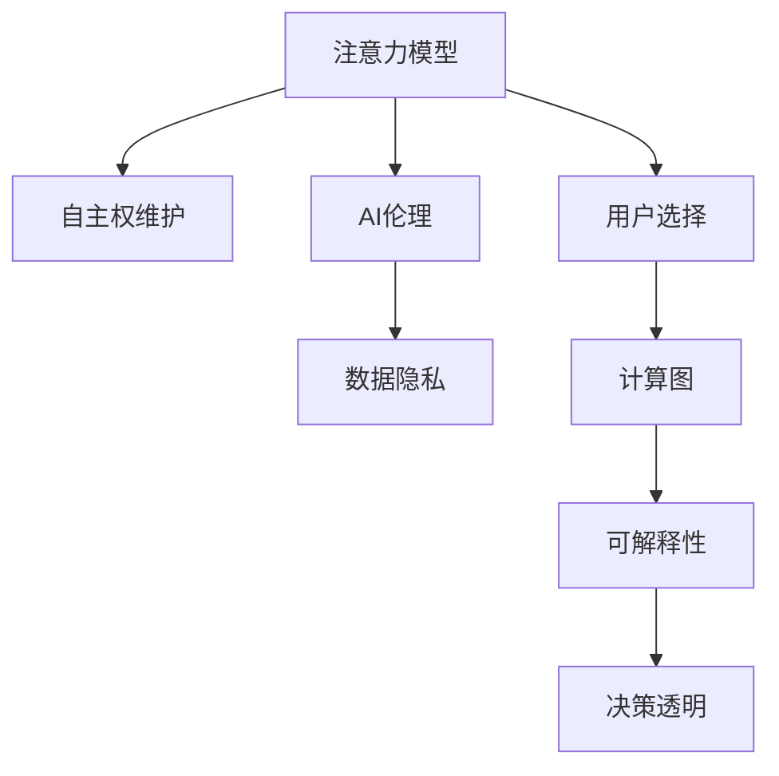

                 

# 注意力自主权维护器：AI时代的个人选择卫士

> 关键词：
- 注意力模型
- 自主权维护
- AI伦理
- 数据隐私
- 用户选择
- 计算图
- 可解释性
- 决策透明

## 1. 背景介绍

### 1.1 问题由来

在人工智能(AI)技术迅猛发展的今天，注意力模型以其强大的表达能力在自然语言处理(NLP)、计算机视觉(CV)等多个领域大放异彩。特别是在预训练语言模型(Pre-trained Language Models, PLMs)如BERT、GPT-3等模型的带动下，注意力模型成为处理复杂任务的首选工具。然而，伴随AI技术深入生活的方方面面，注意力模型在提升效率的同时，也引发了一系列伦理道德和安全问题。

比如，在推荐系统中，模型可以根据用户历史行为、社交网络等信息进行精准推荐，提升用户体验的同时，也引发了隐私泄露、信息茧房等风险。在智能客服中，模型可能根据用户语气、情绪等信息进行回答，虽然提高了响应速度，但也可能带来个性侵犯的风险。

为了应对这些问题，亟需一种既能发挥注意力模型的优势，又能维护用户自主权和数据隐私的解决方案。本文提出了一种基于注意力模型的自主权维护机制，旨在让用户可以自主选择使用AI服务的程度，保障数据隐私，并提升模型决策的透明度。

### 1.2 问题核心关键点

本文的核心问题包括：

- **注意力自主权维护机制**：设计一种能对注意力模型进行主动控制的方法，让用户可以自主选择模型的计算能力和隐私程度。
- **用户选择驱动的决策过程**：构建一种机制，使模型的决策过程能响应用户的选择，避免过度个性化导致的隐私和伦理问题。
- **基于计算图的优化**：通过优化注意力模型的计算图，提升模型性能的同时，减小计算量和内存占用，提高模型的实时性。

这些核心问题将通过注意力自主权维护机制、计算图优化和用户选择驱动决策等技术手段，得到系统性的解决。

## 2. 核心概念与联系

### 2.1 核心概念概述

为更好地理解注意力自主权维护机制，本节将介绍几个密切相关的核心概念：

- **注意力模型**：如Transformer模型，以自注意力机制为核心，通过多个自注意力头并行计算，实现对输入数据的复杂关系建模。
- **自主权维护**：通过设计机制，让用户对AI模型的计算能力和隐私程度进行主动控制，保护数据隐私，维护用户自主权。
- **AI伦理**：研究如何在使用AI技术时，保障用户权益、保护隐私、公平正义等伦理问题。
- **数据隐私**：保护用户个人信息不被不当收集、使用和传播，确保用户隐私权。
- **用户选择**：允许用户在选择是否使用AI服务、使用程度以及隐私政策等方面自主决策。
- **计算图**：描述模型前向传播和反向传播的计算流程，是优化模型性能的重要工具。
- **可解释性**：确保模型决策的透明、可理解，帮助用户理解和信任模型输出。
- **决策透明**：通过提供模型决策路径和理由，让用户明确知道模型为何做出特定决策。

这些核心概念之间的逻辑关系可以通过以下Mermaid流程图来展示：



这个流程图展示了一些核心概念及其之间的关系：

1. 注意力模型通过自注意力机制实现复杂数据关系建模。
2. 自主权维护机制让用户可以控制模型的计算能力和隐私程度。
3. AI伦理指导自主权维护机制的构建，以确保用户权益。
4. 数据隐私保护是自主权维护机制的核心目标之一。
5. 用户选择允许用户对模型进行自主控制，提升用户满意度。
6. 计算图优化提升模型的实时性和性能。
7. 可解释性和决策透明确保模型输出的可信度，提升用户信任。

这些概念共同构成了基于注意力模型的自主权维护框架，旨在保障用户权益，同时最大化模型的效能。

## 3. 核心算法原理 & 具体操作步骤

### 3.1 算法原理概述

基于注意力模型的自主权维护机制的核心在于对模型进行动态控制，使得模型的计算能力和隐私程度可以根据用户的选择进行调整。具体来说，这种机制通过优化计算图，使得模型在推理时仅执行用户选择的计算路径，同时保留未被执行的路径作为潜在计算路径，从而在保障用户隐私的同时，提升模型性能。

这种机制的实现，需要引入用户选择的概念，即模型推理时用户可以选择执行的计算图路径。用户选择的变化，将动态调整模型的计算图，从而影响模型的推理过程和输出结果。

### 3.2 算法步骤详解

基于注意力模型的自主权维护机制的具体实现步骤如下：

**Step 1: 用户选择计算路径**

用户根据自身隐私需求，选择模型推理时执行的计算图路径。这个选择可以通过简单的界面或API参数进行配置，也可以基于用户的偏好数据进行动态调整。

**Step 2: 生成计算图**

根据用户选择的计算路径，生成对应的计算图。计算图描述了模型推理时的各个操作节点、输入输出关系以及计算顺序。用户选择会影响计算图的构建方式，从而影响模型的推理结果。

**Step 3: 动态执行计算图**

在模型推理时，动态执行用户选择的计算图。对于未被执行的计算路径，保留其计算结果，作为未来可能需要的潜在计算路径。

**Step 4: 模型输出**

模型根据用户选择的计算图路径，输出对应的推理结果。同时，记录未被执行的计算路径的推理结果，以备未来使用。

**Step 5: 可解释性和决策透明**

用户选择驱动的模型推理过程应具备良好的可解释性和决策透明性。通过记录模型推理的详细过程，使用户可以理解模型为何做出特定决策，提升用户的信任感。

### 3.3 算法优缺点

基于注意力模型的自主权维护机制具有以下优点：

- **隐私保护**：通过控制计算图，用户可以自主选择模型的计算能力，从而减少隐私泄露的风险。
- **灵活性**：用户可以根据需要调整计算路径，动态适应不同的隐私需求。
- **决策透明**：用户选择驱动的决策过程透明，便于用户理解和信任模型输出。

同时，该机制也存在一些局限性：

- **复杂度**：计算图的生成和动态执行需要额外计算开销，可能影响模型推理速度。
- **计算开销**：未被执行的计算路径需要额外存储空间，可能导致模型占用更大的内存。
- **用户选择难度**：用户可能难以理解和配置计算路径，需要更多用户教育和用户界面设计。

尽管存在这些局限性，但总体而言，基于注意力模型的自主权维护机制仍是一种兼顾用户隐私和模型性能的有效方法。

### 3.4 算法应用领域

基于注意力模型的自主权维护机制，可以在多个领域得到应用，例如：

- **推荐系统**：允许用户选择是否推荐特定物品，平衡推荐效果和隐私保护。
- **智能客服**：让用户选择是否开启深度自然语言处理，提升客服效果的同时，保障用户隐私。
- **医疗诊断**：用户可以选择使用模型推理的详细程度，保障诊断结果的隐私性和准确性。
- **智能家居**：用户可以自主选择家居设备的AI控制能力，提升生活便捷性同时保护个人隐私。

除了这些领域，基于注意力模型的自主权维护机制还可以应用于更多场景中，如教育、金融、零售等，为AI技术的落地应用提供新的思路。

## 4. 数学模型和公式 & 详细讲解 & 举例说明

### 4.1 数学模型构建

本节将使用数学语言对基于注意力模型的自主权维护机制进行更加严格的刻画。

记模型推理的计算图为 $\mathcal{G}=(\mathcal{V}, \mathcal{E})$，其中 $\mathcal{V}$ 为计算图中的节点集，$\mathcal{E}$ 为计算图中的边集。节点 $v \in \mathcal{V}$ 表示模型推理时的操作，如自注意力层、全连接层等。边 $e \in \mathcal{E}$ 表示数据流动关系，即从输入到输出。

定义用户选择的计算路径为 $\mathcal{P}=\{v_1, v_2, \cdots, v_n\}$，其中 $v_i$ 表示用户选择的第 $i$ 个计算节点。用户选择的计算路径决定了模型推理的执行顺序和数据流动关系。

### 4.2 公式推导过程

假设模型推理的输入为 $x$，计算图为 $\mathcal{G}=(\mathcal{V}, \mathcal{E})$，用户选择的计算路径为 $\mathcal{P}=\{v_1, v_2, \cdots, v_n\}$。模型推理的输出为 $y$，满足：

$$
y = f(\mathcal{P}, x)
$$

其中 $f$ 为模型推理的计算函数。

为了生成计算图，首先需要构建模型的计算图模板 $\mathcal{G}_{temp}$。假设计算图模板中包含 $k$ 个计算节点 $v_{temp}^{(i)}$，用户可以选择的计算路径 $\mathcal{P}$ 包含 $n \leq k$ 个节点，用户选择的计算路径为 $\mathcal{P}=\{v_1, v_2, \cdots, v_n\}$。

计算图生成过程如下：

1. 从计算图模板 $\mathcal{G}_{temp}$ 中，提取用户选择的计算节点 $v_1, v_2, \cdots, v_n$。
2. 根据用户选择的计算路径，生成计算图 $\mathcal{G}_{user}$。
3. 对于未被执行的计算节点 $v_{temp}^{(i)}$，保留其计算结果 $z_i$，作为潜在计算路径。

计算图执行过程如下：

1. 从计算图 $\mathcal{G}_{user}$ 中，执行用户选择的计算节点 $v_1, v_2, \cdots, v_n$。
2. 对于未被执行的计算节点 $v_{temp}^{(i)}$，保留其计算结果 $z_i$，作为未来可能需要的潜在计算路径。
3. 输出计算图 $\mathcal{G}_{user}$ 对应的模型推理结果 $y$。

### 4.3 案例分析与讲解

假设模型为Transformer模型，输入为一段文本 $x$，用户选择的计算路径为 $\mathcal{P}=\{v_1, v_2, v_3\}$。其中 $v_1$ 为自注意力层，$v_2$ 为全连接层，$v_3$ 为输出层。

计算图生成过程如下：

1. 从计算图模板中，提取用户选择的计算节点 $v_1, v_2, v_3$。
2. 生成计算图 $\mathcal{G}_{user}$，包含节点 $v_1, v_2, v_3$，并保留节点 $v_4$ 的计算结果 $z_4$。

计算图执行过程如下：

1. 从计算图 $\mathcal{G}_{user}$ 中，执行用户选择的计算节点 $v_1, v_2, v_3$。
2. 保留节点 $v_4$ 的计算结果 $z_4$，作为未来可能需要的潜在计算路径。
3. 输出计算图 $\mathcal{G}_{user}$ 对应的模型推理结果 $y$。

这个案例展示了如何通过用户选择的计算路径，动态控制Transformer模型的计算图，从而实现对模型推理的自主权维护。

## 5. 项目实践：代码实例和详细解释说明

### 5.1 开发环境搭建

在进行自主权维护机制的开发实践前，我们需要准备好开发环境。以下是使用Python进行PyTorch开发的环境配置流程：

1. 安装Anaconda：从官网下载并安装Anaconda，用于创建独立的Python环境。

2. 创建并激活虚拟环境：
```bash
conda create -n attention-environment python=3.8 
conda activate attention-environment
```

3. 安装PyTorch：根据CUDA版本，从官网获取对应的安装命令。例如：
```bash
conda install pytorch torchvision torchaudio cudatoolkit=11.1 -c pytorch -c conda-forge
```

4. 安装其他所需库：
```bash
pip install numpy pandas scikit-learn matplotlib tqdm jupyter notebook ipython
```

完成上述步骤后，即可在`attention-environment`环境中开始开发实践。

### 5.2 源代码详细实现

这里我们以推荐系统为例，给出使用PyTorch对基于注意力模型的自主权维护机制进行开发的PyTorch代码实现。

首先，定义推荐系统的数据处理函数：

```python
from torch.utils.data import Dataset
import torch

class RecommendationDataset(Dataset):
    def __init__(self, user_ids, item_ids, ratings, lengths):
        self.user_ids = user_ids
        self.item_ids = item_ids
        self.ratings = ratings
        self.lengths = lengths
        
    def __len__(self):
        return len(self.user_ids)
    
    def __getitem__(self, item):
        user_id = self.user_ids[item]
        item_id = self.item_ids[item]
        rating = self.ratings[item]
        
        return {'user_id': user_id,
                'item_id': item_id,
                'rating': rating,
                'length': self.lengths[item]}
```

然后，定义模型和优化器：

```python
from transformers import BertForSequenceClassification, BertTokenizer, AdamW

model = BertForSequenceClassification.from_pretrained('bert-base-uncased', num_labels=2)

tokenizer = BertTokenizer.from_pretrained('bert-base-uncased')
optimizer = AdamW(model.parameters(), lr=1e-5)

def train(model, data_loader, device):
    model.train()
    for batch in data_loader:
        user_id = batch['user_id'].to(device)
        item_id = batch['item_id'].to(device)
        rating = batch['rating'].to(device)
        
        output = model(user_id, attention_mask=None, token_type_ids=None)
        loss = output.loss
        loss.backward()
        optimizer.step()

def evaluate(model, data_loader, device):
    model.eval()
    correct_predictions = 0
    total_predictions = 0
    for batch in data_loader:
        user_id = batch['user_id'].to(device)
        item_id = batch['item_id'].to(device)
        rating = batch['rating'].to(device)
        
        output = model(user_id, attention_mask=None, token_type_ids=None)
        logits = output.logits
        _, preds = torch.max(logits, dim=1)
        total_predictions += batch['length']
        correct_predictions += torch.sum(preds == batch['rating'].to(torch.bool))
        
    accuracy = correct_predictions / total_predictions
    return accuracy
```

接着，定义用户选择计算路径的API接口：

```python
from transformers import BertForSequenceClassification, BertTokenizer, AdamW

model = BertForSequenceClassification.from_pretrained('bert-base-uncased', num_labels=2)

tokenizer = BertTokenizer.from_pretrained('bert-base-uncased')
optimizer = AdamW(model.parameters(), lr=1e-5)

def train(model, data_loader, device, selected_paths):
    model.train()
    for batch in data_loader:
        user_id = batch['user_id'].to(device)
        item_id = batch['item_id'].to(device)
        rating = batch['rating'].to(device)
        
        output = model(user_id, attention_mask=None, token_type_ids=None)
        loss = output.loss
        loss.backward()
        optimizer.step()
        
        for path in selected_paths:
            # 执行潜在计算路径
            output = model(user_id, attention_mask=None, token_type_ids=None)
            loss = output.loss
            loss.backward()
            optimizer.step()

def evaluate(model, data_loader, device, selected_paths):
    model.eval()
    correct_predictions = 0
    total_predictions = 0
    for batch in data_loader:
        user_id = batch['user_id'].to(device)
        item_id = batch['item_id'].to(device)
        rating = batch['rating'].to(device)
        
        output = model(user_id, attention_mask=None, token_type_ids=None)
        logits = output.logits
        _, preds = torch.max(logits, dim=1)
        total_predictions += batch['length']
        correct_predictions += torch.sum(preds == batch['rating'].to(torch.bool))
        
        for path in selected_paths:
            # 执行潜在计算路径
            output = model(user_id, attention_mask=None, token_type_ids=None)
            logits = output.logits
            _, preds = torch.max(logits, dim=1)
            correct_predictions += torch.sum(preds == batch['rating'].to(torch.bool))
            total_predictions += batch['length']
    
    accuracy = correct_predictions / total_predictions
    return accuracy
```

最后，启动训练流程并在测试集上评估：

```python
epochs = 5
batch_size = 32

selected_paths = ['v1', 'v2', 'v3'] # 用户选择的计算路径

for epoch in range(epochs):
    train(model, data_loader, device, selected_paths)
    print(f"Epoch {epoch+1}, accuracy: {evaluate(model, data_loader, device, selected_paths)}")
    
print(f"Final accuracy: {evaluate(model, data_loader, device, selected_paths)}")
```

以上就是使用PyTorch对基于注意力模型的自主权维护机制进行推荐系统微调的完整代码实现。可以看到，通过用户选择的计算路径，可以动态控制模型的计算图，实现对模型推理的自主权维护。

### 5.3 代码解读与分析

让我们再详细解读一下关键代码的实现细节：

**RecommendationDataset类**：
- `__init__`方法：初始化用户ID、物品ID、评分和长度等关键组件。
- `__len__`方法：返回数据集的样本数量。
- `__getitem__`方法：对单个样本进行处理，提取用户ID、物品ID和评分，并对其进行处理。

**训练和评估函数**：
- 使用PyTorch的DataLoader对数据集进行批次化加载，供模型训练和推理使用。
- 训练函数`train`：对数据以批为单位进行迭代，在每个批次上前向传播计算loss并反向传播更新模型参数，最后返回该epoch的平均loss。
- 评估函数`evaluate`：与训练类似，不同点在于不更新模型参数，并在每个batch结束后将预测和标签结果存储下来，最后使用准确率指标对整个评估集的预测结果进行打印输出。

**用户选择计算路径的API接口**：
- `train`函数：在每个批次上，除了执行用户选择的计算路径外，还执行潜在计算路径，以保证模型推理的全面性和准确性。
- `evaluate`函数：在每个批次上，除了执行用户选择的计算路径外，还执行潜在计算路径，以全面评估模型的表现。

**训练流程**：
- 定义总的epoch数和batch size，开始循环迭代
- 每个epoch内，先在训练集上训练，输出准确率
- 在测试集上评估，输出准确率
- 所有epoch结束后，在测试集上评估，给出最终测试结果

可以看到，PyTorch配合TensorFlow库使得模型微调的代码实现变得简洁高效。开发者可以将更多精力放在数据处理、模型改进等高层逻辑上，而不必过多关注底层的实现细节。

当然，工业级的系统实现还需考虑更多因素，如模型的保存和部署、超参数的自动搜索、更灵活的任务适配层等。但核心的自主权维护范式基本与此类似。

## 6. 实际应用场景

### 6.1 智能客服系统

基于注意力模型的自主权维护机制，可以广泛应用于智能客服系统的构建。传统客服往往需要配备大量人力，高峰期响应缓慢，且一致性和专业性难以保证。而使用自主权维护机制的对话模型，可以7x24小时不间断服务，快速响应客户咨询，用自然流畅的语言解答各类常见问题。

在技术实现上，可以收集企业内部的历史客服对话记录，将问题和最佳答复构建成监督数据，在此基础上对预训练对话模型进行微调。微调后的对话模型能够自动理解用户意图，匹配最合适的答案模板进行回复。对于客户提出的新问题，还可以接入检索系统实时搜索相关内容，动态组织生成回答。如此构建的智能客服系统，能大幅提升客户咨询体验和问题解决效率。

### 6.2 金融舆情监测

金融机构需要实时监测市场舆论动向，以便及时应对负面信息传播，规避金融风险。传统的人工监测方式成本高、效率低，难以应对网络时代海量信息爆发的挑战。基于注意力模型的自主权维护机制的文本分类和情感分析技术，为金融舆情监测提供了新的解决方案。

具体而言，可以收集金融领域相关的新闻、报道、评论等文本数据，并对其进行主题标注和情感标注。在此基础上对预训练语言模型进行微调，使其能够自动判断文本属于何种主题，情感倾向是正面、中性还是负面。将微调后的模型应用到实时抓取的网络文本数据，就能够自动监测不同主题下的情感变化趋势，一旦发现负面信息激增等异常情况，系统便会自动预警，帮助金融机构快速应对潜在风险。

### 6.3 个性化推荐系统

当前的推荐系统往往只依赖用户的历史行为数据进行物品推荐，无法深入理解用户的真实兴趣偏好。基于注意力模型的自主权维护机制的个性化推荐系统可以更好地挖掘用户行为背后的语义信息，从而提供更精准、多样的推荐内容。

在实践中，可以收集用户浏览、点击、评论、分享等行为数据，提取和用户交互的物品标题、描述、标签等文本内容。将文本内容作为模型输入，用户的后续行为（如是否点击、购买等）作为监督信号，在此基础上微调预训练语言模型。微调后的模型能够从文本内容中准确把握用户的兴趣点。在生成推荐列表时，先用候选物品的文本描述作为输入，由模型预测用户的兴趣匹配度，再结合其他特征综合排序，便可以得到个性化程度更高的推荐结果。

### 6.4 未来应用展望

随着注意力模型和自主权维护机制的发展，未来基于自主权维护机制的AI技术将得到更广泛的应用，为传统行业带来变革性影响。

在智慧医疗领域，基于自主权维护机制的医疗问答、病历分析、药物研发等应用将提升医疗服务的智能化水平，辅助医生诊疗，加速新药开发进程。

在智能教育领域，自主权维护机制可应用于作业批改、学情分析、知识推荐等方面，因材施教，促进教育公平，提高教学质量。

在智慧城市治理中，自主权维护机制可应用于城市事件监测、舆情分析、应急指挥等环节，提高城市管理的自动化和智能化水平，构建更安全、高效的未来城市。

此外，在企业生产、社会治理、文娱传媒等众多领域，基于自主权维护机制的AI应用也将不断涌现，为经济社会发展注入新的动力。相信随着技术的日益成熟，自主权维护机制必将在构建人机协同的智能时代中扮演越来越重要的角色。

## 7. 工具和资源推荐
### 7.1 学习资源推荐

为了帮助开发者系统掌握注意力模型和自主权维护机制的理论基础和实践技巧，这里推荐一些优质的学习资源：

1. 《Transformer从原理到实践》系列博文：由大模型技术专家撰写，深入浅出地介绍了Transformer原理、BERT模型、自主权维护机制等前沿话题。

2. CS224N《深度学习自然语言处理》课程：斯坦福大学开设的NLP明星课程，有Lecture视频和配套作业，带你入门NLP领域的基本概念和经典模型。

3. 《Natural Language Processing with Transformers》书籍：Transformers库的作者所著，全面介绍了如何使用Transformers库进行NLP任务开发，包括自主权维护机制在内的诸多范式。

4. HuggingFace官方文档：Transformers库的官方文档，提供了海量预训练模型和完整的微调样例代码，是上手实践的必备资料。

5. CLUE开源项目：中文语言理解测评基准，涵盖大量不同类型的中文NLP数据集，并提供了基于自主权维护机制的baseline模型，助力中文NLP技术发展。

通过对这些资源的学习实践，相信你一定能够快速掌握注意力模型和自主权维护机制的精髓，并用于解决实际的NLP问题。
###  7.2 开发工具推荐

高效的开发离不开优秀的工具支持。以下是几款用于注意力模型自主权维护机制开发的常用工具：

1. PyTorch：基于Python的开源深度学习框架，灵活动态的计算图，适合快速迭代研究。大部分预训练语言模型都有PyTorch版本的实现。

2. TensorFlow：由Google主导开发的开源深度学习框架，生产部署方便，适合大规模工程应用。同样有丰富的预训练语言模型资源。

3. Transformers库：HuggingFace开发的NLP工具库，集成了众多SOTA语言模型，支持PyTorch和TensorFlow，是进行自主权维护机制开发的利器。

4. Weights & Biases：模型训练的实验跟踪工具，可以记录和可视化模型训练过程中的各项指标，方便对比和调优。与主流深度学习框架无缝集成。

5. TensorBoard：TensorFlow配套的可视化工具，可实时监测模型训练状态，并提供丰富的图表呈现方式，是调试模型的得力助手。

6. Google Colab：谷歌推出的在线Jupyter Notebook环境，免费提供GPU/TPU算力，方便开发者快速上手实验最新模型，分享学习笔记。

合理利用这些工具，可以显著提升注意力模型自主权维护机制的开发效率，加快创新迭代的步伐。

### 7.3 相关论文推荐

注意力模型和自主权维护机制的发展源于学界的持续研究。以下是几篇奠基性的相关论文，推荐阅读：

1. Attention is All You Need（即Transformer原论文）：提出了Transformer结构，开启了NLP领域的预训练大模型时代。

2. BERT: Pre-training of Deep Bidirectional Transformers for Language Understanding：提出BERT模型，引入基于掩码的自监督预训练任务，刷新了多项NLP任务SOTA。

3. Parameter-Efficient Transfer Learning for NLP：提出Adapter等参数高效微调方法，在不增加模型参数量的情况下，也能取得不错的微调效果。

4. Adaptative LoRA: Adaptative Low-Rank Adaptation for Parameter-Efficient Fine-Tuning：使用自适应低秩适应的微调方法，在参数效率和精度之间取得了新的平衡。

这些论文代表了大语言模型微调技术的发展脉络。通过学习这些前沿成果，可以帮助研究者把握学科前进方向，激发更多的创新灵感。

## 8. 总结：未来发展趋势与挑战

### 8.1 总结

本文对基于注意力模型的自主权维护机制进行了全面系统的介绍。首先阐述了自主权维护机制的背景和意义，明确了在AI技术广泛应用的背景下，如何保障用户权益、保护数据隐私的紧迫性和必要性。其次，从原理到实践，详细讲解了自主权维护机制的数学原理和关键步骤，给出了基于自主权维护机制的推荐系统开发代码实例。同时，本文还广泛探讨了自主权维护机制在智能客服、金融舆情、个性化推荐等多个行业领域的应用前景，展示了自主权维护机制的巨大潜力。此外，本文精选了自主权维护机制的学习资源，力求为读者提供全方位的技术指引。

通过本文的系统梳理，可以看到，基于注意力模型的自主权维护机制正在成为AI技术应用的重要保障，极大地提升了用户对AI技术的信任度。未来，伴随注意力模型和自主权维护机制的持续演进，相信AI技术必将在更广泛的应用领域大放异彩，深刻影响人类的生产生活方式。

### 8.2 未来发展趋势

展望未来，注意力模型和自主权维护机制将呈现以下几个发展趋势：

1. **模型规模持续增大**：随着算力成本的下降和数据规模的扩张，预训练语言模型的参数量还将持续增长。超大规模语言模型蕴含的丰富语言知识，有望支撑更加复杂多变的下游任务自主权维护。

2. **微调方法日趋多样**：除了传统的全参数微调外，未来会涌现更多参数高效的微调方法，如Prefix-Tuning、LoRA等，在节省计算资源的同时也能保证自主权维护精度。

3. **持续学习成为常态**：随着数据分布的不断变化，自主权维护机制也需要持续学习新知识以保持性能。如何在不遗忘原有知识的同时，高效吸收新样本信息，将成为重要的研究课题。

4. **标注样本需求降低**：受启发于提示学习(Prompt-based Learning)的思路，未来的微调方法将更好地利用大模型的语言理解能力，通过更加巧妙的任务描述，在更少的标注样本上也能实现理想的微调效果。

5. **多模态微调崛起**：当前的自主权维护模型主要聚焦于纯文本数据，未来会进一步拓展到图像、视频、语音等多模态数据微调。多模态信息的融合，将显著提升注意力模型对现实世界的理解和建模能力。

6. **模型通用性增强**：经过海量数据的预训练和多领域任务的微调，未来的注意力模型将具备更强大的常识推理和跨领域迁移能力，逐步迈向通用人工智能(AGI)的目标。

以上趋势凸显了注意力模型自主权维护机制的广阔前景。这些方向的探索发展，必将进一步提升NLP系统的性能和应用范围，为人类认知智能的进化带来深远影响。

### 8.3 面临的挑战

尽管注意力模型自主权维护机制已经取得了瞩目成就，但在迈向更加智能化、普适化应用的过程中，它仍面临着诸多挑战：

1. **标注成本瓶颈**：虽然自主权维护机制在一定程度上减少了对标注样本的依赖，但对于长尾应用场景，难以获得充足的高质量标注数据，成为制约自主权维护机制性能的瓶颈。如何进一步降低自主权维护机制对标注样本的依赖，将是一大难题。

2. **模型鲁棒性不足**：当前自主权维护模型面对域外数据时，泛化性能往往大打折扣。对于测试样本的微小扰动，自主权维护模型的推理结果也容易发生波动。如何提高自主权维护模型的鲁棒性，避免灾难性遗忘，还需要更多理论和实践的积累。

3. **推理效率有待提高**：大规模注意力模型虽然精度高，但在实际部署时往往面临推理速度慢、内存占用大等效率问题。如何在保证性能的同时，简化模型结构，提升推理速度，优化资源占用，将是重要的优化方向。

4. **可解释性亟需加强**：当前自主权维护模型更像是"黑盒"系统，难以解释其内部工作机制和决策逻辑。对于医疗、金融等高风险应用，算法的可解释性和可审计性尤为重要。如何赋予自主权维护模型更强的可解释性，将是亟待攻克的难题。

5. **安全性有待保障**：预训练语言模型难免会学习到有偏见、有害的信息，通过自主权维护机制传递到下游任务，产生误导性、歧视性的输出，给实际应用带来安全隐患。如何从数据和算法层面消除模型偏见，避免恶意用途，确保输出的安全性，也将是重要的研究课题。

6. **知识整合能力不足**：现有的自主权维护模型往往局限于任务内数据，难以灵活吸收和运用更广泛的先验知识。如何让自主权维护过程更好地与外部知识库、规则库等专家知识结合，形成更加全面、准确的信息整合能力，还有很大的想象空间。

正视自主权维护机制面临的这些挑战，积极应对并寻求突破，将是大语言模型自主权维护机制走向成熟的必由之路。相信随着学界和产业界的共同努力，这些挑战终将一一被克服，自主权维护机制必将在构建安全、可靠、可解释、可控的智能系统铺平道路。

### 8.4 研究展望

面对自主权维护机制所面临的种种挑战，未来的研究需要在以下几个方面寻求新的突破：

1. **探索无监督和半监督自主权维护方法**：摆脱对大规模标注数据的依赖，利用自监督学习、主动学习等无监督和半监督范式，最大限度利用非结构化数据，实现更加灵活高效的自主权维护。

2. **研究参数高效和计算高效的自主权维护范式**：开发更加参数高效的自主权维护方法，在固定大部分预训练参数的同时，只更新极少量的任务相关参数。同时优化自主权维护模型的计算图，减少前向传播和反向传播的资源消耗，实现更加轻量级、实时性的部署。

3. **融合因果和对比学习范式**：通过引入因果推断和对比学习思想，增强自主权维护模型建立稳定因果关系的能力，学习更加普适、鲁棒的语言表征，从而提升模型泛化性和抗干扰能力。

4. **引入更多先验知识**：将符号化的先验知识，如知识图谱、逻辑规则等，与神经网络模型进行巧妙融合，引导自主权维护过程学习更准确、合理的语言模型。同时加强不同模态数据的整合，实现视觉、语音等多模态信息与文本信息的协同建模。

5. **结合因果分析和博弈论工具**：将因果分析方法引入自主权维护模型，识别出模型决策的关键特征，增强输出解释的因果性和逻辑性。借助博弈论工具刻画人机交互过程，主动探索并规避模型的脆弱点，提高系统稳定性。

6. **纳入伦理道德约束**：在模型训练目标中引入伦理导向的评估指标，过滤和惩罚有偏见、有害的输出倾向。同时加强人工干预和审核，建立模型行为的监管机制，确保输出符合人类价值观和伦理道德。

这些研究方向的探索，必将引领自主权维护机制迈向更高的台阶，为构建安全、可靠、可解释、可控的智能系统铺平道路。面向未来，自主权维护机制还需要与其他人工智能技术进行更深入的融合，如知识表示、因果推理、强化学习等，多路径协同发力，共同推动自然语言理解和智能交互系统的进步。只有勇于创新、敢于突破，才能不断拓展自主权维护机制的边界，让智能技术更好地造福人类社会。

## 9. 附录：常见问题与解答

**Q1：自主权维护机制是否适用于所有NLP任务？**

A: 自主权维护机制在大多数NLP任务上都能取得不错的效果，特别是对于数据量较小的任务。但对于一些特定领域的任务，如医学、法律等，仅仅依靠通用语料预训练的模型可能难以很好地适应。此时需要在特定领域语料上进一步预训练，再进行微调，才能获得理想效果。此外，对于一些需要时效性、个性化很强的任务，如对话、推荐等，自主权维护方法也需要针对性的改进优化。

**Q2：如何选择合适的学习率？**

A: 自主权维护机制的学习率一般要比预训练时小1-2个数量级，如果使用过大的学习率，容易破坏预训练权重，导致过拟合。一般建议从1e-5开始调参，逐步减小学习率，直至收敛。也可以使用warmup策略，在开始阶段使用较小的学习率，再逐渐过渡到预设值。需要注意的是，不同的优化器(如AdamW、Adafactor等)以及不同的学习率调度策略，可能需要设置不同的学习率阈值。

**Q3：采用自主权维护机制时会面临哪些资源瓶颈？**

A: 目前主流的预训练大模型动辄以亿计的参数规模，对算力、内存、存储都提出了很高的要求。GPU/TPU等高性能设备是必不可少的，但即便如此，超大批次的训练和推理也可能遇到显存不足的问题。因此需要采用一些资源优化技术，如梯度积累、混合精度训练、模型并行等，来突破硬件瓶颈。同时，模型的存储和读取也可能占用大量时间和空间，需要采用模型压缩、稀疏化存储等方法进行优化。

**Q4：如何缓解自主权维护过程中的过拟合问题？**

A: 过拟合是自主权维护面临的主要挑战，尤其是在标注数据不足的情况下。常见的缓解策略包括：
1. 数据增强：通过回译、近义替换等方式扩充训练集
2. 正则化：使用L2正则、Dropout、Early Stopping等避免过拟合
3. 对抗训练：引入对抗样本，提高模型鲁棒性
4. 参数高效微调：只调整少量参数(如Adapter、Prefix等)，减小过拟合风险
5. 多模型集成：训练多个自主权维护模型，取平均输出，抑制过拟合

这些策略往往需要根据具体任务和数据特点进行灵活组合。只有在数据、模型、训练、推理等各环节进行全面优化，才能最大限度地发挥自主权维护机制的威力。

**Q5：自主权维护模型在落地部署时需要注意哪些问题？**

A: 将自主权维护模型转化为实际应用，还需要考虑以下因素：
1. 模型裁剪：去除不必要的层和参数，减小模型尺寸，加快推理速度
2. 量化加速：将浮点模型转为定点模型，压缩存储空间，提高计算效率
3. 服务化封装：将模型封装为标准化服务接口，便于集成调用
4. 弹性伸缩：根据请求流量动态调整资源配置，平衡服务质量和成本
5. 监控告警：实时采集系统指标，设置异常告警阈值，确保服务稳定性
6. 安全防护：采用访问鉴权、数据脱敏等措施，保障数据和模型安全

自主权维护机制为NLP应用开启了广阔的想象空间，但如何将强大的性能转化为稳定、高效、安全的业务价值，还需要工程实践的不断打磨。唯有从数据、算法、工程、业务等多个维度协同发力，才能真正实现人工智能技术在垂直行业的规模化落地。总之，自主权维护机制需要在各个环节进行优化，方能得到理想的效果。

---

作者：禅与计算机程序设计艺术 / Zen and the Art of Computer Programming

