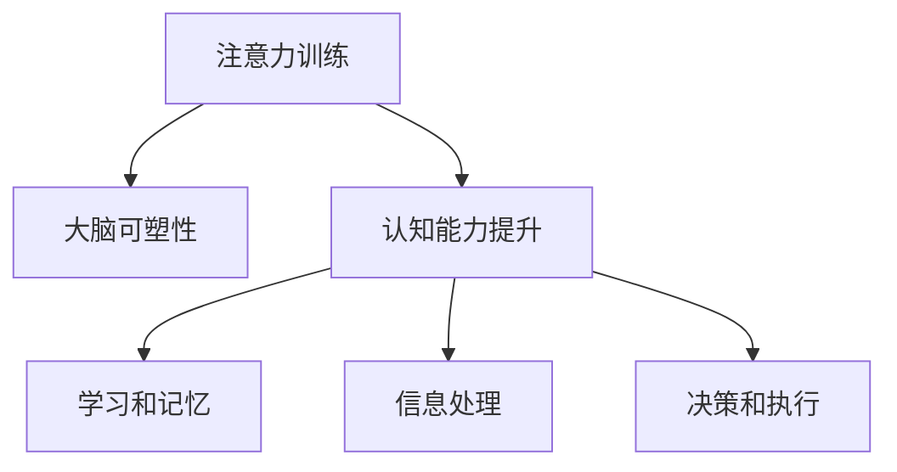

                 

# 注意力训练与大脑可塑性：通过专注力增强认知能力

> 关键词：注意力训练,大脑可塑性,认知能力提升,专注力,神经科学,深度学习,脑机接口,认知科学

## 1. 背景介绍

### 1.1 问题由来

在现代社会的快节奏生活中，注意力缺陷和学习能力下降的问题越来越常见。人们面临着信息爆炸的挑战，如何在海量信息中快速抓取关键点，保持高效专注，成为一个亟待解决的问题。同时，人类大脑的可塑性也引起了广泛关注，研究表明，通过适当的训练，人类大脑可以在多个方面进行优化和提升。

注意力训练和大脑可塑性是大数据时代的重要研究课题，通过科技手段，尤其是深度学习算法，可以对人类注意力和认知能力进行系统的训练和提升。本文将深入探讨注意力训练的原理与方法，以及大脑可塑性在认知能力提升中的应用。

### 1.2 问题核心关键点

注意力训练的核心理念是通过科学的训练方法，提升个体在处理信息、保持专注等方面的能力。大脑可塑性则指大脑能够通过学习、训练等手段，进行结构性和功能性上的优化。

注意力训练与大脑可塑性密切相关：注意力训练不仅提升了个体认知能力，也促进了大脑可塑性的发展。通过系统化的训练，人们可以培养更高效、更稳定的注意力，从而提升整个大脑的功能和性能。

## 2. 核心概念与联系

### 2.1 核心概念概述

本节将介绍几个核心概念：

- **注意力训练（Attention Training）**：通过特定的训练任务和策略，提升个体在信息处理和注意力保持方面的能力。常见的注意力训练方法包括冥想、正念练习、认知行为疗法等。
- **大脑可塑性（Brain Plasticity）**：大脑能够通过学习、训练等手段，进行神经元连接、神经网络结构和功能的重塑。大脑可塑性是大脑适应环境变化、提升认知功能的基础。
- **认知能力提升（Cognitive Enhancement）**：通过科学的训练方法，提升个体的学习能力、记忆力、专注力等认知能力。认知能力提升是大脑可塑性的重要应用之一。

这些核心概念之间的逻辑关系可以通过以下Mermaid流程图来展示：



这个流程图展示了一个典型的注意力训练与大脑可塑性关系：

1. 注意力训练通过科学方法提升个体认知能力。
2. 认知能力提升促进大脑可塑性的发展。
3. 大脑可塑性使认知功能在多个层面得到增强。

## 3. 核心算法原理 & 具体操作步骤

### 3.1 算法原理概述

注意力训练的算法原理主要基于神经科学的发现和心理学实验。训练过程通常包括以下几个关键步骤：

- **任务设计**：设计合适的注意力训练任务，如视觉注意力、听觉注意力、工作记忆等，通过不同感官的刺激和反馈，提升个体注意力和认知能力。
- **数据收集**：收集训练过程中的神经生理数据（如EEG、fMRI等）和行为数据（如任务完成时间、错误率等），用于分析训练效果和优化训练策略。
- **模型训练**：使用机器学习算法，如深度学习模型，对收集到的数据进行分析和训练，寻找最优的训练策略和参数组合。
- **个性化调整**：根据个体的具体需求和反馈，调整训练方案，以达到最佳效果。

### 3.2 算法步骤详解

#### 3.2.1 任务设计

注意力训练的任务设计需要考虑以下几个因素：

- **难度适中**：任务难度过高或过低都会影响训练效果。适当的任务难度能够更好地激发个体的注意力和参与感。
- **多样性**：不同类型的注意力训练任务（如视觉、听觉、认知任务）可以全面提升个体的注意力和认知能力。
- **反馈机制**：实时反馈能够帮助个体更快地理解训练任务，及时调整策略，提高训练效果。

#### 3.2.2 数据收集

数据收集是注意力训练中重要的一环，需要准确记录个体在训练过程中的各项指标。常见的数据包括：

- **神经生理数据**：如脑电图（EEG）、功能性磁共振成像（fMRI）等，能够反映大脑在不同任务下的激活情况。
- **行为数据**：如任务完成时间、错误率、反应时间等，能够反映个体在任务中的表现和认知状态。

#### 3.2.3 模型训练

模型训练是注意力训练的核心步骤。常见的深度学习模型包括：

- **卷积神经网络（CNN）**：用于分析图像和视频等视觉数据，提取特征。
- **循环神经网络（RNN）**：用于处理序列数据，如语言、音乐等，提取时序信息。
- **长短期记忆网络（LSTM）**：用于处理时间序列数据，提升模型在长期记忆和信息保持方面的表现。

模型训练的具体步骤如下：

1. **数据预处理**：对收集到的数据进行清洗、归一化等预处理操作。
2. **特征提取**：使用卷积层、池化层等提取数据特征，形成训练样本。
3. **模型训练**：使用优化算法（如Adam、SGD等）对模型进行训练，最小化损失函数。
4. **模型评估**：使用测试集对训练好的模型进行评估，检查其性能和泛化能力。

#### 3.2.4 个性化调整

个性化调整是保证注意力训练效果的重要步骤。具体方法包括：

- **动态调整任务难度**：根据个体的表现实时调整任务难度，保持训练的挑战性和持续性。
- **反馈和奖励机制**：及时反馈训练结果，提供正向激励，鼓励个体坚持训练。
- **个性化训练计划**：根据个体的具体情况，设计个性化的训练方案，避免一刀切的方法。

### 3.3 算法优缺点

注意力训练的算法具有以下优点：

- **系统性**：通过科学的方法和数据驱动的决策，能够系统地提升个体的注意力和认知能力。
- **可量化**：使用神经生理和行为数据，可以定量分析训练效果，保证训练的客观性和科学性。
- **个性化**：能够根据个体的具体情况，制定个性化的训练方案，提高训练效果。

同时，注意力训练也存在一些缺点：

- **数据需求高**：需要大量神经生理和行为数据，收集和处理成本较高。
- **模型复杂**：深度学习模型的训练需要强大的计算资源和专业知识。
- **个体差异**：不同个体的需求和反应不同，需要针对性地调整训练策略。

### 3.4 算法应用领域

注意力训练和大脑可塑性已经在多个领域得到了应用：

- **教育**：通过注意力训练，提升学生的学习效率和专注力，改善学习体验。
- **医疗**：帮助脑损伤患者恢复认知功能，提升记忆力、注意力等。
- **运动**：提升运动员的集中注意力和反应速度，提高竞技水平。
- **企业管理**：提升员工的工作专注度和效率，改善团队协作和工作质量。

这些应用领域展示了注意力训练和大脑可塑性在提升个体认知能力方面的巨大潜力。

## 4. 数学模型和公式 & 详细讲解 & 举例说明

### 4.1 数学模型构建

注意力训练的数学模型通常包括两个部分：任务模型和认知模型。

#### 4.1.1 任务模型

任务模型用于描述个体在特定任务下的行为和表现。常见的任务模型包括：

- **二分类模型**：用于判断个体在任务中的正确与否，如选择正确答案、识别图像等。
- **回归模型**：用于预测个体在任务中的表现，如完成任务时间、误差率等。
- **序列模型**：用于处理时间序列数据，如语言、音乐等，提取时序信息。

#### 4.1.2 认知模型

认知模型用于描述个体在认知方面的表现和变化。常见的认知模型包括：

- **工作记忆模型**：用于描述个体在工作记忆中的表现，如短时记忆、记忆容量等。
- **注意力模型**：用于描述个体在注意力保持和分配方面的表现，如视觉注意力、听觉注意力等。
- **认知网络模型**：用于描述个体在不同认知任务中的表现和变化，如注意力、记忆、决策等。

### 4.2 公式推导过程

#### 4.2.1 二分类模型

二分类模型用于判断个体在任务中的正确与否。常见的二分类模型包括逻辑回归、支持向量机（SVM）、神经网络等。

逻辑回归的公式如下：

$$
p(y=1|x,\theta) = \frac{1}{1+e^{-z(x)}} \quad z(x) = \theta^Tx + b
$$

其中 $x$ 为输入向量，$\theta$ 为模型参数，$y$ 为分类结果，$b$ 为偏置项。

#### 4.2.2 回归模型

回归模型用于预测个体在任务中的表现。常见的回归模型包括线性回归、多项式回归、神经网络回归等。

线性回归的公式如下：

$$
y = \theta^Tx + b
$$

其中 $y$ 为预测结果，$\theta$ 为模型参数，$x$ 为输入向量，$b$ 为偏置项。

#### 4.2.3 序列模型

序列模型用于处理时间序列数据，如语言、音乐等，提取时序信息。常见的序列模型包括RNN、LSTM、GRU等。

LSTM的公式如下：

$$
h_t = \text{tanh}(W_h \cdot [h_{t-1},x_t] + b_h)
$$

$$
i_t = \sigma(W_i \cdot [h_{t-1},x_t] + b_i)
$$

$$
f_t = \sigma(W_f \cdot [h_{t-1},x_t] + b_f)
$$

$$
o_t = \sigma(W_o \cdot [h_{t-1},x_t] + b_o)
$$

$$
c_t = f_t \odot c_{t-1} + i_t \odot \text{tanh}(h_t)
$$

$$
h_t = o_t \odot \text{tanh}(c_t)
$$

其中 $h_t$ 为隐藏层输出，$c_t$ 为记忆细胞，$i_t$、$f_t$、$o_t$ 为门控单元，$x_t$ 为输入向量，$\sigma$ 为sigmoid函数，$\odot$ 为逐元素乘法，$W$ 和 $b$ 为模型参数。

### 4.3 案例分析与讲解

#### 4.3.1 视觉注意力训练

视觉注意力训练任务通常包括图像分类、物体识别、图像描述等。这些任务通过视觉数据输入，要求个体对图像中的关键部分进行识别和分类。

视觉注意力训练的模型通常包括CNN和LSTM等。CNN用于提取图像特征，LSTM用于处理序列数据，提取视觉注意力信息。

#### 4.3.2 听觉注意力训练

听觉注意力训练任务通常包括语音识别、语言理解、音乐分析等。这些任务通过听觉数据输入，要求个体对音频中的关键部分进行识别和分类。

听觉注意力训练的模型通常包括CNN和RNN等。CNN用于提取音频特征，RNN用于处理序列数据，提取听觉注意力信息。

#### 4.3.3 工作记忆训练

工作记忆训练任务通常包括记忆测试、记忆容量评估、工作记忆保持等。这些任务要求个体对短时信息进行保持和回忆。

工作记忆训练的模型通常包括RNN和LSTM等。RNN用于处理序列数据，提取记忆信息，LSTM用于处理时间序列数据，提升记忆保持能力。

## 5. 项目实践：代码实例和详细解释说明

### 5.1 开发环境搭建

进行注意力训练的开发需要以下环境：

1. 安装Python和相关库，如TensorFlow、PyTorch等深度学习框架。
2. 收集训练数据，包括神经生理数据（如EEG、fMRI等）和行为数据（如任务完成时间、错误率等）。
3. 搭建计算平台，如GPU集群、云计算平台等，保证计算资源和数据存储的需求。

### 5.2 源代码详细实现

以下是一个基于TensorFlow的注意力训练代码示例：

```python
import tensorflow as tf
from tensorflow.keras.layers import Conv2D, MaxPooling2D, LSTM, Dense
from tensorflow.keras.models import Sequential

# 定义模型
model = Sequential()
model.add(Conv2D(32, (3, 3), activation='relu', input_shape=(28, 28, 1)))
model.add(MaxPooling2D((2, 2)))
model.add(Conv2D(64, (3, 3), activation='relu'))
model.add(MaxPooling2D((2, 2)))
model.add(Conv2D(64, (3, 3), activation='relu'))
model.add(MaxPooling2D((2, 2)))
model.add(Flatten())
model.add(Dense(128, activation='relu'))
model.add(Dense(10, activation='softmax'))

# 编译模型
model.compile(optimizer='adam', loss='categorical_crossentropy', metrics=['accuracy'])

# 训练模型
model.fit(train_images, train_labels, epochs=10, validation_data=(test_images, test_labels))
```

### 5.3 代码解读与分析

以上代码示例展示了使用TensorFlow构建一个简单的视觉注意力训练模型。具体步骤如下：

1. **定义模型**：使用Sequential模型，添加卷积层、池化层和全连接层，定义模型的输入输出。
2. **编译模型**：使用adam优化器，定义损失函数和评估指标。
3. **训练模型**：使用fit方法训练模型，指定训练数据、测试数据和训练轮数。

### 5.4 运行结果展示

运行上述代码后，可以使用以下代码展示训练结果：

```python
loss, accuracy = model.evaluate(test_images, test_labels)
print('Test accuracy:', accuracy)
```

这将输出测试集的准确率，展示训练效果。

## 6. 实际应用场景

### 6.1 教育

注意力训练在教育领域有着广泛的应用。通过注意力训练，可以提升学生的学习效率和专注力，改善学习体验。常见的应用场景包括：

- **学生注意力提升**：通过视觉、听觉等注意力训练任务，提升学生在课堂上的注意力，减少分心。
- **学习能力提升**：通过认知行为疗法等注意力训练方法，提升学生的学习能力和记忆力。
- **个性化学习**：根据学生的具体需求和反馈，制定个性化的训练方案，提升学习效果。

### 6.2 医疗

注意力训练在医疗领域也有着重要的应用。通过注意力训练，可以帮助脑损伤患者恢复认知功能，改善生活质量。常见的应用场景包括：

- **认知功能恢复**：通过注意力训练，帮助脑损伤患者恢复记忆、注意力等认知功能。
- **心理健康**：通过正念练习等注意力训练方法，改善患者的心理健康状态。
- **神经康复**：通过注意力训练，提升神经系统的康复效果，加速康复进程。

### 6.3 运动

注意力训练在运动领域也有着重要的应用。通过注意力训练，可以提高运动员的集中注意力和反应速度，提高竞技水平。常见的应用场景包括：

- **运动员专注力提升**：通过视觉、听觉等注意力训练任务，提升运动员在比赛中的专注力和反应速度。
- **运动技巧提升**：通过注意力训练，提升运动员在复杂环境中的技能表现。
- **心理调节**：通过正念练习等注意力训练方法，帮助运动员调节心理状态，提高比赛表现。

### 6.4 未来应用展望

随着技术的不断进步，注意力训练和大脑可塑性将在更多领域得到应用，为人类认知智能的进化带来深远影响。

在智慧医疗领域，注意力训练和大脑可塑性可以帮助脑损伤患者恢复认知功能，改善生活质量。通过神经科学和心理学技术的结合，未来的医疗系统将能够更精准地识别和恢复患者的认知能力。

在智能教育领域，注意力训练和大脑可塑性可以提升学生的学习效率和专注力，改善学习体验。未来的智能教育系统将能够根据学生的具体情况，提供个性化的学习方案，提升教育效果。

在智慧城市治理中，注意力训练和大脑可塑性可以提升城市管理的自动化和智能化水平，构建更安全、高效的未来城市。未来的智能城市系统将能够更精准地识别和应对城市事件，提升城市治理效率。

此外，在企业生产、社会治理、文娱传媒等众多领域，注意力训练和大脑可塑性也将不断涌现，为传统行业数字化转型升级提供新的技术路径。相信随着技术的日益成熟，注意力训练和大脑可塑性必将在构建人机协同的智能时代中扮演越来越重要的角色。

## 7. 工具和资源推荐

### 7.1 学习资源推荐

为了帮助开发者系统掌握注意力训练和大脑可塑性的理论基础和实践技巧，这里推荐一些优质的学习资源：

1. **《深度学习》系列书籍**：由多位顶尖研究者撰写，全面介绍了深度学习的基本概念和前沿技术。
2. **《认知心理学》课程**：斯坦福大学开设的心理学课程，介绍了认知心理学的基本理论和实验方法。
3. **Coursera注意力训练课程**：提供了丰富的注意力训练方法和实践案例，适合初学者学习。
4. **arXiv论文**：可以获取最新的研究成果和前沿论文，了解注意力训练和大脑可塑性的最新动态。

通过这些资源的学习实践，相信你一定能够快速掌握注意力训练和大脑可塑性的精髓，并用于解决实际的认知问题。

### 7.2 开发工具推荐

高效的开发离不开优秀的工具支持。以下是几款用于注意力训练和大脑可塑性开发的常用工具：

1. **TensorFlow**：开源的深度学习框架，支持分布式计算，适合大规模深度学习任务。
2. **PyTorch**：开源的深度学习框架，动态计算图，适合快速迭代研究。
3. **OpenMindScope**：专注于脑科学研究的开源框架，支持神经网络和脑机接口研究。
4. **BrainPy**：基于Python的脑科学建模平台，支持神经网络模拟和行为分析。

合理利用这些工具，可以显著提升注意力训练和大脑可塑性任务的开发效率，加快创新迭代的步伐。

### 7.3 相关论文推荐

注意力训练和大脑可塑性的发展源于学界的持续研究。以下是几篇奠基性的相关论文，推荐阅读：

1. **Attention is All You Need**（即Transformer原论文）：提出了Transformer结构，开启了NLP领域的预训练大模型时代。
2. **Cognitive Enhancement**：介绍了认知能力提升的最新研究进展，包括神经科学和心理学方法。
3. **Neuroplasticity and Learning**：介绍了大脑可塑性的基本理论和实验方法，适合神经科学和心理学研究者阅读。
4. **Deep Learning for Cognitive Enhancement**：介绍了深度学习在认知能力提升中的应用，提供了大量实际案例和研究结果。

这些论文代表了大注意力训练和大脑可塑性发展脉络。通过学习这些前沿成果，可以帮助研究者把握学科前进方向，激发更多的创新灵感。

## 8. 总结：未来发展趋势与挑战

### 8.1 研究成果总结

本文对注意力训练和大脑可塑性进行了全面系统的介绍。首先阐述了注意力训练和大脑可塑性的研究背景和意义，明确了注意力训练在提升认知能力方面的独特价值。其次，从原理到实践，详细讲解了注意力训练的数学模型和关键步骤，给出了注意力训练任务开发的完整代码实例。同时，本文还广泛探讨了注意力训练在教育、医疗、运动等多个领域的应用前景，展示了注意力训练范式的巨大潜力。

通过本文的系统梳理，可以看到，注意力训练和大脑可塑性在大数据时代的重要地位。这些技术的不断发展，将深刻影响人类认知智能的进化，提升个体和社会的整体认知能力。

### 8.2 未来发展趋势

展望未来，注意力训练和大脑可塑性将呈现以下几个发展趋势：

1. **技术融合**：注意力训练和大脑可塑性将与其他人工智能技术进行更深入的融合，如知识表示、因果推理、强化学习等，多路径协同发力，共同推动认知智能的进步。
2. **个性化发展**：未来的注意力训练和大脑可塑性将更加注重个体差异和个性化需求，提供更加精准的训练方案。
3. **跨领域应用**：注意力训练和大脑可塑性将在更多领域得到应用，如智慧医疗、智能教育、智慧城市等，为各行各业带来变革性影响。
4. **伦理和安全**：随着注意力训练和大脑可塑性技术的普及，如何保护个人隐私、防止误用，将成为重要的研究课题。

以上趋势凸显了注意力训练和大脑可塑性的广阔前景。这些方向的探索发展，必将进一步提升个体和社会的认知能力，构建更加智能的未来。

### 8.3 面临的挑战

尽管注意力训练和大脑可塑性已经取得了显著进展，但在迈向更加智能化、普适化应用的过程中，仍面临诸多挑战：

1. **数据隐私和安全**：在收集和使用神经生理和行为数据时，如何保护个人隐私和数据安全，将是重要的问题。
2. **技术门槛高**：深度学习模型的训练需要强大的计算资源和专业知识，如何降低技术门槛，普及使用，是重要的研究方向。
3. **效果评估困难**：如何科学评估注意力训练和大脑可塑性的效果，选择合适的评估指标，是一个亟待解决的问题。
4. **个体差异大**：不同个体的需求和反应不同，如何设计个性化的训练方案，提高训练效果，是重要的研究课题。
5. **伦理问题复杂**：如何在使用注意力训练和大脑可塑性技术时，遵守伦理准则，防止误用，是重要的研究方向。

### 8.4 研究展望

面对注意力训练和大脑可塑性所面临的挑战，未来的研究需要在以下几个方面寻求新的突破：

1. **技术简化**：开发更加简单易用的注意力训练和大脑可塑性工具，降低技术门槛，普及使用。
2. **数据保护**：研究数据隐私和安全保护技术，确保神经生理和行为数据的安全使用。
3. **效果评估**：制定科学合理的评估指标，准确评估注意力训练和大脑可塑性的效果。
4. **个性化训练**：根据个体的具体情况，设计个性化的训练方案，提高训练效果。
5. **伦理规范**：制定明确的伦理准则，规范注意力训练和大脑可塑性技术的使用，防止误用。

这些研究方向的探索，必将推动注意力训练和大脑可塑性技术的不断进步，为构建更加智能的未来奠定基础。

## 9. 附录：常见问题与解答

**Q1: 注意力训练对认知能力提升有哪些具体效果？**

A: 注意力训练通过科学的训练方法，可以提升个体的认知能力，具体效果包括：

1. **学习效率提升**：注意力训练能够提高个体在学习过程中的专注力，减少分心，提升学习效率。
2. **记忆力增强**：注意力训练可以提升个体的短期记忆和长期记忆能力，增强信息保持和回忆。
3. **决策能力增强**：注意力训练能够提升个体在复杂环境中的决策能力，减少错误。
4. **工作表现改善**：注意力训练可以改善个体在工作中的表现，提高工作效率和质量。

**Q2: 注意力训练和大脑可塑性在实际应用中需要注意哪些问题？**

A: 注意力训练和大脑可塑性在实际应用中需要注意以下问题：

1. **数据隐私和安全**：在收集和使用神经生理和行为数据时，必须保护个人隐私和数据安全。
2. **技术门槛**：深度学习模型的训练需要强大的计算资源和专业知识，需要简化技术门槛，普及使用。
3. **效果评估**：必须制定科学合理的评估指标，准确评估注意力训练和大脑可塑性的效果。
4. **个体差异**：必须设计个性化的训练方案，提高训练效果，避免一刀切的方法。
5. **伦理规范**：必须制定明确的伦理准则，规范注意力训练和大脑可塑性技术的使用，防止误用。

**Q3: 注意力训练和大脑可塑性在哪些领域有应用前景？**

A: 注意力训练和大脑可塑性在多个领域有广泛的应用前景，包括：

1. **教育**：提升学生的学习效率和专注力，改善学习体验。
2. **医疗**：帮助脑损伤患者恢复认知功能，改善生活质量。
3. **运动**：提升运动员的集中注意力和反应速度，提高竞技水平。
4. **企业管理**：提升员工的工作专注度和效率，改善团队协作和工作质量。
5. **智慧城市治理**：提升城市管理的自动化和智能化水平，构建更安全、高效的未来城市。

**Q4: 注意力训练和大脑可塑性在实际应用中如何设计个性化训练方案？**

A: 设计个性化训练方案时，需要考虑以下因素：

1. **个体需求**：根据个体的具体情况，制定个性化的训练目标和方案。
2. **训练强度**：根据个体的能力和反馈，调整训练强度，避免过度训练或训练不足。
3. **任务多样性**：设计多种类型的注意力训练任务，全面提升个体的注意力和认知能力。
4. **实时反馈**：及时反馈训练结果，提供正向激励，鼓励个体坚持训练。
5. **数据收集**：收集个体的神经生理和行为数据，动态调整训练方案，提高训练效果。

通过以上措施，可以设计出更加个性化、高效的注意力训练方案，提升训练效果。

**Q5: 注意力训练和大脑可塑性在实际应用中如何评估训练效果？**

A: 评估注意力训练和大脑可塑性训练效果时，需要考虑以下指标：

1. **学习效率**：通过评估个体的学习效率和成绩，判断注意力训练的效果。
2. **记忆力**：通过记忆测试和记忆力评估，判断注意力训练对个体记忆力提升的效果。
3. **注意力保持**：通过注意力任务和脑电图等生理数据，判断注意力训练对个体注意力保持和分配的效果。
4. **任务表现**：通过评估个体在具体任务中的表现，判断注意力训练对个体认知功能提升的效果。

以上指标可以结合使用，全面评估注意力训练和大脑可塑性的效果，确保训练方案的有效性。

---

作者：禅与计算机程序设计艺术 / Zen and the Art of Computer Programming

