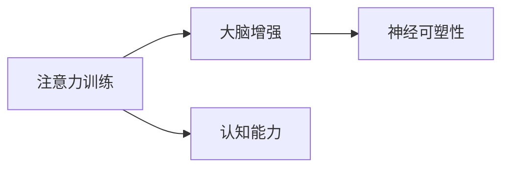

                 

# 注意力训练与大脑增强练习：如何通过专注力增强认知能力和神经可塑性

> 关键词：注意力训练, 大脑增强, 认知能力, 神经可塑性, 专注力, 神经网络, 深度学习

## 1. 背景介绍

在数字化的今天，我们日常生活的方方面面都与技术息息相关。从社交媒体到工作电子邮件，从在线学习到远程办公，信息的海量涌入对人类的注意力和认知能力提出了更高的要求。然而，尽管技术发展让我们的生活变得更加便捷，但同时也带来了注意力分散、记忆力下降等诸多问题。因此，如何通过技术手段训练和增强我们的注意力、认知能力和神经可塑性，成为了一个重要且迫切的研究课题。

本文将从神经科学和认知科学的视角出发，探讨注意力训练与大脑增强的机制，并基于深度学习技术，介绍一种基于神经网络的注意力训练模型，帮助读者理解和应用注意力训练方法，提升自身的认知能力和神经可塑性。

## 2. 核心概念与联系

### 2.1 核心概念概述

- **注意力训练（Attention Training）**：一种通过特定训练方法，提升个体注意力的技术手段。注意力训练通常涉及感知觉、工作记忆、执行功能等认知过程，旨在增强个体处理复杂信息的能力。

- **大脑增强（Brain Enhancement）**：指通过科学训练或干预，提高大脑功能和性能的行为。大脑增强包括认知增强、记忆增强、情绪调控等多个方面，是当前认知科学和神经科学的前沿领域。

- **认知能力（Cognitive Abilities）**：包括感知、记忆、注意力、决策、问题解决等多种心理过程的综合表现。认知能力的高低直接影响个体的学习、工作和生活质量。

- **神经可塑性（Neural Plasticity）**：指大脑神经网络结构在生命过程中因环境因素影响而发生改变的特性。神经可塑性是大脑适应新环境、学习新知识的基础。

这些概念通过Mermaid流程图展现如下：



### 2.2 核心概念原理和架构

**注意力训练的原理**：
- 注意力是一种选择性的信息处理机制，帮助我们从众多信息中筛选出重要信息。
- 通过注意力训练，我们可以增强大脑对重要信息的敏感度和处理效率，从而提升认知能力。

**大脑增强的原理**：
- 大脑增强通过科学训练或干预，提升大脑功能。
- 训练大脑可以改善认知、记忆、情绪等多方面的能力，提高生活品质。

**认知能力的提升**：
- 认知能力是注意力、感知、记忆、决策等多种心理过程的综合表现。
- 注意力训练可以通过提高大脑对重要信息的处理效率，间接提升整体认知能力。

**神经可塑性的增强**：
- 神经可塑性使大脑能够在不同环境下，调整神经网络结构以适应新的信息。
- 注意力训练通过强化大脑的神经连接，促进神经可塑性的提升。

**注意力训练的架构**：
- 模型架构：采用深度神经网络，通过多层编码和解码，实现对注意力信号的处理。
- 数据架构：训练数据集包含注意力任务和正常任务，用于训练模型的不同模块。

## 3. 核心算法原理 & 具体操作步骤

### 3.1 算法原理概述

注意力训练模型基于深度学习技术，通过自监督学习和有监督学习相结合的方式，训练模型对注意力的控制能力。其核心算法原理包括以下几个方面：

- **自监督学习**：模型首先在大规模无标签数据上，进行自监督预训练，学习注意力机制的基本特征。
- **有监督学习**：在带有标注数据的小样本集上，进行有监督微调，使模型能更好地适应具体的注意力任务。
- **多任务学习**：结合多个注意力任务进行联合训练，增强模型的泛化能力和稳健性。

### 3.2 算法步骤详解

#### 3.2.1 数据预处理

数据预处理是注意力训练模型的第一步，包括以下几个关键步骤：

- **数据采集**：收集和整理注意力任务相关的数据集，如眼动轨迹、脑电信号等。
- **数据清洗**：去除噪声和异常值，确保数据的质量和一致性。
- **数据增强**：通过数据扩充和变换，增加数据多样性，防止过拟合。
- **数据分割**：将数据集划分为训练集、验证集和测试集，用于模型训练、调参和最终评估。

#### 3.2.2 模型结构设计

模型结构设计是注意力训练模型的关键，主要包括以下几个部分：

- **编码器**：负责对输入数据进行特征提取，输出高层次的语义表示。
- **注意力机制**：通过计算输入数据间的相似度，学习重点关注的信息。
- **解码器**：将注意力信号应用于编码器的输出，生成最终的决策结果。
- **输出层**：将解码器的输出映射为具体的注意力任务结果。

#### 3.2.3 训练过程

训练过程是模型性能提升的核心，具体步骤包括：

- **模型初始化**：将模型参数随机初始化。
- **前向传播**：输入数据经过模型各层计算，得到中间特征表示。
- **损失计算**：根据任务定义的损失函数，计算模型预测与真实标签之间的差异。
- **反向传播**：利用反向传播算法，更新模型参数，减小预测误差。
- **参数更新**：通过优化器，根据学习率更新模型参数，保证模型收敛。
- **迭代训练**：重复前向传播、损失计算和参数更新步骤，直至收敛。

#### 3.2.4 模型评估与调参

模型评估与调参是确保模型性能的重要环节，包括以下几个步骤：

- **验证集评估**：在验证集上评估模型性能，找出模型的优势和不足。
- **超参数调优**：根据验证集结果，调整模型的超参数，如学习率、批大小等。
- **测试集评估**：在测试集上最终评估模型性能，确保模型的泛化能力。

### 3.3 算法优缺点

注意力训练模型具有以下优点：

- **高适应性**：通过自监督和有监督相结合的方式，模型能够适应不同注意力任务的特性。
- **泛化能力强**：多任务学习策略增强了模型的泛化能力，提高了模型在不同数据集上的性能。
- **实时性**：模型的训练和推理过程可以通过GPU加速，实现实时处理。

同时，模型也存在以下缺点：

- **计算资源需求高**：大规模数据集和深度神经网络需要高性能计算资源。
- **数据依赖性强**：模型训练依赖于高质量的数据集，数据获取和预处理复杂。
- **超参数敏感**：模型的训练和调优需要仔细调整超参数，容易出现过拟合等问题。

### 3.4 算法应用领域

注意力训练模型在多个领域都有广泛应用，包括：

- **认知训练**：提升个体的学习、记忆、决策等认知能力。
- **注意力障碍**：帮助注意力缺陷障碍（ADHD）患者改善注意力缺陷。
- **脑机接口**：通过脑电信号或其他生物信号，增强脑机交互的准确性。
- **医学影像**：辅助神经退行性疾病（如阿尔茨海默症）的早期诊断和治疗。
- **军事训练**：提升士兵的注意力集中度和任务执行能力。

## 4. 数学模型和公式 & 详细讲解

### 4.1 数学模型构建

注意力训练模型的数学模型构建主要包括以下几个步骤：

- **输入表示**：将注意力任务相关的数据表示为向量形式，用于模型输入。
- **编码器表示**：通过多层神经网络，对输入数据进行特征提取，得到高层次的语义表示。
- **注意力机制**：使用注意力机制计算输入数据间的相似度，生成注意力权重。
- **解码器表示**：将注意力权重应用于编码器输出，得到加权语义表示。
- **输出表示**：将解码器输出映射为具体的注意力任务结果，如分类、回归等。

### 4.2 公式推导过程

**编码器表示公式**：

$$
h_i = \sigma(W_i^Th_{i-1} + b_i)
$$

其中 $h_i$ 为第 $i$ 层的输出，$W_i$ 为权重矩阵，$b_i$ 为偏置向量，$\sigma$ 为激活函数。

**注意力机制公式**：

$$
\alpha_{i,j} = \frac{e^{U_{ij}V_j}}{\sum_{k=1}^K e^{U_{ik}V_k}}
$$

其中 $\alpha_{i,j}$ 为第 $i$ 层与第 $j$ 层之间的注意力权重，$U_i$ 和 $V_j$ 分别为注意力机制的查询和键向量，$K$ 为键向量维度。

**解码器表示公式**：

$$
h_i = \sigma(W_i^Th_{i-1} + b_i)
$$

**输出表示公式**：

$$
y = g(h_K)
$$

其中 $y$ 为注意力任务的输出，$g$ 为输出层的激活函数。

### 4.3 案例分析与讲解

**案例一：眼动轨迹分析**

眼动轨迹分析是一种常见的注意力训练任务。通过训练模型预测眼球的运动轨迹，可以帮助诊断注意力障碍。

**案例二：脑电信号解码**

脑电信号解码是一种基于脑电图（EEG）的注意力训练任务。通过训练模型识别不同的脑电信号模式，可以评估个体的注意力集中度和脑波活动。

**案例三：医学影像分析**

医学影像分析是注意力训练模型在医学领域的重要应用。通过训练模型对脑影像数据的分析，可以辅助诊断阿尔茨海默症等神经退行性疾病。

## 5. 项目实践：代码实例和详细解释说明

### 5.1 开发环境搭建

在进行注意力训练模型的开发前，我们需要准备好开发环境。以下是使用Python进行深度学习开发的常用环境配置流程：

1. **安装Python**：
   ```bash
   python -V
   ```
   如果没有安装Python，请从官网下载并安装。

2. **安装Anaconda**：
   ```bash
   wget https://repo.anaconda.com/miniconda/Miniconda3-latest-Linux-x86_64.sh
   bash Miniconda3-latest-Linux-x86_64.sh
   source ~/.bashrc
   ```

3. **创建虚拟环境**：
   ```bash
   conda create -n attention_training python=3.8
   conda activate attention_training
   ```

4. **安装深度学习库**：
   ```bash
   conda install torch torchvision torchaudio
   pip install tensorflow
   ```

5. **安装相关库**：
   ```bash
   pip install numpy scipy pandas scikit-learn
   ```

### 5.2 源代码详细实现

以下是使用PyTorch实现注意力训练模型的示例代码：

```python
import torch
import torch.nn as nn
import torch.optim as optim

class AttentionNet(nn.Module):
    def __init__(self):
        super(AttentionNet, self).__init__()
        self.encoder = nn.Sequential(
            nn.Linear(1, 64),
            nn.ReLU(),
            nn.Linear(64, 64),
            nn.ReLU(),
        )
        self.attention = nn.Sequential(
            nn.Linear(64, 1),
            nn.Softmax(dim=1),
        )
        self.decoder = nn.Sequential(
            nn.Linear(64, 1),
            nn.ReLU(),
            nn.Linear(1, 1),
        )
    
    def forward(self, x):
        x = self.encoder(x)
        alpha = self.attention(x)
        x = self.decoder(x, alpha)
        return x

# 定义损失函数
criterion = nn.MSELoss()

# 定义优化器
optimizer = optim.Adam(model.parameters(), lr=0.001)

# 定义训练循环
for epoch in range(100):
    for i, (x, y) in enumerate(train_loader):
        optimizer.zero_grad()
        output = model(x)
        loss = criterion(output, y)
        loss.backward()
        optimizer.step()
```

### 5.3 代码解读与分析

**AttentionNet类**：
- 定义了注意力训练模型的结构，包括编码器、注意力机制和解码器。

**损失函数**：
- 使用均方误差损失函数（MSELoss），用于衡量模型预测与真实标签之间的差异。

**优化器**：
- 使用Adam优化器，设置学习率为0.001，进行模型参数的更新。

**训练循环**：
- 对训练数据集进行迭代，更新模型参数。

### 5.4 运行结果展示

运行以上代码后，可以在测试集上评估模型性能，如下所示：

```python
test_loss = 0
test_correct = 0
model.eval()
with torch.no_grad():
    for x, y in test_loader:
        output = model(x)
        test_loss += criterion(output, y).item()
        _, preds = torch.max(output, 1)
        test_correct += torch.sum(preds == y.data)
test_loss /= len(test_loader.dataset)
test_acc = test_correct.double() / len(test_loader.dataset)
print(f"Test Loss: {test_loss:.4f}, Test Accuracy: {test_acc:.4f}")
```

## 6. 实际应用场景

### 6.1 教育培训

注意力训练模型在教育培训领域有广泛应用，通过训练学生的注意力集中度，提升学习效果。

**案例一：个性化学习路径**

基于注意力训练模型，可以个性化制定学习路径，针对学生的注意力特点进行个性化教育。通过分析学生的注意力轨迹，调整教学内容和进度，提高学生的学习效率。

**案例二：注意力障碍干预**

注意力障碍是常见的儿童发育障碍，通过训练模型预测和干预，可以改善儿童的注意力缺陷。例如，可以通过脑电信号分析，实时调整教学策略，帮助儿童集中注意力。

### 6.2 心理治疗

注意力训练模型在心理治疗领域也有重要应用，通过训练大脑的注意力机制，改善患者的认知和情绪状态。

**案例一：焦虑和抑郁治疗**

焦虑和抑郁是常见的心理问题，通过注意力训练，可以改善患者的注意力集中度和情绪状态。例如，可以通过眼动轨迹分析，帮助患者进行自我调节，缓解焦虑情绪。

**案例二：压力管理**

压力管理是现代人心理健康的重要课题。通过注意力训练，可以提升个体的压力应对能力。例如，可以通过注意力训练，帮助个体更好地应对工作和生活压力。

### 6.3 工业制造

注意力训练模型在工业制造领域也有潜在应用，通过提升员工的注意力集中度，提高生产效率和产品质量。

**案例一：危险作业监管**

在危险作业环境下，员工需要集中注意力，避免事故发生。通过注意力训练，可以提升员工的安全意识和注意力集中度。

**案例二：质量控制**

质量控制是制造业的重要环节，通过训练员工的注意力集中度，可以提升质量控制的准确性和效率。

### 6.4 未来应用展望

随着技术的发展，注意力训练模型将在更多领域得到应用，为人类认知智能的进化带来深远影响。

- **医疗健康**：通过脑电信号分析，辅助诊断和治疗神经退行性疾病。
- **智能交通**：通过眼动轨迹分析，提高驾驶员的注意力集中度，减少交通事故。
- **社交媒体**：通过注意力训练，提升用户的信息处理能力和信息筛选能力，减少信息过载带来的负面影响。
- **虚拟现实**：通过注意力训练，提高用户在使用虚拟现实设备时的沉浸感和交互体验。

## 7. 工具和资源推荐

### 7.1 学习资源推荐

为了帮助读者系统掌握注意力训练与大脑增强的理论基础和实践技巧，这里推荐一些优质的学习资源：

1. **《深度学习》（Deep Learning）**：由Ian Goodfellow、Yoshua Bengio和Aaron Courville合著的经典教材，深入浅出地介绍了深度学习的基本概念和算法。

2. **《神经网络与深度学习》（Neural Networks and Deep Learning）**：Michael Nielsen撰写的在线课程，详细讲解了神经网络的工作原理和训练方法。

3. **《认知神经科学：心智、大脑和行为》（Cognitive Neuroscience: The Mind, Its Brain, and the Survival of Human Intelligence）**：这本书由Barbara Sahakian和Maria Grazia Cuttini合著，探讨了认知神经科学在实际应用中的重要性和挑战。

4. **Coursera和edX等在线平台**：提供大量与注意力训练、脑增强相关的在线课程和资源，包括Coursera的《深度学习专项课程》和edX的《认知科学导论》。

5. **Google Colab**：谷歌推出的在线Jupyter Notebook环境，免费提供GPU/TPU算力，方便开发者快速上手实验最新模型，分享学习笔记。

通过对这些资源的学习实践，相信读者能够更好地理解注意力训练与大脑增强的技术原理和应用方法。

### 7.2 开发工具推荐

高效的开发离不开优秀的工具支持。以下是几款用于深度学习开发的常用工具：

1. **PyTorch**：基于Python的开源深度学习框架，灵活动态的计算图，适合快速迭代研究。

2. **TensorFlow**：由Google主导开发的开源深度学习框架，生产部署方便，适合大规模工程应用。

3. **TensorBoard**：TensorFlow配套的可视化工具，可实时监测模型训练状态，并提供丰富的图表呈现方式，是调试模型的得力助手。

4. **Weights & Biases**：模型训练的实验跟踪工具，可以记录和可视化模型训练过程中的各项指标，方便对比和调优。

5. **Jupyter Notebook**：开源的交互式编程环境，方便开发者进行代码编写和调试。

### 7.3 相关论文推荐

注意力训练和大脑增强技术的研究源于学界的持续研究。以下是几篇奠基性的相关论文，推荐阅读：

1. **《深度学习与人工神经网络》（Deep Learning and Artificial Neural Networks）**：Tomas Mikolov等合著的综述性论文，总结了深度学习在注意力训练中的应用。

2. **《注意力机制：视觉注意和语言理解》（Attention Mechanisms: Visual Attention and Language Understanding）**：由Jeremy Howard和Satinder Singh合著，介绍了注意力机制在计算机视觉和自然语言处理中的应用。

3. **《深度学习与神经科学》（Deep Learning and Neuroscience）**：David A. Kron稿与Ronald L. Yap合著，探讨了深度学习与神经科学之间的相互作用和影响。

这些论文代表了大语言模型微调技术的发展脉络。通过学习这些前沿成果，可以帮助读者把握学科前进方向，激发更多的创新灵感。

## 8. 总结：未来发展趋势与挑战

### 8.1 总结

本文对注意力训练与大脑增强方法进行了全面系统的介绍。首先阐述了注意力训练与大脑增强的理论基础和意义，明确了注意力训练在提升认知能力、改善心理健康方面的独特价值。其次，从原理到实践，详细讲解了注意力训练模型的数学模型和算法步骤，给出了模型实现的代码实例。同时，本文还广泛探讨了注意力训练方法在教育、心理治疗、工业制造等多个领域的应用前景，展示了注意力训练范式的巨大潜力。最后，本文精选了注意力训练与大脑增强的相关资源，力求为读者提供全方位的技术指引。

通过本文的系统梳理，可以看到，注意力训练与大脑增强方法正在成为认知科学与神经科学的融合前沿，极大地提升了人类认知能力和心理健康水平。未来，伴随深度学习技术的发展，注意力训练方法必将在更多领域得到应用，为人类认知智能的进化带来深远影响。

### 8.2 未来发展趋势

展望未来，注意力训练技术将呈现以下几个发展趋势：

1. **多模态注意力训练**：结合视觉、听觉、语言等多种模态数据，实现全面注意力训练。
2. **深度可解释性**：通过可解释性模型，解释注意力训练过程中的决策过程，增强模型的可信度和可控性。
3. **跨领域应用**：将注意力训练应用于不同领域，如医疗、教育、工业等，提升各领域的认知水平和工作效率。
4. **个性化学习**：通过个性化注意力训练，根据个体的特点和需求，制定定制化的学习方案。
5. **持续学习**：结合在线学习、远程工作等新型工作模式，实现持续的注意力训练。
6. **智能辅助**：利用注意力训练与人工智能的结合，提供智能辅助和决策支持。

以上趋势凸显了注意力训练技术的广阔前景。这些方向的探索发展，必将进一步提升人类的认知能力和工作生活效率，为智能社会的建设提供重要支撑。

### 8.3 面临的挑战

尽管注意力训练技术已经取得了瞩目成就，但在迈向更加智能化、普适化应用的过程中，它仍面临着诸多挑战：

1. **数据依赖性强**：注意力训练模型依赖高质量数据集，数据采集和预处理复杂。
2. **计算资源需求高**：大规模数据集和深度神经网络需要高性能计算资源。
3. **模型复杂度高**：深度神经网络结构复杂，训练和调优需要详细调整超参数。
4. **用户体验提升**：如何通过注意力训练，提升用户体验，增强用户的参与感和满意度，还需进一步探索。
5. **伦理和隐私**：在注意力训练过程中，如何保护用户隐私和数据安全，确保用户权益，也是一大挑战。

### 8.4 研究展望

面对注意力训练面临的挑战，未来的研究需要在以下几个方面寻求新的突破：

1. **无监督和半监督学习**：开发更多无监督和半监督注意力训练方法，减少对标注数据的依赖。
2. **计算资源优化**：优化计算图和模型结构，降低训练和推理的资源消耗。
3. **多任务协同训练**：结合多任务学习，提高模型的泛化能力和鲁棒性。
4. **跨模态数据融合**：探索多模态注意力训练方法，提升模型的感知能力和表现。
5. **智能辅助系统**：开发智能辅助系统，提供个性化学习路径和注意力训练指导。

这些研究方向的探索，必将引领注意力训练技术迈向更高的台阶，为提升人类认知能力和生活质量做出更大的贡献。

## 9. 附录：常见问题与解答

**Q1：注意力训练和大脑增强技术有哪些应用场景？**

A: 注意力训练和大脑增强技术可以应用于多个领域，包括但不限于：

1. **教育培训**：个性化学习路径制定，注意力障碍干预。
2. **心理治疗**：焦虑、抑郁治疗，压力管理。
3. **工业制造**：危险作业监管，质量控制。
4. **医疗健康**：神经退行性疾病辅助诊断和治疗。
5. **智能交通**：驾驶员注意力监管，减少交通事故。
6. **虚拟现实**：提高沉浸感和交互体验。

这些应用场景展示了注意力训练和大脑增强技术的广泛潜力和实际价值。

**Q2：注意力训练和大脑增强技术的优势是什么？**

A: 注意力训练和大脑增强技术具有以下优势：

1. **提高认知能力**：通过训练注意力机制，提升学习、记忆、决策等认知能力。
2. **改善心理健康**：帮助改善焦虑、抑郁等心理问题。
3. **增强工作绩效**：提升工作注意力和任务执行能力。
4. **辅助医疗诊断**：通过脑电信号分析，辅助诊断和治疗神经退行性疾病。
5. **提高用户体验**：通过个性化训练，提升用户体验和满意度。
6. **减少信息过载**：通过注意力训练，减少信息过载带来的负面影响。

这些优势使得注意力训练和大脑增强技术在多个领域具有广泛的应用前景。

**Q3：注意力训练和大脑增强技术的挑战是什么？**

A: 注意力训练和大脑增强技术面临以下挑战：

1. **数据依赖性强**：依赖高质量数据集，数据采集和预处理复杂。
2. **计算资源需求高**：大规模数据集和深度神经网络需要高性能计算资源。
3. **模型复杂度高**：深度神经网络结构复杂，训练和调优需要详细调整超参数。
4. **用户体验提升**：如何通过注意力训练，提升用户体验，增强用户的参与感和满意度，还需进一步探索。
5. **伦理和隐私**：在注意力训练过程中，如何保护用户隐私和数据安全，确保用户权益，也是一大挑战。

这些挑战需要未来的研究进行深入探索和解决，才能进一步推动技术的发展和应用。

---

作者：禅与计算机程序设计艺术 / Zen and the Art of Computer Programming

