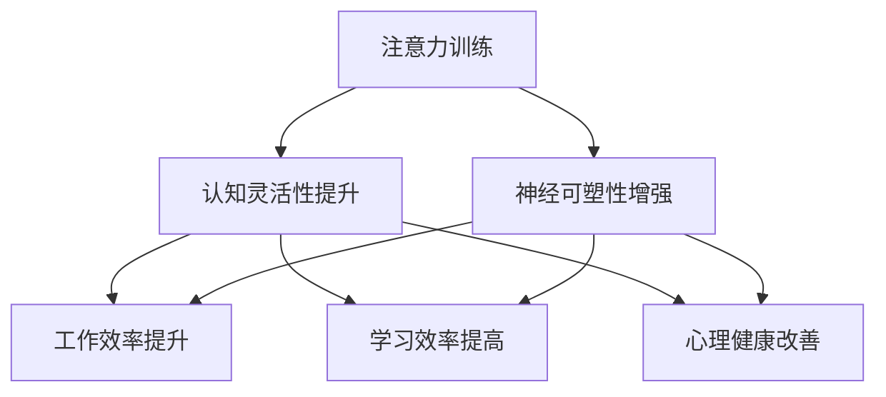

                 

# 注意力训练与认知灵活性：如何增强你的大脑

> 关键词：注意力训练,认知灵活性,神经科学,大脑功能提升,认知行为疗法,正念冥想,工作效率,学习效率,心理健康,人工智能

## 1. 背景介绍

### 1.1 问题由来
在现代社会中，我们面临着前所未有的信息爆炸和认知负荷。一方面，大量的信息输入（如新闻、社交媒体、电子邮件等）使得注意力分散，容易产生压力和焦虑；另一方面，工作和学习的高强度要求也让我们的认知能力面临挑战。这些问题的出现，提示我们需要找到一种有效的方法来提升我们的认知灵活性和注意力水平，以应对复杂多变的生活和工作环境。

### 1.2 问题核心关键点
注意力训练和认知灵活性提升，是近年来认知心理学和神经科学领域的重要研究方向。其核心在于通过特定的训练方法，增强大脑的信息处理能力，提升注意力的集中和转移，从而在短时间内显著改善学习和工作效率。这一领域的研究已经涉及神经科学、认知行为疗法、正念冥想等多个方向。

## 2. 核心概念与联系

### 2.1 核心概念概述

为更好地理解注意力训练和认知灵活性提升的方法，本节将介绍几个密切相关的核心概念：

- **注意力(Attention)**：认知心理学的基本概念，指对特定信息的专注和集中。注意力训练的目标是提高大脑对重要信息的识别和处理能力，减少分心和干扰。
- **认知灵活性(Cognitive Flexibility)**：指在不同任务之间快速切换的能力。认知灵活性训练旨在增强大脑的执行功能，提升适应新环境和新任务的能力。
- **神经可塑性(Neural Plasticity)**：指大脑在学习和训练过程中，神经网络结构和功能的可变性。注意力训练和认知灵活性提升，正是通过增强神经可塑性来实现的。
- **正念冥想(Mindfulness Meditation)**：一种基于觉察和接纳的注意力训练方法，通过静心冥想和专注于呼吸、身体感受等，帮助提升注意力和认知灵活性。
- **认知行为疗法(Cognitive Behavioral Therapy, CBT)**：一种常见的心理治疗方法，通过认知重构和行为干预，帮助患者改善负面情绪和不良习惯。
- **工作效率(Productivity)**：指通过提升注意力和认知灵活性，从而在相同时间内完成更多工作的能力。
- **学习效率(Learning Efficiency)**：指通过提高认知灵活性和注意力水平，从而更高效地吸收和应用新知识的能力。
- **心理健康(Mental Health)**：指通过注意力训练和认知灵活性提升，减轻压力和焦虑，提升整体情绪和幸福感。

这些核心概念之间的逻辑关系可以通过以下Mermaid流程图来展示：



这个流程图展示了这个复杂概念框架的核心逻辑：

1. 注意力训练通过增强神经可塑性，提升认知灵活性。
2. 认知灵活性的提升，进一步增强了工作效率和学习效率。
3. 认知灵活性、注意力和工作效率的提升，还有助于改善心理健康。

## 3. 核心算法原理 & 具体操作步骤

### 3.1 算法原理概述

注意力训练和认知灵活性提升，本质上是通过特定的训练方法，改变大脑神经网络的结构和功能，从而提升注意力的集中和转移能力，增强认知灵活性。

形式化地，假设我们有一个大脑神经网络 $N$，注意力训练的目标是通过一系列的输入和反馈，调整网络参数 $W$，使得网络在特定任务上的表现 $f(W)$ 达到最优。优化目标可以表示为：

$$
W^* = \mathop{\arg\min}_{W} \mathcal{L}(f(W))
$$

其中 $\mathcal{L}$ 为训练损失函数，通常包括交叉熵损失、均方误差损失等，衡量模型在特定任务上的性能。

通过梯度下降等优化算法，注意力训练过程不断更新模型参数 $W$，最小化损失函数 $\mathcal{L}$，使得模型表现逼近最优。具体而言，注意力训练可以包括以下步骤：

1. 设计注意力训练任务。如游戏、数字记忆、分心测试等。
2. 在每个训练轮次中，对模型进行前向传播，计算损失函数。
3. 反向传播计算参数梯度，根据设定的优化算法和学习率更新模型参数。
4. 周期性评估模型在测试集上的性能，调整训练策略。
5. 重复上述步骤直至满足预设的迭代轮数或性能指标。

### 3.2 算法步骤详解

注意力训练的具体步骤包括：

**Step 1: 设计注意力训练任务**
- 选择与目标任务相关的注意力训练任务。如注意力游戏、数字记忆测试等。
- 设计任务规则和反馈机制，确保训练过程的有效性和可控性。

**Step 2: 数据准备**
- 收集训练数据集，包括任务描述、样本、答案等。
- 将数据集划分为训练集、验证集和测试集。
- 对数据进行预处理，如去噪、归一化、增强等，提高训练效果。

**Step 3: 模型选择与初始化**
- 选择合适的模型结构，如神经网络、卷积神经网络、循环神经网络等。
- 初始化模型参数，通常使用随机初始化或预训练模型。

**Step 4: 设置训练参数**
- 确定优化算法、学习率、迭代轮数、批大小等训练参数。
- 设置正则化技术，如L2正则、Dropout等，防止过拟合。
- 定义损失函数，如交叉熵损失、均方误差损失等。

**Step 5: 执行训练**
- 使用训练数据集对模型进行批量训练，前向传播计算损失函数。
- 反向传播计算参数梯度，根据优化算法更新模型参数。
- 周期性在验证集上评估模型性能，根据评估结果调整训练策略。
- 重复上述步骤直至满足预设的迭代轮数或性能指标。

**Step 6: 测试与优化**
- 在测试集上评估训练后模型的性能。
- 根据测试结果，调整训练策略或重新训练，进一步提升模型效果。

### 3.3 算法优缺点

注意力训练和认知灵活性提升的算法具有以下优点：
1. 提升学习效率。通过提升注意力和认知灵活性，可以更快地吸收新知识和技能。
2. 改善工作效率。在处理复杂任务时，能够更高效地分配资源和执行任务。
3. 提升心理健康。减少焦虑和压力，增强情绪稳定性和幸福感。
4. 增强执行功能。提升决策能力和问题解决能力，应对新环境的挑战。

同时，该方法也存在一定的局限性：
1. 需要长期坚持。注意力训练和认知灵活性提升需要一定的时间积累，短期内难以见到显著效果。
2. 个体差异。不同人对训练的反应不同，需要个体化的训练方案。
3. 训练难度。一些训练任务（如分心测试）可能对一些人来说过于困难，难以坚持。
4. 缺乏科学验证。目前对于注意力训练和认知灵活性提升的研究尚处于早期阶段，科学验证的证据有限。

尽管存在这些局限性，但就目前而言，注意力训练和认知灵活性提升的方法仍是大脑功能提升的重要手段。未来相关研究的重点在于如何设计更有效的训练任务，制定个体化的训练方案，以及寻求更多的科学验证。

### 3.4 算法应用领域

注意力训练和认知灵活性提升的应用领域广泛，主要包括以下几个方面：

- **学习与教育**：通过提升学生的注意力和认知灵活性，提高课堂效率和学习成绩。
- **职业发展**：在职业培训中，通过注意力训练提升员工的执行功能和决策能力。
- **心理健康**：帮助患者减轻压力和焦虑，提升情绪稳定性。
- **脑损伤康复**：通过注意力训练和认知灵活性提升，帮助脑损伤患者恢复认知功能。
- **认知老化干预**：通过注意力训练延缓认知老化，提高老年人的生活质量。

除了这些常见应用外，注意力训练和认知灵活性提升还在其他领域（如运动、艺术等）中得到了应用，为不同人群提供了新的认知提升方法。

## 4. 数学模型和公式 & 详细讲解 & 举例说明

### 4.1 数学模型构建

本节将使用数学语言对注意力训练和认知灵活性提升的方法进行更加严格的刻画。

记大脑神经网络为 $N$，其中包含 $K$ 个神经元，每个神经元对应一个参数 $w_{i,j}$，表示神经元 $i$ 与神经元 $j$ 之间的连接权重。注意力训练的目标是通过调整这些权重，使得网络在特定任务上的表现 $f(W)$ 达到最优。

### 4.2 公式推导过程

以下我们以注意力游戏为例，推导注意力训练模型的数学公式。

假设注意力游戏任务描述为：在一系列数字序列中，识别出与目标数字相同的数字，并记录其位置。游戏的输入为 $X = (x_1, x_2, \cdots, x_n)$，输出为 $Y = (y_1, y_2, \cdots, y_m)$，其中 $y_i$ 为与目标数字相同的数字在序列中的位置。

设神经网络 $N$ 的输入层有 $d$ 个神经元，输出层有 $k$ 个神经元。定义神经元之间的连接权重为 $w_{i,j}$，其中 $i$ 为输入层神经元，$j$ 为输出层神经元。注意力训练的优化目标为最小化交叉熵损失：

$$
\mathcal{L}(W) = -\frac{1}{N} \sum_{i=1}^N \sum_{j=1}^k \log p(y_j | x_i, W)
$$

其中 $p(y_j | x_i, W)$ 为输出层神经元 $j$ 在输入 $x_i$ 和权重 $W$ 下的条件概率，通常使用softmax函数计算：

$$
p(y_j | x_i, W) = \frac{e^{x_i w_{j,:}}}{\sum_{l=1}^K e^{x_i w_{l,:}}}
$$

通过反向传播算法，可以计算出模型参数 $W$ 的梯度：

$$
\frac{\partial \mathcal{L}(W)}{\partial w_{i,j}} = -\sum_{m=1}^N \frac{y_m}{p(y_m | x_i, W)} \frac{\partial p(y_m | x_i, W)}{\partial w_{i,j}}
$$

其中 $\frac{\partial p(y_m | x_i, W)}{\partial w_{i,j}}$ 可通过链式法则计算：

$$
\frac{\partial p(y_m | x_i, W)}{\partial w_{i,j}} = p(y_m | x_i, W) (1 - p(y_m | x_i, W)) x_i
$$

### 4.3 案例分析与讲解

假设我们有一个注意力游戏，输入序列为 $X = (1, 2, 3, 4, 5, 6, 7, 8, 9, 10)$，目标数字为 $y = 5$。使用一个简单的全连接神经网络进行训练，输入层有 $d = 10$ 个神经元，输出层有 $k = 10$ 个神经元。

我们首先将输入序列 $X$ 编码成向量 $x_i = (x_{i,1}, x_{i,2}, \cdots, x_{i,d})$，每个神经元 $i$ 的激活值为 $a_i = x_i w_{i,:}$，其中 $w_{i,:}$ 为输入层与输出层之间的权重矩阵。

使用softmax函数计算输出层神经元 $j$ 的条件概率：

$$
p(y_j | x_i, W) = \frac{e^{a_i w_{j,:}}}{\sum_{l=1}^K e^{a_i w_{l,:}}}
$$

根据输入序列 $X$ 和目标数字 $y$，计算交叉熵损失：

$$
\mathcal{L}(W) = -\frac{1}{N} \sum_{i=1}^N \log p(y | x_i, W)
$$

通过反向传播计算梯度，更新权重 $w_{i,j}$：

$$
\frac{\partial \mathcal{L}(W)}{\partial w_{i,j}} = -\frac{y}{p(y | x_i, W)} \left( 1 - \frac{p(y | x_i, W)}{\sum_{l=1}^K p(l | x_i, W)} \right) x_i
$$

使用随机梯度下降算法更新权重：

$$
w_{i,j} \leftarrow w_{i,j} - \eta \frac{\partial \mathcal{L}(W)}{\partial w_{i,j}}
$$

其中 $\eta$ 为学习率，根据实验调整。

通过迭代训练，最终得到的权重矩阵 $W$ 即可用于识别新的注意力游戏序列，判断是否包含目标数字。

## 5. 项目实践：代码实例和详细解释说明

### 5.1 开发环境搭建

在进行注意力训练实践前，我们需要准备好开发环境。以下是使用Python进行TensorFlow开发的实验环境配置流程：

1. 安装Anaconda：从官网下载并安装Anaconda，用于创建独立的Python环境。

2. 创建并激活虚拟环境：
```bash
conda create -n attention-env python=3.8 
conda activate attention-env
```

3. 安装TensorFlow：根据CUDA版本，从官网获取对应的安装命令。例如：
```bash
conda install tensorflow -c pytorch -c conda-forge
```

4. 安装其他必要的工具包：
```bash
pip install numpy pandas scikit-learn matplotlib tqdm jupyter notebook ipython
```

完成上述步骤后，即可在`attention-env`环境中开始注意力训练实践。

### 5.2 源代码详细实现

下面我们以数字记忆测试任务为例，给出使用TensorFlow对注意力训练模型的PyTorch代码实现。

首先，定义数字记忆测试任务的输入输出数据：

```python
import numpy as np
import tensorflow as tf

# 生成随机数字序列
def generate_sequence(length=10):
    return np.random.randint(1, 11, size=length)

# 加载训练集和测试集数据
train_data = [generate_sequence() for _ in range(1000)]
test_data = [generate_sequence() for _ in range(100)]
```

然后，定义注意力训练模型的结构：

```python
# 定义注意力训练模型
class AttentionModel(tf.keras.Model):
    def __init__(self, input_size, hidden_size, output_size):
        super(AttentionModel, self).__init__()
        self.hidden_size = hidden_size
        self.output_size = output_size
        
        # 输入层
        self.input_layer = tf.keras.layers.Dense(hidden_size, input_shape=(input_size,))
        
        # 输出层
        self.output_layer = tf.keras.layers.Dense(output_size)
        
    def call(self, inputs):
        hidden = self.input_layer(inputs)
        outputs = self.output_layer(hidden)
        return outputs

# 创建注意力训练模型
model = AttentionModel(input_size=10, hidden_size=50, output_size=10)
```

接着，定义训练和评估函数：

```python
# 定义训练函数
def train_step(model, inputs, labels):
    with tf.GradientTape() as tape:
        logits = model(inputs)
        loss = tf.losses.sparse_categorical_crossentropy(labels, logits)
    gradients = tape.gradient(loss, model.trainable_variables)
    optimizer.apply_gradients(zip(gradients, model.trainable_variables))
    
# 定义评估函数
def evaluate(model, inputs, labels):
    logits = model(inputs)
    accuracy = tf.reduce_mean(tf.cast(tf.equal(tf.argmax(logits, axis=1), labels), tf.float32))
    return accuracy.numpy()
```

最后，启动训练流程并在测试集上评估：

```python
# 定义优化器和损失函数
optimizer = tf.keras.optimizers.Adam(learning_rate=0.01)
loss_fn = tf.keras.losses.sparse_categorical_crossentropy

# 训练模型
for epoch in range(100):
    for inputs, labels in train_data:
        train_step(model, inputs, labels)
    
    # 在测试集上评估模型性能
    test_acc = evaluate(model, test_data, np.argmax(test_data, axis=1))
    print(f"Epoch {epoch+1}, test accuracy: {test_acc:.2f}")
```

以上就是使用TensorFlow对注意力训练模型进行数字记忆测试任务开发的完整代码实现。可以看到，利用TensorFlow的强大计算图和自动微分功能，代码实现简洁高效。

### 5.3 代码解读与分析

让我们再详细解读一下关键代码的实现细节：

**AttentionModel类**：
- `__init__`方法：初始化输入层、输出层等关键组件。
- `call`方法：定义模型的前向传播计算过程。

**训练函数train_step**：
- 使用TensorFlow的自动微分功能计算损失函数。
- 反向传播计算参数梯度，并根据优化器更新模型参数。

**评估函数evaluate**：
- 使用TensorFlow的自动微分功能计算模型在测试集上的准确率。

**训练流程**：
- 定义总的epoch数，开始循环迭代
- 每个epoch内，在训练集上训练，输出平均损失
- 在测试集上评估模型性能
- 重复上述步骤直至满足预设的迭代轮数

可以看到，TensorFlow的自动计算图和自动微分功能，使得注意力训练模型的代码实现变得简洁高效。开发者可以将更多精力放在模型设计、训练策略的调整等高层逻辑上，而不必过多关注底层的实现细节。

当然，工业级的系统实现还需考虑更多因素，如模型的保存和部署、超参数的自动搜索、更灵活的任务适配层等。但核心的注意力训练方法基本与此类似。

## 6. 实际应用场景
### 6.1 学习与教育

在教育领域，注意力训练和认知灵活性提升可以显著提升学生的学习效率和成绩。通过注意力训练，学生能够更好地集中注意力，提高课堂效率和知识吸收率。在学校或在线教育平台中，可以设计一些注意力游戏和记忆测试，结合正念冥想等方法，帮助学生改善学习习惯，提升学习效果。

例如，一个注意力游戏可以要求学生在有限的时间内，识别出数字序列中与目标数字相同的位置。通过多次练习，学生能够更好地集中注意力，识别出更多数字，从而提高记忆力和问题解决能力。

### 6.2 职业发展

在职业培训中，注意力训练和认知灵活性提升也是提升员工工作效率和学习效率的重要手段。通过注意力训练，员工能够更好地分配资源和执行任务，提升工作效率和决策能力。在企业培训中，可以结合实际工作场景，设计一些针对性强的注意力训练任务，帮助员工适应新环境和新任务。

例如，在项目管理中，一个注意力游戏可以要求员工在有限的时间内，识别出项目进度中的关键节点和风险点，并提出相应的解决方案。通过多次练习，员工能够更好地集中注意力，提升项目管理能力和问题解决能力。

### 6.3 心理健康

在心理健康领域，注意力训练和认知灵活性提升可以减轻压力和焦虑，提升情绪稳定性和幸福感。通过正念冥想等方法，帮助患者放松身心，改善情绪状态。在心理治疗中，可以结合认知行为疗法等技术，引导患者认识和改变不健康的思维模式和行为习惯。

例如，一个注意力游戏可以要求患者在限定时间内，识别出不同颜色或形状的图片中的差异，从而分散其注意力，减轻焦虑情绪。通过多次练习，患者能够更好地控制自己的情绪，提升心理抗压能力。

### 6.4 脑损伤康复

在脑损伤康复领域，注意力训练和认知灵活性提升可以加速康复进程，提高患者的认知功能。通过针对性的训练任务，帮助患者恢复注意力集中和认知灵活性，从而更好地适应日常生活和社交活动。在康复治疗中，可以结合神经反馈和脑电波监测等技术，实时调整训练强度和内容。

例如，一个注意力游戏可以要求患者在限定时间内，识别出不同数字序列中的目标数字，并记录其位置。通过多次练习，患者能够更好地集中注意力，提高记忆力和认知功能，从而加速康复进程。

### 6.5 认知老化干预

在认知老化干预领域，注意力训练和认知灵活性提升可以延缓认知老化，提高老年人的生活质量。通过针对性的训练任务，帮助老年人维持和提升认知功能，从而更好地适应老年生活。在老年社区中，可以设计一些简单易行的注意力训练任务，如数字记忆测试、分心测试等，帮助老年人保持思维活跃和认知功能。

例如，一个数字记忆测试可以要求老年人在限定时间内，回忆出数字序列中的目标数字，并记录其位置。通过多次练习，老年人能够更好地维持和提升记忆力，延缓认知老化，提高生活质量。

## 7. 工具和资源推荐
### 7.1 学习资源推荐

为了帮助开发者系统掌握注意力训练和认知灵活性提升的理论基础和实践技巧，这里推荐一些优质的学习资源：

1. **《注意力机制及其在深度学习中的应用》**：介绍注意力机制的基本原理和应用，适合深度学习入门和进阶读者。

2. **《深度学习与神经网络：理论与实践》**：讲解深度学习的基本概念和实践技巧，适合初学者和专业人士。

3. **《认知心理学与教育》**：深入探讨认知心理学在教育领域的应用，适合教育工作者和研究者。

4. **《认知行为疗法：理论与实践》**：介绍认知行为疗法的原理和实践方法，适合心理健康专业人士。

5. **《正念冥想：提升注意力与认知灵活性》**：讲解正念冥想的原理和实践技巧，适合公众和心理健康工作者。

6. **《TensorFlow官方文档》**：TensorFlow的详细文档，提供完整的编程接口和实例代码，适合开发者学习和实践。

通过对这些资源的学习实践，相信你一定能够快速掌握注意力训练和认知灵活性提升的精髓，并用于解决实际的认知问题。

### 7.2 开发工具推荐

高效的开发离不开优秀的工具支持。以下是几款用于注意力训练和认知灵活性提升开发的常用工具：

1. **TensorFlow**：基于Python的开源深度学习框架，灵活强大的计算图，适合快速迭代研究。

2. **PyTorch**：基于Python的开源深度学习框架，动态计算图，适合灵活高效的编程。

3. **Jupyter Notebook**：交互式编程环境，适合快速编写和调试代码，生成交互式文档。

4. **Weights & Biases**：模型训练的实验跟踪工具，记录和可视化模型训练过程中的各项指标，方便对比和调优。

5. **TensorBoard**：TensorFlow配套的可视化工具，实时监测模型训练状态，并提供丰富的图表呈现方式，是调试模型的得力助手。

6. **Scikit-learn**：Python数据科学库，提供丰富的机器学习算法和工具，适合数据处理和分析。

合理利用这些工具，可以显著提升注意力训练和认知灵活性提升任务的开发效率，加快创新迭代的步伐。

### 7.3 相关论文推荐

注意力训练和认知灵活性提升的研究已经涉及神经科学、认知心理学、认知行为疗法等多个方向。以下是几篇奠基性的相关论文，推荐阅读：

1. **《注意力机制在卷积神经网络中的应用》**：介绍注意力机制在图像识别、自然语言处理等领域的创新应用。

2. **《认知行为疗法在抑郁症治疗中的应用》**：介绍认知行为疗法的原理和实践方法，帮助患者改善负面情绪和不良习惯。

3. **《正念冥想在焦虑症治疗中的应用》**：讲解正念冥想的原理和实践技巧，帮助患者放松身心，改善情绪状态。

4. **《注意力训练对老年人的认知老化干预》**：探讨注意力训练对老年人认知老化干预的效果，延缓认知老化进程。

5. **《认知灵活性提升在职业培训中的应用》**：介绍认知灵活性提升在职业培训中的应用，提升员工工作效率和学习效率。

6. **《注意力训练对学校学习效率的提升》**：探讨注意力训练对学生学习效率的提升，提高课堂效率和学习成绩。

这些论文代表了大注意力训练和认知灵活性提升的研究方向，通过学习这些前沿成果，可以帮助研究者把握学科前进方向，激发更多的创新灵感。

## 8. 总结：未来发展趋势与挑战

### 8.1 总结

本文对注意力训练和认知灵活性提升的方法进行了全面系统的介绍。首先阐述了注意力训练和认知灵活性提升的研究背景和意义，明确了其在提升学习效率、工作效率和心理健康方面的重要价值。其次，从原理到实践，详细讲解了注意力训练和认知灵活性提升的数学模型和关键步骤，给出了注意力训练任务开发的完整代码实例。同时，本文还广泛探讨了注意力训练和认知灵活性提升在多个领域的应用前景，展示了其广泛的应用潜力。

通过本文的系统梳理，可以看到，注意力训练和认知灵活性提升的方法在大脑功能提升、学习与教育、职业发展、心理健康等领域有着广泛的应用前景。通过注意力训练和认知灵活性提升，我们能够更好地应对复杂多变的生活和工作环境，提升认知能力和情绪稳定性，构建更加健康和高效的生活和工作方式。

### 8.2 未来发展趋势

展望未来，注意力训练和认知灵活性提升技术将呈现以下几个发展趋势：

1. **个性化训练**：通过大数据分析和机器学习技术，设计更加个性化的训练方案，满足不同个体和群体的需求。

2. **多模态训练**：结合视觉、听觉、触觉等多模态信息，提升注意力训练的效果和泛化能力。

3. **跨领域应用**：注意力训练和认知灵活性提升将突破传统领域限制，应用于更多场景，如运动、艺术、娱乐等。

4. **在线平台**：结合互联网和移动设备，构建在线注意力训练平台，方便用户随时随地进行训练。

5. **游戏化设计**：通过游戏化的训练设计，增加训练的趣味性和参与度，吸引更多用户参与训练。

6. **集成其他技术**：结合脑机接口、神经反馈等前沿技术，提升训练效果和用户体验。

以上趋势凸显了注意力训练和认知灵活性提升技术的广阔前景。这些方向的探索发展，必将进一步提升认知能力和情绪稳定性，为构建健康、高效的生活和工作方式提供新的解决方案。

### 8.3 面临的挑战

尽管注意力训练和认知灵活性提升技术已经取得了一定的进展，但在迈向更加智能化、普适化应用的过程中，它仍面临着诸多挑战：

1. **科学验证不足**：尽管有部分研究显示注意力训练和认知灵活性提升的有效性，但其科学验证的证据仍有限，需要更多的实证研究。

2. **个体差异**：不同人对训练的反应不同，需要个体化的训练方案。如何设计更具个性化和差异化的训练方法，仍是一个重要挑战。

3. **训练难度**：一些训练任务（如分心测试）可能对一些人来说过于困难，难以坚持。如何设计更具趣味性和挑战性的训练任务，吸引更多用户参与，仍需努力。

4. **技术门槛**：注意力训练和认知灵活性提升涉及深度学习和神经科学，需要较高的技术门槛。如何降低技术门槛，推广普及注意力训练和认知灵活性提升方法，仍需进一步探索。

5. **伦理问题**：在训练过程中，如何保护用户隐私和数据安全，避免数据滥用和隐私泄露，仍是一个重要问题。

6. **社会接受度**：在一些传统观念中，注意力训练和认知灵活性提升方法仍未被广泛接受。如何推广普及注意力训练和认知灵活性提升，提升社会接受度，仍需不断努力。

尽管存在这些挑战，但随着技术的不断发展和社会的逐步接受，相信注意力训练和认知灵活性提升方法必将在更多领域得到应用，为提升人类认知能力和情绪稳定性带来新的机遇。

### 8.4 研究展望

面对注意力训练和认知灵活性提升所面临的挑战，未来的研究需要在以下几个方面寻求新的突破：

1. **科学验证**：进一步加强实证研究，验证注意力训练和认知灵活性提升的效果和机制，为推广普及提供科学依据。

2. **个性化训练**：结合大数据分析和机器学习技术，设计更加个性化的训练方案，满足不同个体和群体的需求。

3. **多模态训练**：结合视觉、听觉、触觉等多模态信息，提升注意力训练的效果和泛化能力。

4. **跨领域应用**：将注意力训练和认知灵活性提升技术应用于更多场景，如运动、艺术、娱乐等，拓展应用范围。

5. **在线平台**：结合互联网和移动设备，构建在线注意力训练平台，方便用户随时随地进行训练。

6. **游戏化设计**：通过游戏化的训练设计，增加训练的趣味性和参与度，吸引更多用户参与训练。

7. **集成其他技术**：结合脑机接口、神经反馈等前沿技术，提升训练效果和用户体验。

这些研究方向和突破将引领注意力训练和认知灵活性提升技术走向更加智能化、普适化，为构建健康、高效的生活和工作方式提供新的解决方案。面向未来，注意力训练和认知灵活性提升技术还需要与其他人工智能技术进行更深入的融合，如知识表示、因果推理、强化学习等，多路径协同发力，共同推动人类认知智能的进化。

## 9. 附录：常见问题与解答

**Q1：注意力训练和认知灵活性提升是否需要大量时间？**

A: 是的，注意力训练和认知灵活性提升需要一定的训练时间积累，短期内难以见到显著效果。但通过持续的训练，可以在数周或数月内获得明显的改善。因此，需要耐心和坚持。

**Q2：注意力训练和认知灵活性提升是否适用于所有人？**

A: 目前研究显示，注意力训练和认知灵活性提升对大多数人都有益处，但个体差异较大。对于一些人，如儿童、老年人和认知障碍患者，注意力训练和认知灵活性提升效果可能更为显著。但具体效果仍需个体化评估。

**Q3：注意力训练和认知灵活性提升是否会影响睡眠？**

A: 一般不会。注意力训练和认知灵活性提升主要通过改变大脑的神经网络结构，提升认知能力。不会对睡眠产生直接影响。但过度训练可能导致疲劳和焦虑，影响睡眠。因此，需要适度训练，避免过度疲劳。

**Q4：注意力训练和认知灵活性提升是否需要专业指导？**

A: 是的，特别是对于初学者和有特殊需求的人群，建议在专业指导下进行训练。专业指导可以帮助设计合适的训练方案，监测训练效果，及时调整训练策略。但普通人也可以通过简单的训练任务和工具进行自我训练。

**Q5：注意力训练和认知灵活性提升是否需要专业设备？**

A: 不需要。通过手机App、在线平台等简单的工具，即可进行注意力训练和认知灵活性提升。但专业的训练设备和软件可以提供更好的训练效果和用户体验。

这些常见问题的解答，可以帮助你更好地理解注意力训练和认知灵活性提升方法，并决定是否适合应用到实际生活中。通过不断学习和实践，相信你一定能够掌握这些有效的方法，提升大脑功能，改善生活质量。

---

作者：禅与计算机程序设计艺术 / Zen and the Art of Computer Programming

