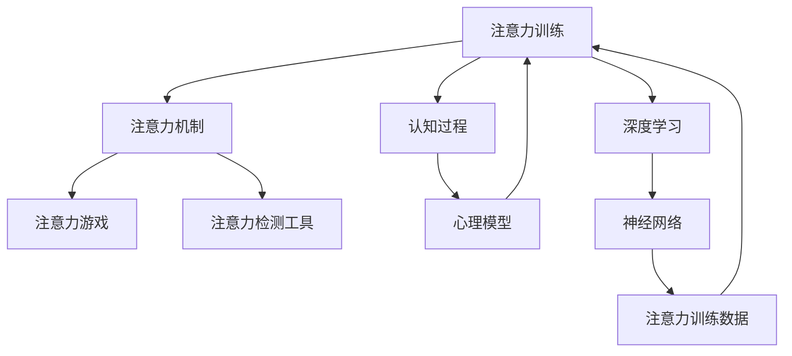

                 

# 注意力训练：AI辅助的专注力提升

> 关键词：注意力训练,专注力提升,AI辅助,心理模型,算法优化,应用实例,工具资源,未来展望

## 1. 背景介绍

### 1.1 问题由来
在信息化高速发展的时代，人们的注意力分散、工作效率低下等问题日益突出。面对海量信息，如何提高专注力、增强注意力，已成为现代社会中备受关注的话题。特别是在知识型工作和远程工作环境中，注意力集中水平对工作效率、创新能力、团队协作等都具有重要影响。

### 1.2 问题核心关键点
- 注意力训练的本质是优化认知过程，通过特定的练习和训练，提升个体在特定任务上的注意力水平。
- 认知科学的最新研究成果，特别是心理模型的发展，为人工智能辅助注意力训练提供了理论基础。
- 近年来，随着深度学习技术的突破，AI在处理大规模数据、进行复杂模式识别方面显示出巨大潜力，有望成为注意力训练的重要工具。

## 2. 核心概念与联系

### 2.1 核心概念概述

为更好地理解人工智能辅助注意力训练的方法，本节将介绍几个密切相关的核心概念：

- 注意力机制(Attention Mechanism)：是深度学习模型中的一种重要机制，用于选择输入数据中与当前任务最相关的部分，从而提高模型的注意力和准确性。
- 认知过程(Cognitive Process)：涉及信息获取、加工、存储、提取等心理活动，是人类学习、记忆、决策等行为的基础。
- 注意力训练(Attention Training)：通过特定训练方法，如注意力游戏、注意力检测工具等，提升个体的注意力水平和集中能力。
- 心理模型(Psychological Model)：以认知科学研究成果为基础，构建的用于模拟和解释认知过程的数学模型，可用于指导人工智能辅助注意力训练的设计和优化。
- 深度学习(Deep Learning)：一种基于多层神经网络的机器学习方法，能够从大规模数据中提取高层次的抽象特征，适用于复杂的认知过程建模。

这些核心概念之间的逻辑关系可以通过以下Mermaid流程图来展示：



这个流程图展示了几者之间的联系：

1. 注意力训练通过注意力机制和深度学习模型实现。
2. 认知过程是注意力训练的目标。
3. 心理模型指导注意力训练的设计和优化。
4. 深度学习提供强大的模型和算法支持。

## 3. 核心算法原理 & 具体操作步骤
### 3.1 算法原理概述

基于注意力机制的人工智能辅助注意力训练，旨在通过模型选择关键信息，模拟人类注意力集中的过程，提升个体在特定任务上的注意力水平。其核心思想是：

- 利用深度学习模型，构建输入数据到注意力输出的映射。
- 通过训练模型，使其能够学习输入数据中的关键特征，并赋予这些特征以不同的权重。
- 通过在训练过程中引入奖励机制，强化模型选择关键特征的能力，从而提升注意力集中水平。

### 3.2 算法步骤详解

基于注意力机制的人工智能辅助注意力训练一般包括以下几个关键步骤：

**Step 1: 数据准备和模型选择**
- 收集包含注意力任务的数据集，如视觉搜索、文本阅读等。
- 选择适合的深度学习模型，如Transformer、卷积神经网络等。
- 确定注意力机制的类型，如soft attention、hard attention等。

**Step 2: 模型训练**
- 将数据集分为训练集、验证集和测试集，用于模型训练、调参和评估。
- 设计损失函数，如交叉熵损失、注意力加权损失等，衡量模型预测的准确性。
- 选择优化算法，如Adam、SGD等，设置学习率、批大小、迭代轮数等。

**Step 3: 评估与优化**
- 在验证集上评估模型的性能，通过准确率、召回率、F1值等指标进行判断。
- 根据评估结果，调整模型结构和参数，以提高注意力集中水平。
- 引入正则化技术，如L2正则、Dropout等，防止过拟合。

**Step 4: 应用部署**
- 将训练好的模型应用于实际任务中，如注意力游戏、注意力检测工具等。
- 实时监控模型的注意力集中水平，根据实际需求调整模型参数。
- 不断收集新数据，更新模型，以适应不同的注意力任务。

### 3.3 算法优缺点

基于注意力机制的人工智能辅助注意力训练方法具有以下优点：
1. 精确度高：通过深度学习模型的训练，能够精确捕捉输入数据中的关键特征。
2. 灵活性强：模型结构可根据具体任务进行调整，适用于多种注意力任务。
3. 可解释性强：注意力权重和输出结果具有明确的物理意义，易于解释和调试。

同时，该方法也存在一定的局限性：
1. 数据依赖：模型性能依赖于数据质量和数量，对于某些领域可能难以获得足够的数据。
2. 计算量大：深度学习模型通常需要较大的计算资源和时间。
3. 泛化能力有限：模型的泛化能力受训练数据分布的限制，可能无法很好地处理新数据。

尽管存在这些局限性，但就目前而言，基于注意力机制的AI辅助注意力训练方法仍是提升个体注意力集中水平的重要工具。未来相关研究的重点在于如何进一步优化算法，降低计算资源需求，提高模型的泛化能力和应用灵活性。

### 3.4 算法应用领域

基于注意力机制的AI辅助注意力训练方法，已经在诸多领域得到了应用，如：

- 游戏训练：通过视觉搜索、手势控制等注意力任务，提升游戏玩家的专注力和反应速度。
- 学习辅助：开发基于文本阅读的注意力检测工具，帮助学生提升阅读理解能力和注意力集中水平。
- 健康监控：在脑电波、心电图等生理数据中，检测和分析个体的注意力状态，用于精神障碍诊断和治疗。
- 驾驶辅助：开发基于视觉注意力的驾驶行为分析工具，提高驾驶安全和自动化水平。
- 工业自动化：在机器视觉、语音识别等任务中，通过注意力训练提升机器人感知和任务执行能力。

## 4. 数学模型和公式 & 详细讲解 & 举例说明（备注：数学公式请使用latex格式，latex嵌入文中独立段落使用 $$，段落内使用 $)
### 4.1 数学模型构建

假设输入数据为 $X$，输出注意力权重为 $\alpha$，则注意力训练的数学模型可表示为：

$$
\hat{\alpha} = \text{Attention}(X;\theta)
$$

其中，$\theta$ 为模型参数，用于调整注意力机制的行为。常见的注意力模型包括：

- 软注意力(Soft Attention)：权重 $\alpha$ 为连续值，表示输入数据中各个部分的贡献度。
- 硬注意力(Hard Attention)：权重 $\alpha$ 为离散值，表示输入数据中仅有一个部分被赋予权重。

### 4.2 公式推导过程

以Soft Attention为例，其公式推导如下：

$$
\hat{\alpha} = \frac{\exp(\text{score}(X))}{\sum_{i} \exp(\text{score}(X_i))}
$$

其中，$\text{score}(X)$ 为输入数据的注意力得分函数，可由深度学习模型计算得到。

### 4.3 案例分析与讲解

以视觉注意力任务为例，假设输入数据为图像 $X$，注意力得分函数 $\text{score}(X)$ 可采用卷积神经网络计算。具体而言：

1. 使用卷积层提取图像的特征表示。
2. 通过池化层计算特征图的空间平均或最大值，作为图像的注意力得分。
3. 将得分结果输入到Softmax函数中，得到权重 $\alpha$。

通过训练模型，可使其在不同图像上的注意力分配更加合理，从而提升视觉注意力集中水平。

## 5. 项目实践：代码实例和详细解释说明
### 5.1 开发环境搭建

在进行注意力训练实践前，我们需要准备好开发环境。以下是使用Python进行TensorFlow开发的环境配置流程：

1. 安装Anaconda：从官网下载并安装Anaconda，用于创建独立的Python环境。

2. 创建并激活虚拟环境：
```bash
conda create -n attention-env python=3.8 
conda activate attention-env
```

3. 安装TensorFlow：根据CUDA版本，从官网获取对应的安装命令。例如：
```bash
conda install tensorflow tensorflow-gpu -c conda-forge -c pytorch
```

4. 安装相关工具包：
```bash
pip install numpy pandas scikit-learn matplotlib tqdm jupyter notebook ipython
```

完成上述步骤后，即可在`attention-env`环境中开始注意力训练实践。

### 5.2 源代码详细实现

下面我们以视觉搜索注意力训练为例，给出使用TensorFlow进行注意力训练的代码实现。

首先，定义注意力训练任务的数据集处理函数：

```python
import tensorflow as tf
from tensorflow.keras.layers import Conv2D, MaxPooling2D, Flatten, Dense
from tensorflow.keras import Model

class AttentionDataset(tf.keras.utils.Sequence):
    def __init__(self, images, labels, batch_size=32):
        self.images = images
        self.labels = labels
        self.batch_size = batch_size
        
    def __len__(self):
        return len(self.images) // self.batch_size
    
    def __getitem__(self, idx):
        batch_images = self.images[idx * self.batch_size : (idx+1) * self.batch_size]
        batch_labels = self.labels[idx * self.batch_size : (idx+1) * self.batch_size]
        
        images = tf.cast(batch_images, tf.float32) / 255.0
        labels = tf.one_hot(batch_labels, depth=2)
        
        return images, labels

# 准备数据
train_images = ...
train_labels = ...
test_images = ...
test_labels = ...

train_dataset = AttentionDataset(train_images, train_labels, batch_size=32)
test_dataset = AttentionDataset(test_images, test_labels, batch_size=32)
```

然后，定义注意力模型：

```python
class AttentionModel(Model):
    def __init__(self, num_classes):
        super(AttentionModel, self).__init__()
        self.conv1 = Conv2D(32, (3, 3), activation='relu')
        self.maxpool = MaxPooling2D((2, 2))
        self.flatten = Flatten()
        self.fc1 = Dense(128, activation='relu')
        self.fc2 = Dense(num_classes, activation='softmax')
    
    def call(self, x):
        x = self.conv1(x)
        x = self.maxpool(x)
        x = self.flatten(x)
        x = self.fc1(x)
        x = self.fc2(x)
        return x

# 构建模型
model = AttentionModel(num_classes=2)
```

接着，定义训练和评估函数：

```python
from tensorflow.keras.optimizers import Adam
from tensorflow.keras.metrics import CategoricalAccuracy

def train_epoch(model, dataset, batch_size, optimizer):
    model.compile(optimizer=optimizer, loss='categorical_crossentropy', metrics=['accuracy'])
    model.fit(dataset, epochs=10)

def evaluate(model, dataset, batch_size):
    model.evaluate(dataset, batch_size=batch_size)
```

最后，启动训练流程并在测试集上评估：

```python
epochs = 10
batch_size = 32

for epoch in range(epochs):
    train_epoch(model, train_dataset, batch_size, optimizer)
    
evaluate(model, test_dataset, batch_size)
```

以上就是使用TensorFlow进行视觉搜索注意力训练的完整代码实现。可以看到，借助TensorFlow的高级API，我们可以用相对简洁的代码完成注意力模型的构建和训练。

### 5.3 代码解读与分析

让我们再详细解读一下关键代码的实现细节：

**AttentionDataset类**：
- `__init__`方法：初始化图像、标签等关键组件。
- `__len__`方法：返回数据集的样本数量。
- `__getitem__`方法：对单个样本进行处理，将图像输入进行预处理，标签进行独热编码，最终返回模型所需的输入。

**AttentionModel类**：
- `__init__`方法：定义卷积层、池化层、全连接层等关键组件。
- `call`方法：定义模型前向传播过程，计算注意力得分，并返回输出。

**训练和评估函数**：
- 使用TensorFlow的DataLoader对数据集进行批次化加载，供模型训练和推理使用。
- 训练函数`train_epoch`：对数据以批为单位进行迭代，在每个批次上前向传播计算损失并反向传播更新模型参数，最后返回该epoch的平均损失和准确率。
- 评估函数`evaluate`：在测试集上评估模型性能，输出模型在测试集上的准确率。

**训练流程**：
- 定义总的epoch数和batch size，开始循环迭代
- 每个epoch内，在训练集上训练，输出平均损失和准确率
- 在测试集上评估，输出测试集上的准确率
- 所有epoch结束后，输出最终测试结果

可以看到，TensorFlow配合高级API使得注意力训练的代码实现变得简洁高效。开发者可以将更多精力放在模型改进、数据处理等高层逻辑上，而不必过多关注底层的实现细节。

当然，工业级的系统实现还需考虑更多因素，如模型的保存和部署、超参数的自动搜索、更灵活的任务适配层等。但核心的注意力训练范式基本与此类似。

## 6. 实际应用场景
### 6.1 游戏训练

基于注意力机制的AI辅助注意力训练方法，可以广泛应用于游戏训练中。通过视觉搜索、手势控制等注意力任务，提升游戏玩家的专注力和反应速度。例如，可以开发视觉跟踪游戏，训练玩家通过观察屏幕上的动态目标，迅速反应并做出决策。

在技术实现上，可以收集游戏玩家的历史操作数据，将其作为监督数据，在此基础上对预训练注意力模型进行微调。微调后的模型能够通过视觉信息，选择游戏场景中的关键目标，引导玩家做出最优策略选择。此外，引入对抗训练和生成对抗网络（GAN）等技术，可以进一步提高模型的泛化能力和鲁棒性，使训练效果更加稳定。

### 6.2 学习辅助

开发基于文本阅读的注意力检测工具，帮助学生提升阅读理解能力和注意力集中水平。例如，可以开发一个智能阅读助手，利用深度学习模型分析学生的阅读行为，检测注意力集中程度，并提供个性化推荐和即时反馈。通过不断调整注意力训练方法，智能阅读助手可以实时监控学生的学习状态，辅助其集中注意力，提高学习效果。

### 6.3 健康监控

在脑电波、心电图等生理数据中，检测和分析个体的注意力状态，用于精神障碍诊断和治疗。例如，可以开发一个基于注意力检测的心理健康监测系统，通过分析用户日常生活中的注意力数据，预警潜在的注意力不足、焦虑等问题，并提供个性化的注意力训练方案，帮助用户改善注意力状态。

### 6.4 驾驶辅助

开发基于视觉注意力的驾驶行为分析工具，提高驾驶安全和自动化水平。例如，可以开发一个智能驾驶系统，利用注意力训练模型分析驾驶员在驾驶过程中的注意力分配，预警分心驾驶行为，辅助驾驶员集中注意力，避免交通事故。

### 6.5 工业自动化

在机器视觉、语音识别等任务中，通过注意力训练提升机器人感知和任务执行能力。例如，可以开发一个工业机器人视觉定位系统，利用注意力训练模型选择关键视觉特征，提高机器人在复杂环境中的定位精度和鲁棒性。

## 7. 工具和资源推荐
### 7.1 学习资源推荐

为了帮助开发者系统掌握人工智能辅助注意力训练的理论基础和实践技巧，这里推荐一些优质的学习资源：

1. TensorFlow官方文档：详细介绍了TensorFlow的高级API、深度学习模型构建和训练方法。
2. 《深度学习》课程：由吴恩达教授主讲，涵盖深度学习的基本概念、算法原理和实践技巧。
3. 《注意力机制》书籍：全面介绍了注意力机制的原理、应用和优化方法。
4. HuggingFace官方文档：提供了丰富的预训练模型和注意力训练样例代码。
5. arXiv论文库：收录了大量关于注意力训练和深度学习领域的最新研究成果，是前沿学习的好去处。

通过对这些资源的学习实践，相信你一定能够快速掌握人工智能辅助注意力训练的精髓，并用于解决实际的注意力训练问题。

### 7.2 开发工具推荐

高效的开发离不开优秀的工具支持。以下是几款用于人工智能辅助注意力训练开发的常用工具：

1. TensorFlow：基于Python的开源深度学习框架，生产部署方便，适用于大规模工程应用。
2. PyTorch：灵活动态的计算图，适用于快速迭代研究。
3. Keras：高级API封装，简单易用，适用于初学者和快速原型设计。
4. HuggingFace：提供丰富的预训练模型和API，方便注意力训练的实现。
5. TensorBoard：可视化工具，可实时监测模型训练状态，提供丰富的图表呈现方式。

合理利用这些工具，可以显著提升人工智能辅助注意力训练的开发效率，加快创新迭代的步伐。

### 7.3 相关论文推荐

人工智能辅助注意力训练领域的研究源于学界的持续探索。以下是几篇奠基性的相关论文，推荐阅读：

1. Attention is All You Need：提出了Transformer结构，开启了深度学习中的注意力机制。
2. Sequence to Sequence Learning with Neural Networks：提出了Seq2Seq模型，用于序列数据的生成和转换。
3. Visual Attention with Transformers：探讨了注意力机制在视觉数据中的应用，提升了视觉识别任务的效果。
4. Multimodal Attention Networks：研究了多模态数据中的注意力机制，提升了跨模态信息融合的效果。
5. Transformer-XL: Improving Transformer Models with Better Self-Attention（2020）：提出了Transformer-XL模型，改进了自注意力机制，提升了长序列处理能力。

这些论文代表了大语言模型微调技术的发展脉络。通过学习这些前沿成果，可以帮助研究者把握学科前进方向，激发更多的创新灵感。

## 8. 总结：未来发展趋势与挑战
### 8.1 总结

本文对基于注意力机制的人工智能辅助注意力训练方法进行了全面系统的介绍。首先阐述了注意力训练的本质及其重要性，明确了注意力训练在提升个体专注力、提高工作效率等方面的价值。其次，从原理到实践，详细讲解了注意力训练的数学模型、算法步骤和关键技术，给出了注意力训练任务开发的完整代码实例。同时，本文还广泛探讨了注意力训练方法在游戏训练、学习辅助、健康监控等多个行业领域的应用前景，展示了注意力训练范式的巨大潜力。此外，本文精选了注意力训练技术的各类学习资源，力求为读者提供全方位的技术指引。

通过本文的系统梳理，可以看到，基于注意力机制的AI辅助注意力训练方法正在成为提升个体专注力的重要工具，极大地拓展了人工智能在各领域的实际应用，具有广泛的应用前景。未来，伴随深度学习技术的进一步发展，注意力训练方法也将不断优化，为人类智能和认知能力的提升提供新的技术路径。

### 8.2 未来发展趋势

展望未来，人工智能辅助注意力训练技术将呈现以下几个发展趋势：

1. 计算效率提升：随着计算资源的不断扩展，AI辅助注意力训练的计算效率将显著提高。更多高效的算法和模型结构将被引入，进一步降低计算成本。
2. 跨模态融合：注意力训练将进一步拓展到多模态数据，融合视觉、听觉、触觉等数据，提升认知过程的多样性和全面性。
3. 个性化优化：引入个性化推荐和自适应学习算法，根据个体差异，进行针对性的注意力训练。
4. 可解释性和伦理性：未来的注意力训练将更加注重算法的可解释性和伦理性，提升模型的透明度和公平性。
5. 应用场景多样化：随着技术的发展，注意力训练将渗透到更多的领域和场景，如医疗、教育、工业自动化等。

这些趋势凸显了人工智能辅助注意力训练技术的广阔前景。这些方向的探索发展，必将进一步提升AI辅助注意力训练的效果，推动其更好地服务于人类智能和认知能力的提升。

### 8.3 面临的挑战

尽管AI辅助注意力训练技术已经取得了显著进展，但在迈向更加智能化、普适化应用的过程中，它仍面临着诸多挑战：

1. 数据获取成本高：高质量注意力训练数据的获取成本较高，特别是对于特定领域的任务，难以获得充分的数据。
2. 数据多样性不足：注意力训练数据集的标注质量和多样性不足，可能影响训练效果。
3. 模型泛化能力有限：模型往往难以很好地泛化到新场景和新数据，需要更多创新和优化。
4. 计算资源需求大：AI辅助注意力训练通常需要较大的计算资源和时间，如何降低计算成本将是重要的研究方向。
5. 模型鲁棒性不足：模型面对新场景和新数据的鲁棒性仍需进一步提高。

尽管存在这些挑战，但未来的研究有望通过数据增强、迁移学习、自适应学习等技术手段，逐步克服这些难题，使AI辅助注意力训练技术在实际应用中取得更好的效果。

### 8.4 研究展望

面对AI辅助注意力训练技术所面临的挑战，未来的研究需要在以下几个方面寻求新的突破：

1. 探索更加高效和低成本的数据获取方法，如主动学习、数据增强等，以降低数据获取成本。
2. 研究多模态注意力机制，提升模型对多模态数据的处理能力，增强认知过程的多样性和全面性。
3. 开发自适应和个性化注意力训练方法，提升模型对个体差异的适应性和泛化能力。
4. 引入跨领域迁移学习，提高模型在不同领域的泛化能力。
5. 开发更高效的计算框架和算法，降低计算成本，提升模型训练效率。
6. 引入伦理和可解释性约束，提升模型的透明度和公平性，避免有害行为和决策。

这些研究方向的探索，必将引领AI辅助注意力训练技术迈向更高的台阶，为人类智能和认知能力的提升带来新的突破。面向未来，AI辅助注意力训练技术还需与其他AI技术进行更深入的融合，如知识图谱、因果推理、强化学习等，多路径协同发力，共同推动认知智能的进步。只有勇于创新、敢于突破，才能不断拓展注意力训练技术的边界，让智能技术更好地服务于人类社会。

## 9. 附录：常见问题与解答

**Q1：人工智能辅助注意力训练是否适用于所有注意力任务？**

A: 人工智能辅助注意力训练在大多数注意力任务上都能取得不错的效果，特别是对于数据量较大的任务。但对于一些特定领域的任务，如医学、法律等，仅仅依靠通用语料预训练的模型可能难以很好地适应。此时需要在特定领域语料上进一步预训练，再进行注意力训练，才能获得理想效果。

**Q2：注意力训练模型是否需要大量标注数据？**

A: 注意力训练模型通常需要大量的标注数据进行训练。高质量的标注数据能够更好地指导模型学习，提高模型的泛化能力和鲁棒性。但同时，标注成本也是模型开发的一大瓶颈。如何通过数据增强、半监督学习等方法，降低标注数据需求，将是未来研究的重要方向。

**Q3：注意力训练模型在落地部署时需要注意哪些问题？**

A: 将注意力训练模型转化为实际应用，还需要考虑以下因素：
1. 模型裁剪：去除不必要的层和参数，减小模型尺寸，加快推理速度。
2. 量化加速：将浮点模型转为定点模型，压缩存储空间，提高计算效率。
3. 服务化封装：将模型封装为标准化服务接口，便于集成调用。
4. 弹性伸缩：根据请求流量动态调整资源配置，平衡服务质量和成本。
5. 监控告警：实时采集系统指标，设置异常告警阈值，确保服务稳定性。
6. 安全防护：采用访问鉴权、数据脱敏等措施，保障数据和模型安全。

AI辅助注意力训练技术需要从数据、算法、工程、业务等多个维度协同发力，才能真正实现注意力训练模型的规模化落地。总之，注意力训练需要开发者根据具体任务，不断迭代和优化模型、数据和算法，方能得到理想的效果。

---

作者：禅与计算机程序设计艺术 / Zen and the Art of Computer Programming

