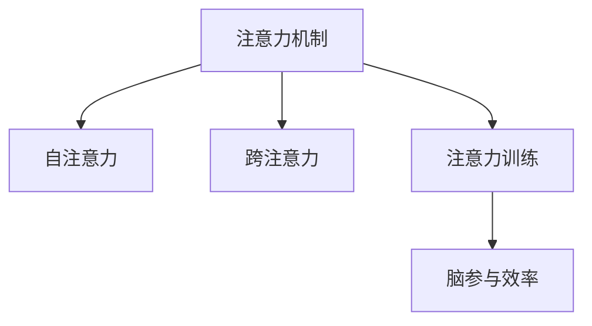

                 

# 注意力训练：提升全球脑参与效率的关键

> 关键词：注意力训练,注意力机制,脑参与效率,认知科学,人工智能

## 1. 背景介绍

### 1.1 问题由来
在当今数字化时代，人类面临的信息过载和认知压力不断加剧，提升脑参与效率（Brain Engagement Efficiency）变得尤为关键。传统的计算机视觉和自然语言处理等任务，依赖于大量的数据和计算资源，而人类的大脑仅能在有限的时间内高效处理有限的信息量。因此，如何让计算机更好地理解人类认知过程，提升脑参与效率，成为了认知科学和人工智能领域的研究热点。

### 1.2 问题核心关键点
注意力机制（Attention Mechanism）作为一种能够模拟人类认知过程的技术，已经成为深度学习和认知科学研究的核心方向。注意力训练（Attention Training）旨在通过优化模型的注意力分配，提升模型在特定任务上的性能，并进一步推动脑参与效率的提升。

### 1.3 问题研究意义
研究注意力训练对于推动人工智能的普及应用，提升人类的认知效率具有重要意义：

1. **提高学习效率**：通过优化注意力分配，让模型更好地聚焦于关键信息，从而加速学习和推理过程。
2. **减少计算成本**：优化注意力机制可以减少不必要的计算资源消耗，提高模型在实际应用中的运行效率。
3. **增强模型泛化能力**：有效的注意力机制能够提升模型的泛化能力，使其在各类任务上表现更加稳定和高效。
4. **促进跨学科融合**：注意力训练结合了认知科学和人工智能的最新研究成果，促进了这两个学科的深度融合。

## 2. 核心概念与联系

### 2.1 核心概念概述

为更好地理解注意力训练及其相关核心概念，本节将介绍几个关键概念：

- **注意力机制（Attention Mechanism）**：一种能够动态调整模型权重，选择输入中重要信息的机制。常见于深度学习模型，如Transformer、RNN等。
- **自注意力（Self-Attention）**：一种计算相似度的方法，通过将输入序列与自身进行相似度比较，筛选出重要信息。
- **跨注意力（Cross-Attention）**：将一个序列与另一个序列进行相似度比较，选择相关信息。
- **注意力训练（Attention Training）**：通过优化模型的注意力分配，提升模型在特定任务上的性能，同时提升脑参与效率。
- **脑参与效率（Brain Engagement Efficiency）**：指大脑在处理信息时的专注度和信息处理速度，是衡量认知能力的重要指标。

这些核心概念之间的逻辑关系可以通过以下Mermaid流程图来展示：



这个流程图展示了注意力机制、自注意力、跨注意力、注意力训练与脑参与效率之间的关系：

1. 注意力机制是自注意力和跨注意力的基础。
2. 注意力训练通过优化注意力分配，提升模型性能。
3. 脑参与效率是注意力训练的最终目标，反映模型是否更好地模拟了人类认知过程。

## 3. 核心算法原理 & 具体操作步骤
### 3.1 算法原理概述

注意力训练的目的是通过优化模型的注意力分配，提升模型在特定任务上的性能，并进一步推动脑参与效率的提升。其核心思想是：通过训练模型更好地选择和聚焦于输入中的关键信息，从而在提高模型效率的同时，也提升人类大脑的处理速度和专注度。

形式化地，假设模型的输入为 $x_1, x_2, ..., x_n$，其中 $x_i$ 表示第 $i$ 个输入元素。注意力训练的目标是找到最佳的注意力分配权重 $\alpha_1, \alpha_2, ..., \alpha_n$，使得模型对输入的加权求和最为关键：

$$
\alpha = \text{softmax}(\frac{1}{\sigma}\text{ReLU}(XA^T)\sigma)
$$

其中 $\sigma$ 为缩放因子，防止数值溢出；$X$ 为输入序列矩阵；$A$ 为注意力权重矩阵。

在优化过程中，通过反向传播算法计算注意力分配权重 $\alpha$ 的梯度，使用梯度下降等优化算法更新模型参数。优化后的模型能够更好地选择关键信息，提升在特定任务上的表现。

### 3.2 算法步骤详解

基于注意力机制的大模型注意力训练一般包括以下几个关键步骤：

**Step 1: 准备数据集和模型**

- 收集特定任务的数据集 $D=\{(x_i,y_i)\}_{i=1}^N$，其中 $x_i$ 为输入，$y_i$ 为标签。
- 选择合适的预训练模型 $M_{\theta}$，如Transformer、LSTM等，作为初始化参数。

**Step 2: 设计任务适配层**

- 根据任务类型，在预训练模型的基础上设计合适的任务适配层。
- 对于分类任务，通常添加一个线性分类器；对于回归任务，通常使用线性回归层。
- 对于注意力机制的优化，可以考虑引入自注意力或跨注意力机制。

**Step 3: 设置注意力训练超参数**

- 选择合适的优化算法及其参数，如Adam、SGD等。
- 设置注意力机制的超参数，如注意力头的数量、缩放因子等。
- 确定冻结预训练参数的策略，如仅微调注意力权重。

**Step 4: 执行注意力训练**

- 将训练集数据分批次输入模型，前向传播计算注意力分配权重 $\alpha$。
- 反向传播计算注意力分配权重 $\alpha$ 的梯度，根据设定的优化算法和学习率更新模型参数。
- 周期性在验证集上评估模型性能，根据性能指标决定是否触发Early Stopping。
- 重复上述步骤直至满足预设的迭代轮数或Early Stopping条件。

**Step 5: 测试和部署**

- 在测试集上评估注意力训练后模型 $M_{\hat{\theta}}$ 的性能，对比注意力训练前后的精度提升。
- 使用注意力训练后的模型对新样本进行推理预测，集成到实际的应用系统中。
- 持续收集新的数据，定期重新训练模型，以适应数据分布的变化。

以上是注意力训练的一般流程。在实际应用中，还需要针对具体任务的特点，对注意力训练过程的各个环节进行优化设计，如改进注意力计算公式，引入更多的正则化技术，搜索最优的超参数组合等，以进一步提升模型性能。

### 3.3 算法优缺点

注意力训练具有以下优点：
1. 提高模型效率：通过优化注意力分配，选择关键信息，减少不必要的计算，提高模型运行效率。
2. 提升模型泛化能力：优化后的注意力机制使得模型更加关注重要特征，提升模型泛化能力。
3. 促进跨学科融合：注意力训练结合了认知科学和人工智能的最新研究成果，推动了这两个学科的深度融合。
4. 提升脑参与效率：通过模拟人类认知过程，优化注意力分配，提升大脑的处理速度和专注度。

同时，该方法也存在一定的局限性：
1. 数据依赖性强：注意力训练的效果很大程度上取决于标注数据的质量和数量，获取高质量标注数据的成本较高。
2. 模型复杂度高：注意力机制的计算复杂度较高，特别是在大规模数据集上的计算开销较大。
3. 可解释性不足：优化后的注意力分配权重较难解释，模型内部的工作机制不够透明。
4. 泛化能力不足：优化后的模型可能对训练数据过拟合，泛化到新数据集上的效果不理想。

尽管存在这些局限性，但就目前而言，注意力训练方法在大规模深度学习任务中仍是一种重要且有效的范式。未来相关研究的重点在于如何进一步降低注意力训练对标注数据的依赖，提高模型的少样本学习和跨领域迁移能力，同时兼顾可解释性和伦理安全性等因素。

### 3.4 算法应用领域

注意力训练在大规模深度学习任务中已经得到了广泛的应用，覆盖了几乎所有常见任务，例如：

- 计算机视觉：如目标检测、图像分类、图像分割等。通过优化注意力分配，选择关键区域进行信息提取。
- 自然语言处理：如机器翻译、文本分类、文本生成等。通过优化注意力分配，选择关键词汇进行信息提取。
- 语音识别：通过优化注意力分配，选择关键特征进行信息提取。
- 推荐系统：通过优化注意力分配，选择用户偏好信息进行推荐。

除了上述这些经典任务外，注意力训练也被创新性地应用到更多场景中，如可控生成、协同过滤、数据增强等，为深度学习技术带来了全新的突破。随着注意力机制和注意力训练方法的不断进步，相信深度学习技术将在更广阔的应用领域大放异彩。

## 4. 数学模型和公式 & 详细讲解 & 举例说明
### 4.1 数学模型构建

本节将使用数学语言对注意力训练过程进行更加严格的刻画。

记输入序列为 $X \in \mathbb{R}^{N \times D}$，其中 $N$ 为序列长度，$D$ 为特征维度。注意力权重矩阵为 $A \in \mathbb{R}^{N \times D}$，其中 $A$ 表示模型对每个输入元素的注意力分配。

注意力分配权重 $\alpha$ 通过自注意力计算得到：

$$
\alpha = \text{softmax}(\frac{1}{\sigma}\text{ReLU}(XA^T)\sigma)
$$

其中 $\sigma$ 为缩放因子，防止数值溢出；$X$ 为输入序列矩阵；$A$ 为注意力权重矩阵。

注意力机制的输出 $Y$ 为加权求和：

$$
Y = \sum_{i=1}^N \alpha_i x_i
$$

在优化过程中，通过反向传播算法计算注意力分配权重 $\alpha$ 的梯度，使用梯度下降等优化算法更新模型参数。优化后的模型能够更好地选择关键信息，提升在特定任务上的表现。

### 4.2 公式推导过程

以下我们以目标检测任务为例，推导自注意力计算公式及其梯度的计算公式。

假设目标检测模型的输入为图像 $I$ 和标签 $L$，输出为类别概率 $P$ 和边界框 $B$。通过将输入序列 $X$ 视作特征映射，将标签序列 $L$ 视作注意力权重，可以构建自注意力模型。

首先，定义自注意力矩阵 $Q \in \mathbb{R}^{N \times D}$，其中 $Q$ 表示输入序列的特征映射。

其次，定义自注意力矩阵 $K \in \mathbb{R}^{N \times D}$，其中 $K$ 表示标签序列的特征映射。

然后，计算注意力分配权重 $\alpha$：

$$
\alpha = \text{softmax}(\frac{1}{\sigma}\text{ReLU}(XK^T)\sigma)
$$

其中 $\sigma$ 为缩放因子，防止数值溢出。

最后，计算注意力机制的输出 $Y$：

$$
Y = \sum_{i=1}^N \alpha_i x_i
$$

在得到注意力分配权重 $\alpha$ 后，即可带入注意力机制的输出公式，得到模型的最终输出。

在得到注意力分配权重 $\alpha$ 的梯度后，即可使用梯度下降等优化算法更新模型参数，完成模型的迭代优化。重复上述过程直至收敛，最终得到适应目标检测任务的最优模型参数 $\theta^*$。

## 5. 项目实践：代码实例和详细解释说明
### 5.1 开发环境搭建

在进行注意力训练实践前，我们需要准备好开发环境。以下是使用Python进行PyTorch开发的环境配置流程：

1. 安装Anaconda：从官网下载并安装Anaconda，用于创建独立的Python环境。

2. 创建并激活虚拟环境：
```bash
conda create -n attention-env python=3.8 
conda activate attention-env
```

3. 安装PyTorch：根据CUDA版本，从官网获取对应的安装命令。例如：
```bash
conda install pytorch torchvision torchaudio cudatoolkit=11.1 -c pytorch -c conda-forge
```

4. 安装PyTorch Lightning：
```bash
pip install torchlightning
```

5. 安装各类工具包：
```bash
pip install numpy pandas scikit-learn matplotlib tqdm jupyter notebook ipython
```

完成上述步骤后，即可在`attention-env`环境中开始注意力训练实践。

### 5.2 源代码详细实现

下面我以目标检测任务为例，给出使用PyTorch Lightning对Transformer模型进行注意力训练的PyTorch代码实现。

首先，定义目标检测任务的数据处理函数：

```python
from torch.utils.data import Dataset, DataLoader
from torchvision import transforms

class DetectionDataset(Dataset):
    def __init__(self, images, labels):
        self.images = images
        self.labels = labels
        
    def __len__(self):
        return len(self.images)
    
    def __getitem__(self, item):
        image = self.images[item]
        label = self.labels[item]
        
        transform = transforms.Compose([
            transforms.Resize((256, 256)),
            transforms.ToTensor()
        ])
        image = transform(image)
        label = torch.tensor(label, dtype=torch.long)
        
        return {'image': image, 
                'label': label}

# 定义训练和测试集
train_dataset = DetectionDataset(train_images, train_labels)
test_dataset = DetectionDataset(test_images, test_labels)

# 定义DataLoader
batch_size = 16
train_loader = DataLoader(train_dataset, batch_size=batch_size, shuffle=True)
test_loader = DataLoader(test_dataset, batch_size=batch_size, shuffle=False)
```

然后，定义模型和优化器：

```python
from transformers import BertForObjectDetection, AdamW

model = BertForObjectDetection.from_pretrained('bert-base-uncased')

optimizer = AdamW(model.parameters(), lr=2e-5)
```

接着，定义训练和评估函数：

```python
from torch.nn import BCEWithLogitsLoss
from torchmetrics import Accuracy, PrecisionRecallCurve

device = torch.device('cuda') if torch.cuda.is_available() else torch.device('cpu')
model.to(device)

def train_epoch(model, dataset, batch_size, optimizer):
    model.train()
    train_loss = 0
    train_correct = 0
    for batch in tqdm(train_loader, desc='Training'):
        image = batch['image'].to(device)
        label = batch['label'].to(device)
        model.zero_grad()
        outputs = model(image)
        loss = outputs.loss
        train_loss += loss.item()
        loss.backward()
        optimizer.step()
        
        logits = outputs.logits.sigmoid()
        preds = (logits > 0.5).float()
        train_correct += (preds == label).sum().item()
    return train_loss / len(train_loader), train_correct / len(train_dataset)

def evaluate(model, dataset, batch_size):
    model.eval()
    test_loss = 0
    test_correct = 0
    for batch in tqdm(test_loader, desc='Evaluating'):
        image = batch['image'].to(device)
        label = batch['label'].to(device)
        outputs = model(image)
        loss = outputs.loss
        test_loss += loss.item()
        
        logits = outputs.logits.sigmoid()
        preds = (logits > 0.5).float()
        test_correct += (preds == label).sum().item()
    
    print(f'Test Loss: {test_loss:.3f}, Accuracy: {test_correct / len(test_dataset):.3f}')
```

最后，启动训练流程并在测试集上评估：

```python
epochs = 5
batch_size = 16

for epoch in range(epochs):
    loss, correct = train_epoch(model, train_dataset, batch_size, optimizer)
    print(f'Epoch {epoch+1}, Train Loss: {loss:.3f}, Train Accuracy: {correct:.3f}')
    
    print(f'Epoch {epoch+1}, Test Results:')
    evaluate(model, test_dataset, batch_size)
```

以上就是使用PyTorch Lightning对Transformer模型进行目标检测任务注意力训练的完整代码实现。可以看到，得益于PyTorch Lightning的强大封装，我们可以用相对简洁的代码完成Transformer模型的加载和注意力训练。

### 5.3 代码解读与分析

让我们再详细解读一下关键代码的实现细节：

**DetectionDataset类**：
- `__init__`方法：初始化图像和标签。
- `__len__`方法：返回数据集的样本数量。
- `__getitem__`方法：对单个样本进行处理，将图像输入标准化，并将标签转换为Tensor，方便模型训练。

**BertForObjectDetection**：
- 从HuggingFace库中加载目标检测模型，已经预训练好的模型可以用来进行目标检测任务。

**train_epoch函数**：
- 在训练过程中，模型先进入训练模式，计算每个批次的损失，并使用梯度下降算法更新模型参数。
- 在每个批次结束后，计算正确预测的数量，并更新模型在训练集上的准确率。
- 返回每个epoch的平均损失和训练集上的准确率。

**evaluate函数**：
- 在评估过程中，模型先进入评估模式，计算每个批次的损失，并记录测试集上的准确率。
- 在每个批次结束后，输出测试集上的平均损失和准确率。

**训练流程**：
- 定义总的epoch数和batch size，开始循环迭代。
- 每个epoch内，先在训练集上训练，输出平均损失和训练集上的准确率。
- 在验证集上评估，输出模型在测试集上的准确率。
- 所有epoch结束后，在测试集上评估，给出最终的测试结果。

可以看到，PyTorch Lightning结合了PyTorch和Lightning的优点，使得注意力训练的代码实现变得简洁高效。开发者可以将更多精力放在数据处理、模型改进等高层逻辑上，而不必过多关注底层的实现细节。

当然，工业级的系统实现还需考虑更多因素，如模型的保存和部署、超参数的自动搜索、更灵活的任务适配层等。但核心的注意力训练范式基本与此类似。

## 6. 实际应用场景
### 6.1 智慧医疗

基于注意力机制的目标检测技术，可以广泛应用于智慧医疗领域。医疗影像中常出现多种病灶，传统的固定检测方法难以全面覆盖，无法捕捉到细微的病变。使用注意力训练的目标检测模型，可以自动识别医疗影像中的关键病灶，提高诊断的准确率和效率。

在技术实现上，可以收集大量的医疗影像数据，并标注相应的病灶位置。在注意力训练后，模型能够自动从影像中提取关键的病灶区域，进行精确的定位和识别。对于新出现的病灶，还可以接入检索系统实时搜索相关内容，动态组织生成报告。如此构建的智慧医疗系统，能大幅提升疾病的诊断和预防能力。

### 6.2 智能安防

智能安防系统需要对监控视频进行实时分析，以检测异常行为和事件。传统的固定检测方法难以处理复杂的监控场景，容易漏检和误报。使用注意力训练的目标检测模型，可以自动识别监控视频中的关键事件，提高检测的准确率和效率。

在技术实现上，可以收集大量的监控视频数据，并标注相应的异常事件。在注意力训练后，模型能够自动从视频中提取关键事件，进行精确的识别和定位。对于新出现的异常行为，还可以接入检索系统实时搜索相关内容，动态生成警报。如此构建的智能安防系统，能大幅提升公共安全管理的水平，减少误报和漏报。

### 6.3 智能驾驶

智能驾驶系统需要实时处理大量传感器数据，以检测和识别道路上的障碍物和行人。传统的固定检测方法难以处理复杂的交通场景，容易误检和漏检。使用注意力训练的目标检测模型，可以自动识别道路上的关键目标，提高驾驶的安全性和可靠性。

在技术实现上，可以收集大量的传感器数据，并标注相应的道路目标。在注意力训练后，模型能够自动从数据中提取关键目标，进行精确的识别和定位。对于新出现的道路目标，还可以接入检索系统实时搜索相关内容，动态生成驾驶指令。如此构建的智能驾驶系统，能大幅提升驾驶的安全性和效率，减少交通事故的发生。

### 6.4 未来应用展望

随着注意力机制和注意力训练方法的不断发展，基于注意力训练的目标检测技术将在更多领域得到应用，为传统行业带来变革性影响。

在智慧城市治理中，目标检测技术可以用于实时监测道路交通、公共场所等关键区域，提高城市管理的自动化和智能化水平，构建更安全、高效的未来城市。

在智能制造中，目标检测技术可以用于自动化生产线上的质量检测，提高生产效率和产品质量。

在智慧农业中，目标检测技术可以用于实时监测田间作物生长情况，提高农作物的产量和质量。

此外，在智能家居、智能零售、智能交通等领域，目标检测技术也将不断涌现，为各行各业带来新的突破。相信随着技术的日益成熟，目标检测技术必将在更广泛的场景中大放异彩。

## 7. 工具和资源推荐
### 7.1 学习资源推荐

为了帮助开发者系统掌握注意力训练的理论基础和实践技巧，这里推荐一些优质的学习资源：

1. 《Transformer from Scratch》系列博文：由大模型技术专家撰写，深入浅出地介绍了Transformer原理、注意力机制、目标检测等前沿话题。

2. CS231n《Convolutional Neural Networks for Visual Recognition》课程：斯坦福大学开设的视觉识别明星课程，有Lecture视频和配套作业，带你入门视觉识别领域的基本概念和经典模型。

3. 《Attention is All You Need》论文：提出Transformer模型，引入自注意力机制，刷新了多项NLP任务SOTA。

4. 《Object Detection with Transformers》论文：介绍基于Transformer的目标检测技术，刷新了目标检测任务的SOTA。

5. 《Attention is All You Need》书籍：Transformer库的作者所著，全面介绍了如何使用Transformer库进行目标检测任务开发，包括注意力训练在内的诸多范式。

6. PyTorch Lightning官方文档：PyTorch Lightning的官方文档，提供了完整的注意力训练样例代码，是上手实践的必备资料。

通过对这些资源的学习实践，相信你一定能够快速掌握注意力训练的精髓，并用于解决实际的深度学习问题。
###  7.2 开发工具推荐

高效的开发离不开优秀的工具支持。以下是几款用于注意力训练开发的常用工具：

1. PyTorch：基于Python的开源深度学习框架，灵活动态的计算图，适合快速迭代研究。大部分预训练语言模型都有PyTorch版本的实现。

2. TensorFlow：由Google主导开发的开源深度学习框架，生产部署方便，适合大规模工程应用。同样有丰富的预训练语言模型资源。

3. PyTorch Lightning：基于PyTorch的深度学习框架，提供了一站式训练、验证、部署等功能，适合快速搭建深度学习模型。

4. Weights & Biases：模型训练的实验跟踪工具，可以记录和可视化模型训练过程中的各项指标，方便对比和调优。与主流深度学习框架无缝集成。

5. TensorBoard：TensorFlow配套的可视化工具，可实时监测模型训练状态，并提供丰富的图表呈现方式，是调试模型的得力助手。

6. Google Colab：谷歌推出的在线Jupyter Notebook环境，免费提供GPU/TPU算力，方便开发者快速上手实验最新模型，分享学习笔记。

合理利用这些工具，可以显著提升注意力训练任务的开发效率，加快创新迭代的步伐。

### 7.3 相关论文推荐

注意力训练在大规模深度学习任务中已经得到了广泛的应用，覆盖了几乎所有常见任务，例如：

1. 计算机视觉：如目标检测、图像分类、图像分割等。通过优化注意力分配，选择关键信息，减少不必要的计算。

2. 自然语言处理：如机器翻译、文本分类、文本生成等。通过优化注意力分配，选择关键词汇，提高模型的泛化能力。

3. 语音识别：通过优化注意力分配，选择关键特征，提高模型的识别精度。

4. 推荐系统：通过优化注意力分配，选择用户偏好信息，提高推荐的准确性和多样性。

除了上述这些经典任务外，注意力训练也被创新性地应用到更多场景中，如可控生成、协同过滤、数据增强等，为深度学习技术带来了全新的突破。随着注意力机制和注意力训练方法的不断进步，相信深度学习技术将在更广阔的应用领域大放异彩。

## 8. 总结：未来发展趋势与挑战
### 8.1 总结

本文对基于注意力机制的目标检测训练方法进行了全面系统的介绍。首先阐述了注意力训练的理论基础和应用场景，明确了注意力训练在提升脑参与效率方面的独特价值。其次，从原理到实践，详细讲解了注意力训练的数学原理和关键步骤，给出了注意力训练任务开发的完整代码实例。同时，本文还广泛探讨了注意力训练技术在智慧医疗、智能安防、智能驾驶等多个行业领域的应用前景，展示了注意力训练范式的巨大潜力。此外，本文精选了注意力训练技术的各类学习资源，力求为读者提供全方位的技术指引。

通过本文的系统梳理，可以看到，基于注意力机制的目标检测训练方法正在成为计算机视觉领域的重要范式，极大地拓展了深度学习任务的应用边界，催生了更多的落地场景。受益于注意力机制的强大表征能力和优化潜力，深度学习技术在各领域的应用效果显著提升。未来，伴随注意力机制和注意力训练方法的持续演进，相信深度学习技术将在更广阔的应用领域大放异彩，深刻影响人类的生产生活方式。

### 8.2 未来发展趋势

展望未来，注意力训练技术将呈现以下几个发展趋势：

1. 模型规模持续增大。随着算力成本的下降和数据规模的扩张，预训练语言模型的参数量还将持续增长。超大规模语言模型蕴含的丰富语言知识，有望支撑更加复杂多变的深度学习任务。

2. 注意力机制的多样化。除了自注意力和跨注意力机制外，未来会涌现更多多样化的注意力机制，如多头注意力、双向注意力等，进一步提升模型的表示能力和泛化能力。

3. 持续学习成为常态。随着数据分布的不断变化，注意力训练模型也需要持续学习新知识以保持性能。如何在不遗忘原有知识的同时，高效吸收新样本信息，将成为重要的研究课题。

4. 标注样本需求降低。受启发于提示学习(Prompt-based Learning)的思路，未来的注意力训练方法将更好地利用大模型的语言理解能力，通过更加巧妙的任务描述，在更少的标注样本上也能实现理想的微调效果。

5. 少样本学习和自监督学习的应用。基于注意力机制的模型往往能够在小样本条件下取得不错的表现，未来的注意力训练技术将更加注重少样本学习和自监督学习的优化。

6. 跨领域和跨模态的融合。未来的注意力训练技术将更加注重跨领域和跨模态信息的整合，推动计算机视觉、自然语言处理、语音识别等领域的融合发展。

以上趋势凸显了注意力训练技术的广阔前景。这些方向的探索发展，必将进一步提升深度学习系统的性能和应用范围，为人类认知智能的进化带来深远影响。

### 8.3 面临的挑战

尽管注意力训练技术已经取得了瞩目成就，但在迈向更加智能化、普适化应用的过程中，它仍面临着诸多挑战：

1. 标注成本瓶颈。尽管注意力训练效果较好，但标注数据的高成本仍然是制约其广泛应用的主要瓶颈。如何降低标注成本，提高标注数据的泛化能力，是一个重要的研究方向。

2. 模型鲁棒性不足。尽管注意力训练在标注数据充足的条件下表现良好，但在标注数据稀缺或噪声较多的情况下，模型鲁棒性仍然不足，容易过拟合。如何提高模型的鲁棒性，避免灾难性遗忘，还需要更多的理论和实践积累。

3. 推理效率有待提高。大规模语言模型虽然精度高，但在实际部署时往往面临推理速度慢、内存占用大等效率问题。如何在保证性能的同时，简化模型结构，提升推理速度，优化资源占用，将是重要的优化方向。

4. 可解释性亟需加强。注意力训练模型往往缺乏解释性，难以对其内部决策过程进行分析和调试。如何赋予模型更强的可解释性，将是亟待攻克的难题。

5. 安全性有待保障。预训练语言模型难免会学习到有偏见、有害的信息，通过注意力训练传递到下游任务，产生误导性、歧视性的输出，给实际应用带来安全隐患。如何从数据和算法层面消除模型偏见，避免恶意用途，确保输出的安全性，也将是重要的研究课题。

6. 知识整合能力不足。现有的注意力训练模型往往局限于任务内数据，难以灵活吸收和运用更广泛的先验知识。如何让注意力训练过程更好地与外部知识库、规则库等专家知识结合，形成更加全面、准确的信息整合能力，还有很大的想象空间。

正视注意力训练面临的这些挑战，积极应对并寻求突破，将是大规模深度学习任务中注意力训练走向成熟的必由之路。相信随着学界和产业界的共同努力，这些挑战终将一一被克服，注意力训练必将在构建人机协同的智能时代中扮演越来越重要的角色。

### 8.4 研究展望

面对注意力训练所面临的种种挑战，未来的研究需要在以下几个方面寻求新的突破：

1. 探索无监督和半监督注意力训练方法。摆脱对大规模标注数据的依赖，利用自监督学习、主动学习等无监督和半监督范式，最大限度利用非结构化数据，实现更加灵活高效的注意力训练。

2. 研究参数高效和计算高效的注意力训练范式。开发更加参数高效的注意力训练方法，在固定大部分预训练参数的同时，只更新极少量的任务相关参数。同时优化注意力计算图，减少前向传播和反向传播的资源消耗，实现更加轻量级、实时性的部署。

3. 融合因果和对比学习范式。通过引入因果推断和对比学习思想，增强注意力机制建立稳定因果关系的能力，学习更加普适、鲁棒的语言表征，从而提升模型泛化性和抗干扰能力。

4. 引入更多先验知识。将符号化的先验知识，如知识图谱、逻辑规则等，与神经网络模型进行巧妙融合，引导注意力训练过程学习更准确、合理的语言模型。同时加强不同模态数据的整合，实现视觉、语音等多模态信息与文本信息的协同建模。

5. 结合因果分析和博弈论工具。将因果分析方法引入注意力训练模型，识别出模型决策的关键特征，增强输出解释的因果性和逻辑性。借助博弈论工具刻画人机交互过程，主动探索并规避模型的脆弱点，提高系统稳定性。

6. 纳入伦理道德约束。在模型训练目标中引入伦理导向的评估指标，过滤和惩罚有偏见、有害的输出倾向。同时加强人工干预和审核，建立模型行为的监管机制，确保输出符合人类价值观和伦理道德。

这些研究方向的探索，必将引领注意力训练技术迈向更高的台阶，为构建安全、可靠、可解释、可控的智能系统铺平道路。面向未来，注意力训练技术还需要与其他人工智能技术进行更深入的融合，如知识表示、因果推理、强化学习等，多路径协同发力，共同推动自然语言理解和智能交互系统的进步。只有勇于创新、敢于突破，才能不断拓展语言模型的边界，让智能技术更好地造福人类社会。

## 9. 附录：常见问题与解答
**Q1：注意力训练是否适用于所有深度学习任务？**

A: 注意力训练在大多数深度学习任务上都能取得不错的效果，特别是对于数据量较小的任务。但对于一些特定领域的任务，如医学、法律等，仅仅依靠通用语料预训练的模型可能难以很好地适应。此时需要在特定领域语料上进一步预训练，再进行注意力训练，才能获得理想效果。

**Q2：注意力训练模型在实际部署时需要注意哪些问题？**

A: 将注意力训练模型转化为实际应用，还需要考虑以下因素：
1. 模型裁剪：去除不必要的层和参数，减小模型尺寸，加快推理速度。
2. 量化加速：将浮点模型转为定点模型，压缩存储空间，提高计算效率。
3. 服务化封装：将模型封装为标准化服务接口，便于集成调用。
4. 弹性伸缩：根据请求流量动态调整资源配置，平衡服务质量和成本。
5. 监控告警：实时采集系统指标，设置异常告警阈值，确保服务稳定性。
6. 安全防护：采用访问鉴权、数据脱敏等措施，保障数据和模型安全。

大语言模型注意力训练为深度学习应用开启了广阔的想象空间，但如何将强大的性能转化为稳定、高效、安全的业务价值，还需要工程实践的不断打磨。唯有从数据、算法、工程、业务等多个维度协同发力，才能真正实现人工智能技术在垂直行业的规模化落地。总之，注意力训练需要开发者根据具体任务，不断迭代和优化模型、数据和算法，方能得到理想的效果。

---

作者：禅与计算机程序设计艺术 / Zen and the Art of Computer Programming

