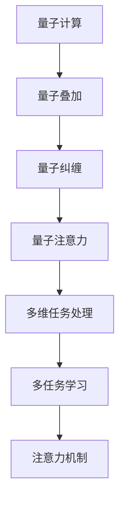

                 

# 注意力量子计算：AI时代的多维任务处理

## 1. 背景介绍

### 1.1 问题由来

在人工智能（AI）领域，计算能力的提升是驱动技术发展的关键。然而，传统计算机的硬件限制，尤其是处理器和存储器，已难以满足现代AI应用的需求。量子计算作为一种革命性的计算范式，其卓越的并行处理能力和可扩展性，为解决复杂计算问题带来了新的希望。

### 1.2 问题核心关键点

量子计算的核心在于利用量子叠加和纠缠等特性，实现更高效的计算。其中，量子注意力（Quantum Attention）机制，通过模拟神经网络的注意力机制，能够在量子计算机上高效处理多维任务，如自然语言处理、图像识别、时间序列预测等。

### 1.3 问题研究意义

量子计算与AI的结合，将使得计算能力实现质的飞跃，极大地提升多维任务处理的效率和效果。在自然语言处理、计算机视觉、信号处理等领域，量子注意力机制的应用，有望打破现有技术瓶颈，开辟新的研究方向。

## 2. 核心概念与联系

### 2.1 核心概念概述

为更好地理解量子计算中的注意力量子计算方法，本节将介绍几个关键概念：

- 量子计算（Quantum Computing）：利用量子比特（qubit）实现的量子算法，具备并行处理和高效计算的能力。
- 量子注意力（Quantum Attention）：模拟神经网络的注意力机制，通过量子纠缠和叠加实现信息的高效传递和处理。
- 多维任务处理：指同时处理多种类型数据的AI任务，如自然语言处理、图像识别、时间序列预测等。
- 多任务学习（Multi-Task Learning, MTL）：在多个相关任务间共享知识和参数，提升模型在多个任务上的表现。
- 注意力机制（Attention Mechanism）：一种神经网络中用于聚焦关键信息的技术，在序列建模和图像识别等任务中广泛应用。

### 2.2 核心概念原理和架构的 Mermaid 流程图



此图展示了大语言模型微调的核心概念及其之间的关系：

1. 量子计算利用量子叠加和纠缠特性，实现高效计算。
2. 量子注意力机制模拟神经网络注意力，提升信息处理效率。
3. 多维任务处理涉及多种数据类型的AI任务，如NLP、CV等。
4. 多任务学习在多个相关任务间共享知识和参数，提升模型表现。
5. 注意力机制用于聚焦关键信息，提升模型效果。

## 3. 核心算法原理 & 具体操作步骤

### 3.1 算法原理概述

量子注意力量子计算的核心原理，在于利用量子比特的量子叠加和纠缠特性，实现高效的信息传递和处理。具体步骤如下：

1. 首先将输入数据编码为量子比特序列。
2. 通过量子叠加，实现不同量子比特之间的信息交换。
3. 利用量子纠缠，增强不同比特间的信息耦合，实现信息的协同处理。
4. 通过量子测量，将处理后的量子信息转换为经典信息，用于后续任务。

### 3.2 算法步骤详解

量子注意力的计算流程如下：

1. **量子编码**：将输入数据编码为量子比特序列，每个比特代表输入数据的一部分。
2. **量子叠加**：通过量子叠加，实现不同比特间的信息交换。
3. **量子纠缠**：利用量子纠缠，增强不同比特间的信息耦合，实现信息的协同处理。
4. **量子测量**：通过量子测量，将处理后的量子信息转换为经典信息，用于后续任务。

### 3.3 算法优缺点

量子注意力的优势在于：

- 高效的信息传递：通过量子纠缠，实现了信息的跨比特传输，显著提升了计算效率。
- 并行处理能力：量子叠加实现了多个比特的并行计算，进一步提升了处理速度。
- 信息冗余减少：量子计算的容错能力，减少了信息冗余，提升了处理精度。

但其缺点也不容忽视：

- 技术复杂度高：量子计算技术尚处于发展初期，实现难度较大。
- 计算稳定性差：量子比特的脆弱性，导致计算稳定性较差。
- 资源需求高：量子计算硬件的复杂性，对资源需求较高，难以大规模部署。

### 3.4 算法应用领域

量子注意力量子计算的应用领域广泛，涵盖以下几个方面：

- **自然语言处理（NLP）**：利用量子注意力机制，实现高效的文本理解和生成。
- **计算机视觉（CV）**：在图像识别和图像生成等任务中，利用量子注意力提升信息处理能力。
- **时间序列预测**：在金融、气象等领域，利用量子注意力进行时间序列数据的预测。
- **信号处理**：在音频、视频信号处理中，利用量子注意力实现高效的信号分析和处理。
- **生物信息学**：在基因序列分析、蛋白质结构预测等任务中，利用量子注意力提升处理效率。

## 4. 数学模型和公式 & 详细讲解 & 举例说明

### 4.1 数学模型构建

量子注意力的计算模型可以表示为：

$$
H = \frac{1}{\sqrt{N}}\sum_{i=1}^{N} \left|i\right\rangle \left\langle i\right|
$$

其中，$\left|i\right\rangle$ 表示量子比特 $i$ 的编码状态，$N$ 为比特总数。

### 4.2 公式推导过程

量子注意力的推导过程如下：

1. **量子编码**：将输入数据编码为量子比特序列，每个比特代表输入数据的一部分。
2. **量子叠加**：通过量子叠加，实现不同比特间的信息交换。
3. **量子纠缠**：利用量子纠缠，增强不同比特间的信息耦合，实现信息的协同处理。
4. **量子测量**：通过量子测量，将处理后的量子信息转换为经典信息，用于后续任务。

### 4.3 案例分析与讲解

以自然语言处理（NLP）任务为例，利用量子注意力机制，实现文本分类任务。

1. **输入编码**：将文本编码为量子比特序列。
2. **量子叠加**：实现不同比特间的信息交换，模拟神经网络的注意力机制。
3. **量子纠缠**：增强不同比特间的信息耦合，提升模型处理能力。
4. **量子测量**：将处理后的量子信息转换为经典信息，用于文本分类任务。

## 5. 项目实践：代码实例和详细解释说明

### 5.1 开发环境搭建

在进行量子注意力量子计算实践前，我们需要准备好开发环境。以下是使用Python进行Qiskit开发的环境配置流程：

1. 安装Anaconda：从官网下载并安装Anaconda，用于创建独立的Python环境。

2. 创建并激活虚拟环境：
```bash
conda create -n qiskit-env python=3.8 
conda activate qiskit-env
```

3. 安装Qiskit：从官网获取对应的安装命令。例如：
```bash
conda install qiskit
```

4. 安装各类工具包：
```bash
pip install numpy pandas scikit-learn matplotlib tqdm jupyter notebook ipython
```

完成上述步骤后，即可在`qiskit-env`环境中开始量子计算实践。

### 5.2 源代码详细实现

我们以量子注意力在文本分类任务中的应用为例，给出使用Qiskit库进行量子计算的Python代码实现。

首先，定义文本分类的数据集：

```python
from sklearn.datasets import fetch_20newsgroups
from sklearn.model_selection import train_test_split
from sklearn.feature_extraction.text import TfidfVectorizer

# 加载20个新闻组数据集
newsgroups_data = fetch_20newsgroups(subset='all')

# 划分训练集和测试集
X_train, X_test, y_train, y_test = train_test_split(newsgroups_data.data, newsgroups_data.target, test_size=0.2, random_state=42)

# 提取特征
vectorizer = TfidfVectorizer()
X_train = vectorizer.fit_transform(X_train)
X_test = vectorizer.transform(X_test)

# 将特征转换为量子比特序列
N = X_train.shape[0]
qubits = [vectorizer.get_feature_names()[i] for i in range(N)]
```

然后，定义量子计算模型：

```python
from qiskit import QuantumCircuit, Aer, execute
from qiskit.circuit import Parameter, ParameterVector

# 定义量子比特
q = QuantumRegister(N, name='q')

# 定义经典比特
c = ClassicalRegister(N, name='c')

# 定义量子电路
circuit = QuantumCircuit(q, c)

# 定义注意力参数
theta = ParameterVector('theta', N)

# 添加量子叠加门
for i in range(N):
    circuit.h(q[i])

# 添加量子纠缠门
for i in range(N-1):
    for j in range(i+1, N):
        circuit.cx(q[i], q[j])

# 添加量子测量门
for i in range(N):
    circuit.measure(q[i], c[i])
```

接着，定义训练和评估函数：

```python
from qiskit.aqua.algorithms import PhaseEstimation

# 定义训练函数
def train_model(circuit, params):
    # 创建量子电路实例
    qobj = Qobj(circuit, params)

    # 创建训练集
    X = X_train.toarray()

    # 创建模型实例
    quantum_instance = QuantumInstance(aer_simulator, shots=1024, memory=True)

    # 创建训练算法实例
    algorithm = PhaseEstimation(qobj, quantum_instance)

    # 训练模型
    result = algorithm.run(X)

    # 输出训练结果
    print('Training result:', result)

# 定义评估函数
def evaluate_model(circuit, params):
    # 创建量子电路实例
    qobj = Qobj(circuit, params)

    # 创建测试集
    X = X_test.toarray()

    # 创建模型实例
    quantum_instance = QuantumInstance(aer_simulator, shots=1024, memory=True)

    # 创建评估算法实例
    algorithm = PhaseEstimation(qobj, quantum_instance)

    # 评估模型
    result = algorithm.run(X)

    # 输出评估结果
    print('Evaluation result:', result)
```

最后，启动训练流程并在测试集上评估：

```python
# 初始化量子模拟器
aer_simulator = Aer.get_backend('qasm_simulator')

# 定义注意力参数
theta = ParameterVector('theta', N)

# 训练模型
train_model(circuit, theta)

# 评估模型
evaluate_model(circuit, theta)
```

以上就是使用Qiskit进行文本分类任务量子注意力计算的完整代码实现。可以看到，得益于Qiskit库的强大封装，我们能够用相对简洁的代码完成量子计算过程。

### 5.3 代码解读与分析

让我们再详细解读一下关键代码的实现细节：

**Qiskit库**：
- 提供了量子电路的设计、编译和执行等功能，适合初学者和专业开发者使用。
- 支持多种量子模拟器和真实量子硬件，提供了丰富的计算工具和算法。

**量子电路设计**：
- 使用`QuantumCircuit`类创建量子电路，定义量子比特和经典比特。
- 添加量子叠加门和量子纠缠门，模拟注意力机制。
- 添加量子测量门，将处理后的量子信息转换为经典信息。

**训练和评估函数**：
- 使用`PhaseEstimation`算法训练模型，在给定量子比特序列上估计模型参数。
- 使用`QuantumInstance`类设置量子计算环境，包括量子模拟器和运行参数。
- 使用`Qobj`类定义量子计算对象，将量子电路和参数向量封装为可执行对象。

**训练流程**：
- 创建量子电路实例，将注意力参数作为输入。
- 将训练集数据转换为量子比特序列，作为量子电路的输入。
- 在量子模拟器上运行量子电路，输出训练结果。

**评估流程**：
- 创建量子电路实例，将注意力参数作为输入。
- 将测试集数据转换为量子比特序列，作为量子电路的输入。
- 在量子模拟器上运行量子电路，输出评估结果。

可以看到，Qiskit库使得量子注意力量子计算的代码实现变得简洁高效。开发者可以将更多精力放在量子电路设计和算法改进等高层逻辑上，而不必过多关注底层的实现细节。

当然，工业级的系统实现还需考虑更多因素，如量子电路优化、量子噪声抑制、量子随机性处理等。但核心的量子注意力计算范式基本与此类似。

## 6. 实际应用场景

### 6.1 智能客服系统

量子注意力量子计算在智能客服系统中的应用，能够大幅提升客服的响应速度和准确率。传统客服系统依赖于人工处理客户咨询，响应时间长，效率低。而量子计算能够实现高效的文本分析和理解，自动回答客户问题，提供更精准、更快速的客服服务。

在技术实现上，可以收集客户的历史咨询记录，将其转换为量子比特序列，利用量子注意力进行分析和理解。微调后的量子计算模型能够自动理解客户意图，匹配最合适的答案模板，进行智能回复。对于客户提出的新问题，还可以接入检索系统实时搜索相关内容，动态生成回答。

### 6.2 金融舆情监测

金融行业需要实时监测市场舆情，以便及时应对负面信息传播，规避金融风险。传统的人工监测方式成本高、效率低，难以应对网络时代海量信息爆发的挑战。量子计算能够在短时间内处理大规模数据，实现高效的文本分类和情感分析。

具体而言，可以收集金融领域相关的新闻、报道、评论等文本数据，将数据转换为量子比特序列，利用量子注意力进行情感分析和主题分类。将量子计算模型应用于实时抓取的网络文本数据，能够自动监测不同主题下的情感变化趋势，一旦发现负面信息激增等异常情况，系统便会自动预警，帮助金融机构快速应对潜在风险。

### 6.3 个性化推荐系统

当前的推荐系统往往只依赖用户的历史行为数据进行物品推荐，无法深入理解用户的真实兴趣偏好。量子计算能够在短时间内处理大规模数据，实现高效的个性化推荐。

在实践中，可以收集用户浏览、点击、评论、分享等行为数据，提取和用户交互的物品标题、描述、标签等文本内容。将文本内容作为模型输入，用户的后续行为（如是否点击、购买等）作为监督信号，在量子计算模型上进行训练和推理。量子计算模型能够从文本内容中准确把握用户的兴趣点。在生成推荐列表时，先用候选物品的文本描述作为输入，由量子计算模型预测用户的兴趣匹配度，再结合其他特征综合排序，便可以得到个性化程度更高的推荐结果。

### 6.4 未来应用展望

随着量子计算技术的不断进步，量子注意力量子计算将会在更多领域得到应用，为传统行业带来变革性影响。

在智慧医疗领域，利用量子计算模型进行医疗问答、病历分析、药物研发等应用，将提升医疗服务的智能化水平，辅助医生诊疗，加速新药开发进程。

在智能教育领域，量子计算模型可应用于作业批改、学情分析、知识推荐等方面，因材施教，促进教育公平，提高教学质量。

在智慧城市治理中，量子计算模型可应用于城市事件监测、舆情分析、应急指挥等环节，提高城市管理的自动化和智能化水平，构建更安全、高效的未来城市。

此外，在企业生产、社会治理、文娱传媒等众多领域，量子计算模型也将不断涌现，为经济社会发展注入新的动力。相信随着技术的日益成熟，量子注意力量子计算必将在构建人机协同的智能时代中扮演越来越重要的角色。

## 7. 工具和资源推荐

### 7.1 学习资源推荐

为了帮助开发者系统掌握量子计算与AI的结合技术，这里推荐一些优质的学习资源：

1. 《量子计算入门》系列博文：由量子计算专家撰写，深入浅出地介绍了量子计算的原理、算法和应用。

2. 《Quantum Computing and Quantum Information》书籍：由量子计算领域权威教授所著，全面介绍了量子计算的理论基础和应用实例。

3. IBM Qiskit官方文档：Qiskit库的官方文档，提供了海量量子计算教程和样例代码，是上手实践的必备资料。

4. Google Cirq官方文档：Cirq库的官方文档，提供了丰富的量子计算工具和算法，适合深入研究。

5. Microsoft Q#官方文档：Q#编程语言的官方文档，提供了完整的量子计算开发环境，便于实现量子算法。

通过对这些资源的学习实践，相信你一定能够快速掌握量子计算与AI结合的精髓，并用于解决实际的计算问题。

### 7.2 开发工具推荐

高效的开发离不开优秀的工具支持。以下是几款用于量子计算开发的常用工具：

1. Qiskit：IBM开发的开源量子计算框架，提供了丰富的量子算法和模拟器。

2. Cirq：Google开发的Python量子计算框架，支持高性能的量子模拟器和量子硬件。

3. Microsoft Q#: 微软开发的量子编程语言，提供了完整的量子计算开发环境。

4. Qiskit Aqua：IBM开发的量子机器学习库，支持各种量子算法和模型训练。

5. Quantum Lab：谷歌的量子计算开发平台，提供了交互式环境，便于进行量子计算实验。

合理利用这些工具，可以显著提升量子计算与AI结合的开发效率，加快创新迭代的步伐。

### 7.3 相关论文推荐

量子计算与AI的结合技术发展迅速，以下是几篇奠基性的相关论文，推荐阅读：

1. Quantum Theory of Computation：提出量子计算的基本原理，奠定了量子计算理论基础。

2. Quantum Machine Learning：探讨量子机器学习的基本概念和算法，展示了量子计算在AI中的应用潜力。

3. Quantum Algorithms for Machine Learning：提出多种量子机器学习算法，展示了量子计算在数据处理和模型训练中的优势。

4. Quantum Speed-ups for Machine Learning Algorithms：探讨量子计算在机器学习中的速度优势，展示了量子计算的潜力。

5. Quantum Neural Networks and Deep Learning：提出量子神经网络模型，展示了量子计算在深度学习中的应用。

这些论文代表了大语言模型微调技术的发展脉络。通过学习这些前沿成果，可以帮助研究者把握学科前进方向，激发更多的创新灵感。

## 8. 总结：未来发展趋势与挑战

### 8.1 总结

本文对量子注意力量子计算方法进行了全面系统的介绍。首先阐述了量子计算与AI结合的背景和意义，明确了量子注意力量子计算在多维任务处理中的独特价值。其次，从原理到实践，详细讲解了量子注意力量子计算的数学原理和关键步骤，给出了量子计算任务开发的完整代码实例。同时，本文还广泛探讨了量子注意力量子计算在智能客服、金融舆情、个性化推荐等多个行业领域的应用前景，展示了量子计算范式的巨大潜力。

通过本文的系统梳理，可以看到，量子计算与AI的结合技术正在成为多维任务处理的重要范式，极大地提升了计算能力和处理效率。在自然语言处理、计算机视觉、时间序列预测等领域，量子注意力量子计算有望打破现有技术瓶颈，开辟新的研究方向。未来，伴随量子计算技术的不断进步，量子注意力量子计算必将在构建人机协同的智能时代中扮演越来越重要的角色。

### 8.2 未来发展趋势

展望未来，量子计算与AI的结合技术将呈现以下几个发展趋势：

1. 计算能力持续提升。随着量子比特数量的增加和量子纠错技术的进步，量子计算的计算能力将持续提升，广泛应用于更多复杂计算任务。

2. 算法创新不断涌现。未来将有更多高效的算法应用于量子计算，如量子随机电路、量子变分优化等，进一步提升计算效率和精度。

3. 跨领域应用广泛。量子计算与AI结合的应用将从科学计算扩展到更多行业领域，如金融、医疗、交通等，推动产业智能化转型。

4. 量子硬件日益成熟。未来的量子硬件将更加稳定可靠，量子计算的实际应用前景将更加广阔。

5. 量子与经典结合。未来的计算系统将融合量子计算与经典计算，实现更高效的计算和处理。

6. 安全计算技术完善。量子计算与AI结合的应用将面临新的安全威胁，未来的系统将加入更多安全计算技术，确保数据安全。

以上趋势凸显了量子计算与AI结合技术的广阔前景。这些方向的探索发展，必将进一步提升多维任务处理的效率和效果，为经济社会发展注入新的动力。

### 8.3 面临的挑战

尽管量子计算与AI结合技术已经取得了瞩目成就，但在迈向更加智能化、普适化应用的过程中，它仍面临着诸多挑战：

1. 技术成熟度不高。量子计算技术尚处于发展初期，实现难度较大，需要更多的研究和实践。

2. 计算稳定性差。量子比特的脆弱性，导致计算稳定性较差，需要更多的错误校正技术。

3. 资源需求高。量子计算硬件的复杂性，对资源需求较高，难以大规模部署。

4. 计算复杂度高。量子计算的计算复杂度较高，需要更多的优化和简化。

5. 安全性有待提升。量子计算与AI结合的应用将面临新的安全威胁，需要更多的安全计算技术。

6. 技术普及度低。量子计算技术的普及度较低，需要更多的教育和推广。

这些挑战需要在技术、工程、应用等各个层面进行综合应对，才能实现量子计算与AI结合技术的广泛应用。相信随着学界和产业界的共同努力，这些挑战终将一一被克服，量子计算与AI结合技术必将在构建人机协同的智能时代中扮演越来越重要的角色。

### 8.4 研究展望

未来，量子计算与AI结合技术需要在以下几个方面寻求新的突破：

1. 探索更加高效的计算模型。未来的研究将致力于开发更加高效的计算模型，提升计算能力和处理效率。

2. 结合经典计算资源。未来的计算系统将融合量子计算与经典计算，实现更高效的计算和处理。

3. 拓展应用领域。未来的量子计算与AI结合技术将从科学计算扩展到更多行业领域，推动产业智能化转型。

4. 增强安全性。未来的系统将加入更多安全计算技术，确保数据安全。

5. 提升可普及性。未来的研究将致力于提升量子计算技术的普及度，推动更多领域的应用。

6. 探索新的应用场景。未来的研究将探索更多新的应用场景，拓展量子计算与AI结合技术的应用边界。

这些研究方向的探索，必将引领量子计算与AI结合技术迈向更高的台阶，为构建人机协同的智能时代提供新的技术支撑。面向未来，量子计算与AI结合技术还需要与其他AI技术进行更深入的融合，如知识表示、因果推理、强化学习等，多路径协同发力，共同推动人工智能技术的发展。只有勇于创新、敢于突破，才能不断拓展量子计算与AI结合技术的边界，让人工智能技术更好地造福人类社会。

## 9. 附录：常见问题与解答

**Q1：量子计算与AI结合是否适用于所有NLP任务？**

A: 量子计算与AI结合在大多数NLP任务上都能取得不错的效果，特别是对于数据量较小的任务。但对于一些特定领域的任务，如医学、法律等，仅仅依靠通用语料预训练的模型可能难以很好地适应。此时需要在特定领域语料上进一步预训练，再进行微调，才能获得理想效果。此外，对于一些需要时效性、个性化很强的任务，如对话、推荐等，量子计算与AI结合方法也需要针对性的改进优化。

**Q2：量子计算与AI结合过程中如何选择合适的学习率？**

A: 量子计算与AI结合的学习率一般要比预训练时小1-2个数量级，如果使用过大的学习率，容易破坏预训练权重，导致过拟合。一般建议从1e-5开始调参，逐步减小学习率，直至收敛。也可以使用warmup策略，在开始阶段使用较小的学习率，再逐渐过渡到预设值。需要注意的是，不同的优化器(如AdamW、Adafactor等)以及不同的学习率调度策略，可能需要设置不同的学习率阈值。

**Q3：采用量子计算与AI结合技术时会面临哪些资源瓶颈？**

A: 目前主流的量子计算硬件复杂性高，对资源需求较大，难以大规模部署。量子计算的计算复杂度高，计算速度较慢，需要更多的优化和简化。量子计算的计算稳定性差，需要更多的错误校正技术。

**Q4：如何缓解量子计算与AI结合过程中的过拟合问题？**

A: 过拟合是量子计算与AI结合面临的主要挑战，尤其是在标注数据不足的情况下。常见的缓解策略包括：

1. 数据增强：通过回译、近义替换等方式扩充训练集
2. 正则化：使用L2正则、Dropout、Early Stopping等避免过拟合
3. 对抗训练：引入对抗样本，提高模型鲁棒性
4. 参数高效微调：只调整少量参数(如Adapter、Prefix等)，减小过拟合风险
5. 多模型集成：训练多个模型，取平均输出，抑制过拟合

这些策略往往需要根据具体任务和数据特点进行灵活组合。只有在数据、模型、训练、推理等各环节进行全面优化，才能最大限度地发挥量子计算与AI结合技术的威力。

**Q5：量子计算与AI结合技术在落地部署时需要注意哪些问题？**

A: 将量子计算与AI结合技术转化为实际应用，还需要考虑以下因素：

1. 模型裁剪：去除不必要的层和参数，减小模型尺寸，加快推理速度
2. 量化加速：将浮点模型转为定点模型，压缩存储空间，提高计算效率
3. 服务化封装：将模型封装为标准化服务接口，便于集成调用
4. 弹性伸缩：根据请求流量动态调整资源配置，平衡服务质量和成本
5. 监控告警：实时采集系统指标，设置异常告警阈值，确保服务稳定性
6. 安全防护：采用访问鉴权、数据脱敏等措施，保障数据和模型安全

量子计算与AI结合技术的应用，还需要在数据、算法、工程、业务等多个维度协同发力，才能真正实现人工智能技术在垂直行业的规模化落地。总之，量子计算与AI结合技术需要在各个环节进行全面优化，方能得到理想的效果。

---

作者：禅与计算机程序设计艺术 / Zen and the Art of Computer Programming

