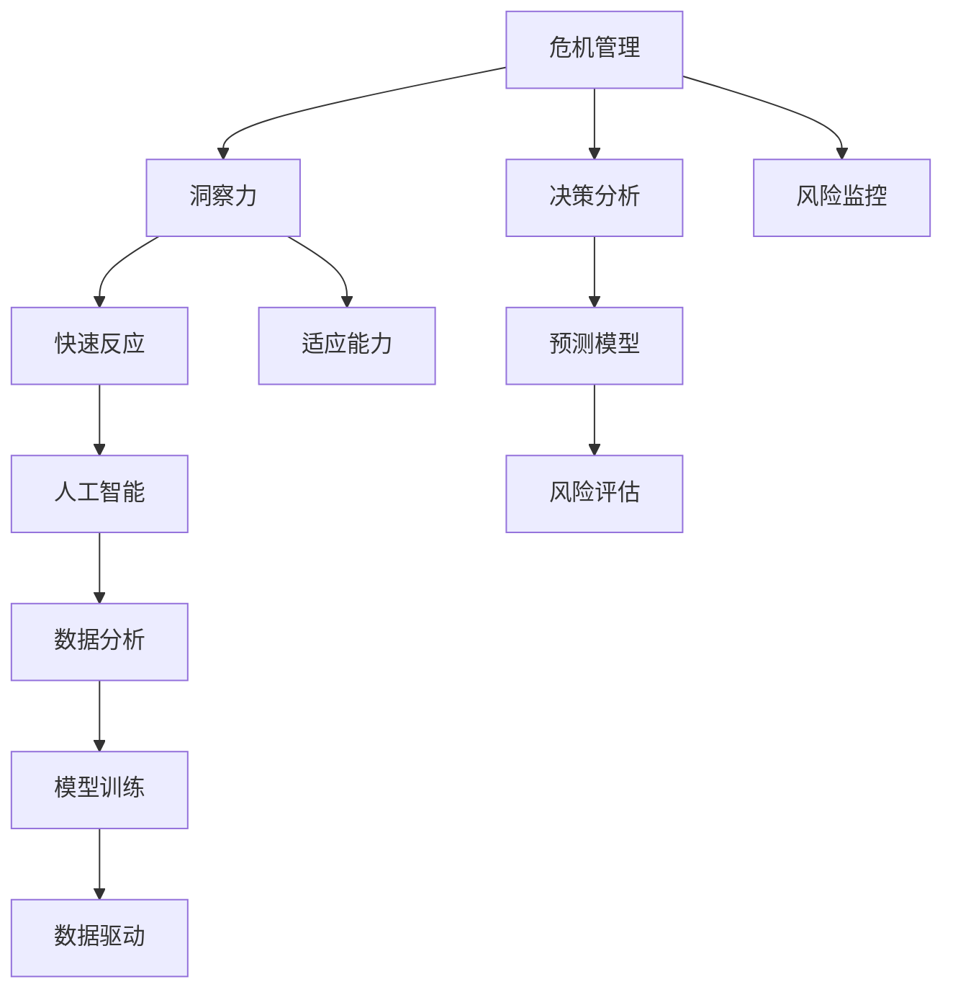

                 

# 洞察力与危机管理：快速反应与适应的能力

> 关键词：危机管理, 洞察力, 快速反应, 适应能力, 人工智能, 决策分析, 自动化, 数据驱动, 预测模型, 风险评估

## 1. 背景介绍

### 1.1 问题由来
在当今瞬息万变的世界中，企业面临着前所未有的挑战和机遇。随着技术的发展，如何利用洞察力进行危机管理，快速响应并适应变化，成为企业生存和发展的关键。人工智能和大数据分析技术的成熟，为企业提供了强大的工具，使管理者能够洞察市场动态，预测潜在的危机，并采取行动。

### 1.2 问题核心关键点
洞察力与危机管理的核心在于：
- 通过数据分析和机器学习模型，识别潜在的危机因素。
- 利用人工智能快速响应，评估和缓解危机。
- 持续监控和适应，确保企业的长期稳定发展。

## 2. 核心概念与联系

### 2.1 核心概念概述

为更好地理解洞察力与危机管理，本节将介绍几个密切相关的核心概念：

- 危机管理(Crisis Management)：指企业在面对突发事件时，快速识别、评估、处理和恢复的过程。有效的危机管理可以显著降低损失，保障企业运营的连续性和稳定性。

- 洞察力(Insight)：指通过数据分析、模型训练等方式，从数据中提取有用的信息，辅助决策。洞察力是危机管理中识别和应对危机的关键。

- 快速反应(Fast Response)：指在危机发生后，快速识别并采取行动的能力。人工智能技术可以显著提高快速反应的效率和准确性。

- 适应能力(Adaptability)：指在危机和市场变化中，企业能够及时调整策略，适应新环境的能力。

- 人工智能(Artificial Intelligence, AI)：通过模拟人类智能行为，执行各种任务的技术。在危机管理中，AI可以提供预测、决策支持等功能。

- 数据分析(Analytics)：通过收集、清洗、分析和解释数据，从中发现规律和洞见，支持决策和运营。

- 模型训练(Model Training)：利用历史数据训练模型，预测未来事件，为决策提供依据。

- 数据驱动(Data-Driven)：通过数据来驱动决策，减少主观判断，提高决策的科学性和准确性。

这些核心概念之间通过以下Mermaid流程图来展示：



这个流程图展示了危机管理中各个关键步骤的联系：

1. 危机管理过程的起点是洞察力，通过数据分析和模型训练获得洞察。
2. 快速反应和适应能力在危机发生后，通过人工智能技术实现。
3. 人工智能、数据分析和模型训练都依赖于数据驱动的决策分析。
4. 最终通过预测模型和风险评估，实现对危机的全面监控和预测。

## 3. 核心算法原理 & 具体操作步骤

### 3.1 算法原理概述

危机管理中的洞察力与快速反应，通常依赖于数据分析和机器学习模型。其核心思想是：
1. 利用历史数据训练模型，预测未来事件。
2. 根据模型输出，快速响应危机，并调整策略。
3. 持续监控和适应，确保长期稳定发展。

具体来说，危机管理过程分为以下几个关键步骤：

1. 数据收集：从多个渠道收集数据，涵盖财务、市场、运营、客户等多个方面。
2. 数据清洗：对数据进行清洗，去除噪声和异常值，保证数据质量。
3. 数据分析：利用统计分析和机器学习算法，提取有用信息，识别潜在的危机因素。
4. 模型训练：使用历史数据训练预测模型，预测未来事件的概率和影响。
5. 快速反应：根据模型输出，快速识别并采取行动，减少损失。
6. 适应能力：持续监控数据变化，及时调整策略，保持适应性。

### 3.2 算法步骤详解

以下我们详细讲解危机管理中关键算法的实现步骤：

**Step 1: 数据收集与清洗**

1. 从不同渠道收集数据，如客户反馈、市场调研、财务报表等。
2. 对数据进行清洗，去除噪声和异常值，确保数据质量。

**Step 2: 数据分析**

1. 使用统计分析方法，如均值、方差、回归分析等，提取基本洞见。
2. 应用机器学习算法，如决策树、随机森林、神经网络等，进行更深入的洞见挖掘。

**Step 3: 模型训练**

1. 选择合适的预测模型，如时间序列模型、异常检测模型、分类模型等。
2. 利用历史数据进行模型训练，优化模型参数。
3. 验证模型性能，确保其预测准确性。

**Step 4: 快速反应**

1. 根据模型输出，快速识别潜在的危机事件。
2. 定义危机触发条件，如阈值或概率。
3. 根据触发条件，自动执行预先设定的响应策略。

**Step 5: 适应能力**

1. 持续监控数据变化，实时更新模型参数。
2. 定期评估模型性能，优化模型。
3. 根据新情况，及时调整策略，确保长期适应性。

### 3.3 算法优缺点

基于数据分析和机器学习的危机管理方法，具有以下优点：
1. 快速响应：通过自动化处理，显著提高响应速度和效率。
2. 数据驱动：减少主观判断，提高决策的科学性和准确性。
3. 持续适应：实时监控数据变化，及时调整策略，保持适应性。
4. 预测能力：通过预测模型，提前识别潜在危机，减少损失。

同时，该方法也存在一定的局限性：
1. 数据依赖：对数据质量和完整性要求高，数据缺失或噪声可能影响分析结果。
2. 模型复杂性：模型训练和优化复杂，需要专业知识和技能。
3. 上下文理解：机器模型难以理解上下文和语境，可能导致误判。
4. 模型偏见：模型训练样本可能带有偏见，影响预测结果。
5. 技术门槛：需要较强的技术背景，非专业人员难以应用。

尽管存在这些局限性，但就目前而言，基于数据分析和机器学习的危机管理方法仍是最主流的范式。未来相关研究的重点在于如何进一步降低数据依赖，提高模型的上下文理解和鲁棒性，同时兼顾可解释性和技术普及性等因素。

### 3.4 算法应用领域

基于数据分析和机器学习的危机管理方法，在多个领域得到了广泛应用，例如：

- 金融风险管理：利用数据分析和模型训练，识别市场波动和风险因素，提前采取措施。
- 供应链管理：通过数据分析和模型训练，优化供应链流程，提高抗风险能力。
- 客户关系管理：利用数据分析和机器学习，识别客户行为变化，及时调整策略。
- 网络安全防护：通过数据分析和异常检测模型，识别和应对潜在的网络威胁。
- 产品生命周期管理：利用数据分析和预测模型，优化产品开发和迭代，提高市场竞争力。

除了上述这些经典应用外，基于数据分析和机器学习的危机管理方法还在更多场景中得到创新性应用，如舆情监控、环境监测、公共安全等，为行业带来了新的解决方案。

## 4. 数学模型和公式 & 详细讲解 & 举例说明

### 4.1 数学模型构建

危机管理中的数据分析和模型训练，通常基于以下数学模型：

- **时间序列模型**：用于预测未来事件的连续值，如ARIMA、LSTM等。
- **异常检测模型**：用于识别异常数据点，如Isolation Forest、One-Class SVM等。
- **分类模型**：用于分类预测，如SVM、Random Forest等。
- **回归模型**：用于预测连续数值，如Linear Regression、Ridge等。

### 4.2 公式推导过程

以下我们以时间序列预测模型为例，推导其预测公式及其参数估计方法。

假设时间序列数据为 $y_t = (y_1, y_2, \ldots, y_n)$，其中 $t$ 表示时间。时间序列模型通常使用ARIMA模型进行建模，其形式为：

$$
y_t = \sum_{i=1}^p \phi_i y_{t-i} + \sum_{j=1}^d \theta_j \Delta^j y_t + \epsilon_t
$$

其中，$p$ 为自回归项数，$d$ 为差分阶数，$\phi_i$ 和 $\theta_j$ 为模型参数，$\Delta$ 为差分算子。$\epsilon_t$ 为随机误差项。

对于参数估计，通常使用最大似然估计法。假设数据服从高斯分布，则似然函数为：

$$
L(\theta) = \prod_{t=1}^n \frac{1}{\sqrt{2\pi}\sigma} \exp\left(-\frac{(y_t - \hat{y}_t)^2}{2\sigma^2}\right)
$$

其中，$\sigma$ 为标准差。通过最大化似然函数，可以得到参数估计公式：

$$
\hat{\theta} = \arg\min_{\theta} \sum_{t=1}^n (y_t - \hat{y}_t)^2
$$

通过求解上述最优化问题，可以得到模型参数 $\hat{\theta}$，进而进行未来时间点的预测。

### 4.3 案例分析与讲解

假设某金融机构收集了过去一年的交易数据，并希望使用ARIMA模型进行日交易量的预测。首先将数据进行差分，得到平稳时间序列，然后使用AIC/BIC准则确定模型的阶数，最后利用训练集数据求解模型参数。得到的模型可以用于日交易量的预测，并根据预测结果采取相应的风险控制措施。

## 5. 项目实践：代码实例和详细解释说明

### 5.1 开发环境搭建

在进行数据分析和机器学习实践前，我们需要准备好开发环境。以下是使用Python进行PyTorch和TensorFlow开发的环境配置流程：

1. 安装Anaconda：从官网下载并安装Anaconda，用于创建独立的Python环境。

2. 创建并激活虚拟环境：
```bash
conda create -n pytorch-env python=3.8 
conda activate pytorch-env
```

3. 安装PyTorch和TensorFlow：根据CUDA版本，从官网获取对应的安装命令。例如：
```bash
conda install pytorch torchvision torchaudio cudatoolkit=11.1 -c pytorch -c conda-forge
pip install tensorflow
```

4. 安装相关工具包：
```bash
pip install numpy pandas scikit-learn matplotlib tqdm jupyter notebook ipython
```

完成上述步骤后，即可在`pytorch-env`环境中开始项目实践。

### 5.2 源代码详细实现

下面我们以金融风险管理为例，给出使用PyTorch进行时间序列预测的代码实现。

首先，定义时间序列数据：

```python
import pandas as pd
import numpy as np
import matplotlib.pyplot as plt
import torch
import torch.nn as nn
import torch.optim as optim
from sklearn.preprocessing import MinMaxScaler
from sklearn.metrics import mean_squared_error

# 加载数据
data = pd.read_csv('financial_data.csv', index_col='Date', parse_dates=True)
data = data.resample('D').mean()

# 数据归一化
scaler = MinMaxScaler(feature_range=(0, 1))
data_scaled = scaler.fit_transform(data)

# 划分训练集和测试集
train_size = int(len(data_scaled) * 0.7)
train_data, test_data = data_scaled[0:train_size], data_scaled[train_size:]

# 构造LSTM模型
class LSTM(nn.Module):
    def __init__(self, input_size, hidden_size, output_size):
        super(LSTM, self).__init__()
        self.hidden_size = hidden_size
        self.lstm = nn.LSTM(input_size, hidden_size)
        self.fc = nn.Linear(hidden_size, output_size)

    def forward(self, x, hidden):
        out, hidden = self.lstm(x, hidden)
        out = self.fc(out.view(-1, self.hidden_size))
        return out, hidden

# 定义超参数
input_size = 1
hidden_size = 64
output_size = 1
learning_rate = 0.01
num_epochs = 50

# 定义模型和优化器
model = LSTM(input_size, hidden_size, output_size)
optimizer = optim.Adam(model.parameters(), lr=learning_rate)

# 训练模型
def train_model(model, data, optimizer, num_epochs):
    for epoch in range(num_epochs):
        hidden = (torch.zeros(1, 1, hidden_size), torch.zeros(1, 1, hidden_size))
        loss = 0
        for i in range(len(data) - 50):
            inputs = torch.tensor(data[i:i+50]).float().view(1, 50, 1)
            targets = torch.tensor(data[i+1]).float().view(1, 1)
            optimizer.zero_grad()
            outputs, hidden = model(inputs, hidden)
            loss = nn.MSELoss()(outputs, targets)
            loss.backward()
            optimizer.step()
            loss += loss.item()
        if (epoch+1) % 5 == 0:
            print('Epoch [{}/{}], Loss: {:.4f}'.format(epoch+1, num_epochs, loss/50))
    return model

# 训练LSTM模型
model = train_model(model, train_data, optimizer, num_epochs)

# 评估模型
def evaluate_model(model, data, num_steps=30):
    loss = 0
    for i in range(len(data) - num_steps):
        inputs = torch.tensor(data[i:i+num_steps]).float().view(1, num_steps, 1)
        targets = torch.tensor(data[i+1:i+num_steps+1]).float().view(1, num_steps, 1)
        outputs, hidden = model(inputs, hidden)
        loss += nn.MSELoss()(outputs, targets).item()
    loss /= num_steps
    print('Test MSE: {:.4f}'.format(loss))
```

在代码中，我们使用了LSTM模型对时间序列数据进行预测，具体步骤如下：

1. 加载和归一化数据。
2. 将数据划分为训练集和测试集。
3. 定义LSTM模型，并设置超参数。
4. 使用Adam优化器进行模型训练。
5. 在测试集上评估模型性能，输出均方误差。

### 5.3 代码解读与分析

让我们再详细解读一下关键代码的实现细节：

**时间序列数据加载与归一化**

- `pd.read_csv()`：从CSV文件中加载时间序列数据。
- `resample()`：将数据进行日均值处理。
- `MinMaxScaler()`：对数据进行归一化，将其映射到[0,1]范围内。

**LSTM模型定义**

- `nn.LSTM()`：定义LSTM层。
- `nn.Linear()`：定义全连接层。
- `forward()`：前向传播，通过LSTM和全连接层得到输出。

**模型训练**

- `optimizer.zero_grad()`：清空优化器梯度。
- `nn.MSELoss()`：计算均方误差。
- `optimizer.step()`：更新模型参数。

**模型评估**

- `nn.MSELoss()`：计算均方误差。
- `float()`：将数据转化为浮点型。
- `view()`：调整数据维度。

## 6. 实际应用场景

### 6.1 智能客服系统

基于数据分析和机器学习的智能客服系统，可以实时监控客户咨询数据，识别潜在的客户不满和问题，及时采取措施。例如，通过分析客户的提问频率、情感倾向等指标，可以提前识别可能的投诉点，并针对性地进行回复和处理，提升客户满意度。

### 6.2 金融风险管理

金融机构可以利用数据分析和模型训练，实时监控市场波动和风险因素，提前采取风险控制措施。例如，通过分析股票价格、市场情绪等数据，可以预测市场趋势，提前调整投资组合，避免潜在的损失。

### 6.3 供应链管理

供应链企业可以利用数据分析和模型训练，优化库存管理，预测需求波动，提高供应链效率。例如，通过分析销售数据、订单历史等，可以预测未来的需求变化，优化库存水平，减少库存成本。

### 6.4 客户关系管理

企业可以利用数据分析和模型训练，优化客户行为预测，制定个性化营销策略。例如，通过分析客户购买记录、行为数据等，可以预测客户的购买意愿，制定针对性的促销活动，提高客户留存率。

### 6.5 网络安全防护

网络安全专家可以利用数据分析和异常检测模型，实时监控网络流量，识别潜在的安全威胁。例如，通过分析网络流量数据，可以识别异常行为，及时采取防御措施，保障网络安全。

## 7. 工具和资源推荐

### 7.1 学习资源推荐

为了帮助开发者系统掌握数据分析和机器学习在危机管理中的应用，这里推荐一些优质的学习资源：

1. 《Python数据分析与可视化》系列书籍：详细介绍了数据分析和可视化的基础概念和实践技巧，适合初学者入门。

2. 《深度学习》课程：斯坦福大学开设的深度学习课程，涵盖了神经网络、深度学习框架等前沿内容，适合深入学习。

3. 《机器学习实战》书籍：介绍机器学习算法和实践案例，帮助开发者理解算法原理和应用场景。

4. Kaggle平台：提供了大量的数据分析和机器学习竞赛，适合实践和锻炼技能。

5. GitHub上的开源项目：学习其他开发者的代码实现，了解最新的应用技术和实践经验。

通过对这些资源的学习实践，相信你一定能够快速掌握数据分析和机器学习在危机管理中的应用技巧，并用于解决实际问题。

### 7.2 开发工具推荐

高效的开发离不开优秀的工具支持。以下是几款用于数据分析和机器学习开发的常用工具：

1. Python：Python语言的简洁性和丰富的库支持，使得数据分析和机器学习开发变得高效便捷。

2. R语言：R语言的统计分析能力强，适合进行复杂的统计分析和数据建模。

3. TensorFlow和PyTorch：深度学习框架，支持各种神经网络模型的实现和训练。

4. Jupyter Notebook：交互式开发环境，方便进行代码调试和结果展示。

5. Tableau和Power BI：数据可视化工具，方便进行数据的探索和展示。

6. Apache Spark：大数据处理框架，支持大规模数据的处理和分析。

合理利用这些工具，可以显著提升数据分析和机器学习项目的开发效率，加快创新迭代的步伐。

### 7.3 相关论文推荐

数据分析和机器学习在危机管理中的应用，源于学界的持续研究。以下是几篇奠基性的相关论文，推荐阅读：

1. Time Series Analysis and Its Applications（《时间序列分析与建模》）：时间序列分析的经典教材，详细介绍了时间序列的基本概念和建模方法。

2. The Elements of Statistical Learning（《统计学习方法》）：机器学习领域的重要教材，介绍了多种统计学习算法和实际应用案例。

3. Deep Learning for NLP（《深度学习与自然语言处理》）：深度学习在NLP领域的经典书籍，介绍了深度学习在NLP任务中的广泛应用。

4. Predictive Analytics（《预测分析》）：介绍预测分析的基本概念和方法，适合理解数据分析在决策中的应用。

5. Risk Management with Time Series Analysis（《时间序列分析在风险管理中的应用》）：介绍了时间序列分析在金融风险管理中的应用，适合具体应用场景的学习。

这些论文代表了大数据分析和机器学习在危机管理中的应用脉络。通过学习这些前沿成果，可以帮助研究者把握学科前进方向，激发更多的创新灵感。

## 8. 总结：未来发展趋势与挑战

### 8.1 研究成果总结

本文对数据分析和机器学习在危机管理中的应用进行了全面系统的介绍。首先阐述了危机管理中洞察力和快速反应的重要性，明确了其在企业生存和发展中的关键作用。其次，从原理到实践，详细讲解了数据分析和机器学习模型的构建和训练方法，给出了具体代码实现。同时，本文还广泛探讨了数据分析和机器学习在智能客服、金融风险管理、供应链管理等多个行业领域的应用前景，展示了其在危机管理中的广泛潜力。

通过本文的系统梳理，可以看到，数据分析和机器学习在危机管理中的应用正在成为企业决策的重要工具，极大地提升了企业的洞察力和快速反应能力。未来，伴随数据分析和机器学习技术的不断演进，将会有更多创新的应用场景被发掘，为企业带来更智能、更高效、更安全的决策支持。

### 8.2 未来发展趋势

展望未来，数据分析和机器学习在危机管理中的应用将呈现以下几个发展趋势：

1. 模型自动化：随着自动化技术的发展，数据分析和机器学习模型的构建和训练将更加自动化，降低技术门槛。
2. 模型可解释性：模型可解释性将成为重要的研究课题，使管理者能够理解模型的决策过程，增强决策的透明度和可信度。
3. 多模态融合：将数据来源从单一的数值数据拓展到文本、图像、视频等多模态数据，增强模型的全面性和鲁棒性。
4. 实时处理：大数据和云技术的发展，将使得实时数据处理和分析成为可能，提高危机反应的及时性。
5. 跨领域应用：数据分析和机器学习将在更多领域得到应用，为不同行业带来变革性影响。

以上趋势凸显了数据分析和机器学习在危机管理中的广阔前景。这些方向的探索发展，必将进一步提升危机管理的效率和效果，为企业的稳定发展提供坚实保障。

### 8.3 面临的挑战

尽管数据分析和机器学习在危机管理中的应用已经取得了显著进展，但在迈向更加智能化、普适化应用的过程中，仍面临诸多挑战：

1. 数据质量问题：数据缺失、噪声、异常值等现象普遍存在，影响分析结果的准确性。如何提高数据质量，保证数据的完整性和一致性，是一个长期任务。
2. 模型复杂性：复杂模型的高计算需求和训练成本，限制了其在中小企业的应用。如何简化模型结构，降低计算资源消耗，是亟待解决的问题。
3. 上下文理解：机器模型难以理解上下文和语境，可能导致误判。如何提高模型的上下文理解能力，增强其应用泛化性，是一个重要研究方向。
4. 模型偏见：模型训练样本可能带有偏见，影响预测结果。如何消除模型偏见，提高模型的公平性和鲁棒性，是一个关键问题。
5. 技术普及性：数据分析和机器学习技术在中小企业中的应用普及度低，技术和人才资源缺乏。如何降低技术门槛，增强技术的普及性和易用性，是普及的关键。

### 8.4 研究展望

面对数据分析和机器学习在危机管理中面临的诸多挑战，未来的研究需要在以下几个方面寻求新的突破：

1. 提高数据质量：引入更先进的数据清洗和处理技术，如深度学习、迁移学习等，提高数据质量。
2. 简化模型结构：开发更加轻量级的模型结构，如Attention机制、Transformer等，降低计算资源消耗。
3. 增强上下文理解：引入更多上下文信息，如知识图谱、文本语义分析等，提高模型的语境理解能力。
4. 消除模型偏见：引入更多多样化的数据和公平性约束，消除模型偏见，提高模型公平性。
5. 增强技术普及性：开发易于使用的工具和平台，降低技术门槛，增强技术的普及性和易用性。

这些研究方向的探索，必将引领数据分析和机器学习在危机管理中的应用进入新的高度，为构建智能、高效、安全的决策支持系统铺平道路。面向未来，数据分析和机器学习技术将与更多的领域进行深度融合，共同推动企业决策智能化和自动化，为构建安全、可靠、可解释、可控的智能系统提供坚实保障。

