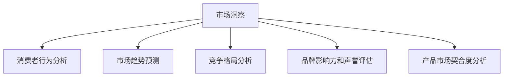

                 

# 洞察力与品牌战略：市场洞察的艺术

> 关键词：市场洞察,品牌战略,数据驱动,消费者行为,数字化转型

## 1. 背景介绍

### 1.1 问题由来
在信息爆炸的时代，企业需要更加精准地了解市场趋势、消费者需求和竞争动态。传统的市场调查和市场调研方法由于成本高、周期长、反馈慢，无法及时响应市场变化。数字化的浪潮推动了企业从传统的市场调查向数据驱动的市场洞察转变。

市场洞察的本质在于通过数据挖掘和分析，发现隐藏在数据背后的真实市场动向、消费者行为和竞争态势。这不仅能帮助企业发现新的市场机会，还能指导品牌战略的制定，实现更精准的市场定位和品牌营销。

### 1.2 问题核心关键点
市场洞察的实现主要依赖于数据分析、机器学习等技术手段，结合企业内部和外部的数据资源，通过多维度、多层次的数据分析和建模，生成具有商业价值的洞察结果。常见的市场洞察方法包括：

- 消费者行为分析
- 市场趋势预测
- 竞争格局分析
- 品牌影响力和声誉评估
- 产品市场契合度分析

### 1.3 问题研究意义
市场洞察的精确度和及时性直接影响企业的战略决策和营销策略。通过数据驱动的市场洞察，企业能够更好地理解市场环境和消费者需求，提升品牌竞争力，实现差异化竞争和精准营销。此外，洞察的可视化、动态化，能够辅助企业快速调整策略，及时捕捉市场机遇，保持行业领先地位。

## 2. 核心概念与联系

### 2.1 核心概念概述

为更好地理解市场洞察的方法和流程，本节将介绍几个密切相关的核心概念：

- **市场洞察(Market Insights)**：通过数据分析、机器学习等技术手段，挖掘和分析市场数据，生成有商业价值的洞察结果。
- **消费者行为分析(Consumer Behavior Analysis)**：分析消费者在购买决策、使用行为、评价反馈等方面的行为模式，帮助企业优化产品设计和市场营销策略。
- **市场趋势预测(Market Trend Forecasting)**：基于历史数据和趋势分析，预测未来的市场变化和需求趋势，帮助企业把握市场先机。
- **竞争格局分析(Competitive Landscape Analysis)**：分析同行业企业的市场表现、竞争策略、优劣势等，评估企业的竞争态势和市场机会。
- **品牌影响力和声誉评估(Brand Impact and Reputation Assessment)**：评估品牌在市场中的影响力、知名度、美誉度等指标，指导品牌的提升和优化。
- **产品市场契合度分析(Product-Market Fit Analysis)**：评估产品功能和市场需求之间的匹配程度，帮助企业优化产品设计和市场推广策略。

这些核心概念之间的逻辑关系可以通过以下Mermaid流程图来展示：



这个流程图展示了好市场洞察的核心概念及其之间的关系：

1. 市场洞察涵盖了消费者行为、市场趋势、竞争格局、品牌影响力和产品市场契合度等多个维度的分析，形成一个全面的市场视图。
2. 消费者行为分析、市场趋势预测、竞争格局分析、品牌影响力和声誉评估、产品市场契合度分析等都是市场洞察的重要组成部分，共同构成市场洞察的核心内容。
3. 市场洞察的目的是通过多维度的数据分析和建模，生成具有商业价值的洞察结果，帮助企业制定更加科学和精准的品牌战略和市场策略。

## 3. 核心算法原理 & 具体操作步骤
### 3.1 算法原理概述

市场洞察的实现过程中，涉及多个数据源和多个分析环节，通常需要采用多种算法和技术手段。核心算法包括但不限于：

- **数据清洗与预处理**：通过数据清洗、缺失值填补、异常值检测等手段，提高数据质量和分析精度。
- **特征工程**：对原始数据进行特征提取和特征构建，生成可用于建模的特征向量。
- **聚类分析**：通过无监督学习算法，如K-means、层次聚类等，将数据分为若干类，发现数据之间的内在结构。
- **回归分析**：通过回归模型，如线性回归、逻辑回归等，预测未来趋势和结果。
- **分类分析**：通过分类模型，如决策树、随机森林、支持向量机等，识别数据中的分类结构，进行分类预测。
- **关联分析**：通过关联规则挖掘，发现数据中的隐含关联关系，生成业务规则和决策支持。

### 3.2 算法步骤详解

市场洞察的实现步骤一般包括以下几个关键步骤：

**Step 1: 数据收集与预处理**
- 收集企业内部和外部的数据，包括客户行为数据、销售数据、市场调研数据、社交媒体数据等。
- 对数据进行清洗、去重、缺失值填补、异常值检测等预处理操作，确保数据质量和一致性。

**Step 2: 特征工程**
- 根据业务需求和分析目标，提取和构建特征向量，生成可用于建模的数据集。
- 对特征进行归一化、标准化、降维等处理，提高模型泛化能力和分析效率。

**Step 3: 数据分析与建模**
- 选择适合的算法和模型，对数据进行分析和建模，生成预测结果和洞察报告。
- 对于不同的分析目标，选择不同的算法，如回归分析、分类分析、聚类分析、关联分析等。

**Step 4: 结果验证与解释**
- 对分析结果进行验证和验证，确保结果的准确性和可靠性。
- 将分析结果通过图表、报告等形式呈现，供决策者参考和应用。

**Step 5: 动态更新与迭代**
- 定期更新数据和模型，确保市场洞察结果的时效性和准确性。
- 根据市场变化和反馈，对模型和分析方法进行迭代优化，提升洞察能力。

### 3.3 算法优缺点

市场洞察的实现方法具有以下优点：
1. **数据驱动**：通过数据分析和建模，生成具有商业价值的洞察结果，提升决策的科学性和准确性。
2. **实时响应**：借助大数据和云计算技术，实现对市场变化的实时响应，快速捕捉机会和风险。
3. **全面覆盖**：涵盖消费者行为、市场趋势、竞争格局、品牌影响力和产品市场契合度等多个维度的分析，提供全面的市场视图。
4. **高效分析**：通过自动化和模型优化，提高数据分析和建模的效率和精度。

同时，这些方法也存在一定的局限性：
1. **数据质量依赖**：分析结果的准确性高度依赖于数据质量和完整性，数据偏差可能影响分析结果。
2. **算法复杂性**：数据量大、维度高时，算法复杂性增加，分析成本和难度也随之上升。
3. **解释性不足**：部分算法和模型难以解释其决策过程，缺乏透明度和可解释性。
4. **动态性不足**：分析结果通常需要定期更新，难以实现动态化的市场洞察。

尽管存在这些局限性，但就目前而言，基于数据驱动的市场洞察方法仍是市场分析的重要手段。未来相关研究的重点在于如何进一步提高数据质量和数据处理的自动化程度，提高分析结果的实时性和可解释性。

### 3.4 算法应用领域

市场洞察的方法已经广泛应用于各行各业，具体包括：

- **零售业**：通过消费者行为分析和市场趋势预测，优化商品组合和营销策略，提升销售业绩。
- **金融业**：通过市场趋势分析和竞争格局分析，评估投资风险和市场机会，优化投资组合。
- **制造业**：通过产品市场契合度分析，优化产品设计和生产流程，提升产品质量和市场竞争力。
- **医疗健康**：通过消费者行为分析和品牌影响力评估，指导医疗健康产品的研发和推广策略。
- **旅游业**：通过市场趋势分析和消费者行为分析，优化旅游产品设计和市场推广策略，提升客户满意度和市场占有率。

除了上述这些经典应用外，市场洞察还被创新性地应用于更多场景中，如智慧城市管理、环保政策制定、公共安全监测等，为各行各业带来全新的市场洞察和决策支持。

## 4. 数学模型和公式 & 详细讲解  
### 4.1 数学模型构建

市场洞察的实现过程可以通过多个数学模型进行描述，这里我们将介绍几种典型的市场洞察数学模型：

- **回归模型**：用于预测未来的市场趋势和结果，数学表达式为 $y=\beta_0 + \beta_1 x_1 + \beta_2 x_2 + \cdots + \beta_n x_n + \epsilon$，其中 $y$ 为预测值，$x_i$ 为自变量，$\beta_i$ 为回归系数，$\epsilon$ 为误差项。
- **分类模型**：用于识别数据中的分类结构，进行分类预测，数学表达式为 $P(y|x)=\frac{e^{\alpha_0 + \alpha_1 x_1 + \cdots + \alpha_n x_n}}{1+e^{\alpha_0 + \alpha_1 x_1 + \cdots + \alpha_n x_n}}$，其中 $P(y|x)$ 为预测概率，$\alpha_i$ 为分类系数。
- **聚类模型**：用于发现数据之间的内在结构，数学表达式为 $K$-means聚类算法，通过对数据点进行迭代聚类，生成聚类中心和簇内距离。
- **关联分析**：用于发现数据中的隐含关联关系，生成业务规则和决策支持，数学表达式为 $f(x,y)=\frac{(x,y)}{\sqrt{(x,\{x})(x,y\})}$，其中 $f(x,y)$ 为支持度，$(x,y)$ 为频繁度。

### 4.2 公式推导过程

以下我们以回归模型为例，推导其数学公式及其推导过程。

假设市场趋势 $y$ 与自变量 $x$ 之间存在线性关系，回归模型为：

$$
y=\beta_0 + \beta_1 x_1 + \cdots + \beta_n x_n + \epsilon
$$

其中 $y$ 为预测值，$x_i$ 为自变量，$\beta_i$ 为回归系数，$\epsilon$ 为误差项。通过对样本数据进行最小二乘法求解，得到回归系数的估计值：

$$
\hat{\beta}=(X^TX)^{-1}X^Ty
$$

其中 $X$ 为自变量矩阵，$Y$ 为预测值向量，$\hat{\beta}$ 为回归系数估计值。

在得到回归系数后，将样本数据带入模型，可以得到预测值 $\hat{y}$：

$$
\hat{y}=\hat{\beta}_0 + \hat{\beta}_1 x_1 + \cdots + \hat{\beta}_n x_n
$$

这样，我们就通过回归模型完成了市场趋势的预测。

### 4.3 案例分析与讲解

以下我们以零售业的销售趋势预测为例，展示市场洞察的实际应用。

假设零售企业想要预测未来一年内销售额的变化趋势，可以通过回归模型来实现：

**Step 1: 数据收集与预处理**
- 收集过去一年的销售数据、促销活动数据、节假日数据等。
- 对数据进行清洗、去重、缺失值填补、异常值检测等预处理操作。

**Step 2: 特征工程**
- 提取和构建特征向量，包括销售数据、促销活动数据、节假日数据等。
- 对特征进行归一化、标准化、降维等处理，提高模型泛化能力和分析效率。

**Step 3: 数据分析与建模**
- 选择回归模型，使用历史数据进行拟合，得到回归系数估计值。
- 将预测变量和促销活动数据输入模型，计算预测的销售额。

**Step 4: 结果验证与解释**
- 对预测结果进行验证和验证，确保预测的准确性和可靠性。
- 将预测结果通过图表、报告等形式呈现，供决策者参考和应用。

**Step 5: 动态更新与迭代**
- 定期更新数据和模型，确保预测结果的时效性和准确性。
- 根据市场变化和反馈，对模型和分析方法进行迭代优化，提升预测能力。

通过上述步骤，零售企业可以基于市场洞察生成销售趋势预测，指导企业制定更加科学和精准的市场策略，优化产品组合和营销策略，提升销售业绩。

## 5. 项目实践：代码实例和详细解释说明
### 5.1 开发环境搭建

在进行市场洞察的实践前，我们需要准备好开发环境。以下是使用Python进行数据科学开发的环境配置流程：

1. 安装Anaconda：从官网下载并安装Anaconda，用于创建独立的Python环境。

2. 创建并激活虚拟环境：
```bash
conda create -n data-env python=3.8 
conda activate data-env
```

3. 安装必要的Python库：
```bash
pip install pandas numpy scikit-learn matplotlib seaborn plotly
```

4. 安装数据可视化工具：
```bash
pip install jupyter notebook ipywidgets
```

完成上述步骤后，即可在`data-env`环境中开始市场洞察的实践。

### 5.2 源代码详细实现

这里我们以销售趋势预测为例，展示使用Python进行市场洞察的代码实现。

首先，定义回归模型并进行训练：

```python
from sklearn.linear_model import LinearRegression
import pandas as pd

# 读取数据
data = pd.read_csv('sales_data.csv')

# 特征工程
X = data[['promotion', 'holiday', 'day_of_week']]
y = data['sales']

# 训练模型
model = LinearRegression()
model.fit(X, y)

# 预测未来销售额
future_sales = model.predict([[0, 1, 1]])
print(f'预测销售额为: {future_sales[0]}')
```

然后，绘制销售趋势图：

```python
import matplotlib.pyplot as plt

# 绘制销售趋势图
plt.plot(data['date'], data['sales'], label='实际销售')
plt.plot(data['date'], model.predict(X), label='预测销售')
plt.legend()
plt.show()
```

通过上述代码，我们完成了市场趋势预测的实践。可以看到，使用Python和Scikit-Learn库，可以很方便地实现回归模型的训练和预测，生成具有商业价值的洞察结果。

### 5.3 代码解读与分析

让我们再详细解读一下关键代码的实现细节：

**数据读取和预处理**
- `data = pd.read_csv('sales_data.csv')`：使用Pandas库读取销售数据，生成DataFrame对象。
- `X = data[['promotion', 'holiday', 'day_of_week']]`：提取促销活动、节假日、星期几等特征。
- `y = data['sales']`：提取销售额作为目标变量。
- `model.fit(X, y)`：使用线性回归模型进行拟合。

**模型训练与预测**
- `model = LinearRegression()`：创建线性回归模型对象。
- `model.fit(X, y)`：使用历史数据进行训练。
- `future_sales = model.predict([[0, 1, 1]])`：使用模型进行预测。

**数据可视化**
- `plt.plot(data['date'], data['sales'], label='实际销售')`：绘制实际销售趋势图。
- `plt.plot(data['date'], model.predict(X), label='预测销售')`：绘制预测销售趋势图。
- `plt.legend()`：添加图例。
- `plt.show()`：显示图表。

可以看到，Python的数据科学库为市场洞察的实践提供了强大的支持，使得数据分析、模型训练和结果呈现变得更加高效和便捷。

## 6. 实际应用场景
### 6.1 智能客服系统

基于市场洞察的智能客服系统，可以通过分析消费者行为和市场趋势，实现智能化的客户服务。通过实时监测消费者的行为数据和反馈，智能客服系统可以识别客户需求、偏好和投诉，提供个性化推荐和即时响应，提升客户满意度和忠诚度。

具体实现时，可以收集消费者的浏览、点击、反馈等行为数据，通过市场洞察生成消费者行为分析报告，指导智能客服系统的策略调整。例如，根据消费者的购物习惯和偏好，智能客服系统可以推荐相关产品，提供定制化服务，提升客户体验。

### 6.2 智慧医疗健康

智慧医疗健康领域，市场洞察可以帮助医疗机构了解患者需求、评估诊疗效果、优化医疗服务。通过分析患者的病历数据、治疗效果、药品使用情况等，生成全面的医疗健康洞察报告，指导医疗机构的决策和改进。

具体实现时，可以收集患者的病历数据、治疗效果、药品使用情况等，通过市场洞察生成医疗健康洞察报告，指导医疗机构的决策和改进。例如，根据患者的治疗效果和药品使用情况，医疗机构可以优化诊疗方案，提升治疗效果，减少药物副作用，提高患者满意度。

### 6.3 智能推荐系统

智能推荐系统可以通过市场洞察了解用户需求和行为，生成个性化的推荐结果，提升用户体验和转化率。通过分析用户的历史浏览、点击、购买等行为数据，生成用户行为分析报告，指导智能推荐系统的策略调整。

具体实现时，可以收集用户的历史浏览、点击、购买等行为数据，通过市场洞察生成用户行为分析报告，指导智能推荐系统的策略调整。例如，根据用户的历史行为数据，智能推荐系统可以推荐相关商品或服务，提供个性化推荐，提升用户满意度和转化率。

### 6.4 未来应用展望

随着市场洞察技术的不断发展，基于数据驱动的市场洞察方法将广泛应用于更多行业，为各行各业带来更加精准和全面的市场分析和决策支持。未来市场洞察技术将在以下几个方面取得突破：

1. **数据质量提升**：通过先进的数据清洗和预处理技术，提高数据质量和完整性，提升分析结果的准确性。
2. **实时响应增强**：借助大数据和云计算技术，实现对市场变化的实时响应，快速捕捉机会和风险。
3. **可解释性增强**：开发更具有可解释性的模型和算法，提高分析结果的透明度和可解释性。
4. **动态性提升**：实现动态化的市场洞察，实时更新分析结果，保持市场洞察的时效性和准确性。
5. **跨领域融合**：将市场洞察与其他技术手段进行融合，如自然语言处理、计算机视觉等，拓展市场洞察的应用场景。

总之，市场洞察技术的发展前景广阔，未来将广泛应用于各行各业，为企业的市场分析和决策提供强有力的支持。

## 7. 工具和资源推荐
### 7.1 学习资源推荐

为了帮助开发者系统掌握市场洞察的理论基础和实践技巧，这里推荐一些优质的学习资源：

1. **《数据科学导论》**：由著名数据科学家撰写，系统介绍了数据科学的基本概念、数据处理、模型训练等知识点，适合入门学习。
2. **《Python数据分析实战》**：基于Python的实战项目，详细介绍了数据清洗、数据可视化、模型训练等实战技巧，适合进阶学习。
3. **Kaggle竞赛平台**：提供丰富的市场洞察竞赛项目，涵盖消费者行为分析、市场趋势预测等多个方向，适合实践和实战。
4. **DataCamp在线课程**：提供丰富的市场洞察课程，涵盖回归分析、分类分析、聚类分析等多个方向，适合系统学习。

通过对这些资源的学习实践，相信你一定能够快速掌握市场洞察的精髓，并用于解决实际的业务问题。

### 7.2 开发工具推荐

高效的开发离不开优秀的工具支持。以下是几款用于市场洞察开发的常用工具：

1. **Jupyter Notebook**：基于Web的交互式开发环境，支持Python、R等多种语言，适合数据科学项目开发。
2. **Pandas**：数据处理和分析库，支持数据的清洗、预处理、建模等操作，适合数据分析和机器学习项目开发。
3. **Scikit-Learn**：机器学习库，支持多种模型和算法，适合机器学习和数据科学项目开发。
4. **Matplotlib**：数据可视化库，支持绘制各种图表，适合数据可视化项目开发。
5. **Seaborn**：基于Matplotlib的数据可视化库，支持更高级的数据可视化操作，适合数据分析和机器学习项目开发。

合理利用这些工具，可以显著提升市场洞察的开发效率，加快创新迭代的步伐。

### 7.3 相关论文推荐

市场洞察的发展源于学界的持续研究。以下是几篇奠基性的相关论文，推荐阅读：

1. **《消费者行为分析与预测》**：探讨了消费者行为分析的基本方法和应用场景，介绍了消费者行为模型和数据分析技术。
2. **《市场趋势预测方法综述》**：综述了市场趋势预测的多种方法，包括回归模型、时间序列分析等，并介绍了实际应用中的具体案例。
3. **《品牌影响力和声誉评估》**：介绍了品牌影响力和声誉评估的方法和指标，提供了品牌管理和市场策略的建议。
4. **《产品市场契合度评估》**：探讨了产品市场契合度的评估方法和应用场景，提供了产品设计和市场推广的建议。

这些论文代表了大市场洞察技术的发展脉络。通过学习这些前沿成果，可以帮助研究者把握学科前进方向，激发更多的创新灵感。

## 8. 总结：未来发展趋势与挑战
### 8.1 总结

本文对基于数据驱动的市场洞察方法进行了全面系统的介绍。首先阐述了市场洞察的本质和实现方法，明确了市场洞察在市场分析和品牌战略制定中的重要价值。其次，从原理到实践，详细讲解了市场洞察的数学模型和关键步骤，给出了市场洞察任务开发的完整代码实例。同时，本文还广泛探讨了市场洞察在智能客服、智慧医疗健康、智能推荐等多个行业领域的应用前景，展示了市场洞察的巨大潜力。此外，本文精选了市场洞察技术的各类学习资源，力求为读者提供全方位的技术指引。

通过本文的系统梳理，可以看到，基于数据驱动的市场洞察方法正在成为市场分析的重要手段，极大地提升企业的决策科学性和精准性。未来，伴随大数据和云计算技术的不断发展，市场洞察技术必将进一步提升市场分析的准确性和时效性，为各行各业带来更加全面和精细的市场分析和决策支持。

### 8.2 未来发展趋势

展望未来，市场洞察技术将呈现以下几个发展趋势：

1. **数据驱动**：数据驱动的市场洞察将更加普及和深入，企业将更多依赖数据来指导市场分析和品牌战略制定。
2. **实时响应**：借助大数据和云计算技术，市场洞察将实现对市场变化的实时响应，快速捕捉机会和风险。
3. **可解释性增强**：市场洞察的模型和算法将更具可解释性，提高分析结果的透明度和可信度。
4. **动态性提升**：实现动态化的市场洞察，实时更新分析结果，保持市场洞察的时效性和准确性。
5. **跨领域融合**：将市场洞察与其他技术手段进行融合，如自然语言处理、计算机视觉等，拓展市场洞察的应用场景。

以上趋势凸显了市场洞察技术的广阔前景。这些方向的探索发展，必将进一步提升市场洞察的精度和时效性，为企业的市场分析和决策提供强有力的支持。

### 8.3 面临的挑战

尽管市场洞察技术已经取得了瞩目成就，但在迈向更加智能化、普适化应用的过程中，它仍面临诸多挑战：

1. **数据质量瓶颈**：市场洞察高度依赖数据质量，数据偏差可能影响分析结果。如何进一步提高数据质量和数据处理的自动化程度，是亟待解决的问题。
2. **模型复杂性**：数据量大、维度高时，模型复杂性增加，分析成本和难度也随之上升。如何开发更高效、更简洁的市场洞察模型，是当前研究的重要方向。
3. **解释性不足**：部分算法和模型难以解释其决策过程，缺乏透明度和可解释性。如何开发更具有可解释性的模型和算法，是未来研究的重要课题。
4. **动态性不足**：分析结果通常需要定期更新，难以实现动态化的市场洞察。如何实现动态化的市场洞察，是未来研究的重要方向。

尽管存在这些挑战，但市场洞察技术的发展前景广阔，未来仍需多方面努力，以克服技术上的难题，实现市场洞察的普适化和智能化。

### 8.4 研究展望

面向未来，市场洞察技术需要在以下几个方面寻求新的突破：

1. **数据质量提升**：通过先进的数据清洗和预处理技术，提高数据质量和完整性，提升分析结果的准确性。
2. **实时响应增强**：借助大数据和云计算技术，实现对市场变化的实时响应，快速捕捉机会和风险。
3. **可解释性增强**：开发更具有可解释性的模型和算法，提高分析结果的透明度和可解释性。
4. **动态性提升**：实现动态化的市场洞察，实时更新分析结果，保持市场洞察的时效性和准确性。
5. **跨领域融合**：将市场洞察与其他技术手段进行融合，如自然语言处理、计算机视觉等，拓展市场洞察的应用场景。

总之，市场洞察技术的发展前景广阔，未来将广泛应用于各行各业，为企业的市场分析和决策提供强有力的支持。通过不断探索和创新，市场洞察技术必将在构建人机协同的智能时代中扮演越来越重要的角色。

## 9. 附录：常见问题与解答
**Q1：如何选择合适的市场洞察工具？**

A: 选择合适的市场洞察工具需要考虑以下几个方面：

1. **数据处理能力**：选择支持大规模数据处理的工具，如Pandas、Dask等。
2. **模型训练能力**：选择支持多种模型训练的工具，如Scikit-Learn、XGBoost等。
3. **可视化能力**：选择支持数据可视化的工具，如Matplotlib、Seaborn等。
4. **社区支持**：选择有活跃社区支持的工具，方便获取帮助和资源。
5. **成本考虑**：选择性价比高的工具，如开源工具通常免费使用，但可能需要一定的技术支持。

根据具体需求和资源条件，选择合适的市场洞察工具，能够提升分析效率和结果准确性。

**Q2：市场洞察如何与企业业务相结合？**

A: 市场洞察与企业业务相结合，需要以下几个步骤：

1. **数据收集**：收集企业内部的业务数据，如销售数据、客户行为数据、市场调研数据等。
2. **数据清洗和预处理**：对数据进行清洗、去重、缺失值填补、异常值检测等预处理操作，确保数据质量和一致性。
3. **特征工程**：根据业务需求和分析目标，提取和构建特征向量，生成可用于建模的数据集。
4. **数据分析与建模**：选择适合的算法和模型，对数据进行分析和建模，生成预测结果和洞察报告。
5. **结果验证与解释**：对分析结果进行验证和验证，确保结果的准确性和可靠性。将分析结果通过图表、报告等形式呈现，供决策者参考和应用。
6. **动态更新与迭代**：定期更新数据和模型，确保市场洞察结果的时效性和准确性。根据市场变化和反馈，对模型和分析方法进行迭代优化，提升洞察能力。

通过以上步骤，市场洞察能够更好地服务于企业业务，帮助企业制定更加科学和精准的市场策略，优化产品设计和营销策略，提升客户满意度和市场竞争力。

**Q3：市场洞察的局限性有哪些？**

A: 市场洞察的局限性主要体现在以下几个方面：

1. **数据质量依赖**：分析结果的准确性高度依赖于数据质量和完整性，数据偏差可能影响分析结果。
2. **模型复杂性**：数据量大、维度高时，模型复杂性增加，分析成本和难度也随之上升。
3. **解释性不足**：部分算法和模型难以解释其决策过程，缺乏透明度和可解释性。
4. **动态性不足**：分析结果通常需要定期更新，难以实现动态化的市场洞察。
5. **领域局限**：市场洞察主要适用于与企业业务相关的市场分析和消费者行为研究，对其他领域可能存在局限性。

尽管存在这些局限性，但市场洞察技术的发展前景广阔，未来仍需多方面努力，以克服技术上的难题，实现市场洞察的普适化和智能化。

---

作者：禅与计算机程序设计艺术 / Zen and the Art of Computer Programming

