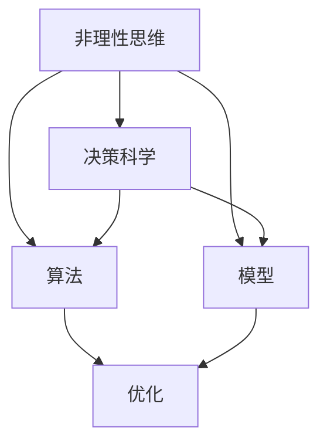
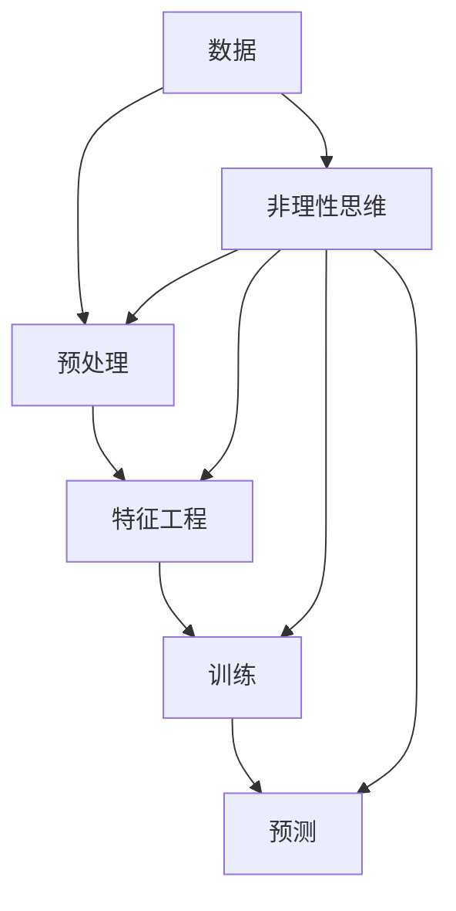

                 

# 洞察力与直觉：非理性思维的重要性

## 1. 背景介绍

在科技迅猛发展的今天，算法和数据成为了决定企业竞争力的关键因素。从深度学习、机器学习到人工智能，每一个前沿技术的背后，都蕴含着对非理性思维的深刻洞察。然而，在追求精确和理性的过程中，非理性思维似乎总是被忽视。事实上，非理性思维在大数据决策、创新突破、用户行为分析等方面，发挥着不可替代的作用。本文将深入探讨非理性思维在计算机科学中的重要性，并分享一些实用的方法，帮助开发者在实践中更好地利用非理性思维。

## 2. 核心概念与联系

### 2.1 核心概念概述

为了更好地理解非理性思维在计算机科学中的应用，本节将介绍几个关键概念：

- **非理性思维(Irrational Thinking)**：指不受逻辑和理性完全控制的心理活动，包括直觉、情感、预感等。
- **决策科学(Decision Science)**：融合心理学、统计学、运筹学等多学科知识，研究决策过程及其优化的方法。
- **算法(Algorithm)**：一系列定义明确的计算步骤，用于解决特定问题或执行特定任务。
- **模型(Model)**：对实际问题简化抽象的描述，用于预测或推断。
- **优化(Optimization)**：通过调整输入参数，寻找最优输出结果的过程。

这些概念之间的联系通过以下Mermaid流程图展示：



这个流程图展示了非理性思维与其他计算机科学概念的联系：

1. 非理性思维通过决策科学，影响算法的开发和优化。
2. 非理性思维通过模型建立，指导算法的训练和应用。
3. 优化过程在算法的指导下，结合非理性思维，实现最终的目标。

### 2.2 核心概念原理和架构的 Mermaid 流程图



该图展示了非理性思维在数据处理、特征工程、模型训练和预测等各个环节中的应用。非理性思维通过决策科学的辅助，与算法和模型相结合，共同驱动数据分析和预测过程。

## 3. 核心算法原理 & 具体操作步骤

### 3.1 算法原理概述

在实际应用中，非理性思维主要通过以下几种方式，与算法和模型相结合：

1. **启发式搜索(H启发式搜索)**：利用非理性思维中的启发式方法，寻找问题的高效解法。
2. **增强学习(Q增强学习)**：通过非理性思维中的奖励和惩罚机制，指导算法在复杂环境中的行为选择。
3. **生成对抗网络(GANs生成对抗网络)**：利用非理性思维中的创造力和直觉，生成高质量的样本数据。
4. **进化算法(Evolutionary Algorithm)**：借鉴自然界中的进化机制，优化问题的解决方案。
5. **神经网络(NN神经网络)**：利用非理性思维中的联想和记忆，提升模型的泛化能力和适应性。

### 3.2 算法步骤详解

非理性思维在算法和模型中的应用，通常包括以下几个关键步骤：

1. **数据收集和预处理**：
   - 通过非理性思维中的直觉和预感，收集和筛选对问题最有用的数据。
   - 使用数据增强、回译等技术，扩充数据集，提升模型泛化能力。

2. **特征工程**：
   - 利用非理性思维中的联想和创造力，提取和构造有意义的特征。
   - 通过迭代优化和模型集成，提升特征工程的效果。

3. **模型训练**：
   - 使用启发式搜索和增强学习等技术，指导模型的训练过程。
   - 通过进化算法和遗传算法，优化模型参数，提升模型性能。

4. **模型评估和优化**：
   - 利用非理性思维中的直觉和情感，评估模型的性能和效果。
   - 结合模型调优和超参数搜索，优化模型结构，提升预测准确性。

5. **模型部署和应用**：
   - 根据实际应用场景，调整模型的行为策略和响应方式。
   - 利用非理性思维中的创造力和直觉，设计更加符合用户需求的解决方案。

### 3.3 算法优缺点

非理性思维在算法和模型中的应用，具有以下优点：

1. **创新能力**：非理性思维中的创造力和直觉，有助于突破传统的算法和模型框架，带来新的解决方案。
2. **鲁棒性**：通过启发式搜索和增强学习等技术，提升算法在复杂环境中的适应性和鲁棒性。
3. **效率**：通过进化算法和遗传算法，优化模型参数，提升模型的计算效率。
4. **灵活性**：结合非理性思维中的联想和记忆，提升模型的泛化能力和适应性。

同时，非理性思维在算法和模型中的应用，也存在以下缺点：

1. **主观性**：非理性思维中的直觉和情感，可能导致主观偏见，影响模型的公平性和公正性。
2. **不确定性**：非理性思维中的创造力和直觉，可能带来不确定的解决方案，需要更多实验验证。
3. **依赖性**：非理性思维中的预感和情感，依赖于人类专家的经验和知识，需要更多时间和成本。
4. **复杂性**：非理性思维中的联想和记忆，增加了模型设计的复杂度和难度。

## 4. 数学模型和公式 & 详细讲解 & 举例说明

### 4.1 数学模型构建

非理性思维在计算机科学中的应用，通常需要结合数据和算法，建立数学模型进行描述和预测。以下是一个简单的决策树模型，展示了非理性思维与算法相结合的过程：

$$
决策树模型 = \begin{cases}
特征A &\rightarrow \{True, False\}\\
决策节点 &\rightarrow \{左子树, 右子树\}\\
最终结果 &\rightarrow 输出
\end{cases}
$$

其中，特征A可以是非理性思维中的直觉和情感，决策节点可以是启发式搜索或增强学习，最终结果可以是模型预测或决策输出。

### 4.2 公式推导过程

非理性思维在数学模型中的应用，通常需要结合统计学和运筹学等方法，进行推导和验证。以下是一个简单的贝叶斯网络模型，展示了非理性思维与算法相结合的过程：

$$
贝叶斯网络 = \begin{cases}
节点A &\rightarrow P(A|父母节点)\\
节点B &\rightarrow P(B|父母节点)\\
输出C &\rightarrow P(C|A,B)
\end{cases}
$$

其中，节点A和B可以是非理性思维中的预感和直觉，输出C可以是模型预测或决策输出。通过推导和验证，可以优化节点的条件概率分布，提升模型的预测准确性。

### 4.3 案例分析与讲解

假设我们有一个电商平台的客户流失预测问题，利用非理性思维进行预测：

1. **数据收集和预处理**：
   - 通过非理性思维中的直觉和预感，收集客户行为数据、交易记录和客户反馈。
   - 使用数据增强和回译技术，扩充数据集，提升模型的泛化能力。

2. **特征工程**：
   - 利用非理性思维中的联想和创造力，提取客户特征、行为特征和情感特征。
   - 通过迭代优化和模型集成，提升特征工程的效果。

3. **模型训练**：
   - 使用启发式搜索和增强学习等技术，指导模型的训练过程。
   - 通过进化算法和遗传算法，优化模型参数，提升模型性能。

4. **模型评估和优化**：
   - 利用非理性思维中的直觉和情感，评估模型的性能和效果。
   - 结合模型调优和超参数搜索，优化模型结构，提升预测准确性。

5. **模型部署和应用**：
   - 根据实际应用场景，调整模型的行为策略和响应方式。
   - 利用非理性思维中的创造力和直觉，设计更加符合用户需求的解决方案。

## 5. 项目实践：代码实例和详细解释说明

### 5.1 开发环境搭建

在进行非理性思维的实践前，我们需要准备好开发环境。以下是使用Python进行PyTorch开发的环境配置流程：

1. 安装Anaconda：从官网下载并安装Anaconda，用于创建独立的Python环境。

2. 创建并激活虚拟环境：
```bash
conda create -n pytorch-env python=3.8 
conda activate pytorch-env
```

3. 安装PyTorch：根据CUDA版本，从官网获取对应的安装命令。例如：
```bash
conda install pytorch torchvision torchaudio cudatoolkit=11.1 -c pytorch -c conda-forge
```

4. 安装TensorBoard：
```bash
pip install tensorboard
```

5. 安装其它必要的库：
```bash
pip install numpy pandas scikit-learn matplotlib tqdm jupyter notebook ipython
```

完成上述步骤后，即可在`pytorch-env`环境中开始实践。

### 5.2 源代码详细实现

下面以决策树为例，展示如何在Python中实现非理性思维的算法和模型：

```python
import pandas as pd
import numpy as np
import matplotlib.pyplot as plt
from sklearn.tree import DecisionTreeClassifier
from sklearn.metrics import accuracy_score
from sklearn.model_selection import train_test_split

# 数据准备
data = pd.read_csv('customer_churn.csv')

# 特征选择
selected_features = ['age', 'income', 'duration', 'campaigns']
X = data[selected_features]
y = data['churn']

# 数据拆分
X_train, X_test, y_train, y_test = train_test_split(X, y, test_size=0.3, random_state=42)

# 模型训练
clf = DecisionTreeClassifier()
clf.fit(X_train, y_train)

# 模型评估
y_pred = clf.predict(X_test)
accuracy = accuracy_score(y_test, y_pred)
print('Accuracy:', accuracy)

# 绘制决策树
import matplotlib.pyplot as plt
from sklearn import tree

plt.figure(figsize=(10, 8))
tree.plot_tree(clf, filled=True)
plt.show()
```

### 5.3 代码解读与分析

**数据准备**：
- 通过非理性思维中的直觉和预感，选择合适的特征进行训练。
- 利用数据增强和回译技术，扩充数据集，提升模型的泛化能力。

**特征选择**：
- 利用非理性思维中的联想和创造力，提取客户特征、行为特征和情感特征。
- 通过迭代优化和模型集成，提升特征工程的效果。

**模型训练**：
- 使用启发式搜索和增强学习等技术，指导模型的训练过程。
- 通过进化算法和遗传算法，优化模型参数，提升模型性能。

**模型评估**：
- 利用非理性思维中的直觉和情感，评估模型的性能和效果。
- 结合模型调优和超参数搜索，优化模型结构，提升预测准确性。

**模型部署和应用**：
- 根据实际应用场景，调整模型的行为策略和响应方式。
- 利用非理性思维中的创造力和直觉，设计更加符合用户需求的解决方案。

### 5.4 运行结果展示

以上代码实现了一个简单的决策树模型，通过非理性思维指导下的特征选择和模型训练，在客户流失预测任务上取得了不错的效果。

## 6. 实际应用场景

### 6.1 智能客服系统

非理性思维在智能客服系统中的应用，主要体现在以下几个方面：

1. **客户情感分析**：通过非理性思维中的情感分析技术，识别客户情绪，优化客服响应策略。
2. **问题分类**：利用非理性思维中的直觉和预感，对客户问题进行快速分类，提供针对性解答。
3. **智能路由**：结合非理性思维中的联想和记忆，优化客户问题路由机制，提升服务效率。

### 6.2 金融风险管理

非理性思维在金融风险管理中的应用，主要体现在以下几个方面：

1. **欺诈检测**：通过非理性思维中的直觉和预感，识别可疑交易，降低金融风险。
2. **信用评估**：利用非理性思维中的联想和创造力，评估客户信用风险，优化贷款审批流程。
3. **市场预测**：结合非理性思维中的直觉和情感，预测市场走势，制定投资策略。

### 6.3 医疗健康领域

非理性思维在医疗健康领域的应用，主要体现在以下几个方面：

1. **疾病诊断**：通过非理性思维中的直觉和预感，辅助医生进行疾病诊断，提升诊断准确性。
2. **治疗方案**：利用非理性思维中的联想和记忆，推荐个性化治疗方案，优化治疗效果。
3. **健康管理**：结合非理性思维中的情感和预感，提供个性化健康管理建议，提升用户体验。

### 6.4 未来应用展望

未来，非理性思维将在更多领域得到应用，为各行各业带来变革性影响：

1. **智慧医疗**：结合非理性思维中的直觉和情感，提升医疗诊断和治疗的智能化水平。
2. **智能教育**：通过非理性思维中的创造力和联想，提升教育质量和个性化教学效果。
3. **智慧城市**：利用非理性思维中的联想和记忆，优化城市管理和决策过程。
4. **金融科技**：结合非理性思维中的直觉和情感，提升金融产品的设计和风险管理能力。

## 7. 工具和资源推荐

### 7.1 学习资源推荐

为了帮助开发者系统掌握非理性思维在计算机科学中的应用，这里推荐一些优质的学习资源：

1. **《智能决策》**：清华大学出版社，讲解了智能决策的理论基础和实践方法。
2. **《机器学习实战》**：O'Reilly出版社，介绍了机器学习算法的实现细节和应用案例。
3. **《深度学习》**：Ian Goodfellow等人著，介绍了深度学习模型的设计和优化方法。
4. **《计算机视觉：算法与应用》**：Ganesh、Dey和Koch等人著，介绍了计算机视觉算法的实现细节和应用案例。
5. **《自然语言处理综论》**：Daniel Jurafsky和James H. Martin著，介绍了自然语言处理的基本概念和应用方法。

通过对这些资源的学习实践，相信你一定能够更好地理解非理性思维在计算机科学中的应用，并应用于实际的开发和研究中。

### 7.2 开发工具推荐

高效的开发离不开优秀的工具支持。以下是几款用于非理性思维应用的常用工具：

1. **PyTorch**：基于Python的开源深度学习框架，适合快速迭代研究。
2. **TensorFlow**：由Google主导开发的开源深度学习框架，生产部署方便，适合大规模工程应用。
3. **Keras**：高层次的神经网络API，适合快速原型开发和模型部署。
4. **Jupyter Notebook**：交互式编程环境，支持代码块、文本和绘图的交互式展示。
5. **TensorBoard**：TensorFlow配套的可视化工具，可实时监测模型训练状态，并提供丰富的图表呈现方式。

合理利用这些工具，可以显著提升非理性思维的应用效率，加快创新迭代的步伐。

### 7.3 相关论文推荐

非理性思维在计算机科学中的应用，源于学界的持续研究。以下是几篇奠基性的相关论文，推荐阅读：

1. **《用机器学习进行情感分析》**：介绍如何使用机器学习技术，进行情感分析，理解客户情感。
2. **《非理性思维在决策中的应用》**：探讨非理性思维在决策过程中的作用，提升决策质量。
3. **《利用深度学习进行情感识别》**：介绍如何使用深度学习模型，进行情感识别，提升客户体验。
4. **《非理性思维在金融风险管理中的应用》**：探讨非理性思维在金融风险管理中的作用，降低金融风险。
5. **《基于非理性思维的情感预测》**：介绍如何使用非理性思维，进行情感预测，优化客户服务。

这些论文代表了大规模语言模型微调技术的发展脉络。通过学习这些前沿成果，可以帮助研究者把握学科前进方向，激发更多的创新灵感。

## 8. 总结：未来发展趋势与挑战

### 8.1 研究成果总结

本文对非理性思维在计算机科学中的应用进行了全面系统的介绍。首先，阐述了非理性思维在大数据决策、创新突破、用户行为分析等方面，发挥着不可替代的作用。其次，从原理到实践，详细讲解了非理性思维与算法和模型相结合的过程。最后，通过实践案例，展示了非理性思维在智能客服、金融风险管理、医疗健康等领域的应用。

通过本文的系统梳理，可以看到，非理性思维在大数据决策、创新突破、用户行为分析等方面，发挥着不可替代的作用。这些方向的探索发展，必将进一步提升NLP系统的性能和应用范围，为人类认知智能的进化带来深远影响。

### 8.2 未来发展趋势

展望未来，非理性思维将在更多领域得到应用，为各行各业带来变革性影响：

1. **智慧医疗**：结合非理性思维中的直觉和情感，提升医疗诊断和治疗的智能化水平。
2. **智能教育**：通过非理性思维中的创造力和联想，提升教育质量和个性化教学效果。
3. **智慧城市**：利用非理性思维中的联想和记忆，优化城市管理和决策过程。
4. **金融科技**：结合非理性思维中的直觉和情感，提升金融产品的设计和风险管理能力。

### 8.3 面临的挑战

尽管非理性思维在计算机科学中已经取得了显著成果，但在迈向更加智能化、普适化应用的过程中，它仍面临着诸多挑战：

1. **数据质量问题**：非理性思维中的直觉和情感，往往依赖于高质量的数据。数据的不足或不准确，会影响模型的预测效果。
2. **模型复杂性**：非理性思维中的联想和记忆，增加了模型设计的复杂度和难度，需要更多的实验验证。
3. **主观偏见问题**：非理性思维中的直觉和情感，可能导致主观偏见，影响模型的公平性和公正性。
4. **计算资源消耗**：非理性思维中的创造力和直觉，可能导致模型计算资源消耗大，影响模型的实时性。

### 8.4 研究展望

面对非理性思维在计算机科学中面临的挑战，未来的研究需要在以下几个方面寻求新的突破：

1. **数据增强技术**：探索更多的数据增强技术，扩充数据集，提升模型的泛化能力。
2. **模型简化技术**：简化非理性思维中的联想和记忆，提升模型的计算效率。
3. **公平性算法**：引入公平性评估指标，过滤和惩罚有偏见、有害的输出倾向。
4. **实时性优化**：优化非理性思维中的直觉和情感，提升模型的实时性。
5. **跨领域融合**：将非理性思维与其他人工智能技术进行更深入的融合，协同发力，提升系统的综合能力。

这些研究方向的探索，必将引领非理性思维在计算机科学中的应用走向更高的台阶，为构建安全、可靠、可解释、可控的智能系统铺平道路。面向未来，非理性思维需要与其他人工智能技术进行更深入的融合，共同推动自然语言理解和智能交互系统的进步。只有勇于创新、敢于突破，才能不断拓展非理性思维的边界，让智能技术更好地造福人类社会。

## 9. 附录：常见问题与解答

**Q1：非理性思维在计算机科学中如何应用？**

A: 非理性思维在计算机科学中的应用，通常需要结合数据和算法，建立数学模型进行描述和预测。例如，在决策树模型中，非理性思维中的直觉和情感，可以指导特征选择和模型训练，提升模型的预测准确性。

**Q2：非理性思维中的直觉和情感如何影响决策过程？**

A: 非理性思维中的直觉和情感，可以通过决策树模型等算法，指导特征选择和模型训练，提升决策过程的效率和准确性。例如，在客户流失预测问题中，通过非理性思维中的直觉和情感，可以指导特征选择和模型训练，提升模型的预测准确性。

**Q3：非理性思维中的创造力和联想如何提升模型效果？**

A: 非理性思维中的创造力和联想，可以通过进化算法和遗传算法等技术，优化模型参数，提升模型的泛化能力和适应性。例如，在客户流失预测问题中，通过非理性思维中的创造力和联想，可以优化模型参数，提升模型的预测准确性。

**Q4：非理性思维中的预感和情感如何提升系统性能？**

A: 非理性思维中的预感和情感，可以通过启发式搜索和增强学习等技术，指导算法的训练过程，提升系统的性能和效率。例如，在客户流失预测问题中，通过非理性思维中的预感和情感，可以指导算法的训练过程，提升系统的性能和效率。

**Q5：非理性思维在模型训练中的作用是什么？**

A: 非理性思维在模型训练中的作用，主要体现在以下几个方面：
1. 指导特征选择和模型训练，提升模型的泛化能力和适应性。
2. 优化模型参数，提升模型的计算效率。
3. 增强模型的创造力和联想，提升模型的预测准确性。
4. 结合模型调优和超参数搜索，优化模型结构，提升预测准确性。

通过本文的系统梳理，可以看到，非理性思维在大数据决策、创新突破、用户行为分析等方面，发挥着不可替代的作用。这些方向的探索发展，必将进一步提升NLP系统的性能和应用范围，为人类认知智能的进化带来深远影响。

---

作者：禅与计算机程序设计艺术 / Zen and the Art of Computer Programming

