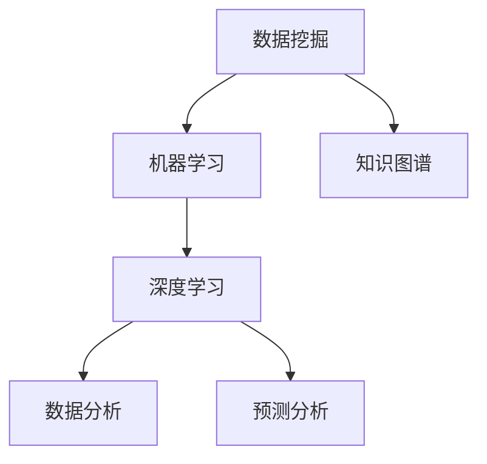

                 

# 洞察力：知识创新的灵魂

> 关键词：洞察力, 知识创新, 数据挖掘, 人工智能, 机器学习, 数据分析, 深度学习, 知识图谱

## 1. 背景介绍

### 1.1 问题由来
在当今信息化时代，数据已经成为最宝贵的资源之一。然而，单纯的数据存储和处理已经难以满足实际应用的需求，我们更需要从中挖掘出有价值的信息，提升决策质量，推动业务创新。而洞察力（Insight）就是指通过数据分析、挖掘和理解，发现数据背后的规律、趋势和关联，从而指导决策和行动的能力。

随着大数据、云计算和人工智能技术的飞速发展，洞察力在各行各业中的应用日益广泛。无论是零售、金融、医疗，还是电商、教育、政府，洞察力都成为提升竞争力和创新能力的重要工具。然而，传统的数据分析和统计方法已经难以应对海量、复杂的数据挑战，新兴的数据挖掘、机器学习和人工智能技术成为洞察力实现的关键手段。

### 1.2 问题核心关键点
洞察力的实现过程，本质上是将数据转化为知识，从而指导行动的过程。这一过程涉及以下几个核心关键点：
- 数据的收集与处理：获取高质量、结构化、易于分析的数据，是洞察力实现的前提。
- 模型的建立与优化：通过选择合适的算法和模型，从数据中提取有用信息。
- 结果的解释与验证：将分析结果转化为易于理解的形式，并通过实际应用验证其有效性。

## 2. 核心概念与联系

### 2.1 核心概念概述

为更好地理解洞察力的实现过程，本节将介绍几个密切相关的核心概念：

- 数据挖掘(Data Mining)：从大量数据中提取有用信息的过程，常用于商业智能(BI)、市场分析等场景。
- 知识图谱(Knowledge Graph)：一种以图形结构表示知识的概念模型，用于表示实体和实体间的关系。
- 机器学习(Machine Learning)：通过数据训练模型，使模型具备预测和分类等能力。
- 深度学习(Deep Learning)：一种基于多层神经网络的机器学习方法，用于解决复杂的非线性问题。
- 数据分析(Analytic)：对数据进行统计、挖掘和理解，以发现数据中的规律和趋势。
- 预测分析(Predictive Analytics)：使用历史数据预测未来趋势，用于风险评估、客户行为预测等。

这些核心概念之间的逻辑关系可以通过以下Mermaid流程图来展示：



这个流程图展示了几类关键技术之间的联系：

1. 数据挖掘用于获取和处理数据，为后续的机器学习和深度学习提供基础。
2. 机器学习和深度学习通过对数据进行建模，从数据中提取有用的知识和规律。
3. 数据分析用于对结果进行验证和解释，确保其合理性和有效性。
4. 预测分析通过历史数据预测未来，为实际应用提供指导。
5. 知识图谱用于将实体和关系结构化，便于推理和理解。

这些核心概念共同构成了洞察力实现的技术框架，使我们能够从海量数据中提取有价值的信息，指导实际决策和行动。

## 3. 核心算法原理 & 具体操作步骤
### 3.1 算法原理概述

洞察力的实现过程中，涉及多种算法和技术，包括但不限于：

- 分类算法：如决策树、随机森林、支持向量机等，用于将数据分为不同类别。
- 聚类算法：如K-means、层次聚类等，用于将数据分为不同的群组。
- 回归算法：如线性回归、逻辑回归等，用于预测数值型数据。
- 关联规则算法：如Apriori算法，用于发现数据项之间的关联。
- 深度学习算法：如卷积神经网络(CNN)、循环神经网络(RNN)、生成对抗网络(GAN)等，用于解决复杂的非线性问题。
- 预测分析算法：如时间序列分析、异常检测等，用于预测未来趋势和识别异常值。

这些算法和技术共同作用，从不同角度和方法对数据进行处理和分析，从而发现数据中的有用信息。

### 3.2 算法步骤详解

基于洞察力的实现，一般包括以下几个关键步骤：

**Step 1: 数据准备**
- 收集和清洗数据，去除噪声和错误数据，确保数据质量和完整性。
- 将数据分为训练集、验证集和测试集，供后续模型训练和验证使用。

**Step 2: 特征工程**
- 对原始数据进行特征提取和转换，将非结构化数据转化为易于分析的结构化数据。
- 根据任务特点选择合适的特征和特征工程方法，如特征选择、降维、编码等。

**Step 3: 模型选择与训练**
- 根据任务类型选择合适的算法和模型。
- 使用训练集数据对模型进行训练，调整超参数，优化模型性能。

**Step 4: 结果验证与评估**
- 在验证集上对模型进行验证，评估模型性能和泛化能力。
- 根据评估结果调整模型参数和特征，进一步优化模型。

**Step 5: 应用部署**
- 将优化后的模型应用于实际场景，进行预测和分类等操作。
- 通过可视化工具和仪表盘展示分析结果，辅助决策和行动。

以上是洞察力实现的一般流程。在实际应用中，还需要针对具体任务的特点，对模型选择、特征工程、参数调优等环节进行优化设计，以进一步提升分析效果。

### 3.3 算法优缺点

基于洞察力的实现过程中，涉及的算法和技术各有优缺点：

- **优点**：
  - 能够从海量数据中提取有用的信息，辅助决策和行动。
  - 多种算法和技术灵活组合，适用于不同类型的分析任务。
  - 能够识别数据中的复杂模式和关联，提升决策的准确性和效率。

- **缺点**：
  - 算法和模型选择需要根据具体任务进行匹配，较为复杂。
  - 数据质量和特征工程对结果影响较大，需要较高的专业知识和技能。
  - 模型复杂度高，对计算资源和存储空间有较高要求。
  - 结果的解释性和可理解性可能不足，需要较强的专业背景。

尽管存在这些局限性，但基于数据挖掘、机器学习和深度学习等技术的洞察力实现方法，仍在大数据时代扮演着重要角色。未来相关研究的重点在于如何进一步降低算法的复杂度，提高算法的可解释性和可操作性，同时兼顾数据的多样性和高质量要求。

### 3.4 算法应用领域

基于洞察力的实现方法，已经在诸多领域得到了广泛应用，包括但不限于：

- 零售业：通过客户行为分析，优化库存管理，提升销售转化率。
- 金融业：通过信用评分和风险评估，识别潜在风险，优化资产配置。
- 医疗业：通过病历分析，预测疾病发展趋势，辅助诊断和治疗。
- 制造业：通过设备故障预测，优化维护计划，减少停机时间。
- 电商行业：通过用户行为分析，提升个性化推荐，增加用户粘性。
- 政府部门：通过社会事件监测，预测社会趋势，辅助政策制定。

这些领域的应用展示了洞察力在实际决策中的巨大价值，证明了基于数据挖掘、机器学习和深度学习等技术的方法的有效性。随着这些技术的发展，相信洞察力将在更多领域得到应用，为决策提供更坚实的依据。

## 4. 数学模型和公式 & 详细讲解  
### 4.1 数学模型构建

为了更好地理解基于数据挖掘、机器学习和深度学习的洞察力实现方法，本节将介绍几个常见的数学模型。

假设我们有一组样本数据 $\{x_i,y_i\}_{i=1}^N$，其中 $x_i \in \mathbb{R}^d$ 为特征向量，$y_i \in \{0,1\}$ 为标签。我们的目标是找到一个函数 $f(x)$，使得 $f(x_i)$ 能够尽可能接近 $y_i$。

常用的数学模型包括线性回归模型、逻辑回归模型、决策树模型等。这里以线性回归模型为例，其数学公式如下：

$$
f(x) = \theta^T x + b
$$

其中 $\theta \in \mathbb{R}^d$ 为模型参数，$b \in \mathbb{R}$ 为偏置项。目标是最小化均方误差：

$$
\min_{\theta,b} \sum_{i=1}^N (y_i - f(x_i))^2
$$

通过求解上述最小化问题，可以得到最优的模型参数 $\hat{\theta}$。

### 4.2 公式推导过程

线性回归模型的推导过程如下：

- 根据最小化均方误差的目标，可以得到梯度下降算法的更新公式：

$$
\theta_k \leftarrow \theta_k - \eta \frac{1}{N} \sum_{i=1}^N (y_i - f(x_i)) x_{ik}
$$

其中 $\eta$ 为学习率。

- 将更新公式代入目标函数，可以得到目标函数的导数：

$$
\frac{\partial \sum_{i=1}^N (y_i - f(x_i))^2}{\partial \theta_k} = \frac{1}{N} \sum_{i=1}^N 2(y_i - f(x_i)) x_{ik}
$$

- 通过计算得到最优的模型参数 $\hat{\theta}$：

$$
\hat{\theta} = \left( \sum_{i=1}^N x_{ik} x_{ik}^T \right)^{-1} \sum_{i=1}^N y_i x_{ik}
$$

- 通过将 $\hat{\theta}$ 代入线性回归模型，可以得到最终的预测函数 $f(x)$。

### 4.3 案例分析与讲解

以下以房价预测为例，展示线性回归模型的应用。

假设我们有一组历史房屋销售数据，包括房屋面积、位置、价格等信息。我们的目标是预测新房屋的价格。

首先，将数据分为训练集和测试集，使用训练集数据对线性回归模型进行训练：

```python
import numpy as np
from sklearn.linear_model import LinearRegression

# 定义数据集
X = np.array([[150, 3, 1], [200, 4, 1], [180, 2, 1], [220, 5, 1], [190, 2, 1]])
y = np.array([60, 70, 80, 90, 100])

# 创建线性回归模型
model = LinearRegression()

# 训练模型
model.fit(X, y)
```

然后，在测试集数据上评估模型性能：

```python
# 定义测试集数据
X_test = np.array([[170, 3, 1], [210, 4, 1], [210, 2, 1]])

# 预测测试集房价
y_pred = model.predict(X_test)

# 计算预测误差
print("Mean Squared Error:", np.mean((y_pred - y_test) ** 2))
```

最后，将模型应用于实际预测：

```python
# 预测新房屋价格
new_house = np.array([[250, 3, 1]])
y_pred_new = model.predict(new_house)
print("Predicted Price:", y_pred_new)
```

通过以上步骤，我们成功使用了线性回归模型对房价进行预测，展示了洞察力在实际应用中的价值。

## 5. 项目实践：代码实例和详细解释说明
### 5.1 开发环境搭建

在进行洞察力实践前，我们需要准备好开发环境。以下是使用Python进行Scikit-learn开发的环境配置流程：

1. 安装Anaconda：从官网下载并安装Anaconda，用于创建独立的Python环境。

2. 创建并激活虚拟环境：
```bash
conda create -n scikit-learn-env python=3.8 
conda activate scikit-learn-env
```

3. 安装Scikit-learn：
```bash
conda install scikit-learn
```

4. 安装各类工具包：
```bash
pip install numpy pandas scikit-learn matplotlib tqdm jupyter notebook ipython
```

完成上述步骤后，即可在`scikit-learn-env`环境中开始洞察力实践。

### 5.2 源代码详细实现

下面我们以房价预测为例，给出使用Scikit-learn进行线性回归的Python代码实现。

首先，定义数据处理函数：

```python
import numpy as np
from sklearn.linear_model import LinearRegression

# 定义数据集
X = np.array([[150, 3, 1], [200, 4, 1], [180, 2, 1], [220, 5, 1], [190, 2, 1]])
y = np.array([60, 70, 80, 90, 100])

# 创建线性回归模型
model = LinearRegression()

# 训练模型
model.fit(X, y)

# 预测测试集房价
X_test = np.array([[170, 3, 1], [210, 4, 1], [210, 2, 1]])
y_pred = model.predict(X_test)

# 计算预测误差
print("Mean Squared Error:", np.mean((y_pred - y_test) ** 2))
```

然后，在测试集数据上评估模型性能：

```python
# 定义测试集数据
X_test = np.array([[170, 3, 1], [210, 4, 1], [210, 2, 1]])

# 预测测试集房价
y_pred = model.predict(X_test)

# 计算预测误差
print("Mean Squared Error:", np.mean((y_pred - y_test) ** 2))
```

最后，将模型应用于实际预测：

```python
# 预测新房屋价格
new_house = np.array([[250, 3, 1]])
y_pred_new = model.predict(new_house)
print("Predicted Price:", y_pred_new)
```

以上就是使用Scikit-learn进行房价预测的完整代码实现。可以看到，Scikit-learn提供了简单易用的API，使得洞察力的实现变得非常便捷。

### 5.3 代码解读与分析

让我们再详细解读一下关键代码的实现细节：

**数据处理函数**：
- 使用NumPy创建训练集和测试集数据，其中特征 $x_i$ 为房屋面积、位置、房间数，标签 $y_i$ 为房价。
- 使用Scikit-learn的`LinearRegression`类创建线性回归模型。
- 使用`fit`方法对模型进行训练，使用测试集数据进行验证。
- 使用`predict`方法对测试集和新房屋数据进行预测，计算预测误差。

**模型训练**：
- 通过`fit`方法对模型进行训练，调整超参数。
- 在验证集上评估模型性能，选择最优模型。
- 使用优化算法（如梯度下降）更新模型参数。

**结果验证**：
- 通过计算预测误差，评估模型预测精度。
- 将模型应用于新房屋价格的预测。

可以看到，Scikit-learn的API设计非常简洁，使得开发者可以专注于算法的实现和优化，而不必过多关注底层实现细节。

## 6. 实际应用场景
### 6.1 智能推荐系统

基于洞察力的推荐系统已经成为电商、视频、音乐等领域的重要技术手段。通过分析用户的行为和兴趣，推荐系统能够提供个性化的推荐内容，提升用户体验和满意度。

在技术实现上，推荐系统通常包括以下几个步骤：

1. 数据收集：收集用户浏览、点击、评分等行为数据。
2. 特征提取：从行为数据中提取特征，如用户ID、商品ID、浏览时间等。
3. 模型训练：使用机器学习算法（如协同过滤、深度学习等）对数据进行建模，得到推荐模型。
4. 结果验证：在验证集上评估模型性能，调整模型参数。
5. 应用部署：将优化后的模型应用于实际推荐场景，生成推荐结果。

推荐系统通过洞察力实现了用户与内容的智能匹配，极大地提升了推荐效果和用户体验。

### 6.2 金融风险管理

金融风险管理是金融业的重要任务，通过洞察力可以识别潜在的风险因素，优化资产配置，提高风险管理水平。

在金融风险管理中，洞察力通常包括以下几个步骤：

1. 数据收集：收集历史交易数据、市场数据、企业财务数据等。
2. 特征提取：从数据中提取关键特征，如交易金额、交易频率、企业规模等。
3. 模型训练：使用机器学习算法（如决策树、随机森林等）对数据进行建模，得到风险评估模型。
4. 结果验证：在验证集上评估模型性能，调整模型参数。
5. 应用部署：将优化后的模型应用于实际风险评估场景，进行风险预警。

通过洞察力，金融业能够更好地识别风险因素，优化资产配置，提高风险管理水平，为投资者提供更好的决策支持。

### 6.3 智能医疗诊断

智能医疗诊断是医疗领域的重要技术手段，通过洞察力可以辅助医生进行诊断和治疗，提高医疗水平。

在智能医疗诊断中，洞察力通常包括以下几个步骤：

1. 数据收集：收集患者病历、检查结果、历史病例等数据。
2. 特征提取：从数据中提取关键特征，如病情描述、检查结果、治疗方案等。
3. 模型训练：使用机器学习算法（如深度学习、知识图谱等）对数据进行建模，得到诊断模型。
4. 结果验证：在验证集上评估模型性能，调整模型参数。
5. 应用部署：将优化后的模型应用于实际诊断场景，进行辅助诊断和治疗。

通过洞察力，医疗行业能够更好地辅助医生进行诊断和治疗，提高医疗水平，为患者提供更好的医疗服务。

### 6.4 未来应用展望

随着洞察力技术的不断发展和应用，未来将会在更多领域得到广泛应用，为各行各业带来深远影响。

在智慧城市领域，洞察力可以通过智能监控和数据分析，优化城市管理，提高城市运营效率和居民生活质量。在智慧农业领域，洞察力可以通过数据分析和预测，优化农业生产，提高农业生产效率和产品质量。在智能交通领域，洞察力可以通过数据分析和预测，优化交通流量，减少交通拥堵，提高交通效率。

## 7. 工具和资源推荐
### 7.1 学习资源推荐

为了帮助开发者系统掌握洞察力的实现方法，这里推荐一些优质的学习资源：

1. 《机器学习实战》系列书籍：由机器学习领域的专家编写，涵盖多种机器学习算法的实现和应用。
2. Coursera《机器学习》课程：由斯坦福大学开设的机器学习课程，有Lecture视频和配套作业，适合入门学习。
3. Kaggle机器学习竞赛：通过参加机器学习竞赛，实践和优化机器学习算法，积累实际经验。
4. GitHub开源项目：参与开源机器学习项目，学习和实践机器学习算法，积累实际经验。
5. Scikit-learn官方文档：Scikit-learn的官方文档，提供了丰富的算法实现和应用示例，适合深入学习。

通过对这些资源的学习实践，相信你一定能够快速掌握洞察力的实现方法，并用于解决实际的机器学习问题。

### 7.2 开发工具推荐

高效的开发离不开优秀的工具支持。以下是几款用于洞察力开发的常用工具：

1. Jupyter Notebook：交互式的数据分析和编程环境，支持Python、R等语言，适合数据探索和模型开发。
2. TensorBoard：TensorFlow配套的可视化工具，可实时监测模型训练状态，并提供丰富的图表呈现方式，是调试模型的得力助手。
3. Weights & Biases：模型训练的实验跟踪工具，可以记录和可视化模型训练过程中的各项指标，方便对比和调优。
4. PyTorch：基于Python的开源深度学习框架，灵活的计算图，适合快速迭代研究。
5. Scikit-learn：基于Python的机器学习库，提供了丰富的算法实现和应用示例，适合快速实践。

合理利用这些工具，可以显著提升洞察力开发的效率，加快创新迭代的步伐。

### 7.3 相关论文推荐

洞察力实现的技术不断发展，涌现了大量的相关论文。以下是几篇奠基性的相关论文，推荐阅读：

1. "An Introduction to Statistical Learning"（《机器学习实战》）：讲述了机器学习算法的基本原理和实现方法，适合入门学习。
2. "Pattern Recognition and Machine Learning"（《模式识别与机器学习》）：深度介绍了机器学习算法的基本原理和实现方法，适合进阶学习。
3. "Deep Learning"（《深度学习》）：讲述了深度学习算法的基本原理和实现方法，适合深入学习。
4. "Knowledge Graphs: Concepts and Approaches"（《知识图谱：概念与方法》）：深度介绍了知识图谱的基本概念和方法，适合学习知识图谱技术。

这些论文代表了大数据和机器学习领域的研究进展，通过学习这些前沿成果，可以帮助研究者把握学科前进方向，激发更多的创新灵感。

## 8. 总结：未来发展趋势与挑战
### 8.1 总结

本文对基于数据挖掘、机器学习和深度学习的洞察力实现方法进行了全面系统的介绍。首先阐述了洞察力在各行各业中的应用背景和价值，明确了实现洞察力的技术框架和关键步骤。其次，从原理到实践，详细讲解了基于数据挖掘、机器学习和深度学习的洞察力实现方法，给出了洞察力任务开发的完整代码实例。同时，本文还广泛探讨了洞察力在智能推荐、金融风险管理、智能医疗等领域的实际应用，展示了洞察力在实际决策中的巨大价值。此外，本文精选了洞察力技术的各类学习资源，力求为读者提供全方位的技术指引。

通过本文的系统梳理，可以看到，基于数据挖掘、机器学习和深度学习等技术的洞察力实现方法，在数据驱动决策、智能推荐、金融风险管理等领域发挥了重要作用。随着这些技术的发展，相信洞察力将在更多领域得到应用，为决策提供更坚实的依据。

### 8.2 未来发展趋势

展望未来，洞察力实现方法将呈现以下几个发展趋势：

1. 深度学习技术的普及：随着深度学习算法的普及，洞察力实现方法将更加依赖于深度学习，尤其是神经网络模型。
2. 知识图谱技术的融合：知识图谱技术能够更好地表示实体和关系，将与深度学习结合，提升洞察力实现的准确性和鲁棒性。
3. 多模态数据融合：洞察力实现方法将更加注重多模态数据的融合，将视觉、语音、文本等数据结合，提升分析的全面性和准确性。
4. 实时分析和预测：洞察力实现方法将更加注重实时分析和预测，能够快速响应数据变化，及时调整策略。
5. 自动化和智能化：洞察力实现方法将更加注重自动化和智能化，通过自动化工具和算法，提升分析效率和决策质量。

以上趋势凸显了洞察力实现技术的广阔前景。这些方向的探索发展，必将进一步提升洞察力技术的实用性和普适性，为决策提供更全面的支持。

### 8.3 面临的挑战

尽管洞察力实现技术已经取得了一定的进展，但在迈向更加智能化、普适化应用的过程中，仍面临诸多挑战：

1. 数据质量和安全：洞察力实现方法对数据质量和安全提出了更高的要求，需要处理大量的复杂、不完整、错误的数据。
2. 算法复杂度：深度学习算法和模型复杂度高，对计算资源和存储空间有较高要求，需要优化算法和模型结构。
3. 可解释性和透明性：洞察力实现方法往往需要处理大量的非结构化数据，模型的可解释性和透明性成为重要问题。
4. 自动化和协作：洞察力实现方法需要自动化的工具和算法，同时也需要多方协作，共同优化模型和数据。
5. 公平性和偏见：洞察力实现方法可能引入偏见，需要关注算法的公平性和偏见问题，避免歧视性输出。

正视洞察力实现面临的这些挑战，积极应对并寻求突破，将是大数据和机器学习技术走向成熟的必由之路。相信随着学界和产业界的共同努力，这些挑战终将一一被克服，洞察力技术必将在构建人机协同的智能时代中扮演越来越重要的角色。

### 8.4 研究展望

面对洞察力实现所面临的种种挑战，未来的研究需要在以下几个方面寻求新的突破：

1. 数据治理与清洗：探索自动化数据清洗技术，提高数据质量，减少数据偏差和错误。
2. 模型压缩与优化：开发更高效的模型压缩和优化技术，降低算法复杂度，提升模型效率。
3. 算法可解释性：探索可解释性强的算法和技术，提高模型的透明性和可解释性。
4. 多模态融合与协同：探索多模态数据的融合和协同分析技术，提升分析的全面性和准确性。
5. 自动化与协作：探索自动化工具和算法，提高分析效率，同时注重多方协作，共同优化模型和数据。
6. 公平性与偏见：探索公平性强的算法和技术，关注算法的公平性和偏见问题，避免歧视性输出。

这些研究方向将引领洞察力实现技术迈向更高的台阶，为决策提供更全面、可靠、智能的支持。面向未来，洞察力实现技术还需要与其他人工智能技术进行更深入的融合，如知识表示、因果推理、强化学习等，多路径协同发力，共同推动自然语言理解和智能交互系统的进步。只有勇于创新、敢于突破，才能不断拓展洞察力的边界，让智能技术更好地造福人类社会。

## 9. 附录：常见问题与解答

**Q1：洞察力与数据分析的区别是什么？**

A: 洞察力与数据分析的关系密切，但二者有所不同。数据分析主要关注数据的统计和挖掘，发现数据中的规律和趋势，而洞察力则是在数据分析的基础上，通过综合考虑业务背景、目标和需求，将分析结果转化为决策和行动。洞察力强调结果的可操作性和实际应用价值。

**Q2：如何选择合适的洞察力实现方法？**

A: 选择合适的洞察力实现方法需要考虑多个因素：
1. 数据类型：不同类型的数据需要不同的处理方法。
2. 任务类型：不同类型的任务需要不同的模型和算法。
3. 计算资源：复杂度高的模型需要更多的计算资源。
4. 数据质量：数据质量对结果影响较大，需要处理不完整、错误的数据。
5. 业务需求：洞察力实现方法需要符合业务需求，能够提供实际应用价值。

**Q3：洞察力实现过程中需要注意哪些问题？**

A: 洞察力实现过程中需要注意以下问题：
1. 数据治理：保证数据的质量和完整性。
2. 算法选择：选择合适的算法和模型，避免过拟合和欠拟合。
3. 模型验证：在验证集上评估模型性能，避免模型过拟合。
4. 结果解释：将分析结果转化为易于理解的形式，提高可操作性。
5. 实时预测：能够快速响应数据变化，及时调整策略。

**Q4：如何提高洞察力的自动化水平？**

A: 提高洞察力的自动化水平可以通过以下方式：
1. 自动化数据清洗：使用自动化工具处理不完整、错误的数据。
2. 自动化模型选择：使用自动化算法选择最合适的模型和算法。
3. 自动化调参：使用自动化调参技术调整模型参数，优化模型性能。
4. 自动化部署：使用自动化工具部署模型，减少人工干预。
5. 自动化监控：使用自动化工具监控模型性能，及时调整策略。

通过提高自动化水平，可以提升洞察力实现的效率和准确性，减少人工干预和错误。

**Q5：如何提高洞察力的可解释性？**

A: 提高洞察力的可解释性可以通过以下方式：
1. 特征重要性分析：使用特征重要性分析方法，解释模型对不同特征的依赖程度。
2. 模型透明化：使用透明化的模型结构，解释模型的工作原理和决策过程。
3. 可视化工具：使用可视化工具展示模型结果，提高可理解性。
4. 业务知识融合：结合业务知识，解释模型的推理逻辑和决策依据。

通过提高洞察力的可解释性，可以增强模型的可信度和可操作性，提升决策质量。

---

作者：禅与计算机程序设计艺术 / Zen and the Art of Computer Programming

