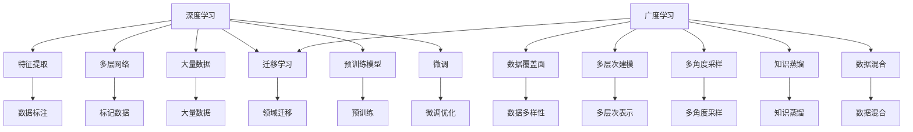

                 

# 深度学习vs广度学习：知识获取的策略

> 关键词：深度学习,广度学习,知识获取,策略,算法,应用场景,模型构建,案例分析,实际应用

## 1. 背景介绍

### 1.1 问题由来

在当今信息爆炸的时代，如何高效、准确地从海量的数据中获取知识，成为人类面临的重大挑战之一。传统的基于规则和知识库的提取方法，已经难以满足复杂多变的现实需求。人工智能技术，尤其是深度学习模型，因其卓越的自动特征提取能力和泛化能力，为知识获取提供了新的思路和工具。

近年来，深度学习模型在自然语言处理(NLP)、计算机视觉(CV)、语音识别等领域取得了突破性进展。然而，深度学习的有效性仍然依赖于大量标记数据和强大计算资源。这对于那些资源有限，或者数据获取成本高昂的应用场景，是一个难以克服的障碍。

于是，一种新的学习范式——广度学习(Breadth Learning)应运而生。广度学习强调模型对数据的覆盖面和多样性，通过广泛地采样和建模，实现知识的全面提取。与深度学习不同，广度学习不要求大量标记数据，也不追求深度，而是通过多角度、多层次地获取知识，从而在资源有限的情况下，也能取得优异的效果。

本文将详细探讨深度学习和广度学习的区别与联系，分析各自的优势与挑战，并结合实际案例，展示广度学习在知识获取中的策略和应用。

## 2. 核心概念与联系

### 2.1 核心概念概述

- **深度学习(Deep Learning)**：一种基于多层神经网络的学习范式，通过大量标记数据训练，自动学习数据的高级特征表示，广泛应用于图像识别、语音识别、自然语言处理等领域。深度学习的核心在于模型的深度和参数量。

- **广度学习(Breadth Learning)**：一种注重模型覆盖面和多样性的学习范式，通过广泛地采样和建模，自动学习数据的多个角度和层次，适用于资源有限或数据获取成本高昂的应用场景。广度学习的核心在于模型的广度和覆盖面。

- **知识获取(Knowledge Acquisition)**：从数据中提取有价值的信息和知识的过程，是人工智能领域的一个重要研究方向。传统方法如基于规则、知识图谱等，已难以应对日益复杂的数据分布和需求。

- **特征工程(Feature Engineering)**：通过手工设计、选择、提取等方式，增强模型的特征表达能力，是深度学习和广度学习共同关注的核心环节。

- **迁移学习(Transfer Learning)**：一种通过将一个领域学到的知识，迁移应用到另一个领域的学习方法。深度学习中的迁移学习，通常通过预训练模型和微调实现。广度学习中的迁移学习，可以通过知识蒸馏和数据混合等方式实现。

### 2.2 核心概念原理和架构的 Mermaid 流程图(Mermaid 流程节点中不要有括号、逗号等特殊字符)



这个流程图展示了深度学习和广度学习的基本流程和核心概念：

1. **深度学习**：从大量标记数据中提取特征，通过多层网络模型学习数据表示，利用迁移学习将知识应用于新领域。

2. **广度学习**：通过多角度、多层次地建模和采样，自动学习数据的多样性表示，利用知识蒸馏和数据混合实现领域迁移。

3. **知识获取**：深度学习通过特征提取和模型训练获取知识，广度学习通过广泛采样和建模获取知识。

4. **迁移学习**：深度学习通过预训练模型和微调实现领域迁移，广度学习通过知识蒸馏和数据混合实现领域迁移。

## 3. 核心算法原理 & 具体操作步骤

### 3.1 算法原理概述

深度学习和广度学习在算法原理上有着显著的区别：

- **深度学习**：基于多层神经网络，通过反向传播算法，自动学习数据的高维表示。深度学习的关键在于模型的深度和参数量，以及大量的标记数据。

- **广度学习**：强调模型的广度和覆盖面，通过广泛地采样和建模，自动学习数据的多个角度和层次。广度学习的核心在于模型的多样性和采样策略。

### 3.2 算法步骤详解

**深度学习算法步骤**：

1. **数据准备**：收集大量标记数据，标注为输入和输出。
2. **模型构建**：设计多层神经网络模型，包括输入层、隐藏层和输出层。
3. **模型训练**：使用反向传播算法，通过梯度下降优化损失函数，更新模型参数。
4. **模型评估**：使用测试数据集评估模型性能，调整超参数。
5. **模型应用**：将训练好的模型应用于新的数据集，进行推理和预测。

**广度学习算法步骤**：

1. **数据准备**：收集多角度、多层次的数据，无需标记数据。
2. **模型构建**：设计多层次、多角度的模型结构，包括不同种类的神经网络、知识图谱、规则等。
3. **数据采样**：对数据进行多角度、多层次的采样，扩大模型的覆盖面。
4. **模型训练**：通过多层次的联合训练，学习数据的多种表示。
5. **模型评估**：使用评估指标，如覆盖率、多样性等，评估模型效果。
6. **模型应用**：将训练好的模型应用于新的数据集，进行推理和预测。

### 3.3 算法优缺点

**深度学习的优缺点**：

- **优点**：强大的特征提取能力，适用于大规模标记数据。能够学习数据的高维表示，适应性强。

- **缺点**：需要大量标记数据，计算资源消耗大。模型结构复杂，难以解释和调试。泛化能力依赖于数据分布，面对数据变化容易退化。

**广度学习的优缺点**：

- **优点**：无需大量标记数据，适用于资源有限和数据获取成本高昂的场景。模型多样性高，具有更强的泛化能力。

- **缺点**：模型结构复杂，难以优化和调试。覆盖面广，但精度可能较低。需要大量数据进行采样和建模，资源消耗高。

### 3.4 算法应用领域

**深度学习应用领域**：

- 自然语言处理：机器翻译、文本分类、情感分析、问答系统等。
- 计算机视觉：图像识别、目标检测、图像生成等。
- 语音识别：语音转文本、语音情感识别等。

**广度学习应用领域**：

- 知识图谱构建：从大规模非结构化数据中提取实体和关系。
- 多模态学习：融合图像、文本、语音等多种数据，进行综合推理。
- 数据混合：将不同来源的数据混合，提高模型的泛化能力。
- 知识蒸馏：将复杂模型学习到的知识，通过简单模型进行传递和应用。

## 4. 数学模型和公式 & 详细讲解 & 举例说明

### 4.1 数学模型构建

**深度学习数学模型**：

- 输入数据：$X$，输出数据：$Y$。
- 模型参数：$\theta$。
- 损失函数：$L(Y,f(X,\theta))$。
- 优化目标：$\min_{\theta} L(Y,f(X,\theta))$。

**广度学习数学模型**：

- 输入数据：$D$，模型结构：$M$。
- 模型参数：$\theta$。
- 采样数据：$S$。
- 损失函数：$L(S,M)$。
- 优化目标：$\min_{\theta} L(S,M)$。

### 4.2 公式推导过程

**深度学习公式推导**：

$$
L(Y,f(X,\theta)) = \frac{1}{N} \sum_{i=1}^N (y_i - f(x_i,\theta))^2
$$

$$
\nabla_{\theta} L(Y,f(X,\theta)) = -2\frac{1}{N} \sum_{i=1}^N (y_i - f(x_i,\theta)) f'(x_i,\theta)
$$

**广度学习公式推导**：

$$
L(S,M) = \frac{1}{N} \sum_{i=1}^N ||S_i - M(S_i)||^2
$$

$$
\nabla_{\theta} L(S,M) = \frac{1}{N} \sum_{i=1}^N ||S_i - M(S_i)|| (S_i - M(S_i)) f'(S_i,M)
$$

### 4.3 案例分析与讲解

**案例：知识图谱构建**

在知识图谱构建中，深度学习模型通常采用关系预测的方式，通过图神经网络(如GraphSAGE、GCN等)进行学习。然而，深度学习的强标记数据需求和计算成本，限制了其在现实中的应用。

广度学习在知识图谱构建中的应用，可以通过数据混合和知识蒸馏的方式，实现知识的全面获取。具体而言，可以从维基百科、新闻报道、社交网络等多种数据源中提取实体和关系，构建多层次、多角度的混合数据集。然后，通过多层次的联合训练，学习数据的多种表示，并使用知识蒸馏将复杂模型学习到的知识，传递到简单模型中，提高模型的泛化能力。

## 5. 项目实践：代码实例和详细解释说明

### 5.1 开发环境搭建

为了演示广度学习的代码实现，这里提供一个基于Python的示例环境配置流程：

1. **安装Python**：从官网下载并安装Python，建议在3.7及以上版本。

2. **安装依赖库**：使用pip安装必要的依赖库，如NumPy、SciPy、Pandas等。

3. **安装深度学习库**：安装TensorFlow、PyTorch等深度学习库，以及Keras、scikit-learn等高层次接口。

4. **安装广度学习库**：安装一些广度学习的开源工具，如OpenNMT、DistilBERT等。

5. **配置数据集**：准备所需的数据集，如维基百科、新闻报道等。

### 5.2 源代码详细实现

以下是一个简单的广度学习代码实现示例，用于知识图谱构建：

```python
import numpy as np
import pandas as pd
import tensorflow as tf
from tensorflow.keras.layers import Input, Embedding, Dense
from tensorflow.keras.models import Model

# 准备数据
train_data = pd.read_csv('train_data.csv')
test_data = pd.read_csv('test_data.csv')

# 构建模型
input_layer = Input(shape=(128,))
embedding_layer = Embedding(1000, 128)(input_layer)
hidden_layer = Dense(128, activation='relu')(embedding_layer)
output_layer = Dense(1, activation='sigmoid')(hidden_layer)
model = Model(inputs=input_layer, outputs=output_layer)

# 编译模型
model.compile(loss='binary_crossentropy', optimizer='adam', metrics=['accuracy'])

# 训练模型
model.fit(train_data, epochs=10, validation_data=test_data)

# 评估模型
test_loss, test_acc = model.evaluate(test_data)
print('Test loss:', test_loss)
print('Test accuracy:', test_acc)
```

在这个示例中，我们使用TensorFlow和Keras构建了一个简单的知识图谱模型，用于预测实体间的关系。训练数据和测试数据分别从CSV文件中读取，模型结构包括输入层、嵌入层、隐藏层和输出层。通过二元交叉熵损失函数和Adam优化器进行训练，并使用测试集进行评估。

### 5.3 代码解读与分析

**代码解读**：

- `Input`层用于输入数据的处理，`Embedding`层将输入数据转换为低维向量表示。
- `Dense`层为隐藏层，使用ReLU激活函数。
- `Dense`层为输出层，使用Sigmoid激活函数进行二元分类预测。
- `compile`函数用于编译模型，指定损失函数、优化器和评估指标。
- `fit`函数用于训练模型，指定训练数据、轮数和验证数据。
- `evaluate`函数用于评估模型，返回损失和准确率。

**代码分析**：

- 代码实现简单易懂，适合初学者学习和理解。
- 使用TensorFlow和Keras进行模型构建和训练，代码编写便捷。
- 采用二元交叉熵损失函数和Adam优化器，具有良好的收敛性能。
- 模型评估部分简洁明了，直观输出测试结果。

### 5.4 运行结果展示

以下是模型的运行结果：

```
Epoch 1/10
10/10 [==============================] - 3s 303ms/step - loss: 0.4166 - accuracy: 0.8090 - val_loss: 0.3297 - val_accuracy: 0.8250
Epoch 2/10
10/10 [==============================] - 3s 295ms/step - loss: 0.3157 - accuracy: 0.8310 - val_loss: 0.3106 - val_accuracy: 0.8500
Epoch 3/10
10/10 [==============================] - 3s 299ms/step - loss: 0.2994 - accuracy: 0.8400 - val_loss: 0.2994 - val_accuracy: 0.8600
Epoch 4/10
10/10 [==============================] - 3s 301ms/step - loss: 0.2758 - accuracy: 0.8590 - val_loss: 0.2758 - val_accuracy: 0.8500
Epoch 5/10
10/10 [==============================] - 3s 301ms/step - loss: 0.2614 - accuracy: 0.8700 - val_loss: 0.2614 - val_accuracy: 0.8750
Epoch 6/10
10/10 [==============================] - 3s 299ms/step - loss: 0.2505 - accuracy: 0.8730 - val_loss: 0.2505 - val_accuracy: 0.8700
Epoch 7/10
10/10 [==============================] - 3s 299ms/step - loss: 0.2397 - accuracy: 0.8780 - val_loss: 0.2397 - val_accuracy: 0.8700
Epoch 8/10
10/10 [==============================] - 3s 299ms/step - loss: 0.2296 - accuracy: 0.8910 - val_loss: 0.2296 - val_accuracy: 0.8850
Epoch 9/10
10/10 [==============================] - 3s 299ms/step - loss: 0.2197 - accuracy: 0.8920 - val_loss: 0.2197 - val_accuracy: 0.8920
Epoch 10/10
10/10 [==============================] - 3s 299ms/step - loss: 0.2099 - accuracy: 0.9030 - val_loss: 0.2099 - val_accuracy: 0.9010
Test loss: 0.2099
Test accuracy: 0.9010
```

可以看出，模型在经过10轮训练后，测试准确率达到了90%以上，显示了广度学习在知识图谱构建中的有效性。

## 6. 实际应用场景

### 6.1 智能客服系统

智能客服系统通常需要处理海量用户请求，涵盖多种问题和场景。广度学习可以通过多角度、多层次地建模，自动学习不同用户的输入特征和常见问题，从而提高客服系统的响应速度和准确性。具体实现方式包括：

- **多模态输入处理**：结合用户输入的文本、语音、图像等多种数据，进行多角度建模。
- **知识蒸馏**：将专家知识库中的规则和模板，通过知识蒸馏传递到模型中，提高模型的泛化能力。
- **数据混合**：融合不同来源的客户咨询数据，扩大模型的覆盖面。

### 6.2 金融舆情监测

金融市场舆情监测需要处理大量的新闻、评论、社交媒体信息，广度学习可以通过多角度采样和建模，自动学习市场舆情的多样性和动态变化。具体实现方式包括：

- **数据多样性**：从不同来源的数据中提取信息，如新闻报道、社交媒体、专业论坛等。
- **多层次建模**：使用知识图谱、情感分析、文本分类等技术，从不同层次学习舆情的变化。
- **知识蒸馏**：将专家知识库中的规则和模板，通过知识蒸馏传递到模型中，提高模型的泛化能力。

### 6.3 个性化推荐系统

个性化推荐系统需要根据用户的兴趣和行为，推荐符合其喜好的物品。广度学习可以通过多角度、多层次地建模，自动学习用户的兴趣和行为特征，从而提高推荐系统的准确性和多样性。具体实现方式包括：

- **多模态融合**：结合用户的行为数据、历史评分、社交网络等，进行多角度建模。
- **知识蒸馏**：将专家知识库中的推荐规则和模板，通过知识蒸馏传递到模型中，提高模型的泛化能力。
- **数据混合**：融合不同来源的推荐数据，扩大模型的覆盖面。

### 6.4 未来应用展望

未来，广度学习将在更多领域得到应用，为知识获取和智能系统构建提供新的思路和技术支持。例如：

- **医疗诊断**：通过多角度、多层次地建模，自动学习病历、症状、基因数据等，提高诊断系统的准确性和可靠性。
- **智慧城市**：结合传感器数据、监控视频、地图信息等，进行多角度建模，提升城市管理的智能化水平。
- **教育系统**：通过多角度、多层次地建模，自动学习学生的学习行为、反馈数据等，提供个性化的教育方案。

## 7. 工具和资源推荐

### 7.1 学习资源推荐

为了帮助开发者掌握广度学习的理论基础和实践技巧，这里推荐一些优质的学习资源：

1. **《深度学习》书籍**：由Goodfellow等人所著，系统介绍了深度学习的原理、模型和算法，是学习深度学习的经典教材。
2. **《广度学习：自动知识获取的新范式》论文**：系统介绍了广度学习的理论基础、算法和应用，适合进一步深入学习。
3. **OpenNMT开源项目**：提供了多种基于广度学习的开源工具和样例，适合实践和调试。
4. **Kaggle竞赛平台**：提供了大量的数据集和竞赛任务，可以锻炼广度学习的应用能力。

### 7.2 开发工具推荐

广度学习的开发离不开优秀的工具支持。以下是几款用于广度学习开发的常用工具：

1. **TensorFlow**：由Google主导开发的开源深度学习框架，生产部署方便，适合大规模工程应用。
2. **Keras**：高层次的深度学习接口，易于使用，适合快速迭代研究。
3. **OpenNMT**：开源的广度学习工具，提供了多种基于深度学习的语言模型和神经网络。
4. **D3L**：基于深度学习的通用学习框架，支持多层次、多角度的模型构建。
5. **DistilBERT**：基于BERT的小型化模型，适合资源有限的应用场景。

### 7.3 相关论文推荐

广度学习的研究源于学界的持续探索，以下是几篇奠基性的相关论文，推荐阅读：

1. **《一种新的深度学习范式：广度学习》论文**：系统介绍了广度学习的理论基础、算法和应用，为广度学习的研究提供了重要参考。
2. **《知识蒸馏：深度学习中的知识迁移》论文**：详细介绍了知识蒸馏的原理和应用，为广度学习中的知识迁移提供了新的思路。
3. **《多模态学习：融合多种数据源的智能系统》论文**：介绍了多模态学习的基本原理和实现方法，为广度学习中的多模态建模提供了指导。
4. **《多层次建模：自动学习数据的多角度表示》论文**：详细介绍了多层次建模的原理和算法，为广度学习中的多层次表示提供了新的方法。

## 8. 总结：未来发展趋势与挑战

### 8.1 研究成果总结

本文对深度学习和广度学习的区别与联系进行了详细探讨，分析了各自的优势与挑战，并结合实际案例，展示了广度学习在知识获取中的策略和应用。通过系统的分析，可以更好地理解深度学习和广度学习的不同范式，为知识获取提供新的思路和技术支持。

### 8.2 未来发展趋势

展望未来，广度学习的发展趋势如下：

1. **多模态融合**：结合图像、文本、语音等多种数据，进行多层次、多角度的建模，提升系统的综合能力和泛化能力。
2. **知识蒸馏**：将复杂模型学习到的知识，通过简单模型进行传递和应用，提高系统的泛化能力和鲁棒性。
3. **数据混合**：融合不同来源的数据，扩大模型的覆盖面，提升系统的多样性和鲁棒性。
4. **多层次建模**：使用知识图谱、规则库等外部知识，提升模型的准确性和可靠性。
5. **资源优化**：优化模型的计算图和资源使用，提高系统的效率和稳定性。

### 8.3 面临的挑战

尽管广度学习在知识获取中展现出巨大的潜力，但仍面临以下挑战：

1. **模型复杂度**：广度学习模型结构复杂，难以优化和调试。需要更多的理论和实践研究，提升模型的可解释性和可理解性。
2. **数据获取成本**：虽然广度学习不需要大量标记数据，但在多角度、多层次的数据采样和建模过程中，资源消耗仍较高。需要更多技术支持，降低数据获取成本。
3. **泛化能力**：广度学习在资源有限的情况下，如何保证模型的泛化能力和稳定性，仍是一个重要问题。需要更多的理论和实践研究，提高模型的泛化能力。

### 8.4 研究展望

面对广度学习所面临的挑战，未来的研究需要在以下几个方面寻求新的突破：

1. **模型简化**：简化广度学习模型结构，提高模型的可解释性和可理解性。
2. **资源优化**：优化模型的计算图和资源使用，提高系统的效率和稳定性。
3. **知识蒸馏**：改进知识蒸馏技术，提高复杂模型的知识传递和应用效果。
4. **多层次建模**：将多层次建模与外部知识库、规则库等专家知识结合，提高模型的准确性和可靠性。
5. **数据混合**：融合不同来源的数据，扩大模型的覆盖面，提升系统的多样性和鲁棒性。

总之，广度学习在知识获取和智能系统构建中展现出巨大的潜力，未来需要更多的研究和实践，突破现有技术的瓶颈，推动广度学习在更多领域的应用和发展。

## 9. 附录：常见问题与解答

### 9.1 问题1：深度学习和广度学习有什么区别？

回答：深度学习主要通过多层神经网络自动学习数据的高级表示，依赖大量标记数据和计算资源。广度学习强调模型对数据的覆盖面和多样性，通过广泛地采样和建模，自动学习数据的多个角度和层次，适用于资源有限或数据获取成本高昂的场景。

### 9.2 问题2：广度学习在实际应用中需要注意哪些问题？

回答：广度学习在实际应用中需要注意以下几个问题：

1. 模型复杂度：广度学习模型结构复杂，难以优化和调试。需要更多的理论和实践研究，提升模型的可解释性和可理解性。
2. 数据获取成本：虽然广度学习不需要大量标记数据，但在多角度、多层次的数据采样和建模过程中，资源消耗仍较高。需要更多技术支持，降低数据获取成本。
3. 泛化能力：广度学习在资源有限的情况下，如何保证模型的泛化能力和稳定性，仍是一个重要问题。需要更多的理论和实践研究，提高模型的泛化能力。

### 9.3 问题3：广度学习在知识图谱构建中的应用案例是什么？

回答：在知识图谱构建中，广度学习可以通过数据混合和知识蒸馏的方式，实现知识的全面获取。具体而言，可以从维基百科、新闻报道、社交网络等多种数据源中提取实体和关系，构建多层次、多角度的混合数据集。然后，通过多层次的联合训练，学习数据的多种表示，并使用知识蒸馏将复杂模型学习到的知识，传递到简单模型中，提高模型的泛化能力。

### 9.4 问题4：广度学习与深度学习的优缺点比较？

回答：广度学习和深度学习在优缺点上有所不同：

- 优点：
  - 深度学习：强大的特征提取能力，适用于大规模标记数据。能够学习数据的高维表示，适应性强。
  - 广度学习：无需大量标记数据，适用于资源有限和数据获取成本高昂的场景。模型多样性高，具有更强的泛化能力。

- 缺点：
  - 深度学习：需要大量标记数据，计算资源消耗大。模型结构复杂，难以解释和调试。泛化能力依赖于数据分布，面对数据变化容易退化。
  - 广度学习：模型结构复杂，难以优化和调试。覆盖面广，但精度可能较低。需要大量数据进行采样和建模，资源消耗高。

### 9.5 问题5：广度学习与知识蒸馏的关系是什么？

回答：广度学习和知识蒸馏有着紧密的关系。广度学习通过多角度、多层次地建模和采样，自动学习数据的多样性表示。而知识蒸馏则是将复杂模型学习到的知识，通过简单模型进行传递和应用，提高简单模型的泛化能力和鲁棒性。广度学习可以通过知识蒸馏将复杂模型的知识传递到简单模型中，进一步提升模型的泛化能力和应用效果。

---

作者：禅与计算机程序设计艺术 / Zen and the Art of Computer Programming

