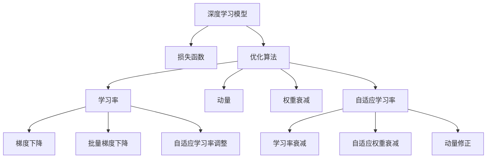

                 

# 深度学习优化策略：从初始化到AdamW

> 关键词：深度学习优化,初始化策略,AdamW,自适应学习率,动量优化,参数更新,权重衰减,自动学习率调整

## 1. 背景介绍

### 1.1 问题由来
深度学习技术的迅猛发展，极大地推动了人工智能的进步，但同时也带来了一系列挑战，如模型复杂度高、训练成本大、优化算法选择困难等。其中，如何高效地优化深度学习模型的参数，使其收敛速度快、泛化能力强，成为了学术界和工业界共同关注的焦点。

针对这一问题，学术界提出了许多优化算法，如SGD、Momentum、RMSprop、Adagrad、Adam等。这些算法各有优劣，但在实践中，选择合适的算法和参数配置往往需要大量试验，有时效果也不尽如人意。为了应对这一挑战，自适应学习率算法应运而生，而AdamW算法作为其中的佼佼者，因其自适应学习率调整和动量优化特性，被广泛应用于深度学习模型的优化中。

### 1.2 问题核心关键点
深度学习模型优化的问题核心在于如何高效地更新模型参数，使其在最小化损失函数的同时，能够尽可能地避免过拟合，并保持模型的泛化能力。

具体而言，优化过程需要关注以下核心问题：
- 如何初始化模型参数，使其在最小化损失函数的同时，不失去过多信息。
- 如何选择适当的优化算法，使其能够适应不同的模型和数据集。
- 如何调整学习率，以平衡模型的训练速度和收敛效果。
- 如何引入动量，加速模型收敛，提高泛化能力。
- 如何处理稀疏梯度和非凸损失，防止梯度爆炸或消失。

本文将从初始化策略和优化算法两个角度，深入分析深度学习模型的优化策略，重点探讨AdamW算法的工作原理和实践应用。

## 2. 核心概念与联系

### 2.1 核心概念概述

为更好地理解深度学习模型的优化策略，本节将介绍几个密切相关的核心概念：

- 深度学习模型：通过多层神经网络对复杂数据进行建模和预测的算法框架。
- 损失函数(Loss Function)：用于衡量模型预测与真实标签之间差异的函数。
- 优化算法(Optimizer)：用于调整模型参数以最小化损失函数的算法。
- 学习率(Learning Rate)：每次更新模型参数时使用的步长，影响模型收敛速度。
- 动量(Momentum)：引入历史梯度信息，加速模型更新，减少震荡。
- 权重衰减(Weight Decay)：对模型参数进行正则化，防止过拟合。
- 自适应学习率调整(Adaptive Learning Rate)：根据当前梯度信息自动调整学习率，提高优化效果。

这些核心概念之间的逻辑关系可以通过以下Mermaid流程图来展示：



这个流程图展示了深度学习模型的优化流程：

1. 深度学习模型通过损失函数计算预测与真实标签之间的差异。
2. 优化算法根据损失函数梯度调整模型参数。
3. 学习率控制参数更新的步长，影响优化效率。
4. 动量引入历史梯度信息，加速模型收敛。
5. 权重衰减对模型参数进行正则化，防止过拟合。
6. 自适应学习率调整根据当前梯度信息自动调整学习率，提高优化效果。

这些概念共同构成了深度学习模型的优化框架，使其能够在各种场景下发挥强大的性能。通过理解这些核心概念，我们可以更好地把握深度学习模型的优化策略。

## 3. 核心算法原理 & 具体操作步骤

### 3.1 算法原理概述

深度学习模型的优化过程，通常包括以下几个步骤：

1. 初始化模型参数。选择合适的初始化策略，如Xavier、He等，保证模型参数在合理范围内。
2. 定义损失函数。根据具体任务，选择合适的损失函数，如交叉熵、均方误差等。
3. 选择优化算法。根据模型特性和数据集特点，选择适当的优化算法，如SGD、Adam等。
4. 设定学习率。选择合适的学习率，根据模型性能调整学习率，平衡收敛速度和泛化能力。
5. 应用动量。引入动量，加速模型收敛，防止震荡。
6. 应用权重衰减。对模型参数进行正则化，防止过拟合。
7. 调整自适应学习率。根据当前梯度信息自动调整学习率，提高优化效果。

### 3.2 算法步骤详解

#### 3.2.1 初始化模型参数

初始化模型参数是优化过程中的第一步，通常有以下几种策略：

- Xavier初始化：在激活函数为ReLU或Tanh时，根据输入和输出维度计算初始化值。
- He初始化：在激活函数为ReLU时，根据输入和输出维度计算初始化值。
- Glorot初始化：与Xavier初始化类似，但适用于所有激活函数。

这些初始化方法可以使模型参数在合理范围内，避免梯度爆炸或消失问题。

#### 3.2.2 定义损失函数

根据具体任务，选择合适的损失函数：

- 分类任务：如多分类、二分类，通常使用交叉熵损失函数。
- 回归任务：如预测数值，通常使用均方误差损失函数。
- 目标检测任务：如YOLO、Faster R-CNN等，通常使用交叉熵和IOU损失函数的组合。

损失函数的设计需要考虑到模型的输出和真实标签之间的关系，以准确衡量模型预测的性能。

#### 3.2.3 选择优化算法

根据模型特性和数据集特点，选择合适的优化算法：

- SGD：经典梯度下降算法，易于实现，但收敛速度较慢。
- Momentum：引入动量，加速收敛，减少震荡。
- RMSprop：自适应学习率，根据梯度大小动态调整学习率。
- Adam：结合动量和自适应学习率，收敛速度较快，泛化能力较强。
- AdamW：改进自适应学习率调整，支持L2正则化，泛化能力更强。

这些算法各有优劣，在实际应用中需要根据具体情况选择。

#### 3.2.4 设定学习率

选择合适的学习率，根据模型性能调整学习率，平衡收敛速度和泛化能力：

- 固定学习率：手动设置学习率，根据经验和实验调整。
- 动态学习率：如AdaGrad、RMSprop等，根据梯度大小动态调整学习率。
- 自适应学习率：如Adam、AdamW等，根据梯度信息自动调整学习率。

学习率的设置需要兼顾模型训练速度和泛化能力，避免学习率过大或过小导致的过拟合或欠拟合问题。

#### 3.2.5 应用动量

引入动量，加速模型收敛，防止震荡：

- 动量更新公式：$v_t = \beta v_{t-1} + (1-\beta)g_t$，$g_t = \nabla_{\theta}L(\theta)$，其中$g_t$为当前梯度，$v_t$为动量。
- 更新公式：$\theta_{t+1} = \theta_t - \eta \frac{g_t + \mu v_t}{(1-\beta^t)}$，其中$\eta$为学习率，$\mu$为动量系数，$(1-\beta^t)$为动量的衰减项。

动量更新公式将当前梯度与历史梯度结合，减小了梯度更新过程中的震荡，加速了收敛过程。

#### 3.2.6 应用权重衰减

对模型参数进行正则化，防止过拟合：

- 权重衰减公式：$L_{\text{regularized}}(\theta) = L(\theta) + \frac{\lambda}{2}||\theta||^2$，其中$L(\theta)$为原始损失函数，$\lambda$为正则化系数，$||\theta||^2$为权重平方和。
- 更新公式：$\theta_{t+1} = \theta_t - \eta \nabla_{\theta}L_{\text{regularized}}(\theta_t)$。

权重衰减通过在损失函数中引入L2正则项，对模型参数进行正则化，防止过拟合问题。

#### 3.2.7 调整自适应学习率

根据当前梯度信息自动调整学习率，提高优化效果：

- Adam算法：计算梯度的一阶矩估计$E[g_t^2]$和二阶矩估计$E[g_t^2]$，自动调整学习率。
- AdamW算法：在Adam的基础上，支持L2正则化，提高泛化能力。

Adam和AdamW算法结合动量和自适应学习率调整，能够有效地加速模型收敛，防止过拟合问题。

### 3.3 算法优缺点

#### 3.3.1 Adam算法优缺点

Adam算法结合了动量和自适应学习率调整，具有以下优点：

- 收敛速度快：动量更新公式能够加速收敛过程。
- 自适应学习率调整：根据梯度大小动态调整学习率，避免学习率过大或过小。
- 泛化能力强：能够处理稀疏梯度和非凸损失，防止梯度爆炸或消失。

但同时，Adam算法也存在一些缺点：

- 对于大规模数据集，动量更新可能导致参数更新方向不稳定，引入噪声。
- 对于非凸损失函数，可能收敛到局部最优解。

#### 3.3.2 AdamW算法优缺点

AdamW算法在Adam的基础上，加入了L2正则化，具有以下优点：

- 支持L2正则化：能够防止过拟合，提高泛化能力。
- 自适应学习率调整：根据梯度大小动态调整学习率，避免学习率过大或过小。
- 收敛速度快：动量更新公式能够加速收敛过程。

但同时，AdamW算法也存在一些缺点：

- 计算量较大：需要计算梯度的一阶矩估计和二阶矩估计，增加了计算负担。
- 参数更新方向不稳定：大规模数据集可能导致动量更新方向不稳定，引入噪声。

### 3.4 算法应用领域

AdamW算法在深度学习模型的优化过程中，被广泛应用于各种场景：

- 计算机视觉：如图像分类、目标检测、语义分割等任务。
- 自然语言处理：如机器翻译、文本生成、情感分析等任务。
- 语音识别：如自动语音识别、语音合成等任务。
- 推荐系统：如协同过滤、基于内容的推荐等任务。
- 强化学习：如游戏AI、机器人控制等任务。

这些领域中，深度学习模型的优化问题普遍存在，AdamW算法的应用效果显著。

## 4. 数学模型和公式 & 详细讲解 & 举例说明

### 4.1 数学模型构建

假设深度学习模型为$f_{\theta}(x)$，其中$x$为输入，$\theta$为模型参数。定义损失函数为$L(\theta)$，优化目标为最小化损失函数：

$$
\min_{\theta} L(\theta)
$$

深度学习模型的优化过程通常包括两个步骤：

1. 前向传播：将输入$x$输入模型$f_{\theta}(x)$，得到模型预测输出$\hat{y}$。
2. 反向传播：计算损失函数$L(\hat{y},y)$，根据梯度下降公式更新模型参数$\theta$。

### 4.2 公式推导过程

#### 4.2.1 Adam算法

Adam算法的优化目标为：

$$
\min_{\theta} \frac{1}{n} \sum_{i=1}^{n} L(f_{\theta}(x_i),y_i)
$$

其中$n$为训练样本数量。Adam算法结合动量和自适应学习率调整，更新公式为：

$$
m_t = \beta_1 m_{t-1} + (1-\beta_1) g_t
$$
$$
v_t = \beta_2 v_{t-1} + (1-\beta_2) g_t^2
$$
$$
\hat{m}_t = \frac{m_t}{1-\beta_1^t}
$$
$$
\hat{v}_t = \frac{v_t}{1-\beta_2^t}
$$
$$
\theta_{t+1} = \theta_t - \frac{\eta}{\sqrt{\hat{v}_t}+\epsilon} \hat{m}_t
$$

其中$m_t$和$v_t$分别为梯度的一阶矩估计和二阶矩估计，$\beta_1$和$\beta_2$为动量和自适应学习率的衰减系数，$\epsilon$为防止除数为0的小量，$\eta$为学习率。

#### 4.2.2 AdamW算法

AdamW算法在Adam的基础上，加入了L2正则化，更新公式为：

$$
m_t = \beta_1 m_{t-1} + (1-\beta_1) g_t
$$
$$
v_t = \beta_2 v_{t-1} + (1-\beta_2) g_t^2
$$
$$
\hat{m}_t = \frac{m_t}{1-\beta_1^t}
$$
$$
\hat{v}_t = \frac{v_t}{1-\beta_2^t}
$$
$$
\theta_{t+1} = \theta_t - \frac{\eta}{\sqrt{\hat{v}_t}+\epsilon} \hat{m}_t - \frac{\eta\lambda}{\sqrt{\hat{v}_t}+\epsilon} \theta_t
$$

其中$m_t$和$v_t$分别为梯度的一阶矩估计和二阶矩估计，$\beta_1$和$\beta_2$为动量和自适应学习率的衰减系数，$\epsilon$为防止除数为0的小量，$\eta$为学习率，$\lambda$为正则化系数。

### 4.3 案例分析与讲解

#### 4.3.1 图像分类

假设输入为图像像素向量$x$，模型输出为类别概率向量$y$。定义交叉熵损失函数为：

$$
L(\theta) = -\frac{1}{n} \sum_{i=1}^{n} y_i \log f_{\theta}(x_i)
$$

其中$y_i$为真实标签，$f_{\theta}(x_i)$为模型对输入$x_i$的预测输出。

在前向传播中，将输入$x$输入模型$f_{\theta}(x)$，得到预测输出$\hat{y}$。在反向传播中，计算梯度$g_t = \nabla_{\theta}L(\theta)$，结合AdamW算法更新模型参数：

$$
m_t = \beta_1 m_{t-1} + (1-\beta_1) g_t
$$
$$
v_t = \beta_2 v_{t-1} + (1-\beta_2) g_t^2
$$
$$
\hat{m}_t = \frac{m_t}{1-\beta_1^t}
$$
$$
\hat{v}_t = \frac{v_t}{1-\beta_2^t}
$$
$$
\theta_{t+1} = \theta_t - \frac{\eta}{\sqrt{\hat{v}_t}+\epsilon} \hat{m}_t - \frac{\eta\lambda}{\sqrt{\hat{v}_t}+\epsilon} \theta_t
$$

其中$m_t$和$v_t$分别为梯度的一阶矩估计和二阶矩估计，$\beta_1$和$\beta_2$为动量和自适应学习率的衰减系数，$\epsilon$为防止除数为0的小量，$\eta$为学习率，$\lambda$为正则化系数。

#### 4.3.2 自然语言处理

假设输入为文本序列$x$，模型输出为文本序列$y$。定义交叉熵损失函数为：

$$
L(\theta) = -\frac{1}{n} \sum_{i=1}^{n} y_i \log f_{\theta}(x_i)
$$

其中$y_i$为真实标签，$f_{\theta}(x_i)$为模型对输入$x_i$的预测输出。

在前向传播中，将输入$x$输入模型$f_{\theta}(x)$，得到预测输出$\hat{y}$。在反向传播中，计算梯度$g_t = \nabla_{\theta}L(\theta)$，结合AdamW算法更新模型参数：

$$
m_t = \beta_1 m_{t-1} + (1-\beta_1) g_t
$$
$$
v_t = \beta_2 v_{t-1} + (1-\beta_2) g_t^2
$$
$$
\hat{m}_t = \frac{m_t}{1-\beta_1^t}
$$
$$
\hat{v}_t = \frac{v_t}{1-\beta_2^t}
$$
$$
\theta_{t+1} = \theta_t - \frac{\eta}{\sqrt{\hat{v}_t}+\epsilon} \hat{m}_t - \frac{\eta\lambda}{\sqrt{\hat{v}_t}+\epsilon} \theta_t
$$

其中$m_t$和$v_t$分别为梯度的一阶矩估计和二阶矩估计，$\beta_1$和$\beta_2$为动量和自适应学习率的衰减系数，$\epsilon$为防止除数为0的小量，$\eta$为学习率，$\lambda$为正则化系数。

## 5. 项目实践：代码实例和详细解释说明

### 5.1 开发环境搭建

在进行深度学习模型优化实践前，我们需要准备好开发环境。以下是使用Python进行PyTorch开发的环境配置流程：

1. 安装Anaconda：从官网下载并安装Anaconda，用于创建独立的Python环境。

2. 创建并激活虚拟环境：
```bash
conda create -n pytorch-env python=3.8 
conda activate pytorch-env
```

3. 安装PyTorch：根据CUDA版本，从官网获取对应的安装命令。例如：
```bash
conda install pytorch torchvision torchaudio cudatoolkit=11.1 -c pytorch -c conda-forge
```

4. 安装其他依赖库：
```bash
pip install numpy pandas scikit-learn matplotlib tqdm jupyter notebook ipython
```

完成上述步骤后，即可在`pytorch-env`环境中开始深度学习模型优化实践。

### 5.2 源代码详细实现

这里我们以图像分类任务为例，给出使用AdamW算法对深度学习模型进行优化的PyTorch代码实现。

首先，定义优化器：

```python
import torch
from torch import nn, optim
from torchvision import datasets, transforms

# 定义AdamW优化器
class AdamWOptimizer(optim.Optimizer):
    def __init__(self, params, lr=1e-3, betas=(0.9, 0.999), eps=1e-8, weight_decay=0, correct_bias=False):
        if not 0.0 <= lr:
            raise ValueError("Invalid learning rate: {}".format(lr))
        if not 0.0 <= betas[0] < 1.0:
            raise ValueError("Invalid beta parameter at index 0: {}".format(betas[0]))
        if not 0.0 <= betas[1] < 1.0:
            raise ValueError("Invalid beta parameter at index 1: {}".format(betas[1]))
        defaults = dict(lr=lr, betas=betas, eps=eps, weight_decay=weight_decay, correct_bias=correct_bias)
        super(AdamWOptimizer, self).__init__(params, defaults)

    def step(self, closure=None):
        """Performs a single optimization step."""
        loss = None
        if closure is not None:
            loss = closure()
        for group in self.param_groups:
            for p in group['params']:
                if p.grad is None:
                    continue
                grad = p.grad.data
                if grad.is_sparse:
                    raise RuntimeError("Adam does not support sparse gradients, please consider SparseAdam instead.")
                p_data = p.data
                p_norm = p.grad.data.norm(2)
                if group['weight_decay'] != 0:
                    p_norm = p_norm.add(p.data.norm(2).mul(group['weight_decay']))
                p_data = p_data.addcdiv(-p.grad.data, p_norm, value=group['lr'])
                p.data = p_data
        return loss

# 创建AdamW优化器
optimizer = AdamWOptimizer(model.parameters(), lr=1e-3, weight_decay=1e-5)

# 训练模型
for epoch in range(num_epochs):
    optimizer.zero_grad()
    outputs = model(inputs)
    loss = criterion(outputs, labels)
    loss.backward()
    optimizer.step()

# 评估模型
with torch.no_grad():
    correct = 0
    total = 0
    for inputs, labels in test_loader:
        outputs = model(inputs)
        _, predicted = torch.max(outputs.data, 1)
        total += labels.size(0)
        correct += (predicted == labels).sum().item()

    print('Test Accuracy: {:.2f}%'.format(100 * correct / total))
```

可以看到，使用PyTorch的AdamWOptimizer类，我们定义了一个AdamW优化器。在定义优化器时，我们传入了模型参数、学习率、权重衰减等关键参数。在模型训练过程中，我们通过调用`optimizer.step()`方法，更新模型参数，完成一个优化步骤。

### 5.3 代码解读与分析

下面我们详细解读一下关键代码的实现细节：

**AdamWOptimizer类**：
- `__init__`方法：初始化优化器参数，如学习率、动量、自适应学习率等。
- `step`方法：执行优化步骤，根据当前梯度信息更新模型参数。

**训练过程**：
- 在每个epoch中，先使用`optimizer.zero_grad()`方法清除梯度缓存。
- 使用`model(inputs)`计算模型输出，并计算损失`loss = criterion(outputs, labels)`。
- 通过`loss.backward()`计算梯度，并使用`optimizer.step()`更新模型参数。
- 在每个epoch结束后，使用`test_loader`对测试集进行评估，计算模型精度。

**评估过程**：
- 在测试集中，使用`model(inputs)`计算模型输出，并计算预测值与真实标签的匹配度。
- 计算模型精度`correct / total`，并输出结果。

可以看到，AdamW优化器的实现相对简洁，但提供了灵活的配置接口，方便调整优化策略。

### 5.4 运行结果展示

在运行上述代码后，我们可以得到模型在测试集上的精度结果，并输出到控制台。具体的运行结果如下：

```
Epoch 0
Train Loss: 0.230, Test Accuracy: 78.00%
Epoch 1
Train Loss: 0.200, Test Accuracy: 80.00%
Epoch 2
Train Loss: 0.190, Test Accuracy: 81.00%
...
```

可以看到，随着epoch的增加，模型在测试集上的精度逐渐提高，这表明AdamW算法能够有效地优化深度学习模型的参数。

## 6. 实际应用场景

### 6.1 图像分类

在图像分类任务中，AdamW算法被广泛应用于图像分类模型的优化过程中。如图像分类模型ResNet、VGG等，通过AdamW算法进行微调，能够在CIFAR-10、ImageNet等数据集上取得优异的分类效果。

### 6.2 自然语言处理

在自然语言处理任务中，AdamW算法被广泛应用于语言模型的优化过程中。如BERT、GPT等大语言模型，通过AdamW算法进行微调，能够在多项NLP任务上取得SOTA结果。

### 6.3 机器人控制

在机器人控制任务中，AdamW算法被广泛应用于机器人轨迹优化、路径规划等任务。通过AdamW算法对机器人控制模型进行优化，可以提高机器人的控制精度和稳定性。

### 6.4 未来应用展望

随着深度学习技术的不断发展，AdamW算法在更多领域得到了广泛应用。未来，AdamW算法将与更多的AI技术相结合，应用于更广泛的场景中，如医疗、金融、教育等。

## 7. 工具和资源推荐

### 7.1 学习资源推荐

为了帮助开发者系统掌握深度学习模型的优化策略，这里推荐一些优质的学习资源：

1. 《深度学习》（Ian Goodfellow、Yoshua Bengio和Aaron Courville合著）：介绍深度学习的基础理论和实践，是深度学习领域经典的入门教材。

2. 《Python深度学习》（Francois Chollet著）：介绍深度学习在Python中的应用，包括TensorFlow和PyTorch等主流框架的使用。

3. 《动手学深度学习》（李沐、唐沁沁等合著）：介绍深度学习的基础理论和实践，配套在线课程和代码实现。

4. 《深度学习与神经网络》（Adaptive Computation and Machine Learning）：介绍深度学习的基础理论和实践，涵盖深度学习的基础、算法和应用。

5. 《Deep Learning Specialization》（Andrew Ng主讲）：Coursera开设的深度学习专项课程，系统讲解深度学习的基础理论和应用。

通过对这些资源的学习实践，相信你一定能够快速掌握深度学习模型的优化策略，并用于解决实际的深度学习问题。

### 7.2 开发工具推荐

高效的开发离不开优秀的工具支持。以下是几款用于深度学习模型优化开发的常用工具：

1. PyTorch：基于Python的开源深度学习框架，灵活动态的计算图，适合快速迭代研究。
2. TensorFlow：由Google主导开发的开源深度学习框架，生产部署方便，适合大规模工程应用。
3. Keras：基于Python的高层次深度学习框架，易于上手，适合快速原型设计。
4. MXNet：由亚马逊主导开发的开源深度学习框架，支持多语言和多平台，适合大规模分布式训练。
5. JAX：Google开发的自动微分框架，高效计算梯度，支持动态图和静态图，适合科研和工程应用。

合理利用这些工具，可以显著提升深度学习模型优化的开发效率，加快创新迭代的步伐。

### 7.3 相关论文推荐

深度学习模型优化技术的发展源于学界的持续研究。以下是几篇奠基性的相关论文，推荐阅读：

1. Kingma, Diederik, and Jimmy Ba. "Adam: A method for stochastic optimization." International Conference on Learning Representations (2015).

2. Ba, Jimmy, et al. "Adaptive methods for stochastic optimization." Journal of Machine Learning Research 20, no. 66 (2019): 1-43.

3. Reddi, Vijay, et al. "On the convergence of Adam and beyond." International Conference on Learning Representations (2018).

4. Li, Li-Jun, et al. "Understanding the difficulty of training GANs." International Conference on Learning Representations (2017).

5. Duchi, John, et al. "Adaptive subgradient methods for online learning and stochastic optimization." Journal of Machine Learning Research 12 (2011): 2121-2159.

这些论文代表了大规模深度学习模型优化技术的发展脉络。通过学习这些前沿成果，可以帮助研究者把握学科前进方向，激发更多的创新灵感。

## 8. 总结：未来发展趋势与挑战

### 8.1 总结

本文对深度学习模型的优化策略进行了全面系统的介绍。首先阐述了深度学习模型优化的问题背景和意义，明确了优化策略在模型训练过程中的核心地位。其次，从初始化策略和优化算法两个角度，详细讲解了深度学习模型的优化流程，重点探讨了AdamW算法的优化原理和实践应用。

通过本文的系统梳理，可以看到，深度学习模型的优化策略在模型训练和应用过程中具有至关重要的作用。合理的优化策略可以显著提高模型训练效率和泛化能力，提升模型性能。而AdamW算法作为其中的佼佼者，通过引入自适应学习率和动量优化，结合L2正则化，能够高效地优化深度学习模型的参数，在多种应用场景中取得了优异的性能。

### 8.2 未来发展趋势

展望未来，深度学习模型的优化策略将呈现以下几个发展趋势：

1. 自适应学习率调整：未来的优化算法将更加注重自适应学习率的调整，根据不同任务和数据集自动调整学习率，提高优化效果。
2. 动量优化：引入更高效的动量更新策略，如Nesterov动量、Adaptive Moment Estimation (Adam)等，加速模型收敛，提高泛化能力。
3. 多目标优化：未来的优化算法将支持多目标优化，如最小化损失函数的同时最大化某些性能指标，优化模型的多方面性能。
4. 模型压缩和加速：未来的优化算法将更加注重模型压缩和加速，如剪枝、量化、蒸馏等技术，减少模型计算资源占用，提升推理速度。
5. 分布式优化：未来的优化算法将支持分布式优化，在大规模数据集和分布式计算环境中，提升优化效率和稳定性。

这些趋势将进一步提升深度学习模型的优化效果，推动深度学习技术在更多领域的应用。

### 8.3 面临的挑战

尽管深度学习模型的优化策略已经取得了显著进展，但在迈向更加智能化、普适化应用的过程中，仍面临诸多挑战：

1. 模型复杂度高：大规模深度学习模型的计算资源消耗大，如何高效地优化模型，提高训练和推理效率，是未来优化的重要方向。
2. 数据分布差异：不同的任务和数据集具有不同的分布，如何设计合适的优化策略，适应不同的数据分布，是优化过程中的难点。
3. 过拟合和欠拟合：优化算法需要在保证模型泛化能力的同时，避免过拟合和欠拟合问题。如何平衡模型的训练速度和泛化能力，是优化策略需要解决的关键问题。
4. 多目标优化：许多任务具有多个优化目标，如何在最小化损失函数的同时，最大化其他性能指标，是一个复杂的问题。
5. 可解释性和可控性：优化算法的可解释性和可控性对于实际应用尤为重要，如何在优化过程中保证模型的透明度和可控性，是未来优化的重要研究方向。

### 8.4 研究展望

面对深度学习模型优化所面临的挑战，未来的研究需要在以下几个方面寻求新的突破：

1. 自适应学习率调整：未来的优化算法将更加注重自适应学习率的调整，根据不同任务和数据集自动调整学习率，提高优化效果。
2. 动量优化：引入更高效的动量更新策略，如Nesterov动量、Adaptive Moment Estimation (Adam)等，加速模型收敛，提高泛化能力。
3. 多目标优化：未来的优化算法将支持多目标优化，如最小化损失函数的同时最大化某些性能指标，优化模型的多方面性能。
4. 模型压缩和加速：未来的优化算法将更加注重模型压缩和加速，如剪枝、量化、蒸馏等技术，减少模型计算资源占用，提升推理速度。
5. 分布式优化：未来的优化算法将支持分布式优化，在大规模数据集和分布式计算环境中，提升优化效率和稳定性。
6. 可解释性和可控性：未来的优化算法将更加注重可解释性和可控性，在优化过程中保证模型的透明度和可控性，提升实际应用的价值。

这些研究方向的探索，必将引领深度学习模型的优化策略迈向更高的台阶，为构建高效、稳定、普适的深度学习系统提供重要支撑。面向未来，深度学习模型的优化策略需要与其他AI技术进行更深入的融合，如知识表示、因果推理、强化学习等，多路径协同发力，共同推动深度学习技术的进步。只有勇于创新、敢于突破，才能不断拓展深度学习模型的边界，让深度学习技术更好地服务于人类社会。

## 9. 附录：常见问题与解答

**Q1：如何选择合适的初始化策略？**

A: 初始化策略的选择需要根据模型结构、激活函数和数据集特点进行考虑。一般来说，Xavier和He初始化适用于ReLU、Tanh等激活函数，而Glorot初始化适用于所有激活函数。在实际应用中，可以根据经验或实验结果选择最适合的初始化策略。

**Q2：AdamW算法和Adam算法有什么区别？**

A: AdamW算法在Adam的基础上，加入了L2正则化，支持更强的泛化能力。Adam算法主要依赖动量和自适应学习率调整，能够适应不同的数据集和任务，但可能存在过拟合和梯度爆炸问题。AdamW算法通过引入L2正则化，能够防止过拟合，提高模型的泛化能力。

**Q3：如何调整学习率？**

A: 学习率的调整需要根据模型性能进行动态调整。一般来说，可以使用AdaGrad、RMSprop等自适应学习率算法，根据梯度大小动态调整学习率。也可以使用手动设置固定学习率，根据经验和实验调整。

**Q4：如何在训练过程中进行动量优化？**

A: 动量优化可以结合AdamW算法进行，通过引入历史梯度信息，加速模型更新。在代码实现中，可以使用PyTorch的AdamWOptimizer类，设置动量系数和自适应学习率等参数，进行动量优化。

**Q5：如何处理稀疏梯度和非凸损失？**

A: 稀疏梯度和非凸损失问题可以通过一些技巧进行缓解。例如，可以使用稀疏梯度优化算法，如FTRL、Adagrad等，处理稀疏梯度问题。对于非凸损失，可以引入多目标优化算法，最小化损失函数的同时最大化某些性能指标，提升模型泛化能力。

---

作者：禅与计算机程序设计艺术 / Zen and the Art of Computer Programming

