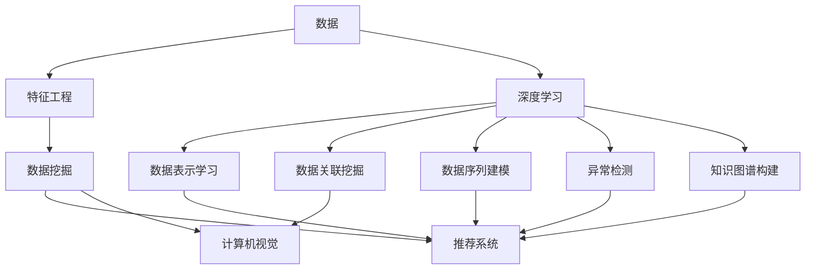

                 

# 深度学习在知识发现引擎中的应用

> 关键词：知识发现引擎,深度学习,数据挖掘,自然语言处理(NLP),推荐系统,计算机视觉,特征工程,深度神经网络(DNN),迁移学习

## 1. 背景介绍

### 1.1 问题由来
随着大数据时代的到来，数据规模的急剧膨胀和数据类型的不断丰富，使得传统的数据分析方法面临着严峻的挑战。如何在海量数据中快速发现潜在的知识和规律，提高数据分析的准确性和效率，成为当前人工智能领域的一个核心问题。知识发现引擎(Knowledge Discovery Engine, KDE)应运而生，利用先进的深度学习技术和数据挖掘算法，自动地从大规模数据中发现模式、关联、序列和异常，为决策制定和业务优化提供有力支持。

### 1.2 问题核心关键点
深度学习技术作为KDE的重要组成部分，通过构建具有多层抽象能力的人工神经网络，可以从原始数据中自动学习和提取特征，发现数据中的潜在知识和规律，实现自动化的数据分析和挖掘。

具体来说，深度学习在KDE中的应用主要体现在以下几个方面：

- 数据表示学习：利用神经网络对原始数据进行高层次的特征提取和表示学习，形成具有丰富语义信息的特征表示。
- 数据关联挖掘：通过构建图神经网络，挖掘数据中的复杂关联关系，如人与人之间的关系、事件与事件之间的关系等。
- 数据序列建模：利用循环神经网络(RNN)和长短期记忆网络(LSTM)等模型，捕捉时间序列数据中的动态变化趋势。
- 异常检测：通过自编码器和生成对抗网络(GAN)等模型，识别数据中的异常点和异常行为，提高数据分析的鲁棒性。
- 知识图谱构建：利用深度神经网络，构建和扩展知识图谱，将无结构化数据转化为结构化知识。

这些应用展示了深度学习在KDE中的强大潜力，有助于在复杂的现实世界中挖掘出更深层次的知识和价值。

## 2. 核心概念与联系

### 2.1 核心概念概述

为更好地理解深度学习在KDE中的应用，本节将介绍几个密切相关的核心概念：

- 知识发现引擎(KDE)：通过数据挖掘和机器学习算法，自动从大规模数据中发现知识、规律和模式，辅助决策制定和业务优化的人工智能系统。
- 深度学习(Deep Learning, DL)：基于多层神经网络，从数据中自动学习和提取复杂特征，实现对数据的深度表示和理解。
- 数据挖掘(Data Mining)：从大量数据中提取有价值的信息和知识，包括分类、聚类、关联规则学习、异常检测等。
- 自然语言处理(Natural Language Processing, NLP)：使计算机能够理解、分析并生成人类语言的技术。
- 推荐系统(Recommender System)：通过学习用户行为数据，预测用户对商品的偏好，从而为用户推荐个性化内容的技术。
- 计算机视觉(Computer Vision)：使计算机能够理解和解释视觉信息，如图像识别、对象检测、图像生成等。
- 特征工程(Feature Engineering)：从原始数据中提取、构建、优化特征，以提升模型性能和数据分析效果。
- 深度神经网络(Depth Neural Network, DNN)：由多个层次的神经网络组成，能够处理复杂的非线性关系，适用于大规模数据建模。
- 迁移学习(Transfer Learning)：利用预训练模型的知识，在新任务上进行微调，以减少训练时间和提高模型性能。

这些核心概念之间的逻辑关系可以通过以下Mermaid流程图来展示：



这个流程图展示了大语言模型的工作原理和优化方向：

1. 数据经特征工程处理后，进入深度学习模型进行表示学习、关联挖掘、序列建模、异常检测和知识图谱构建。
2. 这些深度学习过程分别对应着推荐系统、计算机视觉等具体应用领域。
3. 最终，深度学习模型提取的特征被用于数据挖掘，辅助推荐系统、计算机视觉等应用。

## 3. 核心算法原理 & 具体操作步骤
### 3.1 算法原理概述

深度学习在KDE中的应用，主要是通过构建深度神经网络模型，从原始数据中自动学习和提取特征，发现数据中的潜在知识和规律。具体来说，深度学习模型利用多层非线性变换，对输入数据进行特征提取和表示学习，形成高层次的特征表示，从而支持数据挖掘和模式发现。

形式化地，假设输入数据为 $\mathbf{X}$，目标输出为 $\mathbf{Y}$，深度学习模型为 $M_{\theta}$，其中 $\theta$ 为模型参数。深度学习模型的训练目标是最小化损失函数 $\mathcal{L}(M_{\theta}, \mathbf{X}, \mathbf{Y})$，即：

$$
\theta^* = \mathop{\arg\min}_{\theta} \mathcal{L}(M_{\theta}, \mathbf{X}, \mathbf{Y})
$$

其中，$\mathcal{L}$ 为常用的损失函数，如交叉熵损失、均方误差损失等。通过梯度下降等优化算法，深度学习模型不断更新参数 $\theta$，最小化损失函数，最终得到能够准确表示数据的高维特征表示。

### 3.2 算法步骤详解

深度学习在KDE中的应用主要包括以下几个关键步骤：

**Step 1: 数据预处理**
- 对原始数据进行清洗、去噪、标准化等预处理操作，提高数据质量。
- 利用特征工程技术，从原始数据中提取、构建和优化特征，提高模型的泛化能力。

**Step 2: 构建深度神经网络模型**
- 选择合适的深度神经网络模型，如卷积神经网络(CNN)、循环神经网络(RNN)、长短期记忆网络(LSTM)、图神经网络(GNN)等。
- 根据具体任务设计合适的模型架构，包括输入层、隐藏层、输出层和激活函数等。

**Step 3: 模型训练**
- 将预处理后的数据输入模型，使用优化算法（如Adam、SGD等）和损失函数训练模型参数 $\theta$。
- 根据训练集和验证集的表现，调整模型的超参数，如学习率、批次大小、迭代轮数等。
- 防止过拟合，可引入正则化技术、早停等策略。

**Step 4: 模型评估和优化**
- 在测试集上评估模型性能，计算各类指标，如准确率、召回率、F1值等。
- 根据评估结果，进一步优化模型结构和参数设置，提高模型精度和鲁棒性。
- 使用模型对新数据进行预测，验证其泛化能力。

### 3.3 算法优缺点

深度学习在KDE中的应用具有以下优点：

1. 自动化特征提取：深度学习模型能够自动从数据中提取高层次的特征表示，无需手工设计特征，提高数据分析效率。
2. 处理复杂关系：深度神经网络能够处理复杂的非线性关系，适用于各种复杂的数据挖掘任务。
3. 高泛化能力：深度学习模型具有较强的泛化能力，能够适应不同领域和规模的数据。
4. 多任务学习：深度学习模型能够同时处理多个任务，提高数据利用率。

同时，深度学习在KDE中也有一些局限性：

1. 训练时间较长：深度神经网络模型通常需要大量的训练数据和计算资源，训练时间较长。
2. 模型复杂度较高：深度神经网络模型的参数量较大，模型复杂度较高，可能导致过拟合。
3. 数据依赖性强：深度学习模型对数据的依赖性较强，数据质量差可能影响模型性能。
4. 解释性不足：深度学习模型通常被视为"黑盒"模型，难以解释其内部决策过程。

尽管存在这些局限性，但深度学习在KDE中的应用依然具有广阔的前景。未来相关研究的重点在于如何进一步降低深度学习的资源消耗，提高模型的解释性和鲁棒性，以及如何更好地结合其他技术手段，实现更高效、更智能的知识发现。

### 3.4 算法应用领域

深度学习在KDE中的应用已经涵盖了多个领域，包括但不限于：

- 自然语言处理(NLP)：如情感分析、文本分类、命名实体识别、机器翻译等，通过深度学习模型从文本数据中挖掘知识和规律。
- 推荐系统：如商品推荐、新闻推荐、视频推荐等，利用深度学习模型分析用户行为数据，预测用户兴趣，提供个性化推荐。
- 计算机视觉：如图像识别、对象检测、图像生成等，通过深度学习模型捕捉视觉信息的特征和关系。
- 医疗健康：如疾病诊断、基因分析、药物发现等，利用深度学习模型处理医疗数据，提取疾病特征，优化治疗方案。
- 金融分析：如股票预测、信用评估、风险控制等，利用深度学习模型分析金融数据，发现市场规律，防范金融风险。
- 智能制造：如质量检测、设备维护、故障预测等，利用深度学习模型分析生产数据，优化生产流程，提高产品质量。

这些应用展示了深度学习在KDE中的强大潜力，为各个行业带来了新的技术突破和业务创新。

## 4. 数学模型和公式 & 详细讲解 & 举例说明

### 4.1 数学模型构建

本节将使用数学语言对深度学习在KDE中的应用进行更加严格的刻画。

假设输入数据为 $\mathbf{X} \in \mathbb{R}^{n \times d}$，其中 $n$ 为样本数，$d$ 为特征数。目标输出为 $\mathbf{Y} \in \mathbb{R}^{n \times c}$，其中 $c$ 为目标分类数。定义深度学习模型为 $M_{\theta}$，其中 $\theta$ 为模型参数。深度学习模型的训练目标是最小化损失函数 $\mathcal{L}(M_{\theta}, \mathbf{X}, \mathbf{Y})$，即：

$$
\theta^* = \mathop{\arg\min}_{\theta} \mathcal{L}(M_{\theta}, \mathbf{X}, \mathbf{Y})
$$

其中，$\mathcal{L}$ 为常用的损失函数，如交叉熵损失、均方误差损失等。通过梯度下降等优化算法，深度学习模型不断更新参数 $\theta$，最小化损失函数，最终得到能够准确表示数据的高维特征表示。

### 4.2 公式推导过程

以交叉熵损失函数为例，假设模型 $M_{\theta}$ 在输入 $\mathbf{X}$ 上的输出为 $\hat{\mathbf{Y}} = M_{\theta}(\mathbf{X}) \in [0,1]^{n \times c}$，表示模型对每个样本的每个类别的预测概率。真实标签为 $\mathbf{Y} \in \{0,1\}^{n \times c}$。则二分类交叉熵损失函数定义为：

$$
\ell(M_{\theta}(\mathbf{X}), \mathbf{Y}) = -\frac{1}{n}\sum_{i=1}^n \sum_{j=1}^c y_{i,j}\log(\hat{y}_{i,j}) + (1-y_{i,j})\log(1-\hat{y}_{i,j})
$$

将其代入经验风险公式，得：

$$
\mathcal{L}(\theta) = -\frac{1}{n}\sum_{i=1}^n \sum_{j=1}^c y_{i,j}\log(\hat{y}_{i,j}) + (1-y_{i,j})\log(1-\hat{y}_{i,j})
$$

根据链式法则，损失函数对参数 $\theta_k$ 的梯度为：

$$
\frac{\partial \mathcal{L}(\theta)}{\partial \theta_k} = -\frac{1}{n}\sum_{i=1}^n \sum_{j=1}^c [y_{i,j} \frac{\partial \hat{y}_{i,j}}{\partial \theta_k} - (1-y_{i,j}) \frac{\partial (1-\hat{y}_{i,j})}{\partial \theta_k}]
$$

其中 $\frac{\partial \hat{y}_{i,j}}{\partial \theta_k}$ 可进一步递归展开，利用自动微分技术完成计算。

在得到损失函数的梯度后，即可带入参数更新公式，完成模型的迭代优化。重复上述过程直至收敛，最终得到适应下游任务的最优模型参数 $\theta^*$。

### 4.3 案例分析与讲解

以推荐系统为例，我们假设有一个电商网站，希望根据用户的浏览和购买历史，为用户推荐相关商品。具体步骤如下：

**Step 1: 数据预处理**
- 收集用户的浏览记录和购买记录，提取商品ID、购买时间、用户ID等特征。
- 对数据进行清洗、去噪、标准化等预处理操作。
- 利用特征工程技术，提取商品的类别、价格、销量等特征。

**Step 2: 构建深度神经网络模型**
- 选择合适的网络结构，如基于用户历史行为的协同过滤模型、基于商品特征的模型等。
- 设计合适的损失函数，如均方误差损失、交叉熵损失等。
- 利用优化算法（如Adam、SGD等）训练模型参数。

**Step 3: 模型训练**
- 将预处理后的数据输入模型，使用优化算法（如Adam、SGD等）和损失函数训练模型参数。
- 根据训练集和验证集的表现，调整模型的超参数，如学习率、批次大小、迭代轮数等。
- 防止过拟合，可引入正则化技术、早停等策略。

**Step 4: 模型评估和优化**
- 在测试集上评估模型性能，计算各类指标，如准确率、召回率、F1值等。
- 根据评估结果，进一步优化模型结构和参数设置，提高模型精度和鲁棒性。
- 使用模型对新用户和商品进行预测，验证其泛化能力。

通过上述步骤，我们即可实现基于深度学习技术的推荐系统，为用户提供个性化的商品推荐服务。

## 5. 项目实践：代码实例和详细解释说明

### 5.1 开发环境搭建

在进行项目实践前，我们需要准备好开发环境。以下是使用Python进行TensorFlow开发的环境配置流程：

1. 安装Anaconda：从官网下载并安装Anaconda，用于创建独立的Python环境。

2. 创建并激活虚拟环境：
```bash
conda create -n tensorflow-env python=3.8 
conda activate tensorflow-env
```

3. 安装TensorFlow：根据CUDA版本，从官网获取对应的安装命令。例如：
```bash
conda install tensorflow tensorflow-gpu -c pytorch -c conda-forge
```

4. 安装各类工具包：
```bash
pip install numpy pandas scikit-learn matplotlib tqdm jupyter notebook ipython
```

完成上述步骤后，即可在`tensorflow-env`环境中开始项目实践。

### 5.2 源代码详细实现

这里我们以推荐系统为例，给出使用TensorFlow构建推荐模型的PyTorch代码实现。

首先，定义数据处理函数：

```python
import tensorflow as tf
from tensorflow.keras.layers import Input, Embedding, Flatten, Dense, dot
from tensorflow.keras.models import Model

def get_recommendation_model(input_dim, output_dim):
    user_input = Input(shape=(input_dim,))
    user_embedding = Embedding(input_dim, 32)(user_input)
    user_vector = Flatten()(user_embedding)
    item_input = Input(shape=(output_dim,))
    item_embedding = Embedding(output_dim, 32)(item_input)
    item_vector = Flatten()(item_embedding)
    dot_product = dot([user_vector, item_vector], axes=[-1, -1])
    dot_product = tf.reshape(dot_product, (1, -1))
    dot_product = Dense(32, activation='relu')(dot_product)
    dot_product = Dense(1, activation='sigmoid')(dot_product)
    return Model([user_input, item_input], dot_product)
```

然后，定义训练和评估函数：

```python
from tensorflow.keras import optimizers
from tensorflow.keras.losses import binary_crossentropy
from sklearn.metrics import precision_recall_fscore_support

def train_model(model, train_data, test_data, batch_size, epochs):
    model.compile(loss=binary_crossentropy, optimizer=optimizers.Adam(), metrics=['accuracy'])
    model.fit(train_data, train_labels, batch_size=batch_size, epochs=epochs, validation_data=(test_data, test_labels))
    test_predictions = model.predict(test_data)
    precision, recall, f1, _ = precision_recall_fscore_support(test_labels, test_predictions.round())
    print('Precision: %.2f' % precision)
    print('Recall: %.2f' % recall)
    print('F1 Score: %.2f' % f1)

def evaluate_model(model, test_data, test_labels, batch_size):
    test_predictions = model.predict(test_data)
    precision, recall, f1, _ = precision_recall_fscore_support(test_labels, test_predictions.round())
    print('Precision: %.2f' % precision)
    print('Recall: %.2f' % recall)
    print('F1 Score: %.2f' % f1)
```

接着，启动训练流程并在测试集上评估：

```python
train_data = ...
train_labels = ...
test_data = ...
test_labels = ...

model = get_recommendation_model(input_dim, output_dim)
train_model(model, train_data, test_data, batch_size, epochs)

evaluate_model(model, test_data, test_labels, batch_size)
```

以上就是使用TensorFlow对推荐系统进行深度学习的完整代码实现。可以看到，得益于TensorFlow的强大封装，我们可以用相对简洁的代码完成推荐模型的构建和训练。

### 5.3 代码解读与分析

让我们再详细解读一下关键代码的实现细节：

**get_recommendation_model函数**：
- 定义输入层，使用Embedding层将用户和商品ID转换为向量表示。
- 将用户和商品的向量表示进行拼接和点积运算，得到用户的兴趣表示。
- 使用Dense层对点积结果进行非线性变换和激活，得到最终的推荐得分。
- 使用Model类封装整个推荐模型的输入和输出。

**train_model和evaluate_model函数**：
- 使用TensorFlow的Model类训练模型，设定损失函数和优化器。
- 在训练集上使用fit方法训练模型，并在验证集上评估模型性能。
- 使用sklearn的precision_recall_fscore_support函数计算模型精度、召回率和F1分数。
- 在测试集上评估模型性能，并输出精度、召回率和F1分数。

**训练流程**：
- 定义训练集和测试集的数据和标签。
- 使用get_recommendation_model函数构建推荐模型。
- 调用train_model函数进行模型训练，并在测试集上评估模型性能。

可以看到，TensorFlow使得深度学习模型的构建和训练变得简洁高效。开发者可以将更多精力放在数据处理、模型改进等高层逻辑上，而不必过多关注底层的实现细节。

当然，工业级的系统实现还需考虑更多因素，如模型的保存和部署、超参数的自动搜索、更灵活的任务适配层等。但核心的深度学习过程基本与此类似。

## 6. 实际应用场景

### 6.1 智能客服系统

基于深度学习的知识发现引擎，可以广泛应用于智能客服系统的构建。传统客服往往需要配备大量人力，高峰期响应缓慢，且一致性和专业性难以保证。而使用基于深度学习的知识发现引擎，可以7x24小时不间断服务，快速响应客户咨询，用自然流畅的语言解答各类常见问题。

在技术实现上，可以收集企业内部的历史客服对话记录，将问题和最佳答复构建成监督数据，在此基础上对深度学习模型进行训练。训练后的模型能够自动理解用户意图，匹配最合适的答案模板进行回复。对于客户提出的新问题，还可以接入检索系统实时搜索相关内容，动态组织生成回答。如此构建的智能客服系统，能大幅提升客户咨询体验和问题解决效率。

### 6.2 金融舆情监测

金融机构需要实时监测市场舆论动向，以便及时应对负面信息传播，规避金融风险。传统的人工监测方式成本高、效率低，难以应对网络时代海量信息爆发的挑战。基于深度学习的知识发现引擎，可以自动识别市场舆情趋势，识别负面信息，为金融机构提供实时监控和预警服务。

具体而言，可以收集金融领域相关的新闻、报道、评论等文本数据，并对其进行情感分析、主题分类等任务。训练后的深度学习模型能够自动识别市场舆情动向，一旦发现负面信息激增等异常情况，系统便会自动预警，帮助金融机构快速应对潜在风险。

### 6.3 个性化推荐系统

当前的推荐系统往往只依赖用户的历史行为数据进行物品推荐，无法深入理解用户的真实兴趣偏好。基于深度学习的知识发现引擎，可以更好地挖掘用户行为背后的语义信息，从而提供更精准、多样的推荐内容。

在实践中，可以收集用户浏览、点击、评论、分享等行为数据，提取和用户交互的物品标题、描述、标签等文本内容。将文本内容作为模型输入，用户的后续行为（如是否点击、购买等）作为监督信号，在此基础上训练深度学习模型。训练后的模型能够从文本内容中准确把握用户的兴趣点。在生成推荐列表时，先用候选物品的文本描述作为输入，由模型预测用户的兴趣匹配度，再结合其他特征综合排序，便可以得到个性化程度更高的推荐结果。

### 6.4 未来应用展望

随着深度学习技术的发展和应用，基于知识发现引擎的深度学习将在更多领域得到应用，为传统行业带来变革性影响。

在智慧医疗领域，基于深度学习技术的知识发现引擎，可以帮助医生快速诊断疾病、推荐治疗方案，辅助医生制定精准的诊疗策略。

在智能教育领域，知识发现引擎可以帮助教师分析学生作业，提供个性化学习建议，因材施教，促进教育公平，提高教学质量。

在智慧城市治理中，知识发现引擎可以帮助政府监测城市事件，分析舆情趋势，优化城市管理，构建更安全、高效的未来城市。

此外，在企业生产、社会治理、文娱传媒等众多领域，基于深度学习的知识发现引擎也将不断涌现，为经济社会发展注入新的动力。相信随着技术的日益成熟，知识发现引擎必将在构建人机协同的智能时代中扮演越来越重要的角色。

## 7. 工具和资源推荐
### 7.1 学习资源推荐

为了帮助开发者系统掌握深度学习在知识发现引擎中的应用，这里推荐一些优质的学习资源：

1. 《深度学习》书籍：Ian Goodfellow等著，系统介绍了深度学习的基本原理、算法和应用。
2. CS231n《深度学习计算机视觉》课程：斯坦福大学开设的视觉深度学习课程，涵盖图像分类、目标检测等任务。
3. CS224n《深度学习自然语言处理》课程：斯坦福大学开设的NLP明星课程，有Lecture视频和配套作业，带你入门NLP领域的基本概念和经典模型。
4. Deep Learning Specialization：Andrew Ng等领衔的深度学习系列课程，涵盖了深度学习的基础理论和实践应用。
5. Kaggle竞赛平台：提供在线数据集、模型、工具等资源，支持数据挖掘和机器学习的实践竞赛。

通过对这些资源的学习实践，相信你一定能够快速掌握深度学习在知识发现引擎中的应用精髓，并用于解决实际的NLP问题。
### 7.2 开发工具推荐

高效的开发离不开优秀的工具支持。以下是几款用于深度学习在知识发现引擎中的应用开发的常用工具：

1. TensorFlow：由Google主导开发的开源深度学习框架，生产部署方便，适合大规模工程应用。
2. PyTorch：基于Python的开源深度学习框架，灵活动态的计算图，适合快速迭代研究。
3. Keras：基于TensorFlow和Theano的高级神经网络API，适合快速搭建和训练深度学习模型。
4. Scikit-learn：Python的机器学习库，提供简单易用的分类、回归、聚类等算法。
5. Jupyter Notebook：免费的在线笔记本环境，支持多种编程语言和库，方便开发者进行交互式开发。
6. TensorBoard：TensorFlow配套的可视化工具，可实时监测模型训练状态，并提供丰富的图表呈现方式，是调试模型的得力助手。

合理利用这些工具，可以显著提升深度学习在知识发现引擎中的应用开发效率，加快创新迭代的步伐。

### 7.3 相关论文推荐

深度学习在知识发现引擎中的应用源于学界的持续研究。以下是几篇奠基性的相关论文，推荐阅读：

1. LeCun等. Deep Learning: Nature's Simplicity and Human Engineering. 《深度学习》书籍。
2. Goodfellow等. Deep Learning. 《深度学习》书籍。
3. Hinton等. Neural Information Processing Systems. 《神经信息处理系统》系列会议论文集。
4. Kingma等. Adam: A Method for Stochastic Optimization. 《Adam算法》论文。
5. Sutskever等. Sequence to Sequence Learning with Neural Networks. 《序列到序列学习》论文。
6. Vapnik等. The Nature of Statistical Learning Theory. 《统计学习理论》书籍。

这些论文代表了大语言模型微调技术的发展脉络。通过学习这些前沿成果，可以帮助研究者把握学科前进方向，激发更多的创新灵感。

## 8. 总结：未来发展趋势与挑战

### 8.1 总结

本文对深度学习在知识发现引擎中的应用进行了全面系统的介绍。首先阐述了知识发现引擎和深度学习的概念及其重要性，明确了深度学习在KDE中的核心地位。其次，从原理到实践，详细讲解了深度学习在KDE中的数学模型、算法步骤和关键技术，给出了深度学习在KDE中的应用实例。同时，本文还广泛探讨了深度学习在智能客服、金融舆情、个性化推荐等多个行业领域的应用前景，展示了深度学习在KDE中的强大潜力。

通过本文的系统梳理，可以看到，深度学习在KDE中的应用正在成为人工智能技术的重要方向，极大地拓展了知识发现引擎的应用边界，提升了数据分析的自动化和智能化水平。未来，伴随深度学习技术的发展和创新，知识发现引擎必将在更广阔的领域发挥作用，为各个行业带来新的技术突破和业务创新。

### 8.2 未来发展趋势

展望未来，深度学习在知识发现引擎中的应用将呈现以下几个发展趋势：

1. 模型规模持续增大。随着算力成本的下降和数据规模的扩张，深度神经网络模型的参数量还将持续增长。超大规模神经网络能够处理更复杂的非线性关系，带来更高的精度和鲁棒性。
2. 模型架构多样化。未来将涌现更多深度神经网络架构，如卷积神经网络、循环神经网络、图神经网络等，适用于不同类型的数据挖掘任务。
3. 学习范式多样化。深度学习模型的学习范式也将更加多样化，如自监督学习、半监督学习、迁移学习等，充分利用更多的无标签和弱标签数据，提高模型性能。
4. 模型解释性增强。未来深度学习模型将更加注重可解释性，引入因果推断、对抗学习等方法，提高模型决策的透明性和可理解性。
5. 模型泛化能力增强。未来深度学习模型将更加注重泛化能力，通过迁移学习、多任务学习等技术，提升模型在不同领域和数据分布下的适应性。
6. 模型融合技术进步。未来深度学习模型将更加注重与其他技术手段的融合，如知识图谱、自然语言处理、计算机视觉等，实现更加全面和深入的知识发现。

这些趋势展示了深度学习在KDE中的广阔前景，有望带来更多的技术突破和业务创新。

### 8.3 面临的挑战

尽管深度学习在KDE中的应用已经取得了显著进展，但在迈向更加智能化、普适化应用的过程中，它仍面临着诸多挑战：

1. 数据依赖性强。深度学习模型对数据的依赖性较强，数据质量差可能影响模型性能。如何高效获取和清洗数据，提升数据质量，是深度学习在KDE中应用的重要挑战。
2. 资源消耗大。深度神经网络模型的参数量较大，训练时间和内存消耗较大。如何降低模型复杂度，优化计算图，提高模型效率，是未来研究的重要方向。
3. 模型解释性不足。深度学习模型通常被视为"黑盒"模型，难以解释其内部决策过程。如何提高模型的可解释性，赋予模型更强的逻辑性和透明性，是未来研究的重要课题。
4. 鲁棒性不足。深度学习模型在面对噪声和异常数据时，容易发生过拟合和泛化能力下降。如何提高模型的鲁棒性，避免灾难性遗忘，是未来研究的重要方向。
5. 计算资源限制。深度学习模型对计算资源的需求较高，如何降低模型计算资源消耗，提高模型部署效率，是未来研究的重要方向。
6. 伦理和安全性问题。深度学习模型可能学习到有害信息，传递到下游任务中，带来伦理和安全问题。如何避免有害信息的传递，提高模型的伦理安全性，是未来研究的重要方向。

尽管存在这些挑战，但深度学习在KDE中的应用依然具有广阔的前景。未来相关研究的重点在于如何进一步降低深度学习的资源消耗，提高模型的解释性和鲁棒性，以及如何更好地结合其他技术手段，实现更高效、更智能的知识发现。

### 8.4 研究展望

面对深度学习在KDE中面临的诸多挑战，未来的研究需要在以下几个方面寻求新的突破：

1. 探索新的深度学习架构。未来的深度学习架构将更加多样化，适用于不同类型的数据挖掘任务。例如，深度神经网络将与非深度学习模型进行融合，提升模型的综合性能。
2. 研究新的深度学习范式。未来的深度学习范式将更加多样化，如自监督学习、半监督学习、迁移学习等，充分利用更多的无标签和弱标签数据，提高模型性能。
3. 研究新的深度学习算法。未来的深度学习算法将更加高效，例如，基于因果推断、对抗学习等方法，提高模型的可解释性和鲁棒性。
4. 研究新的深度学习应用。未来的深度学习应用将更加多样化，例如，知识图谱构建、自然语言处理、计算机视觉等，实现更加全面和深入的知识发现。
5. 研究新的深度学习模型训练方法。未来的深度学习模型训练方法将更加多样化，例如，基于迁移学习、多任务学习等技术，提升模型在不同领域和数据分布下的适应性。
6. 研究新的深度学习部署方法。未来的深度学习部署方法将更加多样化，例如，基于云平台、边缘计算等方法，提升模型的部署效率和性能。

这些研究方向展示了深度学习在KDE中的广阔前景，有望带来更多的技术突破和业务创新。

## 9. 附录：常见问题与解答

**Q1：深度学习在知识发现引擎中的应用是否适用于所有领域？**

A: 深度学习在知识发现引擎中的应用具有一定的局限性，适用于数据量较大、数据质量较高、模型可解释性需求较低的领域。对于数据量较小、数据质量较差、模型可解释性需求较高的领域，可能需要结合其他技术手段，如知识图谱、规则引擎等，进行综合应用。

**Q2：如何选择合适的深度学习模型？**

A: 选择合适的深度学习模型需要考虑多个因素，例如，数据类型、任务类型、模型可解释性需求等。常用的深度学习模型包括卷积神经网络、循环神经网络、长短期记忆网络、图神经网络等，需要根据具体任务进行选择和优化。

**Q3：深度学习模型训练时间较长，如何提高模型训练效率？**

A: 提高模型训练效率的方法包括：使用GPU或TPU等高性能计算资源、采用模型压缩、剪枝、量化等方法、使用更高效的深度学习框架等。

**Q4：深度学习模型在实际应用中如何保证模型泛化能力？**

A: 保证模型泛化能力的方法包括：使用更多的训练数据、使用正则化技术、使用迁移学习、使用数据增强技术等。

**Q5：如何提高深度学习模型的可解释性？**

A: 提高模型可解释性的方法包括：使用可解释的模型架构、使用可解释的特征工程方法、使用因果推断、对抗学习等方法、使用可解释的模型解释工具等。

这些回答展示了深度学习在知识发现引擎中应用的不同方面，帮助读者更好地理解和应用深度学习技术。

