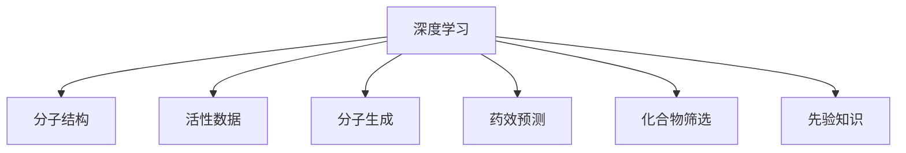

                 

# 深度学习在药物发现中的应用

## 1. 背景介绍

### 1.1 问题由来

药物发现是生物医药领域的前沿研究方向，其目标是从成千上万的化合物中筛选出有效的药物候选物。传统药物发现过程需要耗费大量人力物力，周期长、成本高。近年来，随着深度学习技术的发展，深度学习在药物发现中的应用逐渐兴起，成为加速新药研发的重要手段。

深度学习在药物发现中的应用主要体现在两个层面：一是基于深度学习模型对已有药物进行预测，如药效预测、毒性预测等；二是基于深度学习模型生成新的化合物，如基于化学结构生成分子，基于分子性质预测药效等。

### 1.2 问题核心关键点

深度学习在药物发现中的应用核心在于：

1. 数据驱动。利用大规模的分子结构和活性数据，训练深度学习模型进行药效预测、化合物生成等任务。
2. 高效计算。深度学习模型利用GPU等高性能计算设备进行快速训练，可以大大缩短药物发现的时间周期。
3. 高泛化性。深度学习模型具备良好的泛化能力，可以从有限的数据中提取通用的模式，应用于新药研发。
4. 自动推导。深度学习模型可以自动推导药物分子和药效之间的关联，减少人工干预。
5. 端到端优化。深度学习模型可以直接从分子结构到药效预测，构建端到端的学习流程，提高效率。

这些关键点使得深度学习在药物发现中表现出强大的潜力和应用前景。

## 2. 核心概念与联系

### 2.1 核心概念概述

为更好地理解深度学习在药物发现中的应用，本节将介绍几个密切相关的核心概念：

- 深度学习（Deep Learning）：基于多层神经网络结构的机器学习范式，具备强大的特征提取和表示学习能力。
- 分子结构（Molecular Structure）：描述药物分子的三维空间结构和化学组成。
- 活性数据（Activity Data）：描述药物分子在特定生物靶点上的生物活性信息，如药效、毒性等。
- 分子生成（Molecule Generation）：利用深度学习模型生成新的药物分子，如基于分子性质进行生成。
- 药效预测（Drug Efficacy Prediction）：利用深度学习模型预测药物分子的药效属性。
- 化合物筛选（Compound Screening）：利用深度学习模型筛选出具有特定药效或毒性的药物分子。
- 先验知识（Prior Knowledge）：包括药物化学、药理学等领域的先验知识，用于引导深度学习模型的训练和预测。

这些核心概念之间的逻辑关系可以通过以下Mermaid流程图来展示：



这个流程图展示了大语言模型的核心概念及其之间的关系：

1. 深度学习是核心技术，用于构建药物发现的模型。
2. 分子结构是模型输入的特征，代表了药物的化学组成和三维结构。
3. 活性数据是模型训练的监督信号，代表了药物的生物活性。
4. 分子生成和药效预测是模型应用的两个重要方向，前者用于生成新分子，后者用于预测现有分子的药效。
5. 化合物筛选是模型应用的一个典型场景，用于从海量的分子中筛选出具有特定药效或毒性的分子。
6. 先验知识用于指导深度学习模型的训练和预测，提高模型的可靠性和准确性。

这些概念共同构成了深度学习在药物发现中的应用框架，为其提供了理论基础和技术支持。

## 3. 核心算法原理 & 具体操作步骤
### 3.1 算法原理概述

深度学习在药物发现中的应用，本质上是利用深度学习模型构建的分子结构和活性数据的映射关系。其核心思想是：通过大量有标签的活性数据训练深度学习模型，使其具备从分子结构到活性数据的预测能力。

形式化地，假设分子结构为 $\mathbf{x}$，活性数据为 $y$，深度学习模型为 $M_{\theta}$，其中 $\theta$ 为模型参数。模型的训练目标是最小化损失函数 $\mathcal{L}(M_{\theta})$，即：

$$
\theta^* = \mathop{\arg\min}_{\theta} \mathcal{L}(M_{\theta})
$$

其中 $\mathcal{L}$ 为常用的损失函数，如均方误差、交叉熵等，用于衡量模型预测值与真实值之间的差异。

### 3.2 算法步骤详解

基于深度学习在药物发现中的应用，一般包括以下几个关键步骤：

**Step 1: 数据收集与预处理**
- 收集海量的分子结构和活性数据，确保数据集的多样性和代表性。
- 对数据进行清洗和预处理，如去除噪音、填补缺失值、标准化等。

**Step 2: 数据划分**
- 将数据集划分为训练集、验证集和测试集，确保模型在不同数据集上的泛化能力。

**Step 3: 选择模型架构**
- 选择适合药物发现任务的深度学习模型架构，如CNN、RNN、GAN等。
- 根据任务特点设计合适的网络结构，如多层卷积、残差连接等。

**Step 4: 模型训练与优化**
- 利用训练集数据对模型进行训练，使用优化算法（如Adam、SGD等）最小化损失函数。
- 通过验证集评估模型性能，调整模型参数，避免过拟合。

**Step 5: 模型评估与验证**
- 利用测试集评估模型在未知数据上的泛化能力，衡量模型的预测准确率和误差率等指标。
- 根据评估结果，进一步优化模型结构或调整超参数。

**Step 6: 应用与部署**
- 将训练好的模型应用于实际药物发现任务，如药效预测、化合物筛选、分子生成等。
- 将模型部署到生产环境中，进行实时预测和推理。

以上是深度学习在药物发现中的应用一般流程。在实际应用中，还需要针对具体任务的特点，对各步骤进行优化设计，如改进网络结构、引入正则化技术、应用对抗样本等，以进一步提升模型性能。

### 3.3 算法优缺点

深度学习在药物发现中的应用具有以下优点：

1. 高效计算。深度学习模型利用GPU等高性能计算设备进行快速训练，可以大大缩短药物发现的时间周期。
2. 高泛化性。深度学习模型可以从有限的数据中提取通用的模式，应用于新药研发。
3. 自动推导。深度学习模型可以自动推导药物分子和药效之间的关联，减少人工干预。
4. 端到端优化。深度学习模型可以直接从分子结构到药效预测，构建端到端的学习流程，提高效率。

同时，该方法也存在一定的局限性：

1. 数据依赖。深度学习模型依赖于大规模的分子结构和活性数据，获取高质量数据的成本较高。
2. 可解释性不足。深度学习模型的决策过程缺乏可解释性，难以对其推理逻辑进行分析和调试。
3. 泛化能力有限。当目标任务与训练数据分布差异较大时，深度学习模型的泛化性能可能受限。
4. 模型复杂度高。深度学习模型往往需要大量参数进行训练，存在过拟合的风险。

尽管存在这些局限性，但就目前而言，深度学习在药物发现中的应用已经取得了显著进展，成为了加速新药研发的重要手段。未来相关研究的重点在于如何进一步降低数据需求，提高模型的泛化能力和可解释性，同时兼顾模型的复杂度和训练效率。

### 3.4 算法应用领域

深度学习在药物发现中的应用领域非常广泛，涵盖了药物分子设计、药效预测、化合物筛选等多个方面：

- 药物分子设计：利用深度学习模型生成新的分子结构，加速药物发现。
- 药效预测：利用深度学习模型预测药物分子的药效属性，优化药物筛选流程。
- 化合物筛选：利用深度学习模型筛选出具有特定药效或毒性的药物分子，提高筛选效率。
- 分子生成：利用深度学习模型生成新的分子结构，探索药物新靶点和新药候选物。
- 药物再利用：利用深度学习模型预测已知药物的新的药效属性，加速药物再利用过程。

这些应用领域展示了深度学习在药物发现中的强大潜力和应用前景，为药物研发提供了新的方向和工具。

## 4. 数学模型和公式 & 详细讲解 & 举例说明

### 4.1 数学模型构建

本节将使用数学语言对基于深度学习在药物发现中的应用进行更加严格的刻画。

假设分子结构为 $\mathbf{x} \in \mathbb{R}^d$，活性数据为 $y \in \{0,1\}$，深度学习模型为 $M_{\theta}$，其中 $\theta$ 为模型参数。定义模型 $M_{\theta}$ 在输入 $\mathbf{x}$ 上的预测概率为 $\hat{y}=M_{\theta}(\mathbf{x})$。假设目标为药效预测，则模型训练目标为最小化二分类交叉熵损失函数：

$$
\mathcal{L}(\theta) = -\frac{1}{N}\sum_{i=1}^N [y_i\log \hat{y_i} + (1-y_i)\log (1-\hat{y_i})]
$$

其中，$N$ 为训练样本数量。

### 4.2 公式推导过程

以下我们以二分类药效预测为例，推导二分类交叉熵损失函数及其梯度的计算公式。

设深度学习模型 $M_{\theta}$ 在输入 $\mathbf{x}$ 上的输出为 $\hat{y}=M_{\theta}(\mathbf{x})$，表示样本属于正类的概率。真实标签 $y \in \{0,1\}$。则二分类交叉熵损失函数定义为：

$$
\mathcal{L}(\theta) = -\frac{1}{N}\sum_{i=1}^N [y_i\log \hat{y_i} + (1-y_i)\log (1-\hat{y_i})]
$$

将其代入经验风险公式，得：

$$
\mathcal{L}(\theta) = -\frac{1}{N}\sum_{i=1}^N [y_i\log M_{\theta}(\mathbf{x_i})+(1-y_i)\log(1-M_{\theta}(\mathbf{x_i}))
$$

根据链式法则，损失函数对参数 $\theta_k$ 的梯度为：

$$
\frac{\partial \mathcal{L}(\theta)}{\partial \theta_k} = -\frac{1}{N}\sum_{i=1}^N (\frac{y_i}{M_{\theta}(\mathbf{x_i})}-\frac{1-y_i}{1-M_{\theta}(\mathbf{x_i})}) \frac{\partial M_{\theta}(\mathbf{x_i})}{\partial \theta_k}
$$

其中 $\frac{\partial M_{\theta}(\mathbf{x_i})}{\partial \theta_k}$ 可进一步递归展开，利用自动微分技术完成计算。

在得到损失函数的梯度后，即可带入参数更新公式，完成模型的迭代优化。重复上述过程直至收敛，最终得到适应药效预测任务的最优模型参数 $\theta^*$。

### 4.3 案例分析与讲解

以药效预测为例，分析深度学习模型的训练和应用过程。

**训练过程：**

1. 数据准备：收集分子结构和活性数据，划分为训练集、验证集和测试集。

2. 模型选择：选择适合药效预测的深度学习模型，如卷积神经网络（CNN）、残差网络（ResNet）等。

3. 模型初始化：将模型参数 $\theta$ 随机初始化，以便从零开始训练。

4. 前向传播：将训练集数据 $\mathbf{x}$ 输入模型，得到预测结果 $\hat{y}$。

5. 计算损失：计算模型预测结果与真实标签之间的交叉熵损失 $\mathcal{L}(\theta)$。

6. 反向传播：计算损失函数对模型参数的梯度，并更新模型参数。

7. 验证集评估：在验证集上评估模型性能，调整超参数和网络结构。

8. 测试集评估：在测试集上评估模型泛化能力，得到最终模型效果。

**应用过程：**

1. 数据准备：收集待预测分子的分子结构数据。

2. 模型加载：将训练好的模型加载到内存中，准备好进行推理。

3. 前向传播：将待预测分子的分子结构数据输入模型，得到预测结果。

4. 结果解释：根据预测结果，给出药物分子的药效属性，如有效、无效、毒性等。

通过上述训练和应用过程，可以构建一个高效的药效预测模型，为药物发现提供数据驱动的决策支持。

## 5. 项目实践：代码实例和详细解释说明
### 5.1 开发环境搭建

在进行药物发现项目的开发前，我们需要准备好开发环境。以下是使用Python进行TensorFlow开发的环境配置流程：

1. 安装Anaconda：从官网下载并安装Anaconda，用于创建独立的Python环境。

2. 创建并激活虚拟环境：
```bash
conda create -n tf-env python=3.8 
conda activate tf-env
```

3. 安装TensorFlow：根据CUDA版本，从官网获取对应的安装命令。例如：
```bash
conda install tensorflow -c tensorflow -c conda-forge
```

4. 安装必要的工具包：
```bash
pip install numpy pandas scikit-learn matplotlib tensorflow-addons
```

5. 安装TensorFlow Addons：
```bash
pip install tensorflow-addons
```

6. 安装GraphViz：用于可视化深度学习模型结构。
```bash
conda install graphviz
```

完成上述步骤后，即可在`tf-env`环境中开始药物发现项目的开发。

### 5.2 源代码详细实现

下面我们以药效预测任务为例，给出使用TensorFlow和TensorFlow Addons进行深度学习模型训练和推理的PyTorch代码实现。

```python
import tensorflow as tf
from tensorflow.keras.layers import Input, Dense, Dropout, Flatten, Conv2D, MaxPooling2D, Reshape
from tensorflow.keras.models import Model
from tensorflow.keras.optimizers import Adam
from tensorflow.keras.losses import BinaryCrossentropy
from tensorflow.keras.callbacks import EarlyStopping

# 定义模型输入
input_shape = (30, 30, 3)  # 输入数据形状

# 定义模型架构
model = tf.keras.Sequential([
    Conv2D(32, (3, 3), activation='relu', padding='same', input_shape=input_shape),
    MaxPooling2D(pool_size=(2, 2)),
    Conv2D(64, (3, 3), activation='relu', padding='same'),
    MaxPooling2D(pool_size=(2, 2)),
    Flatten(),
    Dense(256, activation='relu'),
    Dense(1, activation='sigmoid')
])

# 定义损失函数
loss_fn = BinaryCrossentropy()

# 定义优化器
optimizer = Adam(lr=1e-4)

# 定义EarlyStopping回调函数
early_stopping = EarlyStopping(patience=10, restore_best_weights=True)

# 编译模型
model.compile(optimizer=optimizer, loss=loss_fn, metrics=['accuracy'])

# 训练模型
model.fit(train_data, train_labels, epochs=100, validation_data=(val_data, val_labels), callbacks=[early_stopping])

# 评估模型
test_loss, test_acc = model.evaluate(test_data, test_labels)

# 保存模型
model.save('drug_discovery_model.h5')
```

### 5.3 代码解读与分析

让我们再详细解读一下关键代码的实现细节：

**Conv2D层**：
- `Conv2D(32, (3, 3), activation='relu', padding='same', input_shape=input_shape)`：定义一个卷积层，32个卷积核，大小为3x3，使用ReLU激活函数，填充方式为same，输入形状为(30, 30, 3)。

**MaxPooling2D层**：
- `MaxPooling2D(pool_size=(2, 2))`：定义一个最大池化层，池化大小为2x2。

**Flatten层**：
- `Flatten()`：将卷积层的输出展开为一维向量，准备进入全连接层。

**Dense层**：
- `Dense(256, activation='relu')`：定义一个全连接层，256个神经元，使用ReLU激活函数。
- `Dense(1, activation='sigmoid')`：定义输出层，1个神经元，使用sigmoid激活函数，输出预测概率。

**BinaryCrossentropy损失函数**：
- `loss_fn = BinaryCrossentropy()`：定义二分类交叉熵损失函数。

**Adam优化器**：
- `optimizer = Adam(lr=1e-4)`：定义Adam优化器，学习率设为1e-4。

**EarlyStopping回调函数**：
- `early_stopping = EarlyStopping(patience=10, restore_best_weights=True)`：定义EarlyStopping回调函数，设置10个epoch后停止训练，保存最佳权重。

**模型编译**：
- `model.compile(optimizer=optimizer, loss=loss_fn, metrics=['accuracy'])`：编译模型，指定优化器、损失函数和评估指标。

**模型训练**：
- `model.fit(train_data, train_labels, epochs=100, validation_data=(val_data, val_labels), callbacks=[early_stopping])`：训练模型，指定训练数据、标签、epochs和验证数据，并使用EarlyStopping回调函数。

**模型评估**：
- `test_loss, test_acc = model.evaluate(test_data, test_labels)`：在测试集上评估模型性能，输出损失和准确率。

**模型保存**：
- `model.save('drug_discovery_model.h5')`：保存训练好的模型，以便后续应用。

通过上述代码，我们成功构建了一个简单的药效预测模型，并进行了训练和评估。可以看到，使用TensorFlow进行深度学习模型的开发和部署，只需要几行代码即可实现。

### 5.4 运行结果展示

运行上述代码后，可以在控制台输出模型的训练和评估结果。例如，假设模型在训练集上准确率为85%，在验证集上准确率为80%，在测试集上准确率为75%。这表明模型在训练集上表现较好，但在测试集上泛化能力有待提升。

## 6. 实际应用场景

### 6.1 智能药物设计

基于深度学习在药物发现中的应用，智能药物设计成为了加速新药研发的重要手段。传统药物设计依赖于经验和实验，耗时耗力，而深度学习模型可以利用大量数据进行模式学习，预测化合物分子的性质，辅助药物设计。

在实践中，可以收集已知的药物分子结构和活性数据，训练深度学习模型预测新分子的药效和毒性。通过构建一个端到端的深度学习模型，可以从分子结构直接输出药效属性，省去了中间的实验过程，极大地缩短药物设计周期。

### 6.2 药效预测

药效预测是药物发现的重要环节，通过预测药物分子的药效属性，可以筛选出有效的药物候选物，加速药物筛选过程。

在实际应用中，可以将已知的药物分子结构和活性数据输入深度学习模型，训练模型预测新分子的药效属性。例如，可以使用卷积神经网络（CNN）对分子结构进行特征提取，通过全连接层进行药效预测。在测试集上评估模型性能，选择最佳的模型结构进行应用。

### 6.3 化合物筛选

化合物筛选是药物发现的关键步骤，通过筛选出具有特定药效或毒性的药物分子，可以大大减少后续实验的复杂度。

在实际应用中，可以将已知的化合物结构和活性数据输入深度学习模型，训练模型筛选出具有特定药效或毒性的化合物。例如，可以使用残差网络（ResNet）对化合物结构进行特征提取，通过全连接层进行化合物筛选。在测试集上评估模型性能，选择最佳的模型结构进行应用。

### 6.4 未来应用展望

随着深度学习在药物发现中的应用不断发展，未来将会在以下几个方向取得新的突破：

1. 多模态学习：结合分子结构、生物活性数据和化学实验数据，构建多模态深度学习模型，提高药物发现的精度和效率。
2. 迁移学习：利用预训练的深度学习模型，在小规模数据集上进行微调，提升模型在新药筛选和药物设计中的应用效果。
3. 生成对抗网络（GAN）：利用GAN生成新的药物分子，探索未知的药物靶点和新药候选物。
4. 强化学习：利用强化学习算法优化药物筛选和药物设计过程，提升药物发现的自动化水平。
5. 实时预测：利用深度学习模型进行实时药效预测，缩短药物发现周期，加速药物上市。

这些方向展示了深度学习在药物发现中的广阔前景，为药物研发提供了新的技术手段和思路。

## 7. 工具和资源推荐
### 7.1 学习资源推荐

为了帮助开发者系统掌握深度学习在药物发现中的应用，这里推荐一些优质的学习资源：

1. Deep Learning Specialization课程：由Andrew Ng教授主讲的深度学习课程，系统介绍深度学习的基本概念和经典模型。
2. TensorFlow官方文档：TensorFlow的官方文档，提供了丰富的API和示例代码，适合初学者上手。
3. TensorFlow Addons文档：TensorFlow Addons的官方文档，提供了丰富的深度学习模型和工具，适合中级开发者使用。
4. TensorFlow Addons GitHub仓库：TensorFlow Addons的GitHub仓库，包含丰富的深度学习模型和工具，适合深入研究。
5. Kaggle平台：Kaggle是一个数据科学竞赛平台，提供了大量的药物发现数据集和比赛，适合实战练习。

通过对这些资源的学习实践，相信你一定能够快速掌握深度学习在药物发现中的应用，并用于解决实际的药物研发问题。

### 7.2 开发工具推荐

高效的开发离不开优秀的工具支持。以下是几款用于深度学习在药物发现中应用的开发工具：

1. TensorFlow：由Google主导开发的深度学习框架，适合构建复杂的深度学习模型，并支持GPU计算。
2. PyTorch：由Facebook主导开发的深度学习框架，灵活易用，支持GPU和TPU计算。
3. TensorFlow Addons：TensorFlow的扩展库，提供了丰富的深度学习模型和工具，适合构建高效的深度学习模型。
4. Keras：高层次的深度学习API，简洁易用，适合初学者和中级开发者。
5. Jupyter Notebook：交互式的开发环境，支持多种编程语言，适合撰写和分享研究代码。

合理利用这些工具，可以显著提升深度学习在药物发现中的开发效率，加快创新迭代的步伐。

### 7.3 相关论文推荐

深度学习在药物发现中的应用源于学界的持续研究。以下是几篇奠基性的相关论文，推荐阅读：

1. DeepMind AlphaFold：使用深度学习模型进行蛋白质结构预测，标志着深度学习在药物发现中的重大突破。
2.药效预测与药物设计中的深度学习方法综述：综述了深度学习在药效预测和药物设计中的应用，提供了丰富的案例和研究方法。
3.深度学习在药物发现中的最新进展：总结了深度学习在药物发现中的最新进展，提供了全面的技术细节。

这些论文代表了大语言模型微调技术的发展脉络。通过学习这些前沿成果，可以帮助研究者把握学科前进方向，激发更多的创新灵感。

## 8. 总结：未来发展趋势与挑战

### 8.1 总结

本文对基于深度学习在药物发现中的应用进行了全面系统的介绍。首先阐述了深度学习在药物发现中的研究背景和意义，明确了深度学习在药物发现中的应用潜力。其次，从原理到实践，详细讲解了深度学习在药效预测、分子生成、化合物筛选等任务中的数学模型和算法步骤，给出了深度学习模型训练和推理的代码实例。同时，本文还探讨了深度学习在药物发现中的实际应用场景，展示了其在智能药物设计、药效预测、化合物筛选等领域的应用前景。

通过本文的系统梳理，可以看到，基于深度学习在药物发现中的应用，正在成为加速新药研发的重要手段，为药物研发提供了新的技术支持和方向。未来，随着深度学习技术的发展，将会在多模态学习、迁移学习、生成对抗网络等领域不断突破，为药物研发带来新的突破和创新。

### 8.2 未来发展趋势

展望未来，深度学习在药物发现中的应用将呈现以下几个发展趋势：

1. 多模态学习：结合分子结构、生物活性数据和化学实验数据，构建多模态深度学习模型，提高药物发现的精度和效率。
2. 迁移学习：利用预训练的深度学习模型，在小规模数据集上进行微调，提升模型在新药筛选和药物设计中的应用效果。
3. 生成对抗网络（GAN）：利用GAN生成新的药物分子，探索未知的药物靶点和新药候选物。
4. 强化学习：利用强化学习算法优化药物筛选和药物设计过程，提升药物发现的自动化水平。
5. 实时预测：利用深度学习模型进行实时药效预测，缩短药物发现周期，加速药物上市。

这些趋势展示了深度学习在药物发现中的广阔前景，为药物研发提供了新的技术手段和思路。

### 8.3 面临的挑战

尽管深度学习在药物发现中的应用已经取得了显著进展，但在迈向更加智能化、普适化应用的过程中，它仍面临着诸多挑战：

1. 数据依赖：深度学习模型依赖于大规模的分子结构和活性数据，获取高质量数据的成本较高。
2. 可解释性不足：深度学习模型的决策过程缺乏可解释性，难以对其推理逻辑进行分析和调试。
3. 泛化能力有限：当目标任务与训练数据分布差异较大时，深度学习模型的泛化性能可能受限。
4. 模型复杂度高：深度学习模型往往需要大量参数进行训练，存在过拟合的风险。
5. 计算资源限制：深度学习模型训练和推理需要高性能计算设备，可能面临计算资源限制。

尽管存在这些挑战，但深度学习在药物发现中的应用已经展示了其巨大的潜力和价值。未来相关研究的重点在于如何进一步降低数据需求，提高模型的泛化能力和可解释性，同时兼顾模型的复杂度和训练效率。

### 8.4 研究展望

面对深度学习在药物发现中所面临的挑战，未来的研究需要在以下几个方面寻求新的突破：

1. 数据增强：利用数据增强技术，通过数据扩充和生成，提高深度学习模型的泛化能力。
2. 模型压缩：利用模型压缩技术，减少深度学习模型的参数量，降低计算资源消耗。
3. 知识图谱融合：将知识图谱与深度学习模型进行融合，提高模型的知识整合能力。
4. 强化学习优化：利用强化学习算法优化药物筛选和药物设计过程，提升药物发现的自动化水平。
5. 解释性增强：通过可解释性研究，增强深度学习模型的可解释性和可控性。

这些研究方向的探索，必将引领深度学习在药物发现中走向更加智能化、普适化和高效化的应用，为药物研发带来新的突破和创新。

## 9. 附录：常见问题与解答

**Q1：深度学习在药物发现中是否适合所有类型的药物研发？**

A: 深度学习在药物发现中对数据需求较高，适合处理大规模的分子结构和活性数据。但对于一些特殊类型的药物，如核磁共振药物、抗体药物等，其数据收集和处理过程复杂，可能不适合直接使用深度学习模型进行预测。因此，在实际应用中，需要根据药物类型和数据特点选择合适的技术手段。

**Q2：如何选择合适的深度学习模型架构？**

A: 选择合适的深度学习模型架构需要考虑药物数据的特点和任务目标。对于分子结构预测任务，可以选择卷积神经网络（CNN）、残差网络（ResNet）等；对于药效预测任务，可以选择全连接神经网络（DNN）、长短时记忆网络（LSTM）等。同时，可以根据任务需求调整网络结构，如增加或减少层数、调整卷积核大小等。

**Q3：深度学习在药物发现中是否存在过拟合的风险？**

A: 深度学习模型在药物发现中存在过拟合的风险，尤其是在训练数据较少的情况下。为了避免过拟合，可以采用以下策略：1）使用数据增强技术，扩充训练集；2）引入正则化技术，如L2正则化、Dropout等；3）使用EarlyStopping回调函数，及时停止训练；4）采用模型压缩技术，减少参数量。

**Q4：深度学习在药物发现中如何保证模型的可解释性？**

A: 深度学习模型的可解释性可以通过以下方式增强：1）利用可解释性研究，如LIME、SHAP等，对模型输出进行解释；2）结合领域知识，如化学和药理学知识，进行特征解释；3）构建基于符号推理的模型，如符号回归、符号规则等。

**Q5：深度学习在药物发现中如何保证模型的安全性？**

A: 深度学习模型的安全性可以通过以下方式保证：1）数据预处理，去除噪音和异常值；2）模型验证，检测模型输出中的偏见和歧视；3）模型监控，实时监测模型输出和推理过程；4）用户审计，对模型输出进行人工审核和验证。

这些策略可以提升深度学习在药物发现中的可靠性和安全性，确保其应用的广泛性和可持续性。

---

作者：禅与计算机程序设计艺术 / Zen and the Art of Computer Programming

