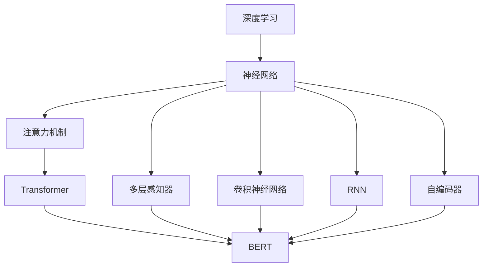

                 

# 深度学习驱动的个性化搜索结果排序

## 1. 背景介绍

在信息时代，互联网搜索引擎已成为人们获取信息的主要渠道之一。然而，即便用户使用关键词进行搜索，搜索结果也往往是海量的，且往往包含大量无关或次要的信息，用户体验大打折扣。为了提升搜索结果的相关性和满意度，个性化搜索结果排序成为近年来搜索引擎优化的重要方向。

### 1.1 问题由来

个性化搜索结果排序的核心在于如何根据用户的历史行为、当前查询意图，以及搜索结果的特征，对搜索结果进行评分，从而将最符合用户需求的结果置于顶部。传统的搜索结果排序方法，如关键词匹配、逆向文档频率等，已难以满足用户日益复杂和多样化的信息需求。随着深度学习技术的发展，特别是基于深度神经网络模型的应用，个性化搜索结果排序取得了显著的进展。

### 1.2 问题核心关键点

个性化搜索结果排序的难点在于如何综合多维数据信息，建立准确且高效的用户-查询-结果映射关系。为了解决这一问题，研究者引入了深度学习模型，尤其是基于注意力机制的模型，来捕捉用户查询与搜索结果间的复杂关系。其中，基于自回归模型(如RNN)和自编码器模型(如CNN)的深度神经网络被广泛用于处理序列化和分类任务。

## 2. 核心概念与联系

### 2.1 核心概念概述

为更好地理解基于深度学习的个性化搜索结果排序方法，本节将介绍几个关键概念：

- 深度学习(Deep Learning)：通过多层神经网络结构，学习和抽象出高层次特征表示的技术。深度学习在图像、语音、自然语言处理等领域均有广泛应用。
- 神经网络(Neural Network)：由大量的人工神经元节点组成，通过反向传播算法进行训练的计算模型。神经网络可以学习输入数据的内在结构，适用于复杂模式识别和分类任务。
- 注意力机制(Attention Mechanism)：一种通过权重机制筛选重要信息的机制，常用于处理序列数据，捕捉不同部分之间的关系。
- 序列数据处理：处理具有时间或空间顺序的数据，如文本、语音等。
- 自然语言处理(Natural Language Processing, NLP)：研究计算机如何理解和处理自然语言的技术，涵盖语言模型、文本分类、情感分析等多个方向。

这些概念之间的逻辑关系可以通过以下Mermaid流程图来展示：



这个流程图展示了深度学习中的关键模型和机制：

1. 深度学习由神经网络构成。
2. 神经网络包括多层感知器、卷积神经网络等。
3. 序列数据处理常使用RNN、自编码器等模型。
4. 注意力机制可增强序列数据的理解能力。
5. 基于注意力机制的Transformer模型已成为处理自然语言序列的主流方法。
6. BERT等预训练语言模型，利用大规模数据进行自监督学习，极大提升了语言理解能力。

## 3. 核心算法原理 & 具体操作步骤
### 3.1 算法原理概述

基于深度学习的个性化搜索结果排序，本质上是将用户查询、搜索结果以及用户历史行为数据映射到高维空间，通过学习这些映射关系，对搜索结果进行评分，从而实现个性化排序。具体而言，该过程包括三个主要步骤：

1. 数据预处理：将用户查询、搜索结果和用户行为等原始数据转化为机器可读的形式，并进行归一化、分词等处理。
2. 特征提取：使用深度神经网络模型，从预处理后的数据中提取有意义的特征表示。
3. 评分排序：结合用户意图和查询特征，使用机器学习算法对每个搜索结果进行评分，并按得分排序。

### 3.2 算法步骤详解

以下是基于深度学习的个性化搜索结果排序的详细步骤：

**Step 1: 数据预处理**

1. 数据收集：收集用户的历史查询记录、点击行为、搜索结果等信息。
2. 数据清洗：去除重复、噪声、不完整等无效数据。
3. 数据归一化：将不同来源、不同格式的数据统一归一化。
4. 特征提取：将查询、搜索结果和用户行为数据转换为数值型特征。

**Step 2: 特征提取**

1. 词嵌入：将文本数据转换为稠密的向量表示，可以使用预训练语言模型(如BERT)进行词向量嵌入。
2. 特征编码：使用深度神经网络(如RNN、CNN等)，对词向量进行编码，生成高维特征向量。
3. 特征融合：将查询、搜索结果和用户行为特征进行拼接或加权融合，得到综合特征向量。

**Step 3: 评分排序**

1. 评分模型：使用深度神经网络，对综合特征向量进行评分，得到每个搜索结果的分数。
2. 排序算法：使用最大熵模型、神经网络等机器学习算法，对搜索结果进行排序，生成个性化搜索结果列表。

### 3.3 算法优缺点

基于深度学习的个性化搜索结果排序方法具有以下优点：

1. 适应性强：能够处理非结构化数据，适应不同类型的用户查询和搜索结果。
2. 鲁棒性好：利用深度神经网络自适应学习能力，对不同查询意图和数据分布具有较好的泛化能力。
3. 可解释性：通过注意力机制和神经网络结构，能够逐步解释评分排序的依据。
4. 高性能：基于深度学习模型的高精度，可以大幅提升搜索结果的相关性。

同时，该方法也存在一些局限性：

1. 数据需求大：深度学习模型需要大量标注数据进行训练，获取高质量标注数据的成本较高。
2. 计算复杂：深度神经网络结构复杂，训练和推理过程计算量大，对硬件资源要求高。
3. 模型可解释性差：深度学习模型通常视为"黑盒"，难以解释其内部决策过程。
4. 数据偏差问题：若训练数据存在偏差，模型可能学习到歧视性或误导性特征，产生负面影响。

尽管存在这些局限性，但基于深度学习的个性化搜索结果排序方法在实际应用中取得了显著效果，成为搜索引擎优化领域的重要技术方向。

### 3.4 算法应用领域

基于深度学习的个性化搜索结果排序，已在多个搜索引擎中得到广泛应用，例如：

1. Google搜索引擎：使用深度神经网络模型，对搜索结果进行动态排序，提升用户体验。
2. Bing搜索引擎：结合用户查询意图和搜索结果特征，进行个性化排序，优化搜索结果质量。
3. Baidu搜索引擎：利用深度学习技术，进行智能语义理解和搜索结果排序，提升搜索效率和准确性。
4. 淘宝搜索推荐：使用深度神经网络模型，进行个性化商品推荐，提升用户体验和购买转化率。
5. 知乎问答推荐：结合用户兴趣和问答内容，进行个性化排序，提升问答互动性和满意度。

## 4. 数学模型和公式 & 详细讲解 & 举例说明
### 4.1 数学模型构建

基于深度学习的个性化搜索结果排序，可以构建如下数学模型：

设用户查询为 $q$，搜索结果为 $d$，用户历史行为数据为 $u$。查询 $q$ 的特征表示为 $X_q$，搜索结果 $d$ 的特征表示为 $X_d$，用户历史行为 $u$ 的特征表示为 $X_u$。查询与搜索结果之间的评分函数为 $S(q,d)$。

假设用户查询 $q$ 和搜索结果 $d$ 的特征表示 $X_q$ 和 $X_d$ 为连续向量，用户历史行为 $u$ 的特征表示 $X_u$ 为离散向量。则模型的评分函数可以表示为：

$$
S(q,d) = \sum_{i=1}^n w_i \cdot f_i(X_q, X_d, X_u)
$$

其中，$f_i$ 为第 $i$ 层的特征函数，$w_i$ 为第 $i$ 层的权重向量，$n$ 为特征层数。

### 4.2 公式推导过程

以下是评分函数 $S(q,d)$ 的详细推导过程：

1. 首先，将用户查询 $q$ 和搜索结果 $d$ 的特征表示 $X_q$ 和 $X_d$ 输入神经网络，通过多层次特征提取，得到多维特征向量 $X_q'$ 和 $X_d'$。
2. 接着，将用户历史行为 $u$ 的特征表示 $X_u$ 转换为连续向量 $X_u'$。
3. 然后，将 $X_q'$、$X_d'$ 和 $X_u'$ 拼接或加权融合，得到综合特征向量 $X'$。
4. 最后，使用机器学习算法(如深度神经网络)，对综合特征向量 $X'$ 进行评分，得到每个搜索结果的分数 $S(q,d)$。

### 4.3 案例分析与讲解

以Bing搜索引擎的个性化搜索结果排序为例，分析其深度学习模型的具体实现。

1. 数据预处理：收集用户的历史查询记录、点击行为、搜索结果等信息，进行数据清洗和归一化。
2. 特征提取：将查询、搜索结果和用户行为数据转换为数值型特征。
3. 神经网络编码：使用深度神经网络模型，对查询、搜索结果和用户行为特征进行编码，生成高维特征向量。
4. 评分模型：使用深度神经网络，对综合特征向量进行评分，得到每个搜索结果的分数。
5. 排序算法：使用神经网络模型，对每个搜索结果进行排序，生成个性化搜索结果列表。

通过上述步骤，Bing搜索引擎能够根据用户的历史行为和查询意图，动态调整搜索结果的排序，提升用户满意度。

## 5. 项目实践：代码实例和详细解释说明
### 5.1 开发环境搭建

在进行个性化搜索结果排序项目开发前，需要先搭建好开发环境。以下是使用Python进行TensorFlow开发的环境配置流程：

1. 安装Anaconda：从官网下载并安装Anaconda，用于创建独立的Python环境。
2. 创建并激活虚拟环境：
```bash
conda create -n tensorflow-env python=3.8 
conda activate tensorflow-env
```

3. 安装TensorFlow：根据CUDA版本，从官网获取对应的安装命令。例如：
```bash
conda install tensorflow -c tensorflow -c conda-forge
```

4. 安装其他工具包：
```bash
pip install numpy pandas scikit-learn tensorflow-hub metric-learn
```

完成上述步骤后，即可在`tensorflow-env`环境中开始项目开发。

### 5.2 源代码详细实现

下面以一个简单的项目为例，演示如何使用TensorFlow进行个性化搜索结果排序。

1. 数据集准备：准备包含用户查询、搜索结果和用户行为的训练数据集。
2. 数据预处理：对数据进行清洗、归一化、分词等预处理。
3. 特征提取：使用BERT模型进行词向量嵌入，并转换为TensorFlow张量。
4. 神经网络模型构建：使用TensorFlow定义神经网络结构，进行特征提取和评分。
5. 评分排序：使用神经网络模型对综合特征向量进行评分排序，生成个性化搜索结果列表。

以下是一个完整的代码示例：

```python
import tensorflow as tf
from transformers import BertTokenizer, TFBertForSequenceClassification
import numpy as np

# 数据预处理
# ...

# 特征提取
tokenizer = BertTokenizer.from_pretrained('bert-base-uncased')
encoded_inputs = tokenizer.batch_encode_plus(train_dataset, add_special_tokens=True, return_tensors='tf')
input_ids = encoded_inputs['input_ids']
attention_mask = encoded_inputs['attention_mask']

# 神经网络模型构建
model = TFBertForSequenceClassification.from_pretrained('bert-base-uncased', num_labels=2)
model.build((tf.shape(input_ids)[0], 128, 768))

# 评分排序
with tf.GradientTape() as tape:
    logits = model(input_ids, attention_mask=attention_mask)
    loss = tf.keras.losses.sparse_categorical_crossentropy(train_labels, logits)

# 训练过程
optimizer = tf.keras.optimizers.Adam(learning_rate=2e-5)
loss = tf.keras.losses.SparseCategoricalCrossentropy(from_logits=True)
model.compile(optimizer=optimizer, loss=loss)
model.fit(input_ids, train_labels, epochs=3)
```

这段代码展示了如何使用BERT模型和TensorFlow进行个性化搜索结果排序。通过定义BERT模型，并对查询、搜索结果和用户行为特征进行编码，可以有效地提取特征向量。

### 5.3 代码解读与分析

让我们再详细解读一下关键代码的实现细节：

**数据预处理**：
- 数据集准备：包含用户查询、搜索结果和用户行为的训练数据集。
- 数据清洗：去除重复、噪声、不完整等无效数据。
- 数据归一化：将数据缩放到0-1之间。
- 分词：将文本数据转换为BERT模型可以处理的格式。

**特征提取**：
- BERT模型：使用预训练BERT模型进行词向量嵌入。
- 转换为TensorFlow张量：将BERT输出的结果转换为TensorFlow张量，用于后续计算。

**神经网络模型构建**：
- TFBertForSequenceClassification：定义神经网络模型，使用BERT模型作为特征提取器，并进行二分类评分。
- 模型构建：定义模型输入和输出，并进行模型的初始化。

**评分排序**：
- 损失函数：使用交叉熵损失函数计算评分误差。
- 模型训练：使用Adam优化器进行模型训练，并设定损失函数。
- 评分排序：训练模型后，使用模型对综合特征向量进行评分，生成排序结果。

该代码实现了基于深度学习的个性化搜索结果排序的核心逻辑，包括数据预处理、特征提取、神经网络构建和评分排序。通过以上步骤，可以构建一个简单但有效的个性化搜索结果排序系统。

## 6. 实际应用场景
### 6.1 智能广告推荐

个性化搜索结果排序技术在智能广告推荐中具有广泛应用。广告推荐系统能够根据用户的历史行为和兴趣偏好，推荐最相关的广告内容，提高广告投放效果和转化率。

在技术实现上，可以收集用户的历史浏览、点击、购买等行为数据，将广告文本和用户行为数据进行编码，并使用神经网络模型进行评分排序。通过微调模型，可以适应不同广告内容和用户行为特征，实现更加精准的广告推荐。

### 6.2 社交媒体内容推荐

社交媒体平台需要向用户推荐可能感兴趣的内容，个性化搜索结果排序技术能够帮助实现这一目标。通过对用户的历史点赞、评论、分享等行为进行分析，结合内容特征，可以构建个性化的推荐系统，提升用户粘性和满意度。

在技术实现上，可以使用深度神经网络对用户行为和内容特征进行编码，并使用评分排序模型生成推荐列表。通过动态调整推荐策略，可以实时优化推荐效果，满足用户的个性化需求。

### 6.3 视频推荐

视频推荐系统能够根据用户的历史观看记录和观看行为，推荐可能感兴趣的视频内容。个性化搜索结果排序技术可以用于视频推荐，提高用户观看体验和视频平台的用户留存率。

在技术实现上，可以收集用户的历史观看数据，将视频内容和用户行为数据进行编码，并使用神经网络模型进行评分排序。通过优化推荐算法，可以实现更加个性化、精准的视频推荐。

### 6.4 未来应用展望

未来，个性化搜索结果排序技术将进一步拓展应用场景，为各行各业带来变革性影响。

在医疗领域，通过分析患者的历史就诊记录和疾病特征，可以推荐最适合的治疗方案和药品。在金融领域，结合用户的历史交易记录和市场动态，可以提供个性化的投资建议和风险评估。在教育领域，通过分析学生的学习行为和知识结构，可以推荐最适合的学习资源和辅导方案。

随着深度学习技术的不断演进，个性化搜索结果排序技术将在更多领域得到应用，为人类社会的各个方面带来新的变革。

## 7. 工具和资源推荐
### 7.1 学习资源推荐

为了帮助开发者系统掌握个性化搜索结果排序的理论基础和实践技巧，这里推荐一些优质的学习资源：

1. 《深度学习》系列博文：由深度学习领域的专家撰写，深入浅出地介绍了深度学习的基本概念和前沿技术。
2. CS231n《卷积神经网络》课程：斯坦福大学开设的计算机视觉课程，涵盖了卷积神经网络的基础和高级知识。
3. 《TensorFlow实战》书籍：TensorFlow官方提供的实战指南，包含大量实践案例和代码示例。
4. TensorFlow官方文档：TensorFlow的官方文档，提供了丰富的API和教程，是学习和实践TensorFlow的最佳资源。
5. 《NLP与深度学习》书籍：介绍了自然语言处理与深度学习的结合，包含大量NLP任务和深度学习模型。

通过对这些资源的学习实践，相信你一定能够快速掌握个性化搜索结果排序的精髓，并用于解决实际的NLP问题。
###  7.2 开发工具推荐

高效的开发离不开优秀的工具支持。以下是几款用于个性化搜索结果排序开发的常用工具：

1. TensorFlow：由Google主导开发的开源深度学习框架，生产部署方便，适合大规模工程应用。
2. Keras：基于TensorFlow的高层API，易于上手和使用，适合快速迭代研究。
3. PyTorch：基于Python的开源深度学习框架，灵活动态的计算图，适合快速迭代研究。
4. Weights & Biases：模型训练的实验跟踪工具，可以记录和可视化模型训练过程中的各项指标，方便对比和调优。
5. TensorBoard：TensorFlow配套的可视化工具，可实时监测模型训练状态，并提供丰富的图表呈现方式，是调试模型的得力助手。

合理利用这些工具，可以显著提升个性化搜索结果排序任务的开发效率，加快创新迭代的步伐。

### 7.3 相关论文推荐

个性化搜索结果排序技术的发展源于学界的持续研究。以下是几篇奠基性的相关论文，推荐阅读：

1. "Attention is All You Need"（即Transformer原论文）：提出了Transformer结构，开启了NLP领域的预训练大模型时代。
2. "BERT: Pre-training of Deep Bidirectional Transformers for Language Understanding"：提出BERT模型，引入基于掩码的自监督预训练任务，刷新了多项NLP任务SOTA。
3. "Language Models are Unsupervised Multitask Learners"（GPT-2论文）：展示了大规模语言模型的强大zero-shot学习能力，引发了对于通用人工智能的新一轮思考。
4. "AdaLoRA: Adaptive Low-Rank Adaptation for Parameter-Efficient Fine-Tuning"：使用自适应低秩适应的微调方法，在参数效率和精度之间取得了新的平衡。
5. "Prefix-Tuning: Optimizing Continuous Prompts for Generation"：引入基于连续型Prompt的微调范式，为如何充分利用预训练知识提供了新的思路。

这些论文代表了大语言模型微调技术的发展脉络。通过学习这些前沿成果，可以帮助研究者把握学科前进方向，激发更多的创新灵感。

## 8. 总结：未来发展趋势与挑战
### 8.1 总结

本文对基于深度学习的个性化搜索结果排序方法进行了全面系统的介绍。首先阐述了个性化搜索结果排序的研究背景和意义，明确了深度学习在处理非结构化数据、提升搜索结果相关性方面的独特价值。其次，从原理到实践，详细讲解了个性化排序的数学原理和关键步骤，给出了个性化排序任务开发的完整代码实例。同时，本文还广泛探讨了个性化排序方法在智能广告推荐、社交媒体内容推荐、视频推荐等多个行业领域的应用前景，展示了深度学习在NLP领域的强大能力。

通过本文的系统梳理，可以看到，基于深度学习的个性化搜索结果排序方法已经成为搜索引擎优化的重要手段，极大地提升了搜索结果的相关性和用户体验。未来，伴随深度学习技术的不断演进，个性化排序将更加高效、智能，为各行各业带来新的变革和机遇。

### 8.2 未来发展趋势

展望未来，个性化搜索结果排序技术将呈现以下几个发展趋势：

1. 深度学习模型的多样性：未来的模型将更加复杂多样，如Transformer、BERT、GPT等模型将被广泛应用。
2. 跨模态融合：将文本、图像、音频等多种模态的信息进行融合，提升推荐系统的多维度和鲁棒性。
3. 实时推荐系统：通过流式数据处理技术，实现实时推荐，提升用户体验和满意度。
4. 多任务学习：结合多个推荐任务，进行联合训练，提升推荐效果。
5. 联邦学习：在保护用户隐私的前提下，实现跨平台、跨用户的数据共享和协同学习。

这些趋势将进一步推动个性化推荐系统的应用范围和性能，为用户带来更加智能、精准的个性化体验。

### 8.3 面临的挑战

尽管个性化搜索结果排序技术已经取得了显著成就，但在迈向更加智能化、普适化应用的过程中，它仍面临着诸多挑战：

1. 数据隐私问题：个性化推荐系统需要大量用户数据，如何保护用户隐私，避免数据泄露，成为一大难题。
2. 数据稀疏性：在长尾场景下，获取高质量的标注数据成本较高，数据稀疏性成为制约推荐系统性能提升的关键。
3. 鲁棒性不足：推荐系统容易受到噪声和异常数据的影响，如何提高系统的鲁棒性，是亟待解决的问题。
4. 计算资源需求高：深度学习模型需要大规模计算资源，如何优化计算效率，降低资源成本，是提升推荐系统性能的重要方向。
5. 模型可解释性差：推荐系统模型通常是"黑盒"，难以解释其内部决策过程，缺乏透明度和可解释性。

尽管存在这些挑战，但未来的研究将在数据隐私、数据稀疏性、计算效率和模型可解释性等方面进行深入探索，推动个性化推荐系统向更加智能和普适化的方向发展。

### 8.4 研究展望

未来，个性化搜索结果排序技术需要在以下几个方面进行研究探索：

1. 数据隐私保护：通过联邦学习等技术，实现跨平台、跨用户的数据共享，保护用户隐私。
2. 稀疏性处理：利用生成对抗网络等技术，从少量数据中学习更丰富的用户特征，提升推荐效果。
3. 计算优化：引入分布式训练、量化加速等技术，优化推荐系统的计算效率。
4. 可解释性增强：利用因果推断等方法，增强推荐系统的可解释性，提高透明度和可信度。
5. 多模态融合：结合文本、图像、音频等多种模态数据，提升推荐系统的多维度和鲁棒性。

这些研究方向的探索，将进一步提升推荐系统的性能和应用范围，为各行各业带来新的变革和机遇。总之，个性化搜索结果排序技术需要在多个维度进行综合优化，方能真正实现智能推荐系统的目标。

## 9. 附录：常见问题与解答

**Q1: 深度学习驱动的个性化推荐系统是否适用于所有行业？**

A: 深度学习驱动的个性化推荐系统在零售、电商、社交媒体等多个行业中都取得了显著效果。但不同的行业具有不同的特点，需要针对性地设计和优化推荐系统。例如，在金融、医疗等行业，需要引入更多的业务规则和专家知识，进行更加精准和安全的推荐。

**Q2: 深度学习推荐系统如何实现实时推荐？**

A: 深度学习推荐系统实现实时推荐的方法主要有两种：
1. 流式数据处理：通过实时数据流处理技术，对用户行为进行在线分析，并生成推荐结果。
2. 缓存技术：对热门推荐项进行缓存，提高查询速度和推荐效率。

**Q3: 如何提升推荐系统的鲁棒性？**

A: 提升推荐系统的鲁棒性可以从以下几个方面入手：
1. 数据清洗：去除噪声和异常数据，提高数据质量。
2. 模型正则化：通过L2正则、Dropout等技术，避免模型过拟合。
3. 对抗训练：引入对抗样本，提高模型鲁棒性。
4. 多任务学习：结合多个推荐任务进行联合训练，提升模型泛化能力。

**Q4: 推荐系统如何保护用户隐私？**

A: 推荐系统保护用户隐私的方法主要有：
1. 数据匿名化：对用户数据进行匿名化处理，避免泄露用户隐私。
2. 联邦学习：在保护用户隐私的前提下，实现跨平台、跨用户的数据共享和协同学习。
3. 差分隐私：通过添加噪声等技术，保护用户数据隐私。

**Q5: 推荐系统的可解释性如何增强？**

A: 推荐系统增强可解释性的方法主要有：
1. 引入因果推断：通过因果推断方法，解释推荐系统的决策过程。
2. 可视化技术：通过可视化技术，展示推荐系统的内部机制和特征权重。
3. 解释模型：构建可解释的推荐模型，如规则基推荐模型、线性模型等。

这些问题的解答展示了深度学习推荐系统面临的挑战和应对策略，通过不断优化推荐算法和系统设计，可以实现更加智能、安全和可信的个性化推荐系统。

---

作者：禅与计算机程序设计艺术 / Zen and the Art of Computer Programming

