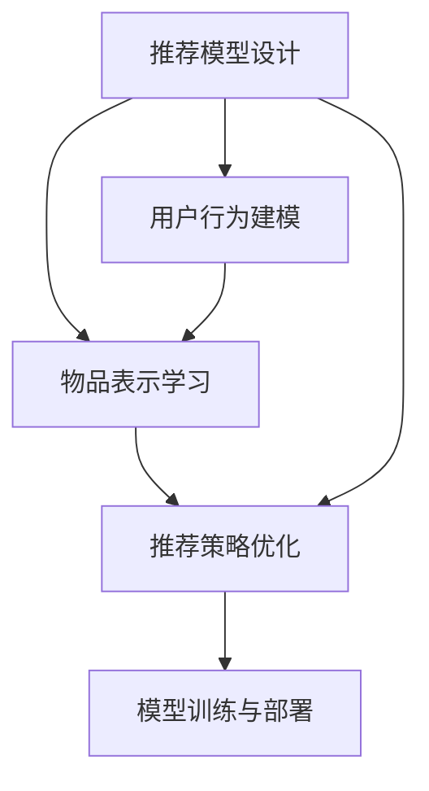

                 

# 深度学习驱动的商品推荐系统设计

## 1. 背景介绍

### 1.1 问题由来

随着互联网技术的发展和电子商务的兴起，商品推荐系统（Recommendation System）在零售、娱乐、新闻等多个行业得到了广泛应用。商品推荐系统通过分析用户的历史行为数据，为用户推荐可能感兴趣的物品，从而提高用户满意度和销售额。然而，传统的推荐系统主要依赖于用户的显式反馈数据，对用户行为进行建模和预测，面临着数据稀疏、特征维度高、实时性要求高等问题。

近年来，深度学习技术在商品推荐领域取得了显著进展，通过构建复杂的神经网络模型，可以更好地处理大规模数据和高维特征，捕捉用户行为的非线性模式，从而提升推荐系统的准确性和实时性。本文将探讨基于深度学习的商品推荐系统设计，具体包括以下几个核心问题：

1. **推荐模型的设计**：如何设计高效、准确的推荐模型，以处理海量数据和高维特征。
2. **用户行为建模**：如何通过深度学习模型捕获用户的隐式行为和偏好。
3. **物品表示学习**：如何构建物品的深度表示，以便于推荐模型的训练和推理。
4. **推荐策略优化**：如何优化推荐策略，平衡推荐效果和资源利用率。
5. **模型训练与部署**：如何高效地训练和部署深度学习推荐模型。

通过深入分析这些问题，本文旨在为深度学习驱动的商品推荐系统设计提供全面的理论基础和实践指导。

## 2. 核心概念与联系

### 2.1 核心概念概述

以下是几个与深度学习商品推荐系统设计密切相关的核心概念：

- **商品推荐系统（Recommendation System, RS）**：通过分析用户行为数据，向用户推荐可能感兴趣的商品的系统。
- **深度学习（Deep Learning）**：一种基于神经网络结构的机器学习方法，能够处理复杂的高维数据，捕捉非线性模式。
- **用户行为建模**：利用深度学习模型对用户的隐式行为（如浏览记录、点击行为等）进行建模，预测其兴趣和偏好。
- **物品表示学习**：通过深度学习模型学习物品的语义和实例特征表示，为推荐模型提供高质量的输入。
- **推荐策略优化**：结合深度学习模型和传统推荐算法，优化推荐策略，提升推荐效果。
- **模型训练与部署**：采用分布式训练、模型压缩、模型推理优化等技术，高效训练和部署深度学习推荐模型。

这些概念之间的联系可以通过以下Mermaid流程图来展示：



这个流程图展示了深度学习商品推荐系统设计的核心流程：首先设计推荐模型，然后建模用户行为和物品表示，接着优化推荐策略，最后进行模型训练和部署。

## 3. 核心算法原理 & 具体操作步骤
### 3.1 算法原理概述

基于深度学习的商品推荐系统设计，核心在于构建高效、准确的推荐模型。常见的推荐模型包括基于协同过滤（Collaborative Filtering）和基于内容的推荐（Content-Based Recommendation）等传统推荐方法，以及深度学习驱动的推荐模型，如基于深度神经网络的推荐模型、基于知识图谱的推荐模型等。

本文将重点介绍基于深度神经网络的推荐模型，该模型利用深度神经网络结构，通过学习用户行为和物品特征，预测用户对物品的兴趣，从而实现推荐。

### 3.2 算法步骤详解

基于深度神经网络的推荐模型设计包括以下几个关键步骤：

**Step 1: 数据准备与预处理**
- 收集用户的历史行为数据，如浏览记录、点击行为、购买记录等。
- 对数据进行清洗、去重、归一化等预处理操作，确保数据质量。

**Step 2: 特征工程**
- 设计合适的特征提取方法，将用户行为和物品特征转换为数值型向量。
- 使用嵌入式特征工程，将特征与神经网络模型直接融合，提高模型的泛化能力。

**Step 3: 模型设计**
- 选择合适的神经网络结构，如深度神经网络、卷积神经网络、循环神经网络等。
- 设计损失函数，如均方误差（MSE）、交叉熵（Cross-Entropy）等，衡量模型预测与真实标签之间的差异。
- 选择合适的优化器，如Adam、SGD等，设置学习率、批大小等超参数。

**Step 4: 模型训练与验证**
- 将数据集分为训练集、验证集和测试集。
- 使用训练集训练模型，在验证集上进行参数调整，确保模型泛化性能。
- 使用测试集评估模型性能，确保模型在实际应用中的表现。

**Step 5: 模型部署与优化**
- 将训练好的模型部署到生产环境中，进行实时推荐。
- 使用A/B测试、日志分析等手段，持续优化模型性能，提升推荐效果。

### 3.3 算法优缺点

基于深度神经网络的推荐模型具有以下优点：
1. 能够处理大规模数据和高维特征，捕捉复杂的非线性模式。
2. 可以自动学习用户行为和物品特征表示，无需手工特征工程。
3. 具有较好的泛化性能，适用于多种推荐场景。

同时，该模型也存在一定的局限性：
1. 需要大量标注数据，训练成本较高。
2. 模型复杂度高，训练和推理速度较慢。
3. 对异常数据和噪声敏感，可能导致过拟合。
4. 需要大量的计算资源，对硬件要求较高。

### 3.4 算法应用领域

基于深度神经网络的推荐模型已经在电商、媒体、社交网络等多个领域得到了广泛应用，具体包括：

- **电商推荐**：如Amazon、京东等电商平台，通过深度神经网络对用户行为进行建模，实现个性化商品推荐。
- **媒体推荐**：如Netflix、YouTube等视频平台，通过深度神经网络对用户观看记录进行建模，推荐用户可能感兴趣的视频。
- **社交网络**：如Facebook、微博等社交平台，通过深度神经网络对用户好友关系和内容消费行为进行建模，推荐用户可能感兴趣的内容和好友。

除了这些经典应用，基于深度神经网络的推荐模型还在广告推荐、智能家居、智能医疗等众多领域得到了创新性应用，为各行各业带来了新一轮的变革。

## 4. 数学模型和公式 & 详细讲解  
### 4.1 数学模型构建

基于深度神经网络的推荐模型，核心在于设计合适的神经网络结构，学习用户行为和物品特征表示。以深度神经网络为例，其数学模型可以表示为：

$$
\hat{y} = f(\theta; x)
$$

其中，$\theta$ 为模型的可训练参数，$x$ 为用户行为和物品特征，$\hat{y}$ 为用户对物品的兴趣预测值。常见的深度神经网络结构包括全连接神经网络、卷积神经网络、循环神经网络等。

### 4.2 公式推导过程

以一个简单的全连接神经网络为例，其前向传播过程可以表示为：

$$
y^{(l+1)} = g(w^{(l+1)} y^{(l)} + b^{(l+1)})
$$

其中，$y^{(l)}$ 为第$l$层输出，$w^{(l+1)}$ 和$b^{(l+1)}$ 为第$l+1$层的权重和偏置，$g$ 为激活函数（如ReLU）。

假设模型的输出层为softmax函数，则推荐模型可以表示为：

$$
\hat{y} = softmax(Wx + b)
$$

其中，$W$ 和$b$ 为输出层的权重和偏置。在训练过程中，通过最小化交叉熵损失函数：

$$
L = -\frac{1}{N}\sum_{i=1}^N \sum_{j=1}^M y_i^{(j)} \log \hat{y}_i^{(j)}
$$

其中，$y_i^{(j)}$ 为用户$i$对物品$j$的标签，$\hat{y}_i^{(j)}$ 为模型预测的用户$i$对物品$j$的兴趣值。

### 4.3 案例分析与讲解

假设一个电商推荐系统，需要为用户推荐其可能感兴趣的商品。以下是该系统的具体设计和实现步骤：

1. **数据准备**：收集用户的历史浏览记录和商品信息，进行数据清洗和预处理。
2. **特征工程**：设计特征提取方法，将用户行为和商品特征转换为数值型向量。
3. **模型设计**：使用深度神经网络作为推荐模型，设计合适的神经网络结构和损失函数。
4. **模型训练**：将数据集分为训练集和验证集，使用训练集训练模型，在验证集上进行参数调整。
5. **模型评估**：使用测试集评估模型性能，确保模型泛化性能。
6. **模型部署**：将训练好的模型部署到生产环境中，进行实时推荐。
7. **模型优化**：使用A/B测试、日志分析等手段，持续优化模型性能，提升推荐效果。

## 5. 项目实践：代码实例和详细解释说明
### 5.1 开发环境搭建

在进行深度学习推荐系统开发前，需要搭建相应的开发环境。以下是使用Python进行TensorFlow开发的开发环境配置流程：

1. 安装Anaconda：从官网下载并安装Anaconda，用于创建独立的Python环境。

2. 创建并激活虚拟环境：
```bash
conda create -n tf-env python=3.8 
conda activate tf-env
```

3. 安装TensorFlow：根据CUDA版本，从官网获取对应的安装命令。例如：
```bash
conda install tensorflow-gpu=2.7 -c tf-nightly -c pytorch
```

4. 安装各类工具包：
```bash
pip install numpy pandas scikit-learn matplotlib tqdm jupyter notebook ipython
```

完成上述步骤后，即可在`tf-env`环境中开始推荐系统开发。

### 5.2 源代码详细实现

以下是使用TensorFlow进行电商推荐系统开发的完整代码实现：

```python
import tensorflow as tf
from tensorflow.keras.layers import Input, Dense, Embedding, Flatten, Concatenate
from tensorflow.keras.models import Model
from tensorflow.keras.optimizers import Adam
from tensorflow.keras.losses import CategoricalCrossentropy

# 定义数据集
def load_data():
    # 用户历史浏览记录
    user_browsers = ...
    # 商品信息
    items = ...
    # 用户对商品的兴趣标签
    user_labels = ...
    return user_browsers, items, user_labels

# 定义用户行为和物品特征的向量表示
def build_feature_vector(user_browsers, items, user_labels):
    # 用户行为特征向量表示
    user_features = ...
    # 物品特征向量表示
    item_features = ...
    # 用户对物品的兴趣标签
    user_labels = ...
    return user_features, item_features, user_labels

# 定义深度神经网络模型
def build_model(user_features, item_features, user_labels):
    # 用户行为特征嵌入层
    user_embedding = Embedding(input_dim=num_users, output_dim=embedding_dim)(user_features)
    user_features = Flatten()(user_embedding)
    
    # 物品特征嵌入层
    item_embedding = Embedding(input_dim=num_items, output_dim=embedding_dim)(item_features)
    item_features = Flatten()(item_embedding)
    
    # 将用户行为和物品特征连接
    concat_layer = Concatenate()([user_features, item_features])
    
    # 全连接神经网络层
    fc1 = Dense(128, activation='relu')(concat_layer)
    fc2 = Dense(64, activation='relu')(fc1)
    logits = Dense(1, activation='sigmoid')(fc2)
    
    # 定义损失函数和优化器
    loss = CategoricalCrossentropy()
    optimizer = Adam(lr=0.001)
    
    # 定义模型
    model = Model(inputs=[user_features, item_features], outputs=logits)
    model.compile(optimizer=optimizer, loss=loss, metrics=['accuracy'])
    
    return model

# 加载数据、构建模型、训练模型
user_browsers, items, user_labels = load_data()
user_features, item_features, user_labels = build_feature_vector(user_browsers, items, user_labels)
model = build_model(user_features, item_features, user_labels)
model.fit([user_features, item_features], user_labels, epochs=10, batch_size=64)

# 预测用户对物品的兴趣
new_user_browsers = ...
new_item_features = ...
new_user_labels = model.predict([new_user_browsers, new_item_features])
```

以上就是使用TensorFlow对电商推荐系统进行深度学习开发的完整代码实现。可以看到，TensorFlow提供了丰富的API和工具，使得模型设计和训练变得简洁高效。开发者可以将更多精力放在特征工程、模型优化等高层逻辑上，而不必过多关注底层的实现细节。

### 5.3 代码解读与分析

让我们再详细解读一下关键代码的实现细节：

**load_data函数**：
- 定义了数据集的相关函数，包括用户历史浏览记录、商品信息、用户对商品的兴趣标签。

**build_feature_vector函数**：
- 定义了用户行为和物品特征的向量表示方法，包括特征向量的构建、用户标签的转换等。

**build_model函数**：
- 定义了深度神经网络模型的结构，包括用户行为和物品特征的嵌入层、全连接神经网络层等。
- 定义了损失函数和优化器，完成模型的编译。

**model.fit函数**：
- 使用训练集训练模型，设置训练轮数和批次大小。

**model.predict函数**：
- 使用测试集评估模型性能，并进行新的用户行为预测。

可以看到，TensorFlow提供了强大的模型构建和训练功能，使得深度学习推荐系统的开发变得简单易行。开发者只需关注核心算法和业务逻辑，即可快速实现高效、准确的推荐系统。

## 6. 实际应用场景
### 6.1 电商推荐

电商推荐系统是深度学习推荐系统的经典应用场景，如Amazon、京东等电商平台广泛应用基于深度学习的推荐模型。电商推荐系统的主要目标是为用户推荐可能感兴趣的商品，提高用户购买转化率和平台销售额。

在技术实现上，电商推荐系统通常包含以下几个核心模块：

1. **用户画像建模**：通过深度学习模型对用户行为进行建模，构建用户画像，捕捉用户兴趣和偏好。
2. **物品特征提取**：使用深度学习模型对商品属性、评论等信息进行建模，提取物品特征。
3. **推荐算法设计**：设计合适的推荐算法，如基于协同过滤、基于内容的推荐等，结合深度学习模型，提升推荐效果。
4. **推荐结果排序**：使用排序算法对推荐结果进行排序，提升推荐相关性和多样性。
5. **实时推荐部署**：将训练好的模型部署到生产环境中，进行实时推荐，确保推荐效果和系统稳定性。

电商推荐系统在实际应用中取得了显著成效，提高了用户满意度和销售额，为电商平台带来了巨大的商业价值。

### 6.2 媒体推荐

媒体推荐系统是深度学习推荐系统的另一个重要应用场景，如Netflix、YouTube等视频平台广泛应用基于深度学习的推荐模型。媒体推荐系统的主要目标是为用户推荐可能感兴趣的视频内容，提高用户观看满意度和平台订阅率。

在技术实现上，媒体推荐系统通常包含以下几个核心模块：

1. **用户行为建模**：通过深度学习模型对用户观看记录进行建模，构建用户画像，捕捉用户兴趣和偏好。
2. **视频特征提取**：使用深度学习模型对视频属性、用户评分等信息进行建模，提取视频特征。
3. **推荐算法设计**：设计合适的推荐算法，如基于协同过滤、基于内容的推荐等，结合深度学习模型，提升推荐效果。
4. **推荐结果排序**：使用排序算法对推荐结果进行排序，提升推荐相关性和多样性。
5. **实时推荐部署**：将训练好的模型部署到生产环境中，进行实时推荐，确保推荐效果和系统稳定性。

媒体推荐系统在实际应用中取得了显著成效，提高了用户观看满意度和平台订阅率，为视频平台带来了巨大的商业价值。

### 6.3 社交网络

社交网络推荐系统是深度学习推荐系统的第三个重要应用场景，如Facebook、微博等社交平台广泛应用基于深度学习的推荐模型。社交网络推荐系统的主要目标是为用户推荐可能感兴趣的内容和好友，提高用户互动满意度和平台活跃度。

在技术实现上，社交网络推荐系统通常包含以下几个核心模块：

1. **用户行为建模**：通过深度学习模型对用户好友关系和内容消费行为进行建模，构建用户画像，捕捉用户兴趣和偏好。
2. **内容特征提取**：使用深度学习模型对帖子属性、用户评分等信息进行建模，提取内容特征。
3. **推荐算法设计**：设计合适的推荐算法，如基于协同过滤、基于内容的推荐等，结合深度学习模型，提升推荐效果。
4. **推荐结果排序**：使用排序算法对推荐结果进行排序，提升推荐相关性和多样性。
5. **实时推荐部署**：将训练好的模型部署到生产环境中，进行实时推荐，确保推荐效果和系统稳定性。

社交网络推荐系统在实际应用中取得了显著成效，提高了用户互动满意度和平台活跃度，为社交平台带来了巨大的商业价值。

## 7. 工具和资源推荐
### 7.1 学习资源推荐

为了帮助开发者系统掌握深度学习推荐系统的理论基础和实践技巧，这里推荐一些优质的学习资源：

1. 《深度学习推荐系统：算法与实战》书籍：系统介绍了推荐系统的主要算法和技术，并结合实例代码进行了详细讲解。
2. 《推荐系统实战》课程：由斯坦福大学开设的推荐系统课程，讲解了推荐系统的主要算法和实践技巧，并提供了大量代码和项目案例。
3. 《推荐系统论文精读》博客：详细介绍了推荐系统领域的经典论文和前沿技术，并提供了代码实现和项目实践。
4. Kaggle推荐系统竞赛：参加Kaggle推荐系统竞赛，通过实战项目积累推荐系统的实践经验。
5. GitHub推荐系统开源项目：浏览和参与开源项目，了解推荐系统在实际应用中的最新进展和最佳实践。

通过对这些资源的学习实践，相信你一定能够快速掌握深度学习推荐系统的精髓，并用于解决实际的推荐问题。

### 7.2 开发工具推荐

高效的开发离不开优秀的工具支持。以下是几款用于深度学习推荐系统开发的常用工具：

1. TensorFlow：由Google主导开发的开源深度学习框架，生产部署方便，适合大规模工程应用。
2. PyTorch：基于Python的开源深度学习框架，灵活动态的计算图，适合快速迭代研究。
3. Keras：高层次的深度学习API，提供了简洁的API接口和丰富的模型构建工具，方便快速原型开发。
4. Spark MLlib：Spark生态系统中的机器学习库，支持大规模数据处理和分布式训练。
5. Weights & Biases：模型训练的实验跟踪工具，可以记录和可视化模型训练过程中的各项指标，方便对比和调优。
6. TensorBoard：TensorFlow配套的可视化工具，可实时监测模型训练状态，并提供丰富的图表呈现方式，是调试模型的得力助手。

合理利用这些工具，可以显著提升深度学习推荐系统的开发效率，加快创新迭代的步伐。

### 7.3 相关论文推荐

深度学习推荐系统的发展源于学界的持续研究。以下是几篇奠基性的相关论文，推荐阅读：

1. 《The Bellman-Ford Algorithm for Ranking Based on Binary Gradients》（Chen & He）：提出了基于深度学习的推荐系统排名算法，通过二进制梯度算法优化排名结果。
2. 《Deep Collaborative Filtering》（Wang et al.）：利用深度神经网络对协同过滤模型进行优化，提升了推荐效果和实时性。
3. 《Analogy-based Recommendation with Deep Matrix Factorization》（Liu et al.）：结合深度神经网络和矩阵分解方法，提升了推荐系统的隐式特征建模能力。
4. 《Generative Adversarial Networks for Recommendation》（Salahuddin et al.）：利用生成对抗网络（GAN）对推荐系统进行优化，提升了推荐系统的多样性和鲁棒性。
5. 《Deep Attention Networks for Recommendations》（Zhou et al.）：利用注意力机制对推荐系统进行优化，提升了推荐系统的个性化和准确性。

这些论文代表了大深度学习推荐系统的发展脉络。通过学习这些前沿成果，可以帮助研究者把握学科前进方向，激发更多的创新灵感。

## 8. 总结：未来发展趋势与挑战
### 8.1 总结

本文对基于深度学习的商品推荐系统设计进行了全面系统的介绍。首先阐述了推荐系统的核心问题和关键技术，明确了深度学习推荐系统在电商、媒体、社交网络等领域的广泛应用。其次，从原理到实践，详细讲解了深度神经网络推荐模型的设计、训练和优化过程，给出了推荐系统开发的完整代码实现。同时，本文还广泛探讨了深度学习推荐系统在实际应用中的具体实现和优化策略，展示了其在实际落地中的巨大潜力。

通过本文的系统梳理，可以看到，基于深度学习的推荐系统在商品推荐领域取得了显著成效，提升了用户满意度和平台销售额。未来，随着深度学习技术的不断进步和推荐系统的持续优化，基于深度学习的推荐系统必将在更多行业领域得到广泛应用，为各行各业带来全新的变革和突破。

### 8.2 未来发展趋势

展望未来，深度学习推荐系统将呈现以下几个发展趋势：

1. **多模态融合**：深度学习推荐系统将更加注重多模态数据的融合，结合用户行为、物品属性、文本评论等多种信息，提升推荐效果。
2. **实时推荐引擎**：基于深度学习的推荐系统将向实时推荐引擎演进，支持秒级响应和动态更新，提升用户体验。
3. **个性化推荐**：深度学习推荐系统将更加注重个性化推荐，利用深度神经网络捕捉用户隐式行为和偏好，提供更为精准和个性化的推荐服务。
4. **动态推荐策略**：基于深度学习的推荐系统将引入更多动态推荐策略，如基于时序的推荐、基于情感的推荐等，提升推荐的相关性和多样性。
5. **多任务学习**：深度学习推荐系统将向多任务学习演进，利用同一份数据同时训练多个任务，提升推荐系统的综合性能。
6. **联邦学习**：深度学习推荐系统将向联邦学习演进，利用分布式计算资源，保护用户隐私，提升推荐模型的泛化能力。

这些趋势凸显了深度学习推荐系统的广阔前景，未来将有更多的创新和突破，为推荐系统的智能化和个性化带来新的突破。

### 8.3 面临的挑战

尽管深度学习推荐系统已经取得了显著成效，但在迈向更加智能化、个性化应用的过程中，仍面临诸多挑战：

1. **数据稀疏性**：深度学习推荐系统对数据质量要求高，但在实际应用中，用户行为数据往往较为稀疏，导致推荐系统效果不理想。
2. **模型复杂度**：深度学习推荐系统模型复杂度高，训练和推理速度较慢，对硬件要求较高。
3. **隐私保护**：推荐系统需要处理大量用户隐私数据，如何在保护用户隐私的同时，实现高效推荐，是一个重要挑战。
4. **多任务学习**：多任务学习需要平衡不同推荐任务之间的关系，提升整体性能，需要更多的理论支持和算法创新。
5. **公平性和多样性**：推荐系统容易出现偏差，导致用户对某些物品过度推荐，而忽略其他物品，影响推荐公平性和多样性。
6. **实时推荐引擎**：实时推荐引擎需要高效的计算和存储资源，如何在保障实时性的同时，提升推荐效果，是一个技术难题。

这些挑战需要研究者不断创新和突破，才能实现深度学习推荐系统的智能化和个性化，真正满足用户的个性化需求，提升推荐系统的综合性能。

### 8.4 研究展望

面向未来，深度学习推荐系统的研究需要在以下几个方面寻求新的突破：

1. **数据增强和特征融合**：研究如何通过数据增强和特征融合技术，提升推荐系统的数据质量，解决数据稀疏性问题。
2. **轻量化模型和分布式训练**：研究如何设计轻量化模型和分布式训练算法，提升推荐系统的实时性和计算效率，降低硬件成本。
3. **多任务学习和联邦学习**：研究如何利用多任务学习和联邦学习技术，提升推荐系统的综合性能，保护用户隐私。
4. **推荐系统的公平性和多样性**：研究如何设计公平性和多样性约束，避免推荐系统出现偏差，提升推荐系统的综合性能。
5. **推荐系统的实时性**：研究如何设计高效的实时推荐引擎，提升推荐系统的实时性，满足用户需求。
6. **推荐系统的可解释性**：研究如何提升推荐系统的可解释性，使用户能够理解推荐结果的生成机制，增强用户信任。

这些研究方向的研究突破，将推动深度学习推荐系统向更加智能化、个性化和可解释化的方向发展，为推荐系统的智能化和个性化带来新的突破，带来更多商业和社会价值。

## 9. 附录：常见问题与解答

**Q1：深度学习推荐系统是否适用于所有推荐场景？**

A: 深度学习推荐系统适用于大多数推荐场景，但在某些特定场景下可能不如传统推荐系统。例如，对于某些高度定制化的推荐任务，传统推荐系统可能更为适合。另外，对于数据量较小的推荐任务，深度学习推荐系统可能需要更多的数据来训练模型，提升效果。

**Q2：如何平衡推荐系统的个性化和多样性？**

A: 推荐系统需要平衡个性化和多样性，可以通过以下方法实现：
1. 利用深度学习模型捕获用户隐式行为和偏好，提升个性化推荐效果。
2. 利用多任务学习和多目标优化，提升推荐系统的多样性。
3. 引入推荐系统的公平性和多样性约束，避免推荐系统出现偏差。

**Q3：推荐系统的实时性如何实现？**

A: 推荐系统的实时性可以通过以下方法实现：
1. 利用深度学习模型优化推荐策略，提升推荐速度。
2. 利用分布式计算资源，实现高效实时推荐。
3. 利用缓存和预处理技术，优化数据读取和处理速度。

**Q4：推荐系统的可解释性如何提升？**

A: 推荐系统的可解释性可以通过以下方法提升：
1. 利用可解释的深度学习模型，如决策树、规则模型等，提升推荐系统的可解释性。
2. 利用推荐系统的特征工程，提升用户行为和物品特征的可解释性。
3. 利用推荐系统的日志分析，提供用户行为和推荐结果的解释和反馈机制。

**Q5：推荐系统的数据隐私如何保护？**

A: 推荐系统的数据隐私可以通过以下方法保护：
1. 利用联邦学习技术，保护用户隐私，实现分布式训练。
2. 利用差分隐私技术，保护用户数据隐私，防止数据泄露。
3. 利用匿名化和脱敏技术，保护用户数据隐私，防止数据滥用。

这些研究方向的研究突破，将推动深度学习推荐系统向更加智能化、个性化和可解释化的方向发展，为推荐系统的智能化和个性化带来新的突破，带来更多商业和社会价值。

---

作者：禅与计算机程序设计艺术 / Zen and the Art of Computer Programming

