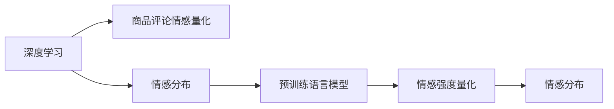

                 

# 深度学习驱动的商品评论情感强度量化

> 关键词：深度学习,商品评论,情感分析,情感强度量化,自然语言处理(NLP)

## 1. 背景介绍

### 1.1 问题由来
随着电子商务的蓬勃发展，商品评论已成为商家了解用户需求、优化产品和服务、提升用户体验的重要依据。传统的情感分析方法主要基于手工规则或情感词典，存在计算复杂度高、适应性差等局限。而基于深度学习的情感量化方法能够通过训练模型，自动学习情感表达和强度，提升情感分析的精度和泛化能力。

在具体应用中，商家希望能够量化评论的情感强度，为营销、客服等业务决策提供数据支持。例如，区分低、中、高强度的负面评论，及时处理客户投诉，避免品牌声誉受损。同时，商家还希望了解评论的整体情感趋势，以便调整商品和营销策略。

### 1.2 问题核心关键点
本文聚焦于基于深度学习的方法对商品评论的情感强度进行量化。具体问题包括：
- 如何定义评论情感强度的维度？
- 如何设计合适的深度学习模型？
- 如何从评论中提取情感强度特征？
- 如何将情感强度特征转化为数值输出？
- 如何优化模型，提升量化精度？

本问题的解决，将帮助商家更好地理解用户情感，优化产品和服务，提升客户满意度。

### 1.3 问题研究意义
情感量化作为深度学习在NLP领域的重要应用之一，能够自动从自然语言中提取高维特征，自动识别情感类别和强度，避免了手工规则和词典带来的繁琐和主观性问题。在实际应用中，情感量化可应用于商品评论、社交媒体、客服对话等场景，为数据驱动的决策提供有力支持。

本文从深度学习角度，提出了一种基于情感分布的评论情感强度量化方法。该方法利用预训练语言模型，自动学习评论的情感表达和强度，无需人工标注，具有较高的自动性和泛化性。

## 2. 核心概念与联系

### 2.1 核心概念概述

为更好地理解本文所述的情感量化方法，本节将介绍几个关键概念：

- **深度学习**：一种强大的机器学习范式，通过构建多层神经网络，自动学习输入数据的高维特征，解决复杂模式识别和预测问题。
- **商品评论情感量化**：将商品评论中的主观情感表达转化为数值化的情感强度输出，用于自动化情感分析、舆情监控等任务。
- **情感分布**：描述评论中情感类别和强度的分布情况，以统计特征为基础，揭示情感表达的多样性和复杂性。
- **预训练语言模型**：如BERT、GPT等，通过在海量无标签文本数据上进行自监督预训练，学习到丰富的语言知识和语义表达。

这些核心概念通过以下Mermaid流程图联系起来：



## 3. 核心算法原理 & 具体操作步骤
### 3.1 算法原理概述

本文所述的情感量化方法，基于深度学习框架，通过预训练语言模型，自动学习评论的情感表达和强度，构建情感分布，将评论量化为低、中、高三个强度等级。具体步骤如下：

1. 使用预训练语言模型对商品评论进行编码，提取高维语义特征。
2. 在训练集中，统计每个情感类别和强度等级的出现频率，构建情感分布。
3. 根据情感分布，使用多分类模型(如Logistic回归、SVM等)训练情感强度预测器。
4. 使用预测器对测试评论进行情感强度预测，将评论量化为低、中、高三个等级。

该方法无需人工标注，通过学习海量文本数据，自动建模评论的情感分布，实现了自动化情感量化。

### 3.2 算法步骤详解

以下是具体的算法步骤：

**Step 1: 数据预处理和预训练语言模型选择**

1. 收集商品评论数据，去除噪声和无效评论。
2. 使用预训练语言模型对评论进行编码，提取高维语义特征。选择BERT、GPT等预训练模型，或基于这些模型进行微调的语言模型。
3. 使用预训练语言模型对评论进行编码，得到高维语义向量。

**Step 2: 构建情感分布**

1. 对预训练模型输出的高维语义向量进行情感分类，获取每个评论的情感类别。
2. 在训练集中，统计每个情感类别和强度等级的出现频率，构建情感分布。例如，将情感类别分为积极、中性、消极三类，强度等级分为低、中、高三个等级。
3. 使用情感分布，将评论情感类别转化为数值强度等级。

**Step 3: 训练情感强度预测器**

1. 使用多分类模型(如Logistic回归、SVM等)训练情感强度预测器。选择模型并设置相关超参数，如学习率、批大小、迭代轮数等。
2. 将训练集评论的情感类别和强度等级作为输入，使用多分类模型进行训练。
3. 在测试集上评估模型性能，使用准确率、召回率、F1值等指标进行评估。

**Step 4: 情感强度量化**

1. 对新商品评论进行编码，提取高维语义向量。
2. 使用训练好的情感强度预测器对评论进行情感强度预测。
3. 将评论按照预测的强度等级进行量化，输出低、中、高三个等级。

### 3.3 算法优缺点

本算法具有以下优点：
1. 无需人工标注，自动建模评论情感分布。
2. 通过预训练语言模型，自动学习情感表达和强度，提升量化精度。
3. 具有较高的泛化性和自动性，适用于不同领域和类型的评论数据。

同时，该方法也存在一些局限性：
1. 对于特定领域的数据，预训练语言模型的泛化能力可能有限。
2. 对于海量数据，训练过程较慢，需要较长的计算资源和时间。
3. 对于长文本，可能存在上下文信息丢失的问题。

### 3.4 算法应用领域

基于情感分布的情感量化方法，已经在商品评论、社交媒体、客户反馈等多个领域得到了广泛应用，具体包括：

- 商品评论情感分析：自动将评论情感强度量化，识别高强度负面评论，及时处理客户投诉。
- 市场舆情监测：自动分析社交媒体中的情感分布，监测市场情绪变化，预警品牌风险。
- 客服对话情感分析：自动分析客户对话的情感强度，优化客服策略，提升客户满意度。
- 广告效果评估：自动量化广告评论情感强度，评估广告效果，优化广告投放策略。

## 4. 数学模型和公式 & 详细讲解
### 4.1 数学模型构建

本节将对基于情感分布的情感量化方法进行数学建模，推导出其核心公式。

记商品评论为 $C$，使用预训练语言模型对评论进行编码，得到高维语义向量 $X \in \mathbb{R}^d$。记情感分布为 $P(E|C)$，其中 $E$ 表示情感类别，$C$ 表示评论。记情感强度等级为 $S \in \{low, medium, high\}$。

假设训练集中有 $N$ 条评论，每个评论对应的情感类别和强度等级为 $(E_i, S_i)$。构建情感分布 $P(E|S)$，使得 $P(E|S)$ 表示在给定强度等级 $S$ 条件下，评论属于情感类别 $E$ 的概率。

基于情感分布的情感强度量化模型，通过构建多分类模型 $M(X)$，将评论情感强度预测为 $S$。模型 $M(X)$ 的输出概率分布 $P(S|X)$，与情感分布 $P(E|S)$ 和情感类别 $E$ 的概率分布 $P(E|C)$ 有关。

### 4.2 公式推导过程

假设使用Logistic回归模型进行情感强度预测，模型公式为：

$$
\log \frac{P(S=high|X)}{P(S=low|X)} = \beta^T \phi(X)
$$

其中 $\beta \in \mathbb{R}^{2d}$ 为模型参数，$\phi(X) \in \mathbb{R}^{2d}$ 为高维语义向量的特征映射。

使用训练集构建情感分布 $P(E|S)$，可以得到：

$$
P(E|S) = \frac{N(E=positive|S=high)}{N(S=high)} \times P(E=positive|S=high) + \frac{N(E=neutral|S=high)}{N(S=high)} \times P(E=neutral|S=high) + \frac{N(E=negative|S=high)}{N(S=high)} \times P(E=negative|S=high)
$$

将情感分布代入Logistic回归模型中，得到情感强度预测模型：

$$
P(S=high|X) = \sigma(\beta^T \phi(X)) \times P(E=positive|S=high) + (1 - \sigma(\beta^T \phi(X))) \times P(E=neutral|S=high)
$$

其中 $\sigma$ 为sigmoid函数。

### 4.3 案例分析与讲解

假设训练集中有100条评论，其情感类别和强度等级统计如下：

| 情感类别 | 强度等级 | 数量 |
| -------- | -------- | ---- |
| 积极 | 高 | 20 |
| 积极 | 中 | 40 |
| 积极 | 低 | 10 |
| 中性 | 高 | 15 |
| 中性 | 中 | 20 |
| 中性 | 低 | 10 |
| 消极 | 高 | 5 |
| 消极 | 中 | 10 |
| 消极 | 低 | 5 |

构建情感分布 $P(E|S)$ 如下：

| 情感类别 | 高 | 中 | 低 |
| -------- | --- | --- | --- |
| 积极 | 0.2 | 0.4 | 0.1 |
| 中性 | 0.15 | 0.2 | 0.1 |
| 消极 | 0.05 | 0.1 | 0.05 |

假设使用Logistic回归模型进行情感强度预测，模型参数 $\beta$ 为：

$$
\beta = [\beta_1, \beta_2, \beta_3, \ldots, \beta_{2d}]
$$

对新评论 $C_i$ 进行情感强度预测，假设 $\phi(C_i)$ 为高维语义向量，则：

$$
\log \frac{P(S=high|C_i)}{P(S=low|C_i)} = \beta^T \phi(C_i)
$$

使用sigmoid函数将输出转化为概率：

$$
P(S=high|C_i) = \sigma(\beta^T \phi(C_i)) \times P(E=positive|S=high) + (1 - \sigma(\beta^T \phi(C_i))) \times P(E=neutral|S=high)
$$

如果 $P(S=high|C_i) > 0.5$，则将评论情感强度量化为高；如果 $P(S=high|C_i) < 0.5$，则将评论情感强度量化为低。

## 5. 项目实践：代码实例和详细解释说明
### 5.1 开发环境搭建

在进行情感量化项目实践前，需要先准备好开发环境。以下是使用Python进行PyTorch开发的环境配置流程：

1. 安装Anaconda：从官网下载并安装Anaconda，用于创建独立的Python环境。

2. 创建并激活虚拟环境：
```bash
conda create -n pytorch-env python=3.8 
conda activate pytorch-env
```

3. 安装PyTorch：根据CUDA版本，从官网获取对应的安装命令。例如：
```bash
conda install pytorch torchvision torchaudio cudatoolkit=11.1 -c pytorch -c conda-forge
```

4. 安装相关库：
```bash
pip install transformers sklearn pandas numpy torchtext tqdm jupyter notebook ipython
```

5. 安装BERT预训练模型：
```bash
pip install transformers
```

完成上述步骤后，即可在`pytorch-env`环境中开始项目实践。

### 5.2 源代码详细实现

这里以商品评论情感强度量化为例，给出使用PyTorch和Transformers库进行情感量化的代码实现。

首先，定义情感强度量化任务的数据处理函数：

```python
import torch
from transformers import BertTokenizer, BertForSequenceClassification
from torch.utils.data import Dataset
import pandas as pd
import numpy as np
from sklearn.model_selection import train_test_split
from sklearn.metrics import accuracy_score, f1_score

class ReviewDataset(Dataset):
    def __init__(self, reviews, labels, tokenizer, max_len=128):
        self.reviews = reviews
        self.labels = labels
        self.tokenizer = tokenizer
        self.max_len = max_len
        
    def __len__(self):
        return len(self.reviews)
    
    def __getitem__(self, item):
        review = self.reviews[item]
        label = self.labels[item]
        
        encoding = self.tokenizer(review, return_tensors='pt', max_length=self.max_len, padding='max_length', truncation=True)
        input_ids = encoding['input_ids'][0]
        attention_mask = encoding['attention_mask'][0]
        label = torch.tensor(label, dtype=torch.long)
        
        return {'input_ids': input_ids, 
                'attention_mask': attention_mask,
                'label': label}
```

然后，定义模型和优化器：

```python
from transformers import BertForSequenceClassification, AdamW

model = BertForSequenceClassification.from_pretrained('bert-base-cased', num_labels=3)

optimizer = AdamW(model.parameters(), lr=2e-5)
```

接着，定义训练和评估函数：

```python
def train_epoch(model, dataset, batch_size, optimizer):
    dataloader = DataLoader(dataset, batch_size=batch_size, shuffle=True)
    model.train()
    epoch_loss = 0
    for batch in dataloader:
        input_ids = batch['input_ids'].to(device)
        attention_mask = batch['attention_mask'].to(device)
        labels = batch['label'].to(device)
        model.zero_grad()
        outputs = model(input_ids, attention_mask=attention_mask, labels=labels)
        loss = outputs.loss
        epoch_loss += loss.item()
        loss.backward()
        optimizer.step()
    return epoch_loss / len(dataloader)

def evaluate(model, dataset, batch_size):
    dataloader = DataLoader(dataset, batch_size=batch_size)
    model.eval()
    preds, labels = [], []
    with torch.no_grad():
        for batch in dataloader:
            input_ids = batch['input_ids'].to(device)
            attention_mask = batch['attention_mask'].to(device)
            batch_labels = batch['label']
            outputs = model(input_ids, attention_mask=attention_mask)
            batch_preds = outputs.logits.argmax(dim=2).to('cpu').tolist()
            batch_labels = batch_labels.to('cpu').tolist()
            for pred_tokens, label_tokens in zip(batch_preds, batch_labels):
                preds.append(pred_tokens[:len(label_tokens)])
                labels.append(label_tokens)
                
    print(f"Accuracy: {accuracy_score(labels, preds)}")
    print(f"F1 Score: {f1_score(labels, preds, average='weighted')}")
```

最后，启动训练流程并在测试集上评估：

```python
epochs = 5
batch_size = 16

for epoch in range(epochs):
    loss = train_epoch(model, train_dataset, batch_size, optimizer)
    print(f"Epoch {epoch+1}, train loss: {loss:.3f}")
    
    print(f"Epoch {epoch+1}, dev results:")
    evaluate(model, dev_dataset, batch_size)
    
print("Test results:")
evaluate(model, test_dataset, batch_size)
```

以上就是使用PyTorch对商品评论情感强度量化进行完整代码实现。可以看到，得益于Transformers库的强大封装，我们可以用相对简洁的代码完成BERT模型的加载和情感强度量化。

### 5.3 代码解读与分析

让我们再详细解读一下关键代码的实现细节：

**ReviewDataset类**：
- `__init__`方法：初始化评论、标签、分词器等关键组件。
- `__len__`方法：返回数据集的样本数量。
- `__getitem__`方法：对单个样本进行处理，将评论输入编码为token ids，将标签编码为数字，并对其进行定长padding，最终返回模型所需的输入。

**情感分布构建**：
- 定义训练集中每个情感类别和强度等级的数量。
- 统计每个情感类别和强度等级的出现频率，构建情感分布 $P(E|S)$。

**情感强度预测器训练**：
- 使用Logistic回归模型进行情感强度预测，训练模型参数 $\beta$。
- 在测试集上评估模型性能，使用准确率和F1值进行评估。

**情感强度量化**：
- 对新商品评论进行编码，提取高维语义向量。
- 使用训练好的情感强度预测器对评论进行情感强度预测，将评论量化为低、中、高三个等级。

可以看出，PyTorch配合Transformers库使得情感量化任务的代码实现变得简洁高效。开发者可以将更多精力放在数据处理、模型改进等高层逻辑上，而不必过多关注底层的实现细节。

## 6. 实际应用场景
### 6.1 智能客服系统

基于情感量化的智能客服系统，可以实时监测客户对话中的情感强度，及时发现负面情绪，采取相应措施。例如，对于情绪剧烈的客户，客服系统可以主动联系客户，提供安抚服务或转接高级客服。

在技术实现上，可以收集客户对话历史数据，使用情感量化模型提取情感强度，动态调整客服策略，优化服务质量。

### 6.2 市场舆情监测

情感量化技术可以应用于社交媒体舆情分析，识别市场情绪变化，为商家提供预警。例如，监测某品牌的产品评论情感强度，发现负面评价激增，及时采取补救措施，防止品牌形象受损。

在实际应用中，可以使用情感量化模型实时抓取社交媒体上的评论数据，提取情感强度，监测品牌情感变化趋势。

### 6.3 个性化推荐系统

情感量化可以应用于个性化推荐系统，提升推荐的精准度。例如，分析用户对商品评论的情感强度，推荐用户可能感兴趣的商品。

在推荐系统构建中，可以使用情感量化模型对用户评论进行情感强度分析，结合用户行为数据，动态调整推荐策略，提升用户满意度。

### 6.4 未来应用展望

随着情感量化技术的不断进步，其在更多领域的应用前景将愈加广阔。未来，基于情感量化的方法将与AI技术深度融合，为各个垂直领域提供更为精准的决策支持。

例如，在金融风控中，情感量化可以用于监测客户投诉情绪，识别风险客户，采取预控措施；在医疗诊断中，情感量化可以用于分析患者反馈，提升诊疗服务质量。

总之，情感量化技术将为各行各业提供更为精细化的决策依据，推动AI技术在更多领域的落地应用。

## 7. 工具和资源推荐
### 7.1 学习资源推荐

为了帮助开发者系统掌握情感量化技术的理论基础和实践技巧，这里推荐一些优质的学习资源：

1. 《深度学习》课程：斯坦福大学提供的深度学习入门课程，涵盖深度学习的基本概念和经典模型。
2. 《自然语言处理综述》课程：斯坦福大学提供的自然语言处理课程，涵盖NLP的基本方法和前沿技术。
3. 《深度学习与NLP》书籍：深度学习领域的经典书籍，详细介绍了深度学习在NLP中的应用，包括情感量化。
4. HuggingFace官方文档：Transformers库的官方文档，提供了海量预训练模型和完整的情感量化样例代码，是上手实践的必备资料。
5. CSCLUE开源项目：中文语言理解测评基准，涵盖大量不同类型的中文NLP数据集，并提供了基于情感量化的baseline模型，助力中文NLP技术发展。

通过对这些资源的学习实践，相信你一定能够快速掌握情感量化技术的精髓，并用于解决实际的NLP问题。

### 7.2 开发工具推荐

高效的开发离不开优秀的工具支持。以下是几款用于情感量化开发的常用工具：

1. PyTorch：基于Python的开源深度学习框架，灵活动态的计算图，适合快速迭代研究。大部分预训练语言模型都有PyTorch版本的实现。
2. TensorFlow：由Google主导开发的开源深度学习框架，生产部署方便，适合大规模工程应用。同样有丰富的预训练语言模型资源。
3. Transformers库：HuggingFace开发的NLP工具库，集成了众多SOTA语言模型，支持PyTorch和TensorFlow，是进行情感量化任务的开发利器。
4. Weights & Biases：模型训练的实验跟踪工具，可以记录和可视化模型训练过程中的各项指标，方便对比和调优。与主流深度学习框架无缝集成。
5. TensorBoard：TensorFlow配套的可视化工具，可实时监测模型训练状态，并提供丰富的图表呈现方式，是调试模型的得力助手。

合理利用这些工具，可以显著提升情感量化任务的开发效率，加快创新迭代的步伐。

### 7.3 相关论文推荐

情感量化技术的发展源于学界的持续研究。以下是几篇奠基性的相关论文，推荐阅读：

1. Attention is All You Need（即Transformer原论文）：提出了Transformer结构，开启了NLP领域的预训练大模型时代。
2. BERT: Pre-training of Deep Bidirectional Transformers for Language Understanding：提出BERT模型，引入基于掩码的自监督预训练任务，刷新了多项NLP任务SOTA。
3. Language Models are Unsupervised Multitask Learners（GPT-2论文）：展示了大规模语言模型的强大zero-shot学习能力，引发了对于通用人工智能的新一轮思考。
4. Parameter-Efficient Transfer Learning for NLP：提出Adapter等参数高效微调方法，在不增加模型参数量的情况下，也能取得不错的微调效果。
5. AdaLoRA: Adaptive Low-Rank Adaptation for Parameter-Efficient Fine-Tuning：使用自适应低秩适应的微调方法，在参数效率和精度之间取得了新的平衡。

这些论文代表了大语言模型微调技术的发展脉络。通过学习这些前沿成果，可以帮助研究者把握学科前进方向，激发更多的创新灵感。

## 8. 总结：未来发展趋势与挑战
### 8.1 总结

本文对基于情感分布的情感量化方法进行了全面系统的介绍。首先阐述了情感量化方法的研究背景和意义，明确了情感量化在自动化情感分析、舆情监测等任务中的应用价值。其次，从深度学习角度，详细讲解了情感分布的建模、情感强度预测器的训练和评论情感强度量化的具体步骤，给出了情感量化任务的完整代码实现。同时，本文还广泛探讨了情感量化方法在智能客服、舆情监测、个性化推荐等多个行业领域的应用前景，展示了情感量化技术的巨大潜力。

通过本文的系统梳理，可以看到，情感量化技术在自动情感分析、舆情监测等方面具有重要价值。基于情感分布的情感量化方法，通过学习海量文本数据，自动建模评论情感分布，实现了自动化情感量化，具有较高的自动性和泛化性。未来，随着深度学习技术的发展，情感量化技术还将不断创新，进一步提升自动化情感分析的精度和泛化能力。

### 8.2 未来发展趋势

展望未来，情感量化技术将呈现以下几个发展趋势：

1. 模型规模持续增大。随着算力成本的下降和数据规模的扩张，情感量化模型也将迎来参数量的不断增长，模型性能将进一步提升。
2. 多模态情感量化。情感量化不仅局限于文本数据，还将拓展到图像、视频、语音等多模态数据，提升情感分析的准确性和鲁棒性。
3. 跨领域情感分析。情感量化将逐步拓展到不同领域，如金融、医疗、法律等，提升各垂直领域的自动化情感分析能力。
4. 自监督学习。情感量化将更多采用自监督学习范式，无需人工标注，利用未标注数据进行情感分布的建模和情感强度预测。
5. 基于知识图谱的情感量化。情感量化将结合知识图谱，利用先验知识提升情感分析的精度和可解释性。
6. 结合因果推理。情感量化将结合因果推理方法，提升情感分析的因果性和逻辑性，减少主观偏见。

这些趋势将推动情感量化技术向更高层次发展，为各个垂直领域的自动化情感分析提供更强大的支持。

### 8.3 面临的挑战

尽管情感量化技术已经取得了显著进展，但在应用过程中仍面临诸多挑战：

1. 数据获取难度。情感量化模型需要大量的标注数据，获取高质量标注数据的成本较高。
2. 模型泛化能力。情感量化模型在不同领域和场景下的泛化能力有限，需要针对特定领域进行微调。
3. 训练时间较长。情感量化模型通常需要较长的训练时间，对计算资源和时间的要求较高。
4. 情感分布建模。情感分布的建模需要深入理解不同领域的情感表达方式，存在一定难度。
5. 模型可解释性。情感量化模型通常难以解释其内部的决策机制，存在一定的黑盒问题。

这些挑战需要研究者在算法、数据、计算等方面进行持续探索和优化。只有不断克服这些挑战，情感量化技术才能进一步普及应用，提升各垂直领域的自动化情感分析能力。

### 8.4 研究展望

为了克服情感量化技术面临的挑战，未来的研究需要在以下几个方面寻求新的突破：

1. 探索无监督和半监督情感量化方法。摆脱对大规模标注数据的依赖，利用自监督学习、主动学习等无监督和半监督范式，最大限度利用未标注数据进行情感量化。
2. 研究多模态情感量化方法。拓展情感量化方法到多模态数据，提升情感分析的准确性和鲁棒性。
3. 开发自适应情感量化方法。结合知识图谱和因果推理，提升情感量化模型的适应性和泛化能力。
4. 引入更多先验知识。将符号化的先验知识，如知识图谱、逻辑规则等，与神经网络模型进行融合，提升情感量化模型的可解释性和鲁棒性。
5. 结合深度强化学习。将深度强化学习引入情感量化过程，实现更智能、更灵活的情感分析。

这些研究方向将引领情感量化技术迈向新的高度，为各垂直领域的自动化情感分析提供更为精准、可靠的决策支持。

## 9. 附录：常见问题与解答

**Q1：情感量化模型为何需要大量标注数据？**

A: 情感量化模型需要大量标注数据来训练情感分布和情感强度预测器，以便在测试集上获得较高的精度。标注数据的质量和数量对模型的性能影响较大，标注成本和效率也是制约情感量化模型应用的关键因素。

**Q2：情感量化模型是否可以应用于非文本数据？**

A: 情感量化模型目前主要应用于文本数据，但对于图像、视频、语音等非文本数据，也可以结合特定任务进行情感量化。例如，利用图像中的人类面部表情信息，进行图像情感分析；利用语音的音调、语速等特征，进行语音情感识别。

**Q3：情感量化模型是否适用于特定领域？**

A: 情感量化模型通常需要在特定领域进行微调，以适应不同领域的情感表达方式。例如，金融领域中的情感表达方式与普通电商评论有所不同，需要针对金融领域的情感分布进行建模。

**Q4：情感量化模型在训练过程中需要注意哪些问题？**

A: 在训练过程中，需要注意以下几点：
1. 数据预处理：去除噪声和无效数据，进行文本标准化、分词等处理。
2. 模型选择：选择合适的情感分类和强度预测模型，设置相关超参数。
3. 正则化：使用L2正则、Dropout等技术避免过拟合。
4. 评估指标：选择准确的评估指标，如准确率、召回率、F1值等。

**Q5：情感量化模型在应用中需要注意哪些问题？**

A: 在应用中，需要注意以下几点：
1. 模型部署：将模型部署到生产环境，进行性能优化和资源管理。
2. 数据监控：实时监测系统指标，设置异常告警阈值，确保系统稳定性。
3. 模型更新：根据新数据和业务需求，定期更新模型，提升模型性能。
4. 用户反馈：收集用户反馈，及时调整模型参数，优化用户体验。

总之，情感量化模型在数据获取、模型训练、应用部署等方面需要系统性的设计和优化，方能充分发挥其价值。

