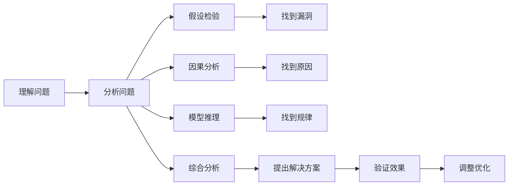

                 

# 深度思考:拉开人生差距的秘诀

> 关键词：深度思考,认知升级,自驱力,学习路径,知识管理,实践迭代

## 1. 背景介绍

在日新月异的科技浪潮中，深度思考成为了拉开人生差距的秘诀。无论是在职场还是学术领域，能够深度思考的人总是能更好地抓住机遇，创造出突破性的成果。然而，深度思考并非天赋，而是一种可以通过训练提升的能力。本文将系统介绍深度思考的核心概念、关键步骤，并提供实用的实践建议，帮助读者在知识爆炸的今天，把握信息时代的主动权。

## 2. 核心概念与联系

### 2.1 核心概念概述

深度思考是指对复杂问题进行深入分析、多角度思考并找到解决方案的过程。其核心在于从问题表象深入本质，理解其背后的逻辑和关系，进而提出行之有效的解决策略。深度思考包括三个核心步骤：理解问题、分析问题、解决问题。

**理解问题**：准确把握问题的本质，判断哪些信息是重要的，哪些是次要的。
**分析问题**：使用多种方法，如因果分析、假设检验、模型推理等，全面分析问题。
**解决问题**：结合多角度分析结果，提出并验证解决方案。

以下是一个Mermaid流程图，展示了深度思考的各个环节：



这个流程图展示了深度思考的各个步骤，以及各个步骤之间的联系。通过理解和分析问题，我们能够找到问题的本质和原因；通过验证解决方案，我们能够确定其有效性和可操作性。

## 3. 核心算法原理 & 具体操作步骤
### 3.1 算法原理概述

深度思考的算法原理基于信息论和认知科学。其主要思想是通过信息获取、处理和反馈，逐步构建起对问题的深度理解，并在此基础上进行分析和决策。

在深度思考的过程中，我们需要不断获取新信息，更新知识库；在处理信息时，我们需要通过各种方法进行多角度分析；在反馈过程中，我们需要验证和调整解决方案。这些步骤共同构成了深度思考的完整流程。

### 3.2 算法步骤详解

深度思考的步骤大致可以分为以下五个阶段：

**Step 1: 信息获取**
- 确定问题：明确需要解决的问题，搜集相关的背景资料。
- 分析信息：通过阅读、观察、访谈等方式，全面了解问题的现状和背景。
- 整理信息：整理和分类信息，确定哪些是关键点，哪些是次要点。

**Step 2: 问题理解**
- 提炼核心问题：通过信息整理，找出问题的核心和关键点。
- 确定目标：明确解决问题的目标和期望结果。
- 设定假设：根据已知信息，提出可能的假设和解决方案。

**Step 3: 问题分析**
- 建立模型：通过建立数学模型、逻辑模型或数据模型，将问题结构化。
- 验证假设：使用实验数据或理论推导，验证假设的正确性。
- 调整模型：根据验证结果，调整模型以适应问题的实际情况。

**Step 4: 解决方案**
- 提出方案：结合问题分析和模型调整的结果，提出初步解决方案。
- 实施方案：将解决方案转化为具体的行动计划，并逐步实施。
- 反馈调整：根据实施过程中的反馈，不断调整和优化方案。

**Step 5: 总结提升**
- 总结经验：在解决问题后，总结过程中的经验和教训，形成知识积累。
- 提升能力：通过不断实践和总结，提升深度思考的能力和水平。

### 3.3 算法优缺点

深度思考的优点在于其系统性和全面性，通过多角度分析，能够全面了解问题，提出更有效的解决方案。然而，深度思考的缺点也在于其复杂性和耗时性，需要大量的时间和精力投入，对个人能力和资源要求较高。

### 3.4 算法应用领域

深度思考不仅适用于学术研究和技术开发，还广泛应用于企业管理、市场营销、个人成长等多个领域。通过深度思考，企业能够制定出更加科学的管理策略，个人能够提升决策能力和创新能力。

## 4. 数学模型和公式 & 详细讲解 & 举例说明

### 4.1 数学模型构建

深度思考的数学模型可以抽象为信息获取、处理和反馈的过程。我们可以用信息熵来描述信息获取的过程，用决策树来描述问题分析和解决方案的过程，用反馈机制来描述解决方案的调整过程。

假设有一个问题需要解决，我们将其表示为 $P$。初始时，我们对其一无所知，信息熵为 $H(P)$。通过信息获取，我们得到一些信息 $I_1, I_2, \ldots, I_n$，其信息熵为 $H(I_i)$。我们将这些信息整合后，得到新问题的信息熵为 $H(P'|I_1, I_2, \ldots, I_n)$。

### 4.2 公式推导过程

在信息获取和问题理解阶段，信息熵的变化可以表示为：

$$
H(P) = \sum_{i=1}^n H(P|I_i) \cdot P(I_i)
$$

其中 $H(P|I_i)$ 表示在已知信息 $I_i$ 的情况下，问题 $P$ 的信息熵。$P(I_i)$ 表示信息 $I_i$ 出现的概率。

在问题分析和解决方案阶段，我们可以通过决策树的方法，将问题转化为一系列的决策点。每个决策点对应一个选择，其信息熵可以表示为：

$$
H(D_i) = \sum_{j=1}^m H(D_i|X_j) \cdot P(X_j|D_i)
$$

其中 $D_i$ 表示第 $i$ 个决策点，$X_j$ 表示第 $j$ 个选择。$H(D_i|X_j)$ 表示在已知选择 $X_j$ 的情况下，决策点 $D_i$ 的信息熵，$P(X_j|D_i)$ 表示在决策点 $D_i$ 的情况下，选择 $X_j$ 的概率。

在解决方案阶段，我们可以通过反馈机制，调整模型的参数，使其更贴近实际情况。设调整后的模型为 $M'$，其信息熵为 $H(P'|M')$。反馈机制可以表示为：

$$
H(P'|M') = \sum_{k=1}^K H(P'|M_k)
$$

其中 $M_k$ 表示第 $k$ 次反馈调整后的模型，$H(P'|M_k)$ 表示在模型 $M_k$ 的情况下，问题 $P'$ 的信息熵。

### 4.3 案例分析与讲解

假设我们面临一个问题：如何提升企业的市场份额？

**Step 1: 信息获取**

我们通过市场调研、客户访谈等方式，搜集到以下信息：
- 竞争对手的市场份额
- 目标客户的需求和痛点
- 企业自身的优势和劣势

**Step 2: 问题理解**

我们通过信息整理，得出核心问题：如何吸引更多的目标客户，并提高客户满意度和忠诚度。

**Step 3: 问题分析**

我们使用决策树的方法，分析了多个可能的解决方案：
- 增加广告投放
- 改进产品和服务
- 提高客户服务水平
- 推出新产品

我们通过实验数据验证了每个方案的可行性和效果。

**Step 4: 解决方案**

最终我们决定推出新产品，并通过广告和客户服务同时发力。

**Step 5: 总结提升**

在成功实施新产品后，我们总结了整个决策过程的经验，提升了深度思考的能力。

## 5. 项目实践：代码实例和详细解释说明

### 5.1 开发环境搭建

为了进行深度思考的实践，我们需要搭建一个开发环境。这里我们使用Python和Jupyter Notebook：

1. 安装Python：根据官方文档，安装Python 3.x版本。
2. 安装Jupyter Notebook：通过pip安装。
3. 安装相关库：如NumPy、Pandas、SciPy等，用于数据处理和计算。

### 5.2 源代码详细实现

假设我们要分析一个电商网站的用户流失问题，可以通过以下步骤进行：

1. 数据收集和处理：使用Pandas库，从数据库或API中获取用户数据，并进行清洗和处理。

```python
import pandas as pd

# 从数据库中读取用户数据
user_data = pd.read_csv('user_data.csv')

# 数据清洗和处理
user_data.dropna(inplace=True)
user_data['last_purchase_date'] = pd.to_datetime(user_data['last_purchase_date'])
```

2. 分析问题：通过描述统计和数据可视化，找出用户流失的主要原因。

```python
import matplotlib.pyplot as plt
import seaborn as sns

# 绘制用户流失率随时间的变化趋势
sns.lineplot(x='last_purchase_date', y='user_churn', data=user_data)
plt.title('User Churn Rate Over Time')
plt.xlabel('Last Purchase Date')
plt.ylabel('User Churn Rate')
plt.show()

# 分析流失用户的主要特征
sns.boxplot(x='user_churn', y='age', data=user_data)
plt.title('Age Distribution of Churned Users')
plt.xlabel('User Churn')
plt.ylabel('Age')
plt.show()
```

3. 提出解决方案：通过建立回归模型，预测用户流失的概率，并找到主要影响因素。

```python
from sklearn.linear_model import LogisticRegression

# 建立逻辑回归模型
model = LogisticRegression()
model.fit(user_data[['age', 'gender', 'purchase_frequency']], user_data['user_churn'])

# 预测用户流失概率
user_churn_prob = model.predict_proba(user_data[['age', 'gender', 'purchase_frequency']])[:, 1]
```

### 5.3 代码解读与分析

在上述代码中，我们首先通过Pandas库对用户数据进行清洗和处理，然后使用Matplotlib和Seaborn库进行数据可视化，找出用户流失的主要原因。最后，我们使用逻辑回归模型，预测用户流失的概率，并找到主要影响因素。

### 5.4 运行结果展示

通过上述步骤，我们能够得出用户流失的主要原因，并制定出针对性的解决方案，如提高客户服务水平、优化产品功能等。

## 6. 实际应用场景

### 6.1 企业管理

在企业管理中，深度思考可以应用于决策制定、资源配置等多个方面。通过深度思考，企业能够制定出更加科学、合理的管理策略，提高运营效率和市场竞争力。

### 6.2 市场营销

市场营销中，深度思考可以应用于市场调研、广告投放、产品定位等多个环节。通过深度思考，企业能够更好地了解目标客户的需求，制定出更加精准的营销策略。

### 6.3 个人成长

在个人成长中，深度思考可以应用于学习、职业规划等多个方面。通过深度思考，个人能够提升学习效率和决策能力，实现更好的自我发展。

### 6.4 未来应用展望

随着技术的不断进步，深度思考的应用将更加广泛。未来，深度思考将更多地结合人工智能、大数据等技术，提升分析能力和决策精度。

## 7. 工具和资源推荐

### 7.1 学习资源推荐

1. 《深度思考的艺术》：介绍深度思考的原理、方法和技巧，适合初学者和进阶者。
2. 《思考，快与慢》：讲解人类思维的两种模式，帮助读者理解深度思考的机制。
3. 《人工智能与认知科学》：探讨人工智能和认知科学的关系，深入理解深度思考的科学基础。

### 7.2 开发工具推荐

1. Python：灵活的编程语言，支持多种数据分析和机器学习库。
2. Jupyter Notebook：强大的交互式编程环境，适合进行数据分析和建模。
3. TensorFlow：深度学习框架，支持高效的数据处理和模型训练。

### 7.3 相关论文推荐

1. 《深度学习与人类思考方式的相似性》：探讨深度学习与人类思考方式的相似性，揭示深度思考的科学基础。
2. 《认知科学中的深度思考研究》：深入探讨认知科学中的深度思考，提供理论支持。
3. 《人工智能与深度思考的结合》：探讨人工智能与深度思考的结合方式，提升深度思考的能力。

## 8. 总结：未来发展趋势与挑战

### 8.1 研究成果总结

深度思考作为拉开人生差距的秘诀，已经在多个领域取得了显著的成果。通过不断实践和总结，深度思考的能力正在逐步提升，成为更多人的必备技能。

### 8.2 未来发展趋势

1. 技术融合：深度思考将更多地结合人工智能、大数据等技术，提升分析能力和决策精度。
2. 知识管理：通过智能化的知识管理工具，更好地积累和应用深度思考的知识。
3. 实践迭代：深度思考的实践方法将不断迭代和优化，形成更加科学、有效的流程。

### 8.3 面临的挑战

1. 时间和资源：深度思考需要大量的时间和精力投入，对个人能力和资源要求较高。
2. 复杂性和不确定性：深度思考过程复杂，需要面对各种不确定性和挑战。
3. 技术瓶颈：深度思考中涉及的数学模型和技术工具，需要不断优化和改进。

### 8.4 研究展望

未来，深度思考的研究将更多地关注其与人工智能、大数据等技术的结合，提升分析能力和决策精度。同时，将不断优化深度思考的实践方法，形成更加科学、有效的流程。相信通过不断探索和实践，深度思考将引领更多人走向成功的道路。

## 9. 附录：常见问题与解答

**Q1: 如何培养深度思考能力？**

A: 深度思考能力可以通过以下几个步骤培养：
1. 多读书：广泛阅读各类书籍，扩大知识面。
2. 多思考：在学习和生活中，多进行思考和反思。
3. 多实践：通过实际问题，进行深度思考和实践。
4. 多总结：总结经验教训，形成系统的知识体系。

**Q2: 深度思考和传统思考有什么区别？**

A: 深度思考和传统思考的区别在于其复杂性和系统性。深度思考通过多角度分析和验证，能够全面理解问题，提出更有效的解决方案。而传统思考往往局限于表面现象，难以深入理解问题本质。

**Q3: 深度思考在企业管理中的应用有哪些？**

A: 深度思考在企业管理中的应用包括：
1. 战略制定：通过深度思考，制定出科学、合理的战略规划。
2. 资源配置：通过深度思考，优化资源配置，提高运营效率。
3. 风险管理：通过深度思考，识别和管理风险，保障企业稳定发展。

**Q4: 深度思考和机器学习有什么区别？**

A: 深度思考和机器学习的区别在于其思考方式和方法。深度思考是通过多角度分析和验证，全面理解问题，提出解决方案。而机器学习是通过数据和算法，自动化地进行分析和预测。

**Q5: 深度思考在个人成长中的作用是什么？**

A: 深度思考在个人成长中的作用包括：
1. 提升学习效率：通过深度思考，提高理解和应用知识的能力。
2. 优化决策过程：通过深度思考，提高决策的科学性和准确性。
3. 增强创新能力：通过深度思考，拓展思维边界，激发创新灵感。

作者：禅与计算机程序设计艺术 / Zen and the Art of Computer Programming

