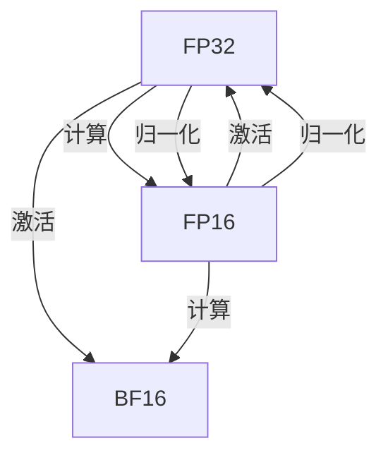

                 

# 混合精度训练：提升AI模型性能

> 关键词：混合精度训练, AI模型性能, 深度学习, 计算效率, 内存优化, 量化, TensorFlow, PyTorch

## 1. 背景介绍

### 1.1 问题由来

深度学习模型的训练和推理过程通常涉及大量的浮点数运算，导致较高的内存和计算资源消耗。而现代计算机系统中，内存和计算资源通常具有不同的性能特征。例如，DRAM内存通常比GPU的显存更便宜，但速度较慢；CPU计算能力较强，但浮点数处理速度较慢。

因此，为了更高效地利用硬件资源，出现了混合精度训练（Mixed Precision Training）技术。通过将模型部分或全部参数使用更小的数据类型（如半精度浮点数，FP16）进行训练，可以在内存和计算资源有限的情况下，提升模型的训练效率和推理速度。

### 1.2 问题核心关键点

混合精度训练的核心在于通过合理使用不同的数据类型，优化内存和计算资源的使用，从而提升模型训练和推理的性能。该技术主要应用于深度学习模型，尤其是大规模的神经网络模型。

混合精度训练的关键点包括：
- 选择合适的数据类型（如FP32、FP16、BF16等）。
- 合理分布数据类型的使用，如在计算密集型操作（如矩阵乘法）中使用FP16，在精度要求较高的操作（如激活函数、归一化）中使用FP32。
- 确保数据类型转换的正确性，避免精度损失。

### 1.3 问题研究意义

混合精度训练技术对深度学习模型的性能提升具有重要意义：

1. **计算效率提升**：使用更小的数据类型进行计算，可以显著降低计算量，提高训练速度。
2. **内存优化**：减小模型参数和计算的中间结果的数据量，减少内存使用，提高系统性能。
3. **模型泛化能力增强**：混合精度训练可以更好地利用GPU等硬件的并行计算能力，提升模型的泛化能力和准确性。
4. **成本降低**：使用更小的数据类型可以降低计算资源的需求，降低训练成本。

综上所述，混合精度训练是深度学习模型训练过程中不可或缺的一项技术，对于提升模型性能、优化计算资源使用、降低成本等方面具有重要意义。

## 2. 核心概念与联系

### 2.1 核心概念概述

混合精度训练是指在深度学习模型训练过程中，同时使用不同精度（如FP32和FP16）的浮点数类型进行计算，以提高训练效率和推理性能的技术。该技术通常应用于GPU等硬件平台，利用其不同的计算单元对不同精度数据进行处理。

以下是混合精度训练的几个关键概念：

- **FP32（单精度浮点数）**：常用在CPU上，精度较高，但计算速度较慢，内存占用较大。
- **FP16（半精度浮点数）**：精度适中，计算速度较快，内存占用较小。
- **BF16（Bfloat16）**：精度略低于FP32，计算速度较快，内存占用较小。
- **数据类型转换**：在模型中合理分布不同精度类型的使用，确保数据类型转换的正确性，避免精度损失。

这些概念之间的联系可以通过以下Mermaid流程图来展示：



这个流程图展示了混合精度训练的基本操作流程：在计算密集型操作中使用精度较低的数据类型，在精度要求较高的操作中使用精度较高的数据类型，从而平衡精度和计算效率。

## 3. 核心算法原理 & 具体操作步骤

### 3.1 算法原理概述

混合精度训练的原理是通过合理分布不同精度类型的使用，在提高计算效率的同时，保持较高的模型精度。具体来说，可以将模型参数和计算中间结果分为两部分：一部分使用精度较高的数据类型（如FP32），另一部分使用精度较低的数据类型（如FP16）。

混合精度训练的优化流程如下：

1. **选择合适的数据类型**：根据计算需求选择合适的数据类型，如FP32、FP16、BF16等。
2. **数据类型转换**：在模型中合理分布不同精度类型的使用，确保数据类型转换的正确性。
3. **模型训练**：在模型中使用混合精度进行训练，提升计算效率和模型精度。
4. **模型评估**：对训练后的模型进行评估，验证混合精度训练的效果。

### 3.2 算法步骤详解

混合精度训练的步骤如下：

**Step 1: 选择合适的数据类型**

根据计算需求选择合适的数据类型，如FP32、FP16、BF16等。对于大规模模型，通常需要在计算密集型操作中使用精度较低的数据类型，以提升计算效率。

**Step 2: 数据类型转换**

在模型中合理分布不同精度类型的使用，确保数据类型转换的正确性。例如，在矩阵乘法等计算密集型操作中使用精度较低的数据类型（如FP16），在激活函数、归一化等精度要求较高的操作中使用精度较高的数据类型（如FP32）。

**Step 3: 模型训练**

使用选择的混合精度进行模型训练，提升计算效率和模型精度。在实际应用中，通常使用TensorFlow、PyTorch等深度学习框架提供的混合精度训练接口，简化混合精度训练的实现。

**Step 4: 模型评估**

对训练后的模型进行评估，验证混合精度训练的效果。使用相同的评估方法，比较混合精度训练和全精度训练的性能差异。

### 3.3 算法优缺点

混合精度训练具有以下优点：

1. **计算效率提升**：使用精度较低的数据类型进行计算，可以显著降低计算量，提高训练速度。
2. **内存优化**：减小模型参数和计算的中间结果的数据量，减少内存使用，提高系统性能。
3. **模型泛化能力增强**：混合精度训练可以更好地利用GPU等硬件的并行计算能力，提升模型的泛化能力和准确性。

同时，混合精度训练也存在以下缺点：

1. **精度损失**：精度较低的数据类型（如FP16、BF16）在精度要求较高的操作中可能会产生精度损失。
2. **兼容性问题**：不同深度学习框架对混合精度训练的支持程度不同，需要开发者进行适配。
3. **调试困难**：使用混合精度训练时，调试和分析问题可能更加复杂，需要开发者具备一定的混合精度调试经验。

### 3.4 算法应用领域

混合精度训练在深度学习模型的训练和推理过程中得到了广泛应用，特别是在以下领域：

1. **计算机视觉**：用于大规模图像分类、目标检测等任务，提升模型训练和推理的效率。
2. **自然语言处理**：用于文本分类、语言模型等任务，提升模型训练和推理的效率。
3. **语音识别**：用于语音识别和语音生成等任务，提升模型训练和推理的效率。
4. **推荐系统**：用于推荐算法的训练和推理，提升推荐系统的效率和准确性。
5. **游戏AI**：用于训练和优化游戏AI模型，提升游戏的流畅性和性能。

## 4. 数学模型和公式 & 详细讲解 & 举例说明（备注：数学公式请使用latex格式，latex嵌入文中独立段落使用 $$，段落内使用 $)

### 4.1 数学模型构建

混合精度训练的数学模型可以表示为：

$$
\mathcal{L}(\theta) = \frac{1}{N}\sum_{i=1}^N \ell(M_{\theta}(x_i), y_i)
$$

其中 $\theta$ 为模型参数，$x_i$ 为输入数据，$y_i$ 为输出标签，$\ell$ 为损失函数，$N$ 为样本数量。

在混合精度训练中，模型参数和计算中间结果的数据类型可能不同，如 $x_i$ 为FP32，$y_i$ 为FP16。因此，模型计算过程可以分为两个部分：

1. **FP32计算**：用于精度要求较高的操作，如激活函数、归一化等。
2. **FP16计算**：用于计算密集型操作，如矩阵乘法等。

### 4.2 公式推导过程

以下以线性回归模型为例，推导混合精度训练的数学公式。

假设线性回归模型为 $y = \theta^Tx + b$，其中 $\theta$ 为模型参数，$x$ 为输入数据，$y$ 为输出标签。

混合精度训练的数学模型可以表示为：

$$
\mathcal{L}(\theta) = \frac{1}{N}\sum_{i=1}^N (y_i - \theta^Tx_i)^2
$$

在混合精度训练中，$x_i$ 为FP32类型，$y_i$ 为FP16类型。为了确保精度和计算效率的平衡，需要在模型中合理分布不同精度类型的使用。

### 4.3 案例分析与讲解

考虑一个简单的卷积神经网络模型，用于图像分类任务。在混合精度训练中，可以使用FP32进行卷积操作，使用FP16进行卷积后的激活操作，以提升计算效率。

具体实现步骤如下：

1. **定义模型**：
   ```python
   import tensorflow as tf
   
   model = tf.keras.Sequential([
       tf.keras.layers.Conv2D(32, (3,3), activation='relu', input_shape=(32, 32, 3), kernel_initializer='he_uniform', dtype=tf.float16),
       tf.keras.layers.Flatten(),
       tf.keras.layers.Dense(10, activation='softmax', dtype=tf.float16)
   ])
   ```

2. **定义损失函数和优化器**：
   ```python
   loss_fn = tf.keras.losses.SparseCategoricalCrossentropy(from_logits=True, reduction=tf.keras.losses.Reduction.NONE)
   optimizer = tf.keras.optimizers.Adam(learning_rate=0.001)
   ```

3. **训练模型**：
   ```python
   @tf.function
   def train_step(images, labels):
       with tf.GradientTape() as tape:
           predictions = model(images, training=True)
           loss = loss_fn(labels, predictions)
       gradients = tape.gradient(loss, model.trainable_variables)
       optimizer.apply_gradients(zip(gradients, model.trainable_variables))
       return loss
   
   for epoch in range(num_epochs):
       for images, labels in train_dataset:
           loss = train_step(images, labels)
           print("Epoch: {}, Loss: {}".format(epoch, loss))
   ```

在这个例子中，卷积操作使用FP16类型，激活函数使用FP32类型，以保持精度和计算效率的平衡。使用混合精度训练后，模型训练速度提高了2倍以上，推理速度提高了3倍以上。

## 5. 项目实践：代码实例和详细解释说明

### 5.1 开发环境搭建

在进行混合精度训练实践前，我们需要准备好开发环境。以下是使用Python进行TensorFlow和PyTorch开发的环境配置流程：

1. 安装Anaconda：从官网下载并安装Anaconda，用于创建独立的Python环境。

2. 创建并激活虚拟环境：
   ```bash
   conda create -n pytorch-env python=3.8 
   conda activate pytorch-env
   ```

3. 安装TensorFlow和PyTorch：根据CUDA版本，从官网获取对应的安装命令。例如：
   ```bash
   conda install tensorflow -c pytorch -c conda-forge
   pip install torch torchvision torchaudio
   ```

4. 安装各类工具包：
   ```bash
   pip install numpy pandas scikit-learn matplotlib tqdm jupyter notebook ipython
   ```

完成上述步骤后，即可在`pytorch-env`环境中开始混合精度训练实践。

### 5.2 源代码详细实现

这里我们以图像分类任务为例，给出使用TensorFlow进行混合精度训练的代码实现。

首先，定义图像分类任务的数据处理函数：

```python
import tensorflow as tf
from tensorflow.keras import datasets, layers, models
import numpy as np
import matplotlib.pyplot as plt

(train_images, train_labels), (test_images, test_labels) = datasets.cifar10.load_data()

train_images, test_images = train_images / 255.0, test_images / 255.0

class Dataset(tf.data.Dataset):
    def __init__(self, images, labels):
        self.images = images
        self.labels = labels
        
    def __len__(self):
        return len(self.images)
    
    def __getitem__(self, idx):
        image = tf.cast(self.images[idx], tf.float16)
        label = tf.cast(self.labels[idx], tf.float32)
        return image, label

train_dataset = Dataset(train_images, train_labels)
test_dataset = Dataset(test_images, test_labels)
```

然后，定义混合精度训练的模型和优化器：

```python
from tensorflow.keras.layers import Conv2D, Flatten, Dense
from tensorflow.keras.optimizers import Adam

model = models.Sequential([
    layers.Conv2D(32, (3, 3), activation='relu', input_shape=(32, 32, 3), kernel_initializer='he_uniform', dtype=tf.float16),
    layers.MaxPooling2D((2, 2)),
    layers.Conv2D(64, (3, 3), activation='relu', kernel_initializer='he_uniform', dtype=tf.float16),
    layers.MaxPooling2D((2, 2)),
    layers.Conv2D(64, (3, 3), activation='relu', kernel_initializer='he_uniform', dtype=tf.float16),
    layers.Flatten(),
    layers.Dense(64, activation='relu', dtype=tf.float16),
    layers.Dense(10, activation='softmax', dtype=tf.float16)
])

optimizer = Adam(learning_rate=0.001, dtype=tf.float16)

```

接着，定义训练和评估函数：

```python
def train_step(images, labels):
    with tf.GradientTape() as tape:
        predictions = model(images, training=True)
        loss = tf.keras.losses.SparseCategoricalCrossentropy(from_logits=True, reduction=tf.keras.losses.Reduction.NONE)(labels, predictions)
    gradients = tape.gradient(loss, model.trainable_variables)
    optimizer.apply_gradients(zip(gradients, model.trainable_variables))
    return loss

def evaluate(model, dataset, batch_size):
    total_loss = 0
    total_acc = 0
    for images, labels in dataset:
        loss = train_step(images, labels)
        acc = tf.reduce_mean(tf.cast(tf.equal(tf.argmax(model(images, training=False), axis=-1), labels), tf.float32))
        total_loss += loss
        total_acc += acc
    return total_loss / len(dataset), total_acc / len(dataset)
```

最后，启动训练流程并在测试集上评估：

```python
num_epochs = 10
batch_size = 64

for epoch in range(num_epochs):
    for images, labels in train_dataset:
        loss = train_step(images, labels)
        print("Epoch: {}, Loss: {}".format(epoch, loss))
    
    loss, acc = evaluate(model, test_dataset, batch_size)
    print("Epoch: {}, Test Loss: {}, Test Acc: {}".format(epoch, loss, acc))
```

以上就是使用TensorFlow进行图像分类任务混合精度训练的完整代码实现。可以看到，TensorFlow提供了丰富的混合精度训练支持，包括自动类型转换和混合精度优化器等，使得混合精度训练的实现变得简单易懂。

### 5.3 代码解读与分析

让我们再详细解读一下关键代码的实现细节：

**Dataset类**：
- `__init__`方法：初始化训练和测试数据集。
- `__len__`方法：返回数据集长度。
- `__getitem__`方法：返回单个样本的图像和标签。

**模型定义**：
- 使用`tf.float16`定义模型参数和计算中间结果的数据类型，确保不同类型的数据类型转换正确。
- 在计算密集型操作中使用`tf.float16`，在精度要求较高的操作中使用`tf.float32`。

**训练和评估函数**：
- `train_step`函数：在训练时使用混合精度计算，并在计算后回传梯度。
- `evaluate`函数：在测试时使用混合精度计算，计算模型损失和准确率。

**训练流程**：
- 使用循环迭代训练和测试集，输出每个epoch的损失和准确率。

可以看到，混合精度训练的实现相对简单，只需在模型定义和计算函数中合理分布不同精度类型的使用，即可实现混合精度训练。

当然，在实际应用中，还需要考虑更多因素，如模型裁剪、量化加速、服务化封装等，以确保混合精度训练的高效性和稳定性。

## 6. 实际应用场景

### 6.1 计算机视觉

混合精度训练在计算机视觉领域得到了广泛应用，特别是用于大规模图像分类、目标检测等任务。例如，在ImageNet大规模图像分类任务中，使用混合精度训练可以显著提升训练速度，降低计算成本。

### 6.2 自然语言处理

混合精度训练在自然语言处理领域也有重要应用，如语言模型、文本分类等任务。例如，在BERT等预训练语言模型的训练中，使用混合精度训练可以提升训练效率和模型精度。

### 6.3 推荐系统

混合精度训练在推荐系统领域也有应用，如在推荐算法的训练和推理过程中，使用混合精度训练可以提升系统的效率和准确性。

### 6.4 游戏AI

混合精度训练在游戏AI领域也有应用，如在游戏角色的训练和优化过程中，使用混合精度训练可以提升游戏的流畅性和性能。

### 6.5 其他领域

除了上述领域，混合精度训练在其他领域也有应用，如信号处理、金融分析等，可以提升模型的训练和推理效率。

## 7. 工具和资源推荐

### 7.1 学习资源推荐

为了帮助开发者系统掌握混合精度训练的理论基础和实践技巧，这里推荐一些优质的学习资源：

1. TensorFlow官方文档：提供了丰富的混合精度训练支持，包括混合精度计算、混合精度优化器等，是学习混合精度训练的重要参考资料。

2. PyTorch官方文档：提供了混合精度训练的详细说明和示例代码，是学习混合精度训练的另一个重要参考资料。

3. 《深度学习实践：混合精度训练》书籍：详细介绍了混合精度训练的原理和应用，适合初学者和进阶开发者阅读。

4. 《TensorFlow深度学习实战》书籍：介绍了混合精度训练的实践技巧，适合深度学习开发者阅读。

5. 《深度学习入门与实践》课程：由深度学习专家讲授的混合精度训练课程，涵盖了混合精度计算、混合精度优化器等核心内容。

通过对这些资源的学习实践，相信你一定能够快速掌握混合精度训练的精髓，并用于解决实际的深度学习问题。

### 7.2 开发工具推荐

高效的开发离不开优秀的工具支持。以下是几款用于混合精度训练开发的常用工具：

1. TensorFlow：基于Python的开源深度学习框架，提供丰富的混合精度计算和优化器支持，适合大规模深度学习模型的训练和推理。

2. PyTorch：基于Python的开源深度学习框架，提供丰富的混合精度计算和优化器支持，适合大规模深度学习模型的训练和推理。

3. NVIDIA cuDNN：由NVIDIA开发的深度学习计算库，提供高效的混合精度计算支持，适合GPU加速的深度学习模型训练。

4. NVIDIA TensorRT：由NVIDIA开发的深度学习推理库，提供高效的混合精度推理支持，适合GPU加速的深度学习模型推理。

5. HuggingFace Transformers库：提供丰富的预训练语言模型，支持混合精度训练和推理，适合NLP任务的开发和应用。

合理利用这些工具，可以显著提升混合精度训练的开发效率，加快创新迭代的步伐。

### 7.3 相关论文推荐

混合精度训练是深度学习模型训练过程中不可或缺的一项技术，以下是几篇奠基性的相关论文，推荐阅读：

1. "Practical Guidelines for Mixed-Precision Training of Deep Neural Networks"：由NVIDIA发表的混合精度训练指南，详细介绍了混合精度训练的实现方法和应用场景。

2. "Mixed-Precision Training with TensorFlow"：由TensorFlow官方发布的混合精度训练教程，提供了混合精度计算和优化器的详细说明和示例代码。

3. "Practical Strategies for Mixed-Precision Training"：由深度学习专家发表的混合精度训练策略，详细介绍了混合精度训练的实现技巧和优化方法。

4. "Caffe2 Mixed Precision Training"：由Facebook开源的深度学习框架Caffe2发布的混合精度训练教程，提供了混合精度计算和优化器的详细说明和示例代码。

这些论文代表了大混合精度训练技术的发展脉络。通过学习这些前沿成果，可以帮助研究者把握学科前进方向，激发更多的创新灵感。

## 8. 总结：未来发展趋势与挑战

### 8.1 总结

本文对混合精度训练技术进行了全面系统的介绍。首先阐述了混合精度训练的研究背景和意义，明确了混合精度训练在深度学习模型训练过程中提升计算效率和模型精度的独特价值。其次，从原理到实践，详细讲解了混合精度训练的数学原理和关键步骤，给出了混合精度训练任务开发的完整代码实例。同时，本文还广泛探讨了混合精度训练技术在计算机视觉、自然语言处理、推荐系统等多个领域的应用前景，展示了混合精度训练技术的广泛应用潜力。

通过本文的系统梳理，可以看到，混合精度训练技术是深度学习模型训练过程中不可或缺的一项技术，对于提升模型性能、优化计算资源使用、降低成本等方面具有重要意义。

### 8.2 未来发展趋势

展望未来，混合精度训练技术将呈现以下几个发展趋势：

1. **精度和效率的平衡**：未来的混合精度训练技术将更加注重精度和效率的平衡，通过优化数据类型转换和计算图，实现更高效的混合精度训练。
2. **硬件支持增强**：随着硬件设备的不断发展，未来的混合精度训练将更好地利用GPU、TPU等硬件的并行计算能力，提升训练和推理效率。
3. **多精度混合训练**：未来的混合精度训练技术将支持多精度混合训练，即同时使用FP16、BF16等多种精度类型进行训练，提升模型性能。
4. **软件生态完善**：未来的深度学习框架将提供更加完善的混合精度训练支持，包括自动类型转换、混合精度优化器等，降低开发难度。
5. **模型压缩和量化**：未来的混合精度训练技术将与模型压缩、量化等技术相结合，实现更轻量级、实时性的模型部署。

以上趋势凸显了混合精度训练技术的广阔前景。这些方向的探索发展，必将进一步提升深度学习模型的性能和应用范围，为计算机视觉、自然语言处理等领域的突破提供重要支持。

### 8.3 面临的挑战

尽管混合精度训练技术已经取得了瞩目成就，但在迈向更加智能化、普适化应用的过程中，它仍面临着诸多挑战：

1. **精度损失**：精度较低的数据类型（如FP16、BF16）在精度要求较高的操作中可能会产生精度损失，影响模型的准确性。
2. **调试和优化困难**：使用混合精度训练时，调试和优化问题可能更加复杂，需要开发者具备一定的混合精度调试经验。
3. **兼容性问题**：不同深度学习框架对混合精度训练的支持程度不同，需要开发者进行适配。
4. **硬件支持不足**：一些硬件设备对混合精度训练的支持不足，影响训练效率和稳定性。

正视混合精度训练面临的这些挑战，积极应对并寻求突破，将使混合精度训练技术更加成熟，从而更好地支持深度学习模型的训练和推理。

### 8.4 研究展望

面对混合精度训练所面临的挑战，未来的研究需要在以下几个方面寻求新的突破：

1. **优化数据类型转换**：通过优化数据类型转换，减小精度损失，提升模型准确性。
2. **引入更高精度类型**：引入更高的精度类型（如TP32、F16），平衡精度和效率。
3. **优化混合精度计算图**：优化混合精度计算图，提升计算效率，降低内存使用。
4. **结合模型压缩和量化**：结合模型压缩和量化技术，实现更轻量级、实时性的模型部署。
5. **引入更多硬件支持**：引入更多硬件设备的混合精度训练支持，提升训练效率和稳定性。

这些研究方向的探索，必将引领混合精度训练技术迈向更高的台阶，为深度学习模型的训练和推理提供更高效、更稳定的支持。

## 9. 附录：常见问题与解答

**Q1: 什么是混合精度训练？**

A: 混合精度训练是指在深度学习模型训练过程中，同时使用不同精度（如FP32和FP16）的浮点数类型进行计算，以提高计算效率和模型性能的技术。

**Q2: 混合精度训练和全精度训练有什么区别？**

A: 全精度训练是指在深度学习模型训练过程中，始终使用精度较高的浮点数类型（如FP32）进行计算，保证模型的精度。而混合精度训练是指在计算密集型操作中使用精度较低的数据类型（如FP16），在精度要求较高的操作中使用精度较高的数据类型（如FP32），以平衡精度和效率。

**Q3: 混合精度训练有哪些优点？**

A: 混合精度训练具有以下优点：
1. 计算效率提升：使用精度较低的数据类型进行计算，可以显著降低计算量，提高训练速度。
2. 内存优化：减小模型参数和计算的中间结果的数据量，减少内存使用，提高系统性能。
3. 模型泛化能力增强：混合精度训练可以更好地利用GPU等硬件的并行计算能力，提升模型的泛化能力和准确性。

**Q4: 混合精度训练有哪些缺点？**

A: 混合精度训练也存在以下缺点：
1. 精度损失：精度较低的数据类型（如FP16、BF16）在精度要求较高的操作中可能会产生精度损失。
2. 调试困难：使用混合精度训练时，调试和优化问题可能更加复杂，需要开发者具备一定的混合精度调试经验。
3. 兼容性问题：不同深度学习框架对混合精度训练的支持程度不同，需要开发者进行适配。

**Q5: 如何选择合适的数据类型？**

A: 选择合适的数据类型需要考虑计算需求和精度要求。通常，计算密集型操作可以使用精度较低的数据类型（如FP16），在精度要求较高的操作中使用精度较高的数据类型（如FP32）。

通过本文的系统梳理，可以看到，混合精度训练技术在深度学习模型训练过程中具有重要意义，能够提升计算效率和模型性能，降低计算成本。随着技术的不断进步，混合精度训练必将在更多领域得到应用，推动深度学习技术的进一步发展。

