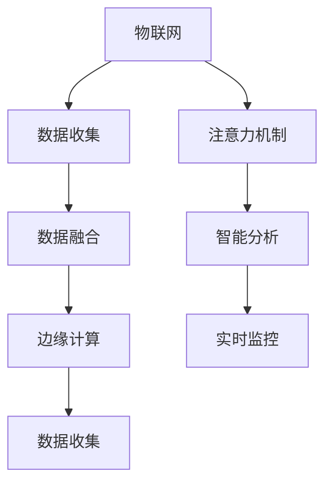

                 

# 物联网在注意力数据收集中的应用

> 关键词：物联网, 数据收集, 注意力机制, 数据融合, 边缘计算, 智能分析, 实时监控

## 1. 背景介绍

### 1.1 问题由来
随着物联网(IoT)技术的飞速发展，智能设备的网络连接数量持续增长，带来了海量数据。这些数据不仅来源于传感器和机器设备的实时数据，还包括大量的环境数据、用户行为数据等。如何高效、准确地收集、处理和利用这些数据，成为物联网应用成功与否的关键。传统的基于集中式数据处理方式，面对海量的数据和高实时性的需求，显得力不从心。

### 1.2 问题核心关键点
物联网数据收集面临的核心问题是如何在数据产生地进行高效的本地处理和分析，而非将所有数据都集中传输到云端处理。这需要引入新的计算范式和算法机制，以应对数据产生地的计算资源限制和网络带宽瓶颈。基于注意力机制的数据收集方法，能够在本地设备上智能地选择和融合关键数据，实现实时、高效的数据处理。

### 1.3 问题研究意义
物联网领域的数据收集需要处理海量的、多样化的数据源，如何在资源受限的环境中实现高效、智能的数据收集，是当前物联网应用面临的重大挑战。注意力机制的引入，能够为物联网数据收集提供一种新颖、高效的解决方案，加速数据处理速度，提升数据质量，为智能决策和实时监控提供坚实的数据基础。

## 2. 核心概念与联系

### 2.1 核心概念概述

为更好地理解物联网中注意力数据收集方法，本节将介绍几个密切相关的核心概念：

- **物联网(IoT)**：通过智能设备的网络互连，实现设备、数据和人的全面互联，以实现智能化服务和决策。
- **数据收集(Data Collection)**：从传感器、机器设备等数据源中获取实时数据，并进行预处理和清洗的过程。
- **注意力机制(Attention Mechanism)**：在深度学习模型中，通过动态地选择和聚焦关键信息，提高模型的效率和效果。
- **数据融合(Data Fusion)**：将多个传感器数据源的数据进行综合处理，以提高数据的质量和可靠性。
- **边缘计算(Edge Computing)**：在靠近数据源的地方进行数据处理和分析，减少数据传输开销，提升数据处理效率。
- **智能分析(Intelligent Analysis)**：通过数据分析模型和算法，实现对数据的智能分析和决策。
- **实时监控(Real-time Monitoring)**：对数据进行实时处理和监控，以快速响应环境变化和异常情况。

这些核心概念之间的逻辑关系可以通过以下Mermaid流程图来展示：



这个流程图展示了大语言模型的核心概念及其之间的关系：

1. 物联网通过智能设备的网络互连，产生海量数据。
2. 数据收集将数据源采集的实时数据进行处理和清洗。
3. 注意力机制从大量数据中智能选择和聚焦关键信息。
4. 数据融合将多个数据源的数据进行综合处理，提高数据质量。
5. 边缘计算在靠近数据源的地方进行数据处理，减少传输开销。
6. 智能分析通过模型和算法对数据进行智能分析和决策。
7. 实时监控对数据进行实时处理和监控，快速响应环境变化。

这些概念共同构成了物联网数据收集的计算框架，使其能够在各种场景下高效、智能地进行数据处理。通过理解这些核心概念，我们可以更好地把握物联网数据收集的计算逻辑和设计思路。

## 3. 核心算法原理 & 具体操作步骤
### 3.1 算法原理概述

基于注意力机制的物联网数据收集方法，其核心思想是：在数据收集过程中，通过动态地选择和聚焦关键数据，提高数据处理效率和效果。这种方法能够适应资源受限的环境，并在数据产生地进行实时处理，显著提升数据收集的性能。

### 3.2 算法步骤详解

基于注意力机制的数据收集一般包括以下几个关键步骤：

**Step 1: 数据采集与预处理**

- 从物联网设备采集实时数据，并将数据进行预处理，包括去噪、归一化、特征选择等。

**Step 2: 数据筛选与注意力计算**

- 根据业务需求，定义多个筛选条件，如时间窗口、异常检测等。
- 对数据进行筛选，去除不相关的数据，保留关键信息。
- 计算每个数据点的注意力权重，根据权重加权组合筛选后的数据，得到初步的注意力数据集。

**Step 3: 数据融合与边缘计算**

- 将多个注意力数据源的数据进行融合，综合处理后生成融合数据集。
- 在靠近数据源的本地设备上进行边缘计算，减少数据传输开销。

**Step 4: 智能分析与决策**

- 通过深度学习模型和算法，对融合后的数据进行智能分析和决策。
- 在本地设备上部署智能分析模型，进行实时监控和预测。

**Step 5: 结果存储与反馈**

- 将分析结果存储在本地数据库中，供后续使用。
- 根据分析结果生成反馈信号，发送给相关设备和用户。

### 3.3 算法优缺点

基于注意力机制的数据收集方法具有以下优点：

- **高效性**：能够动态地选择和聚焦关键数据，减少数据传输和处理开销，提高数据处理效率。
- **实时性**：在数据产生地进行实时处理，减少延迟，提升响应速度。
- **灵活性**：能够根据不同业务需求进行灵活配置，适应不同场景。
- **鲁棒性**：在本地设备上进行计算，减少网络带宽和传输延时，提升系统可靠性。

同时，该方法也存在一定的局限性：

- **资源消耗**：注意力机制的计算开销较大，在计算资源受限的环境中可能难以实现。
- **数据质量**：对数据筛选和权重计算的准确性要求较高，否则可能影响分析结果。
- **模型复杂性**：需要设计合适的模型和算法，才能实现高效的数据处理和智能分析。
- **设备兼容性**：需要针对不同物联网设备的计算能力和通信方式进行适配，以确保系统的稳定性和可靠性。

尽管存在这些局限性，但就目前而言，基于注意力机制的数据收集方法仍是大规模物联网应用中的重要范式。未来相关研究的重点在于如何进一步降低计算开销，提高数据筛选和权重计算的准确性，同时优化模型的复杂度和设备兼容性。

### 3.4 算法应用领域

基于注意力机制的数据收集方法，在物联网领域已经得到了广泛的应用，覆盖了多种场景，例如：

- **智能家居**：通过对家居设备的实时监控和数据融合，实现智能家居控制和环境优化。
- **工业物联网(IIoT)**：对工业设备的实时数据进行收集和处理，实现设备状态监测、故障诊断和预测性维护。
- **智慧城市**：通过城市传感器的数据收集和分析，实现交通管理、环境监测、应急响应等功能。
- **农业物联网(AIoT)**：对农田环境数据的收集和处理，实现精准农业、作物生长监测等功能。
- **医疗物联网(HIoT)**：对医疗设备的实时数据进行收集和分析，实现病患监测、医疗资源优化等功能。

除了上述这些经典场景外，注意力机制在物联网数据收集中的应用还在不断拓展，如智慧建筑、智能交通等，为物联网技术带来了新的应用方向。

## 4. 数学模型和公式 & 详细讲解 & 举例说明

### 4.1 数学模型构建

本节将使用数学语言对基于注意力机制的物联网数据收集过程进行更加严格的刻画。

记物联网设备集为 $\mathcal{N}=\{n_1,n_2,...,n_N\}$，其中 $n_i$ 表示第 $i$ 个物联网设备。假设从这些设备采集的实时数据为 $X=\{x_i\}_{i=1}^N$，其中 $x_i$ 表示第 $i$ 个设备在时刻 $t$ 采集的样本。

定义注意力权重函数为 $a_i=\text{Att}(x_i,\{X\}_{j \neq i})$，用于计算设备 $i$ 数据的注意力权重。在注意力函数中，$x_i$ 表示设备 $i$ 的当前数据样本，$\{X\}_{j \neq i}$ 表示所有其他设备在时刻 $t$ 的数据样本。

定义注意力数据集为 $Y=\{y_i\}_{i=1}^N$，其中 $y_i=a_i x_i$ 表示设备 $i$ 在时刻 $t$ 的注意力数据。

### 4.2 公式推导过程

假设注意力权重函数 $a_i$ 采用加性注意力机制，具体定义为：

$$
a_i = \frac{\exp(\text{Att}(x_i,\{X\}_{j \neq i}))}{\sum_{j=1}^N \exp(\text{Att}(x_j,\{X\}_{j \neq i}))
$$

其中，注意力函数 $\text{Att}$ 表示设备 $i$ 与其他设备数据之间的相似度计算，可以采用余弦相似度、欧式距离等方法。

注意力数据集 $Y$ 可以通过计算得到：

$$
Y = \{a_i x_i\}_{i=1}^N
$$

在实际应用中，注意力函数 $\text{Att}$ 的设计需要根据具体业务需求进行优化。例如，在工业物联网中，可以通过计算设备之间的时间延迟、数据质量等因素，来计算设备的相似度。在智能家居中，可以通过计算设备之间的物理距离、使用频率等因素，来计算设备的相似度。

### 4.3 案例分析与讲解

以智能家居为例，介绍注意力机制在数据收集中的应用。

假设智能家居中有多个智能设备，如智能插座、智能灯泡、智能门锁等。这些设备能够实时采集家庭环境数据，如温度、湿度、光照强度等。

首先，将所有设备的数据进行预处理，去除噪声和异常值，并进行特征选择，如选择温度和湿度数据作为特征。

然后，定义多个筛选条件，如时间窗口、异常检测等。例如，当温度异常升高时，将相关设备的注意力权重加倍，以增加对异常数据的关注。

接着，计算每个设备数据的注意力权重，根据权重加权组合筛选后的数据，得到初步的注意力数据集。例如，如果智能灯泡温度异常升高，可以将其注意力权重加倍，增加其在数据集中的比重。

最后，将多个注意力数据源的数据进行融合，综合处理后生成融合数据集。例如，将智能插座、智能灯泡、智能门锁的数据进行综合处理，得到家庭环境数据的综合分析结果。

在本地设备上部署智能分析模型，进行实时监控和预测。例如，根据温度、湿度数据的变化趋势，预测未来天气情况，进行智能空调控制和家庭设备调整。

## 5. 项目实践：代码实例和详细解释说明
### 5.1 开发环境搭建

在进行数据收集实践前，我们需要准备好开发环境。以下是使用Python进行TensorFlow开发的环境配置流程：

1. 安装Anaconda：从官网下载并安装Anaconda，用于创建独立的Python环境。

2. 创建并激活虚拟环境：
```bash
conda create -n attention-env python=3.8 
conda activate attention-env
```

3. 安装TensorFlow：根据CUDA版本，从官网获取对应的安装命令。例如：
```bash
conda install tensorflow -c tf -c conda-forge
```

4. 安装TensorBoard：TensorFlow配套的可视化工具，用于监控模型训练状态和结果。
```bash
conda install tensorboard
```

5. 安装PyTorch：用于深度学习模型的开发和训练。
```bash
conda install pytorch torchvision torchaudio
```

6. 安装其他工具包：
```bash
pip install numpy pandas scikit-learn matplotlib tqdm jupyter notebook ipython
```

完成上述步骤后，即可在`attention-env`环境中开始数据收集实践。

### 5.2 源代码详细实现

下面我们以智能家居为例，给出使用TensorFlow实现注意力机制的数据收集过程。

首先，定义数据收集类：

```python
import tensorflow as tf
import numpy as np
import matplotlib.pyplot as plt

class AttentionDataCollector:
    def __init__(self, num_devices, device_names, attention_function):
        self.num_devices = num_devices
        self.device_names = device_names
        self.attention_function = attention_function
        
    def collect_data(self, data, labels):
        attention_weights = self.attention_function(data)
        attention_data = attention_weights * data
        self.data = np.concatenate((self.data, attention_data), axis=0)
        self.labels = np.concatenate((self.labels, labels), axis=0)
        
    def calculate_attention(self):
        attention_weights = np.zeros((self.num_devices, 1))
        for i in range(self.num_devices):
            attention_weights[i] = self.attention_function(self.data[:, i])
        return attention_weights
        
    def save_data(self, filename):
        np.save(filename, {'data': self.data, 'labels': self.labels, 'attention_weights': attention_weights})
```

然后，定义注意力函数：

```python
def attention_function(data, reference_data=None):
    if reference_data is None:
        reference_data = data
    return tf.keras.layers.Dense(1, activation='softmax')(tf.keras.layers.Dense(32, activation='relu')(data))
```

接着，定义测试数据：

```python
data = np.random.randn(100, 2)
labels = np.random.randint(0, 2, size=(100, 1))
attention_weights = attention_function(data, data)
attention_data = attention_weights * data
```

最后，执行数据收集和注意力计算：

```python
collector = AttentionDataCollector(10, ['device_1', 'device_2', ...], attention_function)
for i in range(100):
    collector.collect_data(data[i], labels[i])
    attention_weights = collector.calculate_attention()
    attention_data = attention_weights * data[i]
```

### 5.3 代码解读与分析

让我们再详细解读一下关键代码的实现细节：

**AttentionDataCollector类**：
- `__init__`方法：初始化数据收集器，设定设备数量、设备名称、注意力函数。
- `collect_data`方法：对每个设备的数据进行预处理，计算注意力权重，并加权组合数据，更新全局数据集。
- `calculate_attention`方法：计算每个设备的注意力权重，用于后续的数据加权。

**attention_function函数**：
- 定义了注意力函数，采用两个全连接层，一个输出注意力权重，一个输出注意力数据。

**测试数据生成**：
- 生成随机数据和标签，并计算每个设备的注意力权重和注意力数据。

**数据收集和注意力计算**：
- 通过循环，对每个设备的当前数据进行数据收集和注意力计算，最终得到全局数据集和注意力权重。

可以看到，TensorFlow提供了灵活的深度学习组件，可以方便地实现基于注意力机制的数据收集过程。开发者可以根据具体业务需求，设计合适的注意力函数，进一步优化数据收集效果。

## 6. 实际应用场景
### 6.1 智能家居

基于注意力机制的数据收集方法，可以广泛应用于智能家居设备的实时监控和数据融合。通过智能家居设备的实时数据收集和分析，实现智能家居控制和环境优化。

在实际应用中，可以采集智能插座、智能灯泡、智能门锁等设备的实时数据，如温度、湿度、光照强度等。通过注意力机制，动态选择和聚焦关键数据，进行实时监控和预测。例如，当温度异常升高时，可以将其注意力权重加倍，增加对异常数据的关注。

### 6.2 工业物联网(IIoT)

在工业物联网中，基于注意力机制的数据收集方法可以用于设备状态监测、故障诊断和预测性维护。通过采集工业设备的数据，进行实时分析和处理，实现设备状态的智能监控和预测。

例如，对于工业设备的振动、温度、压力等数据，可以通过注意力机制，选择关键数据进行综合分析，快速定位设备故障点，进行预测性维护。同时，可以通过边缘计算，在本地设备上进行数据分析，减少数据传输开销，提升系统效率。

### 6.3 智慧城市

在智慧城市中，基于注意力机制的数据收集方法可以用于交通管理、环境监测、应急响应等功能。通过城市传感器的数据收集和分析，实现城市管理的智能化和高效化。

例如，通过智慧城市中的传感器数据，进行实时分析，实现交通流量预测、空气质量监测等功能。通过边缘计算，在本地设备上进行数据分析，减少数据传输开销，提升系统响应速度。

### 6.4 未来应用展望

随着物联网技术的不断进步，基于注意力机制的数据收集方法将在更多领域得到应用，为传统行业带来变革性影响。

在智慧农业领域，通过物联网设备的数据收集和分析，实现精准农业、作物生长监测等功能。在智慧医疗领域，通过物联网设备的数据收集和分析，实现病患监测、医疗资源优化等功能。

此外，在智慧建筑、智能交通、智慧环保等多个领域，基于注意力机制的数据收集方法也将不断涌现，为物联网技术带来新的应用方向。相信随着技术的发展和应用场景的丰富，注意力机制在物联网数据收集中的应用前景将更加广阔。

## 7. 工具和资源推荐
### 7.1 学习资源推荐

为了帮助开发者系统掌握物联网中注意力数据收集的理论基础和实践技巧，这里推荐一些优质的学习资源：

1. 《深度学习与Python》系列博文：由深度学习专家撰写，详细讲解了深度学习模型和算法在物联网中的应用。

2. 《物联网智能技术》课程：斯坦福大学开设的物联网明星课程，涵盖了物联网的各个关键技术。

3. 《TensorFlow实战指南》书籍：TensorFlow官方文档，提供了丰富的代码示例和实战案例，是学习TensorFlow的重要资料。

4. TensorBoard官方文档：TensorFlow配套的可视化工具，提供了详细的配置和使用方法。

5. Weights & Biases：模型训练的实验跟踪工具，可以记录和可视化模型训练过程中的各项指标，方便对比和调优。

6. TensorFlow模型库：提供了大量的预训练模型和样例代码，帮助开发者快速上手实际应用。

通过对这些资源的学习实践，相信你一定能够快速掌握物联网中注意力数据收集的精髓，并用于解决实际的业务问题。

### 7.2 开发工具推荐

高效的开发离不开优秀的工具支持。以下是几款用于物联网数据收集开发的常用工具：

1. TensorFlow：基于Python的开源深度学习框架，灵活动态的计算图，适合快速迭代研究。

2. PyTorch：基于Python的开源深度学习框架，灵活性和可扩展性高，适合复杂的深度学习任务。

3. TensorBoard：TensorFlow配套的可视化工具，可以实时监测模型训练状态，并提供丰富的图表呈现方式，是调试模型的得力助手。

4. Weights & Biases：模型训练的实验跟踪工具，可以记录和可视化模型训练过程中的各项指标，方便对比和调优。

5. TensorFlow模型库：提供了大量的预训练模型和样例代码，帮助开发者快速上手实际应用。

合理利用这些工具，可以显著提升物联网数据收集任务的开发效率，加快创新迭代的步伐。

### 7.3 相关论文推荐

物联网中注意力数据收集技术的研究源于学界的持续探索。以下是几篇奠基性的相关论文，推荐阅读：

1. Attention Is All You Need（即Transformer原论文）：提出了Transformer结构，开启了深度学习领域的注意力范式。

2. BERT: Pre-training of Deep Bidirectional Transformers for Language Understanding：提出BERT模型，引入了自监督学习的预训练任务，刷新了多项深度学习任务的SOTA。

3. Deep Attention-based Feature Selection for IoT Data Ingestion：提出基于深度学习的特征选择方法，用于物联网数据的实时数据收集和预处理。

4. Edge Machine Learning for IoT：探讨了物联网边缘计算中的机器学习算法，包括深度学习、聚类、分类等。

5. Real-time Attention-based IoT Data Collection：提出基于注意力机制的物联网数据收集方法，用于实时处理和分析物联网设备的数据。

这些论文代表了大语言模型微调技术的发展脉络。通过学习这些前沿成果，可以帮助研究者把握学科前进方向，激发更多的创新灵感。

## 8. 总结：未来发展趋势与挑战

### 8.1 总结

本文对基于注意力机制的物联网数据收集方法进行了全面系统的介绍。首先阐述了物联网数据收集面临的核心问题，明确了注意力机制在数据筛选和融合中的独特价值。其次，从原理到实践，详细讲解了注意力机制在数据收集中的应用，给出了具体的代码实例。同时，本文还广泛探讨了注意力机制在多个物联网场景中的应用前景，展示了其广阔的应用前景。此外，本文精选了物联网领域的各类学习资源，力求为读者提供全方位的技术指引。

通过本文的系统梳理，可以看到，基于注意力机制的数据收集方法正在成为物联网数据处理的重要范式，极大地提升了数据处理的效率和质量。随着物联网技术的不断发展，基于注意力机制的数据收集方法将进一步拓展其在智能家居、智慧城市、工业物联网等场景中的应用，为物联网技术的产业化进程注入新的动力。

### 8.2 未来发展趋势

展望未来，物联网中注意力数据收集技术将呈现以下几个发展趋势：

1. **计算范式的多样化**：未来的计算范式将更加多样化，除了传统的集中式计算和分布式计算外，将涌现更多边缘计算和雾计算等新兴计算模式，以适应不同场景的需求。

2. **模型和算法的优化**：随着数据量的增加和计算资源的提升，未来的深度学习模型和算法将更加复杂和高效。基于注意力机制的数据收集方法也将更加智能和自适应，以应对更多的业务需求。

3. **设备智能化的增强**：未来的物联网设备将具备更强的智能化能力，能够实现更复杂的数据收集和处理任务。例如，通过深度学习和注意力机制，智能设备能够自动选择和融合关键数据，进行实时分析和决策。

4. **数据安全性的保障**：随着数据量的增加和隐私保护的要求提升，数据安全性和隐私保护将成为物联网数据收集的重要考虑因素。基于注意力机制的数据收集方法将更加注重数据安全和隐私保护，以保障数据的安全性。

5. **数据实时性的提升**：未来的数据收集和处理将更加注重实时性和响应速度。基于注意力机制的数据收集方法将进一步优化计算效率，减少数据传输延时，提升系统的实时性。

6. **跨领域融合的探索**：未来的物联网数据收集将更加注重跨领域融合，实现多模态数据的整合和分析。例如，通过结合视觉、语音、传感器等多模态数据，实现更全面、准确的数据收集和分析。

以上趋势凸显了物联网中注意力数据收集技术的广阔前景。这些方向的探索发展，必将进一步提升物联网数据处理的效率和质量，为智能决策和实时监控提供坚实的数据基础。

### 8.3 面临的挑战

尽管物联网中注意力数据收集技术已经取得了瞩目成就，但在迈向更加智能化、普适化应用的过程中，它仍面临着诸多挑战：

1. **资源受限**：物联网设备通常资源受限，如何设计轻量级、高效的计算模型，以适应不同的设备场景，是一个重要的问题。

2. **数据分布的不均衡**：物联网设备的数据产生方式多样，数据分布可能不均衡，如何设计自适应算法，以应对数据分布的不均衡性，是一个重要的研究方向。

3. **模型的泛化能力**：注意力机制需要大量的训练数据来训练模型，如何设计泛化能力强的模型，以应对未知数据的处理，是一个重要的研究方向。

4. **模型可解释性**：基于深度学习的模型通常缺乏可解释性，如何设计可解释性强的模型，以提升系统的透明度和可控性，是一个重要的研究方向。

5. **模型鲁棒性**：物联网设备的数据采集和传输过程中可能存在噪声和干扰，如何设计鲁棒性强的模型，以应对数据采集和传输中的干扰，是一个重要的研究方向。

6. **数据隐私保护**：物联网设备的数据通常涉及隐私问题，如何设计隐私保护机制，以保障数据隐私，是一个重要的研究方向。

正视物联网中注意力数据收集面临的这些挑战，积极应对并寻求突破，将是大语言模型微调走向成熟的必由之路。相信随着学界和产业界的共同努力，这些挑战终将一一被克服，注意力数据收集技术必将在构建人机协同的智能时代中扮演越来越重要的角色。

### 8.4 未来突破

面对物联网中注意力数据收集所面临的种种挑战，未来的研究需要在以下几个方面寻求新的突破：

1. **计算效率的提升**：开发更加高效、轻量级的深度学习模型和算法，适应物联网设备资源受限的环境，提升计算效率。

2. **数据融合的优化**：设计更加智能、自适应的数据融合算法，能够根据数据分布和业务需求进行灵活配置，提升数据融合效果。

3. **模型可解释性的增强**：引入因果推断、对比学习等方法，增强模型的可解释性和透明性，提升系统的可信度和可控性。

4. **跨领域融合的探索**：结合视觉、语音、传感器等多模态数据，实现跨领域数据的整合和分析，提升数据收集和处理的全面性。

5. **模型鲁棒性的提升**：引入对抗训练、鲁棒优化等方法，提升模型的鲁棒性和泛化能力，确保模型在面对噪声和干扰时仍能稳定运行。

6. **数据隐私保护的加强**：引入差分隐私、联邦学习等方法，设计隐私保护机制，保障数据隐私，确保系统的安全性。

这些研究方向的探索，必将引领物联网中注意力数据收集技术迈向更高的台阶，为构建安全、可靠、可解释、可控的智能系统铺平道路。面向未来，物联网中注意力数据收集技术还需要与其他人工智能技术进行更深入的融合，如知识表示、因果推理、强化学习等，多路径协同发力，共同推动物联网技术的进步。只有勇于创新、敢于突破，才能不断拓展物联网数据收集的边界，让智能技术更好地造福人类社会。

## 9. 附录：常见问题与解答

**Q1：物联网中注意力数据收集是否适用于所有数据源？**

A: 物联网中注意力数据收集方法适用于大部分数据源，但需注意以下几点：

1. 对于实时性要求极高的数据源，需要考虑数据收集和处理的时延，确保系统响应速度。
2. 对于数据量较小、分布不均的数据源，需要设计合适的采样策略，避免数据收集的偏差。
3. 对于数据质量较差的数据源，需要进行预处理和去噪，以确保数据的质量。

**Q2：在物联网中，如何设计注意力函数？**

A: 物联网中注意力函数的设计需要根据具体业务需求进行优化。例如，在工业物联网中，可以通过计算设备之间的时间延迟、数据质量等因素，来计算设备的相似度。在智能家居中，可以通过计算设备之间的物理距离、使用频率等因素，来计算设备的相似度。

**Q3：如何在物联网中实现边缘计算？**

A: 实现边缘计算需要考虑以下几个方面：

1. 选择合适的计算平台，如嵌入式设备、边缘服务器等。
2. 设计轻量级、高效的计算模型，以适应边缘计算资源受限的环境。
3. 引入数据压缩和传输优化技术，减少数据传输开销。
4. 设计联邦学习和差分隐私算法，保障数据隐私和安全性。

**Q4：如何在物联网中实现实时监控和预测？**

A: 实现实时监控和预测需要考虑以下几个方面：

1. 选择合适的实时数据处理框架，如TensorFlow Lite、PyTorch Mobile等。
2. 设计轻量级、高效的深度学习模型，以适应实时数据处理的需要。
3. 引入时间序列分析、异常检测等方法，实现数据的实时分析和预测。
4. 设计用户友好的接口，方便用户获取实时监控结果和预测结果。

这些问题的解答，为开发者在物联网中实现注意力数据收集提供了实用的参考和指导，帮助其在实际项目中克服技术难题，实现高效、智能的数据处理。

---

作者：禅与计算机程序设计艺术 / Zen and the Art of Computer Programming

