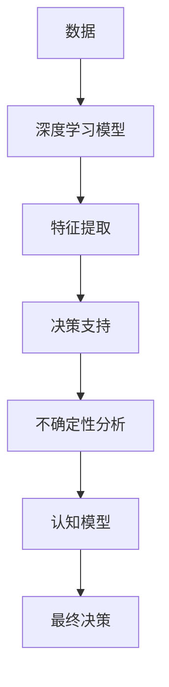

                 

# 理解洞察力的价值：在不确定性中的优势

> 关键词：洞察力,不确定性,人工智能,决策支持,深度学习,认知心理学,复杂系统

## 1. 背景介绍

### 1.1 问题由来

在当今快速变化且充满不确定性的世界，人类面临着前所未有的挑战。无论是商业决策、社会管理还是个人生活中的选择，洞察力的价值已经变得愈发重要。随着人工智能和大数据分析技术的发展，洞察力正在被赋予全新的内涵和实现方式。

过去，洞察力往往依赖于人类经验、直觉和长期积累的知识。然而，在数据爆炸的时代，如何从海量的信息中提取有价值的洞察，成为决策者和分析师亟待解决的问题。深度学习等新兴人工智能技术，为洞察力的获取提供了全新的工具和方法。本文将深入探讨这些技术如何帮助人们在不确定性中做出更明智的决策。

### 1.2 问题核心关键点

本文将围绕以下几个关键点展开：

- **深度学习与洞察力**：深度学习如何通过模型训练自动提取数据中的模式和规律。
- **不确定性下的决策**：在数据不完全或环境变化时，深度学习模型如何辅助决策。
- **认知心理学视角**：人类如何理解和应用深度学习模型提供的信息。
- **案例分析**：深度学习模型在不同应用场景中的实际效果。

## 2. 核心概念与联系

### 2.1 核心概念概述

深度学习作为人工智能的分支，其核心在于构建具有多个隐层的前馈神经网络模型，通过大量数据训练，自动学习特征表示，并最终用于决策和预测。在深度学习中，洞察力主要体现为模型能够自动发现数据中的模式和规律，并在不完全信息下做出合理预测。

本文将结合深度学习模型，从认知心理学和复杂系统的角度，探讨如何在不确定性环境中获取和应用洞察力。

### 2.2 核心概念原理和架构的 Mermaid 流程图



这个流程图展示了深度学习模型在数据处理、特征提取、决策支持、不确定性分析和最终决策中的作用。认知模型则用于解释和应用这些信息，辅助决策者理解模型输出的意义。

## 3. 核心算法原理 & 具体操作步骤

### 3.1 算法原理概述

深度学习模型通常通过反向传播算法进行训练，利用大量数据自动提取特征，并用于预测和决策。其核心算法包括前向传播、损失函数计算、反向传播和优化器更新。

在决策过程中，深度学习模型通常被用作数据的“黑箱”，即输入数据后，模型自动输出预测结果。这种“黑箱”性质使得决策者在应用模型时，难以理解模型的内部工作机制，依赖模型的输出作为决策依据。

### 3.2 算法步骤详解

深度学习模型的训练和决策步骤如下：

1. **数据准备**：收集和清洗数据，划分为训练集、验证集和测试集。
2. **模型选择与搭建**：选择合适的深度学习模型，如卷积神经网络(CNN)、循环神经网络(RNN)、变分自编码器(VAE)等，并搭建模型结构。
3. **模型训练**：使用训练集进行前向传播和反向传播，计算损失函数并优化参数。
4. **模型评估**：在验证集上评估模型性能，调整模型超参数。
5. **模型应用**：在测试集上应用模型进行预测，并结合认知模型解释结果。

### 3.3 算法优缺点

深度学习模型在处理大规模数据时具有优势，能够自动提取数据中的复杂模式。然而，其“黑箱”性质可能导致决策者对模型输出的不信任。此外，深度学习模型对数据质量和训练样本的依赖较大，模型泛化能力有限。

### 3.4 算法应用领域

深度学习模型广泛应用于图像识别、语音识别、自然语言处理、推荐系统、金融预测等领域，通过提取和应用数据中的洞察力，辅助决策和预测。

## 4. 数学模型和公式 & 详细讲解 & 举例说明

### 4.1 数学模型构建

深度学习模型的核心是神经网络，通常由输入层、多个隐层和输出层组成。以卷积神经网络为例，其数学模型可表示为：

$$
y = \sigma(W_{out} \cdot \sigma(W_{l} \cdot \sigma(W_{l-1} \cdot \ldots \cdot \sigma(W_{1} \cdot x + b_{1}) + b_{2}) + b_{3})
$$

其中 $x$ 为输入数据，$y$ 为输出，$W$ 和 $b$ 分别为权重和偏置，$\sigma$ 为激活函数。

### 4.2 公式推导过程

以最简单的单层感知器为例，推导其前向传播过程：

$$
y = W \cdot x + b
$$

其中 $W$ 和 $b$ 分别为权重和偏置，$x$ 为输入向量。

### 4.3 案例分析与讲解

以图像分类为例，深度学习模型通过卷积层、池化层和全连接层，自动提取图像中的特征，并进行分类。如图像中的边缘、角点、纹理等特征，会被卷积层捕捉并传递到下一层。

## 5. 项目实践：代码实例和详细解释说明

### 5.1 开发环境搭建

为进行深度学习模型的训练和应用，需要搭建合适的开发环境。以下是使用Python进行Keras和TensorFlow开发的环境配置流程：

1. 安装Anaconda：从官网下载并安装Anaconda，用于创建独立的Python环境。
2. 创建并激活虚拟环境：
```bash
conda create -n tf-env python=3.8 
conda activate tf-env
```
3. 安装TensorFlow：根据CUDA版本，从官网获取对应的安装命令。例如：
```bash
conda install tensorflow -c tf -c conda-forge
```
4. 安装Keras：
```bash
pip install keras
```
5. 安装各类工具包：
```bash
pip install numpy pandas scikit-learn matplotlib tqdm jupyter notebook ipython
```

完成上述步骤后，即可在`tf-env`环境中开始深度学习模型的训练和应用。

### 5.2 源代码详细实现

以下是一个简单的深度学习模型代码实现，用于手写数字识别：

```python
from keras.datasets import mnist
from keras.models import Sequential
from keras.layers import Dense, Flatten, Conv2D, MaxPooling2D
from keras.utils import to_categorical

# 加载数据集
(x_train, y_train), (x_test, y_test) = mnist.load_data()

# 数据预处理
x_train = x_train.reshape(-1, 28, 28, 1).astype('float32') / 255.0
x_test = x_test.reshape(-1, 28, 28, 1).astype('float32') / 255.0
y_train = to_categorical(y_train, num_classes=10)
y_test = to_categorical(y_test, num_classes=10)

# 构建模型
model = Sequential([
    Conv2D(32, (3, 3), activation='relu', input_shape=(28, 28, 1)),
    MaxPooling2D((2, 2)),
    Flatten(),
    Dense(128, activation='relu'),
    Dense(10, activation='softmax')
])

# 编译模型
model.compile(optimizer='adam', loss='categorical_crossentropy', metrics=['accuracy'])

# 训练模型
model.fit(x_train, y_train, batch_size=32, epochs=10, validation_data=(x_test, y_test))

# 评估模型
loss, accuracy = model.evaluate(x_test, y_test)
print('Test accuracy:', accuracy)
```

### 5.3 代码解读与分析

以上代码实现了一个简单的卷积神经网络，用于对手写数字图像进行分类。通过数据预处理、模型搭建、编译、训练和评估等步骤，展示了深度学习模型的基本应用流程。

## 6. 实际应用场景

### 6.1 金融风险预测

深度学习模型在金融领域被广泛用于风险预测，如信用评分、市场预测、欺诈检测等。通过分析历史交易数据，模型能够发现潜在的风险因素，辅助决策者做出更准确的判断。

### 6.2 医疗诊断

在医疗领域，深度学习模型被用于辅助诊断，如肿瘤识别、疾病预测、影像分析等。通过分析大量的医学图像和数据，模型能够快速准确地识别出异常情况，提高诊断效率和准确性。

### 6.3 智能推荐系统

推荐系统通过深度学习模型分析用户行为数据，预测用户的兴趣和偏好，从而提供个性化的产品和服务。在电子商务、社交媒体等领域，推荐系统已经成为用户获取信息的重要渠道。

### 6.4 未来应用展望

随着深度学习技术的发展，其在各个领域的应用将不断拓展。未来，深度学习模型将更多地应用于复杂系统中的决策支持，如城市交通管理、环境保护、能源优化等，通过洞察力辅助决策，提升系统的效率和可靠性。

## 7. 工具和资源推荐

### 7.1 学习资源推荐

为帮助开发者系统掌握深度学习模型的理论和实践，以下是一些优质的学习资源：

1. 《深度学习》（Goodfellow et al., 2016）：深度学习领域的经典教材，详细介绍了深度学习模型的原理和应用。
2. CS231n《卷积神经网络》课程：斯坦福大学开设的计算机视觉课程，涵盖卷积神经网络的原理和实践。
3. CS224n《自然语言处理与深度学习》课程：斯坦福大学开设的NLP课程，介绍了深度学习在自然语言处理中的应用。
4. TensorFlow官方文档：TensorFlow的官方文档，提供了丰富的模型和算法示例。
5. PyTorch官方文档：PyTorch的官方文档，提供了详细的模型和算法实现。

### 7.2 开发工具推荐

高效的工具可以提高开发效率，以下是几款常用的深度学习开发工具：

1. PyTorch：基于Python的开源深度学习框架，灵活的计算图和动态图，适合研究和小规模应用。
2. TensorFlow：由Google主导的开源深度学习框架，支持大规模工程应用。
3. Keras：高层次的神经网络API，基于TensorFlow或Theano，适合快速原型开发。
4. Weights & Biases：模型训练的实验跟踪工具，记录和可视化训练过程，帮助调优。
5. TensorBoard：TensorFlow的可视化工具，实时监测模型训练状态，提供图表展示。

### 7.3 相关论文推荐

深度学习模型和应用的研究仍在不断推进，以下是一些奠基性的相关论文：

1. Deep Learning（Goodfellow et al., 2016）：深度学习领域的经典教材，详细介绍了深度学习模型的原理和应用。
2. ImageNet Classification with Deep Convolutional Neural Networks（Krizhevsky et al., 2012）：提出AlexNet，展示了深度学习在图像识别中的强大能力。
3. Convolutional Neural Networks for Healthcare（Peng et al., 2018）：展示了深度学习在医疗影像分析中的应用效果。
4. A New Method for Predicting Customer Churn（He et al., 2019）：展示了深度学习在客户流失预测中的应用效果。

## 8. 总结：未来发展趋势与挑战

### 8.1 总结

本文从深度学习模型的构建、训练和应用角度，深入探讨了在不确定性环境中获取和应用洞察力的价值。通过详细讲解深度学习模型的原理和操作步骤，展示了其在金融、医疗、推荐系统等领域的实际应用效果。本文还推荐了学习资源和开发工具，以帮助开发者更好地掌握深度学习模型的理论和实践。

### 8.2 未来发展趋势

未来，深度学习模型将更多地应用于复杂系统中的决策支持，如城市交通管理、环境保护、能源优化等，通过洞察力辅助决策，提升系统的效率和可靠性。

### 8.3 面临的挑战

尽管深度学习模型在各个领域的应用已经取得了显著进展，但仍面临一些挑战：

1. 数据质量问题：深度学习模型对数据质量和数据量的依赖较大，数据偏差可能导致模型性能下降。
2. 模型泛化能力：深度学习模型往往在训练集上表现优异，但在测试集或实际应用中性能可能下降。
3. 解释性和可理解性：深度学习模型的“黑箱”性质使得其输出难以解释和理解，影响决策者的信任。
4. 伦理和安全问题：深度学习模型可能存在偏见和歧视，影响决策的公平性和安全性。

### 8.4 研究展望

未来，深度学习模型的研究将更多地关注数据质量、模型泛化能力、解释性和安全性等方面，通过优化模型结构和训练方法，提升模型性能和可靠性，更好地应用于复杂系统中的决策支持。

## 9. 附录：常见问题与解答

**Q1：深度学习模型是否能够处理不完整或错误的数据？**

A: 深度学习模型在处理不完整或错误的数据时表现不佳，其输出结果可能会受到噪声和异常值的影响。因此在实际应用中，需要对数据进行清洗和预处理，以减少噪声和异常值的影响。

**Q2：如何提高深度学习模型的泛化能力？**

A: 提高深度学习模型的泛化能力需要从数据、模型和训练方法等多个方面进行优化：
1. 数据增强：通过数据扩充和合成，增加数据集的多样性。
2. 正则化：使用L2正则、Dropout等技术，防止模型过拟合。
3. 模型架构：选择合适的模型架构和超参数，避免过度复杂。
4. 迁移学习：利用预训练模型进行迁移学习，提高模型的泛化能力。

**Q3：深度学习模型是否能够解释其输出？**

A: 当前深度学习模型通常被视为“黑箱”，难以解释其内部工作机制。然而，通过引入可解释性技术和可视化工具，可以对模型的输出进行一定的解释和分析，帮助理解模型的决策逻辑。

**Q4：如何在实际应用中提高深度学习模型的安全性？**

A: 提高深度学习模型的安全性需要从数据和算法两个方面进行考虑：
1. 数据安全：保护数据隐私和安全，避免数据泄露和滥用。
2. 算法透明：提高模型的透明性，确保算法的公平性和公正性。
3. 监督学习：对模型进行监督学习，避免模型的偏见和歧视。

---

作者：禅与计算机程序设计艺术 / Zen and the Art of Computer Programming

