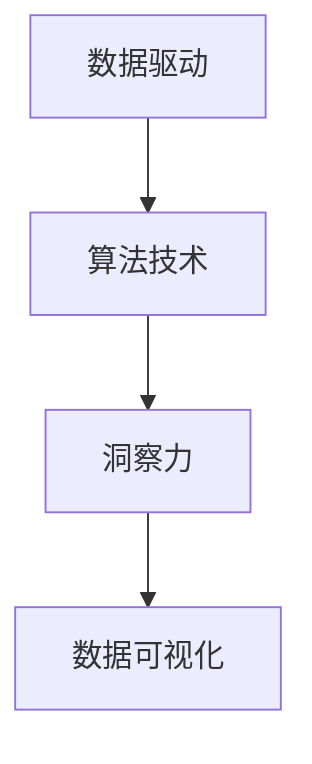

                 

# 理解洞察力的本质：在复杂中寻找规律

> 关键词：洞察力, 数据驱动, 数据分析, 人工智能, 机器学习, 深度学习, 规律, 数据挖掘, 数据可视化

## 1. 背景介绍

### 1.1 问题由来

在现代社会中，数据无处不在，如何从海量数据中提取有用的信息，从而形成对现实世界的深刻理解，成为了一个重要的研究课题。数据本身不是知识，只有通过分析、挖掘，才能转化为洞察力，助力决策和创新。传统的数据分析方法往往依赖人工经验，难以应对大规模、复杂的数据集。随着人工智能和大数据技术的发展，如何利用算法自动挖掘数据中的规律，形成对真实世界的深入洞察，成为了当前研究的热点。

本文聚焦于如何通过人工智能和机器学习技术，自动从数据中寻找和提取规律，形成对复杂现象的洞察力。我们将从核心概念入手，介绍机器学习和深度学习的基础理论，并进一步讨论如何利用这些技术，实现数据驱动的洞察力发现。

### 1.2 问题核心关键点

1. **数据驱动**：数据是洞察力的来源，如何从数据中提取有用的信息，形成对现实世界的理解。
2. **算法技术**：利用机器学习和深度学习算法，自动挖掘数据中的规律，生成模型预测结果。
3. **洞察力应用**：将洞察力应用于决策、规划、优化等领域，提升决策质量。
4. **数据可视化**：将复杂的洞察力结果通过图形展示出来，便于理解和传播。

这些核心关键点共同构成了数据驱动洞察力的研究框架，为从数据中提取和应用洞察力提供了理论基础和技术手段。

## 2. 核心概念与联系

### 2.1 核心概念概述

为更好地理解数据驱动洞察力的实现过程，本节将介绍几个关键概念及其联系：

- **数据驱动(Datadriven)**：通过数据来驱动决策和行动，强调数据的重要性。
- **算法技术(Algorithmic Techniques)**：利用机器学习、深度学习等算法，自动分析数据，发现模式和规律。
- **洞察力(Insight)**：从数据中提取出的对真实世界的深刻理解，可以用于指导决策和行动。
- **数据可视化(Data Visualization)**：将复杂的数据分析结果通过图形展示出来，帮助人们理解和传播洞察力。

这些核心概念之间的关系可以通过以下Mermaid流程图来展示：



这个流程图展示了这个研究框架的核心概念及其关系：

1. **数据驱动**是整个过程的起点，数据是洞察力的来源。
2. **算法技术**用于自动分析数据，发现规律和模式。
3. **洞察力**是数据驱动的成果，是对数据价值的深层理解。
4. **数据可视化**将洞察力结果呈现出来，便于理解和传播。

## 3. 核心算法原理 & 具体操作步骤

### 3.1 算法原理概述

数据驱动洞察力的核心是利用算法技术，自动从数据中提取规律，形成对复杂现象的深刻理解。其核心思想可以概括为以下几步：

1. **数据收集与预处理**：获取原始数据，并进行清洗、去噪、归一化等预处理操作，准备用于后续分析。
2. **特征提取与选择**：从原始数据中提取有意义的特征，并选择对模型预测效果影响较大的特征。
3. **模型训练与调参**：使用机器学习和深度学习算法，训练模型，并通过调参优化模型性能。
4. **模型评估与验证**：在测试集上评估模型性能，确保模型泛化能力，并根据评估结果调整模型参数。
5. **结果解读与应用**：将模型预测结果转化为对真实世界的洞察力，并应用于决策和优化过程。

这些步骤共同构成了数据驱动洞察力的实现过程，使我们能够从数据中自动发现规律，形成对复杂现象的深刻理解。

### 3.2 算法步骤详解

#### 3.2.1 数据收集与预处理

数据收集与预处理是数据驱动洞察力的第一步，具体包括以下步骤：

1. **数据获取**：从不同来源收集原始数据，包括结构化数据（如数据库、表格）和非结构化数据（如文本、图像、视频）。
2. **数据清洗**：处理缺失值、异常值、重复数据等，确保数据的质量。
3. **数据归一化**：对不同类型的数据进行标准化处理，如对数值型数据进行归一化，对文本型数据进行分词和去除停用词等。
4. **特征提取**：从原始数据中提取有意义的特征，如从文本中提取词频、TF-IDF等特征。

#### 3.2.2 特征提取与选择

特征提取与选择是数据驱动洞察力的关键步骤，决定了模型预测的准确性和泛化能力。具体包括以下步骤：

1. **特征提取**：从原始数据中提取有意义的特征，如从文本中提取词频、TF-IDF等特征。
2. **特征选择**：选择对模型预测效果影响较大的特征，如使用PCA、LDA等降维技术减少特征维度。
3. **特征工程**：通过特征工程手段，如编码、归一化等，进一步提升特征质量。

#### 3.2.3 模型训练与调参

模型训练与调参是数据驱动洞察力的核心步骤，具体包括以下步骤：

1. **选择模型**：根据任务特点选择合适的机器学习或深度学习模型，如线性回归、随机森林、卷积神经网络、循环神经网络等。
2. **模型训练**：使用训练集数据训练模型，并通过迭代优化模型参数，如梯度下降、Adam等。
3. **调参优化**：通过交叉验证、网格搜索等方法，调整模型超参数，如学习率、批量大小、正则化系数等，优化模型性能。

#### 3.2.4 模型评估与验证

模型评估与验证是数据驱动洞察力的重要步骤，确保模型具有良好的泛化能力，具体包括以下步骤：

1. **划分数据集**：将数据集划分为训练集、验证集和测试集，确保模型在不同数据集上表现一致。
2. **模型评估**：在验证集上评估模型性能，如均方误差、准确率、召回率等指标。
3. **模型优化**：根据验证集上的评估结果，调整模型参数，优化模型性能。

#### 3.2.5 结果解读与应用

结果解读与应用是数据驱动洞察力的最后一步，具体包括以下步骤：

1. **结果解释**：将模型预测结果转化为对真实世界的深刻理解，如预测结果的统计显著性、置信区间等。
2. **结果应用**：将洞察力应用于决策和优化过程，如基于预测结果优化供应链管理、预测市场趋势等。
3. **数据可视化**：将洞察力结果通过图形展示出来，帮助人们理解和传播。

## 4. 数学模型和公式 & 详细讲解 & 举例说明

### 4.1 数学模型构建

数据驱动洞察力的数学模型主要包括以下几个部分：

1. **特征空间表示**：将原始数据映射为高维特征空间，如将文本数据映射为词频-TF-IDF空间。
2. **模型表示**：选择合适的机器学习或深度学习模型，如线性回归、决策树、卷积神经网络等。
3. **损失函数表示**：定义损失函数，用于衡量模型预测结果与真实标签之间的差异，如均方误差、交叉熵等。
4. **优化算法表示**：定义优化算法，如梯度下降、Adam等，用于迭代优化模型参数。

### 4.2 公式推导过程

#### 4.2.1 线性回归模型

线性回归模型是最简单的预测模型，用于建模输入特征与输出标签之间的关系。假设有一个线性回归模型 $y = \theta_0 + \theta_1x_1 + \theta_2x_2$，其中 $\theta_0, \theta_1, \theta_2$ 为模型参数，$x_1, x_2$ 为输入特征，$y$ 为输出标签。

使用最小二乘法估计模型参数，最小化损失函数 $\ell(\theta) = \frac{1}{2n} \sum_{i=1}^n (y_i - \hat{y}_i)^2$，其中 $\hat{y}_i = \theta_0 + \theta_1x_{1,i} + \theta_2x_{2,i}$ 为模型预测值。

通过求解 $\frac{\partial \ell(\theta)}{\partial \theta_0} = 0$，$\frac{\partial \ell(\theta)}{\partial \theta_1} = 0$，$\frac{\partial \ell(\theta)}{\partial \theta_2} = 0$，得到模型参数的闭式解：

$$
\theta_0 = \frac{1}{n} \sum_{i=1}^n y_i - \theta_1\bar{x}_1 - \theta_2\bar{x}_2
$$
$$
\theta_1 = \frac{\sum_{i=1}^n (x_{1,i}-\bar{x}_1)(y_i-\hat{y}_i)}{\sum_{i=1}^n (x_{1,i}-\bar{x}_1)^2}
$$
$$
\theta_2 = \frac{\sum_{i=1}^n (x_{2,i}-\bar{x}_2)(y_i-\hat{y}_i)}{\sum_{i=1}^n (x_{2,i}-\bar{x}_2)^2}
$$

其中 $\bar{x}_1, \bar{x}_2$ 分别为 $x_1, x_2$ 的均值。

#### 4.2.2 卷积神经网络

卷积神经网络（CNN）是一种广泛用于图像和视频处理的任务。假设有一个卷积神经网络模型 $f(x; \theta) = \sum_i \alpha_i \sigma(\theta_i * x + b_i)$，其中 $x$ 为输入图像，$\theta$ 为网络参数，$\alpha_i$ 为卷积核权重，$b_i$ 为偏置，$\sigma$ 为激活函数。

使用均方误差损失函数 $\ell(f(x; \theta), y) = \frac{1}{2m} \sum_{i=1}^m (f(x_i; \theta) - y_i)^2$，其中 $y$ 为真实标签。

通过反向传播算法，求得网络参数的梯度 $\frac{\partial \ell(f(x; \theta), y)}{\partial \theta}$，并使用梯度下降等优化算法更新参数。

### 4.3 案例分析与讲解

#### 4.3.1 房价预测

假设有一个房屋销售数据集，包括房屋面积、地理位置、房屋类型等特征，以及房屋售价标签。使用线性回归模型进行房价预测，具体步骤如下：

1. **数据收集与预处理**：收集房屋销售数据，并进行数据清洗、归一化等预处理操作。
2. **特征提取与选择**：提取房屋面积、地理位置、房屋类型等特征，并选择合适的特征。
3. **模型训练与调参**：使用线性回归模型进行训练，并通过交叉验证调参，优化模型性能。
4. **模型评估与验证**：在测试集上评估模型性能，如均方误差等指标。
5. **结果解读与应用**：将模型预测结果转化为对房屋价格的深刻理解，并应用于房地产投资决策。

通过这个案例可以看出，数据驱动洞察力的实现过程，使我们能够从数据中自动发现规律，形成对复杂现象的深刻理解。

## 5. 项目实践：代码实例和详细解释说明

### 5.1 开发环境搭建

在进行数据驱动洞察力的项目实践前，我们需要准备好开发环境。以下是使用Python进行项目实践的环境配置流程：

1. 安装Anaconda：从官网下载并安装Anaconda，用于创建独立的Python环境。
2. 创建并激活虚拟环境：
```bash
conda create -n pytorch-env python=3.8 
conda activate pytorch-env
```
3. 安装PyTorch：根据CUDA版本，从官网获取对应的安装命令。例如：
```bash
conda install pytorch torchvision torchaudio cudatoolkit=11.1 -c pytorch -c conda-forge
```
4. 安装TensorFlow：从官网下载并安装TensorFlow，支持CUDA，适合大规模工程应用。
5. 安装NumPy、Pandas、Scikit-learn等科学计算库：
```bash
pip install numpy pandas scikit-learn matplotlib tqdm jupyter notebook ipython
```

完成上述步骤后，即可在`pytorch-env`环境中开始项目实践。

### 5.2 源代码详细实现

下面我们以房价预测项目为例，给出使用PyTorch进行线性回归模型的PyTorch代码实现。

首先，定义房价预测的数据处理函数：

```python
import pandas as pd
import numpy as np
from sklearn.model_selection import train_test_split

def load_data(filename):
    df = pd.read_csv(filename)
    X = df[['面积', '地理位置', '房屋类型']]
    y = df['售价']
    return X, y

def train_test_split_data(X, y, test_size=0.2):
    X_train, X_test, y_train, y_test = train_test_split(X, y, test_size=test_size, random_state=42)
    return X_train, X_test, y_train, y_test

def normalize_data(X_train, X_test):
    mean = np.mean(X_train, axis=0)
    std = np.std(X_train, axis=0)
    X_train = (X_train - mean) / std
    X_test = (X_test - mean) / std
    return X_train, X_test

X, y = load_data('house_prices.csv')
X_train, X_test, y_train, y_test = train_test_split_data(X, y, test_size=0.2)
X_train, X_test = normalize_data(X_train, X_test)
```

然后，定义模型和优化器：

```python
import torch
import torch.nn as nn
from torch.optim import SGD

class LinearRegressionModel(nn.Module):
    def __init__(self, input_dim, output_dim):
        super(LinearRegressionModel, self).__init__()
        self.linear = nn.Linear(input_dim, output_dim)
        
    def forward(self, x):
        return self.linear(x)
        
model = LinearRegressionModel(input_dim=X_train.shape[1], output_dim=1)
optimizer = SGD(model.parameters(), lr=0.01)
```

接着，定义训练和评估函数：

```python
def train_model(model, X_train, y_train, num_epochs=10):
    criterion = nn.MSELoss()
    for epoch in range(num_epochs):
        optimizer.zero_grad()
        y_pred = model(X_train)
        loss = criterion(y_pred, y_train)
        loss.backward()
        optimizer.step()
        print(f'Epoch {epoch+1}, loss: {loss.item()}')
        
def evaluate_model(model, X_test, y_test):
    y_pred = model(X_test)
    mse = np.mean((y_pred - y_test) ** 2)
    print(f'Test MSE: {mse}')
```

最后，启动训练流程并在测试集上评估：

```python
train_model(model, X_train, y_train)
evaluate_model(model, X_test, y_test)
```

以上就是使用PyTorch进行线性回归模型的完整代码实现。可以看到，利用PyTorch的强大封装，我们能够用相对简洁的代码实现线性回归模型的训练和评估。

### 5.3 代码解读与分析

让我们再详细解读一下关键代码的实现细节：

**load_data函数**：
- 定义数据加载函数，从CSV文件中读取数据，并分离出特征和标签。

**train_test_split_data函数**：
- 定义数据集划分函数，使用train_test_split将数据集划分为训练集和测试集，并确保数据划分的随机性。

**normalize_data函数**：
- 定义数据归一化函数，对特征数据进行归一化，确保不同特征具有相同的尺度。

**LinearRegressionModel类**：
- 定义线性回归模型类，继承nn.Module，并在__init__和forward方法中定义模型的结构和前向传播过程。

**train_model函数**：
- 定义模型训练函数，使用SGD优化器进行模型训练，并输出每个epoch的损失值。

**evaluate_model函数**：
- 定义模型评估函数，在测试集上评估模型性能，并输出均方误差。

通过这些函数，我们可以看到，使用PyTorch进行数据驱动洞察力的项目实践，其实现过程相对简单，开发者可以更多地关注数据处理、模型优化等核心环节。

## 6. 实际应用场景

### 6.1 智能推荐系统

数据驱动洞察力在智能推荐系统中有着广泛应用。通过分析用户行为数据，发现用户的兴趣和偏好，从而为用户推荐个性化的商品或内容。具体而言，可以从用户点击、浏览、购买等行为数据中提取特征，建立用户-物品关联矩阵，使用协同过滤算法或深度学习模型进行预测，生成推荐列表。

在技术实现上，可以采用基于深度学习的方法，如协同过滤、内容推荐、基于矩阵分解的方法等，进行推荐系统建模。通过不断的用户反馈和模型优化，可以不断提升推荐系统的精准度和用户满意度。

### 6.2 金融风险管理

数据驱动洞察力在金融风险管理中也有着重要应用。通过分析历史交易数据，发现潜在的风险因素，从而进行风险预警和防控。具体而言，可以从交易时间、金额、频率等特征中提取特征，建立交易异常检测模型，使用机器学习或深度学习算法进行训练，识别异常交易，并进行风险预警。

在技术实现上，可以采用基于深度学习的方法，如自编码器、卷积神经网络等，进行异常检测建模。通过不断地训练和模型优化，可以不断提升异常检测的准确性和及时性，从而降低金融风险。

### 6.3 健康医疗诊断

数据驱动洞察力在健康医疗诊断中也有着重要应用。通过分析患者的历史病历数据，发现潜在的疾病风险因素，从而进行疾病预警和诊断。具体而言，可以从患者的病历数据中提取特征，建立疾病风险预测模型，使用机器学习或深度学习算法进行训练，预测患者的疾病风险。

在技术实现上，可以采用基于深度学习的方法，如卷积神经网络、循环神经网络等，进行疾病风险预测建模。通过不断地训练和模型优化，可以不断提升疾病预测的准确性和及时性，从而提高医疗诊断的效率和质量。

### 6.4 未来应用展望

随着数据驱动洞察力的不断发展，其在各个领域的应用前景将更加广阔，具体展望如下：

1. **智能制造**：通过分析生产过程中的传感器数据，发现生产异常，进行预测性维护，从而提高生产效率和设备寿命。
2. **智慧城市**：通过分析城市交通、环境、公共安全等数据，发现城市管理中的问题，进行优化和改进，从而提升城市的智能化管理水平。
3. **环保监测**：通过分析环境监测数据，发现环境污染的趋势和原因，进行环境预警和治理，从而保护环境。
4. **生物医学**：通过分析生物医学数据，发现新的疾病风险因素，进行疾病预测和诊断，从而提高医学研究水平和疾病防控效果。
5. **农业管理**：通过分析农业生产数据，发现农业生产中的问题，进行农业管理优化，从而提高农业生产效率和农产品产量。

以上展望展示了数据驱动洞察力在各个领域的应用前景，通过数据驱动的洞察力发现和应用，我们可以更好地理解和利用现实世界的数据，推动各个领域的智能化发展。

## 7. 工具和资源推荐

### 7.1 学习资源推荐

为了帮助开发者系统掌握数据驱动洞察力的理论基础和实践技巧，这里推荐一些优质的学习资源：

1. 《机器学习》课程：斯坦福大学开设的经典机器学习课程，有Lecture视频和配套作业，带你系统入门机器学习。
2. 《深度学习》课程：斯坦福大学开设的深度学习课程，有Lecture视频和配套作业，带你深入理解深度学习技术。
3. 《数据科学与人工智能》书籍：详细介绍了数据驱动洞察力的实现过程，包括数据处理、机器学习、深度学习等技术。
4. Kaggle数据集：Kaggle提供了大量的数据集，涵盖各个领域，供开发者进行数据分析和模型训练。
5. Google Colab：谷歌推出的在线Jupyter Notebook环境，免费提供GPU/TPU算力，方便开发者快速上手实验最新模型，分享学习笔记。

通过对这些资源的学习实践，相信你一定能够快速掌握数据驱动洞察力的精髓，并用于解决实际的商业问题。

### 7.2 开发工具推荐

高效的开发离不开优秀的工具支持。以下是几款用于数据驱动洞察力开发的常用工具：

1. Python：最流行的数据科学语言，支持丰富的科学计算和数据分析库，如NumPy、Pandas、Scikit-learn等。
2. PyTorch：基于Python的深度学习框架，支持动态计算图，适合快速迭代研究。
3. TensorFlow：由Google主导开发的深度学习框架，支持GPU/TPU算力，适合大规模工程应用。
4. Scikit-learn：Python中的经典机器学习库，提供了丰富的机器学习算法和工具。
5. Jupyter Notebook：基于Python的交互式开发环境，方便代码编写和可视化展示。

合理利用这些工具，可以显著提升数据驱动洞察力的开发效率，加快创新迭代的步伐。

### 7.3 相关论文推荐

数据驱动洞察力的研究源于学界的持续研究。以下是几篇奠基性的相关论文，推荐阅读：

1. "Pattern Recognition and Machine Learning" 书籍：详细介绍了机器学习的理论基础和算法实现。
2. "Deep Learning" 书籍：全面介绍了深度学习技术的基本原理和应用。
3. "Anomaly Detection: A Survey" 论文：总结了异常检测技术的研究进展和应用案例。
4. "Data Mining: Concepts and Techniques" 书籍：介绍了数据挖掘技术的理论基础和实践方法。
5. "Data-Driven Machine Learning" 论文：综述了数据驱动机器学习的研究进展和未来方向。

这些论文代表了大数据驱动洞察力的发展脉络。通过学习这些前沿成果，可以帮助研究者把握学科前进方向，激发更多的创新灵感。

## 8. 总结：未来发展趋势与挑战

### 8.1 研究成果总结

本文对数据驱动洞察力的实现过程进行了全面系统的介绍。首先阐述了数据驱动洞察力的研究背景和意义，明确了数据驱动洞察力的重要价值。其次，从核心概念入手，介绍了机器学习和深度学习的基础理论，并进一步讨论了如何利用这些技术，实现数据驱动的洞察力发现。最后，通过项目实践，展示了数据驱动洞察力在实际应用中的具体实现方法。

通过本文的系统梳理，可以看到，数据驱动洞察力为从数据中提取和应用洞察力提供了理论基础和技术手段，使我们能够自动从数据中发现规律，形成对复杂现象的深刻理解。

### 8.2 未来发展趋势

展望未来，数据驱动洞察力的发展趋势如下：

1. **技术融合**：数据驱动洞察力将与更多前沿技术进行融合，如知识图谱、自然语言处理、计算机视觉等，实现多模态数据融合，提升洞察力的准确性和全面性。
2. **模型优化**：基于深度学习的方法将不断优化和改进，提高模型训练的效率和准确性，如使用迁移学习、对抗训练、自适应学习等。
3. **应用拓展**：数据驱动洞察力的应用将不断拓展，从传统的金融、医疗、推荐系统等领域，扩展到更多垂直行业，如智能制造、智慧城市、环保监测等。
4. **伦理和社会影响**：数据驱动洞察力将带来更多的伦理和社会问题，如隐私保护、公平性、透明性等，需要更多的研究关注和政策指导。
5. **自动化和智能化**：数据驱动洞察力的实现过程将更加自动化和智能化，借助AI辅助工具，如自动化特征工程、自动调参等，提高研究效率和精度。

这些趋势展示了数据驱动洞察力的广阔前景，相信未来将在更多领域得到广泛应用，推动智能化技术的发展。

### 8.3 面临的挑战

尽管数据驱动洞察力在许多领域已经取得了显著成果，但在进一步应用和发展过程中，仍面临诸多挑战：

1. **数据质量**：数据质量的优劣直接影响洞察力的准确性，需要大量高质量的标注数据和清洗过程。
2. **模型泛化**：模型在复杂数据分布上的泛化能力较弱，难以应对新数据和新场景。
3. **计算资源**：深度学习模型需要大量计算资源，对硬件设备和计算平台提出了较高要求。
4. **可解释性**：深度学习模型通常被视为"黑盒"系统，难以解释其内部工作机制和决策逻辑。
5. **伦理和隐私**：数据驱动洞察力的应用可能涉及个人隐私和伦理问题，需要更多的法律和政策支持。

这些挑战需要研究者和开发者共同努力，不断突破技术瓶颈，确保数据驱动洞察力的安全、可靠和有效。

### 8.4 研究展望

面向未来，数据驱动洞察力的研究方向包括：

1. **无监督和半监督学习**：探索无监督和半监督学习算法，降低对标注数据的依赖，提升模型的鲁棒性和泛化能力。
2. **多模态数据融合**：实现不同模态数据的融合，提升洞察力的全面性和准确性，如视觉、语音、文本等数据的融合。
3. **自动化特征工程**：引入自动化特征工程技术，提高数据处理的效率和质量，如自动化特征选择、数据清洗等。
4. **可解释性增强**：开发可解释的机器学习模型，提升模型的透明性和可解释性，如使用注意力机制、解释性模型等。
5. **伦理和隐私保护**：引入伦理和隐私保护机制，确保数据驱动洞察力的应用符合法律法规和社会伦理。

这些研究方向的探索，必将引领数据驱动洞察力技术迈向更高的台阶，为构建智能化系统提供更全面的理论和技术支持。

## 9. 附录：常见问题与解答

**Q1: 数据驱动洞察力与传统数据分析有哪些不同？**

A: 数据驱动洞察力与传统数据分析的主要不同在于：

1. **自动化**：数据驱动洞察力通过算法自动发现数据中的规律，减少了人工参与的环节，提高了分析效率。
2. **数据质量要求**：数据驱动洞察力要求数据质量更高，包括数据的完整性、准确性、一致性等。
3. **可解释性**：数据驱动洞察力通常需要更强的可解释性，以便更好地理解和传播洞察力结果。

这些不同点展示了数据驱动洞察力的优势，使我们能够更高效、更精准地从数据中发现规律，形成对复杂现象的深刻理解。

**Q2: 如何选择数据驱动洞察力的建模方法？**

A: 选择数据驱动洞察力的建模方法需要考虑以下几个因素：

1. **任务特点**：根据任务的特点，选择适合的建模方法，如分类任务使用决策树、回归任务使用线性回归、图像任务使用卷积神经网络等。
2. **数据类型**：根据数据的类型，选择适合的特征表示方法和模型，如文本数据使用词频、TF-IDF等特征，图像数据使用卷积神经网络。
3. **数据量和质量**：根据数据量和质量，选择适合的模型复杂度和优化方法，如数据量较少时选择简单的模型，数据质量较差时使用正则化等方法。

这些因素共同决定了数据驱动洞察力的建模方法选择，需要根据具体情况进行综合考虑。

**Q3: 数据驱动洞察力在实际应用中需要注意哪些问题？**

A: 数据驱动洞察力在实际应用中需要注意以下几个问题：

1. **数据隐私**：在处理个人数据时，需要确保数据隐私和安全性，遵循法律法规。
2. **数据偏见**：在数据处理和模型训练过程中，需要识别和纠正数据偏见，确保模型的公平性和公正性。
3. **模型泛化**：在模型训练和测试过程中，需要确保模型的泛化能力，避免过拟合和欠拟合。
4. **结果解释**：在模型应用过程中，需要确保结果的可解释性，以便更好地理解和传播洞察力结果。
5. **用户反馈**：在模型应用过程中，需要收集用户反馈，不断优化模型和应用过程，提升用户体验。

这些问题是数据驱动洞察力应用过程中需要注意的重要方面，需要从数据、模型、应用等多个环节进行全面优化。

**Q4: 如何提高数据驱动洞察力的可解释性？**

A: 提高数据驱动洞察力的可解释性需要从以下几个方面进行：

1. **模型设计**：设计可解释的模型，如使用决策树、线性回归等可解释性较强的模型。
2. **特征选择**：选择可解释的特征，如使用领域知识指导特征选择。
3. **结果展示**：使用可解释的结果展示方法，如可视化结果、特征重要性分析等。
4. **用户反馈**：收集用户反馈，不断优化模型和结果展示，提升可解释性。

通过这些方法，可以提高数据驱动洞察力的可解释性，使其更加透明和可信。

**Q5: 如何应对数据驱动洞察力中的伦理问题？**

A: 应对数据驱动洞察力中的伦理问题需要从以下几个方面进行：

1. **隐私保护**：在处理个人数据时，确保数据隐私和安全性，遵循法律法规。
2. **公平性**：在模型训练和应用过程中，确保模型的公平性和公正性，避免歧视和偏见。
3. **透明度**：在模型应用过程中，确保结果的可解释性和透明度，避免"黑盒"系统。
4. **责任分配**：在模型应用过程中，明确责任分配，确保模型应用的责任清晰明确。

这些措施可以有效地应对数据驱动洞察力中的伦理问题，确保模型应用符合法律法规和社会伦理。

---

作者：禅与计算机程序设计艺术 / Zen and the Art of Computer Programming

