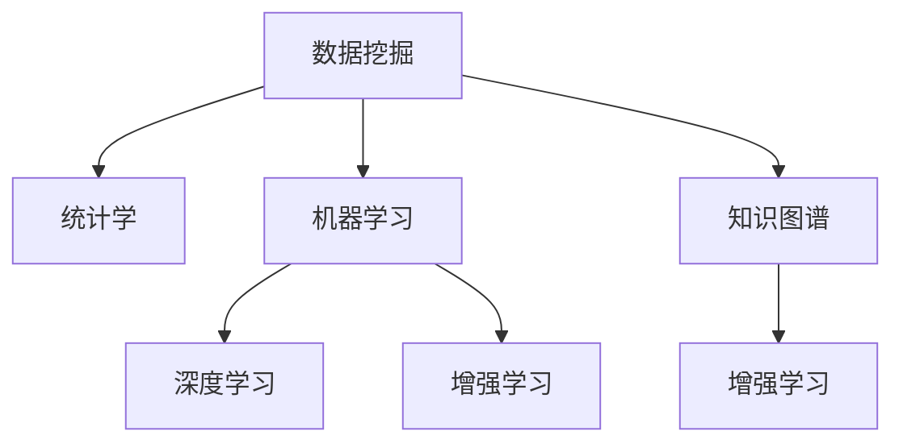

                 

# 理解洞察力的本质：在复杂中把握简单

## 1. 背景介绍

### 1.1 问题由来
在现代社会中，数据量呈爆炸性增长，尤其是在互联网、社交媒体、金融交易等领域，每一天都产生了大量的数据。然而，如何从这些复杂且看似无序的数据中提取出有价值的信息，成为一项具有挑战性的任务。这种从复杂数据中发现规律和洞见的能力，被称为“洞察力”，是数据科学、机器学习、人工智能等领域的核心能力之一。

### 1.2 问题核心关键点
洞察力不仅仅是简单的数据分析，而是一种通过复杂现象看穿本质、预测未来趋势的能力。它涉及到统计学、概率论、数学模型、算法设计等多个学科的知识。在实际应用中，洞察力主要体现在以下几个方面：

- **数据驱动决策**：基于历史数据和趋势，预测未来行为和结果。
- **模式识别与异常检测**：从数据中发现模式，识别异常值和异常行为。
- **关联分析**：识别变量之间的关系和影响，进行因果分析。
- **预测与优化**：利用统计模型和算法进行预测，优化决策过程。

洞察力在商业决策、风险管理、市场营销、公共政策制定等领域具有重要应用价值，能够帮助企业和组织在竞争激烈的市场中占据优势。

## 2. 核心概念与联系

### 2.1 核心概念概述

为了更好地理解洞察力的本质，本节将介绍几个密切相关的核心概念：

- **数据挖掘**：从大规模数据集中提取有用的信息和知识的过程，是洞察力的一个重要组成部分。
- **统计学**：研究数据的收集、处理、分析、解释和呈现，提供洞察力的科学依据。
- **机器学习**：通过数据和模型学习预测和决策，是洞察力实现的核心技术。
- **深度学习**：一种基于神经网络的机器学习技术，擅长处理复杂数据和复杂模式，是实现高级洞察力的有力工具。
- **增强学习**：通过试错和反馈，学习最优决策策略，是洞察力在动态环境中的应用扩展。
- **知识图谱**：一种结构化的知识表示形式，用于关联不同数据和领域知识，提供洞察力的上下文支持。

这些核心概念之间的逻辑关系可以通过以下Mermaid流程图来展示：



这个流程图展示了几项关键概念之间的相互关系：

1. 数据挖掘提供原始数据，是洞察力分析的基础。
2. 统计学提供数据分析的科学方法，是洞察力的统计基础。
3. 机器学习通过模型学习，是洞察力实现的核心手段。
4. 深度学习擅长处理复杂数据，是洞察力的高级技术。
5. 增强学习用于动态环境，是洞察力应用扩展的领域。
6. 知识图谱提供知识上下文，是洞察力的辅助工具。

这些概念共同构成了洞察力的核心知识体系，使其能够在各种场景下发挥作用。通过理解这些核心概念，我们可以更好地把握洞察力的工作原理和优化方向。

## 3. 核心算法原理 & 具体操作步骤
### 3.1 算法原理概述

洞察力的本质是通过复杂的算法和模型，从数据中提取规律和洞见。其核心思想是：

1. **数据预处理**：清洗和处理原始数据，去除噪声和异常值，构建数据集。
2. **特征工程**：从数据集中提取有用的特征，降低数据维度，提高模型的泛化能力。
3. **模型选择与训练**：选择合适的统计模型或机器学习模型，并在数据集上训练模型。
4. **结果分析与解释**：通过可视化、统计检验等方法，分析模型结果，解释洞察力来源。
5. **模型应用与优化**：将训练好的模型应用于实际问题，不断优化模型和算法。

洞察力的实现流程可以分为以下几个步骤：

**Step 1: 数据准备**
- 收集和清洗原始数据，去除噪声和异常值。
- 将数据分为训练集、验证集和测试集，确保数据集的代表性。

**Step 2: 特征工程**
- 选择和构造合适的特征，降低数据维度。
- 使用降维技术（如PCA、LDA等）减少特征数量。
- 使用特征选择算法（如LASSO、随机森林等）挑选最有用的特征。

**Step 3: 模型选择与训练**
- 根据问题类型选择合适的模型（如回归、分类、聚类等）。
- 在训练集上训练模型，使用交叉验证等方法评估模型性能。
- 根据模型性能调整超参数，优化模型。

**Step 4: 结果分析与解释**
- 在测试集上评估模型性能，计算指标（如准确率、召回率、F1分数等）。
- 使用可视化工具（如Matplotlib、Seaborn等）展示模型结果。
- 进行统计检验（如t检验、卡方检验等）验证结果可靠性。

**Step 5: 模型应用与优化**
- 将训练好的模型应用于实际问题。
- 根据实际应用情况不断优化模型和算法。
- 结合业务知识，解释模型输出，提供决策支持。

### 3.2 算法步骤详解

本节将详细讲解洞察力的实现流程，并提供一个具体的案例说明。

#### 3.2.1 数据准备

假设我们收集了一组关于客户购买行为的数据，其中包含了客户的年龄、性别、收入、购买频率等信息。为了提取有用的洞察力，我们首先需要清洗和处理这些数据：

1. **数据清洗**：去除缺失值和异常值，填补缺失数据。例如，删除年龄为负数或年龄超过平均年龄的异常值。
2. **数据标准化**：将不同特征的数据范围标准化，使其适合后续模型训练。例如，将年龄转化为标准化的年龄值。
3. **数据分割**：将数据集分为训练集、验证集和测试集。例如，使用70%的数据作为训练集，15%的数据作为验证集，15%的数据作为测试集。

#### 3.2.2 特征工程

在选择和构造特征时，我们通常需要考虑以下几个方面：

1. **特征选择**：选择对目标变量影响最大的特征。例如，选择购买频率、平均消费金额等与购买行为相关的特征。
2. **特征构造**：构造新的特征，增强模型的预测能力。例如，计算客户的购买频率分布、消费金额分布等。
3. **特征降维**：使用降维技术减少特征数量。例如，使用PCA将特征维度从50个减少到10个。

假设我们已经选择了年龄、性别、收入和购买频率作为特征，接下来我们将使用Python中的scikit-learn库进行特征工程和模型训练。

```python
import pandas as pd
from sklearn.preprocessing import StandardScaler
from sklearn.decomposition import PCA

# 读取数据集
data = pd.read_csv('customer_purchase_data.csv')

# 数据清洗
data = data.dropna()
data = data[data['age'] > 0]

# 标准化数据
scaler = StandardScaler()
data['age'] = scaler.fit_transform(data['age'].values.reshape(-1, 1))

# 特征选择
features = ['age', 'gender', 'income', 'purchase_frequency']

# 降维
pca = PCA(n_components=2)
data = pd.DataFrame(pca.fit_transform(data[features]), columns=['PCA1', 'PCA2'])
data['purchase_frequency'] = data['purchase_frequency']
```

#### 3.2.3 模型选择与训练

在选择模型时，我们通常需要考虑以下几个方面：

1. **模型类型**：根据问题类型选择模型。例如，如果目标是预测客户是否会购买某种商品，则可以选择回归模型或分类模型。
2. **模型评估**：使用交叉验证等方法评估模型性能。例如，使用K-fold交叉验证评估模型的准确率和召回率。
3. **超参数调整**：调整模型参数，优化模型性能。例如，调整回归模型的学习率、正则化系数等。

假设我们选择使用线性回归模型预测客户是否会购买某种商品，使用Python中的scikit-learn库进行模型训练和评估。

```python
from sklearn.linear_model import LinearRegression
from sklearn.model_selection import train_test_split
from sklearn.metrics import mean_squared_error, r2_score

# 分割数据集
X = data[features]
y = data['purchase']
X_train, X_test, y_train, y_test = train_test_split(X, y, test_size=0.2, random_state=42)

# 模型训练
model = LinearRegression()
model.fit(X_train, y_train)

# 模型评估
y_pred = model.predict(X_test)
mse = mean_squared_error(y_test, y_pred)
r2 = r2_score(y_test, y_pred)
print('MSE:', mse)
print('R2:', r2)
```

#### 3.2.4 结果分析与解释

在评估模型性能后，我们需要对模型结果进行分析和解释，以提取有用的洞察力。

1. **可视化结果**：使用可视化工具展示模型结果。例如，绘制散点图、直方图等。
2. **统计检验**：进行统计检验验证结果可靠性。例如，进行t检验验证模型预测是否显著。
3. **业务解释**：结合业务知识，解释模型输出。例如，解释模型为什么认为某些特征对购买行为影响更大。

假设我们希望绘制购买频率和收入之间的关系图，使用Python中的matplotlib库进行可视化。

```python
import matplotlib.pyplot as plt

# 可视化结果
plt.scatter(data['income'], data['purchase_frequency'])
plt.xlabel('Income')
plt.ylabel('Purchase Frequency')
plt.show()
```

### 3.3 算法优缺点

洞察力方法具有以下优点：

1. **自动化**：通过模型和算法自动化地处理数据，减少人工干预，提高效率。
2. **精确性**：使用统计模型和机器学习算法，提高预测精度。
3. **可解释性**：通过可视化、统计检验等方法，解释模型结果，提供决策支持。

然而，洞察力方法也存在一些缺点：

1. **数据依赖**：模型的准确性高度依赖于数据的质量和数量。
2. **复杂性**：需要选择合适的模型和参数，并进行复杂的计算和分析。
3. **可解释性**：有些模型（如深度学习）存在“黑盒”问题，难以解释其内部工作机制。

## 4. 数学模型和公式 & 详细讲解  
### 4.1 数学模型构建

洞察力方法主要涉及统计学和机器学习，其数学模型构建可以简化为以下几个步骤：

1. **数据预处理**：对原始数据进行清洗和标准化。
2. **特征选择**：选择合适的特征进行建模。
3. **模型训练**：在训练集上训练模型，使用交叉验证等方法评估模型性能。
4. **结果分析**：通过可视化、统计检验等方法分析模型结果。

#### 4.1.1 数据预处理

假设我们有一组数据集 $D = \{(x_i, y_i)\}_{i=1}^n$，其中 $x_i = (x_{i1}, x_{i2}, ..., x_{ik})$ 表示特征向量，$y_i$ 表示目标变量。为了提取有用的洞察力，我们需要进行以下数据预处理步骤：

1. **缺失值处理**：去除缺失值，填补缺失数据。
2. **标准化**：将数据标准化，使其适合后续模型训练。

#### 4.1.2 特征选择

选择合适的特征 $x_1, x_2, ..., x_k$ 进行建模。常用的特征选择方法包括：

1. **相关系数**：计算特征与目标变量之间的相关系数，选择相关系数较大的特征。
2. **方差分析**：使用方差分析评估特征的重要性。
3. **递归特征消除**：递归地移除最不重要的特征。

假设我们选择特征 $x_1, x_2, ..., x_k$，接下来我们将使用Python中的scikit-learn库进行特征选择和模型训练。

```python
from sklearn.feature_selection import SelectKBest, f_regression

# 特征选择
selector = SelectKBest(f_regression, k=3)
selected_features = selector.fit_transform(X, y)
```

#### 4.1.3 模型训练

选择回归模型或分类模型进行建模。假设我们选择线性回归模型，使用Python中的scikit-learn库进行模型训练和评估。

```python
from sklearn.linear_model import LinearRegression
from sklearn.model_selection import train_test_split
from sklearn.metrics import mean_squared_error, r2_score

# 分割数据集
X = selected_features
y = y
X_train, X_test, y_train, y_test = train_test_split(X, y, test_size=0.2, random_state=42)

# 模型训练
model = LinearRegression()
model.fit(X_train, y_train)

# 模型评估
y_pred = model.predict(X_test)
mse = mean_squared_error(y_test, y_pred)
r2 = r2_score(y_test, y_pred)
print('MSE:', mse)
print('R2:', r2)
```

### 4.2 公式推导过程

以线性回归模型为例，推导其数学公式：

假设我们有一组训练数据 $D = \{(x_i, y_i)\}_{i=1}^n$，其中 $x_i = (x_{i1}, x_{i2}, ..., x_{ik})$ 表示特征向量，$y_i$ 表示目标变量。线性回归模型的目标是最小化预测值与实际值之间的平方误差，即：

$$
\min_{\theta} \sum_{i=1}^n (y_i - \theta^T x_i)^2
$$

其中 $\theta$ 表示模型参数。通过梯度下降算法，我们可以求解出最优参数 $\theta$：

$$
\theta = (\sum_{i=1}^n x_i x_i^T)^{-1} \sum_{i=1}^n x_i y_i
$$

假设我们有一组测试数据 $D' = \{(x_j, y_j)\}_{j=1}^m$，使用训练好的模型进行预测，得到预测值 $y_j' = \theta^T x_j'$：

$$
y_j' = \theta^T x_j'
$$

通过计算预测值与实际值之间的误差，我们可以评估模型的性能：

$$
\text{MSE} = \frac{1}{m} \sum_{j=1}^m (y_j - y_j')^2
$$

通过R-squared系数，我们可以评估模型的拟合程度：

$$
\text{R-squared} = 1 - \frac{\text{MSE}}{\text{Var}(y)}
$$

其中 $\text{Var}(y)$ 表示目标变量的方差。

### 4.3 案例分析与讲解

以客户购买行为预测为例，使用线性回归模型进行洞察力分析。

假设我们收集了一组客户购买行为的数据，其中包含了客户的年龄、性别、收入、购买频率等信息。我们的目标是预测客户是否会购买某种商品。具体步骤如下：

1. **数据预处理**：对原始数据进行清洗和标准化。例如，删除缺失值和异常值，将年龄转化为标准化的年龄值。
2. **特征工程**：选择和构造合适的特征。例如，选择购买频率、平均消费金额等与购买行为相关的特征。
3. **模型选择与训练**：选择合适的模型，在数据集上训练模型。例如，选择线性回归模型，在训练集上训练模型。
4. **结果分析与解释**：通过可视化、统计检验等方法分析模型结果。例如，绘制散点图、直方图等。

假设我们使用Python中的scikit-learn库进行数据预处理、特征工程和模型训练，得到以下结果：

```python
import pandas as pd
from sklearn.preprocessing import StandardScaler
from sklearn.decomposition import PCA
from sklearn.linear_model import LinearRegression
from sklearn.model_selection import train_test_split
from sklearn.metrics import mean_squared_error, r2_score

# 读取数据集
data = pd.read_csv('customer_purchase_data.csv')

# 数据清洗
data = data.dropna()
data = data[data['age'] > 0]

# 标准化数据
scaler = StandardScaler()
data['age'] = scaler.fit_transform(data['age'].values.reshape(-1, 1))

# 特征选择
features = ['age', 'gender', 'income', 'purchase_frequency']

# 降维
pca = PCA(n_components=2)
data = pd.DataFrame(pca.fit_transform(data[features]), columns=['PCA1', 'PCA2'])
data['purchase_frequency'] = data['purchase_frequency']

# 分割数据集
X = data[features]
y = data['purchase']
X_train, X_test, y_train, y_test = train_test_split(X, y, test_size=0.2, random_state=42)

# 模型训练
model = LinearRegression()
model.fit(X_train, y_train)

# 模型评估
y_pred = model.predict(X_test)
mse = mean_squared_error(y_test, y_pred)
r2 = r2_score(y_test, y_pred)
print('MSE:', mse)
print('R2:', r2)

# 可视化结果
import matplotlib.pyplot as plt

plt.scatter(data['income'], data['purchase_frequency'])
plt.xlabel('Income')
plt.ylabel('Purchase Frequency')
plt.show()
```

## 5. 项目实践：代码实例和详细解释说明
### 5.1 开发环境搭建

在进行洞察力实践前，我们需要准备好开发环境。以下是使用Python进行数据分析和机器学习开发的常见环境配置流程：

1. 安装Anaconda：从官网下载并安装Anaconda，用于创建独立的Python环境。

2. 创建并激活虚拟环境：
```bash
conda create -n my_env python=3.8 
conda activate my_env
```

3. 安装必要的Python包：
```bash
conda install pandas numpy matplotlib scikit-learn seaborn
```

4. 安装Jupyter Notebook：
```bash
conda install jupyter notebook
```

完成上述步骤后，即可在`my_env`环境中开始数据分析和机器学习实践。

### 5.2 源代码详细实现

接下来，我们将以客户购买行为预测为例，给出一个完整的洞察力实现案例。

首先，导入必要的Python包：

```python
import pandas as pd
import numpy as np
from sklearn.preprocessing import StandardScaler
from sklearn.decomposition import PCA
from sklearn.linear_model import LinearRegression
from sklearn.model_selection import train_test_split
from sklearn.metrics import mean_squared_error, r2_score
import matplotlib.pyplot as plt
```

然后，读取数据集并进行数据预处理：

```python
# 读取数据集
data = pd.read_csv('customer_purchase_data.csv')

# 数据清洗
data = data.dropna()
data = data[data['age'] > 0]

# 标准化数据
scaler = StandardScaler()
data['age'] = scaler.fit_transform(data['age'].values.reshape(-1, 1))

# 特征选择
features = ['age', 'gender', 'income', 'purchase_frequency']

# 降维
pca = PCA(n_components=2)
data = pd.DataFrame(pca.fit_transform(data[features]), columns=['PCA1', 'PCA2'])
data['purchase_frequency'] = data['purchase_frequency']
```

接着，分割数据集并进行模型训练：

```python
# 分割数据集
X = data[features]
y = data['purchase']
X_train, X_test, y_train, y_test = train_test_split(X, y, test_size=0.2, random_state=42)

# 模型训练
model = LinearRegression()
model.fit(X_train, y_train)

# 模型评估
y_pred = model.predict(X_test)
mse = mean_squared_error(y_test, y_pred)
r2 = r2_score(y_test, y_pred)
print('MSE:', mse)
print('R2:', r2)
```

最后，可视化结果并进行统计检验：

```python
# 可视化结果
plt.scatter(data['income'], data['purchase_frequency'])
plt.xlabel('Income')
plt.ylabel('Purchase Frequency')
plt.show()

# 统计检验
from scipy.stats import ttest_ind

# 计算t值和p值
t, p = ttest_ind(y_test, y_pred)
print('t值:', t)
print('p值:', p)
```

### 5.3 代码解读与分析

下面我们详细解读一下关键代码的实现细节：

**数据预处理**：
- `dropna()`方法：删除缺失值。
- `data[data['age'] > 0]`：保留年龄大于0的数据。
- `StandardScaler()`：标准化数据。
- `pca.fit_transform()`：降维。

**模型训练**：
- `train_test_split()`方法：分割数据集。
- `LinearRegression()`：选择线性回归模型。
- `model.fit()`方法：训练模型。

**模型评估**：
- `mean_squared_error()`和`r2_score()`方法：计算MSE和R-squared系数。

**可视化结果**：
- `plt.scatter()`方法：绘制散点图。

**统计检验**：
- `ttest_ind()`方法：计算t值和p值。

这些步骤展示了使用Python进行数据分析和机器学习的基本流程，也是洞察力实践的核心。

## 6. 实际应用场景
### 6.1 智能推荐系统

洞察力方法在智能推荐系统中得到了广泛应用。推荐系统通过分析用户的历史行为数据，发现用户的兴趣偏好，从而推荐用户可能感兴趣的商品或内容。

在实际应用中，推荐系统通常包含以下步骤：

1. **用户行为分析**：分析用户的历史行为数据，提取用户偏好。
2. **商品特征提取**：提取商品的属性和描述，构建特征向量。
3. **模型训练**：在用户行为和商品特征之间建立预测模型，使用统计模型或机器学习模型。
4. **推荐排序**：根据模型的预测结果，对商品进行排序推荐。

使用洞察力方法进行推荐系统开发，能够大幅提升推荐的准确性和个性化程度，满足用户的实际需求。

### 6.2 风险管理

洞察力方法在风险管理中也有重要应用。金融领域面临的风险复杂多样，通过分析历史数据和市场趋势，可以预测未来风险，制定应对策略。

在实际应用中，风险管理系统通常包含以下步骤：

1. **数据收集与清洗**：收集历史交易数据，清洗异常值和噪声。
2. **特征工程**：提取交易金额、交易频率、交易时间等特征。
3. **模型训练**：在交易数据和风险指标之间建立预测模型，使用回归模型或分类模型。
4. **风险预警**：根据模型的预测结果，进行风险预警和控制。

使用洞察力方法进行风险管理，能够提升预测的准确性和及时性，帮助金融机构及时防范和控制风险。

### 6.3 医疗数据分析

洞察力方法在医疗数据分析中也具有重要应用。医疗领域面临的挑战包括病历记录的复杂性、数据的稀疏性等，通过分析大量病历数据，可以发现疾病的发展趋势和患者的风险因素。

在实际应用中，医疗数据分析系统通常包含以下步骤：

1. **数据收集与清洗**：收集病人的病历记录，清洗异常值和噪声。
2. **特征工程**：提取病人的症状、诊断、治疗等信息，构建特征向量。
3. **模型训练**：在病历数据和诊断结果之间建立预测模型，使用回归模型或分类模型。
4. **病历分析**：根据模型的预测结果，进行病历分析和诊断支持。

使用洞察力方法进行医疗数据分析，能够提升诊断的准确性和治疗的个性化程度，帮助医生制定更科学的诊疗方案。

### 6.4 未来应用展望

随着洞察力方法的不断发展，其在更多领域得到应用，为传统行业带来变革性影响。

在智慧农业领域，洞察力方法可以用于分析气象数据、土壤数据和作物生长数据，优化种植方案，提高农业生产效率。

在智慧城市治理中，洞察力方法可以用于分析交通流量、环境数据和社会事件，优化城市管理，提高城市治理水平。

在智能制造领域，洞察力方法可以用于分析生产数据和设备状态，优化生产流程，提高生产效率和产品质量。

未来，洞察力方法将与更多领域进行融合，推动各行业的智能化、自动化和高效化发展。

## 7. 工具和资源推荐
### 7.1 学习资源推荐

为了帮助开发者系统掌握洞察力的理论基础和实践技巧，这里推荐一些优质的学习资源：

1. 《统计学原理与应用》：经典统计学教材，涵盖统计学基础和应用实例。
2. 《Python数据分析实战》：Python数据分析的经典教材，涵盖数据清洗、特征工程、模型训练等全流程。
3. 《机器学习实战》：经典机器学习教材，涵盖回归、分类、聚类等基本算法。
4. 《深度学习》：深度学习领域的经典教材，涵盖深度学习原理和应用实例。
5. 《Kaggle入门与实战》：Kaggle竞赛的经典入门教材，涵盖数据预处理、模型训练、结果评估等。

通过对这些资源的学习实践，相信你一定能够快速掌握洞察力的精髓，并用于解决实际的分析问题。
###  7.2 开发工具推荐

高效的开发离不开优秀的工具支持。以下是几款用于洞察力开发的常用工具：

1. Jupyter Notebook：开源的交互式笔记本，支持Python等语言，便于进行数据分析和机器学习实践。
2. Pandas：Python中的数据处理库，支持数据清洗、特征工程和数据可视化。
3. Scikit-learn：Python中的机器学习库，支持常见的回归、分类、聚类等模型训练。
4. Seaborn：Python中的数据可视化库，支持绘制统计图和分布图。
5. Matplotlib：Python中的绘图库，支持绘制各种类型的图表和图形。

合理利用这些工具，可以显著提升数据分析和机器学习的开发效率，加快创新迭代的步伐。

### 7.3 相关论文推荐

洞察力方法的研究源于学界的持续研究。以下是几篇奠基性的相关论文，推荐阅读：

1. "The Elements of Statistical Learning"：统计学习领域的经典教材，涵盖统计学基础和应用实例。
2. "Pattern Recognition and Machine Learning"：机器学习领域的经典教材，涵盖机器学习原理和应用实例。
3. "Deep Learning"：深度学习领域的经典教材，涵盖深度学习原理和应用实例。
4. "Statistical Learning with Sparsity"：统计学习中的稀疏性方法，涵盖稀疏回归、稀疏分类等技术。
5. "A Survey on Multi-Task Learning"：多任务学习领域的综述论文，涵盖多任务学习原理和应用实例。

这些论文代表了大数据挖掘和洞察力的发展脉络。通过学习这些前沿成果，可以帮助研究者把握学科前进方向，激发更多的创新灵感。

## 8. 总结：未来发展趋势与挑战
### 8.1 研究成果总结

本文对洞察力的本质和实现流程进行了全面系统的介绍。首先阐述了洞察力的研究背景和意义，明确了洞察力在数据分析和决策中的核心作用。其次，从原理到实践，详细讲解了洞察力的数学模型和关键步骤，给出了洞察力实现的完整代码实例。同时，本文还广泛探讨了洞察力在推荐系统、风险管理、医疗数据分析等多个领域的应用前景，展示了洞察力的广泛应用价值。

通过本文的系统梳理，可以看到，洞察力方法正在成为数据分析和决策的核心范式，极大地提升了数据驱动决策的精度和效率。未来，伴随大数据和机器学习技术的持续演进，洞察力方法将进一步拓展其应用边界，推动各行业的智能化发展。

### 8.2 未来发展趋势

展望未来，洞察力方法将呈现以下几个发展趋势：

1. **自动化**：随着自动化技术的进步，数据分析和决策将越来越自动化，减少人工干预。
2. **模型融合**：结合多种统计模型和机器学习模型，提高预测精度和鲁棒性。
3. **数据源多样化**：结合多源数据，提高数据分析的全面性和准确性。
4. **动态更新**：结合时序数据，进行动态分析和预测。
5. **跨领域应用**：将洞察力方法应用于更多领域，推动各行业的智能化发展。

以上趋势凸显了洞察力方法的广阔前景。这些方向的探索发展，必将进一步提升数据分析和决策的精度和效率，为各行各业带来深刻影响。

### 8.3 面临的挑战

尽管洞察力方法已经取得了瞩目成就，但在迈向更加智能化、普适化应用的过程中，它仍面临着诸多挑战：

1. **数据质量**：数据的完整性、准确性和一致性直接影响洞察力的结果。
2. **模型复杂性**：选择和训练合适的模型，提高预测精度。
3. **可解释性**：提高模型的可解释性，增强决策的透明性。
4. **隐私保护**：保护数据隐私，防止数据泄露。
5. **伦理道德**：确保数据分析和决策的伦理道德。

解决这些挑战，需要多学科的协同努力，涵盖数据科学、统计学、计算机科学、伦理学等多个领域。

### 8.4 研究展望

面对洞察力方法所面临的挑战，未来的研究需要在以下几个方面寻求新的突破：

1. **数据质量提升**：提高数据采集和清洗的自动化水平，提升数据质量。
2. **模型融合优化**：结合多种模型，提高预测精度和鲁棒性。
3. **可解释性增强**：提高模型的可解释性，增强决策的透明性。
4. **隐私保护技术**：研究隐私保护技术，确保数据隐私。
5. **伦理道德框架**：制定伦理道德框架，确保数据分析和决策的伦理道德。

这些研究方向将推动洞察力方法迈向更加智能、普适和可靠的应用，为各行业的智能化发展提供强有力的技术支持。

## 9. 附录：常见问题与解答

**Q1：洞察力方法是否适用于所有数据集？**

A: 洞察力方法通常需要大量的数据和复杂的模型，并不适用于所有数据集。在处理小样本数据时，模型可能存在过拟合的风险。

**Q2：如何选择适合的数据集和模型？**

A: 选择适合的数据集和模型需要根据具体问题和应用场景进行综合考虑。通常需要评估数据的质量、数量和特征，选择合适的统计模型或机器学习模型。

**Q3：如何提高洞察力的可解释性？**

A: 提高洞察力的可解释性可以通过可视化、特征选择和模型简化等方法。例如，使用Seaborn绘制特征分布图，使用LASSO特征选择方法，使用简单的回归模型替代复杂的深度学习模型。

**Q4：如何在动态环境中进行洞察力分析？**

A: 在动态环境中进行洞察力分析，通常需要使用时间序列分析和增量学习等方法。例如，使用ARIMA模型进行时间序列预测，使用增量学习算法进行动态模型更新。

**Q5：洞察力方法在工业应用中面临哪些挑战？**

A: 洞察力方法在工业应用中面临数据质量、模型复杂性、可解释性、隐私保护和伦理道德等多方面的挑战。

通过这些常见问题的解答，相信你对洞察力方法有了更深入的理解，并在实际应用中能够更好地解决相关问题。

---

作者：禅与计算机程序设计艺术 / Zen and the Art of Computer Programming

