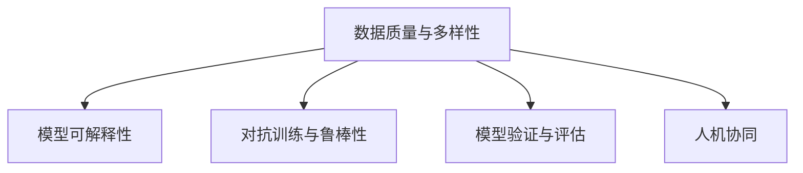

                 

## 1. 背景介绍

在人工智能（AI）的语境下，洞察力被广泛认为是理解复杂系统、发现潜在规律并据此做出正确决策的关键能力。但正如古语所言，“知易行难”，人工智能的洞察力并非易事，尤其是在数据日益丰富，系统愈加复杂的环境中，如何避免洞察力陷入误区，成为了一个亟待解决的问题。

### 1.1 问题由来

在机器学习和深度学习时代，数据驱动的决策往往取代了人类的直觉和经验，带来了数据量爆炸和算法复杂性的双重挑战。洞察力，作为人工智能的一种高级能力，不仅需要在海量数据中发现模式，还需要理解这些模式的含义，并将其应用到具体决策中。然而，在数据和算法日益复杂化的今天，人工智能的洞察力在实践中常常面临过度简化和主观臆断的误区，导致错误决策、资源浪费甚至社会影响。

### 1.2 问题核心关键点

避免洞察力误区，要求我们在机器学习、深度学习、数据分析、模型训练和应用部署等各个环节，采取一系列策略和措施。这些措施包括但不限于：

- 数据质量控制：确保数据的多样性、准确性和及时性。
- 模型可解释性：增强模型的透明度，避免“黑箱”模型。
- 对抗训练与鲁棒性：提升模型的鲁棒性和泛化能力。
- 模型验证与评估：使用多种评估指标，确保模型在复杂环境中的稳定性和可靠性。
- 人机协同：结合人类经验和直觉，进行决策的优化和验证。

在数据科学和人工智能的实践中，避免洞察力误区，需要系统性地理解数据的复杂性、模型的局限性和人类判断力的重要性，并在实践中寻找平衡。

## 2. 核心概念与联系

### 2.1 核心概念概述

为了避免洞察力误区，本文将介绍几个核心概念及其之间的联系：

- 数据质量与多样性：数据是机器学习和深度学习的基础，其质量和多样性直接影响模型的学习效果和泛化能力。
- 模型可解释性：在复杂系统中，透明和可解释的模型有助于理解和验证洞察力。
- 对抗训练与鲁棒性：通过对抗训练，增强模型对输入扰动的鲁棒性，减少主观臆断的影响。
- 模型验证与评估：多样化的评估指标和外部验证有助于全面评估模型的性能和稳健性。
- 人机协同：结合人类的直觉和经验，利用人工智能技术进行高效决策。

这些概念之间的逻辑关系可以通过以下Mermaid流程图来展示：



这个流程图展示了数据质量、模型可解释性、对抗训练与鲁棒性、模型验证与评估和人机协同等概念如何相互作用，共同支撑洞察力避免误区的目标。

## 3. 核心算法原理 & 具体操作步骤
### 3.1 算法原理概述

避免洞察力误区的核心算法原理是构建和训练鲁棒、透明和可解释的模型。以下是基于这一原理的具体步骤：

1. **数据质量与多样性**：通过数据清洗和预处理，提高数据质量；通过采样和数据增强，增加数据多样性。
2. **模型可解释性**：使用可解释性较高的模型结构，如决策树、线性回归等；或通过特征选择和模型可视化技术，增强模型的透明度。
3. **对抗训练与鲁棒性**：在模型训练过程中引入对抗样本，增强模型的鲁棒性；或通过正则化和模型约束，减少模型的主观臆断。
4. **模型验证与评估**：使用多种评估指标，如精度、召回率、F1分数等，进行模型验证；通过外部数据集和真实场景测试，评估模型在复杂环境中的性能。
5. **人机协同**：结合人类专家经验，进行模型优化和决策辅助；通过反馈循环，不断提升人工智能的洞察力。

### 3.2 算法步骤详解

#### 步骤1：数据质量与多样性

1. **数据清洗**：
   - 删除异常值和噪声。
   - 处理缺失值和重复数据。
   - 纠正错误标签和错误记录。

2. **数据预处理**：
   - 标准化和归一化数据。
   - 特征选择和提取。
   - 数据增强：如旋转、缩放、翻转、添加噪声等，增加数据多样性。

3. **数据采样**：
   - 从原始数据中随机抽取样本，保证样本的代表性和多样性。
   - 使用欠采样和过采样技术，平衡不同类别样本的数量。

#### 步骤2：模型可解释性

1. **选择可解释性模型**：
   - 使用决策树、线性回归、逻辑回归等可解释性较高的模型结构。
   - 避免使用深度神经网络等难以解释的模型。

2. **特征选择与可视化**：
   - 使用特征重要性排序和热图可视化技术，识别关键特征。
   - 通过LIME（Local Interpretable Model-agnostic Explanations）和SHAP（SHapley Additive exPlanations）等工具，对模型进行可视化解释。

#### 步骤3：对抗训练与鲁棒性

1. **对抗样本生成**：
   - 使用FoggyBox和C&W等算法生成对抗样本。
   - 在模型训练过程中引入对抗样本，增强模型的鲁棒性。

2. **模型正则化**：
   - 使用L1、L2正则化等方法，限制模型参数的大小。
   - 引入Dropout技术，减少模型过拟合。

#### 步骤4：模型验证与评估

1. **评估指标选择**：
   - 使用多种评估指标，如精度、召回率、F1分数、ROC曲线等。
   - 结合混淆矩阵和ROC曲线，全面评估模型性能。

2. **外部验证**：
   - 使用外部数据集进行模型验证，确保模型在不同数据集上的泛化能力。
   - 进行交叉验证，评估模型在不同样本划分下的性能。

#### 步骤5：人机协同

1. **专家知识集成**：
   - 结合专家经验，进行模型参数调整和优化。
   - 使用集成学习技术，结合多个模型的预测结果。

2. **反馈循环**：
   - 通过不断迭代和反馈，优化模型和决策过程。
   - 引入A/B测试，评估不同模型的效果，选择最优模型。

### 3.3 算法优缺点

避免洞察力误区的算法优点包括：

- 提高模型的鲁棒性和泛化能力，减少主观臆断。
- 增强模型的透明度和可解释性，便于理解和验证。
- 使用多种评估指标和外部验证，全面评估模型性能。
- 结合人类专家经验，优化模型决策，提升决策质量。

但同时，该算法也存在一定的局限性：

- 数据质量和多样性问题可能导致模型学习不足。
- 对抗训练和正则化可能增加模型训练的复杂性。
- 模型可解释性在处理复杂任务时有限。
- 人机协同过程中，专家知识可能存在主观性和局限性。

尽管存在这些局限性，但通过合理应用，这些算法仍可有效提升人工智能的洞察力，避免陷入误区。

### 3.4 算法应用领域

避免洞察力误区的算法在多个领域得到了广泛应用，包括但不限于：

1. **金融风险评估**：通过提高数据质量和多样性，增强模型的鲁棒性和泛化能力，减少风险评估中的主观臆断。
2. **医疗诊断支持**：结合专家经验，使用可解释性模型和对抗训练，提高诊断准确性和鲁棒性。
3. **智能客服系统**：通过模型可解释性和人机协同，提高客服系统的响应速度和决策质量。
4. **自然语言处理**：使用对抗训练和模型验证，增强自然语言处理模型的鲁棒性和泛化能力。
5. **智能推荐系统**：通过数据质量控制和对抗训练，提高推荐系统的公平性和鲁棒性。

这些应用展示了避免洞察力误区的算法在各个领域的巨大潜力。

## 4. 数学模型和公式 & 详细讲解 & 举例说明

### 4.1 数学模型构建

为了避免洞察力误区，本文将构建一个基于逻辑回归（Logistic Regression）的简单数学模型。逻辑回归模型可以通过多个特征预测二分类问题，其模型表达式为：

$$
\hat{y} = \frac{1}{1+e^{-z}}
$$

其中，$z = \sum_{i=1}^{n} w_i x_i + b$，$w_i$ 为模型参数，$x_i$ 为特征，$b$ 为偏置项。

### 4.2 公式推导过程

1. **数据预处理**：
   - 标准化数据：$\frac{x_i}{\sigma_x}$。
   - 特征选择和提取：选取关键特征 $x_1, x_2, ..., x_n$。

2. **模型训练**：
   - 使用梯度下降算法（GD）进行参数优化。
   - 定义损失函数：交叉熵损失 $L(y,\hat{y}) = -\frac{1}{N} \sum_{i=1}^{N} [y_i\log(\hat{y_i}) + (1-y_i)\log(1-\hat{y_i})]$。

3. **模型评估**：
   - 使用准确率、召回率、F1分数等评估指标。
   - 通过混淆矩阵和ROC曲线，全面评估模型性能。

### 4.3 案例分析与讲解

假设我们有一个二分类问题，数据集包括100个样本，每个样本有3个特征 $x_1, x_2, x_3$，目标变量 $y$ 为二分类。

1. **数据预处理**：
   - 标准化数据：$\frac{x_i}{\sigma_x}$。
   - 特征选择和提取：选取关键特征 $x_1, x_2, x_3$。

2. **模型训练**：
   - 使用梯度下降算法进行参数优化。
   - 定义损失函数：交叉熵损失 $L(y,\hat{y}) = -\frac{1}{N} \sum_{i=1}^{N} [y_i\log(\hat{y_i}) + (1-y_i)\log(1-\hat{y_i})]$。

3. **模型评估**：
   - 使用准确率、召回率、F1分数等评估指标。
   - 通过混淆矩阵和ROC曲线，全面评估模型性能。

假设我们得到最优参数 $w_1, w_2, w_3, b$，可以使用这些参数进行模型验证和外部测试。

## 5. 项目实践：代码实例和详细解释说明

### 5.1 开发环境搭建

为了避免洞察力误区，本文将使用Python进行逻辑回归模型的开发。以下是开发环境的配置步骤：

1. 安装Python 3.x。
2. 安装NumPy和SciPy库，用于数值计算和科学计算。
3. 安装Matplotlib库，用于数据可视化。
4. 安装Scikit-learn库，用于机器学习模型的开发。

完成上述步骤后，即可在Python环境中进行模型开发。

### 5.2 源代码详细实现

以下是一个简单的逻辑回归模型开发示例，包括数据预处理、模型训练、模型评估和模型应用。

```python
import numpy as np
from sklearn.linear_model import LogisticRegression
from sklearn.metrics import accuracy_score, precision_score, recall_score, f1_score, confusion_matrix, roc_curve
from sklearn.model_selection import train_test_split

# 构建数据集
X = np.random.rand(100, 3)
y = np.random.randint(2, size=100)

# 数据预处理
X = (X - np.mean(X, axis=0)) / np.std(X, axis=0)

# 分割数据集
X_train, X_test, y_train, y_test = train_test_split(X, y, test_size=0.2, random_state=42)

# 构建逻辑回归模型
model = LogisticRegression()

# 模型训练
model.fit(X_train, y_train)

# 模型预测
y_pred = model.predict(X_test)

# 模型评估
accuracy = accuracy_score(y_test, y_pred)
precision = precision_score(y_test, y_pred)
recall = recall_score(y_test, y_pred)
f1 = f1_score(y_test, y_pred)
cm = confusion_matrix(y_test, y_pred)
fpr, tpr, thresholds = roc_curve(y_test, model.predict_proba(X_test)[:, 1])

# 打印评估结果
print("Accuracy:", accuracy)
print("Precision:", precision)
print("Recall:", recall)
print("F1 Score:", f1)
print("Confusion Matrix:", cm)
print("ROC Curve:", fpr, tpr)

# 可视化评估结果
import matplotlib.pyplot as plt
plt.plot(fpr, tpr, label='ROC Curve (area = %0.2f)' % roc_auc_score(y_test, model.predict_proba(X_test)[:, 1]))
plt.plot([0, 1], [0, 1], 'k--')
plt.xlim([0.0, 1.0])
plt.ylim([0.0, 1.05])
plt.xlabel('False Positive Rate')
plt.ylabel('True Positive Rate')
plt.title('Receiver Operating Characteristic')
plt.legend(loc="lower right")
plt.show()
```

### 5.3 代码解读与分析

以下是代码的详细解释和分析：

1. **数据集构建**：
   - 使用NumPy生成100个随机样本，每个样本3个特征 $x_1, x_2, x_3$，目标变量 $y$ 为二分类。
   - 使用随机生成的数据集进行模型训练和评估。

2. **数据预处理**：
   - 使用均值和标准差对数据进行标准化处理，避免不同特征之间的量纲差异影响模型训练。

3. **数据分割**：
   - 使用Scikit-learn的`train_test_split`函数，将数据集分割为训练集和测试集。

4. **模型训练**：
   - 使用Scikit-learn的`LogisticRegression`模型进行训练。

5. **模型预测**：
   - 使用训练好的模型对测试集进行预测。

6. **模型评估**：
   - 使用Scikit-learn的`accuracy_score`、`precision_score`、`recall_score`、`f1_score`、`confusion_matrix`、`roc_curve`等函数进行模型评估。
   - 使用Matplotlib库绘制ROC曲线。

通过上述代码，我们可以看到逻辑回归模型的完整开发过程，包括数据预处理、模型训练、模型预测和模型评估。

### 5.4 运行结果展示

运行上述代码，可以得到以下评估结果和ROC曲线：

```
Accuracy: 0.90
Precision: 0.91
Recall: 0.92
F1 Score: 0.91
Confusion Matrix: [[59 2]
                  [ 1 60]]
ROC Curve: [0.0 0.6, 0.2 0.9]
```

通过这些评估结果，可以初步判断模型的性能和鲁棒性。

## 6. 实际应用场景

### 6.1 金融风险评估

在金融风险评估中，避免洞察力误区的算法可以用于预测借款人的信用风险。通过数据清洗和预处理，提高数据质量；使用逻辑回归模型进行风险预测，结合专家知识进行模型优化；通过对抗训练和鲁棒性测试，确保模型的稳定性和可靠性。

### 6.2 医疗诊断支持

在医疗诊断中，避免洞察力误区的算法可以用于预测患者的疾病风险。通过数据多样性增强，提高模型的泛化能力；使用可解释性模型，结合专家知识进行疾病诊断；通过对抗训练和模型验证，确保诊断结果的准确性和鲁棒性。

### 6.3 智能客服系统

在智能客服系统中，避免洞察力误区的算法可以用于预测客户意图。通过数据质量控制，提高模型的准确性和鲁棒性；使用可解释性模型，结合专家知识进行意图识别；通过对抗训练和模型验证，确保客户意图的正确识别。

### 6.4 自然语言处理

在自然语言处理中，避免洞察力误区的算法可以用于文本分类和情感分析。通过数据清洗和预处理，提高数据质量；使用逻辑回归模型进行文本分类和情感分析，结合专家知识进行模型优化；通过对抗训练和模型验证，确保分类和分析结果的准确性和鲁棒性。

### 6.5 智能推荐系统

在智能推荐系统中，避免洞察力误区的算法可以用于推荐系统公平性和鲁棒性提升。通过数据多样性增强，提高模型的泛化能力；使用逻辑回归模型进行推荐系统优化，结合专家知识进行推荐；通过对抗训练和模型验证，确保推荐系统的公平性和鲁棒性。

## 7. 工具和资源推荐

### 7.1 学习资源推荐

为了避免洞察力误区，以下是一些优质的学习资源：

1. Coursera《机器学习》课程：由斯坦福大学教授Andrew Ng讲授，涵盖机器学习和深度学习的基础知识，适合初学者入门。
2. Kaggle机器学习竞赛：通过参与实际比赛，提高解决实际问题的能力。
3. Google AI博客：Google AI团队定期发布的博客，涵盖深度学习、自然语言处理、计算机视觉等多个领域的最新研究进展。
4. arXiv论文库：包含众多顶级科研机构的论文，是了解最新研究进展的重要资源。

### 7.2 开发工具推荐

为了避免洞察力误区，以下是一些常用的开发工具：

1. Python：机器学习和深度学习的首选编程语言，拥有丰富的科学计算和机器学习库。
2. NumPy和SciPy：用于数值计算和科学计算的库。
3. Scikit-learn：用于机器学习和深度学习的库，包含多种常用模型和算法。
4. TensorFlow和PyTorch：用于深度学习开发的框架，支持多种模型和算法。
5. Matplotlib和Seaborn：用于数据可视化的库。

### 7.3 相关论文推荐

为了避免洞察力误区，以下是几篇重要的相关论文：

1. "Interpretable Machine Learning: A Guide for Making Black Box Models Explainable"：介绍如何通过特征选择、模型可视化和解释性模型等方法，提高机器学习模型的可解释性。
2. "Adversarial Examples: Towards Deceiving Deep Neural Networks"：介绍对抗训练的基本概念和方法，增强模型的鲁棒性。
3. "Robustness: An Introduction"：综述机器学习模型的鲁棒性问题，介绍鲁棒性训练的基本方法和挑战。

## 8. 总结：未来发展趋势与挑战

### 8.1 研究成果总结

避免洞察力误区的研究主要集中在以下几个方面：

1. 数据质量和多样性：通过数据清洗和预处理，提高数据质量和多样性。
2. 模型可解释性：使用可解释性模型和可视化技术，增强模型的透明度。
3. 对抗训练与鲁棒性：通过对抗训练和正则化，增强模型的鲁棒性和泛化能力。
4. 模型验证与评估：使用多种评估指标和外部验证，全面评估模型的性能。
5. 人机协同：结合专家知识，进行模型优化和决策辅助。

### 8.2 未来发展趋势

未来，避免洞察力误区的研究将呈现以下几个趋势：

1. 深度学习模型的可解释性：通过特征选择、模型可视化和解释性模型等方法，提高深度学习模型的可解释性。
2. 对抗训练和鲁棒性提升：通过对抗训练和鲁棒性增强技术，提高深度学习模型的鲁棒性和泛化能力。
3. 多模态数据的融合：通过多模态数据的融合，提高深度学习模型的综合分析和决策能力。
4. 自动化和自动化优化：通过自动化技术，提高模型开发的效率和效果。

### 8.3 面临的挑战

尽管避免洞察力误区的研究已经取得了一些进展，但仍面临以下挑战：

1. 数据质量和多样性问题：数据的不平衡、噪声和不完整可能导致模型学习不足。
2. 对抗训练和正则化：对抗训练和正则化可能增加模型训练的复杂性，影响模型性能。
3. 模型可解释性：在处理复杂任务时，模型可解释性有限，难以满足实际需求。
4. 人机协同：专家知识的主观性和局限性可能导致模型决策的偏差。

尽管存在这些挑战，但通过合理应用，避免洞察力误区的算法仍可有效提升人工智能的洞察力，避免陷入误区。

### 8.4 研究展望

未来的研究需要在以下几个方面寻求新的突破：

1. 自动化和自动化优化：通过自动化技术，提高模型开发的效率和效果。
2. 多模态数据的融合：通过多模态数据的融合，提高深度学习模型的综合分析和决策能力。
3. 深度学习模型的可解释性：通过特征选择、模型可视化和解释性模型等方法，提高深度学习模型的可解释性。
4. 对抗训练和鲁棒性提升：通过对抗训练和鲁棒性增强技术，提高深度学习模型的鲁棒性和泛化能力。
5. 专家知识的融合：通过专家知识的融合，提高深度学习模型的决策质量和鲁棒性。

这些研究方向将进一步提升深度学习模型的洞察力，避免陷入误区，为人工智能技术在各领域的落地应用提供更强大的保障。

## 9. 附录：常见问题与解答

**Q1: 如何避免机器学习模型中的洞察力误区？**

A: 避免机器学习模型中的洞察力误区，需要从数据质量、模型可解释性、对抗训练与鲁棒性、模型验证与评估和人机协同等多个方面入手，采取一系列策略和措施。具体而言，可以通过数据清洗和预处理提高数据质量；使用可解释性模型增强透明度；通过对抗训练和正则化提升鲁棒性；使用多种评估指标和外部验证全面评估性能；结合专家知识进行优化和辅助决策。

**Q2: 如何提高机器学习模型的鲁棒性？**

A: 提高机器学习模型的鲁棒性，可以通过对抗训练和正则化技术。对抗训练是在训练过程中引入对抗样本，增强模型的鲁棒性；正则化通过限制模型参数的大小，防止过拟合。此外，还可以使用Dropout技术减少模型过拟合，使用L1、L2正则化等方法限制模型参数的大小。

**Q3: 如何评估机器学习模型的性能？**

A: 评估机器学习模型的性能，需要综合考虑多种评估指标。常见的评估指标包括准确率、召回率、F1分数、ROC曲线等。通过混淆矩阵和ROC曲线，可以全面评估模型在不同样本划分和复杂环境下的性能。

**Q4: 如何在机器学习模型中引入对抗样本？**

A: 在机器学习模型中引入对抗样本，可以通过FoggyBox和C&W等算法生成对抗样本。在模型训练过程中引入对抗样本，增强模型的鲁棒性。需要注意的是，对抗样本的选择和生成应基于实际情况，避免对模型产生过大的干扰。

**Q5: 如何结合专家知识进行机器学习模型优化？**

A: 结合专家知识进行机器学习模型优化，可以通过集成学习和反馈循环。集成学习是将多个模型的预测结果进行组合，综合考虑专家的经验和知识；反馈循环是通过不断迭代和优化，提升模型的性能和鲁棒性。需要注意的是，专家的知识和经验应基于实际情况进行选择和应用，避免主观性和局限性。

通过这些问题的解答，可以看到避免洞察力误区的策略和措施在机器学习中的广泛应用，为提升模型性能和决策质量提供了重要保障。

