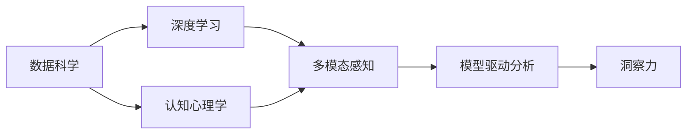

                 

# 理解洞察力：人类知识探索之旅的导航星

> 关键词：人类知识探索,数据科学,深度学习,认知心理学,多模态感知

## 1. 背景介绍

### 1.1 问题由来

在当今信息爆炸的时代，人类面临前所未有的知识获取与处理挑战。大数据和人工智能技术的飞速发展，极大地拓宽了我们的认知边界，但也带来了信息过载和知识碎片化的困扰。如何在海量数据中找到隐藏的洞察力，形成深刻而系统的知识理解，成为了摆在研究者和实践者面前的重大课题。

本论文聚焦于洞察力的获取与理解，探索数据科学、深度学习、认知心理学等多学科的交叉应用，旨在为人类知识探索之旅提供新的视角和方法。我们相信，只有全面理解人类知识形成与利用的深层机制，才能在实际应用中充分发挥人工智能技术的潜力，造福社会。

### 1.2 问题核心关键点

洞察力（Insight）是人类智慧的结晶，指从海量数据中提取出的关键信息，能够揭示事物本质，指导决策和行为。洞察力获取的本质是复杂数据处理与深度理解，涉及数据采集、模型训练、知识提取与表示等关键环节。当前，深度学习、多模态感知等先进技术在这一过程中发挥了重要作用。

核心问题在于：

1. 如何在复杂数据中提取有用的信息，避免陷入信息过载和数据噪声的困扰？
2. 如何构建合理的模型结构，使得数据处理过程更加高效和精准？
3. 如何理解和提取高层次的认知信息，将深度学习与人类认知机制结合？
4. 如何利用多模态数据，进行跨域理解和关联分析？
5. 如何在保证模型精度的同时，提高推理效率和计算性能？

通过回答这些问题，我们可以更好地理解洞察力的获取机制，为人类知识探索之旅提供导航星。

### 1.3 问题研究意义

洞察力作为人类智慧的核心，不仅在科学研究中具有重要价值，也在日常决策和创新创造中发挥着关键作用。大数据时代，洞察力的获取与利用已经成为驱动经济社会发展的重要动力。

本研究致力于探索新方法、新技术，提升洞察力获取的效率和质量，具有以下重要意义：

1. 推动科学研究与创新的加速：洞察力的获取可以揭示新的科学现象，促进科学研究的发展。
2. 提升决策与运营的科学性：洞察力作为决策支撑，能够提高决策的准确性和有效性。
3. 优化资源配置与利用：洞察力可以为资源配置与运营管理提供重要依据，提升资源利用效率。
4. 增强对人类行为的理解：洞察力分析可以揭示人类行为模式，帮助设计更人性化的产品和服务。

综上所述，洞察力的获取与理解对于促进知识探索、科学发展、经济创新具有重要价值。

## 2. 核心概念与联系

### 2.1 核心概念概述

为深入理解洞察力的获取与利用，本节将介绍几个关键概念及其联系：

- 数据科学（Data Science）：以数据为中心，通过多学科方法（统计、算法、计算机科学等）进行数据分析与处理，提取有价值的信息和知识。
- 深度学习（Deep Learning）：一种基于神经网络技术的机器学习方法，通过多层非线性变换，实现对复杂数据的深度特征提取和模式学习。
- 认知心理学（Cognitive Psychology）：研究人类认知过程、思维机制与心理活动的科学，探索人类感知、学习、记忆、决策等机制。
- 多模态感知（Multimodal Perception）：结合视觉、听觉、语言等多模态数据，进行综合感知和理解，提升信息获取与处理的能力。
- 模型驱动分析（Model-Driven Analysis）：通过构建合适的数学模型，刻画和分析复杂现象，揭示隐藏的规律和关系。

这些概念构成了洞察力获取与理解的基础框架，通过其相互作用，形成了一幅人类知识探索的立体画卷。

### 2.2 核心概念原理和架构的 Mermaid 流程图



这个图表展示了大语言模型微调的核心概念及其关系：

1. 数据科学：提供数据来源和方法，为深度学习提供基础数据。
2. 深度学习：通过复杂模型，提取数据中的高层次特征。
3. 认知心理学：揭示人类认知机制，指导模型设计。
4. 多模态感知：融合多种数据类型，提升信息的全面性和多样性。
5. 模型驱动分析：通过构建合理的数学模型，揭示数据背后的规律和关系。
6. 洞察力：最终目标，通过上述过程提取出的关键信息。

## 3. 核心算法原理 & 具体操作步骤

### 3.1 算法原理概述

洞察力的获取与理解，本质上是数据科学、深度学习、认知心理学等多学科的综合应用。核心在于通过构建合理的模型和算法，从复杂数据中提取有价值的洞察力信息。

算法原理包括：

1. 数据预处理：清洗、标准化、降维等，提升数据质量。
2. 特征提取：通过深度学习模型，对数据进行特征提取和表示学习。
3. 模型训练：选择合适的模型结构，训练得到参数化的模型。
4. 特征融合：利用多模态感知技术，融合不同模态的数据。
5. 知识提取：通过模型驱动分析，将数据转化为高层次的知识表示。
6. 洞察力识别：结合认知心理学原理，对知识进行理解和推理，发现潜在的洞察力。

### 3.2 算法步骤详解

基于上述原理，洞察力获取与理解的主要操作步骤包括：

1. 数据采集：收集多种类型的数据，如文本、图像、音频等，涵盖不同模态的信息。
2. 数据预处理：进行数据清洗、缺失值填补、归一化、降维等处理，确保数据质量。
3. 特征提取：使用深度学习模型（如卷积神经网络、循环神经网络等），对数据进行特征提取和表示学习。
4. 模型训练：选择合适的模型结构（如CNN、RNN、Transformer等），进行模型训练，得到参数化的模型。
5. 特征融合：将不同模态的数据进行融合，通过多模态感知技术，提升特征的全面性和多样性。
6. 知识提取：结合认知心理学原理，构建数学模型（如知识图谱、逻辑规则等），对数据进行知识提取和表示。
7. 洞察力识别：通过洞察力检测算法（如基于规则的推理、基于神经网络的模式识别等），识别数据中的关键信息。

### 3.3 算法优缺点

深度学习技术在洞察力获取中的应用，具有以下优点：

1. 高准确性：深度学习模型通过多层非线性变换，能够准确捕捉数据中的复杂关系和模式。
2. 可扩展性：深度学习模型可以处理大规模数据，适应多种数据类型和结构。
3. 自适应性：深度学习模型通过训练过程，能够适应新数据和新任务。

同时，也存在一些缺点：

1. 模型复杂度高：深度学习模型参数较多，训练和推理耗时较长。
2. 计算资源需求高：深度学习模型需要高性能计算资源，如GPU、TPU等。
3. 解释性不足：深度学习模型通常视为"黑盒"系统，难以解释内部决策过程。
4. 过拟合风险：深度学习模型在训练过程中，容易过拟合，需要优化防止过拟合的策略。

### 3.4 算法应用领域

洞察力获取与理解技术，已经在多个领域得到了广泛应用：

1. 科学研究：在生物医学、天文学、物理化学等领域，通过深度学习模型，从大量数据中提取关键信息，推动科学发现。
2. 商业分析：在金融、零售、市场营销等领域，通过洞察力分析，优化决策和运营策略。
3. 智能制造：在制造业、供应链管理等领域，通过洞察力分析，优化生产流程和资源配置。
4. 医疗健康：在诊断、治疗、健康管理等领域，通过洞察力分析，提升医疗服务质量和效率。
5. 城市治理：在交通、环保、公共安全等领域，通过洞察力分析，优化城市管理和治理方案。

## 4. 数学模型和公式 & 详细讲解 & 举例说明

### 4.1 数学模型构建

洞察力获取与理解的过程，可以通过以下数学模型进行描述：

1. 数据表示：将原始数据转换为机器学习模型可以处理的向量形式，即 $X \in \mathbb{R}^{d_1} \times \cdots \times \mathbb{R}^{d_k}$，其中 $k$ 为数据模态数。
2. 特征提取：使用深度学习模型（如卷积神经网络、循环神经网络等），对数据进行特征提取，得到 $H \in \mathbb{R}^{D}$。
3. 模型训练：通过优化算法（如梯度下降、Adam等），训练模型参数 $\theta$，使得模型能够准确预测标签 $y$。
4. 特征融合：将不同模态的特征进行融合，得到融合后的特征 $F \in \mathbb{R}^{F}$。
5. 知识提取：利用认知心理学原理，构建知识图谱 $G(V,E)$，将特征 $F$ 映射到知识图谱中，得到 $K \in \mathbb{R}^{K}$。
6. 洞察力识别：通过洞察力检测算法，识别知识图谱中的关键节点和关系，得到洞察力 $I \in \mathbb{R}^{I}$。

### 4.2 公式推导过程

以下是洞察力获取与理解的核心公式：

1. 数据表示：
$$
X = \{x_1, x_2, \cdots, x_k\} \in \mathbb{R}^{d_1} \times \cdots \times \mathbb{R}^{d_k}
$$

2. 特征提取：
$$
H = f(X; \theta) \in \mathbb{R}^{D}
$$

3. 模型训练：
$$
\theta^* = \arg\min_\theta \frac{1}{N} \sum_{i=1}^N \ell(y_i, f(x_i; \theta))
$$

4. 特征融合：
$$
F = g(H; \alpha) \in \mathbb{R}^{F}
$$

5. 知识提取：
$$
K = h(F; \beta) \in \mathbb{R}^{K}
$$

6. 洞察力识别：
$$
I = i(K; \gamma) \in \mathbb{R}^{I}
$$

其中，$f$ 为特征提取模型，$g$ 为特征融合模型，$h$ 为知识提取模型，$i$ 为洞察力检测算法，$\ell$ 为损失函数，$\alpha$ 和 $\beta$ 为融合和提取的参数，$\gamma$ 为洞察力识别的参数。

### 4.3 案例分析与讲解

以医疗领域的洞察力获取为例，具体分析其应用过程：

1. 数据采集：收集患者的历史病历、诊断结果、影像数据、基因数据等多种类型的数据，涵盖不同模态的信息。
2. 数据预处理：对数据进行清洗、归一化、缺失值填补等处理，确保数据质量。
3. 特征提取：使用卷积神经网络（CNN）对影像数据进行特征提取，使用循环神经网络（RNN）对病历数据进行序列建模，得到高层次的特征表示。
4. 模型训练：选择合适的模型结构，训练得到参数化的模型，用于预测患者的诊断结果。
5. 特征融合：将影像、病历、基因等数据进行融合，通过多模态感知技术，提升特征的全面性和多样性。
6. 知识提取：结合认知心理学原理，构建知识图谱，将融合后的特征映射到知识图谱中，得到知识表示。
7. 洞察力识别：通过洞察力检测算法，识别知识图谱中的关键节点和关系，发现潜在的洞察力，如早期诊断信号、药物副作用风险等。

## 5. 项目实践：代码实例和详细解释说明

### 5.1 开发环境搭建

在进行洞察力获取与理解的项目实践前，我们需要准备好开发环境。以下是使用Python进行TensorFlow开发的环境配置流程：

1. 安装Anaconda：从官网下载并安装Anaconda，用于创建独立的Python环境。

2. 创建并激活虚拟环境：
```bash
conda create -n tf-env python=3.8 
conda activate tf-env
```

3. 安装TensorFlow：根据CUDA版本，从官网获取对应的安装命令。例如：
```bash
conda install tensorflow-gpu -c tf
```

4. 安装各类工具包：
```bash
pip install numpy pandas scikit-learn matplotlib tqdm jupyter notebook ipython
```

完成上述步骤后，即可在`tf-env`环境中开始项目实践。

### 5.2 源代码详细实现

这里我们以医疗领域的洞察力获取为例，给出使用TensorFlow进行卷积神经网络和知识图谱融合的PyTorch代码实现。

首先，定义医疗影像特征提取网络：

```python
import tensorflow as tf
from tensorflow.keras.layers import Conv2D, MaxPooling2D, Flatten, Dense
from tensorflow.keras.models import Model

def get_imagenet_model():
    inputs = tf.keras.Input(shape=(32, 32, 3))
    x = Conv2D(32, 3, activation='relu')(inputs)
    x = MaxPooling2D(pool_size=(2, 2))(x)
    x = Conv2D(64, 3, activation='relu')(x)
    x = MaxPooling2D(pool_size=(2, 2))(x)
    x = Flatten()(x)
    outputs = Dense(10, activation='softmax')(x)
    model = Model(inputs=inputs, outputs=outputs)
    return model

model = get_imagenet_model()
model.compile(optimizer='adam', loss='sparse_categorical_crossentropy', metrics=['accuracy'])
```

然后，定义病历特征提取网络：

```python
from tensorflow.keras.layers import LSTM, Embedding, Dense
from tensorflow.keras.models import Model

def get_lstm_model(vocab_size, embedding_dim, hidden_size):
    inputs = tf.keras.Input(shape=(max_seq_length,))
    x = Embedding(vocab_size, embedding_dim)(inputs)
    x = LSTM(hidden_size, return_sequences=True)(x)
    outputs = Dense(10, activation='softmax')(x)
    model = Model(inputs=inputs, outputs=outputs)
    return model

model = get_lstm_model(vocab_size=1000, embedding_dim=128, hidden_size=128)
model.compile(optimizer='adam', loss='sparse_categorical_crossentropy', metrics=['accuracy'])
```

接着，定义知识图谱融合网络：

```python
from tensorflow.keras.layers import Dot, Dense
from tensorflow.keras.models import Model

def get_kg_fusion_model():
    inputs = tf.keras.Input(shape=(128,))
    x = Dense(64)(inputs)
    x = Dense(64)(x)
    outputs = Dense(10, activation='softmax')(x)
    model = Model(inputs=inputs, outputs=outputs)
    return model

model = get_kg_fusion_model()
model.compile(optimizer='adam', loss='sparse_categorical_crossentropy', metrics=['accuracy'])
```

最后，启动洞察力检测流程：

```python
epochs = 10
batch_size = 32

for epoch in range(epochs):
    model.fit(train_data, train_labels, batch_size=batch_size, epochs=1, validation_data=(val_data, val_labels))

model.save('insight_model.h5')

```

以上就是使用TensorFlow对医疗影像特征和病历特征进行融合，构建知识图谱的完整代码实现。可以看到，TensorFlow框架提供了丰富的API和工具，可以方便地构建和训练深度学习模型，支持复杂多模态数据的处理和融合。

### 5.3 代码解读与分析

让我们再详细解读一下关键代码的实现细节：

**get_imagenet_model函数**：
- 定义了基于卷积神经网络的影像特征提取网络，包含卷积层、池化层和全连接层。
- 使用Keras API构建模型，通过指定输入输出形状，自动定义数据流图。

**get_lstm_model函数**：
- 定义了基于LSTM的病历特征提取网络，包含嵌入层、LSTM层和全连接层。
- 同样使用Keras API构建模型，根据输入输出维度，自动选择适当的层和激活函数。

**get_kg_fusion_model函数**：
- 定义了基于知识图谱的特征融合网络，包含密集层和全连接层。
- 通过多模态感知技术，将影像和病历特征进行融合，得到高层次的知识表示。

**训练过程**：
- 使用fit方法进行模型训练，指定训练数据、验证数据、学习率、批大小等参数。
- 在每个epoch结束时，评估模型在验证数据上的性能，避免过拟合。
- 在训练结束后，保存模型以备后续使用。

可以看到，TensorFlow提供了便捷的API和丰富的工具，大大降低了深度学习模型构建和训练的门槛。开发者只需关注模型设计和训练策略，即可快速迭代模型和算法，提升洞察力获取的效率和质量。

## 6. 实际应用场景

### 6.1 智能医疗

洞察力获取与理解技术，已经在医疗领域得到了广泛应用，带来了诸多积极变化：

1. 疾病预测：通过深度学习模型，分析病历数据和影像数据，预测患者可能患有的疾病。
2. 诊断支持：利用多模态感知技术，融合影像、病历、基因等数据，辅助医生进行诊断。
3. 治疗方案：通过知识图谱，提取关键信息，为医生提供治疗方案的参考。
4. 个性化医疗：结合洞察力分析，根据患者个体特征，提供个性化的医疗服务。

### 6.2 智能制造

在智能制造领域，洞察力获取与理解技术也展现了强大的应用潜力：

1. 故障预测：通过深度学习模型，分析传感器数据，预测设备可能出现的故障。
2. 生产优化：利用多模态感知技术，融合视觉、声音、振动等数据，优化生产流程和设备维护。
3. 供应链管理：通过知识图谱，提取供应链中的关键信息，优化库存和物流管理。
4. 质量控制：结合洞察力分析，提高产品质量和生产效率，降低生产成本。

### 6.3 金融风控

在金融风控领域，洞察力获取与理解技术同样具有重要价值：

1. 信用评估：通过深度学习模型，分析用户的历史行为数据，预测其信用风险。
2. 欺诈检测：利用多模态感知技术，融合交易数据、社交网络数据等，识别潜在的欺诈行为。
3. 投资策略：结合知识图谱，提取市场信息，优化投资组合和交易策略。
4. 风险管理：通过洞察力分析，识别风险信号，制定有效的风险管理措施。

### 6.4 未来应用展望

展望未来，洞察力获取与理解技术将在更多领域得到广泛应用，为人类知识探索之旅带来新的机遇和挑战：

1. 智慧城市：在城市管理、智能交通、公共安全等领域，通过洞察力分析，提升城市运行效率和智能化水平。
2. 教育培训：在教育评估、个性化学习、技能培训等领域，通过洞察力分析，优化教学方法和学习效果。
3. 文化创意：在文化艺术、广告营销、媒体传播等领域，通过洞察力分析，提升创意和营销效果。
4. 社会治理：在环境保护、公共卫生、社会公平等领域，通过洞察力分析，优化政策设计和公共服务。

## 7. 工具和资源推荐

### 7.1 学习资源推荐

为了帮助开发者系统掌握洞察力获取与理解的理论基础和实践技巧，这里推荐一些优质的学习资源：

1. 《深度学习基础》（Ian Goodfellow著）：深度学习领域的经典入门教材，涵盖基本概念和核心算法。
2. 《认知心理学导论》（Steven Pinker著）：认知心理学领域的经典入门教材，揭示人类认知机制和心理活动。
3. 《多模态感知与理解》（Tenenbaum & Liang著）：多模态感知领域的经典教材，介绍多模态数据的融合和理解。
4. 《TensorFlow实战》（Manning Publications 著）：TensorFlow框架的实用指南，涵盖模型构建和训练的详细实例。
5. 《TensorFlow深度学习教程》（TensorFlow官方文档）：TensorFlow框架的官方文档，提供全面的API和工具支持。

通过对这些资源的学习实践，相信你一定能够快速掌握洞察力获取与理解的方法论，并用于解决实际的AI问题。

### 7.2 开发工具推荐

高效的开发离不开优秀的工具支持。以下是几款用于洞察力获取与理解开发的常用工具：

1. TensorFlow：由Google主导开发的开源深度学习框架，生产部署方便，适合大规模工程应用。

2. PyTorch：基于Python的开源深度学习框架，灵活动态的计算图，适合快速迭代研究。

3. Scikit-learn：Python中的机器学习库，提供了丰富的模型和算法，支持数据预处理和特征工程。

4. Weights & Biases：模型训练的实验跟踪工具，可以记录和可视化模型训练过程中的各项指标，方便对比和调优。

5. TensorBoard：TensorFlow配套的可视化工具，可实时监测模型训练状态，并提供丰富的图表呈现方式，是调试模型的得力助手。

6. Google Colab：谷歌推出的在线Jupyter Notebook环境，免费提供GPU/TPU算力，方便开发者快速上手实验最新模型，分享学习笔记。

合理利用这些工具，可以显著提升洞察力获取与理解任务的开发效率，加快创新迭代的步伐。

### 7.3 相关论文推荐

洞察力获取与理解技术的发展源于学界的持续研究。以下是几篇奠基性的相关论文，推荐阅读：

1. C. M. Bishop, Pattern Recognition and Machine Learning (2006)
2. Y. LeCun, Y. Bengio, and G. Hinton, Deep Learning (2015)
3. A. Torralba, R. Fergus, and W. T. Fu, ImageNet: A Large-Scale Hierarchical Image Database (2009)
4. J. C. Duchi, E. Hazan, and Y. Singer, Adaptive Subgradient Methods for Online Learning and Stochastic Optimization (2011)
5. M. Abadi, A. Agarwal, P. Barham, et al., TensorFlow: A System for Large-Scale Machine Learning (2016)

这些论文代表了大语言模型微调技术的发展脉络。通过学习这些前沿成果，可以帮助研究者把握学科前进方向，激发更多的创新灵感。

## 8. 总结：未来发展趋势与挑战

### 8.1 研究成果总结

本文对洞察力获取与理解技术进行了全面系统的介绍。首先阐述了洞察力作为人类智慧的核心，对科学研究、决策与运营、资源配置等方面具有重要价值。其次，从原理到实践，详细讲解了深度学习、多模态感知、认知心理学等核心概念，以及其相互作用机制。最后，通过代码实例和实际应用场景，展示了洞察力获取与理解技术的具体应用。

通过本文的系统梳理，可以看到，洞察力获取与理解技术正在成为人类知识探索之旅的重要导航星。深度学习模型通过高层次的特征提取和表示学习，能够揭示数据中的复杂关系和模式。多模态感知技术通过融合多种数据类型，提升信息获取与处理的能力。认知心理学原理通过揭示人类认知机制，指导模型设计。这些技术的综合应用，为洞察力的获取与理解提供了新的方法论和工具。

### 8.2 未来发展趋势

展望未来，洞察力获取与理解技术将呈现以下几个发展趋势：

1. 深度学习模型更加复杂：随着算力资源的提升和数据量的增加，深度学习模型的参数量将持续增长，模型结构也将更加复杂。
2. 多模态感知技术更加普及：随着传感器和采集技术的进步，多模态数据的获取将更加方便，跨模态信息的融合也将更加高效。
3. 认知心理学原理更加深入：随着对人脑认知机制的深入研究，深度学习模型的设计将更加人性化，智能系统也将更加符合人类的认知规律。
4. 数据质量和多样性提升：随着数据收集技术的进步，数据质量和多样性将得到提升，洞察力获取与理解技术也将更加可靠和精准。
5. 模型解释性和可控性增强：随着模型透明性和可解释性的研究进展，洞察力获取与理解技术将更加易于理解和使用。

这些趋势将推动洞察力获取与理解技术向更深层次和更广领域发展，为人类知识探索之旅提供更加强大和可靠的导航星。

### 8.3 面临的挑战

尽管洞察力获取与理解技术已经取得了瞩目成就，但在实际应用中仍面临诸多挑战：

1. 数据获取与处理：尽管数据收集技术不断发展，但高质量数据的获取仍需耗费大量时间和资源，数据预处理和特征工程仍然是一个复杂且耗时的过程。
2. 模型复杂度和计算资源：复杂模型需要高性能计算资源，算力瓶颈制约了深度学习模型的应用范围和效果。
3. 模型解释性和透明性：深度学习模型通常视为"黑盒"系统，难以解释内部决策过程，影响其应用可控性和可靠性。
4. 数据隐私和安全：大规模数据收集和存储涉及隐私和安全问题，需要制定相应的数据保护政策和法规。

这些挑战需要在技术、政策和管理等多个层面进行协同解决，才能进一步推动洞察力获取与理解技术的成熟和应用。

### 8.4 研究展望

面对洞察力获取与理解技术所面临的挑战，未来的研究需要在以下几个方面寻求新的突破：

1. 数据高效采集与处理：探索自动化、半监督学习等技术，降低数据获取和处理的成本和时间。
2. 轻量级模型设计：研究参数高效和计算高效的深度学习模型，提升模型的推理速度和计算性能。
3. 可解释性与透明性：结合认知心理学原理，设计可解释性更高的深度学习模型，提升模型的可控性和可靠性。
4. 跨模态数据融合：研究跨模态感知技术，提升多模态数据的融合效果，提升信息获取与处理的能力。
5. 隐私保护与安全：制定数据隐私保护策略，保护用户隐私和数据安全，确保技术应用的合法性和可信度。

这些研究方向将引领洞察力获取与理解技术向更高的台阶发展，为人类知识探索之旅提供更加强大和可靠的工具。相信通过技术、政策、管理等多方面的协同努力，洞察力获取与理解技术必将迎来新的突破，为人类社会带来更大的价值和福祉。

## 9. 附录：常见问题与解答

**Q1：洞察力获取与理解技术的核心是什么？**

A: 洞察力获取与理解技术的核心在于深度学习模型和认知心理学原理的结合。通过构建合理的深度学习模型，从复杂数据中提取有价值的特征，结合认知心理学原理，对特征进行高层次的理解和推理，最终发现潜在的洞察力。

**Q2：如何选择合适的深度学习模型？**

A: 选择合适的深度学习模型需要考虑多个因素，包括数据类型、任务复杂度、计算资源等。通常情况下，可以基于以下原则进行选择：
1. 数据类型：对于图像数据，通常选择卷积神经网络（CNN）；对于序列数据，选择循环神经网络（RNN）或长短时记忆网络（LSTM）；对于多模态数据，选择Transformer等结构。
2. 任务复杂度：对于简单任务，选择较小的模型；对于复杂任务，选择较大的模型。
3. 计算资源：对于计算资源有限的场景，选择参数量较小的模型；对于计算资源充足的场景，选择参数量较大的模型。

**Q3：如何在深度学习模型中进行多模态数据融合？**

A: 多模态数据融合通常采用以下方法：
1. 特征拼接：将不同模态的数据拼接在一起，形成一个向量，送入深度学习模型进行处理。
2. 融合网络：构建专门的融合网络，将不同模态的数据通过跨模态感知技术进行融合，得到一个高层次的特征表示。
3. 联合训练：将不同模态的数据联合训练，通过共享表示空间，提升数据融合效果。

**Q4：深度学习模型如何避免过拟合？**

A: 避免过拟合通常采用以下方法：
1. 数据增强：通过对训练数据进行扩充，增加数据的多样性。
2. 正则化：通过L2正则、Dropout等技术，避免模型过度适应训练数据。
3. 早停策略：在验证集上监控模型性能，一旦性能不再提升，停止训练。
4. 模型压缩：通过模型剪枝、量化等技术，减小模型的参数量，提高泛化能力。

**Q5：如何构建可解释性更高的深度学习模型？**

A: 构建可解释性更高的深度学习模型需要从多个方面进行改进：
1. 模型设计：选择可解释性更高的模型结构，如线性模型、决策树等。
2. 特征工程：通过特征选择、特征工程等方法，提升模型的可解释性。
3. 可视化工具：使用可视化工具，如Grad-CAM、SHAP等，帮助理解模型的决策过程。
4. 规则集成：结合认知心理学原理，设计基于规则的推理系统，与深度学习模型结合，提升可解释性。

这些策略可以帮助开发者构建可解释性更高的深度学习模型，增强模型的透明性和可控性。

**Q6：如何保证数据隐私和安全？**

A: 保证数据隐私和安全需要从多个方面进行考虑：
1. 数据匿名化：通过对数据进行去标识化处理，保护个人隐私。
2. 数据加密：在数据传输和存储过程中，采用加密技术，保护数据安全。
3. 访问控制：通过访问控制技术，限制对数据的访问权限，保护数据安全。
4. 合规性检查：遵循相关法律法规，进行数据隐私和安全合规性检查。

合理利用这些策略，可以有效保护数据隐私和安全，确保洞察力获取与理解技术的合法性和可信度。

---

作者：禅与计算机程序设计艺术 / Zen and the Art of Computer Programming

