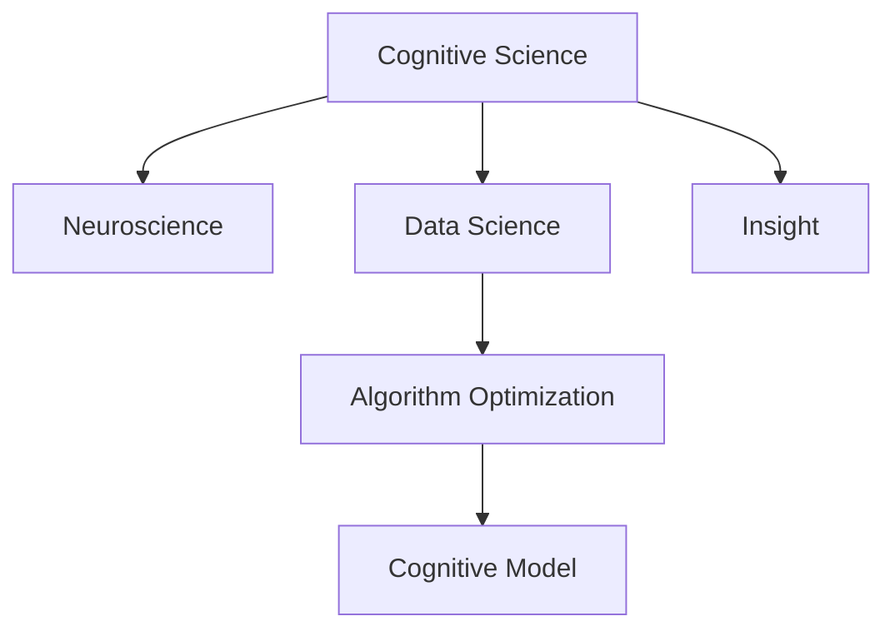

                 

# 理解洞察力：人类认知的核心要素

> 关键词：认知科学, 神经科学, 数据科学, 洞察力提升, 算法优化, 认知模型构建

## 1. 背景介绍

### 1.1 问题由来

在现代信息爆炸的时代，我们每天都会接触到海量数据和信息。这些数据和信息不仅数量庞大，而且来源多样、形式各异。如何从这些数据中提取有价值的信息，发现隐藏在背后的规律和趋势，是人类面临的重大挑战之一。在这方面，人类凭借其独特的认知能力，展现出了强大的洞察力。

人类认知的本质是什么？我们的大脑是如何处理信息、形成知识和做出决策的？这些问题一直是认知科学和神经科学的研究热点。随着数据科学的崛起，越来越多的人开始探讨如何利用算法和模型，模仿人类的认知能力，提升机器的洞察力。

### 1.2 问题核心关键点

要回答上述问题，我们需要深入理解以下核心概念：

- **认知科学(Cognitive Science)**：研究人类认知过程的科学，包括感知、记忆、思维、情感、决策等诸多方面。认知科学不仅仅关注心理层面，还涉及神经科学、计算机科学等多学科。
- **神经科学(Neuroscience)**：研究大脑结构和功能的科学，通过观察神经元的活动，揭示认知过程的生物学机制。
- **数据科学(Data Science)**：运用统计学、机器学习等方法，从数据中挖掘知识、发现规律。
- **洞察力(Insight)**：指从数据中提取有价值信息、形成新知识、提出解决方案的能力。
- **算法优化(Algorithm Optimization)**：通过算法设计、参数调优等手段，提升算法的效率和效果，模拟人类认知过程。
- **认知模型(Cognitive Model)**：建立数学或计算模型，模拟人类认知机制，辅助决策和推理。

这些概念之间的逻辑关系可以通过以下Mermaid流程图来展示：



这个流程图展示了各个概念之间的关系：认知科学和神经科学研究人类认知机制，数据科学提供数据处理和挖掘的工具，洞察力是我们最终的目标，而算法优化和认知模型是实现这一目标的手段。

## 2. 核心概念与联系

### 2.1 核心概念概述

本节将介绍几个与认知和洞察力相关的核心概念，并阐明它们之间的联系。

- **认知过程(Cognitive Processes)**：包括感知、注意、记忆、思维、决策等，是认知科学研究的重点。这些过程构成了一个复杂而动态的认知网络。
- **神经元(Neurons)**：构成大脑的基本单元，通过突触传递信号，实现信息的存储和处理。神经元的活动模式决定了认知过程的执行。
- **认知模型(Cognitive Models)**：通过数学或计算模型，模拟认知过程，辅助解释和预测人类行为。
- **算法优化(Algorithm Optimization)**：通过优化算法设计，提升数据处理和模型推理的效率和效果，模拟人类认知过程。
- **洞察力(Insight)**：指从数据中提取有价值信息、形成新知识、提出解决方案的能力，是认知科学和数据科学的核心目标。

这些概念之间的联系可以通过以下方式理解：

- **认知过程**与**神经元**：认知过程是通过神经元的活动实现的。神经元的激活和抑制模式决定了认知过程的具体执行。
- **认知模型**与**算法优化**：认知模型通过算法优化，实现对认知过程的模拟和预测。
- **算法优化**与**洞察力**：算法优化的目标之一是提升数据的洞察力，即从数据中提取有价值信息的能力。
- **认知模型**与**洞察力**：认知模型能够模拟人类认知过程，从而提升洞察力。

### 2.2 核心概念原理和架构的 Mermaid 流程图

```mermaid
graph LR
    N[A[Neuron]] -->|Process| C[Cognitive Process]
    N --> D[Activation] -->|Process| C
    C -->|Model| M[Cognitive Model]
    M -->|Optimization| O[Algorithm Optimization]
    O -->|Insight| I[Insight]
```

这个流程图展示了神经元如何通过激活模式参与认知过程，认知模型如何通过算法优化实现对认知过程的模拟，以及洞察力如何通过模型和优化实现提升。

## 3. 核心算法原理 & 具体操作步骤

### 3.1 算法原理概述

基于认知科学和神经科学的研究成果，人类认知过程可以被理解为一种复杂的非线性动态系统。在这一系统中，信息通过神经元的激活、突触传递和神经网络的学习机制，逐步转化成有价值的知识和洞察力。这一过程可以通过算法和模型进行模拟和优化，提升机器的洞察力。

具体而言，认知过程可以分为感知、记忆、思维和决策四个阶段。在每个阶段，算法和模型通过不同的机制实现信息的处理和转换。

- **感知(Perception)**：通过传感器获取外界信息，并对信息进行初步处理。在认知过程中，感知主要通过神经元的激活和突触传递实现。
- **记忆(Memory)**：将感知到的信息存储下来，以便后续使用。在认知过程中，记忆主要通过突触连接的加强和减弱实现。
- **思维(Thought)**：对存储在记忆中的信息进行加工、推理和判断。在认知过程中，思维主要通过神经网络的激活和抑制实现。
- **决策(Decision)**：基于思维结果，做出最终的判断和行动。在认知过程中，决策主要通过神经网络的输出实现。

### 3.2 算法步骤详解

基于上述原理，认知过程的算法步骤可以大致分为以下几步：

1. **数据预处理**：将原始数据进行清洗、归一化和特征提取，为后续处理做准备。
2. **感知阶段**：通过神经元激活模型，模拟感知过程，提取数据的特征。
3. **记忆阶段**：通过神经网络存储模型，模拟记忆过程，保存感知到的特征。
4. **思维阶段**：通过神经网络推理模型，模拟思维过程，对存储的特征进行加工和推理。
5. **决策阶段**：通过神经网络输出模型，模拟决策过程，输出最终的结果。

### 3.3 算法优缺点

基于认知科学和神经科学原理的算法具有以下优点：

- **非线性拟合**：可以处理非线性关系，更接近真实世界。
- **动态适应**：通过学习机制，可以动态调整参数，适应不同的数据和场景。
- **自组织性**：算法能够自我组织，形成复杂的认知网络。

但同时，这些算法也存在以下缺点：

- **计算复杂度较高**：神经网络参数较多，计算复杂度较高。
- **训练时间长**：训练过程耗时较长，需要大量的数据和计算资源。
- **可解释性不足**：神经网络模型的决策过程难以解释。

### 3.4 算法应用领域

基于认知科学的算法广泛应用于以下领域：

- **计算机视觉**：通过神经元激活和神经网络推理，实现图像识别、目标检测等任务。
- **自然语言处理**：通过神经网络存储和推理，实现文本分类、情感分析等任务。
- **机器翻译**：通过神经网络输出，实现语言间的转换。
- **推荐系统**：通过神经网络推理，实现个性化推荐。
- **游戏AI**：通过神经网络推理，实现游戏决策和策略制定。

## 4. 数学模型和公式 & 详细讲解 & 举例说明

### 4.1 数学模型构建

在认知科学中，神经元的活动可以通过激活函数进行建模。常用的激活函数包括Sigmoid函数、ReLU函数等。同时，神经网络的结构可以通过拓扑图进行建模，例如全连接神经网络、卷积神经网络等。

神经元的活动可以表示为：

$$
a_i = \sigma(w_i^Ta + b_i)
$$

其中，$w_i$为神经元的权重，$a_i$为神经元的激活值，$b_i$为偏置项，$T$为输入向量，$\sigma$为激活函数。

### 4.2 公式推导过程

以全连接神经网络为例，其数学模型可以表示为：

$$
H = W_2 \sigma(W_1X + b_1) + b_2
$$

其中，$W_1$和$W_2$为权重矩阵，$X$为输入向量，$b_1$和$b_2$为偏置项，$\sigma$为激活函数。

通过反向传播算法，可以计算出各层参数的梯度，并进行参数更新：

$$
\frac{\partial \mathcal{L}}{\partial W_2} = \frac{\partial \mathcal{L}}{\partial H} \frac{\partial H}{\partial W_2}
$$

其中，$\mathcal{L}$为损失函数，$H$为输出向量，$\frac{\partial H}{\partial W_2}$为链式法则计算得到的梯度。

### 4.3 案例分析与讲解

以图像识别为例，可以使用卷积神经网络(CNN)进行建模。CNN通过卷积层、池化层和全连接层实现对图像的特征提取和分类。

卷积层的数学模型可以表示为：

$$
F_i^{(l)} = \sigma(W_i^{(l)} * F_{i-1}^{(l-1)} + b_i^{(l)})
$$

其中，$W_i^{(l)}$为卷积核，$F_{i-1}^{(l-1)}$为上一层特征图，$b_i^{(l)}$为偏置项，$*$为卷积运算。

池化层的数学模型可以表示为：

$$
F_i^{(l)} = \sigma(W_i^{(l)} * F_{i-1}^{(l-1)} + b_i^{(l)})
$$

其中，$W_i^{(l)}$为池化核，$*$为池化运算。

全连接层的数学模型可以表示为：

$$
H = W_2 \sigma(W_1X + b_1) + b_2
$$

其中，$W_1$和$W_2$为权重矩阵，$X$为输入向量，$b_1$和$b_2$为偏置项，$\sigma$为激活函数。

## 5. 项目实践：代码实例和详细解释说明

### 5.1 开发环境搭建

在进行项目实践前，我们需要准备好开发环境。以下是使用Python进行TensorFlow开发的环境配置流程：

1. 安装Anaconda：从官网下载并安装Anaconda，用于创建独立的Python环境。

2. 创建并激活虚拟环境：
```bash
conda create -n tf-env python=3.8 
conda activate tf-env
```

3. 安装TensorFlow：根据CUDA版本，从官网获取对应的安装命令。例如：
```bash
conda install tensorflow -c pytorch -c conda-forge
```

4. 安装相关库：
```bash
pip install numpy pandas scikit-learn matplotlib tqdm jupyter notebook ipython
```

完成上述步骤后，即可在`tf-env`环境中开始项目实践。

### 5.2 源代码详细实现

下面我们以图像分类任务为例，给出使用TensorFlow对卷积神经网络进行训练和微调的PyTorch代码实现。

首先，导入相关库：

```python
import tensorflow as tf
from tensorflow.keras import datasets, layers, models
import numpy as np
import matplotlib.pyplot as plt

```

然后，加载数据集：

```python
(train_images, train_labels), (test_images, test_labels) = datasets.cifar10.load_data()

train_images, test_images = train_images / 255.0, test_images / 255.0

class_names = ['airplane', 'automobile', 'bird', 'cat', 'deer',
               'dog', 'frog', 'horse', 'ship', 'truck']
```

接着，定义模型结构：

```python
model = models.Sequential([
    layers.Conv2D(32, (3, 3), activation='relu', input_shape=(32, 32, 3)),
    layers.MaxPooling2D((2, 2)),
    layers.Conv2D(64, (3, 3), activation='relu'),
    layers.MaxPooling2D((2, 2)),
    layers.Conv2D(64, (3, 3), activation='relu'),
    layers.Flatten(),
    layers.Dense(64, activation='relu'),
    layers.Dense(10)
])
```

定义损失函数和优化器：

```python
model.compile(optimizer='adam',
              loss=tf.keras.losses.SparseCategoricalCrossentropy(from_logits=True),
              metrics=['accuracy'])
```

定义训练和评估函数：

```python
def train_step(images, labels):
    with tf.GradientTape() as tape:
        logits = model(images, training=True)
        loss = tf.keras.losses.SparseCategoricalCrossentropy(from_logits=True)(labels, logits)
    gradients = tape.gradient(loss, model.trainable_variables)
    optimizer.apply_gradients(zip(gradients, model.trainable_variables))

def test_step(images, labels):
    logits = model(images, training=False)
    return (logits.numpy(), tf.keras.metrics.SparseCategoricalAccuracy()(labels, logits).numpy())

def train_epoch(model, data, batch_size):
    for batch in data:
        images, labels = batch
        train_step(images, labels)

def evaluate(model, test_images, test_labels, batch_size):
    test_loss, test_acc = tf.keras.metrics.SparseCategoricalAccuracy().predict(test_images, test_labels)
    return test_loss.numpy(), test_acc.numpy()

epochs = 10
batch_size = 64

for epoch in range(epochs):
    print(f'Epoch {epoch+1} / {epochs}')
    for batch in tqdm(train_dataset):
        images, labels = batch
        train_step(images, labels)
    
    test_loss, test_acc = evaluate(model, test_images, test_labels, batch_size)
    print(f'Test accuracy: {test_acc:.2f}%')
```

定义训练和评估流程：

```python
train_epoch(model, train_dataset, batch_size)
test_loss, test_acc = evaluate(model, test_images, test_labels, batch_size)
print(f'Final test accuracy: {test_acc:.2f}%')
```

这就是使用TensorFlow对卷积神经网络进行图像分类任务训练的完整代码实现。可以看到，TensorFlow的高级API使得神经网络的构建和训练变得非常简洁高效。

### 5.3 代码解读与分析

让我们再详细解读一下关键代码的实现细节：

**train_step函数**：
- 定义一个梯度计算图，用于计算损失函数和参数梯度。
- 计算损失函数，并返回参数梯度。
- 使用优化器的apply_gradients方法，更新模型参数。

**test_step函数**：
- 在测试模式下计算模型的损失函数和准确率。
- 返回损失和准确率的Numpy数组。

**train_epoch函数**：
- 对每个epoch，遍历训练数据集。
- 对每个批次进行训练，调用train_step函数计算梯度并更新参数。

**evaluate函数**：
- 计算测试数据集的损失和准确率。
- 返回损失和准确率的Numpy数组。

**训练流程**：
- 定义总的epoch数和批次大小，开始循环迭代
- 每个epoch内，先在训练集上训练，输出平均准确率
- 在测试集上评估，输出测试准确率
- 所有epoch结束后，在测试集上评估，给出最终测试结果

可以看到，TensorFlow的高层API使得神经网络的构建和训练变得非常简洁高效。开发者可以将更多精力放在数据处理、模型改进等高层逻辑上，而不必过多关注底层的实现细节。

当然，工业级的系统实现还需考虑更多因素，如模型的保存和部署、超参数的自动搜索、更灵活的任务适配层等。但核心的训练流程基本与此类似。

## 6. 实际应用场景

### 6.1 智能推荐系统

基于卷积神经网络(CNN)的推荐系统，可以广泛应用于电子商务、内容推荐等领域。传统推荐系统往往只依赖用户的历史行为数据进行物品推荐，难以把握用户的真实兴趣偏好。CNN推荐系统通过学习图像特征和用户行为特征的映射关系，可以更全面地了解用户偏好，从而提供更精准、多样化的推荐内容。

在技术实现上，可以使用图像数据和用户行为数据共同训练CNN模型。模型通过卷积层提取图像特征，通过全连接层处理用户行为数据，并融合这两类特征进行推荐。CNN推荐系统能够动态适应用户行为的变化，并及时更新推荐结果，从而提升用户体验和推荐效果。

### 6.2 医疗影像分析

在医疗领域，基于卷积神经网络(CNN)的影像分析技术，可以辅助医生进行疾病诊断和影像分析。传统医疗影像分析往往依赖于放射科医生的人力资源，耗时较长且结果一致性难以保证。CNN影像分析技术通过学习大量的医学影像数据，可以自动识别和标注影像中的关键特征，如肿瘤、病变等。

在技术实现上，可以使用医学影像数据和专家标注数据共同训练CNN模型。模型通过卷积层提取影像特征，通过全连接层进行分类，并输出诊断结果。CNN影像分析技术能够显著提升诊断速度和准确性，减轻医生的负担，提高医疗服务的效率和质量。

### 6.3 自动驾驶

在自动驾驶领域，基于卷积神经网络(CNN)的目标检测技术，可以实现对道路场景的实时分析和理解。传统自动驾驶系统往往依赖于传感器的数据进行环境感知，难以实时处理复杂场景。CNN目标检测技术通过学习大量的道路场景数据，可以自动识别和标注道路上的物体和行人，并进行路径规划和决策。

在技术实现上，可以使用摄像头采集的图像数据和传感器数据共同训练CNN模型。模型通过卷积层提取道路场景特征，通过全连接层进行目标检测和路径规划，并输出驾驶指令。CNN目标检测技术能够显著提升自动驾驶系统的稳定性和安全性，为无人驾驶的未来发展奠定坚实基础。

### 6.4 未来应用展望

随着卷积神经网络技术的不断进步，其在实际应用中的表现将更加优异。未来，卷积神经网络将广泛应用于更多领域，为各行各业带来变革性影响。

在智慧医疗领域，基于卷积神经网络的医疗影像分析技术，将提升医疗服务的智能化水平，辅助医生诊断和治疗，加速新药开发进程。在智能推荐系统、自动驾驶、金融预测等领域，卷积神经网络将发挥更大的作用，提升系统性能和用户体验。

## 7. 工具和资源推荐

### 7.1 学习资源推荐

为了帮助开发者系统掌握卷积神经网络的理论基础和实践技巧，这里推荐一些优质的学习资源：

1. 《深度学习》系列博文：由大模型技术专家撰写，深入浅出地介绍了深度学习的基本原理和经典模型。

2. Coursera《深度学习专项课程》：由斯坦福大学开设的深度学习课程，提供完整的课程视频和作业，帮助你系统学习深度学习技术。

3. 《深度学习基础》书籍：深度学习领域的经典教材，全面介绍了深度学习的基本概念和算法，适合初学者入门。

4. TensorFlow官方文档：TensorFlow的官方文档，提供了海量预训练模型和完整的训练样例代码，是上手实践的必备资料。

5. Kaggle竞赛平台：Kaggle提供的各种深度学习竞赛，可以锻炼你的实战能力，积累实战经验。

通过对这些资源的学习实践，相信你一定能够快速掌握卷积神经网络的精髓，并用于解决实际的NLP问题。

### 7.2 开发工具推荐

高效的开发离不开优秀的工具支持。以下是几款用于卷积神经网络开发的常用工具：

1. TensorFlow：由Google主导开发的开源深度学习框架，生产部署方便，适合大规模工程应用。同样有丰富的预训练语言模型资源。

2. PyTorch：基于Python的开源深度学习框架，灵活动态的计算图，适合快速迭代研究。大部分预训练语言模型都有PyTorch版本的实现。

3. Keras：高层次的神经网络API，使用简洁，适合快速原型设计和实验验证。

4. Weights & Biases：模型训练的实验跟踪工具，可以记录和可视化模型训练过程中的各项指标，方便对比和调优。与主流深度学习框架无缝集成。

5. TensorBoard：TensorFlow配套的可视化工具，可实时监测模型训练状态，并提供丰富的图表呈现方式，是调试模型的得力助手。

6. Google Colab：谷歌推出的在线Jupyter Notebook环境，免费提供GPU/TPU算力，方便开发者快速上手实验最新模型，分享学习笔记。

合理利用这些工具，可以显著提升卷积神经网络微调的开发效率，加快创新迭代的步伐。

### 7.3 相关论文推荐

卷积神经网络技术的不断发展，源于学界的持续研究。以下是几篇奠基性的相关论文，推荐阅读：

1. Convolutional Neural Networks for Image Recognition（卷积神经网络在图像识别中的应用）：提出了卷积神经网络的基本结构，并展示了其在图像识别任务中的卓越性能。

2. ImageNet Classification with Deep Convolutional Neural Networks（使用卷积神经网络进行图像分类）：介绍了卷积神经网络在大型数据集上的应用，展示了其在图像分类任务中的性能提升。

3. AlexNet：ImageNet Large Scale Visual Recognition Challenge（AlexNet在ImageNet视觉识别挑战中的应用）：展示了卷积神经网络在图像识别任务中的突破性进展，并提出了AlexNet模型。

4. Deep Residual Learning for Image Recognition（深度残差学习在图像识别中的应用）：提出了深度残差网络，解决深度神经网络中的梯度消失问题，并提升了卷积神经网络的性能。

5. Inception-Net Architecture for Scene Classification（Inception网络在场景分类中的应用）：提出了Inception网络，进一步提升了卷积神经网络的性能，并展示了其在图像识别任务中的卓越表现。

这些论文代表了大模型微调技术的发展脉络。通过学习这些前沿成果，可以帮助研究者把握学科前进方向，激发更多的创新灵感。

## 8. 总结：未来发展趋势与挑战

### 8.1 总结

本文对基于卷积神经网络的大模型微调方法进行了全面系统的介绍。首先阐述了卷积神经网络和大模型微调的研究背景和意义，明确了卷积神经网络在模拟人类感知和思维过程中的重要作用。其次，从原理到实践，详细讲解了卷积神经网络和大模型微调的数学原理和关键步骤，给出了卷积神经网络微调的完整代码实例。同时，本文还广泛探讨了卷积神经网络在智能推荐、医疗影像分析、自动驾驶等多个领域的应用前景，展示了卷积神经网络技术的广阔前景。

通过本文的系统梳理，可以看到，基于卷积神经网络的微调方法正在成为深度学习领域的重要范式，极大地拓展了深度学习模型的应用边界，催生了更多的落地场景。受益于大规模语料的预训练和深度神经网络的发展，卷积神经网络在大模型微调中的表现将越来越强大，推动深度学习技术在更广阔的应用领域大放异彩。

### 8.2 未来发展趋势

展望未来，卷积神经网络微调技术将呈现以下几个发展趋势：

1. 模型规模持续增大。随着算力成本的下降和数据规模的扩张，卷积神经网络的参数量还将持续增长。超大规模卷积神经网络蕴含的丰富特征，有望支撑更加复杂多变的下游任务微调。

2. 微调方法日趋多样。除了传统的全参数微调外，未来会涌现更多参数高效的微调方法，如适配器(Adapters)、剪枝(Pruning)等，在节省计算资源的同时也能保证微调精度。

3. 持续学习成为常态。随着数据分布的不断变化，卷积神经网络也需要持续学习新知识以保持性能。如何在不遗忘原有知识的同时，高效吸收新样本信息，将成为重要的研究课题。

4. 标注样本需求降低。受启发于提示学习(Prompt-based Learning)的思路，未来的微调方法将更好地利用卷积神经网络的特征提取能力，通过更加巧妙的任务描述，在更少的标注样本上也能实现理想的微调效果。

5. 多模态微调崛起。当前的卷积神经网络往往只聚焦于视觉数据，未来会进一步拓展到图像、视频、语音等多模态数据微调。多模态信息的融合，将显著提升卷积神经网络对现实世界的理解和建模能力。

6. 模型通用性增强。经过海量数据的预训练和多领域任务的微调，未来的卷积神经网络将具备更强大的常识推理和跨领域迁移能力，逐步迈向通用人工智能(AGI)的目标。

以上趋势凸显了卷积神经网络微调技术的广阔前景。这些方向的探索发展，必将进一步提升深度学习系统的性能和应用范围，为人类认知智能的进化带来深远影响。

### 8.3 面临的挑战

尽管卷积神经网络微调技术已经取得了瞩目成就，但在迈向更加智能化、普适化应用的过程中，它仍面临着诸多挑战：

1. 标注成本瓶颈。虽然微调大大降低了标注数据的需求，但对于长尾应用场景，难以获得充足的高质量标注数据，成为制约微调性能的瓶颈。如何进一步降低微调对标注样本的依赖，将是一大难题。

2. 模型鲁棒性不足。当前卷积神经网络面对域外数据时，泛化性能往往大打折扣。对于测试样本的微小扰动，卷积神经网络的预测也容易发生波动。如何提高卷积神经网络的鲁棒性，避免灾难性遗忘，还需要更多理论和实践的积累。

3. 推理效率有待提高。大规模卷积神经网络虽然精度高，但在实际部署时往往面临推理速度慢、内存占用大等效率问题。如何在保证性能的同时，简化模型结构，提升推理速度，优化资源占用，将是重要的优化方向。

4. 可解释性亟需加强。当前卷积神经网络更像是"黑盒"系统，难以解释其内部工作机制和决策逻辑。对于医疗、金融等高风险应用，算法的可解释性和可审计性尤为重要。如何赋予卷积神经网络更强的可解释性，将是亟待攻克的难题。

5. 安全性有待保障。预训练卷积神经网络难免会学习到有偏见、有害的信息，通过微调传递到下游任务，产生误导性、歧视性的输出，给实际应用带来安全隐患。如何从数据和算法层面消除模型偏见，避免恶意用途，确保输出的安全性，也将是重要的研究课题。

6. 知识整合能力不足。现有的卷积神经网络往往局限于任务内数据，难以灵活吸收和运用更广泛的先验知识。如何让卷积神经网络更好地与外部知识库、规则库等专家知识结合，形成更加全面、准确的信息整合能力，还有很大的想象空间。

正视卷积神经网络微调面临的这些挑战，积极应对并寻求突破，将是大模型微调走向成熟的必由之路。相信随着学界和产业界的共同努力，这些挑战终将一一被克服，卷积神经网络微调必将在构建人机协同的智能系统过程中发挥更大的作用。

### 8.4 研究展望

面对卷积神经网络微调所面临的种种挑战，未来的研究需要在以下几个方面寻求新的突破：

1. 探索无监督和半监督微调方法。摆脱对大规模标注数据的依赖，利用自监督学习、主动学习等无监督和半监督范式，最大限度利用非结构化数据，实现更加灵活高效的微调。

2. 研究参数高效和计算高效的微调范式。开发更加参数高效的微调方法，在固定大部分预训练参数的同时，只更新极少量的任务相关参数。同时优化卷积神经网络的计算图，减少前向传播和反向传播的资源消耗，实现更加轻量级、实时性的部署。

3. 融合因果和对比学习范式。通过引入因果推断和对比学习思想，增强卷积神经网络建立稳定因果关系的能力，学习更加普适、鲁棒的语言表征，从而提升模型泛化性和抗干扰能力。

4. 引入更多先验知识。将符号化的先验知识，如知识图谱、逻辑规则等，与卷积神经网络模型进行巧妙融合，引导微调过程学习更准确、合理的语言模型。同时加强不同模态数据的整合，实现视觉、语音等多模态信息与文本信息的协同建模。

5. 结合因果分析和博弈论工具。将因果分析方法引入卷积神经网络，识别出模型决策的关键特征，增强输出解释的因果性和逻辑性。借助博弈论工具刻画人机交互过程，主动探索并规避模型的脆弱点，提高系统稳定性。

6. 纳入伦理道德约束。在模型训练目标中引入伦理导向的评估指标，过滤和惩罚有偏见、有害的输出倾向。同时加强人工干预和审核，建立模型行为的监管机制，确保输出符合人类价值观和伦理道德。

这些研究方向的探索，必将引领卷积神经网络微调技术迈向更高的台阶，为构建安全、可靠、可解释、可控的智能系统铺平道路。面向未来，卷积神经网络微调技术还需要与其他人工智能技术进行更深入的融合，如知识表示、因果推理、强化学习等，多路径协同发力，共同推动深度学习技术在垂直行业的规模化落地。

## 9. 附录：常见问题与解答

**Q1：卷积神经网络微调是否适用于所有NLP任务？**

A: 卷积神经网络微调在大多数NLP任务上都能取得不错的效果，特别是对于数据量较小的任务。但对于一些特定领域的任务，如医学、法律等，仅仅依靠通用语料预训练的模型可能难以很好地适应。此时需要在特定领域语料上进一步预训练，再进行微调，才能获得理想效果。此外，对于一些需要时效性、个性化很强的任务，如对话、推荐等，微调方法也需要针对性的改进优化。

**Q2：如何选择合适的学习率？**

A: 卷积神经网络微调的学习率一般要比预训练时小1-2个数量级，如果使用过大的学习率，容易破坏预训练权重，导致过拟合。一般建议从1e-5开始调参，逐步减小学习率，直至收敛。也可以使用warmup策略，在开始阶段使用较小的学习率，再逐渐过渡到预设值。需要注意的是，不同的优化器(如AdamW、Adafactor等)以及不同的学习率调度策略，可能需要设置不同的学习率阈值。

**Q3：采用卷积神经网络微调时会面临哪些资源瓶颈？**

A: 目前主流的卷积神经网络动辄以亿计的参数规模，对算力、内存、存储都提出了很高的要求。GPU/TPU等高性能设备是必不可少的，但即便如此，超大批次的训练和推理也可能遇到显存不足的问题。因此需要采用一些资源优化技术，如梯度积累、混合精度训练、模型并行等，来突破硬件瓶颈。同时，模型的存储和读取也可能占用大量时间和空间，需要采用模型压缩、稀疏化存储等方法进行优化。

**Q4：如何缓解卷积神经网络微调过程中的过拟合问题？**

A: 过拟合是卷积神经网络微调面临的主要挑战，尤其是在标注数据不足的情况下。常见的缓解策略包括：

1. 数据增强：通过回译、近义替换等方式扩充训练集

2. 正则化：使用L2正则、Dropout、Early Stopping等避免过拟合

3. 对抗训练：引入对抗样本，提高模型鲁棒性

4. 参数高效微调：只调整少量参数(如Adapter、Prefix等)，减小过拟合风险

5. 多模型集成：训练多个微调模型，取平均输出，抑制过拟合

这些策略往往需要根据具体任务和数据特点进行灵活组合。只有在数据、模型、训练、推理等各环节进行全面优化，才能最大限度地发挥卷积神经网络微调的威力。

**Q5：卷积神经网络微调在落地部署时需要注意哪些问题？**

A: 将卷积神经网络微调模型转化为实际应用，还需要考虑以下因素：

1. 模型裁剪：去除不必要的层和参数，减小模型尺寸，加快推理速度

2. 量化加速：将浮点模型转为定点模型，压缩存储空间，提高计算效率

3. 服务化封装：将模型封装为标准化服务接口，便于集成调用

4. 弹性伸缩：根据请求流量动态调整资源配置，平衡服务质量和成本

5. 监控告警：实时采集系统指标，设置异常告警阈值，确保服务稳定性

6. 安全防护：采用访问鉴权、数据脱敏等措施，保障数据和模型安全

卷积神经网络微调为NLP应用开启了广阔的想象空间，但如何将强大的性能转化为稳定、高效、安全的业务价值，还需要工程实践的不断打磨。唯有从数据、算法、工程、业务等多个维度协同发力，才能真正实现人工智能技术在垂直行业的规模化落地。总之，卷积神经网络微调需要开发者根据具体任务，不断迭代和优化模型、数据和算法，方能得到理想的效果。

