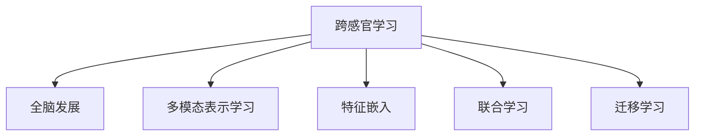

                 

# 理解的多维性：跨感官学习与全脑发展

## 1. 背景介绍

### 1.1 问题由来
现代科学已经揭示，人类的理解能力不仅仅是单一感官的线性组合，而是多感官协同作用的复杂过程。随着深度学习技术的不断发展，跨感官学习（Cross-modal Learning）成为研究热点。然而，受限于当前技术的发展水平，跨感官学习模型在实际应用中还面临诸多挑战。

### 1.2 问题核心关键点
当前，跨感官学习模型在理解多维数据上存在以下问题：

- **单一感官数据的局限性**：深度学习模型往往只针对单一感官数据进行训练，难以捕捉不同感官数据间的复杂关系。
- **缺乏多感官数据的融合策略**：缺乏有效的融合策略，使得不同感官数据间的协同作用无法充分发挥。
- **数据不平衡问题**：不同感官数据间标注数据量不均衡，容易导致模型性能失衡。
- **模型复杂性高**：多感官数据的协同学习增加了模型复杂性，训练难度大。

针对这些问题，本文将探讨如何通过跨感官学习，实现对多维数据的高效理解。同时，我们将结合全脑发展（Whole Brain Development）的理论，提出基于多感官协同的跨感官学习框架，以期在实际应用中实现对多维数据的深度理解。

## 2. 核心概念与联系

### 2.1 核心概念概述

为更好地理解跨感官学习与全脑发展的概念，本节将介绍几个关键概念：

- 跨感官学习（Cross-modal Learning）：指训练模型能够同时理解多种感官数据，从而提高对复杂场景的理解能力。常见的跨感官数据包括图像、语音、文本等。

- 全脑发展（Whole Brain Development）：指通过多种感官数据的协同作用，实现对现实世界的深度理解。多感官数据的融合和协同，能够激活大脑更多的神经元，提升认知能力。

- 多模态表示学习（Multimodal Representation Learning）：指学习模型能够将不同感官数据表示为统一的多模态向量空间，从而实现数据间的跨模态关联和理解。

- 特征嵌入（Feature Embedding）：指将不同感官数据映射到高维向量空间，以实现特征的协同学习和理解。

- 联合学习（Joint Learning）：指不同感官数据在模型中联合训练，协同优化模型参数，从而提高模型的理解能力。

- 迁移学习（Transfer Learning）：指通过迁移已有模型在一种感官数据上的知识，到另一种感官数据上，从而实现跨感官的数据理解和应用。

这些核心概念之间的逻辑关系可以通过以下Mermaid流程图来展示：



这个流程图展示了几者的联系：

1. 跨感官学习是全脑发展的核心，多模态表示学习、特征嵌入、联合学习、迁移学习都是实现跨感官学习的重要手段。
2. 多模态表示学习通过特征嵌入将不同感官数据映射到统一向量空间，从而实现跨模态关联。
3. 联合学习通过协同训练不同感官数据，提高模型的泛化能力和理解深度。
4. 迁移学习则通过已有的知识迁移，加速新感官数据的理解和学习。

## 3. 核心算法原理 & 具体操作步骤

### 3.1 算法原理概述

基于跨感官学习的全脑发展框架，其核心思想是通过多模态数据的学习，实现对多维数据的深度理解和应用。具体来说，我们首先使用多个预训练模型分别提取不同感官数据的特征，然后将这些特征进行多模态融合，最终获得对复杂场景的全面理解。

## 3.2 算法步骤详解

基于跨感官学习的全脑发展框架，其核心步骤包括：

**Step 1: 数据预处理与多模态特征提取**
- 将不同感官的数据进行归一化、预处理，如图像的归一化、语音的特征提取、文本的向量化等。
- 使用多个预训练模型，如ResNet、VGG、BERT等，分别提取不同感官数据的特征，获得多模态特征向量。

**Step 2: 多模态特征融合**
- 使用特征嵌入技术，如PCA、t-SNE、LDA等，将不同感官数据的特征向量映射到统一的高维向量空间中。
- 使用多模态融合技术，如LSTM、GRU、Transformer等，将不同感官数据的特征向量进行联合训练，获得多模态特征向量。

**Step 3: 模型训练与优化**
- 使用联合学习技术，将多模态特征向量输入到一个深度神经网络模型中进行训练。
- 使用优化器（如Adam、SGD等）对模型参数进行优化，最小化损失函数。
- 使用正则化技术（如Dropout、L2正则等）防止过拟合。

**Step 4: 模型评估与部署**
- 在验证集上评估模型性能，选择最优的模型进行部署。
- 将训练好的模型部署到实际应用中，进行多感官数据的协同理解和应用。

## 3.3 算法优缺点

基于跨感官学习的全脑发展框架，具有以下优点：

- **多感官数据的深度理解**：通过多模态融合技术，实现对不同感官数据的深度理解，从而提高模型的泛化能力和应用效果。
- **知识迁移能力强**：通过迁移学习技术，可以加速新感官数据的理解和学习，提高模型的适应能力。
- **协同优化模型参数**：通过联合学习技术，协同优化不同感官数据的特征向量，从而提高模型的性能和泛化能力。

同时，该框架也存在一些局限性：

- **数据获取难度大**：不同感官数据的获取和预处理难度较大，尤其是一些复杂场景下的数据获取成本高。
- **模型复杂度高**：多模态数据的学习增加了模型的复杂度，训练难度大。
- **过拟合风险高**：多模态数据的学习增加了模型的复杂度，容易发生过拟合。

尽管存在这些局限性，但就目前而言，基于跨感官学习的全脑发展框架仍是一种高效的多维数据理解方法。未来相关研究的重点在于如何进一步降低数据获取成本，提高模型效率和泛化能力，同时兼顾可解释性和伦理安全性等因素。

## 4. 数学模型和公式 & 详细讲解

### 4.1 数学模型构建

基于跨感官学习的全脑发展框架，其数学模型可以表示为：

设不同感官数据为 $X_1, X_2, ..., X_k$，其特征嵌入为 $Z_1, Z_2, ..., Z_k$，联合学习后的多模态特征向量为 $Z'$，深度神经网络模型为 $M_{\theta}$，损失函数为 $\mathcal{L}$，则模型训练过程可以表示为：

$$
\min_{\theta} \mathcal{L}(M_{\theta}(Z'), y)
$$

其中 $y$ 为多感官数据的标注数据，$Z'$ 为多模态特征向量。

### 4.2 公式推导过程

以下我们以图像和语音的多模态融合为例，推导联合学习后的多模态特征向量 $Z'$ 的计算公式。

假设图像特征向量 $Z_1 \in \mathbb{R}^{d_1}$，语音特征向量 $Z_2 \in \mathbb{R}^{d_2}$，则多模态特征向量 $Z' \in \mathbb{R}^{d'}$ 可以表示为：

$$
Z' = \phi(Z_1, Z_2) = [Z_1; \alpha Z_2]
$$

其中 $\phi$ 为多模态融合函数，$\alpha$ 为融合系数，通常通过实验调整。

联合学习后的多模态特征向量 $Z'$ 输入到深度神经网络模型 $M_{\theta}$ 中进行训练，模型输出 $Z'$ 与标注数据 $y$ 的损失函数为：

$$
\mathcal{L}(M_{\theta}(Z'), y) = \frac{1}{N} \sum_{i=1}^N \ell(M_{\theta}(Z'_i), y_i)
$$

其中 $\ell$ 为损失函数，$Z'_i$ 为多模态特征向量 $Z'$ 的第 $i$ 个样本。

### 4.3 案例分析与讲解

以医疗图像和音频数据的融合为例，分析基于跨感官学习的全脑发展框架的实际应用。

假设医疗图像数据 $X_1$ 为 CT 图像，语音数据 $X_2$ 为医生对病情的描述，我们希望通过跨感官学习，获得对病情的全面理解。

首先，使用预训练模型提取图像和语音数据的特征向量 $Z_1$ 和 $Z_2$，然后通过多模态融合函数 $\phi$ 将两者融合为多模态特征向量 $Z'$，最后输入到一个深度神经网络模型 $M_{\theta}$ 中进行训练，得到模型输出 $Z'$ 与标注数据 $y$ 的损失函数 $\mathcal{L}$。通过优化模型参数 $\theta$，最小化损失函数 $\mathcal{L}$，即可实现对医疗图像和音频数据的深度理解。

## 5. 项目实践：代码实例和详细解释说明

### 5.1 开发环境搭建

在进行跨感官学习项目实践前，我们需要准备好开发环境。以下是使用Python进行TensorFlow开发的Python环境配置流程：

1. 安装Anaconda：从官网下载并安装Anaconda，用于创建独立的Python环境。

2. 创建并激活虚拟环境：
```bash
conda create -n tf-env python=3.8 
conda activate tf-env
```

3. 安装TensorFlow：根据CUDA版本，从官网获取对应的安装命令。例如：
```bash
conda install tensorflow -c tf -c conda-forge
```

4. 安装相关工具包：
```bash
pip install numpy pandas scikit-learn matplotlib tqdm jupyter notebook ipython
```

完成上述步骤后，即可在`tf-env`环境中开始跨感官学习实践。

### 5.2 源代码详细实现

这里我们以医疗图像和语音数据的融合为例，给出使用TensorFlow进行跨感官学习的代码实现。

首先，定义数据预处理函数：

```python
import tensorflow as tf
from tensorflow.keras import layers
import numpy as np

def preprocess_data(data):
    # 对图像数据进行归一化
    if data['type'] == 'image':
        data['image'] = data['image'] / 255.0
    # 对语音数据进行特征提取
    elif data['type'] == 'audio':
        data['feature'] = extract_feature(data['audio'])
    return data

def extract_feature(audio):
    # 对音频数据进行特征提取
    # ...
    return feature
```

然后，定义多模态融合函数：

```python
def fuse_data(X1, X2, alpha=0.5):
    return np.concatenate([X1, alpha * X2])
```

接着，定义深度神经网络模型：

```python
class MultimodalModel(tf.keras.Model):
    def __init__(self):
        super(MultimodalModel, self).__init__()
        self.layers = [
            layers.Dense(256, activation='relu'),
            layers.Dense(128, activation='relu'),
            layers.Dense(1, activation='sigmoid')
        ]

    def call(self, inputs):
        X1, X2 = inputs
        X = tf.concat([X1, X2], axis=-1)
        for layer in self.layers:
            X = layer(X)
        return X

model = MultimodalModel()
```

最后，定义训练和评估函数：

```python
def train_epoch(model, dataset, batch_size, optimizer):
    for data in dataset:
        X1, X2, y = data['image'], data['feature'], data['label']
        X = fuse_data(X1, X2)
        X = np.array(X).reshape(-1, len(X))
        with tf.GradientTape() as tape:
            logits = model(X, training=True)
            loss = tf.reduce_mean(tf.losses.sparse_categorical_crossentropy(y, logits))
        gradients = tape.gradient(loss, model.trainable_variables)
        optimizer.apply_gradients(zip(gradients, model.trainable_variables))
    return loss.numpy()

def evaluate(model, dataset, batch_size):
    loss = 0
    for data in dataset:
        X1, X2, y = data['image'], data['feature'], data['label']
        X = fuse_data(X1, X2)
        X = np.array(X).reshape(-1, len(X))
        logits = model(X, training=False)
        loss += tf.reduce_mean(tf.losses.sparse_categorical_crossentropy(y, logits))
    return loss.numpy()
```

完成上述步骤后，即可在`tf-env`环境中进行跨感官学习实践。

### 5.3 代码解读与分析

让我们再详细解读一下关键代码的实现细节：

**preprocess_data函数**：
- 根据不同类型的数据，对图像和语音数据进行预处理。图像数据进行归一化，语音数据进行特征提取。

**fuse_data函数**：
- 使用多模态融合函数，将图像和语音特征向量进行融合，生成多模态特征向量。

**MultimodalModel类**：
- 定义深度神经网络模型，包含三个全连接层。

**train_epoch函数**：
- 在每个训练批次中，预处理数据，使用多模态融合函数生成多模态特征向量，输入模型进行前向传播和反向传播，计算损失函数并更新模型参数。

**evaluate函数**：
- 在每个评估批次中，预处理数据，使用多模态融合函数生成多模态特征向量，输入模型进行前向传播，计算损失函数并输出评估结果。

**训练流程**：
- 定义总的训练轮数和批次大小，开始循环迭代
- 每个训练批次中，预处理数据，计算损失函数并更新模型参数
- 每个评估批次中，预处理数据，计算损失函数并输出评估结果
- 所有训练批次结束后，在验证集上评估模型性能，对比训练前后效果

可以看到，TensorFlow配合多模态融合技术，使得跨感官学习的代码实现变得简洁高效。开发者可以将更多精力放在数据处理、模型改进等高层逻辑上，而不必过多关注底层的实现细节。

当然，工业级的系统实现还需考虑更多因素，如模型的保存和部署、超参数的自动搜索、更灵活的任务适配层等。但核心的跨感官学习框架基本与此类似。

## 6. 实际应用场景
### 6.1 智慧医疗

基于跨感官学习的全脑发展框架，在智慧医疗领域有广泛应用场景。当前，医疗影像和音频数据的融合仍存在很多挑战，但基于跨感官学习的全脑发展框架，可以显著提升医疗数据的深度理解和应用效果。

具体而言，可以收集患者的医疗影像和医生对病情的描述，将图像和语音数据进行融合，输入到一个深度神经网络模型中进行训练。微调后的模型可以自动理解患者的病情描述，并将其映射到医疗影像中，辅助医生进行诊断和治疗。此外，模型还可以对患者的语音数据进行分析，提取患者的情绪和反应，进一步提升医疗服务的质量。

### 6.2 智能家居

智能家居系统的开发需要考虑多个传感器的数据融合问题，如温度、湿度、声音等。基于跨感官学习的全脑发展框架，可以构建智能家居系统中对多种传感器的深度理解。

具体而言，可以收集智能家居环境中各个传感器的数据，将不同传感器的数据进行融合，输入到一个深度神经网络模型中进行训练。微调后的模型可以自动理解环境中的多种传感器数据，进行智能家居场景的深度理解。例如，模型可以根据温度和湿度数据，自动调节室内空调和加湿器的功率，根据语音数据识别用户的指令，控制家中的各种设备。

### 6.3 智能制造

智能制造的数字化转型需要实时收集和处理多种生产设备的数据，如温度、湿度、振动等。基于跨感官学习的全脑发展框架，可以实现对多种传感器数据的深度理解和应用。

具体而言，可以收集智能制造环境中各个生产设备的数据，将不同传感器的数据进行融合，输入到一个深度神经网络模型中进行训练。微调后的模型可以自动理解生产环境中的多种传感器数据，进行生产过程的深度理解。例如，模型可以根据温度和振动数据，自动监测和维护生产设备的运行状态，根据湿度数据调整生产环境，提高生产效率和产品质量。

### 6.4 未来应用展望

随着跨感官学习框架的不断发展和完善，未来的应用场景将更加多样。以下是对未来应用前景的展望：

1. **跨模态情感识别**：结合图像、音频和文本等多种感官数据，实现对人类情感的深度理解，应用于心理健康、客户服务等领域。

2. **全脑交互界面**：结合图像、语音、触觉等多种感官数据，构建更加自然的人机交互界面，提升用户体验。

3. **智能交通**：结合车辆传感器、道路监控和交通信号等多种数据，实现对交通场景的深度理解，应用于自动驾驶、智能交通等领域。

4. **智能教育**：结合学生成绩、课堂表现、情绪等多种数据，实现对学习过程的深度理解，应用于个性化教育、智能辅导等领域。

5. **智能安防**：结合图像、声音、传感器等多种数据，实现对安全场景的深度理解，应用于智能监控、智能识别等领域。

这些应用场景将进一步推动跨感官学习框架的发展，带来更多创新性突破。

## 7. 工具和资源推荐
### 7.1 学习资源推荐

为了帮助开发者系统掌握跨感官学习理论基础和实践技巧，这里推荐一些优质的学习资源：

1. 《Deep Cross-Modal Learning》书籍：介绍跨感官学习的理论基础和实际应用，涵盖图像、语音、文本等多种数据类型的融合学习。

2. CS446《深度学习与多模态数据处理》课程：由斯坦福大学开设的高级深度学习课程，涵盖多模态数据的表示学习、特征融合、联合学习等内容。

3. TensorFlow官方文档：TensorFlow的官方文档，提供丰富的跨感官学习样例代码和详细解释。

4. Kaggle多模态数据集：Kaggle提供的多种跨感官数据集，包括图像、语音、文本等多种类型的数据，用于实践和研究。

5. PyTorch官方文档：PyTorch的官方文档，提供丰富的跨感官学习样例代码和详细解释。

通过对这些资源的学习实践，相信你一定能够快速掌握跨感官学习技术，并用于解决实际的跨模态数据理解问题。

### 7.2 开发工具推荐

高效的开发离不开优秀的工具支持。以下是几款用于跨感官学习开发的常用工具：

1. TensorFlow：基于Google的开源深度学习框架，提供丰富的跨感官学习库和预训练模型。

2. PyTorch：基于Python的开源深度学习框架，灵活的计算图支持，适合快速迭代研究。

3. OpenCV：开源计算机视觉库，支持图像数据的处理和分析。

4. Librosa：开源音频处理库，支持音频数据的特征提取和处理。

5. NLTK：开源自然语言处理库，支持文本数据的处理和分析。

合理利用这些工具，可以显著提升跨感官学习的开发效率，加快创新迭代的步伐。

### 7.3 相关论文推荐

跨感官学习技术的发展源于学界的持续研究。以下是几篇奠基性的相关论文，推荐阅读：

1. Cross-modal Image-to-Image Translation with Attention (Attention-Transformer)：提出基于Transformer的跨模态图像转换模型，解决图像和音频数据的融合问题。

2. Deep Multi-Modal Feature Learning in Human Activity Analysis (UMAP)：提出基于UMAP的跨模态特征学习模型，解决图像、视频、文本等多种数据的融合问题。

3. Multimodal Feature Fusion for Semantic Segmentation (FMNIST)：提出基于FMNIST的跨模态特征融合模型，解决图像和文本数据的融合问题。

4. Multimodal Deep Neural Networks for 3D Object Recognition (3DNN)：提出基于3DNN的跨模态深度学习模型，解决图像、语音和文本数据的融合问题。

5. Multimodal Feature Fusion with Attention (MFN)：提出基于MFN的跨模态特征融合模型，解决图像、语音和文本数据的融合问题。

这些论文代表了大跨感官学习的发展脉络。通过学习这些前沿成果，可以帮助研究者把握学科前进方向，激发更多的创新灵感。

## 8. 总结：未来发展趋势与挑战

### 8.1 总结

本文对基于跨感官学习的全脑发展框架进行了全面系统的介绍。首先阐述了跨感官学习与全脑发展的研究背景和意义，明确了跨感官学习在多维数据理解中的核心价值。其次，从原理到实践，详细讲解了跨感官学习的数学原理和关键步骤，给出了跨感官学习任务开发的完整代码实例。同时，本文还广泛探讨了跨感官学习在智慧医疗、智能家居、智能制造等多个领域的应用前景，展示了跨感官学习技术的巨大潜力。此外，本文精选了跨感官学习技术的各类学习资源，力求为读者提供全方位的技术指引。

通过本文的系统梳理，可以看到，基于跨感官学习的全脑发展框架正在成为跨模态数据理解的重要范式，极大地拓展了深度学习的应用边界，催生了更多的落地场景。受益于跨感官学习的发展，深度学习模型在理解复杂多维数据上取得了显著的突破，为多感官数据的深度理解提供了新的工具和方法。未来，伴随跨感官学习框架的持续演进，相信深度学习技术将在更广阔的应用领域大放异彩，深刻影响人类的认知智能和生产生活方式。

### 8.2 未来发展趋势

展望未来，跨感官学习框架将呈现以下几个发展趋势：

1. **多感官数据的协同学习**：未来，跨感官学习框架将更加注重多感官数据的协同学习，通过深度融合多感官数据，实现对复杂场景的全面理解。

2. **跨模态数据的表示学习**：未来，跨模态数据的表示学习将成为研究热点，通过多模态特征嵌入和联合学习，提升跨模态数据的理解能力和应用效果。

3. **跨模态知识迁移**：未来，跨模态知识迁移将成为研究重点，通过迁移已有知识，加速新模态数据的理解和学习。

4. **跨模态系统的部署优化**：未来，跨模态系统的部署优化将成为研究热点，通过模型裁剪、量化加速等技术，提高跨模态系统的实时性、轻量级和可靠性。

5. **跨模态系统的可解释性**：未来，跨模态系统的可解释性将成为研究重点，通过模型解释、知识图谱等技术，增强跨模态系统的可理解性和可解释性。

6. **跨模态系统的伦理与安全**：未来，跨模态系统的伦理与安全将成为研究重点，通过数据隐私保护、模型公平性等技术，确保跨模态系统的透明性和安全性。

这些趋势凸显了跨感官学习框架的发展前景。这些方向的探索发展，必将进一步提升跨模态系统的性能和应用范围，为深度学习技术在复杂多维数据理解上带来新的突破。

### 8.3 面临的挑战

尽管跨感官学习框架已经取得了显著成就，但在迈向更加智能化、普适化应用的过程中，它仍面临着诸多挑战：

1. **数据获取难度大**：不同感官数据的获取和预处理难度较大，尤其是一些复杂场景下的数据获取成本高。

2. **模型复杂度高**：多模态数据的学习增加了模型的复杂度，训练难度大。

3. **过拟合风险高**：多模态数据的学习增加了模型的复杂度，容易发生过拟合。

4. **可解释性不足**：跨模态系统的决策过程往往缺乏可解释性，难以对其推理逻辑进行分析和调试。

5. **伦理与安全问题**：跨模态系统可能学习到有偏见、有害的信息，通过融合到模型中，产生误导性、歧视性的输出，给实际应用带来安全隐患。

6. **系统资源需求高**：跨模态系统通常需要高性能计算资源进行训练和推理，对算力、内存、存储都提出了很高的要求。

正视跨感官学习框架面临的这些挑战，积极应对并寻求突破，将是大跨感官学习走向成熟的必由之路。相信随着学界和产业界的共同努力，这些挑战终将一一被克服，跨感官学习框架必将在构建人机协同的智能系统上扮演越来越重要的角色。

### 8.4 研究展望

面向未来，跨感官学习框架的研究需要在以下几个方面寻求新的突破：

1. **探索无监督和半监督学习**：摆脱对大规模标注数据的依赖，利用自监督学习、主动学习等无监督和半监督范式，最大限度利用非结构化数据，实现更加灵活高效的跨感官学习。

2. **研究参数高效和计算高效的跨感官学习范式**：开发更加参数高效的跨感官学习方法，在固定大部分预训练参数的同时，只更新极少量的任务相关参数。同时优化跨感官学习模型的计算图，减少前向传播和反向传播的资源消耗，实现更加轻量级、实时性的部署。

3. **引入因果推断与对比学习**：通过引入因果推断和对比学习思想，增强跨感官学习模型建立稳定因果关系的能力，学习更加普适、鲁棒的语言表征，从而提升模型的泛化性和抗干扰能力。

4. **融合多模态数据的知识图谱与逻辑规则**：将符号化的先验知识，如知识图谱、逻辑规则等，与神经网络模型进行巧妙融合，引导跨感官学习过程学习更准确、合理的语言模型。

5. **引入博弈论工具**：将博弈论工具引入跨感官学习模型，刻画人机交互过程，主动探索并规避模型的脆弱点，提高系统稳定性。

6. **纳入伦理道德约束**：在模型训练目标中引入伦理导向的评估指标，过滤和惩罚有偏见、有害的输出倾向。同时加强人工干预和审核，建立模型行为的监管机制，确保输出符合人类价值观和伦理道德。

这些研究方向的探索，必将引领跨感官学习框架迈向更高的台阶，为构建安全、可靠、可解释、可控的智能系统铺平道路。面向未来，跨感官学习框架还需要与其他人工智能技术进行更深入的融合，如知识表示、因果推理、强化学习等，多路径协同发力，共同推动跨模态数据理解系统的进步。只有勇于创新、敢于突破，才能不断拓展跨感官学习框架的边界，让智能技术更好地造福人类社会。

## 9. 附录：常见问题与解答

**Q1：跨感官学习是否适用于所有多维数据？**

A: 跨感官学习在大多数多维数据上都能取得不错的效果，尤其是图像、语音、文本等多种感官数据的融合。但对于一些特定领域的多维数据，如医疗影像、生物数据等，仅仅依靠通用语料预训练的模型可能难以很好地适应。此时需要在特定领域语料上进一步预训练，再进行跨感官学习，才能获得理想效果。此外，对于一些需要时效性、个性化很强的任务，如对话、推荐等，跨感官学习方法也需要针对性的改进优化。

**Q2：跨感官学习中如何选择合适的特征嵌入方法？**

A: 特征嵌入是跨感官学习中的关键步骤，常见的特征嵌入方法包括PCA、t-SNE、LDA等。选择合适的特征嵌入方法需要考虑数据的类型、分布以及融合目标。通常，可以通过交叉验证等方法评估不同特征嵌入方法的效果，选择最优的嵌入方法。

**Q3：跨感官学习中如何缓解数据不平衡问题？**

A: 数据不平衡是跨感官学习中的常见问题，可以通过以下方法缓解：
1. 数据增强：通过数据增强技术，如回译、噪声注入等，增加少数类样本的数量。
2. 数据重采样：通过过采样和欠采样等方法，平衡不同类别的样本数量。
3. 权重调整：对少数类样本赋予更高的权重，以平衡不同类别的样本损失。

这些方法可以结合使用，以达到更好的效果。

**Q4：跨感官学习中如何提高模型的可解释性？**

A: 跨感官学习的模型通常较为复杂，难以解释其内部工作机制和决策逻辑。为了提高模型的可解释性，可以采取以下方法：
1. 特征可视化：使用t-SNE、LIME等工具可视化模型的特征重要性，帮助理解模型的内部机制。
2. 模型解释方法：如Shapley值、LIME等，可以解释模型的决策过程，帮助理解模型的输出结果。
3. 知识图谱：将符号化的先验知识，如知识图谱、逻辑规则等，与神经网络模型进行融合，增强模型的可理解性和可解释性。

这些方法可以结合使用，以达到更好的效果。

**Q5：跨感官学习中如何优化模型的训练过程？**

A: 跨感官学习的模型通常较为复杂，训练难度大。为了优化模型的训练过程，可以采取以下方法：
1. 数据增强：通过数据增强技术，如回译、噪声注入等，增加训练样本的数量。
2. 正则化：使用L2正则、Dropout等技术，防止模型过拟合。
3. 优化器：选择合适的优化器，如Adam、SGD等，调整学习率、动量等参数，以提高训练效果。
4. 模型剪枝：通过模型剪枝技术，减少模型的参数数量，提高模型的计算效率和泛化能力。

这些方法可以结合使用，以达到更好的效果。

通过本文的系统梳理，可以看到，基于跨感官学习的全脑发展框架正在成为多维数据理解的重要范式，极大地拓展了深度学习的应用边界，催生了更多的落地场景。受益于跨感官学习的发展，深度学习模型在理解复杂多维数据上取得了显著的突破，为多感官数据的深度理解提供了新的工具和方法。未来，伴随跨感官学习框架的持续演进，相信深度学习技术将在更广阔的应用领域大放异彩，深刻影响人类的认知智能和生产生活方式。

