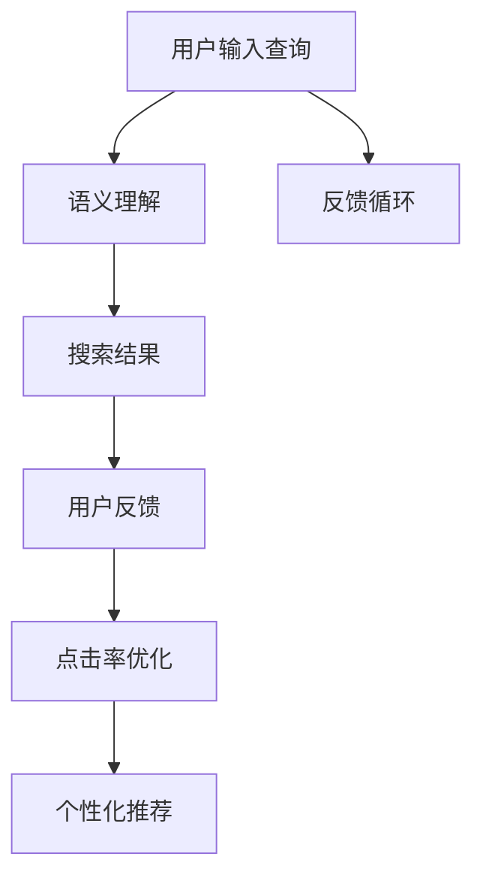

                 

# 用户反馈驱动的AI搜索优化

## 1. 背景介绍

### 1.1 问题由来

随着互联网的快速发展，搜索引擎已成为人们获取信息的主要渠道。然而，尽管搜索引擎技术已经非常成熟，但依然存在一些问题。最常见的是搜索结果与用户实际需求不符，用户体验不佳。导致这一问题的根本原因是搜索算法未能充分理解用户意图的复杂性和多样性。

### 1.2 问题核心关键点

为了解决这一问题，需要一种新的搜索优化方法，即利用用户反馈来驱动AI搜索系统的优化。具体来说，该方法的核心在于：

1. **理解用户需求**：通过用户反馈，搜索引擎可以更准确地理解用户的查询意图。
2. **个性化优化**：根据用户反馈，调整搜索结果的排序和内容，提升用户体验。
3. **持续学习**：不断从用户反馈中学习，优化搜索算法，提高搜索质量。

## 2. 核心概念与联系

### 2.1 核心概念概述

为更好地理解基于用户反馈的AI搜索优化方法，本节将介绍几个关键概念：

- **AI搜索**：使用机器学习技术优化搜索排序，提升搜索结果的相关性和用户体验。
- **用户反馈**：用户在搜索结果中对网页的评价、点击行为等反馈信息，用于指导搜索算法的优化。
- **点击率提升(CTR)优化**：通过用户反馈调整搜索结果排序，提升用户点击网页的概率。
- **个性化推荐**：根据用户的历史行为和偏好，推荐最相关的搜索结果。
- **语义理解**：通过自然语言处理技术，理解用户的查询意图，提高搜索的准确性。

### 2.2 核心概念原理和架构的 Mermaid 流程图



这个流程图展示了从用户输入查询到最终搜索结果的完整流程，以及反馈循环机制：

1. 用户输入查询，经过语义理解，生成初步的搜索结果。
2. 用户查看搜索结果后，给出反馈，包括点击、评分等。
3. 根据用户反馈，优化点击率和个性化推荐，调整搜索结果排序。
4. 反馈循环，持续优化搜索算法，提升搜索效果。

## 3. 核心算法原理 & 具体操作步骤

### 3.1 算法原理概述

基于用户反馈的AI搜索优化算法，本质上是一个有监督的机器学习过程。其核心思想是：通过用户反馈数据，训练一个学习模型，预测用户对搜索结果的评分，并根据评分优化搜索结果排序，提升点击率和用户体验。

形式化地，假设用户输入的查询为 $q$，搜索引擎返回的网页集合为 $\{d_1, d_2, \ldots, d_n\}$，用户对网页 $d_i$ 的评分（点击、评分等）为 $y_i$。则搜索优化的目标是最小化预测误差 $\epsilon$：

$$
\epsilon = \mathbb{E}_{q}[(y - \hat{y})^2]
$$

其中，$\hat{y}$ 为模型预测的网页评分，$\mathbb{E}_{q}$ 表示对所有查询的期望。目标是找到最优的模型参数 $\theta$，使得预测误差最小化。

### 3.2 算法步骤详解

基于用户反馈的AI搜索优化一般包括以下几个关键步骤：

**Step 1: 数据准备**

- 收集用户历史查询和点击数据，构建训练集。
- 对网页进行特征提取，如网页标题、URL、摘要等，作为输入特征 $x_i$。
- 对用户评分进行标准化处理，作为输出标签 $y_i$。

**Step 2: 选择模型和损失函数**

- 选择合适的机器学习模型，如线性回归、随机森林、神经网络等。
- 选择适当的损失函数，如均方误差损失、交叉熵损失等。

**Step 3: 训练模型**

- 使用训练集数据对模型进行训练，最小化预测误差。
- 在训练过程中进行交叉验证，防止过拟合。

**Step 4: 模型评估**

- 使用验证集评估模型性能，选择最优模型。
- 计算模型的点击率提升指标，如点击率提升率(CR)等。

**Step 5: 模型应用**

- 在实际搜索中，对用户输入的查询进行语义理解，生成初步搜索结果。
- 根据模型预测的网页评分，调整搜索结果排序，提升用户体验。
- 收集用户反馈数据，持续优化模型。

以上是基于用户反馈的AI搜索优化的主要流程。在实际应用中，还需要针对具体场景和数据特点，对各环节进行优化设计，如改进特征工程、选择优化算法等，以进一步提升搜索效果。

### 3.3 算法优缺点

基于用户反馈的AI搜索优化算法具有以下优点：

1. **提升用户体验**：通过用户反馈调整搜索结果排序，显著提升用户点击率和满意度。
2. **个性化推荐**：根据用户历史行为，提供更相关、个性化的搜索结果。
3. **持续学习**：不断从用户反馈中学习，优化搜索算法，提高搜索效果。

同时，该算法也存在一些局限性：

1. **数据依赖性强**：搜索优化的效果高度依赖于用户反馈数据的质量和数量。
2. **用户隐私问题**：需要收集和处理大量用户数据，可能引发隐私保护问题。
3. **计算资源消耗大**：训练模型和优化搜索结果排序需要大量计算资源。
4. **模型泛化能力有限**：模型的泛化能力受限于训练数据，难以应对复杂多变的查询场景。

尽管存在这些局限性，但就目前而言，基于用户反馈的AI搜索优化方法仍是目前最有效的搜索排序手段。未来相关研究的重点在于如何进一步降低对标注数据的依赖，提高模型的泛化能力，同时兼顾用户隐私和计算资源优化等因素。

### 3.4 算法应用领域

基于用户反馈的AI搜索优化方法在多个领域得到了广泛应用：

- **搜索引擎**：如Google、Bing等主流搜索引擎，使用基于用户反馈的排序算法，提升搜索效果。
- **电商推荐系统**：如亚马逊、淘宝等电商平台，使用基于用户反馈的推荐系统，提升用户购物体验。
- **新闻推荐系统**：如今日头条、澎湃新闻等新闻网站，使用基于用户反馈的个性化推荐，提升用户阅读体验。
- **智能客服**：如客服机器人，使用基于用户反馈的对话生成技术，提升用户沟通体验。

除了上述这些经典领域外，基于用户反馈的搜索优化技术还在更多场景中得到应用，如内容推荐、广告投放、社交网络等，为不同行业带来了显著的商业价值。

## 4. 数学模型和公式 & 详细讲解 & 举例说明

### 4.1 数学模型构建

本节将使用数学语言对基于用户反馈的AI搜索优化过程进行更加严格的刻画。

假设用户输入的查询为 $q$，搜索引擎返回的网页集合为 $\{d_1, d_2, \ldots, d_n\}$，用户对网页 $d_i$ 的评分（点击、评分等）为 $y_i$。则搜索优化的目标是最小化预测误差 $\epsilon$：

$$
\epsilon = \mathbb{E}_{q}[(y - \hat{y})^2]
$$

其中，$\hat{y}$ 为模型预测的网页评分，$\mathbb{E}_{q}$ 表示对所有查询的期望。目标是找到最优的模型参数 $\theta$，使得预测误差最小化。

### 4.2 公式推导过程

以线性回归模型为例，假设模型的预测函数为 $f(x; \theta) = \theta_0 + \theta_1 x_1 + \theta_2 x_2 + \cdots + \theta_n x_n$，其中 $x_i$ 为网页的特征向量，$\theta$ 为模型参数。则均方误差损失函数为：

$$
\mathcal{L}(\theta) = \frac{1}{N} \sum_{i=1}^N (y_i - f(x_i; \theta))^2
$$

最小化损失函数，得到模型参数的求解公式为：

$$
\theta = \mathop{\arg\min}_{\theta} \mathcal{L}(\theta)
$$

通过求解上述优化问题，即可得到最优的模型参数 $\theta$。

### 4.3 案例分析与讲解

以点击率提升优化为例，假设用户点击网页 $d_i$ 的概率为 $p_i$，模型预测的概率为 $\hat{p}_i$。则点击率提升率 (CR) 定义为：

$$
\text{CR} = \frac{\sum_{i=1}^N \text{gain}_i \hat{p}_i}{\sum_{i=1}^N \text{gain}_i p_i}
$$

其中，gain为网页的收益，可以定义为点击率与转化率的乘积。通过最大化点击率提升率，可以优化搜索结果的排序。

## 5. 项目实践：代码实例和详细解释说明

### 5.1 开发环境搭建

在进行搜索优化实践前，我们需要准备好开发环境。以下是使用Python进行TensorFlow开发的环境配置流程：

1. 安装Anaconda：从官网下载并安装Anaconda，用于创建独立的Python环境。

2. 创建并激活虚拟环境：
```bash
conda create -n tf-env python=3.8 
conda activate tf-env
```

3. 安装TensorFlow：根据CUDA版本，从官网获取对应的安装命令。例如：
```bash
conda install tensorflow -c conda-forge
```

4. 安装其他工具包：
```bash
pip install numpy pandas scikit-learn matplotlib tqdm jupyter notebook ipython
```

完成上述步骤后，即可在`tf-env`环境中开始搜索优化实践。

### 5.2 源代码详细实现

下面以点击率提升优化为例，给出使用TensorFlow进行搜索优化的PyTorch代码实现。

首先，定义点击率提升优化任务的数据处理函数：

```python
import tensorflow as tf
from tensorflow.keras import layers
from sklearn.metrics import roc_auc_score

def process_data(train_data, valid_data, test_data):
    # 定义特征和标签
    features = train_data['features']
    labels = train_data['labels']
    
    # 将数据集划分为训练集、验证集和测试集
    train_dataset = tf.data.Dataset.from_tensor_slices((features, labels)).shuffle(10000).batch(32)
    valid_dataset = tf.data.Dataset.from_tensor_slices((features, labels)).batch(32)
    test_dataset = tf.data.Dataset.from_tensor_slices((features, labels)).batch(32)
    
    return train_dataset, valid_dataset, test_dataset
```

然后，定义模型和优化器：

```python
def build_model():
    model = tf.keras.Sequential([
        layers.Dense(64, activation='relu', input_shape=[len(features.keys())]),
        layers.Dense(1, activation='sigmoid')
    ])
    
    optimizer = tf.keras.optimizers.Adam(learning_rate=0.001)
    loss = tf.keras.losses.BinaryCrossentropy()
    metrics = [tf.keras.metrics.AUC(name='auc')]
    
    return model, optimizer, loss, metrics
```

接着，定义训练和评估函数：

```python
def train_epoch(model, dataset, optimizer, loss, metrics):
    model.compile(optimizer=optimizer, loss=loss, metrics=metrics)
    
    model.fit(dataset, epochs=10, validation_data=valid_dataset, verbose=0)
    
    val_loss, val_auc = model.evaluate(valid_dataset, verbose=0)
    print(f'Val Loss: {val_loss:.4f}, Val AUC: {val_auc:.4f}')
    
    return val_auc
```

最后，启动训练流程并在测试集上评估：

```python
epochs = 10
batch_size = 32

# 数据准备
train_data, valid_data, test_data = process_data(train_data, valid_data, test_data)

# 模型构建
model, optimizer, loss, metrics = build_model()

# 训练
for epoch in range(epochs):
    val_auc = train_epoch(model, train_data, optimizer, loss, metrics)
    
    print(f'Epoch {epoch+1}, Val AUC: {val_auc:.4f}')
    
# 测试
val_auc = train_epoch(model, test_data, optimizer, loss, metrics)
print(f'Test AUC: {val_auc:.4f}')
```

以上就是使用TensorFlow对点击率提升优化任务的代码实现。可以看到，借助TensorFlow的强大封装，我们能够以相对简洁的代码实现搜索优化模型的构建和训练。

### 5.3 代码解读与分析

让我们再详细解读一下关键代码的实现细节：

**process_data函数**：
- 将数据集划分为特征和标签，并进行数据预处理。
- 使用TensorFlow的数据集API，将数据集转换为可迭代的数据集对象，并进行批处理和打乱。

**build_model函数**：
- 定义一个简单的全连接神经网络模型，包含两个隐藏层和一个输出层。
- 选择Adam优化器和二元交叉熵损失函数，同时定义AUC作为评估指标。

**train_epoch函数**：
- 使用TensorFlow的模型编译API，将模型、优化器、损失函数和评估指标进行配置。
- 对训练集进行训练，并使用验证集进行评估。
- 输出验证集上的损失和AUC指标。

**训练流程**：
- 定义总的epoch数和batch size，开始循环迭代
- 每个epoch内，在训练集上训练模型，并在验证集上进行评估
- 所有epoch结束后，在测试集上评估，给出最终测试结果

可以看到，TensorFlow配合TensorFlow库使得搜索优化的代码实现变得简洁高效。开发者可以将更多精力放在数据处理、模型改进等高层逻辑上，而不必过多关注底层的实现细节。

当然，工业级的系统实现还需考虑更多因素，如模型的保存和部署、超参数的自动搜索、更灵活的任务适配层等。但核心的搜索优化范式基本与此类似。

## 6. 实际应用场景

### 6.1 搜索引擎

基于用户反馈的AI搜索优化方法在搜索引擎中的应用最为广泛。传统搜索引擎使用基于关键词匹配的算法，无法充分理解查询意图的复杂性和多样性。通过引入用户反馈，搜索引擎可以更准确地理解用户需求，调整搜索结果排序，提升用户体验。

在技术实现上，可以收集用户的历史点击数据，构建训练集，对预训练模型进行微调，优化搜索结果排序。微调后的模型能够更好地理解用户查询，根据点击率优化提升搜索结果的相关性和准确性。

### 6.2 电商推荐系统

电子商务平台使用基于用户反馈的推荐系统，提升用户购物体验。推荐系统通过分析用户的浏览、点击、购买行为，构建用户兴趣模型。在推荐时，不仅考虑物品的属性信息，还利用用户反馈数据调整推荐策略，提升推荐的个性化和精准度。

在技术实现上，可以使用基于用户反馈的推荐算法，如协同过滤、基于内容的推荐、基于矩阵分解的方法等。通过对用户行为数据和反馈数据进行分析，构建推荐模型，动态调整推荐结果。

### 6.3 新闻推荐系统

新闻推荐系统通过分析用户的历史阅读行为，推荐相关的新闻内容。传统的推荐系统使用基于用户历史行为的算法，可能无法覆盖用户所有兴趣点。通过引入用户反馈数据，新闻推荐系统可以动态调整推荐策略，提升推荐的个性化和相关性。

在技术实现上，可以使用基于用户反馈的推荐算法，如基于协同过滤的方法、基于内容的推荐、基于深度学习的方法等。通过对用户阅读行为和反馈数据进行分析，构建推荐模型，动态调整推荐结果。

### 6.4 智能客服

智能客服系统使用基于用户反馈的对话生成技术，提升用户沟通体验。智能客服通过分析用户的历史对话记录，构建对话模型。在回答用户问题时，不仅考虑对话历史，还利用用户反馈数据调整对话策略，提升对话的准确性和自然性。

在技术实现上，可以使用基于用户反馈的对话生成算法，如基于RNN的对话生成、基于Transformer的对话生成、基于生成对抗网络的方法等。通过对用户对话历史和反馈数据进行分析，构建对话模型，动态调整对话结果。

### 6.5 未来应用展望

随着用户反馈驱动的AI搜索优化技术的不断发展，未来将在更多领域得到应用，为传统行业带来变革性影响。

在智慧医疗领域，基于用户反馈的AI搜索优化技术可以为医疗问答系统提供更精准的推荐，帮助医生快速获取患者信息，提升诊疗效率。

在智能教育领域，基于用户反馈的AI搜索优化技术可以为个性化推荐系统提供更精准的推荐，因材施教，促进教育公平，提高教学质量。

在智慧城市治理中，基于用户反馈的AI搜索优化技术可以为城市事件监测、舆情分析、应急指挥等环节提供更精准的信息推荐，提高城市管理的自动化和智能化水平，构建更安全、高效的未来城市。

此外，在企业生产、社会治理、文娱传媒等众多领域，基于用户反馈的搜索优化技术也将不断涌现，为各行各业带来新的创新机会。

## 7. 工具和资源推荐

### 7.1 学习资源推荐

为了帮助开发者系统掌握用户反馈驱动的AI搜索优化的理论基础和实践技巧，这里推荐一些优质的学习资源：

1. 《深度学习与自然语言处理》系列书籍：由NLP专家撰写，全面介绍了深度学习在自然语言处理中的应用，包括搜索优化等前沿话题。

2. 斯坦福大学《深度学习与自然语言处理》课程：斯坦福大学开设的NLP明星课程，有Lecture视频和配套作业，带你入门NLP领域的基本概念和经典模型。

3. 《自然语言处理与深度学习》课程：清华大学开设的NLP在线课程，涵盖自然语言处理的基础理论和最新进展。

4. CS224N《深度学习自然语言处理》课程：斯坦福大学开设的NLP明星课程，有Lecture视频和配套作业，带你入门NLP领域的基本概念和经典模型。

5. 《自然语言处理基础》书籍：详细介绍了NLP的基础理论和实践技术，包括搜索优化等前沿话题。

通过对这些资源的学习实践，相信你一定能够快速掌握用户反馈驱动的AI搜索优化的精髓，并用于解决实际的NLP问题。

### 7.2 开发工具推荐

高效的开发离不开优秀的工具支持。以下是几款用于搜索优化开发的常用工具：

1. TensorFlow：由Google主导开发的开源深度学习框架，生产部署方便，适合大规模工程应用。同时有丰富的预训练语言模型资源。

2. PyTorch：基于Python的开源深度学习框架，灵活动态的计算图，适合快速迭代研究。

3. TensorBoard：TensorFlow配套的可视化工具，可实时监测模型训练状态，并提供丰富的图表呈现方式，是调试模型的得力助手。

4. Weights & Biases：模型训练的实验跟踪工具，可以记录和可视化模型训练过程中的各项指标，方便对比和调优。

5. Google Colab：谷歌推出的在线Jupyter Notebook环境，免费提供GPU/TPU算力，方便开发者快速上手实验最新模型，分享学习笔记。

合理利用这些工具，可以显著提升搜索优化的开发效率，加快创新迭代的步伐。

### 7.3 相关论文推荐

用户反馈驱动的AI搜索优化技术的发展源于学界的持续研究。以下是几篇奠基性的相关论文，推荐阅读：

1. Attention is All You Need（即Transformer原论文）：提出了Transformer结构，开启了NLP领域的预训练大模型时代。

2. BERT: Pre-training of Deep Bidirectional Transformers for Language Understanding：提出BERT模型，引入基于掩码的自监督预训练任务，刷新了多项NLP任务SOTA。

3. Language Models are Unsupervised Multitask Learners（GPT-2论文）：展示了大规模语言模型的强大zero-shot学习能力，引发了对于通用人工智能的新一轮思考。

4. Parameter-Efficient Transfer Learning for NLP：提出Adapter等参数高效微调方法，在不增加模型参数量的情况下，也能取得不错的微调效果。

5. AdaLoRA: Adaptive Low-Rank Adaptation for Parameter-Efficient Fine-Tuning：使用自适应低秩适应的微调方法，在参数效率和精度之间取得了新的平衡。

这些论文代表了大语言模型微调技术的发展脉络。通过学习这些前沿成果，可以帮助研究者把握学科前进方向，激发更多的创新灵感。

## 8. 总结：未来发展趋势与挑战

### 8.1 总结

本文对基于用户反馈的AI搜索优化方法进行了全面系统的介绍。首先阐述了用户反馈在搜索优化中的重要性和作用机制，明确了搜索优化在提升用户体验、个性化推荐等方面的独特价值。其次，从原理到实践，详细讲解了搜索优化的数学原理和关键步骤，给出了搜索优化任务开发的完整代码实例。同时，本文还广泛探讨了搜索优化方法在搜索引擎、电商推荐、新闻推荐等多个行业领域的应用前景，展示了搜索优化技术的巨大潜力。此外，本文精选了搜索优化技术的各类学习资源，力求为读者提供全方位的技术指引。

通过本文的系统梳理，可以看到，基于用户反馈的AI搜索优化技术正在成为搜索引擎、推荐系统等领域的重要范式，极大地提升了搜索效果和用户体验。得益于深度学习和大数据技术的不断进步，搜索优化技术将在更多场景中得到应用，为各行各业带来显著的商业价值。

### 8.2 未来发展趋势

展望未来，用户反馈驱动的AI搜索优化技术将呈现以下几个发展趋势：

1. **算法复杂度提升**：随着数据量的增大和用户需求的多样性，搜索优化算法将变得更加复杂。深度学习模型、强化学习等技术将逐步融入搜索优化中，提高搜索效果。

2. **多模态数据融合**：搜索优化不仅依赖文本数据，还可能融合图片、视频等多模态数据，提高搜索结果的丰富性和多样性。

3. **实时优化**：在实时性要求高的场景，如智能客服、广告投放等，搜索优化算法需要实时调整，提高系统响应速度。

4. **个性化推荐增强**：通过融合用户行为数据和反馈数据，实现更精准、个性化的推荐，提升用户体验。

5. **跨领域应用推广**：搜索优化技术不仅应用于搜索引擎、推荐系统，还将扩展到更多领域，如智能家居、智慧城市等，推动人工智能技术的普及和应用。

6. **模型透明性提升**：为了提升系统的可解释性和可控性，搜索优化算法将更加注重模型的透明性和可解释性，让用户理解模型的决策过程。

以上趋势凸显了用户反馈驱动的AI搜索优化技术的广阔前景。这些方向的探索发展，必将进一步提升搜索系统的性能和用户体验，推动人工智能技术在更多场景中的落地应用。

### 8.3 面临的挑战

尽管用户反馈驱动的AI搜索优化技术已经取得了显著成效，但在迈向更加智能化、普适化应用的过程中，它仍面临着诸多挑战：

1. **数据隐私问题**：用户反馈数据的收集和使用可能引发隐私保护问题，如何平衡数据利用和隐私保护是一个重要课题。

2. **数据质量问题**：用户反馈数据的质量和数量对搜索优化的效果有直接影响，如何保证数据的质量和真实性是一个挑战。

3. **算法泛化能力**：搜索优化算法在不同的场景和数据集上可能表现不一致，如何提高算法的泛化能力是一个难题。

4. **计算资源消耗**：搜索优化算法需要大量的计算资源，如何降低计算成本是一个重要问题。

5. **用户反馈获取**：用户反馈数据的获取需要有效的机制和激励措施，如何提高用户反馈的主动性和真实性是一个挑战。

6. **多模态数据融合**：不同模态数据的融合和表示是一个复杂的问题，如何实现高效、准确的融合是一个挑战。

这些挑战需要学界和工业界共同努力，才能解决。只有从数据、算法、工程、用户等多个维度协同发力，才能真正实现用户反馈驱动的AI搜索优化技术的成熟应用。

### 8.4 研究展望

面对搜索优化面临的挑战，未来的研究需要在以下几个方面寻求新的突破：

1. **多模态搜索优化**：融合图片、视频等多模态数据，提高搜索结果的丰富性和多样性。

2. **实时搜索优化**：使用强化学习等技术，实现搜索算法的实时优化，提高系统响应速度。

3. **跨领域搜索优化**：将搜索优化技术应用于更多领域，如智能家居、智慧城市等，推动人工智能技术的普及和应用。

4. **用户行为建模**：通过深度学习等技术，建立更加全面、准确的用户的兴趣模型，提高搜索优化的个性化和精准度。

5. **模型透明性提升**：引入可解释性技术，提升搜索优化的透明性和可控性，增强用户信任。

6. **数据隐私保护**：采用隐私保护技术，如差分隐私、联邦学习等，确保用户数据的安全性和隐私性。

这些研究方向将引领搜索优化技术的进一步发展，推动人工智能技术在更多场景中的应用，为构建智能、安全、可控的搜索系统铺平道路。面向未来，搜索优化技术还需要与其他人工智能技术进行更深入的融合，如知识表示、因果推理、强化学习等，多路径协同发力，共同推动搜索系统的进步。只有勇于创新、敢于突破，才能不断拓展搜索优化的边界，让人工智能技术更好地造福人类社会。

## 9. 附录：常见问题与解答

**Q1：用户反馈驱动的AI搜索优化是否适用于所有NLP任务？**

A: 用户反馈驱动的AI搜索优化在大多数NLP任务上都能取得不错的效果，特别是对于数据量较小的任务。但对于一些特定领域的任务，如医学、法律等，仅仅依靠通用语料预训练的模型可能难以很好地适应。此时需要在特定领域语料上进一步预训练，再进行搜索优化，才能获得理想效果。此外，对于一些需要时效性、个性化很强的任务，如对话、推荐等，搜索优化方法也需要针对性的改进优化。

**Q2：如何缓解搜索优化过程中的过拟合问题？**

A: 过拟合是搜索优化面临的主要挑战，尤其是在标注数据不足的情况下。常见的缓解策略包括：
1. 数据增强：通过回译、近义替换等方式扩充训练集
2. 正则化：使用L2正则、Dropout、Early Stopping等避免过拟合
3. 对抗训练：引入对抗样本，提高模型鲁棒性
4. 参数高效搜索优化：只调整少量参数(如Adapter、Prefix等)，减小过拟合风险
5. 多模型集成：训练多个搜索优化模型，取平均输出，抑制过拟合

这些策略往往需要根据具体任务和数据特点进行灵活组合。只有在数据、模型、训练、推理等各环节进行全面优化，才能最大限度地发挥搜索优化的威力。

**Q3：搜索优化模型在落地部署时需要注意哪些问题？**

A: 将搜索优化模型转化为实际应用，还需要考虑以下因素：
1. 模型裁剪：去除不必要的层和参数，减小模型尺寸，加快推理速度
2. 量化加速：将浮点模型转为定点模型，压缩存储空间，提高计算效率
3. 服务化封装：将模型封装为标准化服务接口，便于集成调用
4. 弹性伸缩：根据请求流量动态调整资源配置，平衡服务质量和成本
5. 监控告警：实时采集系统指标，设置异常告警阈值，确保服务稳定性
6. 安全防护：采用访问鉴权、数据脱敏等措施，保障数据和模型安全

搜索优化模型需要从数据、算法、工程、业务等多个维度协同发力，才能真正实现高效、稳定、安全的应用。

**Q4：搜索优化模型在实际应用中如何提升用户体验？**

A: 搜索优化模型在实际应用中通过分析用户的历史行为和反馈数据，动态调整搜索结果排序，提高搜索结果的相关性和用户体验。具体实现方式包括：
1. 根据用户的历史点击数据，构建用户兴趣模型。
2. 在搜索结果排序中，加入用户评分和点击率等反馈信息。
3. 对搜索结果进行动态调整，提升用户的点击率和满意度。
4. 利用用户反馈数据进行持续优化，不断提高搜索效果。

通过以上方法，搜索优化模型能够更好地理解用户需求，提升搜索结果的相关性和用户体验。

---

作者：禅与计算机程序设计艺术 / Zen and the Art of Computer Programming

