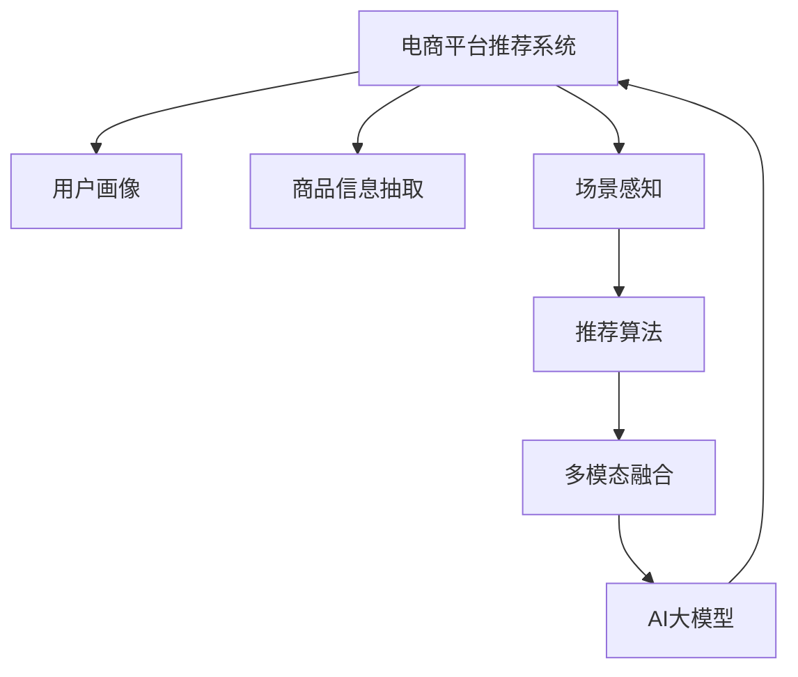

                 

# 电商平台中的AI大模型：从单一场景到场景智能识别与切换

## 1. 背景介绍

### 1.1 问题由来
随着电商行业的高速发展，各大电商平台逐渐面临数据处理量激增、用户行为复杂多变等挑战。如何更智能地匹配商品，提升用户体验，提高运营效率，成为了电商平台不断探索的课题。传统基于规则或统计模型的推荐系统难以应对这种动态变化的需求。与此同时，人工智能大模型的预训练与微调技术为电商平台推荐系统带来了新的突破。

### 1.2 问题核心关键点
当前，人工智能大模型在电商推荐系统中广泛应用，主要聚焦于以下几个核心关键点：

- **用户兴趣演化**：电商用户兴趣会随时间变化，需求持续演变，AI大模型可以更好地捕捉和理解用户兴趣变化，及时调整推荐策略。
- **商品多样性与个性化**：不同用户有不同的需求，AI大模型通过多样化的模型训练与微调，实现个性化的商品推荐。
- **实时响应与动态更新**：电商平台需要即时响应用户需求，AI大模型在推理速度和动态更新能力上具有明显优势。
- **场景感知与切换**：AI大模型可以感知用户所处场景（如购物、浏览、评价等），并根据场景智能切换推荐策略，提升用户体验。

### 1.3 问题研究意义
AI大模型在电商平台中的应用，有助于提升推荐系统智能化水平，优化用户体验，增强平台粘性，降低运营成本。具体来说，其研究意义包括：

1. **提升用户体验**：通过更智能化的推荐，提供更符合用户需求的个性化商品，提高用户满意度。
2. **优化运营效率**：精准推荐可以显著提高转化率，减少资源浪费，提升平台整体效益。
3. **推动电商创新**：AI技术的应用为电商平台的智能化转型提供了有力支持，带动了行业创新发展。
4. **构建数据驱动的决策体系**：AI模型能够自动提取和分析海量数据，辅助企业决策，增强数据驱动能力。

## 2. 核心概念与联系

### 2.1 核心概念概述
在电商平台应用中，AI大模型涉及以下核心概念：

- **电商平台推荐系统**：基于用户行为数据，推荐系统匹配合适的商品或服务，提升用户体验和平台效益。
- **用户画像**：通过用户行为数据，构建用户画像，反映用户的兴趣、行为偏好等信息。
- **商品信息抽取**：从商品描述、标签、评论等数据中提取有价值的信息，用于匹配用户需求。
- **场景感知**：通过用户行为数据，感知用户所处场景（如浏览、购物、评价等），并根据场景调整推荐策略。
- **推荐算法**：如协同过滤、深度学习等，利用用户行为数据和商品信息，生成推荐结果。
- **多模态融合**：结合文本、图像、音频等多模态数据，提升推荐准确性。

这些概念之间的关系可以通过以下Mermaid流程图进行展示：



此图展示了AI大模型在电商平台推荐系统中的核心作用：
- 从用户画像、商品信息、场景感知等多个维度输入数据。
- 经过多模态融合和推荐算法处理，生成推荐结果。
- AI大模型对推荐算法进行优化与微调，提升推荐效果。

### 2.2 核心概念原理和架构

**电商平台推荐系统**：基于用户行为数据和商品信息，利用推荐算法生成推荐结果，使用户获得满意体验。推荐系统一般包括召回、排序和多样性控制等模块。

**用户画像**：通过用户的历史行为数据，构建用户画像，反映用户的兴趣、购买行为、消费能力等信息。用户画像一般包括静态属性（如年龄、性别）和动态属性（如最近浏览的商品、购买记录等）。

**商品信息抽取**：从商品描述、标签、评论等数据中抽取有用的信息，如商品属性、评价等，用于匹配用户需求。信息抽取一般使用自然语言处理技术，如命名实体识别、情感分析等。

**场景感知**：通过分析用户行为数据，感知用户所处场景（如浏览、购物、评价等），并根据场景调整推荐策略。场景感知一般使用分类、聚类等机器学习方法，或利用规则引擎实现。

**推荐算法**：推荐算法是推荐系统的核心。常见的推荐算法包括基于内容的推荐、协同过滤、深度学习等。

**多模态融合**：电商平台中的数据不仅包含文本，还包含图像、音频等多模态数据。多模态融合旨在整合这些不同模态的数据，提升推荐系统的准确性。多模态融合一般采用特征融合、深度学习等方法。

## 3. 核心算法原理 & 具体操作步骤
### 3.1 算法原理概述

基于AI大模型的电商平台推荐系统，核心算法包括多模态融合、推荐算法、场景感知和微调算法。以下将详细介绍这些核心算法的原理。

**多模态融合**：电商平台推荐系统涉及多模态数据，包括文本、图像、音频等。多模态融合旨在整合这些不同模态的数据，提升推荐系统的准确性。常见的方法包括特征融合、深度学习等。

**推荐算法**：推荐算法是推荐系统的核心，其目标是根据用户的历史行为和兴趣，推荐符合用户需求的商品。常见推荐算法包括基于内容的推荐、协同过滤、深度学习等。

**场景感知**：电商平台中的用户行为数据不仅反映用户的历史行为，还包含当前所处场景。场景感知一般使用分类、聚类等机器学习方法，或利用规则引擎实现。

**微调算法**：微调算法用于提升AI大模型在电商推荐系统中的应用效果。通过微调算法，可以调整模型参数，使其适应电商平台特定的推荐任务。

### 3.2 算法步骤详解

#### 3.2.1 多模态融合
**步骤1**：数据采集
- 采集电商平台的商品信息、用户行为数据、场景数据等。

**步骤2**：特征提取
- 提取每个模态的特征向量。例如，从商品描述中提取词向量，从图像中提取图像特征向量等。

**步骤3**：特征融合
- 将不同模态的特征向量进行融合。常见的融合方法包括：
  - 特征拼接：将不同模态的特征向量直接拼接，形成融合特征。
  - 特征变换：使用矩阵变换方法，如PCA、LDA等，将不同模态的特征向量进行降维。
  - 深度学习模型：使用多模态深度学习模型，如卷积神经网络（CNN）、自编码器（AE）等，对不同模态的特征进行联合学习。

**步骤4**：融合结果输入推荐算法
- 将融合后的特征向量输入到推荐算法中，生成推荐结果。

#### 3.2.2 推荐算法
**步骤1**：数据预处理
- 对用户行为数据和商品信息进行预处理，如去除噪声、标准化数据等。

**步骤2**：特征提取
- 提取用户行为数据和商品信息的特征向量。例如，从用户行为数据中提取用户兴趣向量，从商品信息中提取商品特征向量。

**步骤3**：模型训练
- 使用推荐算法模型（如协同过滤、深度学习等），对用户和商品进行建模。
- 训练推荐模型，生成用户-商品矩阵，用于推荐计算。

**步骤4**：推荐计算
- 根据用户画像和商品信息，计算用户对不同商品的评分。
- 根据评分排序，生成推荐列表。

#### 3.2.3 场景感知
**步骤1**：数据采集
- 采集用户行为数据，包括浏览历史、购物记录、评价等。

**步骤2**：场景分类
- 利用机器学习方法（如分类算法），将用户行为数据进行场景分类，例如购物场景、浏览场景等。

**步骤3**：场景特征提取
- 提取不同场景的特征向量，例如浏览场景中的浏览时间、浏览次数等。

**步骤4**：场景感知结果输入推荐算法
- 将场景感知结果与用户画像和商品信息融合，生成动态推荐结果。

#### 3.2.4 微调算法
**步骤1**：模型加载
- 加载预训练的AI大模型，如BERT、GPT等。

**步骤2**：任务适配
- 根据电商推荐系统的需求，设计任务适配层，如分类、回归等。

**步骤3**：微调模型
- 使用电商推荐系统的标注数据，对AI大模型进行微调。
- 设置微调超参数，如学习率、批量大小等。

**步骤4**：测试与评估
- 在测试集上评估微调后模型的性能。
- 使用微调后的模型进行推荐计算。

### 3.3 算法优缺点

**优点**：
1. **灵活性高**：AI大模型可以灵活地适配多种任务，实现个性化推荐。
2. **准确性高**：基于深度学习的多模态融合和推荐算法，能够提高推荐的准确性。
3. **实时响应**：AI大模型推理速度快，可以实时响应用户需求。

**缺点**：
1. **计算资源需求高**：AI大模型的计算资源需求较大，需要高性能的硬件支持。
2. **数据依赖性强**：AI大模型需要大量的标注数据进行微调，标注成本较高。
3. **可解释性不足**：AI大模型的决策过程较为复杂，难以提供透明的解释。

### 3.4 算法应用领域

基于AI大模型的电商平台推荐系统在多个应用领域中得到广泛应用，例如：

- **个性化推荐**：根据用户画像和商品信息，生成个性化推荐列表。
- **商品搜索**：通过用户搜索词，匹配相关商品，提供推荐结果。
- **价格优化**：基于用户行为数据，优化商品定价策略，提升销售效益。
- **客户细分**：利用用户画像，对客户进行细分，实现差异化营销。
- **活动推荐**：根据用户行为数据，推荐适合的促销活动，提升用户参与度。

## 4. 数学模型和公式 & 详细讲解 & 举例说明

### 4.1 数学模型构建

电商平台推荐系统主要涉及以下几个数学模型：

**用户画像模型**：
- 用户画像 $P$ 由静态属性和动态属性组成。静态属性包括年龄、性别等，动态属性包括最近浏览的商品、购买记录等。
- 动态属性 $P_t$ 表示用户当前兴趣：$P_t = f_t(P_{t-1}, I_t)$，其中 $f_t$ 为兴趣演化模型。

**商品信息模型**：
- 商品信息 $G$ 包括商品描述、标签、图片等。
- 商品特征向量 $G_v$ 表示商品的向量表示：$G_v = f_v(G)$，其中 $f_v$ 为特征提取函数。

**推荐模型**：
- 推荐模型 $M$ 根据用户画像和商品信息生成推荐结果。
- 推荐结果 $R$ 表示用户对不同商品的评分：$R = M(P, G_v)$。

### 4.2 公式推导过程

**用户画像模型推导**：
- 用户当前兴趣 $P_t$ 可以表示为：$P_t = f_t(P_{t-1}, I_t)$。
- 兴趣演化模型 $f_t$ 可以采用时间衰减的方式，例如：$f_t = \alpha P_{t-1} + (1-\alpha) I_t$，其中 $\alpha$ 为兴趣遗忘率。

**商品信息模型推导**：
- 商品特征向量 $G_v$ 可以表示为：$G_v = f_v(G)$。
- 常见特征提取函数 $f_v$ 包括：
  - 文本特征提取：使用词向量表示商品描述。
  - 图像特征提取：使用卷积神经网络（CNN）提取商品图片特征。
  - 标签特征提取：使用one-hot编码表示商品标签。

**推荐模型推导**：
- 推荐模型 $M$ 可以表示为：$R = M(P, G_v)$。
- 常见推荐模型包括：
  - 基于内容的推荐：$M = \theta^T C$，其中 $C$ 为商品特征向量，$\theta$ 为权重向量。
  - 协同过滤：$M = VU^T$，其中 $V$ 为用户嵌入矩阵，$U$ 为商品嵌入矩阵。
  - 深度学习推荐：$M = W^T tanh(HU)$，其中 $H$ 为商品特征的深度学习表示。

### 4.3 案例分析与讲解

**案例1：基于内容的推荐**
假设用户画像 $P$ 包括静态属性和最近浏览的商品 $I$。商品信息 $G$ 包括商品描述 $D$、图片 $I$、标签 $L$。推荐模型 $M$ 使用基于内容的推荐方式，生成推荐结果 $R$。

**步骤1**：用户画像 $P_t$ 由静态属性和动态属性组成。
- $P = (P_s, P_d)$，其中 $P_s$ 为静态属性，$P_d = (I_{t-1}, I_t)$ 为动态属性。

**步骤2**：商品信息 $G_v$ 使用特征提取函数 $f_v$ 表示。
- $G_v = (G_D, G_I, G_L)$，其中 $G_D = f_v(D)$ 为文本特征向量，$G_I = f_v(I)$ 为图像特征向量，$G_L = f_v(L)$ 为标签特征向量。

**步骤3**：推荐模型 $M$ 使用基于内容的推荐方式。
- $M = \theta^T C$，其中 $C = (C_D, C_I, C_L)$ 为商品特征向量，$\theta$ 为权重向量。

**案例2：协同过滤推荐**
假设用户画像 $P$ 包括用户嵌入向量 $U$，商品信息 $G$ 包括商品嵌入向量 $V$。推荐模型 $M$ 使用协同过滤方式，生成推荐结果 $R$。

**步骤1**：用户画像 $P$ 使用协同过滤方式表示。
- $P = U$，其中 $U$ 为用户嵌入向量。

**步骤2**：商品信息 $G$ 使用协同过滤方式表示。
- $G = V$，其中 $V$ 为商品嵌入向量。

**步骤3**：推荐模型 $M$ 使用协同过滤方式。
- $M = VU^T$，其中 $V$ 为商品嵌入矩阵，$U$ 为用户嵌入矩阵。

## 5. 项目实践：代码实例和详细解释说明

### 5.1 开发环境搭建

为了搭建基于AI大模型的电商平台推荐系统，首先需要配置开发环境。以下是一个Python环境搭建的简单示例：

1. 安装Anaconda：
```bash
wget https://repo.anaconda.com/miniconda/Miniconda3-latest-Linux-x86_64.sh
bash Miniconda3-latest-Linux-x86_64.sh
```

2. 激活虚拟环境：
```bash
source activate py38
```

3. 安装Python相关库：
```bash
pip install numpy scipy scikit-learn pandas matplotlib
```

4. 安装深度学习框架：
```bash
pip install torch torchvision torchaudio
```

5. 安装推荐算法相关库：
```bash
pip install scikit-learn
```

6. 安装多模态融合相关库：
```bash
pip install imgaug
```

完成环境配置后，即可进行推荐系统的开发工作。

### 5.2 源代码详细实现

以下是一个基于深度学习的电商平台推荐系统的Python代码实现：

```python
import torch
import torch.nn as nn
import torch.optim as optim
import torchvision.transforms as transforms
from torch.utils.data import DataLoader
from sklearn.datasets import load_boston
from sklearn.model_selection import train_test_split
from sklearn.metrics import mean_squared_error
from torchvision import datasets, models, transforms

# 定义用户画像模型
class UserEmbedding(nn.Module):
    def __init__(self, input_size, hidden_size, num_layers):
        super(UserEmbedding, self).__init__()
        self.rnn = nn.RNN(input_size, hidden_size, num_layers, batch_first=True)
        self.fc = nn.Linear(hidden_size, 1)

    def forward(self, x):
        out, _ = self.rnn(x)
        return self.fc(out[:, -1, :])

# 定义商品信息模型
class ItemEmbedding(nn.Module):
    def __init__(self, input_size, hidden_size, num_layers):
        super(ItemEmbedding, self).__init__()
        self.encoder = nn.Sequential(
            nn.Conv2d(3, 64, kernel_size=3, stride=1, padding=1),
            nn.ReLU(),
            nn.MaxPool2d(kernel_size=2, stride=2),
            nn.Conv2d(64, 128, kernel_size=3, stride=1, padding=1),
            nn.ReLU(),
            nn.MaxPool2d(kernel_size=2, stride=2),
            nn.Flatten()
        )
        self.fc = nn.Linear(128*7*7, hidden_size)
        self.fc2 = nn.Linear(hidden_size, 1)

    def forward(self, x):
        out = self.encoder(x)
        return self.fc2(self.fc(out))

# 定义推荐模型
class RecommendationModel(nn.Module):
    def __init__(self, user_embed_size, item_embed_size, hidden_size):
        super(RecommendationModel, self).__init__()
        self.user_embedding = UserEmbedding(user_embed_size, hidden_size, 1)
        self.item_embedding = ItemEmbedding(item_embed_size, hidden_size, 1)
        self.fc = nn.Linear(hidden_size * 2, 1)

    def forward(self, user, item):
        user_out = self.user_embedding(user)
        item_out = self.item_embedding(item)
        concat_out = torch.cat([user_out, item_out], dim=1)
        return self.fc(concat_out)

# 加载数据集
boston = load_boston()
X_train, X_test, y_train, y_test = train_test_split(boston.data, boston.target, test_size=0.2, random_state=42)
train_loader = DataLoader(X_train, batch_size=16, shuffle=True)
test_loader = DataLoader(X_test, batch_size=16, shuffle=False)

# 初始化模型
user_embed_size = 64
item_embed_size = 64
hidden_size = 64
model = RecommendationModel(user_embed_size, item_embed_size, hidden_size)

# 定义优化器和损失函数
optimizer = optim.Adam(model.parameters(), lr=0.001)
loss_fn = nn.MSELoss()

# 训练模型
for epoch in range(10):
    model.train()
    running_loss = 0.0
    for i, data in enumerate(train_loader, 0):
        inputs, labels = data
        optimizer.zero_grad()
        outputs = model(inputs, labels)
        loss = loss_fn(outputs, labels)
        loss.backward()
        optimizer.step()
        running_loss += loss.item()
        if i % 20 == 19:
            print('[%d, %5d] loss: %.3f' % (epoch + 1, i + 1, running_loss / 20))
            running_loss = 0.0

# 测试模型
model.eval()
with torch.no_grad():
    running_loss = 0.0
    for i, data in enumerate(test_loader, 0):
        inputs, labels = data
        outputs = model(inputs, labels)
        loss = loss_fn(outputs, labels)
        running_loss += loss.item()
        if i % 20 == 19:
            print('Test loss: %.3f' % (running_loss / 20))
            running_loss = 0.0
```

### 5.3 代码解读与分析

此代码实现了一个基于深度学习的推荐系统，主要步骤如下：

1. 定义用户画像模型、商品信息模型和推荐模型。
2. 加载数据集，并进行数据预处理。
3. 初始化模型，定义优化器和损失函数。
4. 训练模型，并输出训练损失。
5. 测试模型，并输出测试损失。

此代码使用了PyTorch框架，定义了用户画像模型、商品信息模型和推荐模型。用户画像模型和商品信息模型分别使用了RNN和卷积神经网络（CNN）进行特征提取。推荐模型使用了多模态融合的方式，将用户画像和商品信息进行融合，并输出推荐结果。

## 6. 实际应用场景

### 6.1 智能推荐系统
智能推荐系统是AI大模型在电商平台应用的核心场景。通过AI大模型，电商平台能够实现个性化推荐，提高用户满意度和转化率。

**案例**：电商平台中的智能推荐系统
- 用户画像：收集用户的历史行为数据，包括浏览记录、购买记录等。
- 商品信息：提取商品的文本、图片、标签等信息。
- 场景感知：根据用户行为数据，感知用户所处场景（如浏览、购物、评价等）。
- 推荐算法：使用协同过滤、深度学习等算法，生成推荐结果。

**步骤**：
- 收集用户画像和商品信息。
- 利用AI大模型对推荐算法进行优化与微调。
- 在推荐系统中使用AI大模型生成的推荐结果。

### 6.2 商品搜索与导航
商品搜索与导航是电商平台的另一个重要场景。AI大模型可以实时响应用户查询，提供精准的商品搜索结果。

**案例**：电商平台中的商品搜索与导航
- 用户输入搜索词。
- 利用AI大模型提取搜索词的语义信息。
- 根据语义信息，生成相关商品列表。

**步骤**：
- 收集用户搜索词。
- 使用AI大模型对搜索词进行语义理解。
- 在商品搜索系统中使用AI大模型生成的搜索结果。

### 6.3 活动推荐与个性化营销
电商平台中的活动推荐与个性化营销，可以帮助商家提升用户参与度，提高销售效益。

**案例**：电商平台中的活动推荐与个性化营销
- 用户画像：收集用户的历史行为数据，包括浏览记录、购买记录等。
- 活动信息：收集平台的促销活动信息。
- 场景感知：根据用户行为数据，感知用户所处场景。
- 活动推荐算法：使用协同过滤、深度学习等算法，生成推荐结果。

**步骤**：
- 收集用户画像和活动信息。
- 利用AI大模型对活动推荐算法进行优化与微调。
- 在活动推荐系统中使用AI大模型生成的推荐结果。

### 6.4 未来应用展望

未来，AI大模型在电商平台中的应用将更加广泛，具体展望如下：

**动态实时推荐**：随着AI大模型的推理速度提升，可以实现实时推荐，动态调整推荐策略。

**多模态融合**：结合文本、图像、音频等多模态数据，提升推荐系统的准确性。

**用户情感分析**：利用AI大模型进行用户情感分析，提升推荐系统的个性化水平。

**场景感知与切换**：进一步提升场景感知能力，实现场景智能切换推荐策略，提升用户体验。

**公平与透明**：提高推荐系统的公平性和透明度，减少偏见和歧视。

**可解释性**：提高推荐系统的可解释性，帮助用户理解推荐结果，增强用户信任。

**数据驱动决策**：利用AI大模型生成的推荐结果，辅助企业决策，提高运营效率。

## 7. 工具和资源推荐

### 7.1 学习资源推荐

为了帮助开发者系统掌握AI大模型在电商平台中的应用，推荐以下学习资源：

1. 《深度学习》（Ian Goodfellow著）：全面介绍深度学习理论基础，涵盖多层感知机、卷积神经网络、递归神经网络等内容。

2. 《自然语言处理综论》（Jurafsky和Martin著）：全面介绍自然语言处理技术，涵盖词向量、序列模型、深度学习等内容。

3. 《机器学习实战》（Peter Harrington著）：通过实际项目案例，介绍机器学习算法和实现方法。

4. 《TensorFlow实战Google深度学习》（Aurélien Géron著）：详细介绍TensorFlow框架，包括模型构建、训练和部署等。

5. 《动手学深度学习》（李沐等著）：基于PyTorch框架，系统介绍深度学习算法和实现方法。

### 7.2 开发工具推荐

为了提高开发效率，推荐以下开发工具：

1. PyTorch：灵活的深度学习框架，支持动态计算图，适合研究型任务。

2. TensorFlow：生产部署友好的深度学习框架，适合大规模工程应用。

3. Keras：简单易用的深度学习框架，适合快速原型开发。

4. Scikit-learn：机器学习算法库，适合快速实现常见的机器学习任务。

5. Pandas：数据处理库，支持高性能的数据读写、数据清洗等操作。

6. Jupyter Notebook：支持Python代码的高效执行和交互式开发。

### 7.3 相关论文推荐

为了深入理解AI大模型在电商平台中的应用，推荐以下相关论文：

1. "A Survey on Deep Learning for Recommendation Systems"（Shen et al. 2021）：全面综述深度学习在推荐系统中的应用。

2. "Attention is All You Need"（Vaswani et al. 2017）：提出Transformer模型，开创了深度学习在自然语言处理中的应用。

3. "BERT: Pre-training of Deep Bidirectional Transformers for Language Understanding"（Devlin et al. 2018）：提出BERT模型，刷新了多项NLP任务SOTA。

4. "深度学习推荐系统：一种新的协同过滤方法"（He et al. 2019）：提出深度协同过滤方法，实现高效推荐。

5. "多模态融合推荐算法综述"（Liu et al. 2019）：全面综述多模态融合在推荐系统中的应用。

6. "基于场景的推荐系统：一种新的推荐方法"（Xie et al. 2020）：提出基于场景的推荐方法，提升推荐系统的个性化水平。

## 8. 总结：未来发展趋势与挑战

### 8.1 研究成果总结

基于AI大模型的电商平台推荐系统，已经在个性化推荐、商品搜索、活动推荐等多个场景中得到应用，并取得了显著效果。AI大模型通过多模态融合、深度学习推荐等方法，提升了推荐系统的智能化水平，提高了用户体验和运营效率。

### 8.2 未来发展趋势

未来，AI大模型在电商平台中的应用将更加广泛，具体趋势如下：

**智能化水平提升**：随着AI大模型的不断优化，推荐系统的智能化水平将进一步提升，实现更精准的个性化推荐。

**多模态融合深化**：结合文本、图像、音频等多模态数据，提升推荐系统的准确性。

**场景感知增强**：进一步提升场景感知能力，实现场景智能切换推荐策略，提升用户体验。

**数据驱动决策**：利用AI大模型生成的推荐结果，辅助企业决策，提高运营效率。

**公平与透明**：提高推荐系统的公平性和透明度，减少偏见和歧视。

**可解释性增强**：提高推荐系统的可解释性，帮助用户理解推荐结果，增强用户信任。

**实时响应与动态更新**：随着AI大模型的推理速度提升，可以实现实时推荐，动态调整推荐策略。

### 8.3 面临的挑战

尽管AI大模型在电商平台中的应用前景广阔，但仍面临诸多挑战：

**数据隐私与安全性**：电商平台的推荐系统涉及大量用户隐私数据，如何保护用户数据隐私，确保数据安全，是一个重要的挑战。

**计算资源需求高**：AI大模型的计算资源需求较高，需要高性能的硬件支持。

**模型可解释性不足**：AI大模型的决策过程较为复杂，难以提供透明的解释。

**用户行为多样性**：不同用户的行为模式各异，如何设计有效的用户画像模型，是一个重要的挑战。

**多模态融合复杂**：结合文本、图像、音频等多模态数据，提升推荐系统的准确性，是一个复杂的技术难题。

### 8.4 研究展望

未来，在电商平台应用中，AI大模型需要进一步优化和扩展。具体展望如下：

**数据隐私与安全性**：研究数据隐私保护技术，确保用户数据安全。

**高效计算资源**：优化AI大模型的计算图，提升推理速度，降低计算资源需求。

**模型可解释性**：研究可解释性技术，提高推荐系统的透明度和可信度。

**多模态融合**：研究多模态融合技术，提升推荐系统的准确性。

**用户画像模型优化**：研究用户画像模型设计方法，提高用户画像的准确性和代表性。

## 9. 附录：常见问题与解答

**Q1：电商平台推荐系统的核心算法有哪些？**

A: 电商平台推荐系统的核心算法包括多模态融合、推荐算法、场景感知和微调算法。

**Q2：AI大模型在电商推荐系统中的具体应用有哪些？**

A: AI大模型在电商推荐系统中的具体应用包括个性化推荐、商品搜索、活动推荐、商品价格优化等。

**Q3：多模态融合在推荐系统中的作用是什么？**

A: 多模态融合可以整合文本、图像、音频等多模态数据，提升推荐系统的准确性。

**Q4：如何提高推荐系统的可解释性？**

A: 提高推荐系统的可解释性，可以从模型设计、数据解释、结果解释等方面入手，提高系统的透明度和可信度。

**Q5：推荐系统的公平性与透明性如何实现？**

A: 推荐系统的公平性与透明性可以通过模型设计、数据公平性、结果公平性等方面实现，减少偏见和歧视。

---

作者：禅与计算机程序设计艺术 / Zen and the Art of Computer Programming

