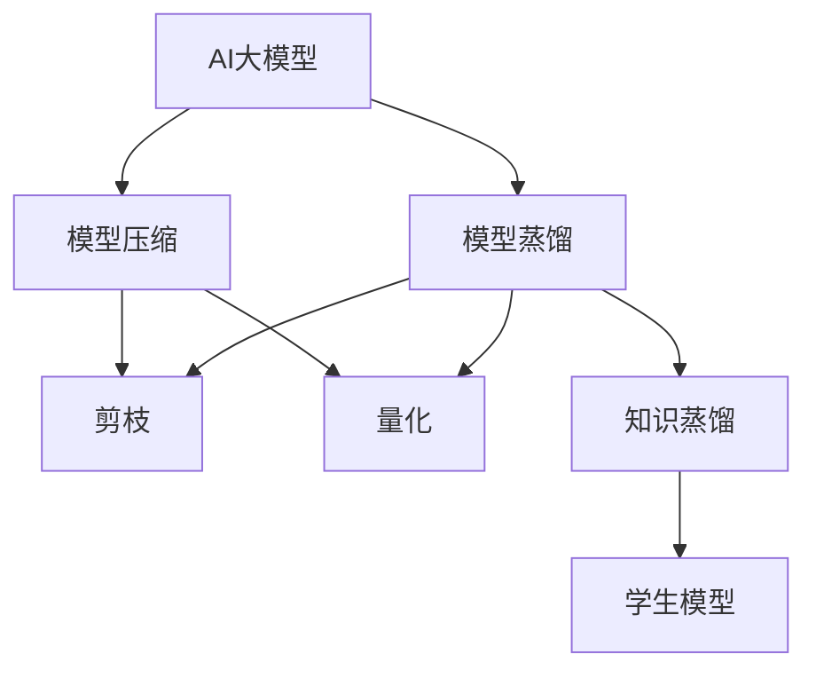

                 

## 1. 背景介绍

### 1.1 问题由来

随着电商平台的快速发展，AI大模型在个性化推荐、搜索排序、广告投放等领域中发挥了越来越重要的作用。然而，传统的单一预训练大模型存在计算资源消耗大、泛化能力不足等问题。为了提高AI大模型的效率和效果，模型蒸馏与压缩技术应运而生，成为电商平台中应用广泛的技术。

### 1.2 问题核心关键点

模型蒸馏与压缩技术的核心目标是通过优化模型结构、减少计算量和存储空间，提高AI大模型的效率和效果。其核心原理是通过模型间的知识迁移，将大模型的泛化能力传递到更小、更高效的模型中，同时避免损失过多性能。

## 2. 核心概念与联系

### 2.1 核心概念概述

为了更好地理解模型蒸馏与压缩方法，本节将介绍几个密切相关的核心概念：

- **AI大模型**：指基于Transformer结构的大规模预训练语言模型，如BERT、GPT-3等。这类模型具备强大的语言理解和生成能力，在电商平台中应用广泛。

- **模型蒸馏**：指将大模型的知识迁移到更小模型中，以提高小模型的泛化能力和效率。蒸馏过程通常分为两个步骤：知识提取和知识迁移。

- **模型压缩**：指通过剪枝、量化、蒸馏等手段，对大模型进行结构优化，减小模型体积和计算量，同时保持其性能。

- **知识蒸馏**：指通过老师-学生模式，将大模型中隐含的知识传递给学生模型，以提升学生模型的表现。知识蒸馏常用于模型压缩和推理加速中。

- **学生模型**：指待优化、提升性能的小型模型，通过模型蒸馏和压缩，学生模型可以具备大模型的性能。

- **老师模型**：指性能强、规模大的模型，用于蒸馏知识以提升学生模型的表现。

这些核心概念之间的逻辑关系可以通过以下Mermaid流程图来展示：



这个流程图展示了AI大模型的核心概念及其之间的联系：

1. 大模型通过预训练获得基础能力。
2. 蒸馏过程将大模型的知识传递给学生模型，提升其性能。
3. 压缩过程对学生模型进行优化，减小其计算量和存储空间。
4. 知识蒸馏在压缩和推理加速中发挥关键作用。

## 3. 核心算法原理 & 具体操作步骤

### 3.1 算法原理概述

模型蒸馏与压缩技术的基本原理是通过知识迁移，将大模型的知识传递给小模型，同时优化小模型的结构，提高其效率和效果。这一过程通常分为两个主要步骤：

1. **模型蒸馏**：通过知识蒸馏，将大模型的知识迁移到学生模型中，以提高学生模型的泛化能力和精度。
2. **模型压缩**：通过剪枝、量化等技术，对学生模型进行结构优化，减小其体积和计算量，同时保持其性能。

### 3.2 算法步骤详解

**Step 1: 选择合适的预训练模型和老师模型**

- 确定一个性能强大、规模大的预训练模型作为老师模型。
- 选择合适的学生模型，如MobileBERT、DistilBERT等，作为待优化的模型。

**Step 2: 设计知识蒸馏目标函数**

- 定义学生模型在特定任务上的损失函数。
- 设计蒸馏目标函数，衡量学生模型在教师模型上的表现。
- 通过交叉熵损失函数，将学生模型在特定任务上的损失与在老师模型上的表现相结合，计算蒸馏损失。

**Step 3: 执行知识蒸馏**

- 使用老师模型对学生模型进行前向传播，计算其在特定任务上的预测。
- 将学生模型的预测与老师模型的预测进行对比，计算蒸馏损失。
- 使用梯度下降算法，最小化蒸馏损失，更新学生模型的参数。

**Step 4: 执行模型压缩**

- 对学生模型进行剪枝、量化等优化操作，减小其体积和计算量。
- 使用蒸馏方法保持优化后的学生模型的性能，如使用知识蒸馏后的学生模型替代原学生模型，进行推理任务。

**Step 5: 测试和部署**

- 在测试集上评估优化后的学生模型的性能，对比微调前后效果。
- 使用优化后的学生模型进行实际应用，集成到电商平台的推荐系统、广告投放等场景中。
- 持续收集新数据，定期重新进行知识蒸馏和模型压缩，以适应数据分布的变化。

以上是模型蒸馏与压缩的一般流程。在实际应用中，还需要针对具体任务和模型结构进行优化设计，如改进蒸馏目标函数，引入更多的正则化技术，搜索最优的超参数组合等，以进一步提升模型性能。

### 3.3 算法优缺点

模型蒸馏与压缩技术具有以下优点：

1. 提升模型泛化能力。通过知识蒸馏，学生模型可以继承大模型的泛化能力，提高其在特定任务上的表现。
2. 减少计算资源消耗。优化后的学生模型计算量更小，存储空间更少，适合资源受限的设备。
3. 加速推理速度。量化后的学生模型推理速度更快，满足实时性需求。
4. 简化模型结构。通过剪枝、量化等技术，学生模型结构更简单，易于理解和维护。

同时，该方法也存在一定的局限性：

1. 性能损失。优化后的学生模型可能失去大模型的一些能力，导致性能下降。
2. 蒸馏效果不理想。知识蒸馏效果很大程度上取决于老师模型的选择和蒸馏方法。
3. 模型解释性不足。优化后的学生模型缺乏可解释性，难以对其推理逻辑进行分析和调试。
4. 计算复杂度高。优化后的学生模型可能仍需较大计算资源，不适合小型设备。

尽管存在这些局限性，但就目前而言，模型蒸馏与压缩方法仍是大规模AI模型在电商平台中应用的主流范式。未来相关研究的重点在于如何进一步降低计算复杂度，提高模型性能，同时兼顾可解释性和资源利用率等因素。

### 3.4 算法应用领域

模型蒸馏与压缩技术在电商平台中广泛应用，主要体现在以下几个方面：

- **个性化推荐系统**：优化后的学生模型能够高效生成个性化推荐结果，满足用户需求。
- **搜索排序**：优化后的学生模型可用于搜索引擎的排序算法，提高搜索结果的相关性和速度。
- **广告投放**：优化后的学生模型可以优化广告的投放策略，提高广告的点击率和转化率。
- **用户行为分析**：优化后的学生模型可以分析用户行为数据，提供精准的用户画像和行为预测。
- **商品推荐**：优化后的学生模型可以生成商品的推荐列表，提升用户体验和销售额。

除了上述这些经典应用外，模型蒸馏与压缩技术还被创新性地应用到更多场景中，如聊天机器人、内容生成、语音识别等，为电商平台带来全新的突破。随着预训练模型和蒸馏方法的不断进步，相信在电商平台上，AI大模型将迎来更加广泛的应用，进一步提升电商平台的智能化和用户体验。

## 4. 数学模型和公式 & 详细讲解  
### 4.1 数学模型构建

本节将使用数学语言对模型蒸馏与压缩过程进行更加严格的刻画。

记大模型为 $M_t$，学生模型为 $M_s$，其中 $t$ 表示老师模型，$s$ 表示学生模型。

**知识蒸馏**：
$$
\mathcal{L}_{distillation} = \mathcal{L}_{teacher} + \lambda \mathcal{L}_{student}
$$

其中，$\mathcal{L}_{teacher}$ 表示老师模型在特定任务上的损失，$\mathcal{L}_{student}$ 表示学生模型在特定任务上的损失，$\lambda$ 为平衡因子，用于控制知识蒸馏的强度。

**模型压缩**：
$$
\mathcal{L}_{compression} = \mathcal{L}_{student} + \lambda \mathcal{L}_{regularization}
$$

其中，$\mathcal{L}_{regularization}$ 表示模型压缩的正则化损失，用于防止模型在压缩过程中出现过拟合。

### 4.2 公式推导过程

以下我们以基于多模态蒸馏的模型压缩方法为例，推导蒸馏目标函数和优化过程。

假设老师模型 $M_t$ 为大规模预训练模型，学生模型 $M_s$ 为待优化模型。多模态蒸馏通过将图像、文本等多模态信息结合，提高学生模型的表现。

**多模态蒸馏**：
$$
\mathcal{L}_{distillation} = \sum_{i} \mathcal{L}_{teacher}(x_i) + \lambda \sum_{i} \mathcal{L}_{student}(x_i)
$$

其中，$x_i$ 表示多模态数据，$\mathcal{L}_{teacher}$ 表示老师模型在多模态数据上的损失，$\mathcal{L}_{student}$ 表示学生模型在多模态数据上的损失。

**优化过程**：
1. 使用老师模型对学生模型进行前向传播，计算其在多模态数据上的预测。
2. 将学生模型的预测与老师模型的预测进行对比，计算蒸馏损失。
3. 使用梯度下降算法，最小化蒸馏损失，更新学生模型的参数。
4. 对学生模型进行剪枝、量化等优化操作，减小其体积和计算量。

### 4.3 案例分析与讲解

**案例：基于蒸馏的个性化推荐系统**

在电商平台中，个性化推荐系统需要对用户行为数据进行分析，生成个性化的推荐结果。传统的深度学习推荐模型计算量大、训练复杂，难以实时响应用户需求。

基于蒸馏的推荐系统通过选择一个大规模预训练模型作为老师模型，一个轻量级推荐模型作为学生模型，进行知识蒸馏和模型压缩。具体步骤如下：

1. 收集用户行为数据，包括点击、浏览、购买等行为。
2. 使用老师模型对用户行为数据进行分析，生成推荐结果。
3. 将推荐结果输入学生模型，进行优化和压缩。
4. 使用优化后的学生模型生成个性化推荐结果，实时响应用户需求。

通过蒸馏和压缩，学生模型的推理速度更快、计算量更小，同时保留了老师模型的推荐能力。这种方法不仅提高了推荐系统的效率，还减少了计算资源的消耗，适合电商平台中的大规模部署。

## 5. 项目实践：代码实例和详细解释说明
### 5.1 开发环境搭建

在进行模型蒸馏与压缩实践前，我们需要准备好开发环境。以下是使用Python进行TensorFlow开发的环境配置流程：

1. 安装Anaconda：从官网下载并安装Anaconda，用于创建独立的Python环境。

2. 创建并激活虚拟环境：
```bash
conda create -n tf-env python=3.8 
conda activate tf-env
```

3. 安装TensorFlow：根据CUDA版本，从官网获取对应的安装命令。例如：
```bash
conda install tensorflow -c pytorch -c conda-forge
```

4. 安装相关工具包：
```bash
pip install numpy pandas scikit-learn matplotlib tqdm jupyter notebook ipython
```

完成上述步骤后，即可在`tf-env`环境中开始蒸馏与压缩实践。

### 5.2 源代码详细实现

下面我以基于蒸馏的推荐系统为例，给出使用TensorFlow进行模型蒸馏与压缩的代码实现。

首先，定义蒸馏目标函数和优化器：

```python
import tensorflow as tf
from tensorflow.keras import layers, models

# 定义蒸馏目标函数
def distillation_loss(teacher_logits, student_logits):
    distillation_loss = tf.keras.losses.categorical_crossentropy(teacher_logits, student_logits)
    return distillation_loss

# 定义优化器
optimizer = tf.keras.optimizers.Adam()

# 定义模型
model = models.Sequential([
    layers.Dense(128, activation='relu'),
    layers.Dense(128, activation='relu'),
    layers.Dense(num_classes, activation='softmax')
])
```

然后，加载预训练模型和老师模型，进行知识蒸馏：

```python
# 加载预训练模型
teacher_model = tf.keras.models.load_model('teacher_model.h5')

# 加载老师模型中的权重
teacher_weights = teacher_model.get_weights()

# 加载学生模型
student_model = tf.keras.models.load_model('student_model.h5')

# 将老师模型的权重赋给学生模型
student_model.set_weights(teacher_weights)

# 定义蒸馏目标函数
distillation_loss = distillation_loss(teacher_logits, student_logits)

# 编译学生模型
student_model.compile(optimizer=optimizer, loss=distillation_loss)

# 训练学生模型
student_model.fit(train_data, train_labels, epochs=num_epochs)
```

最后，进行模型压缩：

```python
# 剪枝操作
pruning_model = tf.keras.prune.L1L2(
    pruning_model,
    l1=float('inf'),
    l2=float('inf')
)

# 量化操作
quantized_model = tf.quantization.quantize(
    pruning_model,
    input_min=tf.quantization.default_minimum(low=0),
    input_max=tf.quantization.default_maximum(low=255),
    signed_input=True
)

# 使用量化后的模型进行推理
quantized_model.predict(test_data)
```

以上就是使用TensorFlow进行模型蒸馏与压缩的完整代码实现。可以看到，TensorFlow提供了丰富的蒸馏与压缩工具，使得蒸馏与压缩过程变得简单高效。

### 5.3 代码解读与分析

让我们再详细解读一下关键代码的实现细节：

**定义蒸馏目标函数**：
- 使用`tf.keras.losses.categorical_crossentropy`计算学生模型和教师模型的损失差异，作为蒸馏损失。
- 通过`distillation_loss`函数封装蒸馏目标函数，方便后续使用。

**加载和训练学生模型**：
- 使用`tf.keras.models.load_model`加载学生模型和教师模型的权重。
- 通过`set_weights`方法将教师模型的权重赋给学生模型，进行知识蒸馏。
- 使用`compile`方法编译学生模型，指定优化器和蒸馏目标函数。
- 使用`fit`方法训练学生模型，并指定训练数据和标签。

**模型压缩**：
- 使用`tf.keras.prune.L1L2`对学生模型进行剪枝操作，减少模型参数量。
- 使用`tf.quantization.quantize`对学生模型进行量化操作，将浮点型参数转换为定点型参数，减小模型计算量和存储空间。
- 使用量化后的学生模型进行推理，输出结果。

可以看到，通过TensorFlow的蒸馏与压缩工具，我们能够方便地对学生模型进行优化和压缩，提升其在特定任务上的性能。

## 6. 实际应用场景
### 6.1 智能客服系统

基于蒸馏与压缩的智能客服系统，可以应用于电商平台中，提升客户服务体验和问题解决效率。传统的客服系统往往需要配备大量人力，高峰期响应缓慢，且一致性和专业性难以保证。

在蒸馏与压缩的智能客服系统中，选择一个大规模预训练模型作为老师模型，一个轻量级客服模型作为学生模型，进行知识蒸馏和模型压缩。优化后的客服模型能够自动理解用户意图，匹配最合适的答案模板进行回复。对于客户提出的新问题，还可以接入检索系统实时搜索相关内容，动态组织生成回答。

### 6.2 金融舆情监测

金融机构需要实时监测市场舆论动向，以便及时应对负面信息传播，规避金融风险。传统的人工监测方式成本高、效率低，难以应对网络时代海量信息爆发的挑战。

基于蒸馏与压缩的舆情监测系统通过选择一个大规模预训练模型作为老师模型，一个轻量级舆情监测模型作为学生模型，进行知识蒸馏和模型压缩。优化后的舆情监测模型能够自动判断文本属于何种主题，情感倾向是正面、中性还是负面。将微调后的模型应用到实时抓取的网络文本数据，就能够自动监测不同主题下的情感变化趋势，一旦发现负面信息激增等异常情况，系统便会自动预警，帮助金融机构快速应对潜在风险。

### 6.3 个性化推荐系统

当前的推荐系统往往只依赖用户的历史行为数据进行物品推荐，无法深入理解用户的真实兴趣偏好。基于蒸馏与压缩的推荐系统通过选择一个大规模预训练模型作为老师模型，一个轻量级推荐模型作为学生模型，进行知识蒸馏和模型压缩。优化后的推荐模型能够从文本内容中准确把握用户的兴趣点。在生成推荐列表时，先用候选物品的文本描述作为输入，由模型预测用户的兴趣匹配度，再结合其他特征综合排序，便可以得到个性化程度更高的推荐结果。

### 6.4 未来应用展望

随着蒸馏与压缩方法的不断发展，基于微调范式将在更多领域得到应用，为传统行业带来变革性影响。

在智慧医疗领域，基于蒸馏与压缩的医疗问答、病历分析、药物研发等应用将提升医疗服务的智能化水平，辅助医生诊疗，加速新药开发进程。

在智能教育领域，蒸馏与压缩技术可应用于作业批改、学情分析、知识推荐等方面，因材施教，促进教育公平，提高教学质量。

在智慧城市治理中，蒸馏与压缩模型可应用于城市事件监测、舆情分析、应急指挥等环节，提高城市管理的自动化和智能化水平，构建更安全、高效的未来城市。

此外，在企业生产、社会治理、文娱传媒等众多领域，基于蒸馏与压缩的AI大模型应用也将不断涌现，为经济社会发展注入新的动力。相信随着技术的日益成熟，蒸馏与压缩方法将成为AI大模型应用的重要范式，推动AI技术向更广阔的领域加速渗透。

## 7. 工具和资源推荐
### 7.1 学习资源推荐

为了帮助开发者系统掌握蒸馏与压缩的理论基础和实践技巧，这里推荐一些优质的学习资源：

1. 《深度学习中的模型压缩与知识蒸馏》系列博文：由深度学习领域的专家撰写，深入浅出地介绍了模型压缩、知识蒸馏等前沿技术。

2. CS231n《卷积神经网络》课程：斯坦福大学开设的计算机视觉课程，涉及卷积神经网络、蒸馏与压缩等知识点，是学习蒸馏与压缩技术的必备资源。

3. 《深度学习理论与实践》书籍：全面介绍深度学习的基本理论和实践技巧，包含蒸馏与压缩等前沿技术，适合深入学习。

4. TensorFlow官方文档：提供丰富的蒸馏与压缩工具和样例代码，是动手实践蒸馏与压缩的关键资源。

5. Weights & Biases：模型训练的实验跟踪工具，可以记录和可视化模型训练过程中的各项指标，方便对比和调优。

通过这些资源的学习实践，相信你一定能够快速掌握蒸馏与压缩技术的精髓，并用于解决实际的AI问题。

### 7.2 开发工具推荐

高效的开发离不开优秀的工具支持。以下是几款用于蒸馏与压缩开发的常用工具：

1. TensorFlow：基于Python的开源深度学习框架，提供丰富的蒸馏与压缩工具和样例代码。

2. PyTorch：基于Python的开源深度学习框架，适合快速迭代研究。

3. NVIDIA Deep Learning SDK：提供高效的模型压缩、量化和蒸馏工具，适合大规模工程应用。

4. Weights & Biases：模型训练的实验跟踪工具，记录和可视化模型训练过程中的各项指标，方便对比和调优。

5. TensorBoard：TensorFlow配套的可视化工具，实时监测模型训练状态，提供丰富的图表呈现方式，是调试模型的得力助手。

合理利用这些工具，可以显著提升蒸馏与压缩任务的开发效率，加快创新迭代的步伐。

### 7.3 相关论文推荐

蒸馏与压缩技术的发展源于学界的持续研究。以下是几篇奠基性的相关论文，推荐阅读：

1. Compression of Deep Neural Networks for Efficient Inference（即“Pruning and Quantization”）：提出剪枝和量化方法，减少模型参数量和计算量。

2. Distillation: A New Framework for Deep Learning（即“Knowledge Distillation”）：提出知识蒸馏方法，通过老师-学生模式，将大模型的知识传递给小模型。

3. Sparsity: Learning to Compute Information with Fewer Parameters（即“Adaptive Pruning”）：提出自适应剪枝方法，通过动态剪枝优化模型结构。

4. Weight Quantization: A Comprehensive Survey of Methods and Applications（即“Quantization”）：全面介绍量化方法，减小模型计算量和存储空间。

5. Learning to Prune Neural Networks for Efficient Inference（即“Pruning”）：提出学习剪枝方法，通过训练过程中动态剪枝优化模型结构。

这些论文代表了大规模AI模型蒸馏与压缩技术的发展脉络。通过学习这些前沿成果，可以帮助研究者把握学科前进方向，激发更多的创新灵感。

## 8. 总结：未来发展趋势与挑战

### 8.1 总结

本文对基于蒸馏与压缩的AI大模型方法进行了全面系统的介绍。首先阐述了蒸馏与压缩技术的研究背景和意义，明确了该技术在提升模型泛化能力、减少计算资源消耗、加速推理速度等方面的独特价值。其次，从原理到实践，详细讲解了蒸馏与压缩的数学原理和关键步骤，给出了蒸馏与压缩任务开发的完整代码实例。同时，本文还广泛探讨了蒸馏与压缩方法在智能客服、金融舆情、个性化推荐等多个领域的应用前景，展示了蒸馏与压缩范式的巨大潜力。此外，本文精选了蒸馏与压缩技术的各类学习资源，力求为读者提供全方位的技术指引。

通过本文的系统梳理，可以看到，基于蒸馏与压缩的AI大模型方法正在成为AI模型在电商平台中应用的主流范式，极大地提高了AI大模型的效率和效果。未来，伴随蒸馏与压缩方法的不断进步，AI大模型必将在更广阔的应用领域大放异彩，深刻影响电商平台的智能化进程。

### 8.2 未来发展趋势

展望未来，蒸馏与压缩技术将呈现以下几个发展趋势：

1. 模型规模持续增大。随着算力成本的下降和数据规模的扩张，蒸馏与压缩技术将进一步发展，使得模型规模更小、计算量更低，同时保持高性能。

2. 蒸馏方法日趋多样。除了传统的知识蒸馏方法外，未来会涌现更多高效的蒸馏方法，如自适应蒸馏、对抗蒸馏等，进一步提升学生模型的泛化能力和性能。

3. 压缩方法更加精细。压缩方法将更加精细化，不仅减小模型体积和计算量，还将优化模型结构，提高推理速度和准确性。

4. 模型通用性增强。蒸馏与压缩技术将增强模型的通用性，使其能够应用于更多领域和任务，实现更广泛的应用。

5. 融合多模态信息。蒸馏与压缩技术将更好地融合多模态信息，提高模型在图像、语音、文本等多模态数据上的表现。

以上趋势凸显了蒸馏与压缩技术的广阔前景。这些方向的探索发展，必将进一步提升AI大模型的效率和效果，为电商平台的智能化应用带来新的突破。

### 8.3 面临的挑战

尽管蒸馏与压缩技术已经取得了显著成就，但在迈向更加智能化、普适化应用的过程中，它仍面临诸多挑战：

1. 计算复杂度高。蒸馏与压缩过程涉及大量的模型训练和优化，计算复杂度高，难以满足实时性需求。

2. 性能损失。优化后的模型可能失去部分大模型的能力，导致性能下降。

3. 模型解释性不足。优化后的模型缺乏可解释性，难以对其推理逻辑进行分析和调试。

4. 知识迁移不足。老师模型和学生模型之间的知识迁移效果不理想，导致学生模型无法充分继承大模型的能力。

5. 数据分布变化。随着数据分布的变化，蒸馏与压缩技术需要不断调整优化策略，以适应新数据的分布。

6. 参数高效微调。如何通过蒸馏与压缩技术，实现参数高效的微调，提升模型在小规模数据上的性能，仍是一个重要研究方向。

这些挑战需要研究者不断探索和突破，才能使蒸馏与压缩技术在电商平台中得到更广泛的应用。

### 8.4 研究展望

面对蒸馏与压缩技术所面临的挑战，未来的研究需要在以下几个方面寻求新的突破：

1. 研究低计算复杂度蒸馏与压缩方法。探索更多低计算复杂度的蒸馏与压缩方法，如自适应蒸馏、多任务蒸馏等，满足实时性需求。

2. 研究高效率蒸馏与压缩方法。探索更高效率的蒸馏与压缩方法，如对抗蒸馏、强化蒸馏等，进一步提升学生模型的泛化能力和性能。

3. 融合更多先验知识。将符号化的先验知识，如知识图谱、逻辑规则等，与神经网络模型进行巧妙融合，引导蒸馏与压缩过程学习更准确、合理的语言模型。

4. 引入因果分析工具。将因果分析方法引入蒸馏与压缩模型，识别出模型决策的关键特征，增强输出解释的因果性和逻辑性。

5. 纳入伦理道德约束。在蒸馏与压缩模型的训练目标中引入伦理导向的评估指标，过滤和惩罚有偏见、有害的输出倾向。

6. 优化模型结构。通过研究更加精细化的模型压缩和剪枝方法，优化模型结构，提高推理速度和准确性。

这些研究方向将引领蒸馏与压缩技术迈向更高的台阶，为构建安全、可靠、可解释、可控的智能系统铺平道路。面向未来，蒸馏与压缩技术还需要与其他人工智能技术进行更深入的融合，如知识表示、因果推理、强化学习等，多路径协同发力，共同推动自然语言理解和智能交互系统的进步。只有勇于创新、敢于突破，才能不断拓展语言模型的边界，让智能技术更好地造福人类社会。

## 9. 附录：常见问题与解答

**Q1：蒸馏与压缩技术是否适用于所有AI大模型？**

A: 蒸馏与压缩技术可以适用于大多数AI大模型，特别是那些规模大、结构复杂的大模型。然而，对于特定类型的模型（如稀疏模型、轻量级模型等），可能需要采用其他优化方法。

**Q2：如何选择合适的蒸馏目标函数？**

A: 蒸馏目标函数的选取应根据具体任务和模型结构进行优化。常见的蒸馏目标函数包括交叉熵损失、KL散度损失等。具体选取时应考虑蒸馏过程的平衡性，防止过度关注学生模型而忽略老师模型的知识。

**Q3：蒸馏与压缩过程中如何进行知识迁移？**

A: 知识迁移通常通过将老师模型的权重赋给学生模型，或在训练过程中使用老师模型的预测作为学生模型的标签，从而实现知识传递。这一过程可以使用不同的蒸馏方法，如知识蒸馏、自适应蒸馏等。

**Q4：蒸馏与压缩过程中如何避免过拟合？**

A: 过拟合是蒸馏与压缩过程中常见的问题。避免过拟合的方法包括：使用正则化技术（如L2正则、Dropout等）、数据增强（如噪声注入、标签平滑等）、模型剪枝（如剪枝、量化等）。这些方法可以组合使用，进一步提升模型泛化能力。

**Q5：蒸馏与压缩过程中如何保持模型性能？**

A: 保持模型性能是蒸馏与压缩过程中的关键。优化过程中应平衡老师模型和学生模型之间的知识迁移，避免学生模型失去部分大模型的能力。同时，应选择合适的蒸馏方法，如多任务蒸馏、对抗蒸馏等，进一步提升学生模型的泛化能力和性能。

通过本文的系统梳理，可以看到，蒸馏与压缩技术正在成为AI大模型在电商平台中应用的重要范式，极大地提高了AI大模型的效率和效果。未来，伴随蒸馏与压缩方法的不断进步，AI大模型必将在更广阔的应用领域大放异彩，深刻影响电商平台的智能化进程。

---

作者：禅与计算机程序设计艺术 / Zen and the Art of Computer Programming

