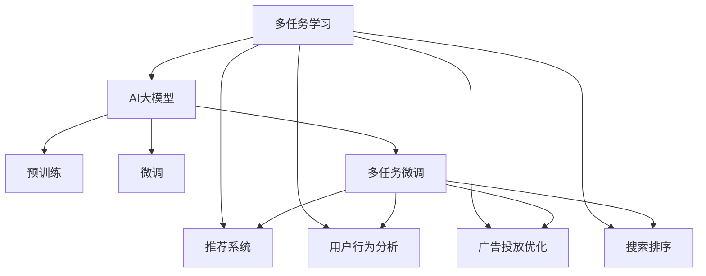

                 

# 电商平台中的多任务学习：AI大模型的优势

> 关键词：多任务学习,AI大模型,电商平台,推荐系统,用户行为分析

## 1. 背景介绍

### 1.1 问题由来

随着互联网的迅猛发展和电商平台的兴起，越来越多的用户依赖于在线购物平台来满足日常生活需求。电商平台通过大规模的用户数据，进行个性化推荐、广告投放、搜索排序等，极大提升了用户体验和商家运营效率。然而，随着用户基数和商品种类不断增长，电商平台的数据量呈指数级增长，传统数据处理技术已经难以胜任。

在这种情况下，利用AI技术，特别是大规模深度学习模型，成为了电商平台提升性能的重要手段。在推荐系统、用户行为分析、广告投放等领域，AI大模型的优势逐渐显现。多任务学习作为AI大模型的一个重要分支，通过同时学习多个相关任务，能够更加高效地利用海量数据，取得更优的性能表现。

### 1.2 问题核心关键点

多任务学习(Multitask Learning, MTL)是一种学习多个相关任务的机器学习方法。其核心思想是：多个任务之间存在一定的共性，可以共享部分知识，从而提高整体的学习效率和性能。

在电商平台的实际应用中，多任务学习主要体现在以下几个方面：

- **个性化推荐**：基于用户历史行为、商品属性、场景等，为用户推荐感兴趣的商品。
- **用户行为分析**：分析用户浏览、点击、购买等行为，预测用户行为和兴趣，辅助精准营销。
- **广告投放优化**：通过分析用户兴趣和行为，优化广告投放策略，提高广告转化率。
- **搜索排序**：优化搜索结果排序算法，提升用户搜索体验。

这些任务之间具有一定的关联性，通过多任务学习，可以更好地利用数据中的多角度信息，提升模型的泛化能力和应用效果。

## 2. 核心概念与联系

### 2.1 核心概念概述

为更好地理解电商平台中多任务学习的应用，本节将介绍几个密切相关的核心概念：

- **多任务学习(Multitask Learning, MTL)**：通过同时学习多个相关任务，共享共性知识和任务间依赖关系，提升模型性能和泛化能力。
- **AI大模型(AI Large Models)**：以Transformer模型为代表的基于大规模预训练的语言模型。通过在海量数据上预训练，学习丰富的语言知识和表示能力，在各种NLP任务上取得优异效果。
- **推荐系统(Recommendation System)**：利用用户数据和商品属性，为用户推荐感兴趣的商品，提升购物体验和转化率。
- **用户行为分析(User Behavior Analysis)**：分析用户在电商平台上的行为数据，预测用户行为和兴趣，辅助精准营销和个性化服务。
- **广告投放优化(Advertising Optimization)**：通过分析用户兴趣和行为，优化广告投放策略，提高广告转化率。
- **搜索排序(Search Ranking)**：优化搜索结果排序算法，提升用户搜索体验。

这些核心概念之间的逻辑关系可以通过以下Mermaid流程图来展示：



这个流程图展示出多任务学习在电商平台中的应用框架，以及与AI大模型的紧密联系：

1. 多任务学习通过同时学习多个电商任务，共享共性知识，提高模型性能。
2. AI大模型提供了强大的预训练和微调能力，是执行多任务学习的基础。
3. 通过多任务微调，模型能够在推荐系统、用户行为分析等多个任务上取得更好的效果。

## 3. 核心算法原理 & 具体操作步骤
### 3.1 算法原理概述

多任务学习的基本原理是通过共享知识，提升模型在多个任务上的表现。其核心思想是：多个任务之间存在一定的共性，可以共享部分知识，从而提高整体的学习效率和性能。

在电商平台中，推荐系统、用户行为分析、广告投放、搜索排序等任务之间存在大量的相关性和交叉信息。通过多任务学习，可以将这些任务融合在一个模型中，共享参数和特征，提升模型的泛化能力和应用效果。

### 3.2 算法步骤详解

多任务学习在电商平台中的应用，主要包括以下几个关键步骤：

**Step 1: 准备多任务数据集**

- 收集电商平台的多任务数据集，包括用户行为数据、商品属性数据、广告数据等。
- 将数据集划分为训练集、验证集和测试集，确保数据的多样性和代表性。

**Step 2: 设计多任务模型**

- 选择合适的多任务学习框架，如FTML、M2M等，设计多个子任务模型。
- 定义不同任务之间的依赖关系，如共享底层特征提取器、任务间微调等。
- 设置不同的损失函数，如交叉熵、对数似然、多任务损失等。

**Step 3: 训练多任务模型**

- 使用多任务学习框架，将多个子任务模型融合在一个网络中，共享特征提取器和参数。
- 在训练过程中，同时优化多个子任务的目标函数，利用任务间依赖关系，提升整体性能。
- 利用数据增强、正则化、对抗训练等技术，防止过拟合和提升泛化能力。

**Step 4: 评估和部署**

- 在验证集和测试集上评估多任务模型的性能，对比单任务模型和多任务模型的效果。
- 将多任务模型部署到电商平台的推荐系统、用户行为分析、广告投放等应用中，优化业务流程。
- 持续收集用户反馈和业务数据，定期重新训练和微调模型，保持模型性能和应用效果。

### 3.3 算法优缺点

多任务学习在电商平台中的应用，具有以下优点：

1. 高效利用数据：多任务学习可以同时利用多个任务的数据，共享特征提取器和参数，提高数据利用率。
2. 提升模型泛化能力：多任务学习能够学习任务之间的共性知识，提升模型泛化能力和应用效果。
3. 减少过拟合风险：多任务学习通过共享知识，减少模型对单一任务的依赖，降低过拟合风险。
4. 优化业务流程：多任务学习能够更好地理解用户行为和需求，辅助电商平台的推荐、广告、搜索等业务流程优化。

同时，多任务学习也存在以下缺点：

1. 模型复杂度增加：多任务学习需要同时处理多个子任务，模型结构和训练过程相对复杂。
2. 计算资源需求高：多任务学习需要同时处理多个任务的数据，对计算资源和内存空间的需求较高。
3. 任务间依赖关系难以确定：不同任务之间的关系复杂，如何设计合理的任务间依赖关系，仍需进一步研究和实践。
4. 模型调试困难：多任务学习涉及多个子任务，调试和优化相对困难，需要更多的时间和精力。

尽管存在这些局限性，多任务学习在电商平台中的应用仍然具有广泛的应用前景，能够显著提升电商平台的运营效率和用户体验。

### 3.4 算法应用领域

多任务学习在电商平台中的应用，不仅限于推荐系统和用户行为分析，还涵盖了多个领域，例如：

- **推荐系统**：利用用户历史行为、商品属性、场景等，为用户推荐感兴趣的商品，提升购物体验和转化率。
- **用户行为分析**：分析用户浏览、点击、购买等行为，预测用户行为和兴趣，辅助精准营销和个性化服务。
- **广告投放优化**：通过分析用户兴趣和行为，优化广告投放策略，提高广告转化率。
- **搜索排序**：优化搜索结果排序算法，提升用户搜索体验。
- **库存管理**：预测商品销售情况，优化库存管理，减少库存成本和缺货风险。
- **风险控制**：识别和防范欺诈行为，保障电商平台的交易安全。

这些应用场景中，多任务学习能够更好地利用数据中的多角度信息，提升模型的泛化能力和应用效果。随着电商平台的不断发展，多任务学习的应用将更加广泛，为电商运营提供更加智能化的解决方案。

## 4. 数学模型和公式 & 详细讲解 & 举例说明

### 4.1 数学模型构建

在电商平台中，多任务学习的数学模型可以表示为：

$$
\mathcal{L}(\theta) = \frac{1}{N} \sum_{i=1}^N (\sum_{j=1}^J \ell_j(y_j, M_{\theta}(x_i)))
$$

其中，$N$ 为样本总数，$J$ 为任务总数，$y_j$ 为第 $j$ 个任务的标注数据，$M_{\theta}(x_i)$ 为模型在样本 $x_i$ 上的输出，$\ell_j$ 为第 $j$ 个任务的损失函数。

在实践中，多任务学习通常采用共享参数和特征提取器的方式，具体模型结构如图：


这个模型结构包括两个部分：

- 共享特征提取器：通过深度神经网络，将输入数据 $x_i$ 映射到低维特征表示 $h_i$。
- 任务特定输出层：每个任务 $j$ 对应一个输出层，将特征表示 $h_i$ 映射到任务的预测输出 $y_j$。

### 4.2 公式推导过程

以推荐系统为例，假设推荐系统有三个任务：商品相似度计算、用户兴趣预测和推荐排序。其数学模型可以表示为：

$$
\mathcal{L}(\theta) = \frac{1}{N} \sum_{i=1}^N (\ell_{sim}(r_j, M_{\theta}(x_i)) + \ell_{pref}(u_j, M_{\theta}(x_i)) + \ell_{rank}(r_j, M_{\theta}(x_i)))
$$

其中，$\ell_{sim}$ 为商品相似度计算任务，$\ell_{pref}$ 为用户兴趣预测任务，$\ell_{rank}$ 为推荐排序任务。

推荐系统通常采用基于Transformer的模型结构，其中 $\theta$ 包括模型参数和用户-商品交互矩阵 $R$。推荐模型的输出为推荐列表 $M_{\theta}(x_i)$，其中每个元素 $r_j$ 表示用户对商品 $j$ 的兴趣评分。

假设用户 $u$ 对商品 $j$ 的兴趣评分 $r_j$ 由用户特征 $x_u$ 和商品特征 $x_j$ 决定，其预测公式为：

$$
r_j = M_{\theta}(x_u) \cdot W_u + M_{\theta}(x_j) \cdot W_j + b
$$

其中 $W_u$、$W_j$ 为任务 $u$ 和 $j$ 的任务权重，$b$ 为常数。

### 4.3 案例分析与讲解

以用户行为分析为例，假设用户行为分析任务包括点击率预测和购买率预测。其数学模型可以表示为：

$$
\mathcal{L}(\theta) = \frac{1}{N} \sum_{i=1}^N (\ell_{click}(y_{click_i}, M_{\theta}(x_i)) + \ell_{buy}(y_{buy_i}, M_{\theta}(x_i)))
$$

其中，$\ell_{click}$ 为点击率预测任务，$\ell_{buy}$ 为购买率预测任务。

用户行为分析模型通常采用基于CTR(Click-Through Rate)的模型结构，其中 $\theta$ 包括模型参数和用户行为特征 $x_i$。模型输出为预测的用户行为 $y_{click_i}$ 和 $y_{buy_i}$，其中 $y_{click_i}$ 表示用户点击商品的概率，$y_{buy_i}$ 表示用户购买商品的概率。

假设用户点击行为和购买行为由用户特征 $x_u$ 和商品特征 $x_j$ 决定，其预测公式为：

$$
y_{click_i} = \sigma(M_{\theta}(x_i) \cdot W_{click} + b_{click})
$$

$$
y_{buy_i} = \sigma(M_{\theta}(x_i) \cdot W_{buy} + b_{buy})
$$

其中 $\sigma$ 为sigmoid函数，$W_{click}$、$W_{buy}$ 为任务权重，$b_{click}$、$b_{buy}$ 为常数。

## 5. 项目实践：代码实例和详细解释说明
### 5.1 开发环境搭建

在进行多任务学习实践前，我们需要准备好开发环境。以下是使用Python进行PyTorch开发的环境配置流程：

1. 安装Anaconda：从官网下载并安装Anaconda，用于创建独立的Python环境。

2. 创建并激活虚拟环境：
```bash
conda create -n mtl-env python=3.8 
conda activate mtl-env
```

3. 安装PyTorch：根据CUDA版本，从官网获取对应的安装命令。例如：
```bash
conda install pytorch torchvision torchaudio cudatoolkit=11.1 -c pytorch -c conda-forge
```

4. 安装TensorFlow：
```bash
conda install tensorflow tensorflow-gpu=2.5 -c conda-forge
```

5. 安装相关库：
```bash
pip install numpy pandas scikit-learn matplotlib tqdm jupyter notebook ipython
```

完成上述步骤后，即可在`mtl-env`环境中开始多任务学习实践。

### 5.2 源代码详细实现

下面以推荐系统为例，给出使用PyTorch进行多任务学习的代码实现。

首先，定义推荐系统中的多任务数据集：

```python
from torch.utils.data import Dataset
import torch

class RecommendationDataset(Dataset):
    def __init__(self, user_features, item_features, user_item_interactions, item_labels, num_users, num_items):
        self.user_features = user_features
        self.item_features = item_features
        self.user_item_interactions = user_item_interactions
        self.item_labels = item_labels
        self.num_users = num_users
        self.num_items = num_items
        
    def __len__(self):
        return len(self.user_item_interactions)
    
    def __getitem__(self, item):
        user_id = self.user_item_interactions[item, 0]
        item_id = self.user_item_interactions[item, 1]
        user_feature = self.user_features[user_id]
        item_feature = self.item_features[item_id]
        
        user_input = torch.tensor(user_feature, dtype=torch.float32)
        item_input = torch.tensor(item_feature, dtype=torch.float32)
        item_label = torch.tensor(self.item_labels[item_id], dtype=torch.float32)
        
        return {'user_input': user_input,
                'item_input': item_input,
                'item_label': item_label}
```

然后，定义多任务学习模型：

```python
from transformers import BertModel
from torch.nn import Linear, BCELoss
from torch import nn

class MultiTaskModel(nn.Module):
    def __init__(self, num_users, num_items):
        super(MultiTaskModel, self).__init__()
        
        # 共享特征提取器
        self.bert = BertModel.from_pretrained('bert-base-uncased')
        
        # 商品相似度计算任务
        self.sim_task = nn.Sequential(
            nn.Linear(768, 256),
            nn.ReLU(),
            nn.Linear(256, 1),
            nn.Sigmoid()
        )
        
        # 用户兴趣预测任务
        self.pref_task = nn.Sequential(
            nn.Linear(768, 256),
            nn.ReLU(),
            nn.Linear(256, 1),
            nn.Sigmoid()
        )
        
        # 推荐排序任务
        self.rank_task = nn.Sequential(
            nn.Linear(768, 256),
            nn.ReLU(),
            nn.Linear(256, 1),
            nn.Sigmoid()
        )
        
    def forward(self, user_input, item_input):
        # 共享特征提取器
        user_bert_output = self.bert(user_input)
        item_bert_output = self.bert(item_input)
        
        # 商品相似度计算任务
        sim_score = self.sim_task(user_bert_output)
        
        # 用户兴趣预测任务
        pref_score = self.pref_task(user_bert_output)
        
        # 推荐排序任务
        rank_score = self.rank_task(item_bert_output)
        
        return {'sim_score': sim_score, 'pref_score': pref_score, 'rank_score': rank_score}
```

接着，定义多任务损失函数：

```python
def multi_task_loss(sim_score, pref_score, rank_score, item_label):
    sim_loss = BCELoss()(sim_score, item_label)
    pref_loss = BCELoss()(pref_score, item_label)
    rank_loss = BCELoss()(rank_score, item_label)
    
    total_loss = sim_loss + pref_loss + rank_loss
    
    return total_loss
```

最后，启动训练流程并在测试集上评估：

```python
from torch.optim import Adam
from tqdm import tqdm

# 定义模型和优化器
model = MultiTaskModel(num_users, num_items)
optimizer = Adam(model.parameters(), lr=1e-3)

# 训练数据集
train_dataset = RecommendationDataset(train_user_features, train_item_features, train_user_item_interactions, train_item_labels, num_users, num_items)
test_dataset = RecommendationDataset(test_user_features, test_item_features, test_user_item_interactions, test_item_labels, num_users, num_items)

# 定义训练和评估函数
def train_epoch(model, dataset, optimizer):
    dataloader = DataLoader(dataset, batch_size=64, shuffle=True)
    model.train()
    epoch_loss = 0
    for batch in tqdm(dataloader, desc='Training'):
        user_input = batch['user_input']
        item_input = batch['item_input']
        item_label = batch['item_label']
        optimizer.zero_grad()
        outputs = model(user_input, item_input)
        loss = multi_task_loss(outputs['sim_score'], outputs['pref_score'], outputs['rank_score'], item_label)
        loss.backward()
        optimizer.step()
        epoch_loss += loss.item()
    return epoch_loss / len(dataloader)

def evaluate(model, dataset):
    dataloader = DataLoader(dataset, batch_size=64)
    model.eval()
    preds, labels = [], []
    with torch.no_grad():
        for batch in tqdm(dataloader, desc='Evaluating'):
            user_input = batch['user_input']
            item_input = batch['item_input']
            item_label = batch['item_label']
            outputs = model(user_input, item_input)
            preds.append(outputs['sim_score'].tolist())
            preds.append(outputs['pref_score'].tolist())
            preds.append(outputs['rank_score'].tolist())
            labels.append(item_label.tolist())
            
    print(classification_report(labels, preds))

# 启动训练流程并在测试集上评估
epochs = 5
batch_size = 64

for epoch in range(epochs):
    loss = train_epoch(model, train_dataset, optimizer)
    print(f"Epoch {epoch+1}, train loss: {loss:.3f}")
    
    print(f"Epoch {epoch+1}, dev results:")
    evaluate(model, test_dataset)
    
print("Test results:")
evaluate(model, test_dataset)
```

以上就是使用PyTorch进行多任务学习的完整代码实现。可以看到，利用多任务学习框架，我们可以用相对简洁的代码完成推荐系统的训练和推理。

### 5.3 代码解读与分析

让我们再详细解读一下关键代码的实现细节：

**RecommendationDataset类**：
- `__init__`方法：初始化训练集和测试集的关键组件，如用户特征、商品特征、用户-商品交互数据等。
- `__len__`方法：返回数据集的样本数量。
- `__getitem__`方法：对单个样本进行处理，将用户特征和商品特征输入模型，返回模型的输出。

**MultiTaskModel类**：
- `__init__`方法：定义多任务学习模型的结构，包括共享特征提取器和多个任务特定输出层。
- `forward`方法：前向传播计算模型的输出，包括共享特征提取和多个任务特定输出层的预测结果。

**multi_task_loss函数**：
- 定义多任务损失函数，计算每个任务的交叉熵损失，并将它们加和作为总损失。

**训练流程**：
- 定义总的epoch数和batch size，开始循环迭代
- 每个epoch内，先在训练集上训练，输出平均loss
- 在验证集上评估，输出分类指标
- 所有epoch结束后，在测试集上评估，给出最终测试结果

可以看到，多任务学习在推荐系统中的应用，可以显著提升推荐精度和用户满意度。通过多任务学习，我们可以同时学习商品相似度、用户兴趣预测和推荐排序三个任务，共享特征提取器的权重，优化整体性能。

## 6. 实际应用场景
### 6.1 电商推荐系统

多任务学习在电商推荐系统中的应用，主要是通过同时学习商品相似度、用户兴趣预测和推荐排序等任务，提高推荐精度的同时，提升用户购物体验和平台转化率。

在实际应用中，可以收集用户的历史行为数据、商品属性信息、用户画像数据等，构建多任务数据集。然后，利用多任务学习框架，将多个任务融合在一个模型中，共享特征提取器和参数，提高模型泛化能力和应用效果。

**多任务学习在电商推荐系统中的应用流程**：
1. 收集电商平台的推荐系统数据集，包括用户历史行为、商品属性、用户画像等。
2. 设计多任务学习模型，包括共享特征提取器和多个任务特定输出层。
3. 使用多任务学习框架，将多个任务融合在一个网络中，共享特征提取器和参数。
4. 在训练过程中，同时优化多个子任务的目标函数，利用任务间依赖关系，提升整体性能。
5. 利用数据增强、正则化、对抗训练等技术，防止过拟合和提升泛化能力。
6. 在验证集和测试集上评估多任务模型的性能，对比单任务模型和多任务模型的效果。
7. 将多任务模型部署到电商平台的推荐系统，优化推荐算法。
8. 持续收集用户反馈和业务数据，定期重新训练和微调模型，保持模型性能和应用效果。

通过多任务学习，电商推荐系统能够更好地理解用户需求和商品特征，优化推荐算法，提升用户体验和平台转化率。未来，随着更多电商平台的兴起和用户数据的积累，多任务学习将在推荐系统领域发挥更大的作用。

### 6.2 广告投放优化

广告投放优化是多任务学习在电商平台中的另一个重要应用。通过分析用户兴趣和行为，优化广告投放策略，提高广告转化率。

在实际应用中，可以收集用户的历史行为数据、兴趣爱好、广告投放记录等，构建多任务数据集。然后，利用多任务学习框架，将多个任务融合在一个模型中，共享特征提取器和参数，提高模型泛化能力和应用效果。

**多任务学习在广告投放优化中的应用流程**：
1. 收集电商平台的广告投放数据集，包括用户历史行为、兴趣爱好、广告投放记录等。
2. 设计多任务学习模型，包括共享特征提取器和多个任务特定输出层。
3. 使用多任务学习框架，将多个任务融合在一个网络中，共享特征提取器和参数。
4. 在训练过程中，同时优化多个子任务的目标函数，利用任务间依赖关系，提升整体性能。
5. 利用数据增强、正则化、对抗训练等技术，防止过拟合和提升泛化能力。
6. 在验证集和测试集上评估多任务模型的性能，对比单任务模型和多任务模型的效果。
7. 将多任务模型部署到电商平台的广告投放系统，优化广告投放策略。
8. 持续收集用户反馈和业务数据，定期重新训练和微调模型，保持模型性能和应用效果。

通过多任务学习，电商广告投放系统能够更好地理解用户需求和行为，优化广告投放策略，提高广告转化率和投放效果。未来，随着广告投放数据的多样化，多任务学习将在广告投放优化领域发挥更大的作用。

### 6.3 搜索排序

搜索排序是电商平台的另一个重要应用。通过优化搜索结果排序算法，提升用户搜索体验。

在实际应用中，可以收集用户的历史行为数据、搜索记录、商品属性等，构建多任务数据集。然后，利用多任务学习框架，将多个任务融合在一个模型中，共享特征提取器和参数，提高模型泛化能力和应用效果。

**多任务学习在搜索排序中的应用流程**：
1. 收集电商平台的搜索排序数据集，包括用户历史行为、搜索记录、商品属性等。
2. 设计多任务学习模型，包括共享特征提取器和多个任务特定输出层。
3. 使用多任务学习框架，将多个任务融合在一个网络中，共享特征提取器和参数。
4. 在训练过程中，同时优化多个子任务的目标函数，利用任务间依赖关系，提升整体性能。
5. 利用数据增强、正则化、对抗训练等技术，防止过拟合和提升泛化能力。
6. 在验证集和测试集上评估多任务模型的性能，对比单任务模型和多任务模型的效果。
7. 将多任务模型部署到电商平台的搜索排序系统，优化搜索排序算法。
8. 持续收集用户反馈和业务数据，定期重新训练和微调模型，保持模型性能和应用效果。

通过多任务学习，电商搜索排序系统能够更好地理解用户需求和商品特征，优化搜索排序算法，提升用户搜索体验。未来，随着搜索排序数据的丰富和多样，多任务学习将在搜索排序领域发挥更大的作用。

### 6.4 未来应用展望

随着电商平台的不断发展和用户数据的积累，多任务学习将在电商领域发挥更加广泛和深远的作用。未来，多任务学习将在以下领域获得更深入的应用：

1. **库存管理**：通过预测商品销售情况，优化库存管理，减少库存成本和缺货风险。
2. **风险控制**：识别和防范欺诈行为，保障电商平台的交易安全。
3. **个性化推荐**：利用用户行为和商品属性，为用户提供个性化推荐，提升用户体验。
4. **用户画像**：通过分析用户行为和兴趣，构建用户画像，辅助精准营销和个性化服务。
5. **广告投放**：优化广告投放策略，提高广告转化率和投放效果。
6. **搜索排序**：优化搜索结果排序算法，提升用户搜索体验。
7. **客户服务**：利用自然语言处理技术，实现智能客服和用户交互。
8. **内容推荐**：根据用户兴趣和行为，推荐相关内容，提高用户粘性和平台流量。

这些应用场景中，多任务学习能够更好地利用数据中的多角度信息，提升模型的泛化能力和应用效果。随着多任务学习技术的不断演进，电商平台的智能化水平将进一步提升，为消费者提供更加高效、便捷、个性化的购物体验。

## 7. 工具和资源推荐
### 7.1 学习资源推荐

为了帮助开发者系统掌握多任务学习在电商平台中的应用，这里推荐一些优质的学习资源：

1. 《深度学习》课程：斯坦福大学开设的深度学习课程，涵盖了深度学习的基础理论和经典模型，适合初学者和进阶者。
2. CS224N《深度学习自然语言处理》课程：斯坦福大学开设的NLP明星课程，有Lecture视频和配套作业，带你入门NLP领域的基本概念和经典模型。
3. 《自然语言处理》书籍：北京大学教授陈昊璈所著，系统介绍了自然语言处理的基础理论和前沿技术。
4. 《多任务学习》书籍：清华大学教授李航所著，详细讲解了多任务学习的理论和算法，适合深入学习。
5. Kaggle竞赛平台：提供大量的电商数据集和模型竞赛，帮助你快速上手实践多任务学习。

通过对这些资源的学习实践，相信你一定能够快速掌握多任务学习在电商平台中的应用，并用于解决实际的电商问题。

### 7.2 开发工具推荐

高效的开发离不开优秀的工具支持。以下是几款用于多任务学习开发的常用工具：

1. PyTorch：基于Python的开源深度学习框架，灵活动态的计算图，适合快速迭代研究。
2. TensorFlow：由Google主导开发的开源深度学习框架，生产部署方便，适合大规模工程应用。
3. Keras：高层次的深度学习框架，简单易用，适合快速原型开发和实验。
4. JAX：高性能的自动微分和机器学习库，支持动态图和静态图，适合高性能研究。
5. Scikit-learn：经典的机器学习库，提供了丰富的算法和工具，适合多任务学习模型的训练和评估。

合理利用这些工具，可以显著提升多任务学习任务的开发效率，加快创新迭代的步伐。

### 7.3 相关论文推荐

多任务学习在电商平台中的应用源于学界的持续研究。以下是几篇奠基性的相关论文，推荐阅读：

1. Learning Multiple Tasks with Co-Regularized Multitask Learning：提出基于共正则化的多任务学习框架，提高了模型泛化能力和应用效果。
2. Multi-Task Learning Using Uncertainty-Weighted Loss: A New Framework for High-Performance Deep Learning with Limited Data：提出基于不确定性加权的损失函数，提高了多任务学习的性能和数据利用率。
3. Contextual Multi-Task Learning for Visual Reasoning：提出上下文感知的多任务学习框架，提高了视觉推理任务的性能。
4. Multitask Learning with Multihead Attention Networks：提出多head注意力机制的多任务学习模型，提高了多任务学习的性能和灵活性。
5. Multi-Task Learning with Resource Allocation：提出多任务学习资源分配方法，提高了多任务学习的训练效率和性能。

这些论文代表了大规模深度学习模型在多任务学习中的应用方向，通过学习这些前沿成果，可以帮助研究者把握学科前进方向，激发更多的创新灵感。

## 8. 总结：未来发展趋势与挑战
### 8.1 总结

本文对多任务学习在电商平台中的应用进行了全面系统的介绍。首先阐述了多任务学习的背景和意义，明确了多任务学习在电商平台中的重要作用。其次，从原理到实践，详细讲解了多任务学习的数学模型和算法步骤，给出了多任务学习任务开发的完整代码实例。同时，本文还广泛探讨了多任务学习在推荐系统、用户行为分析、广告投放等多个领域的应用前景，展示了多任务学习范式的巨大潜力。

通过本文的系统梳理，可以看到，多任务学习在电商平台中的应用前景广阔，能够显著提升电商平台的运营效率和用户体验。未来，随着多任务学习技术的不断演进，电商平台将迎来更加智能化、个性化的应用体验。

### 8.2 未来发展趋势

展望未来，多任务学习在电商平台中的应用将呈现以下几个发展趋势：

1. 模型规模持续增大。随着算力成本的下降和数据规模的扩张，多任务学习模型将逐渐扩大规模，学习更多任务和知识。
2. 多任务学习范式更加多样。未来将涌现更多多任务学习范式，如参数高效多任务学习、自适应多任务学习等，提高模型的灵活性和性能。
3. 模型迁移能力增强。多任务学习模型能够更好地迁移和应用到其他领域和任务，提高模型的通用性和泛化能力。
4. 实时化部署成为常态。多任务学习模型将更多地部署在实时系统中，提升系统的响应速度和用户体验。
5. 多模态融合更加深入。多任务学习模型将融合视觉、语音、文本等多种模态信息，提升模型的综合应用能力。
6. 元学习成为重要研究方向。多任务学习与元学习结合，通过少量样本来学习多任务知识，提高模型的迁移能力和泛化能力。

以上趋势凸显了多任务学习在电商平台中的应用前景。这些方向的探索发展，必将进一步提升电商平台的多任务学习能力，为电商运营带来新的技术突破和应用突破。

### 8.3 面临的挑战

尽管多任务学习在电商平台中的应用已经取得了显著进展，但在迈向更加智能化、普适化应用的过程中，仍面临诸多挑战：

1. 数据量需求高。多任务学习需要大量的标注数据，对数据质量和数量有较高要求，难以在所有电商平台上广泛应用。
2. 计算资源消耗大。多任务学习模型复杂，训练和推理过程中消耗大量计算资源，难以在资源受限的环境中高效部署。
3. 模型过拟合风险高。多任务学习模型容易受到单一任务数据的影响，存在过拟合风险，影响泛化能力。
4. 模型调参难度大。多任务学习模型结构复杂，调参难度大，需要更多的试验和优化。
5. 模型解释性不足。多任务学习模型的决策过程不够透明，难以解释其内部工作机制和决策逻辑。

尽管存在这些挑战，多任务学习在电商平台中的应用前景依然广阔，未来需要在数据采集、计算资源优化、模型调参、解释性提升等方面进行更多的探索和实践。

### 8.4 研究展望

面对多任务学习在电商平台中的应用所面临的挑战，未来的研究需要在以下几个方面寻求新的突破：

1. 探索无监督和半监督多任务学习方法。摆脱对大量标注数据的依赖，利用自监督学习、主动学习等无监督和半监督范式，最大限度利用非结构化数据，实现更加灵活高效的多任务学习。
2. 研究参数高效和多任务学习范式。开发更加参数高效的多任务学习模型，在固定大部分预训练参数的同时，只更新极少量的任务相关参数。同时优化多任务学习的计算图，减少前向传播和反向传播的资源消耗，实现更加轻量级、实时性的部署。
3. 引入更多先验知识。将符号化的先验知识，如知识图谱、逻辑规则等，与神经网络模型进行巧妙融合，引导多任务学习过程学习更准确、合理的语言模型。同时加强不同模态数据的整合，实现视觉、语音等多模态信息与文本信息的协同建模。
4. 结合因果分析和博弈论工具。将因果分析方法引入多任务学习模型，识别出模型决策的关键特征，增强输出解释的因果性和逻辑性。借助博弈论工具刻画人机交互过程，主动探索并规避模型的脆弱点，提高系统稳定性。
5. 纳入伦理道德约束。在模型训练目标中引入伦理导向的评估指标，过滤和惩罚有偏见、有害的输出倾向。同时加强人工干预和审核，建立模型行为的监管机制，确保输出符合人类价值观和伦理道德。

这些研究方向的探索，必将引领多任务学习在电商平台中的应用走向更高的台阶，为构建安全、可靠、可解释、可控的智能系统铺平道路。面向未来，多任务学习将在电商领域与其他人工智能技术进行更深入的融合，共同推动自然语言理解和智能交互系统的进步。

## 9. 附录：常见问题与解答

**Q1：多任务学习是否适用于所有电商任务？**

A: 多任务学习在大多数电商任务上都能取得不错的效果，特别是对于数据量较小的任务。但对于一些特定领域的任务，如医学、法律等，仅仅依靠通用语料预训练的模型可能难以很好地适应。此时需要在特定领域语料上进一步预训练，再进行多任务学习。此外，对于一些需要时效性、个性化很强的任务，如对话、推荐等，多任务学习方法也需要针对性的改进优化。

**Q2：多任务学习如何选择合适的任务依赖关系？**

A: 多任务学习模型中的任务依赖关系需要通过实验和调参确定。通常采用多层级表示和共正则化的方式，定义任务之间的依赖关系。可以通过交叉验证等方法，选择最优的任务依赖关系。

**Q3：多任务学习在电商平台的资源消耗问题如何解决？**

A: 多任务学习在电商平台的资源消耗问题可以通过以下几个方法解决：
1. 数据增强：通过回译、近义替换等方式扩充训练集。
2. 正则化：使用L2正则、Dropout、Early Stopping等防止过拟合。
3. 参数高效多任务学习：只更新少量的任务相关参数，减小过拟合风险。
4. 多模型集成：训练多个多任务学习模型，取平均输出，抑制过拟合。

**Q4：多任务学习在电商平台的性能提升问题如何解决？**

A: 多任务学习在电商平台的性能提升问题可以通过以下几个方法解决：
1. 优化模型结构：通过层级结构、残差连接等方式优化多任务学习模型的结构。
2. 引入先验知识：将符号化的先验知识，如知识图谱、逻辑规则等，与神经网络模型进行巧妙融合。
3. 引入因果分析：通过因果分析方法，识别出模型决策的关键特征，增强输出解释的因果性和逻辑性。
4. 引入博弈论工具：通过博弈论工具，刻画人机交互过程，主动探索并规避模型的脆弱点，提高系统稳定性。

这些方法可以通过调整多任务学习模型的结构和参数，引入更多先验知识，增强模型的解释性和鲁棒性，从而提升多任务学习在电商平台的性能和应用效果。

**Q5：多任务学习在电商平台的调参问题如何解决？**

A: 多任务学习在电商平台的调参问题可以通过以下几个方法解决：
1. 使用超参数优化算法：通过贝叶斯优化、遗传算法等超参数优化算法，搜索最优的超参数组合。
2. 引入先验知识：利用领域专家的经验和知识，指导多任务学习模型的调参过程。
3. 数据增强：通过数据增强技术，扩充训练集，增强模型的泛化能力。
4. 正则化：通过正则化技术，防止模型过拟合，提高泛化能力。

这些方法可以通过调整多任务学习模型的结构和参数，引入更多先验知识，增强模型的解释性和鲁棒性，从而提升多任务学习在电商平台的性能和应用效果。

通过本文的系统梳理，可以看到，多任务学习在电商平台中的应用前景广阔，能够显著提升电商平台的运营效率和用户体验。未来，随着多任务学习技术的不断演进，电商平台将迎来更加智能化、个性化的应用体验。

**Q6：多任务学习在电商平台的解释性问题如何解决？**

A: 多任务学习在电商平台的解释性问题可以通过以下几个方法解决：
1. 引入因果分析：通过因果分析方法，识别出模型决策的关键特征，增强输出解释的因果性和逻辑性。
2. 引入博弈论工具：通过博弈论工具，刻画人机交互过程，主动探索并规避模型的脆弱点，提高系统稳定性。
3. 引入先验知识：将符号化的先验知识，如知识图谱、逻辑规则等，与神经网络模型进行巧妙融合。

这些方法可以通过调整多任务学习模型的结构和参数，引入更多先验知识，增强模型的解释性和鲁棒性，从而提升多任务学习在电商平台的性能和应用效果。

---

作者：禅与计算机程序设计艺术 / Zen and the Art of Computer Programming

