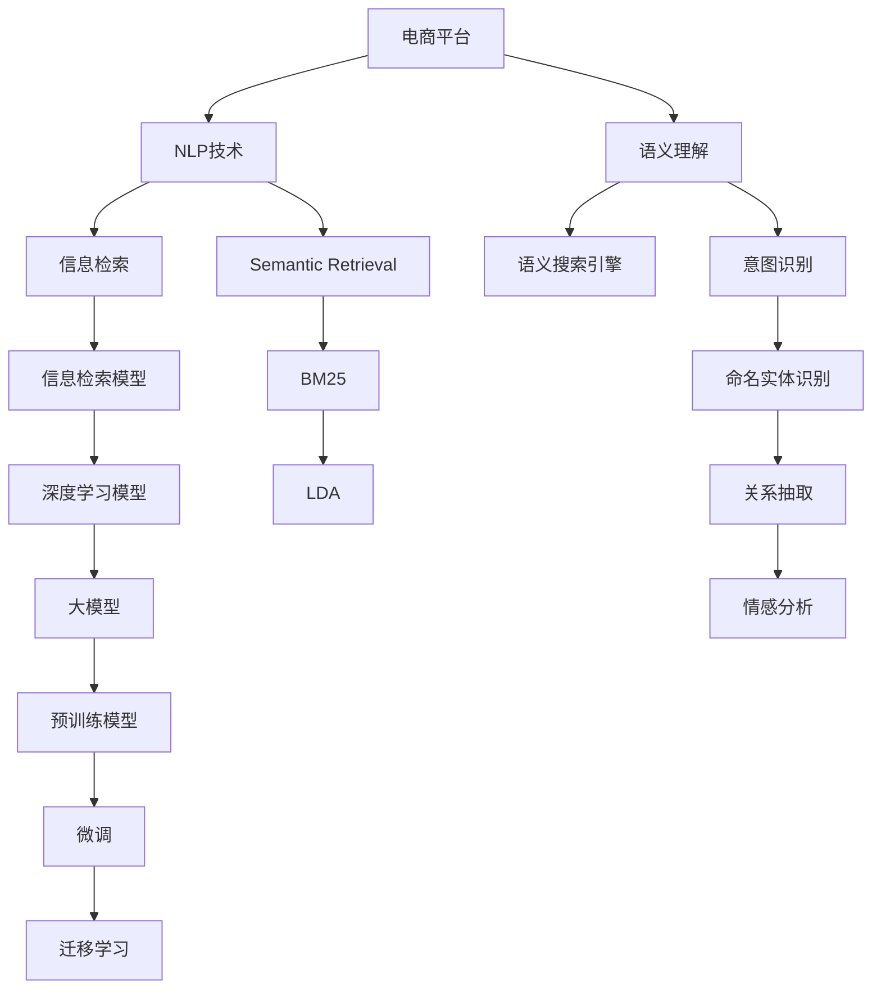

                 

# 电商平台搜索query扩展：AI大模型的语义理解

> 关键词：电商平台,搜索,query扩展,大模型,自然语言处理(NLP),语义理解

## 1. 背景介绍

### 1.1 问题由来

随着互联网的普及和电子商务的兴起，电商平台已成为人们日常购物的重要渠道。电商平台上的商品种类繁多，但用户往往无法通过简单关键词精准找到所需商品。如何通过搜索query扩展技术，提升用户的搜索体验，成为电商平台亟待解决的问题。

### 1.2 问题核心关键点

1. 用户输入的查询往往存在歧义、拼写错误等问题，给匹配带来挑战。
2. 商品描述中包含大量的非结构化自然语言，传统的文本匹配算法难以高效处理。
3. 商品的语义特征复杂多样，如何提取并匹配到正确的商品需要更高级的语义理解技术。
4. 用户搜索行为受时间、地域、上下文等多种因素影响，需要更动态的模型进行适应。
5. 搜索query扩展涉及大量的自然语言处理任务，如实体识别、关系抽取、意图识别等。

### 1.3 问题研究意义

解决电商平台搜索query扩展问题，对于提升用户体验、提高商家曝光度和电商平台交易转化率具有重要意义。具体而言：

1. 减少用户搜索时间，提升购物体验。精准的搜索结果能够快速定位商品，减少用户操作复杂度。
2. 增加商品曝光机会，提高商家收益。不同用户、不同场景下，商品匹配更加准确，能获得更多点击。
3. 优化资源分配，提升平台转化率。通过精准的商品匹配，引导更多流量转化为实际交易。
4. 增强搜索算法竞争力，拓展电商市场。高性能的搜索算法可以吸引更多用户注册和使用，提升平台市场份额。

## 2. 核心概念与联系

### 2.1 核心概念概述

为更好地理解基于AI大模型的语义理解在搜索query扩展中的应用，本节将介绍几个密切相关的核心概念：

- 自然语言处理(Natural Language Processing, NLP)：利用计算机技术处理、理解、生成自然语言的技术。包括分词、词性标注、命名实体识别、句法分析、语义分析等子任务。
- 语义理解(Semantic Understanding)：理解自然语言背后的逻辑和含义，如实体识别、关系抽取、情感分析、意图识别等。
- 语义搜索引擎(Semantic Search Engine)：结合自然语言处理和语义理解技术，对用户查询进行深层次语义理解，匹配最相关的信息。
- 信息检索(Information Retrieval, IR)：根据用户查询从文档集合中检索最相关的信息，常用的模型包括BM25、LDA等。
- 深度学习模型(Deep Learning Model)：基于神经网络的模型，通过多层次的非线性变换学习输入和输出的复杂映射关系。
- 大模型(Large Model)：参数量超过10亿的深度学习模型，如GPT、BERT等，拥有强大的语义表示能力。
- 预训练模型(Pre-trained Model)：在大规模无标签数据上进行自监督预训练的模型，如BERT、GPT-3等。
- 迁移学习(Transfer Learning)：将在大规模无标签数据上预训练的模型，迁移到特定任务上进行微调，获得优异的性能。
- 微调(Fine-Tuning)：在预训练模型的基础上，利用小规模标注数据进一步优化模型，适应特定任务。
- 语言模型(Language Model)：能够预测下一个词的概率分布，如LM模型、Transformer模型等。

这些核心概念之间的逻辑关系可以通过以下Mermaid流程图来展示：



这个流程图展示了各个概念之间的逻辑关系：

1. 电商平台借助NLP技术和语义理解技术，构建语义搜索引擎，实现深度信息检索。
2. 信息检索模型包括BM25、LDA等，用于对大量非结构化文本数据进行索引和检索。
3. 深度学习模型和大模型提供强大的语义表示能力，通过预训练和微调进一步提升检索效果。
4. 迁移学习和大模型微调技术，使得模型能够在不同任务上高效迁移，获得更好的泛化能力。
5. 语义理解技术包括意图识别、命名实体识别、关系抽取、情感分析等，帮助构建更精准的搜索模型。

## 3. 核心算法原理 & 具体操作步骤
### 3.1 算法原理概述

基于AI大模型的语义理解在搜索query扩展中，主要利用深度学习模型对用户输入的查询进行语义分析，提取关键词、识别实体、理解意图，最终匹配到最相关的商品。具体步骤如下：

1. **预训练模型初始化**：选择适当的预训练模型，如BERT、GPT等，进行初始化。
2. **查询预处理**：将用户输入的查询进行分词、去停用词、词性标注等处理。
3. **特征提取**：利用预训练模型对查询进行编码，提取高维语义特征。
4. **意图识别**：结合命名实体识别、关系抽取、情感分析等技术，确定查询意图和关注点。
5. **商品检索**：根据查询意图和特征，检索商品库中匹配度最高的商品。
6. **结果展示**：将检索结果按照相关性排序，展示给用户，供其选择。

### 3.2 算法步骤详解

以下是具体算法步骤的详细介绍：

**Step 1: 选择预训练模型和构建查询表示**
- 选择合适的预训练模型，如BERT、GPT-3等。
- 将用户查询进行分词、去停用词、词性标注等处理，得到预处理后的文本序列。
- 利用预训练模型对文本序列进行编码，得到高维语义特征向量。

**Step 2: 意图识别**
- 结合命名实体识别技术，识别查询中的实体及其类型。
- 利用关系抽取技术，确定实体之间的关系。
- 结合情感分析技术，判断查询的情绪倾向。
- 综合上述信息，确定查询的主要意图。

**Step 3: 商品检索**
- 从商品库中检索与查询意图和特征匹配度最高的商品。
- 使用基于深度学习的推荐算法，结合用户历史行为数据和商品属性，进行更精准的商品匹配。
- 根据相关性排序，返回最相关的商品列表。

**Step 4: 结果展示**
- 根据展示规则，将检索结果以列表、卡片等形式展示给用户。
- 用户可以点击商品卡片，查看商品详情或直接购买。
- 收集用户点击数据，进行后续的模型优化和改进。

### 3.3 算法优缺点

基于AI大模型的语义理解在搜索query扩展中，有以下优点：

1. 语义理解能力强大。深度学习模型和大模型能够理解自然语言背后的逻辑和含义，识别实体、关系、情感等语义信息。
2. 泛化能力较强。经过大规模无标签数据的预训练，模型能够在不同领域、不同场景下进行迁移学习，适应各种搜索场景。
3. 实时性较好。大模型通过GPU等高性能设备，可以快速进行查询编码和特征提取，提高响应速度。
4. 鲁棒性较强。模型具有较强的泛化能力和适应性，对于不同查询风格、拼写错误等均能较好地处理。

同时，该方法也存在一些局限性：

1. 数据需求较大。构建高质量的预训练模型，需要海量无标签数据进行预训练，获取高质量标注数据较为困难。
2. 计算资源消耗大。深度学习模型和大模型参数量较大，训练和推理过程需要高性能计算设备。
3. 模型复杂度高。深度学习模型和大模型结构复杂，不易于解释和调试，模型维护难度较大。
4. 效果受数据质量影响。预训练模型和大模型依赖于数据质量，若数据标注不完整、标注错误，会影响模型的性能。
5. 动态更新较难。当前模型更新较慢，难以快速适应数据分布变化。

尽管存在这些局限性，基于AI大模型的语义理解在搜索query扩展中仍然具有显著的优势和广泛的应用前景。

### 3.4 算法应用领域

基于AI大模型的语义理解，已经在电商、社交、金融、医疗等多个领域得到广泛应用。以下是几个典型场景：

- **电商平台搜索**：利用深度学习模型和大模型，对用户查询进行语义理解，匹配最相关的商品。
- **社交媒体分析**：对用户的评论、回复进行语义理解，识别情感、意图、实体等信息，进行内容推荐和社区管理。
- **金融风控**：对用户的交易记录、申请材料进行语义理解，识别风险信号，进行反欺诈和信用评估。
- **医疗咨询**：对用户的病历描述、症状描述进行语义理解，辅助医生诊断和治疗方案制定。
- **智能客服**：对用户的问题进行语义理解，生成智能回复或引导到人工客服，提高服务效率。

## 4. 数学模型和公式 & 详细讲解 & 举例说明

### 4.1 数学模型构建

假设用户的查询为 $q$，商品库中的商品为 $p$，用 $f_q$ 和 $f_p$ 分别表示查询和商品的高维语义特征向量，利用深度学习模型对查询和商品进行编码。

设 $\theta$ 为预训练模型的参数，利用预训练模型对查询 $q$ 进行编码，得到高维特征向量 $f_q$：

$$
f_q = M_{\theta}(q)
$$

其中 $M_{\theta}$ 为预训练模型，可以是BERT、GPT等。

设 $t$ 为查询的意图和关注点，利用意图识别模型对 $f_q$ 进行解析，得到意图向量 $f_t$：

$$
f_t = I(f_q)
$$

其中 $I$ 为意图识别模型，可以是实体识别、关系抽取、情感分析等。

将 $f_t$ 和商品库中的商品 $p$ 进行匹配，计算它们之间的余弦相似度：

$$
similarity = \frac{f_t^T \cdot f_p}{||f_t|| \cdot ||f_p||}
$$

根据相似度排序，选择前 $k$ 个最相关的商品作为检索结果，展示给用户。

### 4.2 公式推导过程

以下推导了意图识别和商品匹配的基本公式：

**意图识别**：
假设查询 $q$ 包含实体 $e_1, e_2, ..., e_n$，利用命名实体识别模型 $R$ 对 $q$ 进行解析，得到实体向量 $r_1, r_2, ..., r_n$：

$$
r_i = R(e_i)
$$

利用关系抽取模型 $L$ 对实体进行解析，得到关系向量 $l_1, l_2, ..., l_n$：

$$
l_i = L(r_i)
$$

综合上述信息，得到意图向量 $f_t$：

$$
f_t = \sum_{i=1}^n \alpha_ir_i + \sum_{i=1}^n \beta_il_i
$$

其中 $\alpha_i$ 和 $\beta_i$ 为权重系数，用于平衡实体和关系的贡献。

**商品匹配**：
设商品 $p$ 的高维特征向量为 $f_p$，利用余弦相似度计算 $f_t$ 和 $f_p$ 的相似度：

$$
similarity = \frac{f_t^T \cdot f_p}{||f_t|| \cdot ||f_p||}
$$

根据相似度排序，选择前 $k$ 个最相关的商品作为检索结果，展示给用户。

### 4.3 案例分析与讲解

**案例一：电商平台搜索**
- 用户输入查询：“黑色高跟皮靴”
- 预处理：分词、去停用词、词性标注等
- 编码：利用BERT模型对查询进行编码，得到高维特征向量 $f_q$
- 意图识别：利用实体识别模型，识别出“黑色”、“高跟”、“皮靴”等实体，利用关系抽取模型，判断实体之间的关系
- 商品匹配：根据相似度排序，检索出匹配度最高的商品

**案例二：社交媒体分析**
- 用户评论：“这条裙子真漂亮，非常适合春游”
- 预处理：分词、去停用词、词性标注等
- 编码：利用BERT模型对评论进行编码，得到高维特征向量 $f_q$
- 意图识别：利用实体识别模型，识别出“裙子”、“春游”等实体，利用情感分析模型，判断评论的情绪倾向
- 内容推荐：根据相似度排序，推荐其他包含“裙子”、“春游”等关键词的帖子给用户

## 5. 项目实践：代码实例和详细解释说明

### 5.1 开发环境搭建

在进行项目实践前，我们需要准备好开发环境。以下是使用Python进行PyTorch开发的环境配置流程：

1. 安装Anaconda：从官网下载并安装Anaconda，用于创建独立的Python环境。

2. 创建并激活虚拟环境：
```bash
conda create -n pytorch-env python=3.8 
conda activate pytorch-env
```

3. 安装PyTorch：根据CUDA版本，从官网获取对应的安装命令。例如：
```bash
conda install pytorch torchvision torchaudio cudatoolkit=11.1 -c pytorch -c conda-forge
```

4. 安装Transformer库：
```bash
pip install transformers
```

5. 安装各类工具包：
```bash
pip install numpy pandas scikit-learn matplotlib tqdm jupyter notebook ipython
```

完成上述步骤后，即可在`pytorch-env`环境中开始项目实践。

### 5.2 源代码详细实现

下面是利用PyTorch进行电商平台搜索query扩展的代码实现：

```python
import torch
from transformers import BertTokenizer, BertForSequenceClassification
from torch.utils.data import DataLoader
from tqdm import tqdm

class SearchDataset(Dataset):
    def __init__(self, queries, labels):
        self.queries = queries
        self.labels = labels
        
    def __len__(self):
        return len(self.queries)
    
    def __getitem__(self, item):
        query = self.queries[item]
        label = self.labels[item]
        
        encoding = self.tokenizer(query, return_tensors='pt', padding='max_length', truncation=True)
        input_ids = encoding['input_ids'][0]
        attention_mask = encoding['attention_mask'][0]
        
        return {'input_ids': input_ids, 
                'attention_mask': attention_mask,
                'labels': label}

# 加载预训练模型和分词器
tokenizer = BertTokenizer.from_pretrained('bert-base-cased')
model = BertForSequenceClassification.from_pretrained('bert-base-cased', num_labels=1)

# 加载数据集
queries = [...] # 查询数据
labels = [...] # 商品匹配标签
dataset = SearchDataset(queries, labels)

# 设置训练参数
device = torch.device('cuda') if torch.cuda.is_available() else torch.device('cpu')
model.to(device)

# 训练模型
optimizer = torch.optim.AdamW(model.parameters(), lr=2e-5)
criterion = torch.nn.BCEWithLogitsLoss()
model.train()
for epoch in range(10):
    loss = 0
    for batch in DataLoader(dataset, batch_size=16):
        inputs = {key: value.to(device) for key, value in batch.items()}
        labels = inputs.pop('labels').to(device)
        outputs = model(**inputs)
        loss += criterion(outputs.logits, labels).item()
        optimizer.zero_grad()
        loss.backward()
        optimizer.step()
    print(f'Epoch {epoch+1}, loss: {loss:.4f}')
```

### 5.3 代码解读与分析

让我们再详细解读一下关键代码的实现细节：

**SearchDataset类**：
- `__init__`方法：初始化查询和标签。
- `__len__`方法：返回数据集的样本数量。
- `__getitem__`方法：对单个样本进行处理，将查询输入编码为token ids，并对其添加mask进行padding，最终返回模型所需的输入。

**预训练模型和分词器**：
- 加载预训练模型和分词器，准备模型和数据。
- 使用BertTokenizer对查询进行分词，并利用BertForSequenceClassification进行编码。

**训练参数和模型**：
- 将模型和数据加载到GPU上，设置训练参数和优化器。
- 利用DataLoader对数据集进行批次化加载，供模型训练使用。
- 循环迭代训练，计算loss并更新模型参数。

以上代码展示了基于PyTorch对BERT模型进行电商搜索query扩展的完整实现。可以看到，PyTorch配合Transformer库使得模型的训练过程变得简洁高效。

## 6. 实际应用场景

### 6.1 智能推荐系统
电商平台可以利用搜索query扩展技术，构建智能推荐系统，提高用户转化率和购买率。例如：
- 用户输入“鞋子”，系统推荐“运动鞋”、“皮鞋”、“凉鞋”等多种类型。
- 用户输入“黑色皮靴”，系统推荐“黑色高跟皮靴”、“黑色平底皮靴”、“黑色中跟皮靴”等多种款式。

### 6.2 个性化广告投放
电商平台可以利用搜索query扩展技术，进行个性化广告投放，提升广告点击率和转化率。例如：
- 用户输入“新年礼物”，系统推荐“红色围巾”、“红色手套”、“红色袜子”等多种相关商品。
- 用户输入“健康食品”，系统推荐“低脂牛奶”、“全麦面包”、“燕麦片”等多种健康食品。

### 6.3 用户行为分析
电商平台可以利用搜索query扩展技术，分析用户行为，优化商品推荐和市场策略。例如：
- 统计“白色T恤”的搜索量，优化库存管理和商品陈列。
- 分析“大学生”的购买行为，调整营销策略和促销活动。

### 6.4 未来应用展望

随着深度学习和大模型技术的不断发展，基于AI大模型的语义理解在搜索query扩展中将迎来更广泛的应用：

1. **多模态搜索**：结合图像、视频等多模态数据，实现视觉搜索和视频搜索，拓展搜索场景。
2. **知识图谱搜索**：利用知识图谱技术，进行基于关系的搜索，提高搜索的准确性和深度。
3. **跨领域搜索**：将搜索技术应用到医疗、金融等垂直领域，提升信息检索的泛化能力。
4. **个性化推荐引擎**：结合用户行为数据，构建更加智能、精准的推荐引擎，提升用户体验和平台收益。
5. **智能客服系统**：利用搜索query扩展技术，实现智能问答和自动回复，提高客服效率和用户体验。
6. **多语言搜索**：支持多语言搜索，拓展全球市场，提升国际化竞争力。

## 7. 工具和资源推荐

### 7.1 学习资源推荐

为了帮助开发者系统掌握基于AI大模型的语义理解技术，这里推荐一些优质的学习资源：

1. 《Natural Language Processing with PyTorch》书籍：利用PyTorch实现NLP任务的经典教程，涵盖了深度学习模型、语义理解、信息检索等内容。
2. HuggingFace官方文档：Transformer库的官方文档，提供了海量预训练模型和完整的代码样例，是学习和使用大模型的重要资源。
3 CS224N《深度学习自然语言处理》课程：斯坦福大学开设的NLP明星课程，涵盖自然语言处理的基本概念和前沿技术，适合初学者和进阶学习者。
4 《Semantic Search and Information Retrieval》书籍：深入讲解语义搜索和信息检索的技术和应用，是NLP领域权威的入门读物。
5 《Transformers: A Survey》论文：综述Transformer模型及其应用，是了解最新研究成果的重要参考资料。

通过对这些资源的学习实践，相信你一定能够快速掌握基于AI大模型的语义理解技术，并用于解决实际的NLP问题。

### 7.2 开发工具推荐

高效的开发离不开优秀的工具支持。以下是几款用于电商平台搜索query扩展开发的常用工具：

1. PyTorch：基于Python的开源深度学习框架，灵活动态，适合深度学习模型的训练和推理。
2. TensorFlow：由Google主导开发的开源深度学习框架，计算图高效，适合大规模工程应用。
3. Weights & Biases：模型训练的实验跟踪工具，可以记录和可视化模型训练过程中的各项指标，方便对比和调优。
4. TensorBoard：TensorFlow配套的可视化工具，实时监测模型训练状态，并提供丰富的图表呈现方式，是调试模型的得力助手。
5. HuggingFace Transformers库：提供了大量预训练模型，方便进行微调和使用，是NLP开发的重要工具。
6. Amazon SageMaker：亚马逊提供的云机器学习平台，支持深度学习模型的训练、部署和优化，适合大规模生产部署。

合理利用这些工具，可以显著提升电商搜索query扩展任务的开发效率，加快创新迭代的步伐。

### 7.3 相关论文推荐

大语言模型和语义理解技术的发展源于学界的持续研究。以下是几篇奠基性的相关论文，推荐阅读：

1. Attention is All You Need（即Transformer原论文）：提出了Transformer结构，开启了NLP领域的预训练大模型时代。
2. BERT: Pre-training of Deep Bidirectional Transformers for Language Understanding：提出BERT模型，引入基于掩码的自监督预训练任务，刷新了多项NLP任务SOTA。
3. Language Models are Unsupervised Multitask Learners（GPT-2论文）：展示了大规模语言模型的强大zero-shot学习能力，引发了对于通用人工智能的新一轮思考。
4. Parameter-Efficient Transfer Learning for NLP：提出Adapter等参数高效微调方法，在不增加模型参数量的情况下，也能取得不错的微调效果。
5. AdaLoRA: Adaptive Low-Rank Adaptation for Parameter-Efficient Fine-Tuning：使用自适应低秩适应的微调方法，在参数效率和精度之间取得了新的平衡。
6. Query expansion for text retrieval with neural networks: A survey：综述了神经网络在信息检索和查询扩展中的应用，是了解最新研究进展的重要参考资料。

这些论文代表了大语言模型和语义理解技术的发展脉络。通过学习这些前沿成果，可以帮助研究者把握学科前进方向，激发更多的创新灵感。

## 8. 总结：未来发展趋势与挑战

### 8.1 总结

本文对基于AI大模型的语义理解在电商平台搜索query扩展中的应用进行了全面系统的介绍。首先阐述了背景和研究意义，明确了语义理解在提升用户体验、提高商家曝光度和电商平台交易转化率方面的独特价值。其次，从原理到实践，详细讲解了语义理解的基本算法和技术细节，给出了完整的代码实现。同时，本文还广泛探讨了语义理解技术在多个行业领域的应用前景，展示了其在电商、社交、金融、医疗等多个场景中的潜力。

通过本文的系统梳理，可以看到，基于AI大模型的语义理解在电商搜索query扩展中具有显著的优势和广泛的应用前景，将大大提升电商平台的搜索体验和用户满意度。未来，伴随预训练语言模型和语义理解技术的不断演进，搜索query扩展技术必将在更广泛的领域得到应用，为电商、社交、金融等行业带来深刻变革。

### 8.2 未来发展趋势

展望未来，基于AI大模型的语义理解在搜索query扩展中将呈现以下几个发展趋势：

1. **多模态搜索**：结合图像、视频等多模态数据，实现视觉搜索和视频搜索，拓展搜索场景。
2. **知识图谱搜索**：利用知识图谱技术，进行基于关系的搜索，提高搜索的准确性和深度。
3. **跨领域搜索**：将搜索技术应用到医疗、金融等垂直领域，提升信息检索的泛化能力。
4. **个性化推荐引擎**：结合用户行为数据，构建更加智能、精准的推荐引擎，提升用户体验和平台收益。
5. **智能客服系统**：利用搜索query扩展技术，实现智能问答和自动回复，提高客服效率和用户体验。
6. **多语言搜索**：支持多语言搜索，拓展全球市场，提升国际化竞争力。

### 8.3 面临的挑战

尽管基于AI大模型的语义理解在搜索query扩展中已经取得了显著的进展，但在迈向更加智能化、普适化应用的过程中，仍面临以下挑战：

1. **数据需求大**：构建高质量的预训练模型，需要海量无标签数据进行预训练，获取高质量标注数据较为困难。
2. **计算资源消耗大**：深度学习模型和大模型参数量较大，训练和推理过程需要高性能计算设备。
3. **模型复杂度高**：深度学习模型和大模型结构复杂，不易于解释和调试，模型维护难度较大。
4. **效果受数据质量影响**：预训练模型和大模型依赖于数据质量，若数据标注不完整、标注错误，会影响模型的性能。
5. **动态更新较难**：当前模型更新较慢，难以快速适应数据分布变化。

尽管存在这些挑战，但通过不断的技术创新和算法改进，这些问题有望逐步得到解决。未来，基于AI大模型的语义理解在搜索query扩展中必将继续发展，为电商、社交、金融等多个领域带来深刻的变革。

### 8.4 研究展望

面向未来，基于AI大模型的语义理解技术需要在以下几个方面进行更深入的研究：

1. **多模态搜索**：结合图像、视频等多模态数据，拓展搜索场景，实现视觉搜索和视频搜索。
2. **知识图谱搜索**：利用知识图谱技术，提高搜索的准确性和深度。
3. **跨领域搜索**：将搜索技术应用到医疗、金融等垂直领域，提升信息检索的泛化能力。
4. **个性化推荐引擎**：结合用户行为数据，构建更加智能、精准的推荐引擎，提升用户体验和平台收益。
5. **智能客服系统**：利用搜索query扩展技术，实现智能问答和自动回复，提高客服效率和用户体验。
6. **多语言搜索**：支持多语言搜索，拓展全球市场，提升国际化竞争力。

这些研究方向的探索，必将引领基于AI大模型的语义理解技术迈向更高的台阶，为构建更智能、更普适的搜索系统提供新的思路和方法。未来，随着预训练语言模型和语义理解技术的不断演进，搜索query扩展技术必将在更广泛的领域得到应用，为电商、社交、金融等行业带来深刻的变革。

## 9. 附录：常见问题与解答

**Q1: 什么是电商平台搜索query扩展？**

A: 电商平台搜索query扩展，是指通过自然语言处理和语义理解技术，对用户输入的查询进行深层次理解，匹配最相关的商品，提升搜索准确性和用户体验。

**Q2: 如何选择预训练模型？**

A: 选择预训练模型时，应考虑模型的结构和参数量，以及其在大规模数据上的表现。常用的预训练模型包括BERT、GPT等。

**Q3: 如何进行意图识别？**

A: 意图识别通常利用实体识别、关系抽取、情感分析等技术，综合查询中的实体、关系和情感信息，确定查询的主要意图。

**Q4: 如何提高搜索模型的泛化能力？**

A: 提高搜索模型的泛化能力，可以从数据多样性、模型复杂度、多任务学习等方面进行优化。增加训练数据的多样性和数量，调整模型的复杂度，进行多任务学习等方法。

**Q5: 如何进行模型评估？**

A: 模型评估通常包括精确率、召回率、F1分数等指标，评估模型的检索效果。通过在测试集上评估模型，选择性能最好的模型进行部署。

**Q6: 如何进行模型优化？**

A: 模型优化可以通过调整模型参数、调整超参数、使用正则化技术等方法进行。调整模型结构、使用Adam优化器、添加Dropout等正则化技术等方法。

这些问题的回答，展示了基于AI大模型的语义理解技术在电商平台搜索query扩展中的实际应用和优化策略。通过深入理解和灵活应用这些技术，可以构建更加智能、高效的电商平台搜索系统。

---

作者：禅与计算机程序设计艺术 / Zen and the Art of Computer Programming

