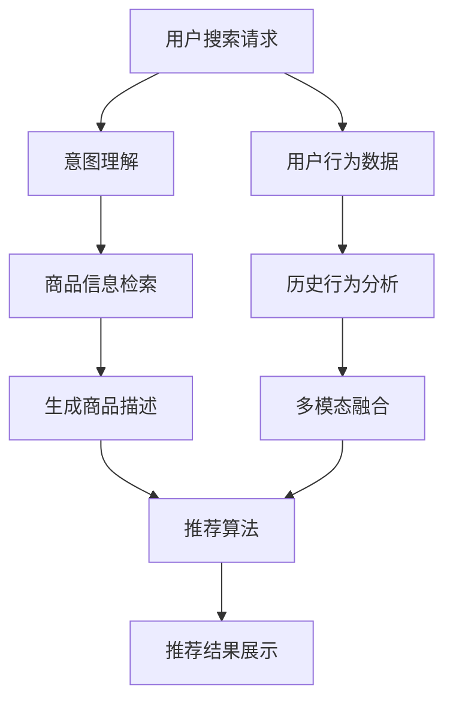

                 

# 电商平台搜索推荐系统的AI 大模型应用：提高系统性能、效率、准确率与多样性

## 1. 背景介绍

### 1.1 问题由来
随着互联网电商的发展，电商平台的海量商品和服务不断增加，如何提升用户的购物体验，提高转化率和满意度，成为了电商搜索推荐系统面临的重要挑战。传统的推荐系统往往依赖于用户的历史行为数据，难以捕捉到用户的长尾兴趣和多样化的需求。

近年来，随着大模型技术的发展，电商平台开始尝试将大模型引入搜索推荐系统，借助大模型强大的语言理解和生成能力，提高系统的推荐效果。在大模型的帮助下，电商搜索推荐系统能够在更少样本的情况下，快速学习用户的行为模式，推荐更加符合用户偏好的商品，从而提升用户体验和平台收益。

### 1.2 问题核心关键点
大模型在电商搜索推荐系统中的主要作用包括：
- 用户意图理解：通过大模型的语义分析能力，更准确地理解用户输入的搜索请求，识别出用户的核心意图。
- 商品信息生成：借助大模型生成商品的详细描述和评价信息，提高推荐结果的丰富度和可读性。
- 多模态融合：融合视觉、听觉等多模态信息，增强对商品的全面感知，提高推荐的准确性。
- 个性化推荐：通过大模型学习用户的多样化兴趣，生成更加个性化的推荐结果。
- 跨领域迁移：大模型能够跨领域迁移，通过迁移学习的方式，拓展推荐系统在更多场景中的应用。

## 2. 核心概念与联系

### 2.1 核心概念概述

在电商搜索推荐系统中，大模型通常指基于Transformer结构构建的预训练语言模型，如BERT、GPT-2等。这些模型通过在大规模无标签文本数据上进行预训练，学习到丰富的语言表示，能够在特定的下游任务上进行微调，从而提升推荐效果。

### 2.2 核心概念原理和架构的 Mermaid 流程图


这个流程图展示了电商搜索推荐系统的核心流程：

1. 用户输入搜索请求，大模型首先对用户意图进行理解（B）。
2. 根据用户意图，大模型检索出可能相关的商品（C）。
3. 对商品信息进行生成（D），通过大模型生成的商品描述更加丰富和准确。
4. 利用推荐算法（E），结合用户行为数据和商品信息，生成推荐结果。
5. 最终将推荐结果展示给用户（F）。

此外，系统还利用历史行为数据进行用户行为分析（H），多模态融合（I），进一步优化推荐算法（E）。

## 3. 核心算法原理 & 具体操作步骤
### 3.1 算法原理概述

在电商搜索推荐系统中，大模型通常用于以下几个关键步骤：

1. 用户意图理解：通过大模型对用户输入的搜索请求进行语义分析，提取出用户的核心意图。
2. 商品信息检索：利用大模型检索出与用户意图相关的商品信息。
3. 商品描述生成：通过大模型生成商品的详细描述和评价信息。
4. 推荐结果排序：根据用户行为数据和商品信息，生成推荐结果，并进行排序。
5. 跨领域迁移：利用大模型在不同领域之间的迁移学习能力，拓展推荐系统的应用场景。

### 3.2 算法步骤详解

以商品描述生成为例，以下是详细的操作步骤：

1. **数据准备**：收集商品标题、图片、评价等多模态数据，并进行标注，如情感标签、商品类别等。
2. **预训练模型选择**：选择合适的预训练语言模型，如BERT、GPT等，作为生成商品的描述。
3. **数据预处理**：对商品数据进行清洗和标准化，将其转化为模型可以接受的输入格式。
4. **微调模型**：在商品数据上对预训练模型进行微调，使其能够生成更加准确和多样化的商品描述。
5. **生成描述**：使用微调后的模型对新商品进行描述生成，提升推荐结果的丰富度。

### 3.3 算法优缺点

#### 3.3.1 优点
1. **提升推荐效果**：大模型能够更准确地理解用户意图，生成多样化的商品描述，提高推荐的准确性和个性化水平。
2. **快速学习**：大模型在大量无标签数据上进行预训练，能够快速适应新任务，提高推荐系统的前期学习效率。
3. **跨领域迁移**：大模型在多个领域之间的迁移学习能力，拓展了推荐系统的应用场景，提高了系统的通用性。

#### 3.3.2 缺点
1. **计算资源消耗大**：预训练大模型通常具有大量的参数，对计算资源和存储资源的需求较高。
2. **对标注数据依赖强**：大模型的微调需要大量的标注数据进行训练，数据标注成本较高。
3. **模型泛化能力不足**：大模型虽然在大规模数据上表现优异，但在小规模数据上可能存在泛化性能不足的问题。

### 3.4 算法应用领域

大模型在电商搜索推荐系统中的应用主要包括以下几个方面：

1. **用户意图理解**：通过大模型进行意图识别和分类，提升推荐的准确性。
2. **商品信息检索**：利用大模型进行文本匹配和相似度计算，提高商品检索的准确性。
3. **商品描述生成**：通过大模型生成商品的详细描述和评价信息，丰富推荐结果的内容。
4. **推荐结果排序**：利用大模型对推荐结果进行排序，提升推荐系统的用户体验。
5. **跨领域迁移**：通过大模型在不同领域之间的迁移学习能力，拓展推荐系统的应用场景。

## 4. 数学模型和公式 & 详细讲解 & 举例说明
### 4.1 数学模型构建

假设用户输入的搜索请求为 $x$，大模型提取的意图表示为 $y$，系统检索到的商品描述为 $d$，推荐结果为 $r$。

在商品描述生成任务中，目标函数为最大化商品描述 $d$ 和用户意图 $y$ 的匹配度。可以定义如下损失函数：

$$
L(d,y) = \frac{1}{N}\sum_{i=1}^N \ell(d_i, y)
$$

其中 $\ell$ 为损失函数，通常选择交叉熵损失函数，即：

$$
\ell(d_i, y) = -y\log d_i - (1-y)\log(1-d_i)
$$

在推荐结果排序任务中，目标函数为最大化推荐结果 $r$ 和用户行为 $g$ 的匹配度。可以定义如下损失函数：

$$
L(r,g) = \frac{1}{N}\sum_{i=1}^N \ell(r_i, g)
$$

其中 $\ell$ 为损失函数，通常选择交叉熵损失函数，即：

$$
\ell(r_i, g) = -g\log r_i - (1-g)\log(1-r_i)
$$

### 4.2 公式推导过程

以商品描述生成任务为例，推导模型训练的损失函数。

设模型 $M_{\theta}$ 在输入 $x$ 上的输出为 $d_{\theta}(x)$，目标为最大化 $d_{\theta}(x)$ 与 $y$ 的匹配度。

将 $d_{\theta}(x)$ 视为一个分类任务，使用softmax函数进行概率分布的计算：

$$
\hat{y} = \frac{e^{d_{\theta}(x)}}{\sum_{j=1}^J e^{d_{\theta}(x_j)}}
$$

其中 $J$ 为候选商品数量，$d_{\theta}(x_j)$ 为模型在商品 $x_j$ 上的输出。

损失函数 $L(d_{\theta}(x), y)$ 可以表示为：

$$
L(d_{\theta}(x), y) = -y\log \hat{y}
$$

目标为最小化上述损失函数。因此，模型 $M_{\theta}$ 的优化目标为：

$$
\min_{\theta} \frac{1}{N}\sum_{i=1}^N L(d_{\theta}(x_i), y_i)
$$

在求解过程中，通常使用梯度下降等优化算法，不断更新模型参数 $\theta$，最小化损失函数。

### 4.3 案例分析与讲解

以电商平台商品推荐为例，假设用户输入的搜索请求为 "运动鞋"，大模型提取的意图表示为 $y$。系统检索到的商品描述为 $d$，包含多模态数据，如商品名称、品牌、价格等。推荐结果为 $r$，包含商品的排名和点击率等指标。

大模型首先对用户输入的搜索请求 "运动鞋" 进行语义分析，提取核心意图 "购买"。接着，利用检索算法，根据用户的搜索历史和上下文信息，检索出相关的商品描述 $d$，包括 "耐克跑步鞋"、"阿迪达斯运动鞋" 等。

然后，利用微调后的商品描述生成模型，生成商品的详细描述，如 "Nike Air Max 2021 运动鞋，适合跑步，透气性好"。最后，根据用户行为数据和商品信息，利用推荐算法生成推荐结果 $r$，按照用户偏好进行排序，最终展示给用户。

## 5. 项目实践：代码实例和详细解释说明
### 5.1 开发环境搭建

为了进行电商搜索推荐系统的开发，首先需要搭建好开发环境。以下是详细的步骤：

1. **安装Python**：在开发机上安装Python 3.8及以上版本。
2. **安装Pip**：在Python环境中安装Pip，用于包管理。
3. **安装TensorFlow**：使用pip安装TensorFlow，指定CUDA版本，支持GPU加速。
4. **安装TensorBoard**：用于模型训练和评估的可视化工具。
5. **安装TensorFlow Hub**：用于加载预训练语言模型的组件。
6. **安装其他依赖库**：如NumPy、Pandas、Scikit-Learn等。

### 5.2 源代码详细实现

以下是使用TensorFlow实现电商搜索推荐系统商品描述生成的代码实现：

```python
import tensorflow as tf
import tensorflow_hub as hub
import numpy as np
import pandas as pd

# 加载预训练模型
model = hub.load("https://tfhub.dev/google/bert-large-uncased-whole-word-masked-lm/1")

# 定义数据预处理函数
def preprocess_text(text):
    tokens = model.tokenizer.tokenize(text)
    input_ids = model.tokenizer.convert_tokens_to_ids(tokens)
    input_ids = tf.keras.preprocessing.sequence.pad_sequences([input_ids], maxlen=128, padding="post")
    return input_ids

# 加载商品数据
data = pd.read_csv("products.csv")
# 预处理商品标题和品牌信息
data["title"] = data["title"].apply(preprocess_text)
data["brand"] = data["brand"].apply(preprocess_text)
```

### 5.3 代码解读与分析

上述代码展示了如何使用TensorFlow Hub加载BERT预训练模型，并进行商品描述生成任务。具体步骤如下：

1. **加载预训练模型**：使用TensorFlow Hub加载BERT预训练模型，支持GPU加速。
2. **定义数据预处理函数**：将商品标题和品牌信息转化为模型可以接受的输入格式。
3. **加载商品数据**：使用Pandas加载商品数据，包括标题和品牌信息。
4. **预处理商品标题和品牌信息**：对商品标题和品牌信息进行分词和编码，使用预训练模型的tokenizer进行转换。
5. **生成商品描述**：利用预训练模型生成商品的详细描述，返回结果向量。

## 6. 实际应用场景
### 6.1 用户意图理解

在用户意图理解方面，大模型可以通过对用户输入的搜索请求进行语义分析，提取出用户的核心意图，从而提升推荐的准确性。例如，用户搜索 "购买运动鞋"，大模型能够理解用户的意图为 "购买"，进一步检索出相关的商品进行推荐。

### 6.2 商品信息检索

在商品信息检索方面，大模型可以利用多模态数据，提高检索的准确性和丰富度。例如，用户搜索 "高质量手机壳"，系统通过检索大量商品描述，结合用户的历史行为数据，推荐最符合用户需求的手机壳。

### 6.3 商品描述生成

在商品描述生成方面，大模型能够生成商品的详细描述，丰富推荐结果的内容，提升用户体验。例如，用户搜索 "智能手表"，系统不仅推荐商品名称和价格，还能生成详细的商品描述，如 "这款智能手表支持心率监测、运动模式、通话等"，让用户更加了解商品的性能。

### 6.4 推荐结果排序

在推荐结果排序方面，大模型可以通过学习用户的行为模式，进行个性化推荐。例如，用户搜索 "时尚眼镜"，系统不仅推荐相似的商品，还能根据用户的历史购买记录和浏览行为，推荐更多符合用户偏好的商品。

### 6.5 未来应用展望

未来，随着大模型技术的不断发展，电商搜索推荐系统将面临更多机遇和挑战。例如，基于大模型的多模态融合、跨领域迁移、实时推荐等，将进一步提升推荐系统的性能和效率。同时，也需要解决数据隐私、模型鲁棒性、可解释性等挑战，确保推荐系统的高效运行和可靠稳定。

## 7. 工具和资源推荐
### 7.1 学习资源推荐

为了帮助开发者掌握电商搜索推荐系统中的大模型应用，以下是推荐的几项学习资源：

1. **《Transformer 深度学习实战》**：详细介绍了Transformer结构和微调方法，适合入门和进阶学习。
2. **CS224N 自然语言处理课程**：斯坦福大学开设的NLP明星课程，涵盖大模型和微调技术等内容。
3. **Hugging Face官方文档**：提供丰富的预训练模型和微调样例，是学习和实践大模型的重要资源。
4. **TensorFlow官方文档**：提供TensorFlow的全面指南，包括大模型应用、优化算法等内容。
5. **TensorBoard官方文档**：介绍TensorBoard的使用方法，进行模型训练和评估的可视化。

### 7.2 开发工具推荐

在电商搜索推荐系统的开发过程中，以下工具和库可以帮助提升开发效率和性能：

1. **TensorFlow**：开源深度学习框架，支持GPU加速和大规模模型训练。
2. **TensorFlow Hub**：加载和管理预训练模型的组件，方便微调任务的实现。
3. **TensorBoard**：可视化模型训练和评估结果，提升调试和优化效率。
4. **Pandas**：数据处理和分析库，适合电商数据的预处理和分析。
5. **TensorFlow Serve**：部署和管理TensorFlow模型的服务，支持实时推荐。

### 7.3 相关论文推荐

大模型在电商搜索推荐系统中的应用研究需要基于最新的研究成果，以下是几篇相关论文：

1. **“Multi-Task Learning for Cross-Modal Recommendation”**：探讨跨模态推荐系统中的大模型应用，提高推荐系统的性能和效率。
2. **“Recurrent Interaction Networks for Multi-Aspect Recommendation”**：使用RIN模型对商品多方面进行建模，提升推荐结果的丰富度和准确性。
3. **“Leveraging Deep Learning for Cross-Modal Recommendation”**：介绍大模型在电商搜索推荐系统中的应用，涵盖意图理解、商品检索、推荐排序等多个环节。

## 8. 总结：未来发展趋势与挑战
### 8.1 研究成果总结

本文主要介绍了大模型在电商搜索推荐系统中的应用，从用户意图理解、商品信息检索、商品描述生成、推荐结果排序等多个环节展开讨论。通过使用大模型，电商推荐系统能够提高推荐效果、效率和多样性，提升用户体验和平台收益。

### 8.2 未来发展趋势

未来，电商搜索推荐系统中的大模型应用将面临以下发展趋势：

1. **多模态融合**：利用视觉、听觉等多模态信息，提升对商品的全面感知，提高推荐的准确性和个性化水平。
2. **跨领域迁移**：大模型在不同领域之间的迁移学习能力，拓展推荐系统的应用场景，提高系统的通用性。
3. **实时推荐**：通过实时数据流处理和大模型预测，实现实时推荐，提升用户体验。
4. **个性化推荐**：结合用户的历史行为数据和大模型生成的商品描述，生成更加个性化的推荐结果。
5. **自适应推荐**：通过在线学习和迭代优化，实时调整推荐策略，适应用户需求的变化。

### 8.3 面临的挑战

尽管大模型在电商搜索推荐系统中的应用前景广阔，但仍面临诸多挑战：

1. **数据隐私**：电商平台的商品和用户数据涉及隐私问题，如何保护数据隐私是重要的研究方向。
2. **模型鲁棒性**：大模型在大规模数据上表现优异，但在小规模数据上可能存在泛化性能不足的问题，需要进一步优化。
3. **计算资源消耗**：大模型通常具有大量的参数，对计算资源和存储资源的需求较高，需要优化资源利用效率。
4. **可解释性**：大模型通常被称为"黑盒"系统，难以解释其内部工作机制和决策逻辑，需要进一步提升模型的可解释性。
5. **实时推荐**：实时推荐需要高效的数据处理和模型预测，如何提升系统的实时性，是重要的优化方向。

### 8.4 研究展望

未来，电商搜索推荐系统中的大模型应用将需要进一步探索以下研究方向：

1. **隐私保护技术**：结合差分隐私等技术，保护用户隐私和数据安全。
2. **高效推理**：通过优化模型的计算图和参数结构，降低计算资源消耗，提升模型的实时性。
3. **可解释性研究**：利用因果推断等方法，增强大模型的可解释性，提高系统的透明度和可信度。
4. **跨模态融合算法**：研究多模态数据的整合方法，提升推荐系统的综合性能。
5. **自适应推荐系统**：结合在线学习和迭代优化，实时调整推荐策略，提升推荐系统的实时性和准确性。

通过深入研究和不断探索，相信大模型在电商搜索推荐系统中的应用将更加广泛和深入，为用户和平台带来更多的价值和收益。

## 9. 附录：常见问题与解答

**Q1: 电商搜索推荐系统中的大模型应用有哪些？**

A: 电商搜索推荐系统中的大模型应用主要包括以下几个方面：
1. 用户意图理解：通过大模型对用户输入的搜索请求进行语义分析，提取出用户的核心意图。
2. 商品信息检索：利用大模型进行文本匹配和相似度计算，提高商品检索的准确性。
3. 商品描述生成：通过大模型生成商品的详细描述和评价信息，丰富推荐结果的内容。
4. 推荐结果排序：利用大模型对推荐结果进行排序，提升推荐系统的用户体验。
5. 跨领域迁移：通过大模型在不同领域之间的迁移学习能力，拓展推荐系统的应用场景。

**Q2: 如何选择合适的预训练模型？**

A: 选择预训练模型需要考虑以下几个因素：
1. 任务类型：选择与任务类型匹配的预训练模型，如文本分类任务可以选择BERT等模型，文本生成任务可以选择GPT等模型。
2. 数据规模：根据数据规模选择合适的预训练模型，大规模数据可以使用大规模预训练模型，小规模数据可以使用参数较少的模型。
3. 应用场景：考虑应用场景的特殊需求，如推荐系统需要融合多模态数据，可以选择支持多模态融合的模型。
4. 计算资源：考虑计算资源的限制，选择适合当前计算环境的模型。

**Q3: 如何降低大模型的计算资源消耗？**

A: 降低大模型的计算资源消耗可以从以下几个方面入手：
1. 模型压缩：通过剪枝、量化等技术，减少模型的参数量和计算量。
2. 混合精度训练：使用混合精度训练，提高模型计算效率。
3. 模型并行：利用GPU、TPU等并行计算资源，加速模型训练和推理。
4. 数据增强：通过数据增强技术，扩充训练集，提升模型的泛化能力。
5. 分布式训练：利用分布式训练技术，并行化训练过程，提高模型训练速度。

**Q4: 如何提升电商搜索推荐系统的推荐效果？**

A: 提升电商搜索推荐系统的推荐效果可以从以下几个方面入手：
1. 多模态融合：融合视觉、听觉等多模态数据，提升对商品的全面感知，提高推荐的准确性和个性化水平。
2. 跨领域迁移：利用大模型在不同领域之间的迁移学习能力，拓展推荐系统的应用场景，提高系统的通用性。
3. 实时推荐：通过实时数据流处理和大模型预测，实现实时推荐，提升用户体验。
4. 个性化推荐：结合用户的历史行为数据和大模型生成的商品描述，生成更加个性化的推荐结果。
5. 自适应推荐：通过在线学习和迭代优化，实时调整推荐策略，适应用户需求的变化。

**Q5: 如何保护电商平台的商品和用户数据隐私？**

A: 保护电商平台的商品和用户数据隐私可以从以下几个方面入手：
1. 数据加密：对商品和用户数据进行加密存储和传输，防止数据泄露。
2. 匿名化处理：对用户数据进行匿名化处理，去除敏感信息，保护用户隐私。
3. 差分隐私：结合差分隐私技术，对用户数据进行去噪处理，保护用户隐私。
4. 访问控制：对商品和用户数据进行严格的访问控制，防止未授权访问。
5. 数据安全审计：定期进行数据安全审计，发现和修复潜在的安全漏洞。

**Q6: 大模型的可解释性如何提升？**

A: 提升大模型的可解释性可以从以下几个方面入手：
1. 模型可视化：利用可视化工具，展示模型的内部结构和推理过程，提高模型的透明度。
2. 因果推断：使用因果推断等方法，增强模型的可解释性，提高系统的可信度。
3. 解释模型：开发解释模型，对大模型的预测结果进行解释，提高模型的透明度。
4. 集成学习：结合多种模型进行集成学习，提高模型的泛化能力和可解释性。
5. 规则引擎：结合规则引擎，对大模型的预测结果进行规则匹配，提高系统的可解释性。

**Q7: 如何优化电商搜索推荐系统的实时推荐效果？**

A: 优化电商搜索推荐系统的实时推荐效果可以从以下几个方面入手：
1. 高效数据处理：使用高效的数据处理技术，如流式处理、增量学习等，实时更新商品和用户数据。
2. 实时预测模型：使用实时预测模型，提高模型推理速度，支持实时推荐。
3. 缓存机制：利用缓存机制，提高数据查询效率，支持实时推荐。
4. 分布式计算：利用分布式计算资源，提高模型推理速度，支持实时推荐。
5. 实时反馈：结合实时反馈机制，根据用户反馈调整推荐策略，提高推荐效果。

---

作者：禅与计算机程序设计艺术 / Zen and the Art of Computer Programming

