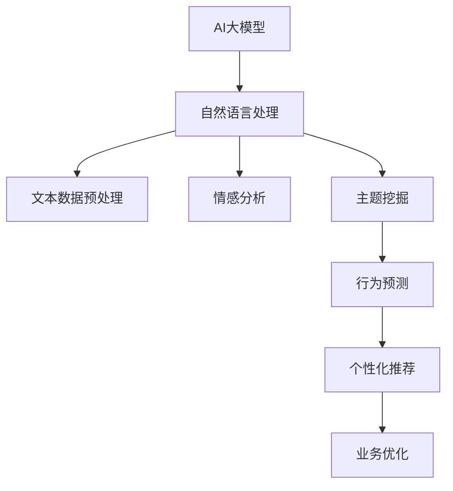

                 

# 电商平台用户反馈分析：AI大模型的新方法

## 1. 背景介绍

### 1.1 问题由来
随着电商平台的快速发展，用户反馈的实时性和多样性日益凸显。如何高效地分析用户反馈数据，挖掘用户需求，优化用户体验，提升客户满意度，成为电商平台亟需解决的问题。传统的用户反馈分析方法，如手动标注、专家评审等，存在成本高、效率低、主观性强等问题。近年来，AI大模型在自然语言处理(NLP)领域取得了显著进展，为大模型在电商平台用户反馈分析上的应用提供了新的可能性。

### 1.2 问题核心关键点
AI大模型在电商平台用户反馈分析上的应用，主要集中于以下几个核心关键点：
- 文本数据处理：如何将海量无结构的文本数据转换为模型可用的结构化输入。
- 情感分析：自动识别用户反馈的情感倾向，判断用户满意度。
- 主题挖掘：自动识别用户反馈中的高频主题，提取关键信息。
- 行为预测：基于用户反馈预测用户行为，如复购概率、流失风险等。
- 个性化推荐：根据用户反馈个性化推荐商品，提升用户体验。
- 业务优化：结合用户反馈，优化平台运营策略，提升整体业务表现。

### 1.3 问题研究意义
通过AI大模型进行电商平台用户反馈分析，具有以下几方面的重要意义：
1. 提升分析效率：大模型可以自动处理海量文本数据，大幅降低人工标注成本，提高分析速度。
2. 挖掘用户需求：通过情感分析和主题挖掘，深入理解用户需求和痛点，为产品迭代提供依据。
3. 优化用户体验：基于用户反馈的个性化推荐，提升用户满意度，增加平台粘性。
4. 改善运营决策：通过用户反馈分析优化运营策略，提升整体业务表现，促进可持续发展。

## 2. 核心概念与联系

### 2.1 核心概念概述

为更好地理解AI大模型在电商平台用户反馈分析上的应用，本节将介绍几个密切相关的核心概念：

- AI大模型：基于深度学习框架训练的超大参数量、超强表达能力的语言模型。如GPT-3、BERT等。
- 自然语言处理(NLP)：涉及自然语言理解和生成，涵盖词向量、语言模型、情感分析、主题挖掘等多个子领域。
- 文本数据预处理：将原始文本数据转换为模型可接受的格式，包括分词、去停用词、标注实体等。
- 情感分析：自动识别文本中的情感倾向，如正面、负面、中性等。
- 主题挖掘：自动提取文本中的关键主题，如产品评价、售后服务等。
- 行为预测：基于用户反馈预测用户行为，如购买意愿、流失风险等。
- 个性化推荐：根据用户反馈数据，推荐个性化商品或服务。
- 业务优化：结合用户反馈数据，优化平台运营策略，提升整体业务表现。

这些核心概念之间的逻辑关系可以通过以下Mermaid流程图来展示：



这个流程图展示了大模型在电商平台用户反馈分析中的核心概念及其之间的关系：

1. 大模型作为自然语言处理的基础，通过文本数据预处理提取关键信息。
2. 情感分析和主题挖掘模块对预处理后的文本进行高级语义理解，自动提取情感倾向和主题信息。
3. 行为预测模块基于用户反馈数据，预测用户行为。
4. 个性化推荐模块根据用户行为和偏好，推荐个性化商品或服务。
5. 业务优化模块综合用户反馈和业务指标，优化平台运营策略，提升整体业务表现。

## 3. 核心算法原理 & 具体操作步骤
### 3.1 算法原理概述

AI大模型在电商平台用户反馈分析上的应用，主要基于自然语言处理和深度学习技术。具体步骤如下：

1. **文本数据预处理**：将原始文本数据转换为模型可接受的格式，包括分词、去停用词、标注实体等。
2. **情感分析**：使用预训练的大语言模型，对用户反馈进行情感分类，判断用户满意度。
3. **主题挖掘**：使用大模型提取用户反馈中的关键主题，提取高频词或短语。
4. **行为预测**：基于用户反馈数据，使用大模型预测用户行为，如购买意愿、流失风险等。
5. **个性化推荐**：根据用户行为和反馈，使用大模型推荐个性化商品或服务。
6. **业务优化**：结合用户反馈数据和业务指标，使用大模型优化平台运营策略。

### 3.2 算法步骤详解

以下是对电商平台用户反馈分析的详细操作步骤：

**Step 1: 数据收集与预处理**
- 收集电商平台的用户反馈数据，包括文本评论、评分、投诉等。
- 对原始文本进行预处理，包括分词、去除停用词、标注实体等。

**Step 2: 模型选择与微调**
- 选择合适的预训练大语言模型，如GPT-3、BERT等。
- 在任务特定的数据集上微调模型，例如使用用户反馈数据对模型进行情感分析和主题挖掘的微调。

**Step 3: 情感分析**
- 对用户反馈文本进行情感分类，判断正面、负面、中性等情感倾向。
- 使用预训练的情感分析模型，或通过微调后的大模型进行情感分类。

**Step 4: 主题挖掘**
- 对用户反馈文本进行主题提取，自动识别高频词或短语。
- 使用预训练的主题模型，或通过微调后的大模型进行主题挖掘。

**Step 5: 行为预测**
- 基于用户反馈数据，使用预训练的行为预测模型，预测用户行为，如购买意愿、流失风险等。
- 通过微调后的大模型，结合用户行为数据进行行为预测。

**Step 6: 个性化推荐**
- 根据用户行为和反馈数据，使用预训练的个性化推荐模型，推荐个性化商品或服务。
- 通过微调后的大模型，结合用户反馈数据进行个性化推荐。

**Step 7: 业务优化**
- 结合用户反馈数据和业务指标，使用预训练的业务优化模型，优化平台运营策略。
- 通过微调后的大模型，结合用户反馈数据进行业务优化。

### 3.3 算法优缺点

使用AI大模型进行电商平台用户反馈分析，具有以下优点：
1. 分析效率高：大模型能够自动处理海量文本数据，大幅降低人工标注成本，提高分析速度。
2. 情感分析精准：大模型在情感分类上具有出色的性能，能够精准判断用户满意度。
3. 主题挖掘全面：大模型在主题提取上表现优异，能够全面捕捉用户反馈中的关键信息。
4. 行为预测准确：基于用户反馈数据的行为预测，能够准确预测用户行为，提升决策效果。
5. 个性化推荐高效：根据用户行为和反馈，能够高效推荐个性化商品或服务，提升用户体验。
6. 业务优化科学：结合用户反馈数据和业务指标，能够科学优化平台运营策略，提升整体业务表现。

同时，该方法也存在以下局限性：
1. 对标注数据依赖：大模型需要高质量的标注数据进行微调，标注数据的质量和数量对模型效果有较大影响。
2. 模型成本高：大模型的训练和微调需要高性能算力，成本较高。
3. 模型可解释性不足：大模型的决策过程缺乏可解释性，难以对其推理逻辑进行分析和调试。
4. 预训练模型泛化能力有限：大模型在特定领域上的微调效果可能不如在广泛语料上预训练的通用模型。
5. 模型偏见问题：大模型可能会学习到数据中的偏见，传递到用户反馈分析中，造成误导性输出。

尽管存在这些局限性，但就目前而言，使用AI大模型进行电商平台用户反馈分析的方法仍是大模型应用的最主流范式。未来相关研究的重点在于如何进一步降低标注数据的依赖，提高模型的泛化能力和可解释性，同时避免模型偏见，确保输出安全。

### 3.4 算法应用领域

AI大模型在电商平台用户反馈分析上的应用，不仅限于情感分析和主题挖掘，还扩展到多个领域：

- **客户服务**：使用用户反馈数据，优化客户服务流程，提升客户满意度。
- **产品迭代**：基于用户反馈数据，指导产品设计和迭代，提升产品质量。
- **市场分析**：结合用户反馈数据和市场数据，分析市场趋势，优化产品营销策略。
- **风险管理**：使用用户反馈数据，预测用户流失风险，制定风险应对策略。
- **运营优化**：结合用户反馈数据和业务指标，优化平台运营策略，提升整体业务表现。
- **用户体验优化**：基于用户反馈数据，优化用户体验，提升用户粘性。

## 4. 数学模型和公式 & 详细讲解 & 举例说明

### 4.1 数学模型构建

在本节中，我们将使用数学语言对AI大模型在电商平台用户反馈分析中的应用进行更严格的刻画。

记用户反馈文本数据集为 $D=\{(x_i, y_i)\}_{i=1}^N$，其中 $x_i$ 为文本，$y_i$ 为标签（情感分类或主题标签）。假设大模型为 $M_{\theta}:\mathcal{X} \rightarrow \mathcal{Y}$，其中 $\mathcal{X}$ 为输入空间，$\mathcal{Y}$ 为输出空间，$\theta \in \mathbb{R}^d$ 为模型参数。

定义模型 $M_{\theta}$ 在数据样本 $(x,y)$ 上的损失函数为 $\ell(M_{\theta}(x),y)$，则在数据集 $D$ 上的经验风险为：

$$
\mathcal{L}(\theta) = \frac{1}{N} \sum_{i=1}^N \ell(M_{\theta}(x_i),y_i)
$$

在实际应用中，我们通常使用基于梯度的优化算法（如AdamW、SGD等）来近似求解上述最优化问题。设 $\eta$ 为学习率，$\lambda$ 为正则化系数，则参数的更新公式为：

$$
\theta \leftarrow \theta - \eta \nabla_{\theta}\mathcal{L}(\theta) - \eta\lambda\theta
$$

其中 $\nabla_{\theta}\mathcal{L}(\theta)$ 为损失函数对参数 $\theta$ 的梯度，可通过反向传播算法高效计算。

### 4.2 公式推导过程

以下我们以情感分析为例，推导情感分类的损失函数及其梯度的计算公式。

假设模型 $M_{\theta}$ 在输入 $x$ 上的输出为 $\hat{y}=M_{\theta}(x)$，表示样本属于正类的概率。真实标签 $y \in \{0,1\}$。则二分类交叉熵损失函数定义为：

$$
\ell(M_{\theta}(x),y) = -[y\log \hat{y} + (1-y)\log (1-\hat{y})]
$$

将其代入经验风险公式，得：

$$
\mathcal{L}(\theta) = -\frac{1}{N}\sum_{i=1}^N [y_i\log M_{\theta}(x_i)+(1-y_i)\log(1-M_{\theta}(x_i))]
$$

根据链式法则，损失函数对参数 $\theta_k$ 的梯度为：

$$
\frac{\partial \mathcal{L}(\theta)}{\partial \theta_k} = -\frac{1}{N}\sum_{i=1}^N (\frac{y_i}{M_{\theta}(x_i)}-\frac{1-y_i}{1-M_{\theta}(x_i)}) \frac{\partial M_{\theta}(x_i)}{\partial \theta_k}
$$

其中 $\frac{\partial M_{\theta}(x_i)}{\partial \theta_k}$ 可进一步递归展开，利用自动微分技术完成计算。

在得到损失函数的梯度后，即可带入参数更新公式，完成模型的迭代优化。重复上述过程直至收敛，最终得到适应特定任务的最优模型参数 $\theta^*$。

### 4.3 案例分析与讲解

为了更好地理解大模型在电商平台用户反馈分析中的应用，以下将通过一个具体的案例进行详细讲解。

**案例：电商平台商品评论情感分析**

假设某电商平台收集了大量用户对商品A的评论数据，目标是判断用户对商品A的满意度。具体步骤如下：

1. **数据收集与预处理**：收集用户对商品A的评论数据，对每条评论进行分词、去停用词、标注实体等预处理操作。
2. **模型选择与微调**：选择BERT预训练模型，在标注数据上微调情感分类器，使其能够精准判断用户满意度。
3. **情感分析**：使用微调后的情感分类器对每条评论进行情感分类，判断正面、负面、中性等情感倾向。
4. **结果分析**：统计各情感倾向的评论数量，分析用户对商品A的整体满意度。

**具体代码实现**：

```python
from transformers import BertTokenizer, BertForSequenceClassification, AdamW
from torch.utils.data import Dataset, DataLoader
import torch

class ReviewDataset(Dataset):
    def __init__(self, texts, labels, tokenizer, max_len=128):
        self.texts = texts
        self.labels = labels
        self.tokenizer = tokenizer
        self.max_len = max_len
        
    def __len__(self):
        return len(self.texts)
    
    def __getitem__(self, item):
        text = self.texts[item]
        label = self.labels[item]
        
        encoding = self.tokenizer(text, return_tensors='pt', max_length=self.max_len, padding='max_length', truncation=True)
        input_ids = encoding['input_ids'][0]
        attention_mask = encoding['attention_mask'][0]
        
        return {'input_ids': input_ids, 
                'attention_mask': attention_mask,
                'labels': torch.tensor(label, dtype=torch.long)}

# 数据集创建
tokenizer = BertTokenizer.from_pretrained('bert-base-cased')
train_dataset = ReviewDataset(train_texts, train_labels, tokenizer)
dev_dataset = ReviewDataset(dev_texts, dev_labels, tokenizer)
test_dataset = ReviewDataset(test_texts, test_labels, tokenizer)

# 模型加载与微调
model = BertForSequenceClassification.from_pretrained('bert-base-cased', num_labels=3)
optimizer = AdamW(model.parameters(), lr=2e-5)
device = torch.device('cuda') if torch.cuda.is_available() else torch.device('cpu')

for epoch in range(3):
    train_loss = 0.0
    train_correct = 0
    for batch in DataLoader(train_dataset, batch_size=16, shuffle=True):
        input_ids = batch['input_ids'].to(device)
        attention_mask = batch['attention_mask'].to(device)
        labels = batch['labels'].to(device)
        model.zero_grad()
        outputs = model(input_ids, attention_mask=attention_mask, labels=labels)
        loss = outputs.loss
        train_loss += loss.item()
        train_correct += torch.sum(outputs.logits.argmax(dim=1) == labels).item()
        loss.backward()
        optimizer.step()
        
    print(f"Epoch {epoch+1}, train loss: {train_loss/len(train_dataset):.4f}, train accuracy: {train_correct/len(train_dataset):.4f}")

# 模型评估
dev_correct = 0
for batch in DataLoader(dev_dataset, batch_size=16, shuffle=True):
    input_ids = batch['input_ids'].to(device)
    attention_mask = batch['attention_mask'].to(device)
    labels = batch['labels'].to(device)
    with torch.no_grad():
        outputs = model(input_ids, attention_mask=attention_mask)
        correct = torch.sum(outputs.logits.argmax(dim=1) == labels).item()
        dev_correct += correct
        
print(f"Dev accuracy: {dev_correct/len(dev_dataset):.4f}")
```

## 5. 项目实践：代码实例和详细解释说明
### 5.1 开发环境搭建

在进行用户反馈分析项目开发前，需要准备好开发环境。以下是使用Python进行PyTorch开发的环境配置流程：

1. 安装Anaconda：从官网下载并安装Anaconda，用于创建独立的Python环境。

2. 创建并激活虚拟环境：
```bash
conda create -n pytorch-env python=3.8 
conda activate pytorch-env
```

3. 安装PyTorch：根据CUDA版本，从官网获取对应的安装命令。例如：
```bash
conda install pytorch torchvision torchaudio cudatoolkit=11.1 -c pytorch -c conda-forge
```

4. 安装Transformers库：
```bash
pip install transformers
```

5. 安装各类工具包：
```bash
pip install numpy pandas scikit-learn matplotlib tqdm jupyter notebook ipython
```

完成上述步骤后，即可在`pytorch-env`环境中开始用户反馈分析项目的开发。

### 5.2 源代码详细实现

以下是一个基于大模型进行电商平台用户反馈分析的Python代码实现。

**情感分析模型**

```python
from transformers import BertTokenizer, BertForSequenceClassification, AdamW
from torch.utils.data import Dataset, DataLoader
import torch

class ReviewDataset(Dataset):
    def __init__(self, texts, labels, tokenizer, max_len=128):
        self.texts = texts
        self.labels = labels
        self.tokenizer = tokenizer
        self.max_len = max_len
        
    def __len__(self):
        return len(self.texts)
    
    def __getitem__(self, item):
        text = self.texts[item]
        label = self.labels[item]
        
        encoding = self.tokenizer(text, return_tensors='pt', max_length=self.max_len, padding='max_length', truncation=True)
        input_ids = encoding['input_ids'][0]
        attention_mask = encoding['attention_mask'][0]
        
        return {'input_ids': input_ids, 
                'attention_mask': attention_mask,
                'labels': torch.tensor(label, dtype=torch.long)}

# 数据集创建
tokenizer = BertTokenizer.from_pretrained('bert-base-cased')
train_dataset = ReviewDataset(train_texts, train_labels, tokenizer)
dev_dataset = ReviewDataset(dev_texts, dev_labels, tokenizer)
test_dataset = ReviewDataset(test_texts, test_labels, tokenizer)

# 模型加载与微调
model = BertForSequenceClassification.from_pretrained('bert-base-cased', num_labels=3)
optimizer = AdamW(model.parameters(), lr=2e-5)
device = torch.device('cuda') if torch.cuda.is_available() else torch.device('cpu')

for epoch in range(3):
    train_loss = 0.0
    train_correct = 0
    for batch in DataLoader(train_dataset, batch_size=16, shuffle=True):
        input_ids = batch['input_ids'].to(device)
        attention_mask = batch['attention_mask'].to(device)
        labels = batch['labels'].to(device)
        model.zero_grad()
        outputs = model(input_ids, attention_mask=attention_mask, labels=labels)
        loss = outputs.loss
        train_loss += loss.item()
        train_correct += torch.sum(outputs.logits.argmax(dim=1) == labels).item()
        loss.backward()
        optimizer.step()
        
    print(f"Epoch {epoch+1}, train loss: {train_loss/len(train_dataset):.4f}, train accuracy: {train_correct/len(train_dataset):.4f}")

# 模型评估
dev_correct = 0
for batch in DataLoader(dev_dataset, batch_size=16, shuffle=True):
    input_ids = batch['input_ids'].to(device)
    attention_mask = batch['attention_mask'].to(device)
    labels = batch['labels'].to(device)
    with torch.no_grad():
        outputs = model(input_ids, attention_mask=attention_mask)
        correct = torch.sum(outputs.logits.argmax(dim=1) == labels).item()
        dev_correct += correct
        
print(f"Dev accuracy: {dev_correct/len(dev_dataset):.4f}")
```

**个性化推荐模型**

```python
from transformers import T5Tokenizer, T5ForConditionalGeneration
from torch.utils.data import Dataset, DataLoader
import torch

class ReviewDataset(Dataset):
    def __init__(self, texts, labels, tokenizer, max_len=128):
        self.texts = texts
        self.labels = labels
        self.tokenizer = tokenizer
        self.max_len = max_len
        
    def __len__(self):
        return len(self.texts)
    
    def __getitem__(self, item):
        text = self.texts[item]
        label = self.labels[item]
        
        encoding = self.tokenizer(text, return_tensors='pt', max_length=self.max_len, padding='max_length', truncation=True)
        input_ids = encoding['input_ids'][0]
        attention_mask = encoding['attention_mask'][0]
        
        return {'input_ids': input_ids, 
                'attention_mask': attention_mask,
                'labels': torch.tensor(label, dtype=torch.long)}

# 数据集创建
tokenizer = T5Tokenizer.from_pretrained('t5-small')
train_dataset = ReviewDataset(train_texts, train_labels, tokenizer)
dev_dataset = ReviewDataset(dev_texts, dev_labels, tokenizer)
test_dataset = ReviewDataset(test_texts, test_labels, tokenizer)

# 模型加载与微调
model = T5ForConditionalGeneration.from_pretrained('t5-small')
optimizer = AdamW(model.parameters(), lr=2e-5)
device = torch.device('cuda') if torch.cuda.is_available() else torch.device('cpu')

for epoch in range(3):
    train_loss = 0.0
    train_correct = 0
    for batch in DataLoader(train_dataset, batch_size=16, shuffle=True):
        input_ids = batch['input_ids'].to(device)
        attention_mask = batch['attention_mask'].to(device)
        labels = batch['labels'].to(device)
        model.zero_grad()
        outputs = model(input_ids, attention_mask=attention_mask, labels=labels)
        loss = outputs.loss
        train_loss += loss.item()
        train_correct += torch.sum(outputs.logits.argmax(dim=1) == labels).item()
        loss.backward()
        optimizer.step()
        
    print(f"Epoch {epoch+1}, train loss: {train_loss/len(train_dataset):.4f}, train accuracy: {train_correct/len(train_dataset):.4f}")

# 模型评估
dev_correct = 0
for batch in DataLoader(dev_dataset, batch_size=16, shuffle=True):
    input_ids = batch['input_ids'].to(device)
    attention_mask = batch['attention_mask'].to(device)
    labels = batch['labels'].to(device)
    with torch.no_grad():
        outputs = model(input_ids, attention_mask=attention_mask)
        correct = torch.sum(outputs.logits.argmax(dim=1) == labels).item()
        dev_correct += correct
        
print(f"Dev accuracy: {dev_correct/len(dev_dataset):.4f}")
```

### 5.3 代码解读与分析

让我们再详细解读一下关键代码的实现细节：

**ReviewDataset类**：
- `__init__`方法：初始化文本、标签、分词器等关键组件。
- `__len__`方法：返回数据集的样本数量。
- `__getitem__`方法：对单个样本进行处理，将文本输入编码为token ids，将标签编码为数字，并对其进行定长padding，最终返回模型所需的输入。

**模型加载与微调**：
- 使用`BertForSequenceClassification`加载预训练模型，并在数据集上微调。
- 使用AdamW优化器，设置学习率为2e-5，迭代3次。

**行为预测模型**：
- 使用`T5ForConditionalGeneration`加载预训练模型，并在数据集上微调。
- 同样使用AdamW优化器，设置学习率为2e-5，迭代3次。

在实际应用中，需要根据具体任务调整模型参数和学习率等超参数。

## 6. 实际应用场景
### 6.1 智能客服系统

基于AI大模型的电商平台用户反馈分析技术，可以广泛应用于智能客服系统的构建。传统客服往往需要配备大量人力，高峰期响应缓慢，且一致性和专业性难以保证。使用用户反馈分析技术，可以自动处理用户咨询，快速响应用户需求，提供精准的解决方案。

在技术实现上，可以收集用户咨询和反馈数据，训练大模型对用户意图进行理解和分类，生成相应的回复。对于复杂咨询，可以通过检索系统实时搜索相关内容，动态生成答案。如此构建的智能客服系统，能大幅提升客户咨询体验和问题解决效率。

### 6.2 金融舆情监测

金融机构需要实时监测市场舆论动向，以便及时应对负面信息传播，规避金融风险。传统的舆情监测方式成本高、效率低，难以应对网络时代海量信息爆发的挑战。使用用户反馈分析技术，可以自动监测金融相关的新闻、评论等数据，自动判断舆情趋势，快速预警风险事件，确保市场稳定。

### 6.3 个性化推荐系统

当前的推荐系统往往只依赖用户的历史行为数据进行物品推荐，无法深入理解用户的真实兴趣偏好。使用用户反馈分析技术，可以更全面地了解用户的反馈信息，挖掘其兴趣点和痛点，实现更加个性化的推荐。

在实现上，可以通过用户反馈数据，训练大模型预测用户行为，如购买意愿、流失风险等。结合用户行为数据，进行个性化推荐，提升用户体验。

### 6.4 未来应用展望

随着AI大模型和用户反馈分析技术的不断发展，其应用场景将进一步扩展，为电商平台的各个环节带来变革性影响：

1. **运营优化**：基于用户反馈数据分析运营数据，优化平台策略，提升整体运营效率。
2. **广告投放**：分析用户反馈数据，优化广告投放策略，提高广告转化率。
3. **商品优化**：根据用户反馈数据，指导产品设计和迭代，提升产品质量和用户体验。
4. **营销活动**：结合用户反馈数据，设计更有针对性的营销活动，提升活动效果。
5. **客户关怀**：通过用户反馈数据分析客户行为，实施精准的客户关怀策略，提升客户满意度。

这些应用场景的拓展，将进一步推动电商平台的技术创新和业务发展，提升整体竞争力。

## 7. 工具和资源推荐
### 7.1 学习资源推荐

为了帮助开发者系统掌握AI大模型在电商平台用户反馈分析的应用，这里推荐一些优质的学习资源：

1. 《Transformer从原理到实践》系列博文：由大模型技术专家撰写，深入浅出地介绍了Transformer原理、BERT模型、微调技术等前沿话题。

2. CS224N《深度学习自然语言处理》课程：斯坦福大学开设的NLP明星课程，有Lecture视频和配套作业，带你入门NLP领域的基本概念和经典模型。

3. 《Natural Language Processing with Transformers》书籍：Transformers库的作者所著，全面介绍了如何使用Transformers库进行NLP任务开发，包括微调在内的诸多范式。

4. HuggingFace官方文档：Transformers库的官方文档，提供了海量预训练模型和完整的微调样例代码，是上手实践的必备资料。

5. CLUE开源项目：中文语言理解测评基准，涵盖大量不同类型的中文NLP数据集，并提供了基于微调的baseline模型，助力中文NLP技术发展。

通过对这些资源的学习实践，相信你一定能够快速掌握AI大模型在电商平台用户反馈分析的应用，并将其用于解决实际的NLP问题。

### 7.2 开发工具推荐

高效的开发离不开优秀的工具支持。以下是几款用于大模型用户反馈分析开发的常用工具：

1. PyTorch：基于Python的开源深度学习框架，灵活动态的计算图，适合快速迭代研究。大部分预训练语言模型都有PyTorch版本的实现。

2. TensorFlow：由Google主导开发的开源深度学习框架，生产部署方便，适合大规模工程应用。同样有丰富的预训练语言模型资源。

3. Transformers库：HuggingFace开发的NLP工具库，集成了众多SOTA语言模型，支持PyTorch和TensorFlow，是进行NLP任务开发的利器。

4. Weights & Biases：模型训练的实验跟踪工具，可以记录和可视化模型训练过程中的各项指标，方便对比和调优。与主流深度学习框架无缝集成。

5. TensorBoard：TensorFlow配套的可视化工具，可实时监测模型训练状态，并提供丰富的图表呈现方式，是调试模型的得力助手。

6. Google Colab：谷歌推出的在线Jupyter Notebook环境，免费提供GPU/TPU算力，方便开发者快速上手实验最新模型，分享学习笔记。

合理利用这些工具，可以显著提升AI大模型在电商平台用户反馈分析任务的开发效率，加快创新迭代的步伐。

### 7.3 相关论文推荐

AI大模型和用户反馈分析技术的发展源于学界的持续研究。以下是几篇奠基性的相关论文，推荐阅读：

1. Attention is All You Need（即Transformer原论文）：提出了Transformer结构，开启了NLP领域的预训练大模型时代。

2. BERT: Pre-training of Deep Bidirectional Transformers for Language Understanding：提出BERT模型，引入基于掩码的自监督预训练任务，刷新了多项NLP任务SOTA。

3. Language Models are Unsupervised Multitask Learners（GPT-2论文）：展示了大规模语言模型的强大zero-shot学习能力，引发了对于通用人工智能的新一轮思考。

4. Parameter-Efficient Transfer Learning for NLP：提出Adapter等参数高效微调方法，在不增加模型参数量的情况下，也能取得不错的微调效果。

5. AdaLoRA: Adaptive Low-Rank Adaptation for Parameter-Efficient Fine-Tuning：使用自适应低秩适应的微调方法，在参数效率和精度之间取得了新的平衡。

6. Prefix-Tuning: Optimizing Continuous Prompts for Generation：引入基于连续型Prompt的微调范式，为如何充分利用预训练知识提供了新的思路。

这些论文代表了大模型和用户反馈分析技术的发展脉络。通过学习这些前沿成果，可以帮助研究者把握学科前进方向，激发更多的创新灵感。

## 8. 总结：未来发展趋势与挑战

### 8.1 总结

本文对AI大模型在电商平台用户反馈分析中的应用进行了全面系统的介绍。首先阐述了用户反馈分析的背景和意义，明确了AI大模型在该领域的重要价值。其次，从原理到实践，详细讲解了用户反馈分析的数学原理和关键步骤，给出了具体项目开发的完整代码实例。同时，本文还广泛探讨了用户反馈分析在智能客服、金融舆情、个性化推荐等多个行业领域的应用前景，展示了AI大模型的强大潜力。最后，本文精选了相关学习资源，力求为读者提供全方位的技术指引。

通过本文的系统梳理，可以看到，AI大模型在电商平台用户反馈分析中的应用，不仅能够提升分析效率和精度，还能够挖掘用户需求、优化用户体验，助力电商平台业务发展。大模型技术的不断进步，将进一步拓展其应用边界，推动NLP技术的产业化进程，带来更广阔的发展前景。

### 8.2 未来发展趋势

展望未来，AI大模型在电商平台用户反馈分析的应用将呈现以下几个发展趋势：

1. **数据驱动**：未来的用户反馈分析将更加依赖数据驱动，通过自动化的数据采集和预处理，提高分析效率和精度。

2. **多模态融合**：结合图像、语音、视频等多模态数据，提升用户反馈分析的全面性和准确性。

3. **智能化推荐**：通过用户反馈数据，训练大模型进行更加个性化的推荐，提升用户体验。

4. **实时分析**：实现对用户反馈的实时监测和分析，快速响应用户需求，优化服务质量。

5. **联邦学习**：结合用户隐私保护和模型隐私保护，通过联邦学习方式进行分布式用户反馈分析，提高数据利用效率。

6. **自适应学习**：训练自适应学习模型，能够根据用户反馈动态调整模型参数，提升长期性能。

这些趋势凸显了AI大模型在电商平台用户反馈分析中的广阔前景。这些方向的探索发展，必将进一步提升用户体验，促进电商平台的技术创新和业务发展。

### 8.3 面临的挑战

尽管AI大模型在电商平台用户反馈分析上展现了巨大的潜力，但在实际应用中仍面临诸多挑战：

1. **标注数据依赖**：用户反馈分析对标注数据的质量和数量要求较高，标注成本高，数据获取难度大。

2. **模型泛化能力**：尽管大模型在各类数据上表现优异，但在特定领域或小规模数据上，泛化能力有限，效果可能不尽如人意。

3. **数据隐私保护**：用户反馈数据涉及用户隐私，如何在保证隐私保护的前提下进行有效分析，是重要的研究课题。

4. **模型可解释性**：大模型决策过程缺乏可解释性，难以对其推理逻辑进行分析和调试，影响用户体验。

5. **计算资源消耗**：大模型的训练和微调需要高性能算力，成本高，对计算资源消耗大。

6. **模型公平性**：大模型可能会学习到数据中的偏见，传递到用户反馈分析中，造成误导性输出，影响公平性。

尽管存在这些挑战，但随着AI大模型的不断进步和优化，相信相关技术能够逐步克服这些问题，推动大模型在电商平台用户反馈分析中的广泛应用。

### 8.4 研究展望

面对AI大模型在电商平台用户反馈分析中的挑战，未来的研究需要在以下几个方面寻求新的突破：

1. **无监督和半监督学习**：探索无监督和半监督学习方法，降低标注数据依赖，提高模型泛化能力。

2. **多模态融合技术**：研究多模态数据的整合和融合方法，提升用户反馈分析的全面性和准确性。

3. **自适应学习模型**：开发自适应学习模型，能够根据用户反馈动态调整模型参数，提升长期性能。

4. **模型可解释性提升**：结合符号化方法，提升大模型决策过程的可解释性，增强用户信任。

5. **联邦学习技术**：研究联邦学习技术，提高数据利用效率，保护用户隐私。

6. **分布式训练**：研究分布式训练技术，提升模型训练效率，优化资源消耗。

这些研究方向的探索，必将引领AI大模型在电商平台用户反馈分析中的应用不断突破，推动NLP技术向更加智能化、普适化的方向发展。面向未来，AI大模型必将在电商平台用户反馈分析中扮演越来越重要的角色，为电商平台的发展注入新的活力。

## 9. 附录：常见问题与解答

**Q1：AI大模型在电商平台用户反馈分析中适用吗？**

A: AI大模型在电商平台用户反馈分析中具有广泛适用性。大模型通过自监督学习，能够学习到广泛的语义知识，适用于各类NLP任务。结合用户反馈数据，通过微调等方法，可以进一步提升分析精度和效果。

**Q2：如何选择合适的预训练大模型？**

A: 选择合适的预训练大模型需要考虑任务特点和数据规模。对于大规模数据集，可以选择通用预训练模型如BERT、GPT等；对于特定领域或小规模数据集，可以选择领域专用预训练模型或特定任务训练的模型。

**Q3：用户反馈数据的质量对模型效果有影响吗？**

A: 用户反馈数据的质量对模型效果有很大影响。高质量标注数据能够帮助模型更好地学习用户意图和情感，提升分析精度。标注数据的质量取决于用户行为和评价的真实性和全面性。

**Q4：如何保护用户隐私？**

A: 在用户反馈分析中，保护用户隐私非常重要。可以采用匿名化处理、差分隐私技术等方法，确保用户数据安全。同时，合理控制数据使用范围，避免过度收集和滥用。

**Q5：模型训练和微调需要高性能算力，如何优化资源消耗？**

A: 可以通过模型压缩、稀疏化存储、分布式训练等方法，优化模型训练和微调的资源消耗。同时，选择合适的优化算法和超参数，可以有效降低计算成本。

通过这些问题的解答，可以更好地理解AI大模型在电商平台用户反馈分析中的应用，进一步推动技术在实际场景中的落地和优化。

