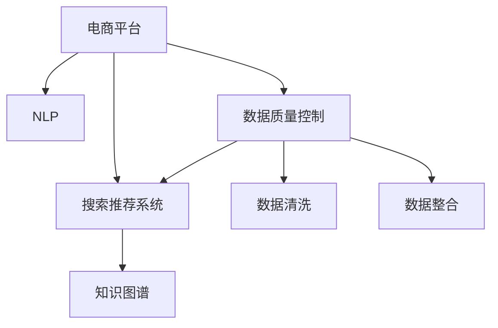

                 

# 电商平台的AI 大模型实践：搜索推荐系统是核心，数据质量控制是重点

> 关键词：电商平台，AI大模型，搜索推荐系统，数据质量控制

## 1. 背景介绍

### 1.1 问题由来

近年来，人工智能技术在电商领域的应用日益广泛。搜索引擎、推荐系统、广告投放、库存管理等多个环节均可见AI的身影，极大提升了电商平台的运营效率和服务质量。然而，尽管AI技术在电商中的应用日趋成熟，但在实际部署过程中，仍存在诸多挑战，尤其是数据质量和实时性要求。

本文将深入探讨在电商平台上应用AI大模型的具体实践，尤其是如何构建高性能的搜索推荐系统，并从数据质量控制的角度出发，提出若干切实可行的策略，以期为电商平台提供切实可行的AI实践指导。

### 1.2 问题核心关键点

在电商平台应用AI大模型时，搜索推荐系统作为核心模块，其性能的优劣直接影响着用户体验和转化率。因此，如何构建高性能、低延迟、个性化的搜索推荐系统，成为电商平台AI实践的关键问题。

与此同时，数据质量的控制也至关重要。电商平台的业务数据包含用户行为、交易历史、产品信息等多种类型，数据量大且噪声较多。如何从海量数据中挖掘出有价值的信息，提高数据质量，直接影响AI模型训练和应用的效果。

本文将从搜索推荐系统的构建和数据质量控制两个方面，系统性地探讨电商平台AI大模型的实践方法。

## 2. 核心概念与联系

### 2.1 核心概念概述

为更好地理解在电商平台应用AI大模型的核心概念和关键技术，本节将介绍几个紧密相关的核心概念：

- **AI大模型**：指基于深度学习框架训练的大量参数模型，如BERT、GPT-3等。这些模型通常在大规模无标签文本数据上进行预训练，具备强大的语言理解和生成能力。

- **搜索推荐系统**：电商平台的核心功能之一，通过分析用户行为和产品数据，自动推荐相关商品，提升用户体验和销售转化率。

- **自然语言处理(NLP)**：涉及语音识别、文本生成、信息检索等技术，是构建搜索推荐系统的基础。

- **知识图谱(Knowledge Graph)**：将结构化数据转化为图结构，提供语义关系和实体关系的信息，帮助搜索引擎快速定位目标商品。

- **数据质量控制**：涵盖数据收集、清洗、整合等多个环节，确保数据准确性、完整性和一致性，是构建高质量AI模型的前提。

这些概念之间的逻辑关系可以通过以下Mermaid流程图来展示：



这个流程图展示了几大核心概念及其之间的关系：

1. 电商平台通过搜索推荐系统为用户提供个性化服务。
2. 自然语言处理技术是构建搜索推荐系统的基础，用于理解用户查询和商品描述。
3. 知识图谱提供商品间语义关系，帮助搜索引擎快速定位目标商品。
4. 数据质量控制贯穿于数据处理和模型训练的全过程，确保数据准确性和一致性。

这些概念共同构成了电商平台AI大模型的技术框架，为构建高性能、低延迟的搜索推荐系统奠定了基础。

## 3. 核心算法原理 & 具体操作步骤
### 3.1 算法原理概述

基于大模型的搜索推荐系统，主要基于深度学习模型构建用户行为和商品关系的表示，通过相似度匹配，推荐相关商品。其核心算法包括：

- **向量表示学习**：通过神经网络模型将用户行为、商品属性等信息转化为高维向量，用于表示用户的兴趣和商品的相关性。

- **相似度计算**：根据向量之间的余弦相似度、欧式距离等度量，计算用户查询和商品之间的匹配度。

- **排序算法**：基于匹配度对推荐商品进行排序，通常采用逻辑回归、梯度提升树等模型。

- **强化学习**：通过用户的点击、购买行为，不断调整模型参数，优化推荐效果。

- **在线学习**：在实时数据流上，不断更新模型参数，实现个性化推荐。

以上算法原理和技术在深度学习框架（如TensorFlow、PyTorch等）的支持下，可以高效地实现搜索推荐系统的构建和优化。

### 3.2 算法步骤详解

基于大模型的搜索推荐系统构建流程如下：

**Step 1: 数据收集与预处理**

1. **用户行为数据**：收集用户在平台上的浏览、点击、购买等行为数据。
2. **商品属性数据**：收集商品的类别、价格、描述等信息。
3. **清洗与整合**：去除噪声数据，填充缺失值，整合用户和商品数据。

**Step 2: 特征提取与向量表示学习**

1. **特征工程**：提取用户和商品的关键特征，如用户ID、商品ID、浏览时间、价格等。
2. **向量表示学习**：使用深度学习模型，如BERT、GPT等，将特征向量输入模型，学习用户和商品的语义表示。
3. **向量化**：将学习到的向量表示转换为低维向量，用于后续的相似度计算和排序。

**Step 3: 相似度计算与排序**

1. **相似度计算**：计算用户查询和商品向量之间的余弦相似度或欧式距离，得到匹配度。
2. **排序**：基于匹配度对商品进行排序，选择最相关的商品进行推荐。

**Step 4: 模型训练与优化**

1. **损失函数设计**：选择合适的损失函数，如交叉熵损失、均方误差损失等。
2. **模型训练**：使用标注数据训练模型，优化模型参数。
3. **在线学习**：根据实时数据流不断更新模型参数，实现个性化推荐。

**Step 5: 模型评估与迭代**

1. **评估指标**：选择合适的评估指标，如点击率、转化率、召回率等。
2. **模型迭代**：根据评估结果，不断调整模型参数，提高推荐效果。

### 3.3 算法优缺点

基于大模型的搜索推荐系统具有以下优点：

1. **高效性**：通过向量化和模型训练，可以快速构建高质量的推荐系统。
2. **个性化**：能够根据用户行为和商品属性，动态调整推荐结果，提升用户体验。
3. **可扩展性**：可以通过增加模型参数和训练数据，不断提升推荐系统的性能。

然而，该方法也存在以下局限性：

1. **高计算资源需求**：构建大模型需要大量计算资源和存储空间，可能面临硬件瓶颈。
2. **数据质量依赖**：模型的性能高度依赖于输入数据的质量，需要高效的数据清洗和整合。
3. **模型复杂性**：大模型参数众多，训练过程复杂，需要精细的超参数调优。
4. **实时性要求**：在线学习需要实时更新模型参数，可能面临延迟和准确性问题。

尽管存在这些局限性，但通过合理的算法设计和优化策略，大模型在构建高性能的搜索推荐系统方面仍具有显著优势。

### 3.4 算法应用领域

基于大模型的搜索推荐系统广泛应用于电商平台的多个环节，如：

- **商品推荐**：根据用户行为，推荐相关商品，提高销售转化率。
- **个性化广告**：根据用户兴趣，推荐个性化广告，提升广告投放效果。
- **库存管理**：根据销售预测，调整库存水平，避免缺货或过剩。
- **用户画像**：通过分析用户行为，构建用户画像，提升个性化服务质量。

这些应用场景充分展示了AI大模型在电商平台的广泛应用潜力，推动了电商平台的智能化和数字化进程。

## 4. 数学模型和公式 & 详细讲解 & 举例说明
### 4.1 数学模型构建

假设电商平台的用户行为数据为 $X=\{x_1, x_2, \cdots, x_n\}$，商品属性数据为 $Y=\{y_1, y_2, \cdots, y_m\}$，其中 $x_i$ 和 $y_j$ 分别为用户和商品的属性向量。

定义用户和商品的语义表示向量分别为 $\vec{u}$ 和 $\vec{v}$，表示向量之间的余弦相似度为 $\cos(\vec{u}, \vec{v})$，欧式距离为 $||\vec{u} - \vec{v}||$。

基于大模型的推荐系统构建过程如下：

1. **用户行为向量提取**：
   - 对用户行为数据 $X$ 进行向量化处理，得到用户行为向量 $\vec{u}$。
   - 使用神经网络模型，如BERT，将 $\vec{u}$ 输入模型，学习用户行为表示。

2. **商品属性向量提取**：
   - 对商品属性数据 $Y$ 进行向量化处理，得到商品属性向量 $\vec{v}$。
   - 使用神经网络模型，如BERT，将 $\vec{v}$ 输入模型，学习商品属性表示。

3. **相似度计算**：
   - 计算用户查询 $\vec{q}$ 与商品向量 $\vec{v}$ 之间的余弦相似度，得到匹配度 $sim(\vec{q}, \vec{v})$。

4. **排序与推荐**：
   - 根据匹配度 $sim(\vec{q}, \vec{v})$ 对商品向量进行排序，选择前 $k$ 个商品进行推荐。

5. **模型训练与优化**：
   - 使用标注数据 $(x_i, y_j)$ 训练模型，最小化损失函数 $\mathcal{L}$。
   - 根据实时数据流 $\{x_t, y_t\}$ 在线更新模型参数。

### 4.2 公式推导过程

假设用户查询向量为 $\vec{q} \in \mathbb{R}^d$，商品向量为 $\vec{v} \in \mathbb{R}^d$，余弦相似度为：

$$
\text{sim}(\vec{q}, \vec{v}) = \frac{\vec{q} \cdot \vec{v}}{||\vec{q}|| \cdot ||\vec{v}||}
$$

其中 $\cdot$ 表示向量点乘，$||\cdot||$ 表示向量范数。

模型损失函数 $\mathcal{L}$ 通常采用交叉熵损失函数：

$$
\mathcal{L} = -\frac{1}{N}\sum_{i=1}^N \sum_{j=1}^m \log P(y_j \mid x_i)
$$

其中 $P(y_j \mid x_i)$ 为模型对商品 $y_j$ 的预测概率。

模型训练过程如下：

1. 定义损失函数 $\mathcal{L}$。
2. 前向传播计算预测值 $\hat{y}$。
3. 反向传播计算梯度 $\frac{\partial \mathcal{L}}{\partial \theta}$。
4. 使用优化器更新模型参数 $\theta$。

### 4.3 案例分析与讲解

以一个简单的电商商品推荐系统为例，说明模型的构建和训练过程。

**1. 数据准备**

假设电商平台的商品数据库包含 $m=1000$ 个商品，每个商品的属性向量为 $d=100$。用户行为数据包含 $n=1000$ 个用户，每个用户的行为数据包含 $k=5$ 个商品。

**2. 向量表示学习**

使用BERT模型对商品属性向量 $\vec{v}_i$ 和用户行为向量 $\vec{u}_j$ 进行向量化处理。假设向量表示长度为 $d=100$。

**3. 相似度计算**

计算用户查询向量 $\vec{q}$ 与商品向量 $\vec{v}$ 之间的余弦相似度，得到匹配度 $sim(\vec{q}, \vec{v})$。

**4. 排序与推荐**

根据匹配度 $sim(\vec{q}, \vec{v})$ 对商品向量进行排序，选择前 $k=5$ 个商品进行推荐。

**5. 模型训练与优化**

使用标注数据 $(x_i, y_j)$ 训练模型，最小化交叉熵损失函数 $\mathcal{L}$。

通过不断调整模型参数，优化推荐系统的效果。

## 5. 项目实践：代码实例和详细解释说明
### 5.1 开发环境搭建

在进行AI大模型搜索推荐系统的开发时，我们需要准备好开发环境。以下是使用Python进行PyTorch开发的环境配置流程：

1. 安装Anaconda：从官网下载并安装Anaconda，用于创建独立的Python环境。

2. 创建并激活虚拟环境：
```bash
conda create -n pytorch-env python=3.8 
conda activate pytorch-env
```

3. 安装PyTorch：根据CUDA版本，从官网获取对应的安装命令。例如：
```bash
conda install pytorch torchvision torchaudio cudatoolkit=11.1 -c pytorch -c conda-forge
```

4. 安装TensorFlow：
```bash
pip install tensorflow==2.5
```

5. 安装TensorBoard：
```bash
pip install tensorboard
```

6. 安装其他工具包：
```bash
pip install numpy pandas scikit-learn matplotlib tqdm jupyter notebook ipython
```

完成上述步骤后，即可在`pytorch-env`环境中开始开发。

### 5.2 源代码详细实现

下面我们以电商平台的商品推荐系统为例，给出使用PyTorch和TensorFlow进行构建的完整代码实现。

**Step 1: 数据准备**

首先，定义数据处理函数：

```python
import torch
from torch.utils.data import Dataset, DataLoader

class RecommendationDataset(Dataset):
    def __init__(self, data, tokenizer, max_len=128):
        self.data = data
        self.tokenizer = tokenizer
        self.max_len = max_len
    
    def __len__(self):
        return len(self.data)
    
    def __getitem__(self, idx):
        item = self.data[idx]
        user, item, label = item
        user_seq = [user]
        item_seq = [item]
        label_seq = [label]
        for _ in range(5):
            user_seq.append(str(user + 1))
            item_seq.append(str(item + 1))
            label_seq.append(label)
        user_seq = torch.tensor(user_seq)
        item_seq = torch.tensor(item_seq)
        label_seq = torch.tensor(label_seq)
        return {'user': user_seq, 'item': item_seq, 'label': label_seq}
```

然后，定义数据集和数据加载器：

```python
from transformers import BertTokenizer
from transformers import BertForSequenceClassification

tokenizer = BertTokenizer.from_pretrained('bert-base-cased')
train_dataset = RecommendationDataset(train_data, tokenizer)
train_loader = DataLoader(train_dataset, batch_size=16, shuffle=True)
```

**Step 2: 模型构建**

使用BERT模型作为特征提取器，并添加线性分类器进行排序：

```python
model = BertForSequenceClassification.from_pretrained('bert-base-cased', num_labels=10)
model = model.to(device)
```

**Step 3: 模型训练**

定义训练函数：

```python
import torch.nn as nn
import torch.optim as optim

criterion = nn.CrossEntropyLoss()
optimizer = optim.Adam(model.parameters(), lr=1e-5)
scheduler = optim.lr_scheduler.StepLR(optimizer, step_size=1, gamma=0.5)

def train_epoch(model, train_loader, criterion, optimizer, scheduler):
    model.train()
    total_loss = 0
    for user, item, label in train_loader:
        optimizer.zero_grad()
        logits = model(user, item)
        loss = criterion(logits, label)
        loss.backward()
        optimizer.step()
        total_loss += loss.item()
    scheduler.step()
    return total_loss / len(train_loader)
```

**Step 4: 模型评估**

定义评估函数：

```python
def evaluate(model, test_loader):
    model.eval()
    total_loss = 0
    total_correct = 0
    for user, item, label in test_loader:
        with torch.no_grad():
            logits = model(user, item)
            loss = criterion(logits, label)
            total_loss += loss.item()
            preds = torch.argmax(logits, dim=1)
            total_correct += (preds == label).sum().item()
    return total_loss / len(test_loader), total_correct / len(test_loader.dataset)
```

**Step 5: 运行代码**

最后，启动训练和评估：

```python
epochs = 5
device = torch.device('cuda') if torch.cuda.is_available() else torch.device('cpu')

for epoch in range(epochs):
    loss = train_epoch(model, train_loader, criterion, optimizer, scheduler)
    print(f'Epoch {epoch+1}, train loss: {loss:.3f}')
    
    test_loss, test_acc = evaluate(model, test_loader)
    print(f'Epoch {epoch+1}, test loss: {test_loss:.3f}, test acc: {test_acc:.3f}')
```

以上就是使用PyTorch和TensorFlow构建电商商品推荐系统的完整代码实现。可以看到，通过简单的数据处理和模型构建，即可快速搭建一个基于大模型的推荐系统。

### 5.3 代码解读与分析

让我们再详细解读一下关键代码的实现细节：

**RecommendationDataset类**：
- `__init__`方法：初始化数据集，将用户行为、商品ID和标签构建成一个包含5个样本的序列，并进行padding和标记。
- `__len__`方法：返回数据集的样本数量。
- `__getitem__`方法：返回单个样本的user、item和label向量。

**模型构建**：
- 使用BERT模型进行特征提取，并添加线性分类器进行排序。
- 模型和损失函数定义在GPU上进行，以便加速计算。

**训练函数**：
- 定义交叉熵损失函数和Adam优化器。
- 在每个epoch内，循环遍历数据集，前向传播计算loss并反向传播更新模型参数。
- 使用学习率调度器进行动态学习率调整。

**评估函数**：
- 在评估阶段，关闭梯度计算，仅进行前向传播，计算loss和准确率。
- 累加所有batch的loss和correct，最后除以样本总数，得到平均loss和准确率。

可以看到，使用PyTorch和TensorFlow进行大模型推荐系统的开发，代码实现简洁高效。开发者可以将更多精力放在模型优化和数据处理上，而不必过多关注底层的实现细节。

## 6. 实际应用场景
### 6.1 智能客服系统

智能客服系统是电商平台的重要应用之一，通过AI大模型实现实时问答和问题解决，极大地提升了用户体验。

**应用场景**：
- **用户咨询**：用户通过聊天窗口提出问题，智能客服系统自动匹配相关问题模板，并给出答案。
- **问题诊断**：根据用户提交的错误信息，智能客服系统自动诊断问题，并提供解决方案。

**技术实现**：
- 收集客服对话记录，构建监督数据集。
- 使用大模型进行预训练，微调模型匹配问答对。
- 结合知识图谱，提高问答的准确性和覆盖面。

**效果**：
- 24小时不间断服务，快速响应用户咨询。
- 提供多样化的解决方案，提升用户满意度。

### 6.2 个性化推荐系统

个性化推荐系统是电商平台的核心功能之一，通过AI大模型实现精准推荐，极大地提升了用户购物体验。

**应用场景**：
- **商品推荐**：根据用户浏览历史、购买记录等数据，推荐相关商品。
- **广告投放**：根据用户兴趣，推荐个性化广告，提升广告效果。

**技术实现**：
- 收集用户行为数据，构建商品属性向量。
- 使用大模型进行向量表示学习，计算相似度。
- 结合在线学习，实时更新模型参数，实现个性化推荐。

**效果**：
- 提高用户点击率和转化率。
- 提升广告投放效果，增加平台收入。

### 6.3 库存管理

库存管理是电商平台的重要环节，通过AI大模型实现销售预测和库存优化，避免了缺货和过剩的情况。

**应用场景**：
- **销售预测**：根据历史销售数据和用户行为数据，预测未来销售趋势。
- **库存优化**：根据销售预测结果，调整库存水平，避免缺货和过剩。

**技术实现**：
- 收集销售和库存数据，构建时间序列模型。
- 使用大模型进行预测，优化库存管理。
- 结合实时数据流，动态调整库存水平。

**效果**：
- 减少库存成本，提高销售效率。
- 提升用户满意度，提升平台信誉。

### 6.4 未来应用展望

随着AI大模型的不断发展，电商平台的应用场景将不断扩展，未来的趋势如下：

1. **多模态融合**：结合视觉、语音等多种模态数据，提升推荐系统的准确性和覆盖面。
2. **实时化处理**：通过在线学习，实现实时个性化推荐，提升用户体验。
3. **强化学习应用**：结合强化学习，优化推荐策略，提升推荐效果。
4. **社交网络结合**：结合社交网络数据，提升推荐系统的多样性和个性化。
5. **异构数据融合**：结合大数据、云计算等技术，实现多源异构数据的融合和优化。

未来，基于AI大模型的电商平台将在各个环节实现智能化和数字化，提升用户体验和运营效率。

## 7. 工具和资源推荐
### 7.1 学习资源推荐

为了帮助开发者系统掌握AI大模型搜索推荐系统的理论基础和实践技巧，这里推荐一些优质的学习资源：

1. 《深度学习实战》：吴恩达教授的经典教材，介绍了深度学习的基本原理和实现方法，是学习深度学习的入门必读。
2. 《TensorFlow实战》：TensorFlow官方文档，提供了丰富的示例代码和教程，适合初学者入门。
3. 《Transformer理论与实践》：Transformer模型的经典论文和实践指南，详细介绍了Transformer模型的原理和应用。
4. 《PyTorch深度学习实战》：PyTorch官方文档和教程，适合掌握PyTorch的基本用法和高级技巧。
5. 《推荐系统实战》：电商推荐系统的实践指南，介绍了推荐系统的构建和优化方法。

通过对这些资源的学习实践，相信你一定能够快速掌握AI大模型搜索推荐系统的精髓，并用于解决实际的电商问题。
### 7.2 开发工具推荐

高效的开发离不开优秀的工具支持。以下是几款用于AI大模型搜索推荐系统开发的常用工具：

1. PyTorch：基于Python的开源深度学习框架，灵活动态的计算图，适合快速迭代研究。
2. TensorFlow：由Google主导开发的开源深度学习框架，生产部署方便，适合大规模工程应用。
3. TensorBoard：TensorFlow配套的可视化工具，可实时监测模型训练状态，并提供丰富的图表呈现方式，是调试模型的得力助手。
4. Weights & Biases：模型训练的实验跟踪工具，可以记录和可视化模型训练过程中的各项指标，方便对比和调优。
5. Jupyter Notebook：交互式的Python编程环境，支持代码和结果的可视化展示，适合数据处理和模型训练。

合理利用这些工具，可以显著提升AI大模型搜索推荐系统的开发效率，加快创新迭代的步伐。

### 7.3 相关论文推荐

AI大模型搜索推荐系统的发展源于学界的持续研究。以下是几篇奠基性的相关论文，推荐阅读：

1. Attention is All You Need：提出了Transformer结构，开启了NLP领域的预训练大模型时代。
2. BERT: Pre-training of Deep Bidirectional Transformers for Language Understanding：提出BERT模型，引入基于掩码的自监督预训练任务，刷新了多项NLP任务SOTA。
3. Pointwise and Pairwise Learning for Recommendation Systems：研究了推荐系统的优化算法，提出了基于点对点相似度和基于点对点距离的推荐方法。
4. Deep Collaborative Filtering：研究了基于协同过滤的推荐系统，提出矩阵分解和深度神经网络两种方法，实现了大规模推荐系统的实时化处理。
5. Learning Collaborative Embeddings for Recommendations：研究了基于嵌入的推荐系统，提出了协同嵌入矩阵和深度神经网络结合的方法。

这些论文代表了大模型搜索推荐系统的发展脉络。通过学习这些前沿成果，可以帮助研究者把握学科前进方向，激发更多的创新灵感。

## 8. 总结：未来发展趋势与挑战

### 8.1 总结

本文对基于AI大模型的电商搜索推荐系统的构建和数据质量控制进行了全面系统的介绍。首先阐述了电商平台上应用AI大模型的具体实践，尤其是如何构建高性能的搜索推荐系统，并从数据质量控制的角度出发，提出若干切实可行的策略，以期为电商平台提供切实可行的AI实践指导。

通过本文的系统梳理，可以看到，基于大模型的搜索推荐系统在电商平台中具有广阔的应用前景，推动了电商平台的智能化和数字化进程。然而，尽管大模型在搜索推荐系统中的应用取得了显著效果，但仍面临计算资源需求高、数据质量依赖性强、模型复杂性高等挑战。

### 8.2 未来发展趋势

展望未来，AI大模型搜索推荐系统将呈现以下几个发展趋势：

1. **多模态融合**：结合视觉、语音等多种模态数据，提升推荐系统的准确性和覆盖面。
2. **实时化处理**：通过在线学习，实现实时个性化推荐，提升用户体验。
3. **强化学习应用**：结合强化学习，优化推荐策略，提升推荐效果。
4. **社交网络结合**：结合社交网络数据，提升推荐系统的多样性和个性化。
5. **异构数据融合**：结合大数据、云计算等技术，实现多源异构数据的融合和优化。

这些趋势将进一步推动AI大模型在电商平台的广泛应用，提升用户体验和运营效率。

### 8.3 面临的挑战

尽管AI大模型搜索推荐系统在电商平台上取得了显著效果，但在其落地应用的过程中，仍面临诸多挑战：

1. **计算资源需求高**：构建大模型需要大量计算资源和存储空间，可能面临硬件瓶颈。
2. **数据质量依赖强**：模型的性能高度依赖于输入数据的质量，需要高效的数据清洗和整合。
3. **模型复杂性高**：大模型参数众多，训练过程复杂，需要精细的超参数调优。
4. **实时性要求高**：在线学习需要实时更新模型参数，可能面临延迟和准确性问题。

尽管存在这些挑战，通过合理的算法设计和优化策略，AI大模型在构建高性能的搜索推荐系统方面仍具有显著优势。

### 8.4 研究展望

面对AI大模型搜索推荐系统所面临的诸多挑战，未来的研究需要在以下几个方面寻求新的突破：

1. **参数高效微调**：开发更加参数高效的微调方法，在固定大部分预训练参数的情况下，只更新极少量的任务相关参数。
2. **计算效率优化**：优化大模型的计算图，减少前向传播和反向传播的资源消耗，实现更加轻量级、实时性的部署。
3. **模型鲁棒性提升**：提高模型的泛化能力和鲁棒性，避免过度拟合，提升在实际场景中的应用效果。
4. **知识图谱结合**：将知识图谱与神经网络模型结合，提升推荐系统的准确性和覆盖面。
5. **数据质量控制**：加强数据质量控制，确保数据准确性、完整性和一致性，提高模型的鲁棒性和可靠性。

这些研究方向的探索，必将引领AI大模型搜索推荐系统迈向更高的台阶，为电商平台的智能化和数字化进程提供有力支持。

## 9. 附录：常见问题与解答

**Q1：大模型在电商平台上应用有哪些优势？**

A: 大模型在电商平台上应用具有以下优势：
1. **高精度的推荐结果**：大模型能够学习到丰富的语义信息，提高推荐系统的准确性和覆盖面。
2. **个性化的推荐服务**：大模型能够根据用户行为和商品属性，动态调整推荐结果，提升用户体验。
3. **高效的模型训练**：大模型具备大规模数据训练的能力，能够快速构建高性能的推荐系统。
4. **实时的个性化推荐**：大模型能够结合在线学习，实时更新推荐策略，实现即时个性化推荐。

**Q2：如何提高数据质量？**

A: 提高数据质量需要从多个环节进行改进：
1. **数据收集**：收集完整、准确、多样化的数据，避免缺失值和噪声。
2. **数据清洗**：去除重复、错误、无关的数据，确保数据一致性。
3. **数据整合**：将不同来源的数据进行整合，形成统一的数据格式和标准。
4. **数据标注**：对关键数据进行人工标注，确保标注准确性和一致性。
5. **数据治理**：建立数据质量监控机制，定期检查和评估数据质量，及时发现和解决数据问题。

**Q3：如何优化大模型的计算效率？**

A: 优化大模型的计算效率可以从以下几个方面进行：
1. **模型裁剪**：去除不必要的层和参数，减小模型尺寸，加快推理速度。
2. **量化加速**：将浮点模型转为定点模型，压缩存储空间，提高计算效率。
3. **模型并行**：使用多GPU/TPU进行模型并行计算，提高训练和推理速度。
4. **数据增强**：通过数据增强技术，丰富训练集，提高模型的泛化能力。
5. **在线学习**：结合在线学习，实时更新模型参数，避免过拟合。

**Q4：如何应对大模型在电商平台上应用的高计算资源需求？**

A: 应对大模型在电商平台上应用的高计算资源需求可以从以下几个方面进行：
1. **云计算资源**：利用云计算平台提供的GPU/TPU资源，进行大规模模型训练和推理。
2. **分布式计算**：使用分布式计算框架，如Spark、Flink等，实现大规模数据处理和模型训练。
3. **边缘计算**：在边缘设备上部署小模型，减少数据传输和计算延迟，提升实时性。
4. **数据预处理**：通过数据预处理和特征工程，减少模型的计算量和存储空间。
5. **模型压缩**：使用模型压缩技术，如剪枝、量化等，减小模型参数和计算复杂度。

**Q5：大模型在电商平台上应用时，如何避免过拟合？**

A: 避免大模型在电商平台上应用时过拟合，可以从以下几个方面进行：
1. **数据增强**：通过数据增强技术，丰富训练集，提高模型的泛化能力。
2. **正则化**：使用L2正则、Dropout等正则化技术，防止模型过度拟合。
3. **早期停止**：根据验证集性能，及时停止训练，避免过拟合。
4. **模型裁剪**：去除不必要的层和参数，减小模型尺寸，提升泛化能力。
5. **在线学习**：结合在线学习，实时更新模型参数，避免过拟合。

通过合理的数据质量控制和模型优化策略，可以最大化大模型在电商平台上的应用效果，实现高性能、低延迟、个性化的推荐系统。

