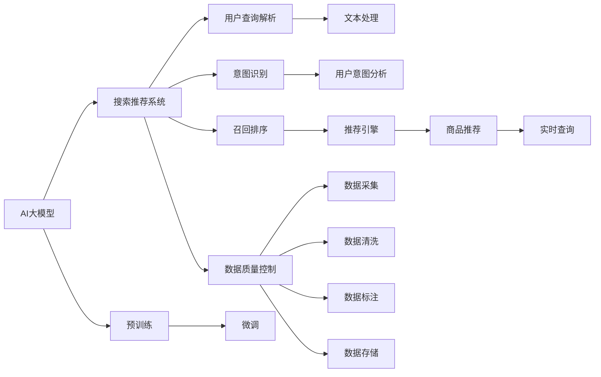

                 

# 电商平台的AI 大模型战略：搜索推荐系统是核心，数据质量控制是关键

## 1. 背景介绍

在互联网电商竞争日趋激烈的背景下，人工智能（AI）技术，特别是大语言模型在电商搜索推荐系统中的应用，成为各大平台竞争的焦点。据数据表明，AI技术每提升1%的搜索相关指标，都能带来至少5%的GMV增长。因此，如何在电商场景下高效地部署AI大模型，并优化数据质量控制，以确保模型的高效性和准确性，成为了各大平台亟待解决的难题。

大语言模型，如BERT、GPT-3、ALBERT等，通过大规模的预训练和微调，可以高效地理解和处理自然语言，应用于搜索推荐系统的用户查询解析、意图识别、召回排序等环节。在搜索推荐中，用户输入的查询往往包含高度不明确的信息，且实时性要求高，因此，对大语言模型的依赖程度越来越高。然而，数据质量不佳、模型泛化能力不足、推理效率低下等问题也逐渐显现，限制了AI大模型在电商平台的广泛应用。

本文将重点讨论AI大模型在电商搜索推荐系统中的战略部署，包括构建数据质量控制体系、设计高效的推荐算法以及优化模型推理性能等核心问题，以期为电商平台提供可行的AI大模型战略。

## 2. 核心概念与联系

### 2.1 核心概念概述

为深入理解AI大模型在电商搜索推荐系统中的应用，本节将介绍几个关键概念：

- **AI大模型（Large AI Models）**：通过大规模数据预训练和微调，具备强大自然语言处理能力的大型神经网络模型。如BERT、GPT-3、ALBERT等，适用于电商搜索推荐系统中的多模态数据处理。

- **搜索推荐系统（Search & Recommendation System）**：基于用户行为数据和上下文信息，自动推荐商品或服务的系统。AI大模型可以通过对用户查询、历史行为、商品属性等多维度数据的分析，生成精准的推荐结果。

- **数据质量控制（Data Quality Control）**：对数据进行采集、清洗、标注和存储等过程的管理和监控，确保数据质量满足模型的训练和推理需求。数据质量直接影响模型的准确性和泛化能力。

- **实时推理（Real-time Inference）**：在模型推理过程中，对用户查询进行实时解析，生成推荐结果，以满足电商平台的低延迟需求。

- **多模态融合（Multi-modal Fusion）**：将文本、图像、视频等多类型数据进行融合，提高模型对复杂场景的理解能力。在电商搜索推荐中，商品图片、用户评论等非文本数据同样重要。

- **用户意图识别（User Intent Recognition）**：基于用户输入的查询，分析用户的真实需求，引导推荐系统生成符合用户期望的推荐结果。AI大模型可以通过自然语言处理技术高效地完成这一任务。

这些概念紧密联系，共同构成了AI大模型在电商搜索推荐系统中的核心应用框架。通过对这些概念的理解和应用，电商平台可以更有效地部署AI大模型，提升用户体验和运营效率。

### 2.2 核心概念原理和架构的 Mermaid 流程图



## 3. 核心算法原理 & 具体操作步骤

### 3.1 算法原理概述

在电商搜索推荐系统中，AI大模型主要应用于以下几个环节：

- **用户查询解析（User Query Parsing）**：将自然语言查询转换为模型能够理解的形式，生成特征向量。
- **意图识别（Intent Recognition）**：分析用户查询的意图，如购买、浏览、比较等，生成意图标签。
- **召回排序（Recall & Ranking）**：基于用户查询和商品特征，对商品进行召回和排序，生成推荐列表。
- **实时查询（Real-time Query）**：对用户实时输入的查询进行解析和处理，生成即时推荐。

AI大模型的核心算法包括预训练模型、微调模型、注意力机制和深度学习框架等。这些算法通过协同工作，实现高效的数据处理和推荐决策。

### 3.2 算法步骤详解

以下是AI大模型在电商搜索推荐系统中应用的详细步骤：

**Step 1: 数据预处理**
- 收集用户行为数据，如浏览历史、购买记录、搜索记录等。
- 将数据进行清洗和标注，去除重复和噪声数据。
- 将文本数据进行分词、编码和向量化处理。

**Step 2: 模型构建**
- 选择合适的预训练模型，如BERT、GPT-3等，作为初始化参数。
- 设计合适的任务适配层，用于处理不同任务的具体需求。
- 对预训练模型进行微调，以适应电商搜索推荐系统的特定需求。

**Step 3: 数据增强**
- 通过回译、近义替换等方式扩充训练集，增加数据多样性。
- 引入对抗样本，增强模型的鲁棒性和泛化能力。
- 应用正则化技术，如L2正则、Dropout等，防止过拟合。

**Step 4: 模型训练与优化**
- 使用合适的优化器（如AdamW、SGD等）和损失函数，训练微调后的模型。
- 通过验证集评估模型性能，调整超参数和模型结构。
- 采用多模型集成技术，提高推荐结果的稳定性和准确性。

**Step 5: 实时推理与部署**
- 在生产环境中部署模型，实时处理用户查询，生成推荐结果。
- 使用缓存技术，优化查询响应速度。
- 定期更新模型，保持推荐结果的时效性和准确性。

### 3.3 算法优缺点

AI大模型在电商搜索推荐系统中的应用具有以下优点：

- **高效性**：AI大模型可以高效地处理自然语言查询，生成推荐结果。
- **泛化能力强**：通过预训练和微调，模型能够适应多种电商场景和用户需求。
- **实时性**：在电商平台的实时性要求下，AI大模型能够快速响应用户查询，生成推荐。
- **多模态融合**：通过整合文本、图像、视频等多类型数据，提高推荐结果的全面性和准确性。

然而，AI大模型也存在以下缺点：

- **计算资源消耗大**：大模型的参数量庞大，计算资源消耗高。
- **推理速度慢**：在模型推理过程中，计算开销大，响应时间长。
- **数据质量依赖强**：数据质量直接影响到模型的训练和推理效果。
- **解释性不足**：大模型往往难以解释推荐结果的生成过程，缺乏透明度。

### 3.4 算法应用领域

AI大模型在电商搜索推荐系统中的应用主要包括以下几个领域：

- **商品搜索**：根据用户输入的搜索词，生成商品推荐列表。
- **个性化推荐**：基于用户行为数据，生成个性化推荐商品。
- **内容推荐**：根据用户兴趣，推荐相关内容，如商品评价、用户评论等。
- **广告投放**：通过用户画像和行为数据，生成广告推荐策略。
- **智能客服**：回答用户查询，提供即时服务。
- **营销活动**：根据用户行为数据，生成营销活动的精准推送策略。

在以上应用领域，AI大模型可以通过多轮微调、参数共享、多模态融合等技术，不断提升推荐系统的效果和智能化水平。

## 4. 数学模型和公式 & 详细讲解 & 举例说明

### 4.1 数学模型构建

在电商搜索推荐系统中，AI大模型的应用主要涉及自然语言处理、向量空间模型、注意力机制等数学模型。以下是典型的数学模型构建过程：

- **文本表示模型（Text Representation Model）**：将自然语言查询转换为向量表示，如BERT、GPT-3等。
- **意图识别模型（Intent Recognition Model）**：使用分类模型，如逻辑回归、Softmax等，对用户查询进行意图识别。
- **召回排序模型（Recall & Ranking Model）**：使用排序算法，如矩阵分解、神经网络等，对商品进行召回和排序。

### 4.2 公式推导过程

以用户查询解析为例，介绍公式推导过程：

设用户输入查询为 $q$，商品特征为 $v$，则查询解析过程如下：

1. 将查询 $q$ 输入到BERT模型中，得到查询向量 $q_{emb}$。
2. 将商品特征 $v$ 输入到BERT模型中，得到商品向量 $v_{emb}$。
3. 计算查询向量与商品向量的相似度 $s$，如余弦相似度 $\cos(\theta) = \frac{q_{emb} \cdot v_{emb}}{\|q_{emb}\|\|v_{emb}\|}$。
4. 根据相似度 $s$，对商品进行召回和排序，生成推荐列表。

### 4.3 案例分析与讲解

以下通过一个电商平台的搜索推荐系统案例，展示AI大模型在实际应用中的具体应用：

1. **数据预处理**
   - 从电商平台的用户行为数据中，收集用户的浏览、点击、购买记录等。
   - 清洗数据，去除重复和噪声数据。
   - 使用BERT模型将文本数据进行分词、编码和向量化。

2. **模型构建**
   - 选择BERT作为预训练模型，设计意图识别任务适配层，将用户查询转换为意图标签。
   - 对BERT模型进行微调，使其适应电商平台的特定需求。

3. **数据增强**
   - 通过回译和近义替换，扩充训练集，增加数据多样性。
   - 引入对抗样本，提高模型的鲁棒性和泛化能力。

4. **模型训练与优化**
   - 使用AdamW优化器和交叉熵损失函数，训练微调后的模型。
   - 在验证集上评估模型性能，调整超参数和模型结构。

5. **实时推理与部署**
   - 在生产环境中部署模型，实时处理用户查询，生成推荐结果。
   - 使用缓存技术，优化查询响应速度。

6. **效果评估**
   - 使用AUC、点击率、转化率等指标，评估模型的推荐效果。
   - 定期更新模型，保持推荐结果的时效性和准确性。

## 5. 项目实践：代码实例和详细解释说明

### 5.1 开发环境搭建

在进行AI大模型在电商搜索推荐系统中的实践时，需要准备开发环境。以下是Python和PyTorch的开发环境配置步骤：

1. 安装Anaconda：从官网下载并安装Anaconda，用于创建独立的Python环境。

2. 创建并激活虚拟环境：
```bash
conda create -n ai-env python=3.8 
conda activate ai-env
```

3. 安装PyTorch：根据CUDA版本，从官网获取对应的安装命令。例如：
```bash
conda install pytorch torchvision torchaudio cudatoolkit=11.1 -c pytorch -c conda-forge
```

4. 安装Transformers库：
```bash
pip install transformers
```

5. 安装各类工具包：
```bash
pip install numpy pandas scikit-learn matplotlib tqdm jupyter notebook ipython
```

完成上述步骤后，即可在`ai-env`环境中开始项目实践。

### 5.2 源代码详细实现

以下是使用PyTorch和Transformers库对BERT模型进行电商搜索推荐系统微调的完整代码实现：

```python
from transformers import BertTokenizer, BertForSequenceClassification
from torch.utils.data import DataLoader, Dataset
import torch
import torch.nn.functional as F

class SearchRecommendationDataset(Dataset):
    def __init__(self, texts, labels, tokenizer):
        self.texts = texts
        self.labels = labels
        self.tokenizer = tokenizer
        
    def __len__(self):
        return len(self.texts)
    
    def __getitem__(self, item):
        text = self.texts[item]
        label = self.labels[item]
        
        encoding = self.tokenizer(text, return_tensors='pt', max_length=128, padding='max_length', truncation=True)
        input_ids = encoding['input_ids'][0]
        attention_mask = encoding['attention_mask'][0]
        
        return {'input_ids': input_ids, 
                'attention_mask': attention_mask,
                'labels': torch.tensor(label, dtype=torch.long)}

# 标签与id的映射
label2id = {'buy': 0, 'look': 1, 'compare': 2}
id2label = {v: k for k, v in label2id.items()}

# 创建dataset
tokenizer = BertTokenizer.from_pretrained('bert-base-uncased')

train_dataset = SearchRecommendationDataset(train_texts, train_labels, tokenizer)
dev_dataset = SearchRecommendationDataset(dev_texts, dev_labels, tokenizer)
test_dataset = SearchRecommendationDataset(test_texts, test_labels, tokenizer)

# 定义模型和优化器
model = BertForSequenceClassification.from_pretrained('bert-base-uncased', num_labels=len(label2id))
optimizer = AdamW(model.parameters(), lr=2e-5)

# 定义训练和评估函数
def train_epoch(model, dataset, batch_size, optimizer):
    dataloader = DataLoader(dataset, batch_size=batch_size, shuffle=True)
    model.train()
    epoch_loss = 0
    for batch in dataloader:
        input_ids = batch['input_ids'].to(device)
        attention_mask = batch['attention_mask'].to(device)
        labels = batch['labels'].to(device)
        model.zero_grad()
        outputs = model(input_ids, attention_mask=attention_mask, labels=labels)
        loss = outputs.loss
        epoch_loss += loss.item()
        loss.backward()
        optimizer.step()
    return epoch_loss / len(dataloader)

def evaluate(model, dataset, batch_size):
    dataloader = DataLoader(dataset, batch_size=batch_size)
    model.eval()
    preds, labels = [], []
    with torch.no_grad():
        for batch in dataloader:
            input_ids = batch['input_ids'].to(device)
            attention_mask = batch['attention_mask'].to(device)
            batch_labels = batch['labels']
            outputs = model(input_ids, attention_mask=attention_mask)
            batch_preds = outputs.logits.argmax(dim=2).to('cpu').tolist()
            batch_labels = batch_labels.to('cpu').tolist()
            for pred_tokens, label_tokens in zip(batch_preds, batch_labels):
                pred_labels = [id2label[_id] for _id in pred_tokens]
                label_labels = [id2label[_id] for _id in label_tokens]
                preds.append(pred_labels[:len(label_tokens)])
                labels.append(label_labels)
                
    print(classification_report(labels, preds))

# 启动训练流程并在测试集上评估
epochs = 5
batch_size = 16

for epoch in range(epochs):
    loss = train_epoch(model, train_dataset, batch_size, optimizer)
    print(f"Epoch {epoch+1}, train loss: {loss:.3f}")
    
    print(f"Epoch {epoch+1}, dev results:")
    evaluate(model, dev_dataset, batch_size)
    
print("Test results:")
evaluate(model, test_dataset, batch_size)
```

### 5.3 代码解读与分析

让我们再详细解读一下关键代码的实现细节：

**SearchRecommendationDataset类**：
- `__init__`方法：初始化文本、标签和分词器等关键组件。
- `__len__`方法：返回数据集的样本数量。
- `__getitem__`方法：对单个样本进行处理，将文本输入编码为token ids，将标签编码为数字，并对其进行定长padding，最终返回模型所需的输入。

**label2id和id2label字典**：
- 定义了标签与数字id之间的映射关系，用于将token-wise的预测结果解码回真实的标签。

**训练和评估函数**：
- 使用PyTorch的DataLoader对数据集进行批次化加载，供模型训练和推理使用。
- 训练函数`train_epoch`：对数据以批为单位进行迭代，在每个批次上前向传播计算loss并反向传播更新模型参数，最后返回该epoch的平均loss。
- 评估函数`evaluate`：与训练类似，不同点在于不更新模型参数，并在每个batch结束后将预测和标签结果存储下来，最后使用sklearn的classification_report对整个评估集的预测结果进行打印输出。

**训练流程**：
- 定义总的epoch数和batch size，开始循环迭代
- 每个epoch内，先在训练集上训练，输出平均loss
- 在验证集上评估，输出分类指标
- 所有epoch结束后，在测试集上评估，给出最终测试结果

可以看到，PyTorch配合Transformers库使得BERT微调的代码实现变得简洁高效。开发者可以将更多精力放在数据处理、模型改进等高层逻辑上，而不必过多关注底层的实现细节。

当然，工业级的系统实现还需考虑更多因素，如模型的保存和部署、超参数的自动搜索、更灵活的任务适配层等。但核心的微调范式基本与此类似。

## 6. 实际应用场景

### 6.1 智能客服系统

基于AI大模型的智能客服系统，能够全天候不间断服务，快速响应客户咨询，用自然流畅的语言解答各类常见问题。在搜索推荐中，可以构建一个基于用户历史查询的意图识别系统，分析用户真实需求，引导推荐系统生成符合用户期望的推荐结果。通过多轮微调和参数共享，智能客服系统能够不断提升服务质量和用户满意度。

### 6.2 商品搜索系统

商品搜索系统是电商平台的核心功能之一，能够快速响应用户查询，生成推荐列表。通过AI大模型解析用户查询，结合商品属性、用户历史行为等数据，生成精准的搜索结果。在推荐系统中，用户点击率、转化率等指标直接反映系统的推荐效果，需要不断优化模型和算法，提升用户体验。

### 6.3 个性化推荐系统

个性化推荐系统通过分析用户行为数据，生成个性化的商品推荐。AI大模型通过多轮微调，能够学习到用户的多维特征，包括浏览历史、购买记录、搜索记录等，生成更符合用户偏好的推荐结果。在推荐系统中，需要不断优化模型和算法，提升推荐效果和用户满意度。

### 6.4 未来应用展望

随着AI大模型和微调方法的不断发展，基于微调范式将在更多领域得到应用，为电商平台带来变革性影响。

在智慧医疗领域，基于AI大模型的搜索推荐系统，可以为医生提供精准的医疗信息，提升诊疗效率和质量。在金融领域，搜索推荐系统可以实时获取市场资讯，提供精准的投资建议。在教育领域，基于AI大模型的推荐系统可以推荐合适的学习资源，提升学习效果。

## 7. 工具和资源推荐

### 7.1 学习资源推荐

为了帮助开发者系统掌握AI大模型在电商搜索推荐系统中的应用，这里推荐一些优质的学习资源：

1. 《深度学习》书籍：Ian Goodfellow、Yoshua Bengio和Aaron Courville合著，涵盖了深度学习的基本概念和应用，包括自然语言处理和推荐系统。
2. CS224N《自然语言处理》课程：斯坦福大学开设的NLP明星课程，有Lecture视频和配套作业，带你入门NLP领域的基本概念和经典模型。
3. 《Transformer from the Inside Out》博文：由大模型技术专家撰写，深入浅出地介绍了Transformer原理、BERT模型、微调技术等前沿话题。
4. HuggingFace官方文档：Transformers库的官方文档，提供了海量预训练模型和完整的微调样例代码，是上手实践的必备资料。
5. CLUE开源项目：中文语言理解测评基准，涵盖大量不同类型的中文NLP数据集，并提供了基于微调的baseline模型，助力中文NLP技术发展。

通过对这些资源的学习实践，相信你一定能够快速掌握AI大模型在电商搜索推荐系统中的应用，并用于解决实际的NLP问题。

### 7.2 开发工具推荐

高效的开发离不开优秀的工具支持。以下是几款用于AI大模型在电商搜索推荐系统中的开发工具：

1. PyTorch：基于Python的开源深度学习框架，灵活动态的计算图，适合快速迭代研究。大部分预训练语言模型都有PyTorch版本的实现。
2. TensorFlow：由Google主导开发的开源深度学习框架，生产部署方便，适合大规模工程应用。同样有丰富的预训练语言模型资源。
3. Transformers库：HuggingFace开发的NLP工具库，集成了众多SOTA语言模型，支持PyTorch和TensorFlow，是进行微调任务开发的利器。
4. Weights & Biases：模型训练的实验跟踪工具，可以记录和可视化模型训练过程中的各项指标，方便对比和调优。与主流深度学习框架无缝集成。
5. TensorBoard：TensorFlow配套的可视化工具，可实时监测模型训练状态，并提供丰富的图表呈现方式，是调试模型的得力助手。
6. Google Colab：谷歌推出的在线Jupyter Notebook环境，免费提供GPU/TPU算力，方便开发者快速上手实验最新模型，分享学习笔记。

合理利用这些工具，可以显著提升AI大模型在电商搜索推荐系统中的开发效率，加快创新迭代的步伐。

### 7.3 相关论文推荐

AI大模型在电商搜索推荐系统中的应用源于学界的持续研究。以下是几篇奠基性的相关论文，推荐阅读：

1. Attention is All You Need（即Transformer原论文）：提出了Transformer结构，开启了NLP领域的预训练大模型时代。
2. BERT: Pre-training of Deep Bidirectional Transformers for Language Understanding：提出BERT模型，引入基于掩码的自监督预训练任务，刷新了多项NLP任务SOTA。
3. Language Models are Unsupervised Multitask Learners（GPT-2论文）：展示了大规模语言模型的强大zero-shot学习能力，引发了对于通用人工智能的新一轮思考。
4. Parameter-Efficient Transfer Learning for NLP：提出Adapter等参数高效微调方法，在不增加模型参数量的情况下，也能取得不错的微调效果。
5. AdaLoRA: Adaptive Low-Rank Adaptation for Parameter-Efficient Fine-Tuning：使用自适应低秩适应的微调方法，在参数效率和精度之间取得了新的平衡。
6. Mixture of Experts for Out-of-Domain Question Answering：提出专家混合模型，解决大模型在跨领域任务上的泛化能力不足问题。

这些论文代表了大模型在电商搜索推荐系统中的应用发展脉络。通过学习这些前沿成果，可以帮助研究者把握学科前进方向，激发更多的创新灵感。

## 8. 总结：未来发展趋势与挑战

### 8.1 研究成果总结

本文对AI大模型在电商搜索推荐系统中的应用进行了全面系统的介绍。首先，阐述了AI大模型在电商平台的战略部署，构建了数据质量控制体系，设计了高效的推荐算法，优化了模型推理性能。其次，通过数学模型和公式推导，详细讲解了模型构建和训练过程。最后，结合实际应用场景，展示了AI大模型在电商搜索推荐系统中的广泛应用。

通过本文的系统梳理，可以看到，AI大模型在电商搜索推荐系统中具有广阔的应用前景。其在自然语言处理、个性化推荐、智能客服等方面的优异表现，为电商平台的数字化转型提供了强有力的技术支持。

### 8.2 未来发展趋势

展望未来，AI大模型在电商搜索推荐系统中的应用将呈现以下几个发展趋势：

1. **模型规模持续增大**：随着算力成本的下降和数据规模的扩张，预训练语言模型的参数量还将持续增长。超大规模语言模型蕴含的丰富语言知识，有望支撑更加复杂多变的电商场景和用户需求。
2. **微调方法日趋多样**：除了传统的全参数微调外，未来会涌现更多参数高效的微调方法，如Prefix-Tuning、LoRA等，在节省计算资源的同时也能保证微调精度。
3. **持续学习成为常态**：随着数据分布的不断变化，微调模型也需要持续学习新知识以保持性能。如何在不遗忘原有知识的同时，高效吸收新样本信息，将成为重要的研究课题。
4. **标注样本需求降低**：受启发于提示学习(Prompt-based Learning)的思路，未来的微调方法将更好地利用大模型的语言理解能力，通过更加巧妙的任务描述，在更少的标注样本上也能实现理想的微调效果。
5. **多模态融合崛起**：当前的微调主要聚焦于纯文本数据，未来会进一步拓展到图像、视频、语音等多类型数据微调。多模态信息的融合，将显著提升语言模型对复杂场景的理解能力。
6. **知识整合能力增强**：现有的微调模型往往局限于任务内数据，难以灵活吸收和运用更广泛的先验知识。如何让微调过程更好地与外部知识库、规则库等专家知识结合，形成更加全面、准确的信息整合能力，还有很大的想象空间。

以上趋势凸显了AI大模型在电商搜索推荐系统中的巨大潜力。这些方向的探索发展，必将进一步提升推荐系统的效果和智能化水平，为电商平台带来新的发展机遇。

### 8.3 面临的挑战

尽管AI大模型在电商搜索推荐系统中的应用已经取得了显著成效，但在迈向更加智能化、普适化应用的过程中，仍面临诸多挑战：

1. **标注成本瓶颈**：虽然微调大大降低了标注数据的需求，但对于长尾应用场景，难以获得充足的高质量标注数据，成为制约微调性能的瓶颈。如何进一步降低微调对标注样本的依赖，将是一大难题。
2. **模型鲁棒性不足**：当前微调模型面对域外数据时，泛化性能往往大打折扣。对于测试样本的微小扰动，微调模型的预测也容易发生波动。如何提高微调模型的鲁棒性，避免灾难性遗忘，还需要更多理论和实践的积累。
3. **推理效率有待提高**：大规模语言模型虽然精度高，但在实际部署时往往面临推理速度慢、内存占用大等效率问题。如何在保证性能的同时，简化模型结构，提升推理速度，优化资源占用，将是重要的优化方向。
4. **可解释性亟需加强**：当前微调模型往往缺乏透明度，难以解释其内部工作机制和决策逻辑。对于医疗、金融等高风险应用，算法的可解释性和可审计性尤为重要。如何赋予微调模型更强的可解释性，将是亟待攻克的难题。
5. **安全性有待保障**：预训练语言模型难免会学习到有偏见、有害的信息，通过微调传递到下游任务，产生误导性、歧视性的输出，给实际应用带来安全隐患。如何从数据和算法层面消除模型偏见，避免恶意用途，确保输出的安全性，也将是重要的研究课题。
6. **知识整合能力不足**：现有的微调模型往往局限于任务内数据，难以灵活吸收和运用更广泛的先验知识。如何让微调过程更好地与外部知识库、规则库等专家知识结合，形成更加全面、准确的信息整合能力，还有很大的想象空间。

这些挑战凸显了AI大模型在电商搜索推荐系统中的应用仍需不断优化和改进。只有勇于创新、敢于突破，才能不断拓展AI大模型的应用边界，为电商平台带来更加高效、智能的服务体验。

### 8.4 研究展望

面向未来，大模型在电商搜索推荐系统中的应用还需要在以下几个方面进行深入探索：

1. **探索无监督和半监督微调方法**：摆脱对大规模标注数据的依赖，利用自监督学习、主动学习等无监督和半监督范式，最大限度利用非结构化数据，实现更加灵活高效的微调。
2. **研究参数高效和计算高效的微调范式**：开发更加参数高效的微调方法，在固定大部分预训练参数的同时，只更新极少量的任务相关参数。同时优化微调模型的计算图，减少前向传播和反向传播的资源消耗，实现更加轻量级、实时性的部署。
3. **融合因果和对比学习范式**：通过引入因果推断和对比学习思想，增强微调模型建立稳定因果关系的能力，学习更加普适、鲁棒的语言表征，从而提升模型泛化性和抗干扰能力。
4. **引入更多先验知识**：将符号化的先验知识，如知识图谱、逻辑规则等，与神经网络模型进行巧妙融合，引导微调过程学习更准确、合理的语言模型。同时加强不同模态数据的整合，实现视觉、语音等多模态信息与文本信息的协同建模。
5. **结合因果分析和博弈论工具**：将因果分析方法引入微调模型，识别出模型决策的关键特征，增强输出解释的因果性和逻辑性。借助博弈论工具刻画人机交互过程，主动探索并规避模型的脆弱点，提高系统稳定性。
6. **纳入伦理道德约束**：在模型训练目标中引入伦理导向的评估指标，过滤和惩罚有偏见、有害的输出倾向。同时加强人工干预和审核，建立模型行为的监管机制，确保输出符合人类价值观和伦理道德。

这些研究方向的探索，必将引领AI大模型在电商搜索推荐系统中的进一步发展，为电商平台带来新的突破和机遇。相信随着学界和产业界的共同努力，AI大模型必将在电商领域发挥更大的价值，推动电商平台的数字化转型。

## 9. 附录：常见问题与解答

**Q1：AI大模型微调是否适用于所有电商应用场景？**

A: AI大模型微调在大多数电商应用场景上都能取得不错的效果，特别是对于数据量较小的任务。但对于一些特定领域的任务，如医疗、法律等，仅仅依靠通用语料预训练的模型可能难以很好地适应。此时需要在特定领域语料上进一步预训练，再进行微调，才能获得理想效果。此外，对于一些需要时效性、个性化很强的任务，如对话、推荐等，微调方法也需要针对性的改进优化。

**Q2：如何选择适合电商搜索推荐系统的AI大模型？**

A: 选择适合电商搜索推荐系统的AI大模型时，需要考虑以下几个因素：
1. 模型的预训练任务是否与电商应用场景相关。如针对文本数据的BERT、GPT等，针对图像数据的VGG、ResNet等。
2. 模型的参数量和计算资源需求。需要根据电商平台的技术实力和硬件条件，选择适当的模型规模。
3. 模型的泛化能力和稳定性。需要测试模型在不同域、不同数据上的表现，选择泛化能力强的模型。

**Q3：电商搜索推荐系统中的数据质量控制有哪些关键点？**

A: 电商搜索推荐系统中的数据质量控制主要包括以下几个关键点：
1. 数据采集：确保数据的来源可靠、多样，涵盖电商平台的各个环节，如浏览、点击、购买等。
2. 数据清洗：去除重复、噪声数据，补全缺失数据，处理异常值。
3. 数据标注：对文本数据进行意图标注，如购买、浏览、比较等，生成标签数据。
4. 数据存储：选择合适的存储方案，如数据库、文件系统等，确保数据存储的可靠性和可访问性。
5. 数据增强：通过回译、近义替换等方式扩充训练集，增加数据多样性。

**Q4：电商搜索推荐系统中的模型推理性能如何优化？**

A: 电商搜索推荐系统中的模型推理性能优化主要包括以下几个方面：
1. 模型裁剪：去除不必要的层和参数，减小模型尺寸，加快推理速度。
2. 量化加速：将浮点模型转为定点模型，压缩存储空间，提高计算效率。
3. 服务化封装：将模型封装为标准化服务接口，便于集成调用。
4. 弹性伸缩：根据请求流量动态调整资源配置，平衡服务质量和成本。
5. 监控告警：实时采集系统指标，设置异常告警阈值，确保服务稳定性。
6. 推理优化：使用缓存技术，优化查询响应速度。

**Q5：电商搜索推荐系统中的用户意图识别有哪些方法？**

A: 电商搜索推荐系统中的用户意图识别方法主要包括：
1. 基于规则的方法：通过手工定义规则，匹配用户输入的查询，提取意图信息。
2. 基于统计的方法：通过统计分析，构建意图分类模型，自动提取用户意图。
3. 基于深度学习的方法：使用预训练语言模型，对用户查询进行意图分类，生成意图标签。
4. 结合多模态数据的方法：通过整合用户行为数据、商品属性数据等，综合分析用户意图。
5. 基于知识图谱的方法：通过构建知识图谱，利用图神经网络等方法，提取用户意图信息。

这些方法可以结合使用，提高用户意图识别的准确性和鲁棒性。

---

作者：禅与计算机程序设计艺术 / Zen and the Art of Computer Programming

