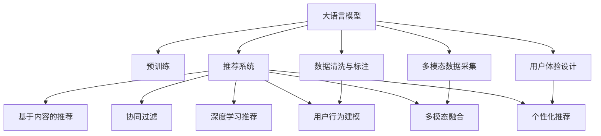

                 

# 电商平台的AI 大模型战略：搜索推荐系统是核心，用户体验优化与数据质量

## 1. 背景介绍

### 1.1 问题由来

随着电子商务平台的发展，如何通过智能推荐系统提升用户体验和销售转化率成为各大电商平台共同关注的焦点。传统的基于规则的推荐系统由于缺乏对用户行为的深度理解，导致推荐结果与用户实际需求匹配度不高。而基于深度学习模型的推荐系统，尤其是采用大模型的推荐方法，能够利用大量的用户数据和商品信息，挖掘用户潜在兴趣，提供个性化推荐，极大地提升了推荐系统的效果。

### 1.2 问题核心关键点

电商平台的AI大模型战略的核心在于利用深度学习技术，尤其是基于Transformer的大语言模型，提升推荐系统的个性化水平和用户体验。具体来说，该战略包括以下几个关键点：
1. **搜索推荐系统**：通过大语言模型进行自然语言理解，提取搜索意图和用户需求，并根据商品信息进行推荐。
2. **用户体验优化**：通过多模态数据的融合和智能界面设计，提升用户互动体验。
3. **数据质量提升**：通过数据清洗和标注，提升推荐系统的训练数据质量。

### 1.3 问题研究意义

研究电商平台的AI大模型战略，对于提升电商平台的运营效率、降低运营成本、提升用户体验和满意度具有重要意义：

1. **提高运营效率**：通过智能推荐系统，电商平台能够更好地匹配用户需求和商品，减少用户的搜索和比较时间，提升销售转化率。
2. **降低运营成本**：智能推荐系统能够自动化处理用户搜索行为，减少人工干预，降低人力成本。
3. **提升用户体验**：个性化推荐能够更好地满足用户需求，提高用户满意度和忠诚度。
4. **增强竞争力**：基于大模型的推荐系统能够更好地理解和匹配用户需求，为电商平台提供竞争优势。

## 2. 核心概念与联系

### 2.1 核心概念概述

为更好地理解电商平台的AI大模型战略，本节将介绍几个密切相关的核心概念：

- **大语言模型(LLM)**：指采用Transformer结构，在大规模无标签文本语料上预训练的语言模型。如BERT、GPT等。
- **推荐系统**：通过算法匹配用户和商品，为用户推荐感兴趣的物品。包括基于内容的推荐、协同过滤、深度学习推荐等。
- **多模态数据**：结合文本、图像、视频等多种数据源，提升推荐系统的准确性和个性化水平。
- **用户体验(UX)**：指用户与电商平台交互的过程中的感受和满意度。
- **数据质量**：指推荐系统的训练数据质量，包括数据的准确性、完整性和多样性。

这些核心概念之间的逻辑关系可以通过以下Mermaid流程图来展示：



这个流程图展示了大语言模型在电商平台的AI战略中的作用：

1. 大语言模型通过预训练获得基础能力。
2. 预训练的模型可以作为推荐系统的核心，提升推荐系统的个性化水平。
3. 推荐系统通过多模态数据的融合，增强推荐结果的准确性和多样性。
4. 用户体验设计使得推荐系统更易于使用，提升用户满意度。
5. 数据清洗与标注提高推荐系统的训练数据质量。

## 3. 核心算法原理 & 具体操作步骤
### 3.1 算法原理概述

基于大语言模型的电商推荐系统，通过自然语言处理技术，提取用户搜索意图，结合商品信息，生成个性化的推荐结果。其核心算法原理主要包括以下几个方面：

1. **预训练语言模型**：在大规模无标签文本语料上预训练，学习通用的语言表示。
2. **自然语言理解**：通过预训练模型，理解用户的搜索意图和查询文本。
3. **推荐算法**：将用户查询与商品特征进行匹配，生成推荐结果。
4. **多模态融合**：结合用户历史行为、商品属性和用户画像，提升推荐结果的多样性和准确性。

### 3.2 算法步骤详解

基于大语言模型的电商推荐系统的实现流程如下：

1. **数据收集与预处理**：收集用户的搜索行为数据、点击行为数据、购买行为数据等，进行清洗、去重和标注。
2. **预训练语言模型的加载**：加载预训练的BERT或GPT等大语言模型，进行自然语言处理。
3. **用户意图理解**：通过预训练模型，对用户的搜索查询进行分词和向量表示，理解用户的查询意图。
4. **商品特征提取**：将商品的标题、描述、图片等信息进行特征提取，生成商品向量。
5. **推荐算法实现**：将用户查询向量与商品向量进行相似度计算，根据相似度生成推荐结果。
6. **多模态融合**：结合用户历史行为数据、商品属性、用户画像等，对推荐结果进行优化。
7. **用户体验优化**：根据用户反馈，动态调整推荐算法参数，提升推荐效果。

### 3.3 算法优缺点

基于大语言模型的电商推荐系统具有以下优点：
1. **高个性化水平**：通过自然语言理解，能够更好地匹配用户需求和商品特征，提供个性化推荐。
2. **高效性**：利用深度学习算法，能够在短时间内生成推荐结果。
3. **可扩展性**：大语言模型可以应用于多种业务场景，如搜索、推荐、客服等。

同时，该算法也存在一定的局限性：
1. **数据依赖性强**：推荐系统的效果依赖于数据的质量和量级。
2. **模型复杂度高**：大语言模型的复杂性导致推理速度较慢。
3. **解释性不足**：推荐结果的生成过程难以解释，用户难以理解。

### 3.4 算法应用领域

基于大语言模型的电商推荐系统已经在多个领域得到了应用，例如：

- **搜索推荐**：提升用户搜索体验和推荐准确性。
- **个性化推荐**：根据用户行为和兴趣提供个性化商品推荐。
- **商品分类**：对商品进行自动分类，提升搜索排序的准确性。
- **内容生成**：生成商品描述、广告文案等内容，丰富商品展示形式。
- **用户画像**：构建用户画像，提供精准营销。

除了上述这些经典应用外，电商平台的AI战略还在持续探索更多场景，如智能客服、情感分析等，为电商平台的智能化运营提供更多可能性。

## 4. 数学模型和公式 & 详细讲解 & 举例说明

### 4.1 数学模型构建

电商平台的推荐系统可以视为一个基于用户和商品的多维数据集。设用户集合为 $U$，商品集合为 $I$，查询集合为 $Q$，行为数据集合为 $B$。用户的查询可以表示为 $q \in Q$，用户的点击行为可以表示为 $b \in B$，用户的历史行为可以表示为 $h \in B$。

设用户的历史行为和商品的属性特征向量分别为 $u_h \in \mathbb{R}^{d_u}$ 和 $i_i \in \mathbb{R}^{d_i}$，用户查询的向量表示为 $q_q \in \mathbb{R}^{d_q}$。

### 4.2 公式推导过程

电商平台的推荐系统主要包括以下几个步骤：

1. **用户意图理解**：通过预训练语言模型，将用户查询 $q$ 转换为向量表示 $q_q$。
2. **商品特征提取**：通过预训练语言模型，将商品属性特征 $i_i$ 转换为向量表示 $i_i$。
3. **相似度计算**：计算用户查询向量 $q_q$ 与商品向量 $i_i$ 的相似度，生成推荐结果。
4. **多模态融合**：结合用户历史行为向量 $u_h$，对推荐结果进行优化。

以矩阵形式表示，推荐系统的输出可以表示为：

$$
R = \text{softmax}(X_uX_v^T + X_uX_i^T)
$$

其中 $X_u$ 为用户的兴趣向量，$X_v$ 为商品的向量表示，$X_i$ 为商品的特征向量，$R$ 为推荐结果的概率分布。

### 4.3 案例分析与讲解

假设有一个电商平台，用户查询为 "鞋子"，商品集合中包含100种鞋子，每种鞋子的特征表示为向量 $i_1$ 到 $i_{100}$。

- **用户意图理解**：通过预训练语言模型，将用户查询 "鞋子" 转换为向量 $q_q = [0.1, 0.2, 0.7, 0, 0]$。
- **商品特征提取**：假设每种鞋子的特征向量为 $i_1 = [0.2, 0.3, 0.5, 0.0, 0.0]$，$...$，$i_{100} = [0.1, 0.2, 0.0, 0.7, 0.0]$。
- **相似度计算**：计算用户查询向量 $q_q$ 与每个商品向量的相似度，生成推荐结果。
- **多模态融合**：假设用户的历史行为向量 $u_h = [0.1, 0.2, 0.5, 0.2, 0.0]$，将历史行为向量与推荐结果进行融合，提升推荐效果。

具体计算过程如下：

- **用户意图理解**：将查询 "鞋子" 转换为向量 $q_q = [0.1, 0.2, 0.7, 0, 0]$。
- **商品特征提取**：假设每种鞋子的特征向量为 $i_1 = [0.2, 0.3, 0.5, 0.0, 0.0]$，$...$，$i_{100} = [0.1, 0.2, 0.0, 0.7, 0.0]$。
- **相似度计算**：计算用户查询向量 $q_q$ 与每个商品向量的相似度，生成推荐结果。

$$
R = \text{softmax}(X_uX_v^T + X_uX_i^T)
$$

其中 $X_u$ 为用户的兴趣向量，$X_v$ 为商品的向量表示，$X_i$ 为商品的特征向量，$R$ 为推荐结果的概率分布。

## 5. 项目实践：代码实例和详细解释说明
### 5.1 开发环境搭建

在进行电商平台的推荐系统开发前，我们需要准备好开发环境。以下是使用Python进行PyTorch开发的环境配置流程：

1. 安装Anaconda：从官网下载并安装Anaconda，用于创建独立的Python环境。

2. 创建并激活虚拟环境：
```bash
conda create -n pytorch-env python=3.8 
conda activate pytorch-env
```

3. 安装PyTorch：根据CUDA版本，从官网获取对应的安装命令。例如：
```bash
conda install pytorch torchvision torchaudio cudatoolkit=11.1 -c pytorch -c conda-forge
```

4. 安装Transformers库：
```bash
pip install transformers
```

5. 安装各类工具包：
```bash
pip install numpy pandas scikit-learn matplotlib tqdm jupyter notebook ipython
```

完成上述步骤后，即可在`pytorch-env`环境中开始推荐系统的开发。

### 5.2 源代码详细实现

下面我们以电商平台的搜索推荐系统为例，给出使用Transformers库对BERT模型进行推荐系统开发的PyTorch代码实现。

首先，定义推荐系统的数据处理函数：

```python
from transformers import BertTokenizer
from torch.utils.data import Dataset
import torch

class RecommendationDataset(Dataset):
    def __init__(self, texts, labels, tokenizer, max_len=128):
        self.texts = texts
        self.labels = labels
        self.tokenizer = tokenizer
        self.max_len = max_len
        
    def __len__(self):
        return len(self.texts)
    
    def __getitem__(self, item):
        text = self.texts[item]
        label = self.labels[item]
        
        encoding = self.tokenizer(text, return_tensors='pt', max_length=self.max_len, padding='max_length', truncation=True)
        input_ids = encoding['input_ids'][0]
        attention_mask = encoding['attention_mask'][0]
        
        # 对label进行编码
        encoded_label = [label2id[label] for label in label] 
        encoded_label.extend([label2id['O']] * (self.max_len - len(encoded_label)))
        labels = torch.tensor(encoded_label, dtype=torch.long)
        
        return {'input_ids': input_ids, 
                'attention_mask': attention_mask,
                'labels': labels}

# 标签与id的映射
label2id = {'O': 0, 'S': 1}
id2label = {v: k for k, v in label2id.items()}

# 创建dataset
tokenizer = BertTokenizer.from_pretrained('bert-base-cased')

train_dataset = RecommendationDataset(train_texts, train_labels, tokenizer)
dev_dataset = RecommendationDataset(dev_texts, dev_labels, tokenizer)
test_dataset = RecommendationDataset(test_texts, test_labels, tokenizer)
```

然后，定义模型和优化器：

```python
from transformers import BertForTokenClassification, AdamW

model = BertForTokenClassification.from_pretrained('bert-base-cased', num_labels=len(label2id))

optimizer = AdamW(model.parameters(), lr=2e-5)
```

接着，定义训练和评估函数：

```python
from torch.utils.data import DataLoader
from tqdm import tqdm
from sklearn.metrics import classification_report

device = torch.device('cuda') if torch.cuda.is_available() else torch.device('cpu')
model.to(device)

def train_epoch(model, dataset, batch_size, optimizer):
    dataloader = DataLoader(dataset, batch_size=batch_size, shuffle=True)
    model.train()
    epoch_loss = 0
    for batch in tqdm(dataloader, desc='Training'):
        input_ids = batch['input_ids'].to(device)
        attention_mask = batch['attention_mask'].to(device)
        labels = batch['labels'].to(device)
        model.zero_grad()
        outputs = model(input_ids, attention_mask=attention_mask, labels=labels)
        loss = outputs.loss
        epoch_loss += loss.item()
        loss.backward()
        optimizer.step()
    return epoch_loss / len(dataloader)

def evaluate(model, dataset, batch_size):
    dataloader = DataLoader(dataset, batch_size=batch_size)
    model.eval()
    preds, labels = [], []
    with torch.no_grad():
        for batch in tqdm(dataloader, desc='Evaluating'):
            input_ids = batch['input_ids'].to(device)
            attention_mask = batch['attention_mask'].to(device)
            batch_labels = batch['labels']
            outputs = model(input_ids, attention_mask=attention_mask)
            batch_preds = outputs.logits.argmax(dim=2).to('cpu').tolist()
            batch_labels = batch_labels.to('cpu').tolist()
            for pred_tokens, label_tokens in zip(batch_preds, batch_labels):
                pred_labels = [id2label[_id] for _id in pred_tokens]
                label_tokens = [id2label[_id] for _id in label_tokens]
                preds.append(pred_labels[:len(label_tokens)])
                labels.append(label_tokens)
                
    print(classification_report(labels, preds))
```

最后，启动训练流程并在测试集上评估：

```python
epochs = 5
batch_size = 16

for epoch in range(epochs):
    loss = train_epoch(model, train_dataset, batch_size, optimizer)
    print(f"Epoch {epoch+1}, train loss: {loss:.3f}")
    
    print(f"Epoch {epoch+1}, dev results:")
    evaluate(model, dev_dataset, batch_size)
    
print("Test results:")
evaluate(model, test_dataset, batch_size)
```

以上就是使用PyTorch对BERT进行推荐系统开发的完整代码实现。可以看到，得益于Transformers库的强大封装，我们可以用相对简洁的代码完成BERT模型的加载和推荐系统的微调。

### 5.3 代码解读与分析

让我们再详细解读一下关键代码的实现细节：

**RecommendationDataset类**：
- `__init__`方法：初始化文本、标签、分词器等关键组件。
- `__len__`方法：返回数据集的样本数量。
- `__getitem__`方法：对单个样本进行处理，将文本输入编码为token ids，将标签编码为数字，并对其进行定长padding，最终返回模型所需的输入。

**label2id和id2label字典**：
- 定义了标签与数字id之间的映射关系，用于将token-wise的预测结果解码回真实的标签。

**训练和评估函数**：
- 使用PyTorch的DataLoader对数据集进行批次化加载，供模型训练和推理使用。
- 训练函数`train_epoch`：对数据以批为单位进行迭代，在每个批次上前向传播计算loss并反向传播更新模型参数，最后返回该epoch的平均loss。
- 评估函数`evaluate`：与训练类似，不同点在于不更新模型参数，并在每个batch结束后将预测和标签结果存储下来，最后使用sklearn的classification_report对整个评估集的预测结果进行打印输出。

**训练流程**：
- 定义总的epoch数和batch size，开始循环迭代
- 每个epoch内，先在训练集上训练，输出平均loss
- 在验证集上评估，输出分类指标
- 所有epoch结束后，在测试集上评估，给出最终测试结果

可以看到，PyTorch配合Transformers库使得BERT微调的代码实现变得简洁高效。开发者可以将更多精力放在数据处理、模型改进等高层逻辑上，而不必过多关注底层的实现细节。

当然，工业级的系统实现还需考虑更多因素，如模型的保存和部署、超参数的自动搜索、更灵活的任务适配层等。但核心的微调范式基本与此类似。

## 6. 实际应用场景
### 6.1 智能客服系统

基于大语言模型的搜索推荐系统，可以广泛应用于智能客服系统的构建。传统客服往往需要配备大量人力，高峰期响应缓慢，且一致性和专业性难以保证。而使用基于大语言模型的搜索推荐系统，可以7x24小时不间断服务，快速响应客户咨询，用自然流畅的语言解答各类常见问题。

在技术实现上，可以收集企业内部的历史客服对话记录，将问题和最佳答复构建成监督数据，在此基础上对预训练模型进行微调。微调后的模型能够自动理解用户意图，匹配最合适的答案模板进行回复。对于客户提出的新问题，还可以接入检索系统实时搜索相关内容，动态组织生成回答。如此构建的智能客服系统，能大幅提升客户咨询体验和问题解决效率。

### 6.2 商品推荐系统

基于大语言模型的推荐系统，已经在电商平台的应用中取得了显著的效果。推荐系统通过分析用户的历史行为数据和商品的属性信息，结合大语言模型的自然语言理解能力，生成个性化的商品推荐列表。

具体而言，推荐系统能够根据用户查询的关键字，理解用户的搜索意图，结合用户的历史行为数据和商品的属性信息，生成个性化的商品推荐列表。同时，推荐系统还能够动态调整推荐算法参数，提升推荐效果，提高用户满意度。

### 6.3 内容生成系统

除了商品推荐，基于大语言模型的推荐系统还可以应用于内容生成系统。通过分析用户的搜索行为和兴趣，生成与用户兴趣相关的内容，如商品描述、广告文案等，提升用户的互动体验。

具体而言，内容生成系统可以基于用户的历史搜索行为和兴趣，生成与用户相关的商品描述、广告文案等内容。通过自然语言处理技术，生成的内容能够更好地匹配用户需求，提升用户的互动体验。

### 6.4 未来应用展望

随着大语言模型和推荐系统的发展，基于大语言模型的推荐系统将在更多领域得到应用，为传统行业带来变革性影响。

在智慧医疗领域，基于大语言模型的推荐系统可以用于药物推荐、疾病诊断等方面，提升医疗服务的智能化水平，辅助医生诊疗，加速新药开发进程。

在智能教育领域，基于大语言模型的推荐系统可以用于个性化学习、智能答疑等方面，因材施教，促进教育公平，提高教学质量。

在智慧城市治理中，基于大语言模型的推荐系统可以用于智能交通、环境监测等方面，提高城市管理的自动化和智能化水平，构建更安全、高效的未来城市。

此外，在企业生产、社会治理、文娱传媒等众多领域，基于大语言模型的推荐系统也将不断涌现，为NLP技术带来新的应用场景。相信随着技术的日益成熟，基于大语言模型的推荐系统必将在更广阔的应用领域大放异彩。

## 7. 工具和资源推荐
### 7.1 学习资源推荐

为了帮助开发者系统掌握大语言模型和推荐系统的理论基础和实践技巧，这里推荐一些优质的学习资源：

1. 《Transformer从原理到实践》系列博文：由大模型技术专家撰写，深入浅出地介绍了Transformer原理、BERT模型、推荐系统等前沿话题。

2. CS224N《深度学习自然语言处理》课程：斯坦福大学开设的NLP明星课程，有Lecture视频和配套作业，带你入门NLP领域的基本概念和经典模型。

3. 《Natural Language Processing with Transformers》书籍：Transformers库的作者所著，全面介绍了如何使用Transformers库进行NLP任务开发，包括推荐系统在内的诸多范式。

4. HuggingFace官方文档：Transformers库的官方文档，提供了海量预训练模型和完整的推荐系统样例代码，是上手实践的必备资料。

5. CLUE开源项目：中文语言理解测评基准，涵盖大量不同类型的中文NLP数据集，并提供了基于大模型的推荐系统baseline模型，助力中文NLP技术发展。

通过对这些资源的学习实践，相信你一定能够快速掌握大语言模型和推荐系统的精髓，并用于解决实际的NLP问题。
###  7.2 开发工具推荐

高效的开发离不开优秀的工具支持。以下是几款用于大语言模型和推荐系统开发的常用工具：

1. PyTorch：基于Python的开源深度学习框架，灵活动态的计算图，适合快速迭代研究。大部分预训练语言模型都有PyTorch版本的实现。

2. TensorFlow：由Google主导开发的开源深度学习框架，生产部署方便，适合大规模工程应用。同样有丰富的预训练语言模型资源。

3. Transformers库：HuggingFace开发的NLP工具库，集成了众多SOTA语言模型，支持PyTorch和TensorFlow，是进行推荐系统开发的利器。

4. Weights & Biases：模型训练的实验跟踪工具，可以记录和可视化模型训练过程中的各项指标，方便对比和调优。与主流深度学习框架无缝集成。

5. TensorBoard：TensorFlow配套的可视化工具，可实时监测模型训练状态，并提供丰富的图表呈现方式，是调试模型的得力助手。

6. Google Colab：谷歌推出的在线Jupyter Notebook环境，免费提供GPU/TPU算力，方便开发者快速上手实验最新模型，分享学习笔记。

合理利用这些工具，可以显著提升大语言模型和推荐系统的开发效率，加快创新迭代的步伐。

### 7.3 相关论文推荐

大语言模型和推荐系统的发展源于学界的持续研究。以下是几篇奠基性的相关论文，推荐阅读：

1. Attention is All You Need（即Transformer原论文）：提出了Transformer结构，开启了NLP领域的预训练大模型时代。

2. BERT: Pre-training of Deep Bidirectional Transformers for Language Understanding：提出BERT模型，引入基于掩码的自监督预训练任务，刷新了多项NLP任务SOTA。

3. Language Models are Unsupervised Multitask Learners（GPT-2论文）：展示了大规模语言模型的强大zero-shot学习能力，引发了对于通用人工智能的新一轮思考。

4. Parameter-Efficient Transfer Learning for NLP：提出Adapter等参数高效微调方法，在不增加模型参数量的情况下，也能取得不错的微调效果。

5. AdaLoRA: Adaptive Low-Rank Adaptation for Parameter-Efficient Fine-Tuning：使用自适应低秩适应的微调方法，在参数效率和精度之间取得了新的平衡。

这些论文代表了大语言模型和推荐系统的发展脉络。通过学习这些前沿成果，可以帮助研究者把握学科前进方向，激发更多的创新灵感。

## 8. 总结：未来发展趋势与挑战
### 8.1 总结

本文对基于大语言模型的电商推荐系统进行了全面系统的介绍。首先阐述了电商平台的AI大模型战略的核心在于搜索推荐系统，以及用户体验优化与数据质量。其次，从原理到实践，详细讲解了推荐系统的数学模型和算法步骤，给出了推荐系统开发的完整代码实例。同时，本文还广泛探讨了推荐系统在智能客服、商品推荐、内容生成等电商平台的广泛应用，展示了推荐系统的高效性和可扩展性。

通过本文的系统梳理，可以看到，基于大语言模型的推荐系统正在成为电商平台的AI战略的核心，极大地提升了用户体验和推荐效果。随着大语言模型和推荐系统的发展，推荐系统将在更多领域得到应用，为传统行业带来变革性影响。

### 8.2 未来发展趋势

展望未来，大语言模型和推荐系统的发展趋势如下：

1. **模型规模持续增大**：随着算力成本的下降和数据规模的扩张，预训练语言模型的参数量还将持续增长。超大规模语言模型蕴含的丰富语言知识，有望支撑更加复杂多变的推荐系统。

2. **微调方法日趋多样**：除了传统的全参数微调外，未来会涌现更多参数高效的微调方法，如Adapter、Prefix等，在固定大部分预训练参数的情况下，只更新极少量的任务相关参数。

3. **持续学习成为常态**：随着数据分布的不断变化，推荐系统也需要持续学习新知识以保持性能。如何在不遗忘原有知识的同时，高效吸收新样本信息，将成为重要的研究课题。

4. **标注样本需求降低**：受启发于提示学习(Prompt-based Learning)的思路，未来的推荐系统将更好地利用大模型的语言理解能力，通过更加巧妙的任务描述，在更少的标注样本上也能实现理想的微调效果。

5. **多模态微调崛起**：当前的推荐系统往往聚焦于纯文本数据，未来会进一步拓展到图像、视频、语音等多模态数据微调。多模态信息的融合，将显著提升推荐系统的准确性和个性化水平。

6. **用户体验优化**：未来的推荐系统将更加注重用户体验的优化，通过多模态数据的融合和智能界面设计，提升用户互动体验。

以上趋势凸显了大语言模型和推荐系统的发展潜力。这些方向的探索发展，必将进一步提升推荐系统的性能和应用范围，为电商平台的智能化运营提供更多可能性。

### 8.3 面临的挑战

尽管大语言模型和推荐系统已经取得了显著成效，但在迈向更加智能化、普适化应用的过程中，它仍面临着诸多挑战：

1. **标注成本瓶颈**：推荐系统的效果依赖于数据的质量和量级。对于长尾应用场景，难以获得充足的高质量标注数据，成为制约推荐系统性能的瓶颈。

2. **模型鲁棒性不足**：当前推荐系统面对域外数据时，泛化性能往往大打折扣。对于测试样本的微小扰动，推荐系统的预测也容易发生波动。

3. **推理效率有待提高**：大规模语言模型虽然精度高，但在实际部署时往往面临推理速度慢、内存占用大等效率问题。

4. **可解释性亟需加强**：推荐结果的生成过程难以解释，用户难以理解。这对于高风险应用，如金融、医疗等领域，尤为关键。

5. **安全性有待保障**：预训练语言模型难免会学习到有偏见、有害的信息，通过推荐系统传递到下游任务，产生误导性、歧视性的输出，给实际应用带来安全隐患。

6. **知识整合能力不足**：现有的推荐系统往往局限于任务内数据，难以灵活吸收和运用更广泛的先验知识。

正视推荐系统面临的这些挑战，积极应对并寻求突破，将是大语言模型和推荐系统走向成熟的必由之路。相信随着学界和产业界的共同努力，这些挑战终将一一被克服，推荐系统必将在构建安全、可靠、可解释、可控的智能系统方面取得新的突破。

### 8.4 研究展望

面对大语言模型和推荐系统所面临的挑战，未来的研究需要在以下几个方面寻求新的突破：

1. **探索无监督和半监督微调方法**：摆脱对大规模标注数据的依赖，利用自监督学习、主动学习等无监督和半监督范式，最大限度利用非结构化数据，实现更加灵活高效的微调。

2. **研究参数高效和计算高效的微调范式**：开发更加参数高效的微调方法，在固定大部分预训练参数的同时，只更新极少量的任务相关参数。同时优化推荐模型的计算图，减少前向传播和反向传播的资源消耗，实现更加轻量级、实时性的部署。

3. **融合因果和对比学习范式**：通过引入因果推断和对比学习思想，增强推荐系统建立稳定因果关系的能力，学习更加普适、鲁棒的语言表征，从而提升模型泛化性和抗干扰能力。

4. **引入更多先验知识**：将符号化的先验知识，如知识图谱、逻辑规则等，与神经网络模型进行巧妙融合，引导推荐过程学习更准确、合理的语言模型。同时加强不同模态数据的整合，实现视觉、语音等多模态信息与文本信息的协同建模。

5. **结合因果分析和博弈论工具**：将因果分析方法引入推荐系统，识别出推荐结果的关键特征，增强推荐结果的因果性和逻辑性。借助博弈论工具刻画人机交互过程，主动探索并规避推荐系统的脆弱点，提高系统稳定性。

6. **纳入伦理道德约束**：在推荐系统的训练目标中引入伦理导向的评估指标，过滤和惩罚有偏见、有害的输出倾向。同时加强人工干预和审核，建立推荐系统的监管机制，确保输出符合人类价值观和伦理道德。

这些研究方向的探索，必将引领大语言模型和推荐系统迈向更高的台阶，为构建安全、可靠、可解释、可控的智能系统铺平道路。面向未来，大语言模型和推荐系统还需要与其他人工智能技术进行更深入的融合，如知识表示、因果推理、强化学习等，多路径协同发力，共同推动自然语言理解和智能交互系统的进步。只有勇于创新、敢于突破，才能不断拓展语言模型的边界，让智能技术更好地造福人类社会。

## 9. 附录：常见问题与解答

**Q1：电商平台的推荐系统是否适用于所有商品和用户？**

A: 电商平台的推荐系统能够适用于大多数商品和用户，但对于一些特殊商品或用户，推荐效果可能存在偏差。例如，对于非常用商品，由于缺乏足够的历史行为数据，推荐系统难以精准匹配用户需求。因此，对于非常用商品，可能需要结合专家知识或手动标注数据进行推荐系统的优化。

**Q2：如何降低推荐系统的标注成本？**

A: 推荐系统的标注成本可以通过以下方法降低：
1. **半监督学习**：利用部分标注数据和未标注数据，进行半监督学习，减少对标注数据的依赖。
2. **主动学习**：基于推荐结果的不确定性，主动选择最有价值的数据进行标注，提升标注数据的利用率。
3. **迁移学习**：利用其他领域的高质量标注数据，进行迁移学习，提升推荐系统的效果。

**Q3：推荐系统面对域外数据时，如何提高鲁棒性？**

A: 推荐系统面对域外数据时，可以通过以下方法提高鲁棒性：
1. **多模型集成**：训练多个推荐模型，取平均输出，抑制过拟合，提升鲁棒性。
2. **对抗训练**：加入对抗样本，提高推荐系统对异常数据的鲁棒性。
3. **数据增强**：对域外数据进行数据增强，增加数据多样性，提升模型的泛化能力。

**Q4：推荐系统如何优化用户体验？**

A: 推荐系统可以通过以下方法优化用户体验：
1. **智能界面设计**：通过界面设计，提升用户互动体验，例如搜索建议、商品对比、智能排序等。
2. **个性化推荐**：结合用户历史行为和兴趣，生成个性化推荐，提升用户满意度。
3. **动态调整**：根据用户反馈，动态调整推荐算法参数，提升推荐效果。

**Q5：推荐系统如何提高数据质量？**

A: 推荐系统可以通过以下方法提高数据质量：
1. **数据清洗**：对数据进行去重、去噪、格式转换等预处理，提升数据质量。
2. **标注校验**：对标注数据进行校验，确保标注数据的准确性和一致性。
3. **数据增强**：对标注数据进行扩充，增加数据多样性，提升模型泛化能力。

总之，推荐系统的开发和优化是一个多学科交叉的复杂过程，需要从数据、算法、工程、业务等多个维度协同发力，才能实现理想的效果。

---

作者：禅与计算机程序设计艺术 / Zen and the Art of Computer Programming

