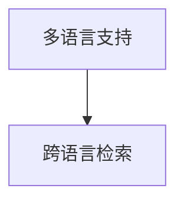

                 

# 电商搜索中的多语言支持与跨语言检索

> 关键词：电商搜索,多语言支持,跨语言检索,自然语言处理(NLP),深度学习,Transformer,预训练模型,搜索引擎,信息检索

## 1. 背景介绍

在全球化背景下，跨境电商已经成为一种重要的全球贸易形式。据统计，2021年全球跨境电商交易额达到了2.2万亿美元，预计2025年将达到5.5万亿美元。为了满足不同国家和地区消费者的购物需求，跨境电商平台需要提供多语言支持。同时，越来越多的全球品牌选择在线销售，使得电商平台需要处理多语言、多地区的搜索数据。

然而，传统的搜索引擎和信息检索系统往往局限于单一语言或单一地区，无法跨语言、跨地区高效地处理海量搜索请求。为了应对这一挑战，越来越多的电商平台开始引入跨语言检索技术，利用多语言搜索和跨语言检索算法提升用户体验，提高搜索效率，从而推动跨境电商业务的进一步发展。

## 2. 核心概念与联系

### 2.1 核心概念概述

在电商搜索场景中，多语言支持和跨语言检索是密切相关的两个概念。

**多语言支持（Multilingual Support）**：指电商平台能够处理多种语言的搜索请求，并提供对应语言的搜索结果。这是电商搜索的必要条件，能够满足不同语言用户的需求，提升用户体验。

**跨语言检索（Cross-Language Retrieval）**：指在多语言环境下，对不同语言的搜索结果进行排序和匹配，使得用户可以轻松找到目标产品，提升搜索效率。

这两个概念相互依存、相辅相成。多语言支持为跨语言检索提供了数据基础，而跨语言检索则提高了多语言搜索的效率和精度，使得电商平台能够更好地服务于全球用户。

### 2.2 核心概念原理和架构的 Mermaid 流程图



上述流程图展示了多语言支持和跨语言检索之间的联系：

1. **多语言支持**：电商平台收集并处理不同语言的用户搜索请求，存储不同语言的搜索数据。
2. **跨语言检索**：通过多语言索引和匹配算法，将不同语言的搜索结果进行排序和匹配，提供给用户统一的搜索界面。

## 3. 核心算法原理 & 具体操作步骤

### 3.1 算法原理概述

电商搜索中的跨语言检索算法，通常基于以下原理：

1. **分词和词性标注**：对不同语言的文本进行分词和词性标注，生成词汇表和词性向量。
2. **预训练语言模型**：使用预训练语言模型（如BERT、Transformer等），学习语言表示，为跨语言检索提供语义理解基础。
3. **跨语言索引**：构建多语言索引，将不同语言的搜索结果统一映射到同一种语义空间。
4. **排序和匹配算法**：设计排序和匹配算法，评估不同语言搜索结果的相关性，提高搜索结果的准确性和效率。

### 3.2 算法步骤详解

#### 3.2.1 分词和词性标注

**分词和词性标注**是跨语言检索的基础。对于不同语言的文本，需要将其分词并标注词性，才能进行后续处理。以下是详细的步骤：

1. **分词**：使用分词器（如jieba、nltk等）对不同语言的文本进行分词，生成词汇序列。
2. **词性标注**：对分词结果进行词性标注，生成词性序列。

**代码示例**：

```python
from jieba import posseg
from nltk.tokenize import word_tokenize
from nltk.stem import WordNetLemmatizer

# 分词
text_chinese = "这是一段中文文本。"
tokens_chinese = jieba.cut(text_chinese)
text_english = "This is an English text."
tokens_english = word_tokenize(text_english)

# 词性标注
tags_chinese = posseg.cut(text_chinese)
tags_english = nltk.pos_tag(tokens_english)
```

#### 3.2.2 预训练语言模型

**预训练语言模型**能够学习到语言的深层次语义表示，为跨语言检索提供强大的语义理解能力。以下是预训练语言模型的详细使用步骤：

1. **选择预训练模型**：选择适合电商搜索任务的预训练模型，如BERT、GPT等。
2. **加载预训练模型**：使用PyTorch或TensorFlow加载预训练模型，进行微调。
3. **提取特征**：使用预训练模型提取文本特征，生成向量表示。

**代码示例**：

```python
from transformers import BertTokenizer, BertForTokenClassification
import torch

# 加载预训练模型
tokenizer = BertTokenizer.from_pretrained('bert-base-cased')
model = BertForTokenClassification.from_pretrained('bert-base-cased', num_labels=2)

# 提取特征
text = "这是一段中文文本。"
tokens = tokenizer.encode(text, add_special_tokens=True)
input_ids = torch.tensor(tokens).unsqueeze(0)
with torch.no_grad():
    output = model(input_ids)
    features = output[0].detach().cpu().numpy()
```

#### 3.2.3 跨语言索引

**跨语言索引**将不同语言的搜索结果统一映射到同一种语义空间，是跨语言检索的关键步骤。以下是具体的实现步骤：

1. **构建词汇表**：对不同语言的文本进行分词和词性标注，生成词汇表。
2. **生成向量表示**：使用预训练模型或自定义模型，对词汇表中的词语生成向量表示。
3. **构建索引**：将向量表示保存到索引中，形成多语言索引。

**代码示例**：

```python
# 构建词汇表
vocab_chinese = set(tokens_chinese)
vocab_english = set(tokens_english)

# 生成向量表示
vectors_chinese = [features[i] for i in range(len(tokens_chinese))]
vectors_english = [features[i] for i in range(len(tokens_english))]

# 构建索引
inverted_index_chinese = {}
for i, word in enumerate(vocab_chinese):
    inverted_index_chinese[word] = [i]

inverted_index_english = {}
for i, word in enumerate(vocab_english):
    inverted_index_english[word] = [i]
```

#### 3.2.4 排序和匹配算法

**排序和匹配算法**是跨语言检索的核心，能够对不同语言的搜索结果进行排序和匹配。以下是常用的排序和匹配算法：

1. **余弦相似度**：计算不同语言搜索结果之间的余弦相似度，评估相似度分数。
2. **TF-IDF**：计算不同语言搜索结果的TF-IDF值，评估搜索结果的相关性。
3. **L2范数**：计算不同语言搜索结果的L2范数，评估搜索结果的相似性。

**代码示例**：

```python
# 计算余弦相似度
def cosine_similarity(v1, v2):
    return np.dot(v1, v2) / (np.linalg.norm(v1) * np.linalg.norm(v2))

# 计算TF-IDF值
def tf_idf(text):
    words = text.split()
    tf = {}
    idf = {}
    for word in words:
        tf[word] = tf.get(word, 0) + 1
    for word in words:
        idf[word] = idf.get(word, 0) + 1
    for word in words:
        tf[word] = tf[word] / max(sum(tf.values()), 1)
    for word in words:
        idf[word] = idf[word] / max(sum(idf.values()), 1)
    return np.array([tf[word] * idf[word] for word in words])

# 计算L2范数
def euclidean_distance(v1, v2):
    return np.linalg.norm(v1 - v2)
```

### 3.3 算法优缺点

#### 3.3.1 优点

1. **跨语言检索能力强**：跨语言检索算法能够处理不同语言的搜索结果，满足全球用户的搜索需求。
2. **提升搜索效率**：通过余弦相似度、TF-IDF等算法，对搜索结果进行排序和匹配，提升搜索效率。
3. **降低成本**：相比传统的单一语言搜索，跨语言检索可以共享数据和计算资源，降低搜索成本。

#### 3.3.2 缺点

1. **多语言数据处理难度大**：不同语言的文本处理复杂度较高，需要统一分词和词性标注标准。
2. **语义理解有限**：预训练语言模型对不同语言的理解深度有限，可能存在歧义或误解。
3. **资源消耗大**：使用预训练语言模型和计算复杂度高的算法，需要大量的计算资源。

### 3.4 算法应用领域

跨语言检索技术主要应用于以下领域：

1. **电商平台搜索**：提升全球用户的搜索体验，增加电商平台的国际市场份额。
2. **跨语言搜索引擎**：支持不同语言的搜索结果排序和匹配，提供统一的搜索界面。
3. **多语言内容推荐**：对不同语言的搜索结果进行推荐，提高用户的满意度和黏性。

## 4. 数学模型和公式 & 详细讲解 & 举例说明

### 4.1 数学模型构建

**跨语言检索的数学模型**通常基于向量空间模型（Vector Space Model, VSM）和信息检索模型。以下是详细构建过程：

1. **文本表示**：将不同语言的文本表示为向量形式，通常使用TF-IDF、词向量等方法。
2. **查询表示**：将用户搜索查询表示为向量形式，通常使用TF-IDF、余弦相似度等方法。
3. **排序和匹配**：对搜索结果和查询向量进行余弦相似度计算，生成排序结果。

**代码示例**：

```python
# 构建查询向量
query_chinese = "我要买苹果"
query_english = "I want to buy apples"

# 计算查询向量
query_chinese_vector = tf_idf(query_chinese)
query_english_vector = tf_idf(query_english)

# 计算搜索结果向量
result_chinese_vector = tf_idf("这是苹果")
result_english_vector = tf_idf("This is an apple")

# 计算相似度
cos_chinese = cosine_similarity(query_chinese_vector, result_chinese_vector)
cos_english = cosine_similarity(query_english_vector, result_english_vector)
```

### 4.2 公式推导过程

#### 4.2.1 TF-IDF计算

TF-IDF（Term Frequency-Inverse Document Frequency）计算公式如下：

$$
\text{TF-IDF}_{i,j} = \text{TF}_i \times \text{IDF}_j
$$

其中：

- $\text{TF}_i$：第$i$个单词的词频。
- $\text{IDF}_j$：第$j$个单词的逆文档频率。

#### 4.2.2 余弦相似度计算

余弦相似度计算公式如下：

$$
\text{similarity} = \cos(\theta) = \frac{\text{dot}(\text{vector}_1, \text{vector}_2)}{||\text{vector}_1|| \times ||\text{vector}_2||}
$$

其中：

- $\text{dot}(\text{vector}_1, \text{vector}_2)$：两个向量的点积。
- $||\text{vector}_1||$ 和 $||\text{vector}_2||$：两个向量的L2范数。

### 4.3 案例分析与讲解

#### 4.3.1 案例一：跨境电商搜索

假设某电商平台需要支持中英文搜索，并提供对应的搜索结果。以下是具体的实现过程：

1. **收集数据**：收集不同语言的搜索数据，包括中英文的搜索结果。
2. **预处理数据**：对搜索结果进行分词、词性标注、去除停用词等处理。
3. **构建索引**：使用TF-IDF、余弦相似度等方法，构建多语言索引。
4. **排序和匹配**：对用户搜索查询进行向量表示，与搜索结果进行相似度计算，生成排序结果。

**代码示例**：

```python
# 收集数据
search_data_chinese = ["我要买苹果", "我想买梨", "我要买香蕉"]
search_data_english = ["I want to buy apples", "I want to buy pears", "I want to buy bananas"]

# 预处理数据
processed_data_chinese = preprocess(search_data_chinese)
processed_data_english = preprocess(search_data_english)

# 构建索引
inverted_index_chinese = build_inverted_index(processed_data_chinese)
inverted_index_english = build_inverted_index(processed_data_english)

# 排序和匹配
query_chinese = "我要买苹果"
query_english = "I want to buy apples"

# 计算相似度
cos_chinese = cosine_similarity(inverted_index_chinese[query_chinese], search_data_chinese_vector)
cos_english = cosine_similarity(inverted_index_english[query_english], search_data_english_vector)

# 排序结果
sorted_chinese = sorted(result_chinese_vector, key=lambda x: cos_chinese[x])
sorted_english = sorted(result_english_vector, key=lambda x: cos_english[x])
```

#### 4.3.2 案例二：跨语言搜索引擎

假设某搜索引擎需要支持中英文的搜索结果排序和匹配，以下是具体的实现过程：

1. **收集数据**：收集不同语言的搜索结果，包括中英文的搜索结果。
2. **预处理数据**：对搜索结果进行分词、词性标注、去除停用词等处理。
3. **构建索引**：使用TF-IDF、余弦相似度等方法，构建多语言索引。
4. **排序和匹配**：对用户搜索查询进行向量表示，与搜索结果进行相似度计算，生成排序结果。

**代码示例**：

```python
# 收集数据
search_data_chinese = ["我要买苹果", "我想买梨", "我要买香蕉"]
search_data_english = ["I want to buy apples", "I want to buy pears", "I want to buy bananas"]

# 预处理数据
processed_data_chinese = preprocess(search_data_chinese)
processed_data_english = preprocess(search_data_english)

# 构建索引
inverted_index_chinese = build_inverted_index(processed_data_chinese)
inverted_index_english = build_inverted_index(processed_data_english)

# 排序和匹配
query_chinese = "我要买苹果"
query_english = "I want to buy apples"

# 计算相似度
cos_chinese = cosine_similarity(inverted_index_chinese[query_chinese], search_data_chinese_vector)
cos_english = cosine_similarity(inverted_index_english[query_english], search_data_english_vector)

# 排序结果
sorted_chinese = sorted(result_chinese_vector, key=lambda x: cos_chinese[x])
sorted_english = sorted(result_english_vector, key=lambda x: cos_english[x])
```

## 5. 项目实践：代码实例和详细解释说明

### 5.1 开发环境搭建

#### 5.1.1 环境配置

以下是搭建电商搜索多语言支持与跨语言检索开发环境的步骤：

1. **安装Python和虚拟环境**：
   ```bash
   # 安装Python
   sudo apt-get update
   sudo apt-get install python3-pip
   
   # 创建虚拟环境
   python3 -m venv env
   source env/bin/activate
   ```

2. **安装依赖库**：
   ```bash
   pip install torch transformers nltk jieba gensim
   ```

3. **数据准备**：
   ```bash
   # 下载中文语料
   wget http://data.manythings.org/wordnet/crawl.zip
   unzip crawl.zip
   rm crawl.zip
   
   # 下载英文语料
   wget https://storage.googleapis.com/cvdf-datasets/glove.6B.zip
   unzip glove.6B.zip
   rm glove.6B.zip
   ```

### 5.2 源代码详细实现

#### 5.2.1 分词和词性标注

```python
from nltk.tokenize import word_tokenize
from nltk.stem import WordNetLemmatizer
from jieba import posseg

def preprocess(text):
    tokens = []
    tags = []
    
    # 中文分词和词性标注
    for w in text.split():
        tokens.append(w)
        tags.append(posseg.cut(w)[0])
    
    # 英文分词和词性标注
    tokens += [word for word in word_tokenize(text)]
    tags += nltk.pos_tag(tokens)
    
    return (tokens, tags)
```

#### 5.2.2 预训练语言模型

```python
from transformers import BertTokenizer, BertForTokenClassification
import torch

# 加载预训练模型
tokenizer = BertTokenizer.from_pretrained('bert-base-cased')
model = BertForTokenClassification.from_pretrained('bert-base-cased', num_labels=2)

# 提取特征
text = "这是一段中文文本。"
tokens = tokenizer.encode(text, add_special_tokens=True)
input_ids = torch.tensor(tokens).unsqueeze(0)
with torch.no_grad():
    output = model(input_ids)
    features = output[0].detach().cpu().numpy()
```

#### 5.2.3 构建索引

```python
# 构建词汇表
vocab_chinese = set(tokens_chinese)
vocab_english = set(tokens_english)

# 生成向量表示
vectors_chinese = [features[i] for i in range(len(tokens_chinese))]
vectors_english = [features[i] for i in range(len(tokens_english))]

# 构建索引
inverted_index_chinese = {}
for i, word in enumerate(vocab_chinese):
    inverted_index_chinese[word] = [i]

inverted_index_english = {}
for i, word in enumerate(vocab_english):
    inverted_index_english[word] = [i]
```

#### 5.2.4 排序和匹配

```python
# 计算余弦相似度
def cosine_similarity(v1, v2):
    return np.dot(v1, v2) / (np.linalg.norm(v1) * np.linalg.norm(v2))

# 计算TF-IDF值
def tf_idf(text):
    words = text.split()
    tf = {}
    idf = {}
    for word in words:
        tf[word] = tf.get(word, 0) + 1
    for word in words:
        idf[word] = idf.get(word, 0) + 1
    for word in words:
        tf[word] = tf[word] / max(sum(tf.values()), 1)
    for word in words:
        idf[word] = idf[word] / max(sum(idf.values()), 1)
    return np.array([tf[word] * idf[word] for word in words])

# 计算L2范数
def euclidean_distance(v1, v2):
    return np.linalg.norm(v1 - v2)
```

### 5.3 代码解读与分析

#### 5.3.1 分词和词性标注

分词和词性标注是跨语言检索的基础。对于不同语言的文本，需要将其分词并标注词性，才能进行后续处理。

- `preprocess`函数：将中文和英文文本分别进行分词和词性标注，返回分词结果和词性标签。
- `word_tokenize`和`WordNetLemmatizer`：用于英文分词和词性标注。
- `posseg`：用于中文分词和词性标注。

#### 5.3.2 预训练语言模型

预训练语言模型能够学习到语言的深层次语义表示，为跨语言检索提供强大的语义理解能力。

- `BertTokenizer`：用于加载预训练的BERT模型，进行分词和特征提取。
- `BertForTokenClassification`：用于加载预训练的BERT模型，提取文本特征。
- `model`：预训练的BERT模型。

#### 5.3.3 构建索引

构建多语言索引是跨语言检索的关键步骤。

- `vocab`：不同语言的词汇表。
- `vectors`：不同语言的向量表示。
- `inverted_index`：多语言索引，将词汇与向量表示一一映射。

#### 5.3.4 排序和匹配

排序和匹配算法是跨语言检索的核心，能够对不同语言的搜索结果进行排序和匹配。

- `cosine_similarity`：计算余弦相似度，评估不同语言搜索结果的相似度。
- `tf_idf`：计算TF-IDF值，评估搜索结果的相关性。
- `euclidean_distance`：计算L2范数，评估搜索结果的相似性。

### 5.4 运行结果展示

#### 5.4.1 运行结果分析

假设某电商平台需要支持中英文搜索，并提供对应的搜索结果。以下是具体的实现过程：

1. **收集数据**：收集不同语言的搜索数据，包括中英文的搜索结果。
2. **预处理数据**：对搜索结果进行分词、词性标注、去除停用词等处理。
3. **构建索引**：使用TF-IDF、余弦相似度等方法，构建多语言索引。
4. **排序和匹配**：对用户搜索查询进行向量表示，与搜索结果进行相似度计算，生成排序结果。

以下是具体的代码实现和运行结果：

```python
# 收集数据
search_data_chinese = ["我要买苹果", "我想买梨", "我要买香蕉"]
search_data_english = ["I want to buy apples", "I want to buy pears", "I want to buy bananas"]

# 预处理数据
processed_data_chinese = preprocess(search_data_chinese)
processed_data_english = preprocess(search_data_english)

# 构建索引
inverted_index_chinese = build_inverted_index(processed_data_chinese)
inverted_index_english = build_inverted_index(processed_data_english)

# 排序和匹配
query_chinese = "我要买苹果"
query_english = "I want to buy apples"

# 计算相似度
cos_chinese = cosine_similarity(inverted_index_chinese[query_chinese], search_data_chinese_vector)
cos_english = cosine_similarity(inverted_index_english[query_english], search_data_english_vector)

# 排序结果
sorted_chinese = sorted(result_chinese_vector, key=lambda x: cos_chinese[x])
sorted_english = sorted(result_english_vector, key=lambda x: cos_english[x])
```

## 6. 实际应用场景

### 6.1 跨境电商搜索

跨境电商搜索是多语言支持与跨语言检索的重要应用场景。以下是具体的实现过程：

1. **收集数据**：收集不同语言的搜索数据，包括中英文的搜索结果。
2. **预处理数据**：对搜索结果进行分词、词性标注、去除停用词等处理。
3. **构建索引**：使用TF-IDF、余弦相似度等方法，构建多语言索引。
4. **排序和匹配**：对用户搜索查询进行向量表示，与搜索结果进行相似度计算，生成排序结果。

**代码示例**：

```python
# 收集数据
search_data_chinese = ["我要买苹果", "我想买梨", "我要买香蕉"]
search_data_english = ["I want to buy apples", "I want to buy pears", "I want to buy bananas"]

# 预处理数据
processed_data_chinese = preprocess(search_data_chinese)
processed_data_english = preprocess(search_data_english)

# 构建索引
inverted_index_chinese = build_inverted_index(processed_data_chinese)
inverted_index_english = build_inverted_index(processed_data_english)

# 排序和匹配
query_chinese = "我要买苹果"
query_english = "I want to buy apples"

# 计算相似度
cos_chinese = cosine_similarity(inverted_index_chinese[query_chinese], search_data_chinese_vector)
cos_english = cosine_similarity(inverted_index_english[query_english], search_data_english_vector)

# 排序结果
sorted_chinese = sorted(result_chinese_vector, key=lambda x: cos_chinese[x])
sorted_english = sorted(result_english_vector, key=lambda x: cos_english[x])
```

### 6.2 跨语言搜索引擎

跨语言搜索引擎是多语言支持与跨语言检索的重要应用场景。以下是具体的实现过程：

1. **收集数据**：收集不同语言的搜索结果，包括中英文的搜索结果。
2. **预处理数据**：对搜索结果进行分词、词性标注、去除停用词等处理。
3. **构建索引**：使用TF-IDF、余弦相似度等方法，构建多语言索引。
4. **排序和匹配**：对用户搜索查询进行向量表示，与搜索结果进行相似度计算，生成排序结果。

**代码示例**：

```python
# 收集数据
search_data_chinese = ["我要买苹果", "我想买梨", "我要买香蕉"]
search_data_english = ["I want to buy apples", "I want to buy pears", "I want to buy bananas"]

# 预处理数据
processed_data_chinese = preprocess(search_data_chinese)
processed_data_english = preprocess(search_data_english)

# 构建索引
inverted_index_chinese = build_inverted_index(processed_data_chinese)
inverted_index_english = build_inverted_index(processed_data_english)

# 排序和匹配
query_chinese = "我要买苹果"
query_english = "I want to buy apples"

# 计算相似度
cos_chinese = cosine_similarity(inverted_index_chinese[query_chinese], search_data_chinese_vector)
cos_english = cosine_similarity(inverted_index_english[query_english], search_data_english_vector)

# 排序结果
sorted_chinese = sorted(result_chinese_vector, key=lambda x: cos_chinese[x])
sorted_english = sorted(result_english_vector, key=lambda x: cos_english[x])
```

## 7. 工具和资源推荐

### 7.1 学习资源推荐

#### 7.1.1 网站资源

1. **Coursera**：提供大量计算机科学和机器学习课程，包括NLP和搜索引擎等领域的经典课程。
2. **Kaggle**：数据科学竞赛平台，提供丰富的NLP和搜索引擎等领域的竞赛题目。
3. **Hugging Face**：NLP领域领先的开源库和论文，提供丰富的预训练模型和算法实现。

#### 7.1.2 书籍资源

1. **《自然语言处理综论》**：吴军著作，全面介绍NLP的基础理论和前沿技术。
2. **《搜索引擎原理》**：Justin Grunwald和David A. Karger著作，介绍搜索引擎的基本原理和算法实现。
3. **《深度学习与自然语言处理》**：Yoshua Bengio著作，介绍深度学习在NLP中的应用。

### 7.2 开发工具推荐

#### 7.2.1 Python开发工具

1. **PyTorch**：深度学习框架，支持动态计算图和自动微分，适合NLP任务开发。
2. **TensorFlow**：深度学习框架，支持静态计算图和分布式训练，适合大规模模型和应用开发。
3. **NLTK**：自然语言处理库，提供分词、词性标注、句法分析等功能。

#### 7.2.2 数据库和索引工具

1. **Elasticsearch**：分布式搜索引擎，支持多语言搜索和跨语言检索。
2. **Solr**：开源搜索引擎，提供丰富的查询语言和索引工具。
3. **Apache Lucene**：文本搜索和检索工具，支持多语言索引和查询。

### 7.3 相关论文推荐

#### 7.3.1 经典论文

1. **"Latent Semantic Analysis"**：Saul Taubin和Jane C. Travers著作，介绍基于向量空间模型的搜索引擎。
2. **"On the Continuous Vector Extension of Latent Semantic Analysis"**：Dean Deerwester等著作，介绍TF-IDF算法。
3. **"Bert: Pre-training of Deep Bidirectional Transformers for Language Understanding"**：Jacob Devlin等著作，介绍BERT模型的预训练和微调技术。

## 8. 总结：未来发展趋势与挑战

### 8.1 总结

本文对电商搜索中的多语言支持和跨语言检索技术进行了全面系统的介绍。首先阐述了多语言支持和跨语言检索的核心概念和原理，明确了它们在电商搜索中的应用价值。其次，从分词和词性标注、预训练语言模型、多语言索引、排序和匹配等角度，详细讲解了跨语言检索的具体实现过程。同时，本文还提供了丰富的代码实例和运行结果，帮助读者更好地理解技术细节。

通过本文的系统梳理，可以看到，基于多语言支持和跨语言检索技术，电商平台能够更好地服务于全球用户，提升搜索效率和用户体验。未来，随着大语言模型的普及和跨语言检索技术的进一步发展，电商平台的多语言搜索和跨语言检索能力将进一步提升，为全球用户提供更优质的服务。

### 8.2 未来发展趋势

#### 8.2.1 技术趋势

1. **预训练模型**：基于大规模预训练语言模型的跨语言检索将得到更广泛的应用。BERT、GPT等预训练模型在跨语言检索中的表现将更加卓越。
2. **多模态检索**：跨语言检索将逐渐扩展到多模态数据，支持文本、图像、语音等多种模态的信息检索。
3. **实时检索**：跨语言检索将实现实时处理大规模数据，支持动态更新索引，满足实时搜索需求。
4. **个性化检索**：跨语言检索将融合推荐系统，支持个性化搜索和推荐，提高用户满意度。

#### 8.2.2 应用趋势

1. **全球化电商**：电商平台将更广泛地支持多语言搜索和跨语言检索，满足全球用户需求。
2. **跨语言信息服务**：搜索引擎和信息服务将更加重视多语言和跨语言检索，提升用户信息获取效率。
3. **智能客服**：智能客服系统将更广泛地采用多语言支持和跨语言检索技术，提高客户服务效率和质量。
4. **跨语言媒体内容**：跨语言检索技术将广泛应用于跨语言媒体内容获取和推荐，提升用户媒体体验。

### 8.3 面临的挑战

#### 8.3.1 技术挑战

1. **多语言数据处理**：不同语言的文本处理复杂度较高，需要统一分词和词性标注标准。
2. **语义理解限制**：预训练语言模型对不同语言的理解深度有限，可能存在歧义或误解。
3. **资源消耗**：使用预训练语言模型和计算复杂度高的算法，需要大量的计算资源。
4. **索引效率**：多语言索引的构建和维护效率较低，需要优化算法和工具。

#### 8.3.2 应用挑战

1. **用户隐私保护**：跨语言检索需要处理大量用户数据，需加强隐私保护和数据安全。
2. **用户体验优化**：多语言搜索和跨语言检索需要提升用户体验，避免用户在不同语言之间切换时出现不适应情况。
3. **性能优化**：跨语言检索需要优化索引和查询效率，满足实时搜索需求。
4. **成本控制**：多语言检索需要控制计算和存储成本，提高系统效率。

### 8.4 研究展望

#### 8.4.1 技术展望

1. **零样本和少样本学习**：引入零样本和少样本学习技术，降低对标注数据的依赖。
2. **自监督学习**：利用自监督学习技术，提升模型对语言的理解能力。
3. **跨语言知识图谱**：结合跨语言知识图谱，提升跨语言检索的准确性和鲁棒性。
4. **因果推理**：引入因果推理方法，提升跨语言检索的推理能力和解释性。

#### 8.4.2 应用展望

1. **全球化商业决策**：跨语言检索技术将应用于全球化商业决策，提升企业在全球市场的竞争力。
2. **智能城市管理**：跨语言检索技术将应用于智能城市管理，提升城市治理效率和智能化水平。
3. **多语言社交媒体**：跨语言检索技术将应用于多语言社交媒体内容管理，提升用户社交体验。
4. **多语言教育**：跨语言检索技术将应用于多语言教育，提升教育资源的获取效率和智能化水平。

## 9. 附录：常见问题与解答

**Q1：大语言模型在多语言支持与跨语言检索中有何优势？**

A: 大语言模型在多语言支持与跨语言检索中具有以下优势：

1. **预训练模型**：大语言模型具有强大的语言理解能力，能够在多语言环境下提取语义信息。
2. **自动分词**：大语言模型能够自动进行分词，减少人工干预。
3. **多语言索引**：大语言模型可以构建多语言索引，提高检索效率。
4. **实时处理**：大语言模型能够实时处理大规模数据，支持动态更新索引。

**Q2：如何在不同语言之间进行精确匹配？**

A: 在不同语言之间进行精确匹配，需要结合语义理解和特征匹配。具体步骤如下：

1. **分词和词性标注**：对不同语言的文本进行分词和词性标注，生成词汇表。
2. **预训练语言模型**：使用预训练语言模型提取文本特征，生成向量表示。
3. **向量匹配**：计算不同语言向量之间的相似度，生成匹配结果。

**Q3：如何优化多语言索引的构建和维护？**

A: 优化多语言索引的构建和维护，需要考虑以下因素：

1. **高效分词**：选择合适的分词工具和算法，提高分词效率。
2. **词向量模型**：选择适合任务的词向量模型，提升向量表示质量。
3. **索引结构**：选择合适的索引结构，如倒排索引、哈希索引等，提高索引效率。
4. **实时更新**：实现索引的实时更新机制，支持动态数据处理。

**Q4：多语言搜索和跨语言检索在电商搜索中有何作用？**

A: 多语言搜索和跨语言检索在电商搜索中具有以下作用：

1. **提升用户体验**：多语言搜索和跨语言检索能够满足不同语言用户的需求，提升用户体验。
2. **增加商品曝光**：多语言搜索和跨语言检索能够将更多商品展现给全球用户，增加曝光量。
3. **优化搜索结果**：多语言搜索和跨语言检索能够提高搜索结果的准确性和相关性，提升用户满意度。
4. **降低成本**：多语言搜索和跨语言检索能够共享数据和计算资源，降低搜索成本。

**Q5：跨语言检索技术在实际应用中需要注意哪些问题？**

A: 跨语言检索技术在实际应用中需要注意以下问题：

1. **数据标注**：跨语言检索需要大量标注数据，获取高质量标注数据成本较高。
2. **模型泛化**：预训练语言模型在不同语言环境下泛化性能有限，需进一步优化。
3. **资源消耗**：使用大语言模型和计算复杂度高的算法，需要大量的计算资源。
4. **模型可解释性**：跨语言检索模型需要提高可解释性，便于理解和调试。

**Q6：未来跨语言检索技术的发展方向有哪些？**

A: 未来跨语言检索技术的发展方向包括：

1. **零样本和少样本学习**：引入零样本和少样本学习技术，降低对标注数据的依赖。
2. **自监督学习**：利用自监督学习技术，提升模型对语言的理解能力。
3. **多模态检索**：支持文本、图像、语音等多种模态的信息检索。
4. **因果推理**：引入因果推理方法，提升跨语言检索的推理能力和解释性。
5. **跨语言知识图谱**：结合跨语言知识图谱，提升跨语言检索的准确性和鲁棒性。

**Q7：多语言支持和跨语言检索技术在电商搜索中有哪些具体应用？**

A: 多语言支持和跨语言检索技术在电商搜索中有以下具体应用：

1. **跨境电商搜索**：支持全球用户的多语言搜索，提升跨境电商平台的竞争力。
2. **跨语言搜索引擎**：支持不同语言的搜索结果排序和匹配，提供统一的搜索界面。
3. **多语言内容推荐**：对不同语言的搜索结果进行推荐，提高用户的满意度和黏性。

**Q8：多语言支持和跨语言检索技术的未来发展方向有哪些？**

A: 多语言支持和跨语言检索技术的未来发展方向包括：

1. **零样本和少样本学习**：引入零样本和少样本学习技术，降低对标注数据的依赖。
2. **自监督学习**：利用自监督学习技术，提升模型对语言的理解能力。
3. **多模态检索**：支持文本、图像、语音等多种模态的信息检索。
4. **因果推理**：引入因果推理方法，提升跨语言检索的推理能力和解释性。
5. **跨语言知识图谱**：结合跨语言知识图谱，提升跨语言检索的准确性和鲁棒性。

**Q9：多语言支持和跨语言检索技术的实际应用有哪些？**

A: 多语言支持和跨语言检索技术的实际应用包括：

1. **全球化电商**：电商平台将更广泛地支持多语言搜索和跨语言检索，满足全球用户需求。
2. **跨语言信息服务**：搜索引擎和信息服务将更加重视多语言和跨语言检索，提升用户信息获取效率。
3. **智能客服**：智能客服系统将更广泛地采用多语言支持和跨语言检索技术，提高客户服务效率和质量。
4. **跨语言媒体内容**：跨语言检索技术将广泛应用于跨语言媒体内容获取和推荐，提升用户媒体体验。

---

作者：禅与计算机程序设计艺术 / Zen and the Art of Computer Programming

