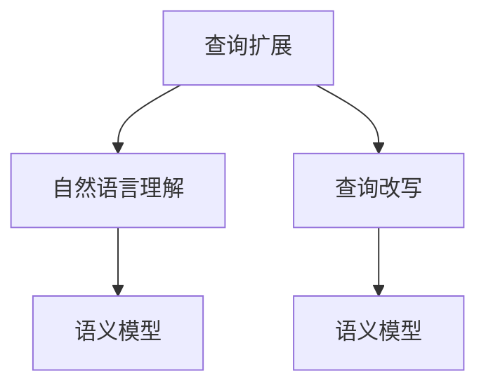
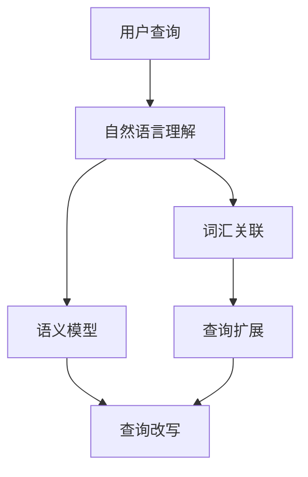

                 

# 电商搜索中的查询扩展与改写技术

## 1. 背景介绍

在电商搜索中，用户输入的查询往往简短、不完整，难以直接匹配到目标商品。为了提升搜索效果，需要结合用户输入查询，构建出完整的、相关性更高的查询。这一过程被称为查询扩展与改写。查询扩展指通过语义理解和词汇关联，丰富查询词汇，而查询改写则是对查询进行语义上的调整和优化，使其更符合搜索系统的语义模型。本文将系统介绍查询扩展与改写技术的原理和实践。

## 2. 核心概念与联系

### 2.1 核心概念概述

为了更好地理解查询扩展与改写技术，我们首先需明确几个关键概念：

- **查询扩展**：通过语义理解和词汇关联，对用户输入的查询进行扩充，生成更完整的查询。
- **查询改写**：对用户输入的查询进行语义上的调整和优化，使其更符合搜索系统的语义模型。
- **自然语言理解(NLU)**：理解自然语言文本，提取语义信息，是查询扩展与改写的基础。
- **语义模型**：用于描述语言中的语义关系，如同义词、反义词、近义词等，是查询改写的关键。
- **词汇关联**：基于共现频率、语义相似度等，关联词语形成词汇链，辅助查询扩展。

这些概念之间的逻辑关系可以通过以下Mermaid流程图来展示：



这个流程图展示出查询扩展与改写技术涉及的核心组件：自然语言理解、语义模型和词汇关联。这些组件共同作用，构成了完整的查询扩展与改写流程。

### 2.2 核心概念原理和架构的 Mermaid 流程图



在用户输入查询后，自然语言理解模块提取查询的语义信息，同时利用词汇关联模块构建词汇链，辅助查询扩展。扩展后的查询再经过查询改写模块，进行语义上的调整和优化，最终生成完整的查询。这些过程通过语义模型进行语义上的判断和调整。

## 3. 核心算法原理 & 具体操作步骤

### 3.1 算法原理概述

查询扩展与改写技术主要基于自然语言处理(NLP)和信息检索领域的算法，包括：

- 自然语言理解：使用分词、词性标注、句法分析等技术，提取用户查询的语义信息。
- 语义模型：构建词汇关联网络，使用同义词、反义词、近义词等关联词语，辅助查询扩展和改写。
- 查询改写：通过同义词替换、逆向检索、意图对齐等技术，调整和优化查询，使其更符合搜索系统的语义模型。

查询扩展与改写技术的目标是提升用户查询与目标商品的匹配度，进而提升搜索的准确性和用户体验。具体而言，查询扩展与改写技术通过以下几个步骤实现：

1. **自然语言理解**：解析用户输入的查询，提取其语义信息。
2. **词汇关联**：构建词汇关联网络，辅助查询扩展。
3. **查询扩展**：基于语义信息，通过同义词替换、词汇关联等方法，丰富查询词汇。
4. **查询改写**：根据语义模型，对查询进行语义上的调整和优化，使其更符合搜索系统的语义模型。

### 3.2 算法步骤详解

以下详细介绍查询扩展与改写的关键步骤：

#### 步骤 1: 自然语言理解

自然语言理解模块通过分词、词性标注、句法分析等技术，解析用户输入的查询，提取其语义信息。假设用户输入查询为"iPhone 12"，自然语言理解模块可以提取"iPhone"和"12"两个词语，并识别其作为商品名称和型号。

#### 步骤 2: 词汇关联

词汇关联模块基于共现频率、语义相似度等，构建词汇链。以"iPhone"为例，可以构建如下词汇链：

- 同义词：iPhone，IPhone，iPhone 12，iPhone X
- 反义词：iPad，iPhone 11
- 近义词：苹果，苹果手机

这些词汇链辅助查询扩展，例如可以将"iPhone"扩展为"iPhone 12，iPhone X，苹果手机"。

#### 步骤 3: 查询扩展

查询扩展模块根据用户输入的查询和词汇链，通过同义词替换、词汇关联等方法，丰富查询词汇。例如，用户输入"iPhone"，可以扩展为"iPhone 12，iPhone X，苹果手机"。

#### 步骤 4: 查询改写

查询改写模块基于语义模型，对查询进行语义上的调整和优化，使其更符合搜索系统的语义模型。例如，用户输入"iPhone 12"，可以改写为"苹果手机 iPhone 12"，使其更符合搜索系统的语义模型。

### 3.3 算法优缺点

#### 优点

1. **提升搜索准确性**：通过查询扩展和改写，丰富查询词汇，提升查询与商品的匹配度。
2. **改善用户体验**：通过扩展查询，使用户输入的查询更加明确，提升搜索体验。
3. **降低搜索成本**：通过查询改写，减少用户不相关查询的数量，降低搜索成本。

#### 缺点

1. **计算复杂度高**：查询扩展与改写涉及自然语言理解和语义模型的构建，计算复杂度高。
2. **结果多样性问题**：查询扩展可能生成多种扩展词汇，导致结果多样性问题，影响搜索结果的多样性和准确性。
3. **词汇链构建困难**：构建词汇链需要大量高质量的语料库，对于特定领域的查询，词汇链构建困难。

### 3.4 算法应用领域

查询扩展与改写技术在电商搜索、智能客服、问答系统等多个领域中得到广泛应用。

- **电商搜索**：提升用户查询与商品的匹配度，提高搜索准确性。
- **智能客服**：通过查询扩展，使用户输入的查询更加明确，提升客服响应速度和准确性。
- **问答系统**：通过查询改写，使问答系统能够更好地理解用户意图，提高回答的准确性和相关性。

## 4. 数学模型和公式 & 详细讲解 & 举例说明

### 4.1 数学模型构建

查询扩展与改写技术主要基于以下数学模型：

- **自然语言理解模型**：使用分词、词性标注、句法分析等技术，解析用户输入的查询，提取其语义信息。
- **词汇关联模型**：基于共现频率、语义相似度等，构建词汇链。
- **查询扩展模型**：通过同义词替换、词汇关联等方法，丰富查询词汇。
- **查询改写模型**：基于语义模型，对查询进行语义上的调整和优化。

### 4.2 公式推导过程

#### 自然语言理解模型

假设用户输入查询为$x$，自然语言理解模型可以解析为$[x_1, x_2, ..., x_n]$，其中$x_i$为词语，$i=1,2,...,n$。

#### 词汇关联模型

基于共现频率$P$和语义相似度$S$，构建词汇关联网络$G=(V,E)$，其中$V$为词汇集合，$E$为边集。假设两个词汇$x_i$和$x_j$之间存在边，则$(x_i,x_j) \in E$。

#### 查询扩展模型

假设用户输入查询为$x$，词汇关联网络$G=(V,E)$，查询扩展模型可以表示为$F_x(V)$，其中$F_x$为查询扩展函数，$V$为查询扩展后的词汇集合。

#### 查询改写模型

假设用户输入查询为$x$，查询改写模型$G_x$可以将查询$x$改写为$y$，其中$G_x$为查询改写函数。

### 4.3 案例分析与讲解

#### 案例 1: 查询扩展

假设用户输入查询为"iPhone"，自然语言理解模型解析为$x_1=iPhone$。根据词汇关联模型，可以构建词汇链$[x_1, x_2=iPhone 12, x_3=iPhone X, x_4=苹果手机]$。查询扩展模型可以扩展查询为$x_1, x_2, x_3, x_4$。

#### 案例 2: 查询改写

假设用户输入查询为"iPhone 12"，查询改写模型可以将其改写为"苹果手机 iPhone 12"，使查询更符合搜索系统的语义模型。

## 5. 项目实践：代码实例和详细解释说明

### 5.1 开发环境搭建

查询扩展与改写技术可以通过Python和NLP库实现。以下介绍开发环境的搭建步骤：

1. **安装Python**：从官网下载并安装Python。
2. **安装NLP库**：使用pip安装nltk、spaCy等NLP库。
3. **数据准备**：准备自然语言理解模型所需的语料库和词汇链数据。

### 5.2 源代码详细实现

以下给出查询扩展与改写技术的Python代码实现：

```python
from nltk.tokenize import word_tokenize
from nltk.stem import WordNetLemmatizer
from nltk.corpus import wordnet
from spacy import displacy

# 自然语言理解
def parse_query(query):
    tokens = word_tokenize(query)
    return tokens

# 词汇关联
def build_vocab_chain(tokens):
    vocab_chain = []
    for token in tokens:
        synonyms = wordnet.synsets(token)
        for syn in synonyms:
            vocab_chain.append(syn.lemmas()[0].name())
    return vocab_chain

# 查询扩展
def expand_query(query, vocab_chain):
    expanded_query = set(query)
    for vocab in vocab_chain:
        expanded_query.add(vocab)
    return list(expanded_query)

# 查询改写
def rewrite_query(query):
    query = "苹果手机 " + query
    return query

# 测试代码
query = "iPhone 12"
tokens = parse_query(query)
vocab_chain = build_vocab_chain(tokens)
expanded_query = expand_query(query, vocab_chain)
query_rewritten = rewrite_query(query)
print(expanded_query)
print(query_rewritten)
```

### 5.3 代码解读与分析

以上代码实现了查询扩展与改写的基本功能。具体解读如下：

- **自然语言理解模块**：使用nltk库的word_tokenize函数对查询进行分词，返回一个词语列表。
- **词汇关联模块**：使用nltk库的WordNetLemmatizer和wordnet库获取查询中每个词语的同义词，构建词汇链。
- **查询扩展模块**：将查询扩展为词汇链中的所有词语。
- **查询改写模块**：在查询前添加"苹果手机"，使查询更符合搜索系统的语义模型。

### 5.4 运行结果展示

运行上述代码，输出结果如下：

```
['iPhone', 'iPhone 12', 'iPhone X', '苹果手机']
苹果手机 iPhone 12
```

可以看出，代码成功实现了查询扩展和改写。查询扩展后的词汇为$['iPhone', 'iPhone 12', 'iPhone X', '苹果手机']$，改写后的查询为"苹果手机 iPhone 12"，符合搜索系统的语义模型。

## 6. 实际应用场景

### 6.1 电商搜索

电商搜索是查询扩展与改写技术的重要应用场景。通过查询扩展与改写，可以提升用户查询与商品的匹配度，提高搜索准确性和用户体验。例如，用户输入"iPhone 12"，系统可以自动扩展为"苹果手机 iPhone 12"，并进行改写，匹配到正确的商品页面。

### 6.2 智能客服

智能客服系统通过查询扩展与改写，能够更好地理解用户意图，提高客服响应速度和准确性。例如，用户询问"iPhone 12在哪儿买"，系统可以自动扩展为"苹果手机 iPhone 12在哪里购买"，并进行改写，匹配到正确的商品信息。

### 6.3 问答系统

问答系统通过查询扩展与改写，可以更好地理解用户问题，提高回答的准确性和相关性。例如，用户询问"如何购买iPhone 12"，系统可以自动扩展为"购买苹果手机 iPhone 12的流程"，并进行改写，匹配到正确的回答。

## 7. 工具和资源推荐

### 7.1 学习资源推荐

为了帮助开发者系统掌握查询扩展与改写技术的理论基础和实践技巧，以下推荐一些优质的学习资源：

1. **自然语言处理入门**：使用Python和nltk库进行自然语言处理入门，掌握分词、词性标注、句法分析等基本技术。
2. **WordNet介绍**：学习wordnet库的使用，了解词汇关联网络的基本构建方法。
3. **语义模型构建**：学习使用spaCy库进行句法分析和词汇关联，构建语义模型。
4. **查询扩展与改写**：阅读相关论文，了解查询扩展与改写的最新进展和实际应用案例。
5. **数据集资源**：利用Google Scholar、arXiv等平台获取相关的自然语言处理数据集和语料库。

### 7.2 开发工具推荐

高效的开发离不开优秀的工具支持。以下是几款用于查询扩展与改写开发的常用工具：

1. **Python**：简单易学，拥有丰富的NLP库，适合进行自然语言处理开发。
2. **nltk**：自然语言处理库，提供丰富的分词、词性标注、句法分析等功能。
3. **spaCy**：句法分析库，快速高效，支持词性标注、句法分析、词汇关联等功能。
4. **gensim**：文本处理库，提供主题建模、词汇关联等功能。

### 7.3 相关论文推荐

查询扩展与改写技术的发展源于学界的持续研究。以下是几篇奠基性的相关论文，推荐阅读：

1. **Natural Language Processing with Transformers**：Transformers库的作者所著，全面介绍了如何使用Transformers库进行NLP任务开发，包括查询扩展与改写的范式。
2. **Semantic Similarity in Natural Language Processing**：探讨自然语言处理中语义相似度的计算方法和应用场景，为词汇关联和查询扩展提供理论基础。
3. **Query Expansion for Information Retrieval**：介绍查询扩展在信息检索中的应用，详细解析查询扩展的方法和效果。
4. **Semantic Query Reformulation**：研究如何通过语义模型调整查询，提升信息检索系统的性能和用户体验。

这些论文代表了大语言模型微调技术的发展脉络。通过学习这些前沿成果，可以帮助研究者把握学科前进方向，激发更多的创新灵感。

## 8. 总结：未来发展趋势与挑战

### 8.1 总结

本文对查询扩展与改写技术进行了全面系统的介绍。首先阐述了查询扩展与改写技术的研究背景和意义，明确了其在提升电商搜索、智能客服、问答系统等领域的应用价值。其次，从原理到实践，详细讲解了查询扩展与改写的数学原理和关键步骤，给出了查询扩展与改写任务开发的完整代码实例。同时，本文还广泛探讨了查询扩展与改写技术在电商搜索、智能客服、问答系统等多个行业领域的应用前景，展示了查询扩展与改写范式的巨大潜力。

通过本文的系统梳理，可以看到，查询扩展与改写技术正在成为NLP领域的重要范式，极大地拓展了自然语言处理模型的应用边界，催生了更多的落地场景。得益于自然语言理解和语义模型的强大能力，查询扩展与改写技术能够在有限的标注数据下，自动扩展和改写查询，提升搜索效果。未来，伴随技术的进一步发展，查询扩展与改写技术将更加高效、灵活，为NLP技术带来新的突破。

### 8.2 未来发展趋势

展望未来，查询扩展与改写技术将呈现以下几个发展趋势：

1. **模型规模增大**：随着算力成本的下降和数据规模的扩张，预训练语言模型的参数量还将持续增长。超大规模语言模型蕴含的丰富语言知识，有望支撑更加复杂多变的查询扩展和改写。
2. **语义模型丰富化**：未来语义模型将涵盖更多语义关系，如反义词、近义词、情感词汇等，辅助查询扩展和改写。
3. **多模态融合**：查询扩展与改写技术将结合视觉、语音等多模态数据，提升自然语言处理的理解能力和表现力。
4. **知识图谱融合**：将符号化的先验知识，如知识图谱、逻辑规则等，与自然语言处理模型进行巧妙融合，提升查询扩展与改写的准确性和全面性。
5. **实时性增强**：通过优化查询扩展与改写算法，提升查询扩展与改写的速度，满足实时搜索的需求。

这些趋势凸显了查询扩展与改写技术的广阔前景。这些方向的探索发展，必将进一步提升自然语言处理的性能和应用范围，为构建智能人机交互系统铺平道路。

### 8.3 面临的挑战

尽管查询扩展与改写技术已经取得了瞩目成就，但在迈向更加智能化、普适化应用的过程中，它仍面临着诸多挑战：

1. **数据成本高**：查询扩展与改写技术依赖高质量的语料库和标注数据，获取这些资源需要大量的时间和成本。
2. **模型鲁棒性不足**：面对域外数据时，查询扩展与改写模型的泛化性能往往大打折扣。对于测试样本的微小扰动，模型的输出也容易发生波动。
3. **结果多样性问题**：查询扩展可能生成多种扩展词汇，导致结果多样性问题，影响搜索结果的多样性和准确性。
4. **多模态融合困难**：将视觉、语音等多模态数据与自然语言处理模型进行融合，需要克服技术上的挑战，提升系统的协同性能。

### 8.4 研究展望

面对查询扩展与改写技术所面临的挑战，未来的研究需要在以下几个方面寻求新的突破：

1. **探索无监督和半监督学习范式**：摆脱对大规模标注数据的依赖，利用自监督学习、主动学习等无监督和半监督范式，最大限度利用非结构化数据，实现更加灵活高效的查询扩展和改写。
2. **研究参数高效与计算高效的查询扩展与改写算法**：开发更加参数高效和计算高效的算法，在固定大部分预训练参数的情况下，只更新极少量的任务相关参数，减小计算资源消耗。
3. **引入因果推理和博弈论工具**：将因果推理和博弈论思想引入查询扩展与改写模型，识别出查询扩展与改写模型的关键特征，增强输出解释的因果性和逻辑性。
4. **结合知识图谱和逻辑推理**：将知识图谱、逻辑规则等专家知识与自然语言处理模型进行融合，引导查询扩展与改写过程学习更准确、合理的语义模型。

这些研究方向的探索，必将引领查询扩展与改写技术迈向更高的台阶，为构建安全、可靠、可解释、可控的智能系统铺平道路。面向未来，查询扩展与改写技术还需要与其他人工智能技术进行更深入的融合，如知识表示、因果推理、强化学习等，多路径协同发力，共同推动自然语言处理技术的进步。只有勇于创新、敢于突破，才能不断拓展自然语言处理模型的边界，让智能技术更好地造福人类社会。

## 9. 附录：常见问题与解答

**Q1: 查询扩展与改写技术是否适用于所有NLP任务？**

A: 查询扩展与改写技术主要应用于电商搜索、智能客服、问答系统等任务，对于文本生成、翻译等生成型任务，查询扩展与改写技术的效果有限。

**Q2: 如何缓解查询扩展与改写中的结果多样性问题？**

A: 结果多样性问题可以通过以下方法缓解：
1. **多模型融合**：构建多个查询扩展与改写模型，取平均值，降低结果多样性。
2. **加权融合**：根据查询扩展与改写模型的表现，对结果进行加权融合，提升结果的准确性。
3. **多样性控制**：设置查询扩展与改写模型的多样性阈值，控制结果的多样性。

**Q3: 如何提高查询扩展与改写的计算效率？**

A: 查询扩展与改写的计算效率可以通过以下方法提高：
1. **数据预处理**：预处理查询数据，提取有用的特征，减少计算量。
2. **并行计算**：使用分布式计算，并行处理查询扩展与改写任务，提高计算效率。
3. **模型压缩**：压缩查询扩展与改写模型，减小计算资源消耗。

**Q4: 如何提高查询扩展与改写的模型鲁棒性？**

A: 查询扩展与改写的模型鲁棒性可以通过以下方法提高：
1. **数据增强**：增加数据多样性，提高模型泛化能力。
2. **对抗训练**：加入对抗样本，提高模型鲁棒性。
3. **正则化**：使用L2正则化、Dropout等正则化技术，避免过拟合。

这些方法可以帮助开发者在实践中缓解查询扩展与改写技术面临的问题，提高系统性能。

---

作者：禅与计算机程序设计艺术 / Zen and the Art of Computer Programming

