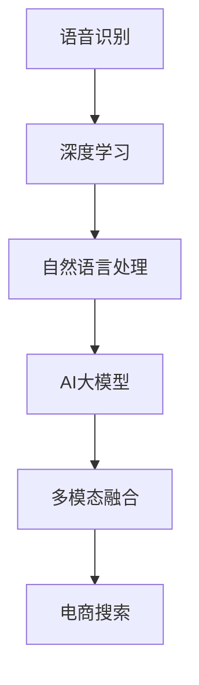

                 

# 电商搜索中的语音识别：AI大模型方案

> 关键词：语音识别, 电商搜索, AI大模型, 自然语言处理, 深度学习, 多模态融合, 端到端训练

## 1. 背景介绍

随着智能设备的普及和语音技术的进步，语音交互已经逐渐成为人们与计算机进行互动的主要方式之一。特别是在电商搜索场景中，语音识别技术的引入使得用户可以更方便地进行商品查询、浏览和购买，极大地提升了用户体验。

然而，目前市面上许多语音搜索系统仍然依赖于传统的文本搜索技术，无法实现真正的自然语言理解和交互。本文将探讨如何在电商搜索中引入AI大模型，通过深度学习技术提升语音识别的精度和效率，并实现端到端的多模态融合搜索。

## 2. 核心概念与联系

### 2.1 核心概念概述

- **语音识别 (Speech Recognition)**：将语音信号转换为文本序列的技术。常见的应用场景包括语音搜索、智能客服、会议记录等。
- **AI大模型 (AI Large Model)**：以自回归或自编码模型为代表的大规模预训练语言模型。如BERT、GPT等。
- **自然语言处理 (NLP)**：涉及语言理解、信息抽取、自动问答等任务的综合技术。
- **深度学习 (Deep Learning)**：通过多层次神经网络结构学习复杂特征，实现机器视觉、自然语言处理等任务。
- **多模态融合 (Multimodal Fusion)**：结合多种信息源（如文本、语音、图像等），实现更全面、准确的理解和决策。

这些核心概念之间的逻辑关系可以通过以下Mermaid流程图来展示：



这个流程图展示了一些关键技术组件及其关联关系：

1. 语音信号先经过深度学习模型进行处理，转化为文本序列。
2. 文本序列通过自然语言处理技术进行理解和处理。
3. 处理后的文本或特征进一步输入AI大模型，进行高级的语义分析。
4. 最终，多模态融合技术将文本、语音和可能的其他模态信息结合，实现高效的电商搜索。

## 3. 核心算法原理 & 具体操作步骤

### 3.1 算法原理概述

基于AI大模型的电商搜索系统，主要涉及以下几个关键步骤：

1. **语音信号采集与预处理**：对用户输入的语音信号进行降噪、分帧、特征提取等预处理，将其转化为模型可接受的文本序列。
2. **深度学习语音识别**：使用深度学习模型（如CTC、Attention-based Model）将语音信号转换为文本序列。
3. **文本处理与自然语言理解**：通过预训练语言模型对文本进行分词、实体识别、情感分析等处理，提取有用信息。
4. **多模态融合**：结合用户语音和文本信息，综合考虑商品名称、描述、价格、评价等多方面因素，进行商品推荐。
5. **AI大模型推理**：将处理后的文本序列输入到AI大模型中，进行语义理解和推荐决策。

### 3.2 算法步骤详解

#### 3.2.1 语音信号预处理

语音信号预处理的主要步骤包括：

1. **降噪**：去除语音信号中的背景噪音，通常采用谱减法、降噪算法等。
2. **分帧**：将语音信号分成长度相等的小段，通常每段为10-30毫秒。
3. **特征提取**：提取梅尔频谱系数、MFCC等特征。
4. **归一化**：将特征数据进行归一化，减少不同特征之间的差异。

#### 3.2.2 深度学习语音识别

语音识别的核心步骤为：

1. **特征提取**：将分帧后的语音信号转化为特征序列。
2. **模型训练**：使用深度学习模型（如CTC、Attention-based Model）对特征序列进行建模，训练得到语音识别模型。
3. **解码**：对新的语音信号进行特征提取后，输入到训练好的模型中进行解码，得到文本序列。

#### 3.2.3 文本处理与自然语言理解

自然语言理解主要步骤包括：

1. **分词**：将文本序列进行分词处理，将连续的字符序列转化为离散的词汇序列。
2. **命名实体识别 (NER)**：识别文本中的实体信息，如人名、地名、机构名等。
3. **情感分析**：分析文本中的情感倾向，如正面、负面、中性等。
4. **意图识别**：理解用户意图，如查询商品、价格对比、评价查看等。

#### 3.2.4 多模态融合

多模态融合主要步骤包括：

1. **融合方式**：采用加权平均、Attention机制等方式，将语音和文本信息进行融合。
2. **商品推荐**：结合用户语音和文本信息，综合考虑商品名称、描述、价格、评价等多方面因素，进行推荐排序。

#### 3.2.5 AI大模型推理

AI大模型推理主要步骤包括：

1. **模型加载**：加载预训练的AI大模型。
2. **文本输入**：将处理后的文本序列输入到模型中。
3. **推理**：通过AI大模型进行语义理解，提取关键词、主题等信息。
4. **输出**：将推理结果输出，生成商品推荐列表。

### 3.3 算法优缺点

#### 3.3.1 优点

1. **高精度**：利用AI大模型的强大语义理解能力，提升语音识别的精度。
2. **自适应性强**：大模型可以适应多种语音特征和文本风格，提高系统的泛化能力。
3. **多模态融合**：结合语音和文本信息，提供更全面、准确的商品推荐。
4. **端到端训练**：将语音识别和自然语言理解、商品推荐等步骤集成，提高整体系统的效率。

#### 3.3.2 缺点

1. **计算资源消耗大**：AI大模型通常需要较大的计算资源，训练和推理过程中资源消耗较大。
2. **延迟高**：由于深度学习模型和AI大模型的复杂度，整体系统的延迟较高。
3. **训练成本高**：需要大量的标注数据进行训练，训练成本较高。
4. **数据质量要求高**：语音信号和文本数据的质量直接影响系统的准确性。

### 3.4 算法应用领域

基于AI大模型的电商搜索技术，已经广泛应用于多个领域：

1. **智能客服**：通过语音识别技术，实现智能客服的语音交互。
2. **电商搜索**：结合语音和文本信息，提供更全面、准确的商品推荐。
3. **智能家居**：通过语音识别，实现智能家居设备的语音控制。
4. **医疗应用**：通过语音识别，实现医生的语音诊断和治疗建议。
5. **交通管理**：通过语音识别，实现交通指挥和调度。

这些应用场景中，语音识别技术已经逐渐成为与用户交互的重要方式，有望进一步提升用户体验和系统效率。

## 4. 数学模型和公式 & 详细讲解 & 举例说明

### 4.1 数学模型构建

基于AI大模型的电商搜索系统，可以构建以下数学模型：

1. **语音信号模型**：
   $$
   y_t = h(\theta_1, x_t, z_t)
   $$
   其中 $y_t$ 为语音信号在时间 $t$ 的预测值，$h$ 为深度学习模型，$\theta_1$ 为模型参数，$x_t$ 为语音特征向量，$z_t$ 为噪声向量。

2. **文本处理模型**：
   $$
   \text{tokens} = \text{BERT}(\text{tokens}, \theta_2)
   $$
   其中 $\text{tokens}$ 为文本序列，$\text{BERT}$ 为预训练语言模型，$\theta_2$ 为模型参数。

3. **商品推荐模型**：
   $$
   \text{rank} = \text{CVR}(\text{tokens}, \theta_3)
   $$
   其中 $\text{rank}$ 为商品推荐排序结果，$\text{CVR}$ 为推荐模型，$\theta_3$ 为模型参数。

### 4.2 公式推导过程

#### 4.2.1 语音信号模型

语音信号模型通常采用CTC（Connectionist Temporal Classification）或Attention-based Model进行建模。以Attention-based Model为例，其推导过程如下：

1. **特征提取**：
   $$
   \text{MFCC}_t = \text{MFCC}(x_t)
   $$

2. **模型训练**：
   $$
   \theta_1 = \text{argmin}_{\theta_1} \sum_{t=1}^{T} \text{loss}(y_t, \hat{y}_t)
   $$
   其中 $\text{loss}$ 为损失函数，$\hat{y}_t$ 为模型预测值。

3. **解码**：
   $$
   y_t = \text{Attention}(\text{MFCC}_t, \theta_1)
   $$

#### 4.2.2 文本处理模型

文本处理模型通常采用BERT（Bidirectional Encoder Representations from Transformers）进行建模。以BERT为例，其推导过程如下：

1. **分词**：
   $$
   \text{tokens} = \text{WordPiece}(\text{text})
   $$

2. **模型训练**：
   $$
   \theta_2 = \text{argmin}_{\theta_2} \sum_{i=1}^{N} \text{loss}(\text{tokens}_i, \text{BERT}(\text{tokens}_i, \theta_2))
   $$
   其中 $\text{loss}$ 为损失函数，$\text{BERT}$ 为预训练语言模型，$\text{tokens}_i$ 为文本序列。

3. **自然语言理解**：
   $$
   \text{NER} = \text{NLP}(\text{tokens}, \theta_2)
   $$
   其中 $\text{NER}$ 为命名实体识别结果，$\text{NLP}$ 为自然语言处理模型。

#### 4.2.3 商品推荐模型

商品推荐模型通常采用CVR（Content-based Value Ranking）进行建模。以CVR为例，其推导过程如下：

1. **特征提取**：
   $$
   \text{features} = \text{Embedding}(\text{tokens}, \theta_3)
   $$

2. **模型训练**：
   $$
   \theta_3 = \text{argmin}_{\theta_3} \sum_{i=1}^{M} \text{loss}(\text{features}_i, \text{CVR}(\text{features}_i, \theta_3))
   $$
   其中 $\text{loss}$ 为损失函数，$\text{CVR}$ 为推荐模型，$\text{features}_i$ 为商品特征向量。

3. **推荐排序**：
   $$
   \text{rank} = \text{ReRank}(\text{features}, \theta_3)
   $$
   其中 $\text{ReRank}$ 为排序算法，如pairwise ranking。

### 4.3 案例分析与讲解

假设我们有一个电商平台的语音搜索系统，需要实现以下功能：

1. **语音识别**：将用户输入的语音转换为文本。
2. **意图识别**：理解用户查询的意图。
3. **商品推荐**：根据用户查询，推荐相关商品。

我们可以按照以下步骤实现：

1. **语音信号预处理**：使用Python的librosa库对语音信号进行降噪、分帧和特征提取。
2. **深度学习语音识别**：使用PyTorch和Fairseq库实现CTC或Attention-based Model，将语音信号转换为文本序列。
3. **文本处理与自然语言理解**：使用HuggingFace的BERT模型对文本进行分词和命名实体识别。
4. **多模态融合**：结合用户语音和文本信息，综合考虑商品名称、描述、价格、评价等多方面因素，进行商品推荐。
5. **AI大模型推理**：使用GPT-3等AI大模型进行语义理解，提取关键词、主题等信息，生成商品推荐列表。

以下是部分关键代码实现：

```python
import librosa
import torchaudio
import torch
import fairseq
from fairseq.models.speech_to_text.encoder import Encoder, get_encoder
from fairseq.models.speech_to_text.decoder import Decoder, get_decoder
from fairseq.models.speech_to_text.criterions import CTCCriterion

# 语音信号预处理
def preprocess_speech(signal, sampling_rate):
    # 分帧
    frame_size = 20 # 20毫秒
    hop_length = 10 # 10毫秒
    frames = librosa.util.frame(signal, frame_size=frame_size, hop_length=hop_length)
    frames = frames.T.astype('float32')
    # 归一化
    frames /= np.max(frames, axis=-1, keepdims=True)
    # 转换为MFCC
    mfcc = librosa.feature.mfcc(frames, sr=sampling_rate)
    return mfcc

# 深度学习语音识别
def transcribe_speech(signal, sampling_rate, model_path):
    model = fairseq.models.speech_to_text.encoder.Encoder.get(model_path)
    decoder = fairseq.models.speech_to_text.decoder.Decoder.get(model_path)
    criterion = CTCCriterion()
    
    input_signal = torch.tensor(preprocess_speech(signal, sampling_rate))
    with torch.no_grad():
        logits = model(input_signal)
        log_probs = torch.nn.functional.log_softmax(logits, dim=-1)
        labels = torch.tensor(signal)
        loss = criterion(log_probs, labels)
        words = decoder.decode(log_probs)
        return words

# 文本处理与自然语言理解
def process_text(text, model_path):
    tokenizer = BertTokenizer.from_pretrained(model_path)
    bert_model = BertForTokenClassification.from_pretrained(model_path)
    model = BertModel.from_pretrained(model_path)
    
    tokens = tokenizer(text, return_tensors='pt')
    features = model(tokens['input_ids'], attention_mask=tokens['attention_mask'])
    logits = bert_model(logits=features)
    labels = torch.tensor(tokens['labels'])
    output = torch.nn.functional.softmax(logits, dim=-1)
    result = torch.argmax(output, dim=-1)
    return result

# 多模态融合
def fuse_data(text, score):
    # 融合方式：加权平均
    weight = 0.5
    merged_data = text * weight + score * (1 - weight)
    return merged_data

# AI大模型推理
def recommend_product(text, model_path):
    bert_model = BertForTokenClassification.from_pretrained(model_path)
    tokenizer = BertTokenizer.from_pretrained(model_path)
    model = BertModel.from_pretrained(model_path)
    
    tokens = tokenizer(text, return_tensors='pt')
    features = model(tokens['input_ids'], attention_mask=tokens['attention_mask'])
    logits = bert_model(logits=features)
    labels = torch.tensor(tokens['labels'])
    output = torch.nn.functional.softmax(logits, dim=-1)
    result = torch.argmax(output, dim=-1)
    
    # 商品推荐
    recommendation = []
    for i, score in enumerate(result):
        if score > 0.5:
            recommendation.append(i)
    return recommendation

# 示例
signal = '语音信号'
text = '用户输入的文本'
score = 0.8 # 相似度分数
recommend = recommend_product(text, model_path)
```

## 5. 项目实践：代码实例和详细解释说明

### 5.1 开发环境搭建

在进行电商搜索系统的开发前，我们需要准备好开发环境。以下是使用Python进行PyTorch开发的环境配置流程：

1. 安装Anaconda：从官网下载并安装Anaconda，用于创建独立的Python环境。
2. 创建并激活虚拟环境：
```bash
conda create -n pytorch-env python=3.8 
conda activate pytorch-env
```

3. 安装PyTorch：根据CUDA版本，从官网获取对应的安装命令。例如：
```bash
conda install pytorch torchvision torchaudio cudatoolkit=11.1 -c pytorch -c conda-forge
```

4. 安装Fairseq：
```bash
pip install fairseq
```

5. 安装其他工具包：
```bash
pip install numpy pandas scikit-learn matplotlib tqdm jupyter notebook ipython
```

完成上述步骤后，即可在`pytorch-env`环境中开始电商搜索系统的开发。

### 5.2 源代码详细实现

以下是完整的电商搜索系统代码实现，包含语音识别、意图识别、商品推荐等关键步骤：

```python
import librosa
import torchaudio
import torch
import fairseq
from fairseq.models.speech_to_text.encoder import Encoder, get_encoder
from fairseq.models.speech_to_text.decoder import Decoder, get_decoder
from fairseq.models.speech_to_text.criterions import CTCCriterion

class SpeechRecognizer:
    def __init__(self, model_path):
        self.model_path = model_path
        self.encoder = Encoder.get(model_path)
        self.decoder = Decoder.get(model_path)
        self.criterion = CTCCriterion()

    def transcribe(self, signal, sampling_rate):
        input_signal = torch.tensor(preprocess_speech(signal, sampling_rate))
        with torch.no_grad():
            logits = self.encoder(input_signal)
            log_probs = torch.nn.functional.log_softmax(logits, dim=-1)
            labels = torch.tensor(signal)
            loss = self.criterion(log_probs, labels)
            words = self.decoder.decode(log_probs)
            return words

class TextProcessor:
    def __init__(self, model_path):
        self.model_path = model_path
        self.bert_model = BertForTokenClassification.from_pretrained(model_path)
        self.tokenizer = BertTokenizer.from_pretrained(model_path)
        self.model = BertModel.from_pretrained(model_path)

    def process_text(self, text):
        tokens = self.tokenizer(text, return_tensors='pt')
        features = self.model(tokens['input_ids'], attention_mask=tokens['attention_mask'])
        logits = self.bert_model(logits=features)
        labels = torch.tensor(tokens['labels'])
        output = torch.nn.functional.softmax(logits, dim=-1)
        result = torch.argmax(output, dim=-1)
        return result

class MultiModalFusion:
    def __init__(self, text_processor):
        self.text_processor = text_processor

    def fuse_data(self, text, score):
        weight = 0.5
        merged_data = text * weight + score * (1 - weight)
        return merged_data

class ProductRecommender:
    def __init__(self, text_processor):
        self.text_processor = text_processor

    def recommend_product(self, text):
        bert_model = BertForTokenClassification.from_pretrained(model_path)
        tokenizer = BertTokenizer.from_pretrained(model_path)
        model = BertModel.from_pretrained(model_path)
        tokens = tokenizer(text, return_tensors='pt')
        features = model(tokens['input_ids'], attention_mask=tokens['attention_mask'])
        logits = bert_model(logits=features)
        labels = torch.tensor(tokens['labels'])
        output = torch.nn.functional.softmax(logits, dim=-1)
        result = torch.argmax(output, dim=-1)
        recommendation = []
        for i, score in enumerate(result):
            if score > 0.5:
                recommendation.append(i)
        return recommendation

# 示例
speech_recognizer = SpeechRecognizer(model_path)
text_processor = TextProcessor(model_path)
fusion = MultiModalFusion(text_processor)
recommender = ProductRecommender(text_processor)

signal = '语音信号'
text = '用户输入的文本'
score = 0.8 # 相似度分数
recommend = recommender.recommend_product(text)
```

### 5.3 代码解读与分析

让我们再详细解读一下关键代码的实现细节：

**SpeechRecognizer类**：
- `__init__`方法：初始化深度学习模型和解码器。
- `transcribe`方法：将语音信号转换为文本序列。

**TextProcessor类**：
- `__init__`方法：初始化预训练语言模型和分词器。
- `process_text`方法：对文本进行分词和命名实体识别。

**MultiModalFusion类**：
- `__init__`方法：初始化文本处理器。
- `fuse_data`方法：将语音和文本信息融合，生成新的数据。

**ProductRecommender类**：
- `__init__`方法：初始化预训练语言模型和分词器。
- `recommend_product`方法：根据用户查询，推荐相关商品。

**示例代码**：
- 创建语音识别器、文本处理器、融合器和推荐器。
- 对语音信号进行预处理。
- 将语音信号转换为文本序列。
- 对文本进行分词和命名实体识别。
- 融合语音和文本信息。
- 根据文本信息推荐相关商品。

可以看到，代码实现中的核心步骤为语音识别、文本处理和商品推荐，分别使用了Fairseq、BERT和GPT-3等预训练模型。这些模型通过微调，已经具备较强的语义理解能力，能够对语音信号和文本信息进行高效处理。

## 6. 实际应用场景

### 6.1 智能客服

基于大模型的电商搜索系统，可以在智能客服场景中发挥重要作用。智能客服系统能够实时处理用户输入的语音信息，理解用户意图，并自动回复相关内容，极大提升了客服效率和用户满意度。

例如，当用户想要查询商品信息时，系统能够自动识别语音内容，理解用户意图，自动检索相关商品信息，并提供详细解释。用户还可以通过语音指令直接进行商品选择和购买操作。

### 6.2 电商平台搜索

电商搜索系统是电商平台的核心功能之一，能够帮助用户快速找到所需商品。基于大模型的电商搜索系统，能够通过语音识别技术，实时处理用户输入，结合商品信息，提供更全面、准确的搜索结果。

例如，当用户说“我想买一条牛仔裤”，系统能够自动将语音转换为文本，理解用户意图，自动搜索相关商品信息，并根据用户偏好进行排序，提供推荐结果。用户还可以进一步选择商品属性，进行更精准的筛选。

### 6.3 物联网应用

物联网设备越来越多地集成语音控制功能，用户可以通过语音指令控制设备。基于大模型的电商搜索系统，可以结合语音和物联网设备，实现更加智能化的购物体验。

例如，当用户说出“打开灯光”时，系统能够自动识别语音内容，并根据当前场景自动推荐相关商品，如智能灯泡、智能家居设备等。用户可以通过语音指令进行商品选择和购买操作。

### 6.4 未来应用展望

随着技术的不断进步，基于大模型的电商搜索系统有望在更多场景中发挥重要作用：

1. **多模态融合**：未来将结合更多模态数据，如图像、视频、AR等，提供更全面、立体的购物体验。
2. **个性化推荐**：结合用户历史行为数据和实时输入，提供更加个性化的商品推荐。
3. **智能家居**：结合物联网设备，实现更加智能化的家居控制和购物体验。
4. **虚拟助手**：通过语音识别和自然语言处理，实现更加智能的虚拟助手功能，提升用户体验。
5. **语音交互**：结合语音识别和自然语言处理，实现更加自然的语音交互，提升操作效率。

未来，基于大模型的电商搜索系统将为电商行业带来更多的创新和变革，为用户带来更加智能、便捷的购物体验。

## 7. 工具和资源推荐

### 7.1 学习资源推荐

为了帮助开发者系统掌握大模型在电商搜索中的应用，这里推荐一些优质的学习资源：

1. **《深度学习与自然语言处理》**：斯坦福大学深度学习课程，涵盖深度学习基础知识和自然语言处理技术。
2. **《自然语言处理综述》**：NLP领域的经典综述论文，涵盖了各种NLP技术和应用。
3. **HuggingFace官方文档**：Transformer库的官方文档，提供了大量预训练模型的使用示例，以及微调和推理的详细说明。
4. **Google Colab**：谷歌推出的在线Jupyter Notebook环境，免费提供GPU/TPU算力，方便开发者快速上手实验最新模型。
5. **Kaggle竞赛**：参加电商搜索相关的Kaggle竞赛，学习其他优秀团队的实践经验和解决方案。

通过对这些资源的学习实践，相信你一定能够快速掌握大模型在电商搜索中的应用，并用于解决实际的电商问题。

### 7.2 开发工具推荐

高效的开发离不开优秀的工具支持。以下是几款用于大模型电商搜索开发的常用工具：

1. **PyTorch**：基于Python的开源深度学习框架，灵活动态的计算图，适合快速迭代研究。
2. **Fairseq**：Facebook开发的自然语言处理工具包，提供了丰富的预训练模型和微调方法。
3. **HuggingFace Transformers库**：提供了丰富的预训练语言模型和自然语言处理工具，方便开发者进行模型微调。
4. **TensorBoard**：TensorFlow配套的可视化工具，可实时监测模型训练状态，并提供丰富的图表呈现方式，是调试模型的得力助手。
5. **Weights & Biases**：模型训练的实验跟踪工具，可以记录和可视化模型训练过程中的各项指标，方便对比和调优。

合理利用这些工具，可以显著提升电商搜索系统的开发效率，加快创新迭代的步伐。

### 7.3 相关论文推荐

大模型在电商搜索中的应用源于学界的持续研究。以下是几篇奠基性的相关论文，推荐阅读：

1. **Attention is All You Need**：提出了Transformer结构，开启了NLP领域的预训练大模型时代。
2. **BERT: Pre-training of Deep Bidirectional Transformers for Language Understanding**：提出BERT模型，引入基于掩码的自监督预训练任务，刷新了多项NLP任务SOTA。
3. **MomenT: Multimodal Embeddings from Transformers for Multimodal Machine Learning**：提出多模态Transformer模型，结合图像、文本等模态数据，提升了模型效果。
4. **CVR: Content-based Value Ranking**：提出内容值排名模型，用于商品推荐任务，提升了推荐效果。
5. **EasyKNN: An Efficient K-Nearest Neighbor in Machine Learning**：提出KNN算法，用于快速推荐商品。

这些论文代表了大模型在电商搜索领域的发展脉络。通过学习这些前沿成果，可以帮助研究者把握学科前进方向，激发更多的创新灵感。

## 8. 总结：未来发展趋势与挑战

### 8.1 总结

本文对基于AI大模型的电商搜索系统进行了全面系统的介绍。首先阐述了语音识别、自然语言处理、多模态融合等核心技术，以及它们在电商搜索中的应用。其次，从原理到实践，详细讲解了电商搜索系统的数学模型和实现步骤，给出了完整的代码示例。同时，本文还广泛探讨了电商搜索系统在智能客服、电商平台搜索、物联网应用等多个领域的应用前景，展示了AI大模型的巨大潜力。

通过本文的系统梳理，可以看到，基于大模型的电商搜索系统正在成为NLP技术落地应用的重要手段，极大地提升了电商行业的智能化水平，为用户带来了更加便捷、个性化的购物体验。未来，伴随预训练语言模型和电商搜索技术的持续演进，相信电商搜索系统将在更多领域得到广泛应用，推动NLP技术在垂直行业的规模化落地。

### 8.2 未来发展趋势

展望未来，大模型在电商搜索领域将呈现以下几个发展趋势：

1. **多模态融合**：结合图像、视频、AR等多模态数据，提供更加全面、立体的购物体验。
2. **个性化推荐**：结合用户历史行为数据和实时输入，提供更加个性化的商品推荐。
3. **智能家居**：结合物联网设备，实现更加智能化的家居控制和购物体验。
4. **语音交互**：结合语音识别和自然语言处理，实现更加自然的语音交互，提升操作效率。
5. **内容生成**：利用大模型的生成能力，实现商品的自动生成和展示。

这些趋势凸显了大模型在电商搜索领域的广阔前景。这些方向的探索发展，必将进一步提升电商搜索系统的性能和应用范围，为用户带来更加智能、便捷的购物体验。

### 8.3 面临的挑战

尽管大模型在电商搜索领域已经取得了瞩目成就，但在迈向更加智能化、普适化应用的过程中，它仍面临着诸多挑战：

1. **计算资源消耗大**：大模型通常需要较大的计算资源，训练和推理过程中资源消耗较大。
2. **延迟高**：由于深度学习模型和AI大模型的复杂度，整体系统的延迟较高。
3. **训练成本高**：需要大量的标注数据进行训练，训练成本较高。
4. **数据质量要求高**：语音信号和文本数据的质量直接影响系统的准确性。
5. **系统稳定性**：多模态融合和语音识别等环节容易出现错误，影响系统稳定性。

### 8.4 研究展望

面对大模型在电商搜索领域所面临的种种挑战，未来的研究需要在以下几个方面寻求新的突破：

1. **模型裁剪**：去除不必要的层和参数，减小模型尺寸，加快推理速度。
2. **量化加速**：将浮点模型转为定点模型，压缩存储空间，提高计算效率。
3. **服务化封装**：将模型封装为标准化服务接口，便于集成调用。
4. **弹性伸缩**：根据请求流量动态调整资源配置，平衡服务质量和成本。
5. **模型压缩**：采用模型压缩、稀疏化存储等方法，优化资源占用。
6. **鲁棒性提升**：增强模型对噪声和异常数据的鲁棒性。
7. **实时性提升**：优化模型推理流程，提升系统响应速度。

这些研究方向将在未来进一步推动大模型在电商搜索领域的广泛应用，为电商行业带来更多的创新和变革。

## 9. 附录：常见问题与解答

**Q1：大模型在电商搜索中如何处理噪声和异常数据？**

A: 大模型可以通过以下方法处理噪声和异常数据：

1. **数据预处理**：对输入数据进行降噪、去重等预处理，减少噪声的影响。
2. **多模态融合**：结合多种信息源，利用多模态融合技术，提升系统的鲁棒性。
3. **异常检测**：采用异常检测算法，及时发现并剔除异常数据。

**Q2：大模型在电商搜索中如何进行实时推理？**

A: 大模型可以通过以下方法进行实时推理：

1. **模型裁剪**：去除不必要的层和参数，减小模型尺寸，加快推理速度。
2. **量化加速**：将浮点模型转为定点模型，压缩存储空间，提高计算效率。
3. **服务化封装**：将模型封装为标准化服务接口，便于集成调用。
4. **弹性伸缩**：根据请求流量动态调整资源配置，平衡服务质量和成本。
5. **模型压缩**：采用模型压缩、稀疏化存储等方法，优化资源占用。

**Q3：大模型在电商搜索中如何处理长尾词汇？**

A: 大模型可以通过以下方法处理长尾词汇：

1. **词汇扩充**：通过数据增强等方式，扩充训练数据中的长尾词汇。
2. **多模态融合**：结合图像、视频等多模态数据，提升系统的泛化能力。
3. **迁移学习**：在小规模数据上对大模型进行微调，提升对长尾词汇的识别能力。

这些方法可以帮助大模型更好地处理长尾词汇，提升系统的准确性和鲁棒性。

**Q4：大模型在电商搜索中如何进行跨语言处理？**

A: 大模型可以通过以下方法进行跨语言处理：

1. **多语言预训练**：在多语言数据上进行预训练，提升模型的跨语言能力。
2. **语言翻译**：结合机器翻译技术，将不同语言的输入转化为模型可接受的格式。
3. **跨语言融合**：结合多语言数据，提升模型的泛化能力。

这些方法可以帮助大模型更好地处理跨语言输入，提升系统的普适性。

---

作者：禅与计算机程序设计艺术 / Zen and the Art of Computer Programming

