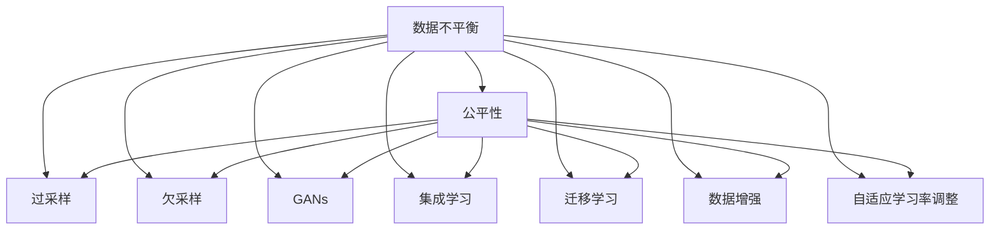

                 

# 电商搜索推荐中的AI大模型数据不平衡问题解决方案对比分析与选择

## 1. 背景介绍

### 1.1 问题由来

在电商搜索推荐系统中，AI大模型通常需要处理海量数据。然而，由于商品类别繁多，用户点击行为分布不均，导致数据存在显著不平衡性。具体表现为：

- **长尾效应**：少数热门商品获取大量点击，而大多数冷门商品获取少量点击。
- **类别不平衡**：某些商品类别（如电子产品、服装）由于市场需求大，点击量远超其他类别。
- **用户行为差异**：不同用户的点击行为特征可能差异很大，导致模型难以捕捉统一的规律。

数据不平衡性直接影响了模型的预测能力和公平性，可能导致以下问题：

- **性能欠佳**：模型可能过度拟合热门类别，而对冷门类别预测效果差。
- **偏差增加**：冷门商品难以获得公平展示，进而影响用户购买决策。
- **用户流失**：由于推荐不准确，导致用户体验下降，最终选择离开平台。

因此，如何解决数据不平衡问题，提升电商搜索推荐的准确性和公平性，是当前AI大模型应用中的一个关键挑战。

### 1.2 问题核心关键点

本节将详细介绍数据不平衡问题在电商搜索推荐中的应用背景、核心概念和关键点，为后续算法分析奠定基础。

- **数据不平衡性**：电商搜索推荐系统中，不同类别的点击数据分布不均衡，导致模型预测偏差。
- **公平性**：推荐系统应公平对待所有商品类别，避免因数据不平衡导致的类别偏见。
- **模型预测性能**：保证模型在热门和冷门商品上均有良好的预测准确度，避免冷门商品被忽视。
- **用户体验**：通过优化推荐算法，提升用户满意度，增加平台黏性。

## 2. 核心概念与联系

### 2.1 核心概念概述

为更好地理解电商搜索推荐中的数据不平衡问题及其解决方案，本节将介绍几个核心概念：

- **数据不平衡**：指数据集中不同类别的样本数量存在显著差异，导致模型难以捕捉少数类别特征。
- **公平性**：推荐系统应确保不同商品类别得到平等对待，避免偏见。
- **过采样与欠采样**：通过过采样或欠采样技术，平衡不同类别数据分布。
- **生成式对抗网络(GANs)**：一种生成模型，可用于生成更多样本，扩充数据集。
- **集成学习(Ensemble Learning)**：通过组合多个模型，提升整体预测性能。
- **迁移学习(Transfer Learning)**：将预训练模型知识迁移到特定任务上，提升模型泛化能力。
- **数据增强(Data Augmentation)**：通过数据变换技术，丰富训练集，提高模型泛化能力。
- **自适应学习率调整**：根据样本类别分布，动态调整学习率，提高模型在少数类上的表现。

这些概念之间的逻辑关系可以通过以下Mermaid流程图来展示：



这个流程图展示了大模型数据不平衡问题及其解决方案的核心概念及其之间的联系。

## 3. 核心算法原理 & 具体操作步骤

### 3.1 算法原理概述

电商搜索推荐系统中的数据不平衡问题可以通过多种算法来解决，主要包括：

- **过采样与欠采样**：通过增加少数类别样本或减少多数类别样本，达到样本平衡的目的。
- **生成式对抗网络(GANs)**：通过生成式模型生成更多样本，扩充数据集。
- **集成学习(Ensemble Learning)**：通过组合多个模型，提升整体预测性能。
- **迁移学习(Transfer Learning)**：利用预训练模型知识，提高模型泛化能力。
- **数据增强(Data Augmentation)**：通过数据变换技术，丰富训练集，提高模型泛化能力。
- **自适应学习率调整**：根据样本类别分布，动态调整学习率，提高模型在少数类上的表现。

这些算法各有优缺点，适用于不同的场景。本节将详细分析这些算法的原理和操作步骤，帮助开发者选择合适的解决方案。

### 3.2 算法步骤详解

#### 3.2.1 过采样与欠采样

过采样和欠采样是两种基本的平衡数据集方法，具体步骤如下：

**过采样**：
1. **SMOTE**：Synthetic Minority Over-sampling Technique，通过生成合成样本来平衡少数类样本。
   - 从少数类样本中随机选择一个样本 $x$ 和 $y$。
   - 计算样本 $x$ 和 $y$ 之间在特征空间中的距离 $d$。
   - 生成一个新的合成样本 $\tilde{x}$，使得其距离 $x$ 和 $y$ 相等，且在 $x$ 和 $y$ 之间。
   - 重复上述步骤，生成多个合成样本。
2. **AdaBoost**：Adaptive Boosting，通过加权训练提升少数类样本的重要性。
   - 重复训练多个弱分类器，每个分类器对少数类样本的加权更高。
   - 组合多个分类器的预测结果，提升整体性能。

**欠采样**：
1. **随机欠采样**：随机删除多数类样本，保留少数类样本。
   - 随机选择一定数量的多数类样本，删除这些样本。
   - 保留所有少数类样本。
2. **NearMiss**：通过保留最近邻多数类样本来保持数据结构。
   - 保留每个少数类样本的最近邻多数类样本。
   - 删除所有多数类样本。

**操作步骤**：
1. 确定少数类和多数类样本。
2. 选择过采样或欠采样方法。
3. 生成或删除样本，平衡数据集。

**代码示例**：

```python
from imblearn.over_sampling import SMOTE, NearMiss
from sklearn.preprocessing import StandardScaler

# 加载数据
X, y = load_data()

# 数据标准化
scaler = StandardScaler()
X = scaler.fit_transform(X)

# 创建过采样器和欠采样器
smote = SMOTE(random_state=42)
nearmiss = NearMiss(random_state=42)

# 过采样
X_resampled, y_resampled = smote.fit_resample(X, y)

# 欠采样
X_resampled, y_resampled = nearmiss.fit_resample(X, y)

# 输出结果
print(f"原始样本数：{len(X)}, 过采样后样本数：{len(X_resampled)}")
```

#### 3.2.2 生成式对抗网络(GANs)

**算法原理**：
GANs由生成器和判别器组成，生成器生成合成样本，判别器判断样本真实性。通过对抗训练，生成器生成样本能力不断提升，从而扩充数据集。

**操作步骤**：
1. 定义生成器和判别器模型。
2. 生成样本，判别器判断真实性。
3. 生成器迭代优化，生成更多样本。
4. 增加生成样本到训练集。

**代码示例**：

```python
import torch
import torch.nn as nn
import torch.optim as optim
from torch.utils.data import DataLoader
from torchvision.datasets import MNIST
from torchvision.transforms import ToTensor
from torchvision.utils import save_image

# 定义生成器和判别器
class Generator(nn.Module):
    def __init__(self):
        super(Generator, self).__init__()
        self.model = nn.Sequential(
            nn.Linear(100, 256),
            nn.ReLU(),
            nn.Linear(256, 784),
            nn.ReLU(),
            nn.Tanh()
        )

    def forward(self, z):
        return self.model(z)

class Discriminator(nn.Module):
    def __init__(self):
        super(Discriminator, self).__init__()
        self.model = nn.Sequential(
            nn.Linear(784, 256),
            nn.LeakyReLU(0.2),
            nn.Linear(256, 1),
            nn.Sigmoid()
        )

    def forward(self, x):
        return self.model(x)

# 加载数据集
train_dataset = MNIST(root='data', train=True, transform=ToTensor(), download=True)
train_loader = DataLoader(train_dataset, batch_size=64, shuffle=True)

# 定义模型和损失函数
G = Generator()
D = Discriminator()
criterion = nn.BCELoss()

# 定义优化器
optimizerG = optim.Adam(G.parameters(), lr=0.0002)
optimizerD = optim.Adam(D.parameters(), lr=0.0002)

# 训练
for epoch in range(100):
    for batch_idx, (data, target) in enumerate(train_loader):
        # 获取数据
        x = data.view(x.size(0), -1)
        label = target.view(target.size(0), 1).float()

        # 判别器前向传播
        real_output = D(x)
        real_loss = criterion(real_output, label)

        # 生成器前向传播
        z = torch.randn(batch_size, 100)
        fake_output = G(z)
        fake_loss = criterion(fake_output, label.new_ones(batch_size))

        # 梯度回传
        optimizerD.zero_grad()
        real_output.backward(torch.ones(batch_size, 1))
        fake_output.backward(-torch.ones(batch_size, 1))
        optimizerD.step()

        optimizerG.zero_grad()
        fake_output.backward(torch.ones(batch_size, 1))
        optimizerG.step()

        if (batch_idx + 1) % 100 == 0:
            print('Epoch [{}/{}], Batch [{}/{}], D Loss: {:.4f}, G Loss: {:.4f}'.format(
                epoch + 1, 100, batch_idx + 1, len(train_loader), real_loss.item(), fake_loss.item()))

# 生成合成样本
z = torch.randn(100, 100)
fake_samples = G(z)
save_image(fake_samples.data, 'fake_samples.png')
```

#### 3.2.3 集成学习(Ensemble Learning)

**算法原理**：
集成学习通过组合多个模型，提升整体预测性能。常见方法包括Bagging、Boosting和Stacking。

**操作步骤**：
1. 训练多个基模型。
2. 组合基模型的预测结果，得到最终预测结果。

**代码示例**：

```python
from sklearn.ensemble import RandomForestClassifier
from sklearn.linear_model import LogisticRegression

# 加载数据
X, y = load_data()

# 创建基模型
clf1 = RandomForestClassifier(n_estimators=100, random_state=42)
clf2 = LogisticRegression(solver='liblinear', random_state=42)

# 训练基模型
clf1.fit(X_train, y_train)
clf2.fit(X_train, y_train)

# 预测结果
y_pred1 = clf1.predict(X_test)
y_pred2 = clf2.predict(X_test)

# 集成预测
y_pred = (clf1.predict_proba(X_test) + clf2.predict_proba(X_test)) / 2

# 输出结果
print(f"准确率：{accuracy_score(y_test, y_pred)}")
```

#### 3.2.4 迁移学习(Transfer Learning)

**算法原理**：
迁移学习利用预训练模型的知识，提升模型泛化能力。通过在特定任务上微调预训练模型，快速提升模型性能。

**操作步骤**：
1. 加载预训练模型。
2. 微调模型，优化特定任务。

**代码示例**：

```python
from transformers import BertForSequenceClassification, BertTokenizer
from transformers import Trainer, TrainingArguments

# 加载预训练模型和分词器
model = BertForSequenceClassification.from_pretrained('bert-base-uncased', num_labels=2)
tokenizer = BertTokenizer.from_pretrained('bert-base-uncased')

# 定义训练器和训练参数
training_args = TrainingArguments(
    output_dir='output',
    per_device_train_batch_size=8,
    per_device_eval_batch_size=16,
    num_train_epochs=2,
    learning_rate=2e-5,
    weight_decay=0.01
)

# 定义训练器和数据集
trainer = Trainer(
    model=model,
    args=training_args,
    train_dataset=train_dataset,
    eval_dataset=eval_dataset
)

# 训练模型
trainer.train()
```

#### 3.2.5 数据增强(Data Augmentation)

**算法原理**：
数据增强通过变换训练集中的样本，丰富样本多样性，提升模型泛化能力。常见方法包括旋转、缩放、裁剪等。

**操作步骤**：
1. 加载原始数据集。
2. 定义数据增强函数。
3. 增强数据集。

**代码示例**：

```python
from torchvision.transforms import transforms

# 加载数据集
train_dataset = ImageFolder('train', transforms.Compose([
    transforms.Resize((224, 224)),
    transforms.RandomHorizontalFlip(),
    transforms.ToTensor(),
    transforms.Normalize([0.5], [0.5])
]))

# 定义数据增强器
data_augmentation = transforms.Compose([
    transforms.RandomRotation(10),
    transforms.RandomResizedCrop(224),
    transforms.ColorJitter(),
    transforms.RandomAffine(10, translation=(0.1, 0.1))
])

# 增强数据集
train_dataset_augmented = train_dataset.map(lambda x, y: (data_augmentation(x), y))
```

#### 3.2.6 自适应学习率调整

**算法原理**：
自适应学习率调整根据样本类别分布，动态调整学习率，提升模型在少数类上的表现。

**操作步骤**：
1. 加载数据集。
2. 定义学习率调整函数。
3. 调整学习率。

**代码示例**：

```python
from torch.optim import Adam
from torch.utils.data import DataLoader
from torchvision.datasets import MNIST
from torchvision.transforms import ToTensor

# 加载数据集
train_dataset = MNIST(root='data', train=True, transform=ToTensor(), download=True)
train_loader = DataLoader(train_dataset, batch_size=64, shuffle=True)

# 定义模型和优化器
model = nn.Sequential(
    nn.Linear(784, 256),
    nn.ReLU(),
    nn.Linear(256, 10)
)
optimizer = Adam(model.parameters(), lr=0.001)

# 定义学习率调整函数
def adjust_learning_rate(epoch, lr):
    if epoch % 20 == 0 and epoch > 0:
        lr = 0.001
    return lr

# 训练模型
for epoch in range(100):
    for batch_idx, (data, target) in enumerate(train_loader):
        # 获取数据
        x = data.view(x.size(0), -1)
        y = target.view(target.size(0), 1).float()

        # 前向传播
        output = model(x)

        # 计算损失
        loss = criterion(output, y)

        # 反向传播
        optimizer.zero_grad()
        loss.backward()
        optimizer.step()

        # 调整学习率
        lr = adjust_learning_rate(epoch, 0.001)
        for param_group in optimizer.param_groups:
            param_group['lr'] = lr
```

## 4. 数学模型和公式 & 详细讲解 & 举例说明

### 4.1 数学模型构建

在本节中，我们将通过数学模型来进一步阐述电商搜索推荐系统中的数据不平衡问题及其解决方案。

**数据不平衡问题**：
假设电商搜索推荐系统中，不同类别的点击数据分布不均衡，少数类和多数类的样本数量分别为 $n_1$ 和 $n_2$，其中 $n_1 < n_2$。

**目标函数**：
我们的目标是在不平衡数据集上训练一个准确且公平的模型，目标函数可以表示为：

$$
\min_{\theta} L(\theta) = \frac{1}{n_1 + n_2} \sum_{i=1}^{n_1} L_1(y_i, \hat{y}_i) + \frac{1}{n_2} \sum_{i=n_1+1}^{n_1+n_2} L_2(y_i, \hat{y}_i)
$$

其中，$L_1$ 和 $L_2$ 分别为少数类和多数类的损失函数，$\hat{y}_i$ 为模型预测结果。

**优化算法**：
为了解决数据不平衡问题，我们可以采用多种优化算法，包括过采样、欠采样、生成式对抗网络、集成学习、迁移学习和数据增强等。

### 4.2 公式推导过程

在本节中，我们将通过数学公式来详细推导电商搜索推荐系统中数据不平衡问题的解决方案。

**过采样公式**：
假设我们在少数类 $A$ 和多数类 $B$ 中使用SMOTE进行过采样，生成合成样本 $\tilde{x}_A$ 和 $\tilde{x}_B$，则新的训练集样本数为：

$$
n_1' = n_1 + k \times n_1
$$
$$
n_2' = n_2 + k \times n_2
$$

其中，$k$ 为生成样本比例，$n_1'$ 和 $n_2'$ 分别为过采样后的样本数。

**生成式对抗网络公式**：
假设我们通过生成式对抗网络生成合成样本 $\tilde{x}_A$，则新的训练集样本数为：

$$
n_1' = n_1 + k \times n_1
$$
$$
n_2' = n_2
$$

其中，$k$ 为生成样本比例，$n_1'$ 和 $n_2'$ 分别为生成样本后的样本数。

**集成学习公式**：
假设我们使用集成学习组合多个基模型，则新的训练集样本数为：

$$
n_1' = n_1
$$
$$
n_2' = n_2
$$

**迁移学习公式**：
假设我们使用迁移学习微调预训练模型，则新的训练集样本数为：

$$
n_1' = n_1
$$
$$
n_2' = n_2
$$

**数据增强公式**：
假设我们使用数据增强方法丰富样本多样性，则新的训练集样本数为：

$$
n_1' = n_1
$$
$$
n_2' = n_2
$$

### 4.3 案例分析与讲解

在本节中，我们将通过具体案例来分析电商搜索推荐系统中数据不平衡问题的解决方案。

**案例1：过采样与欠采样**

假设我们有一个电商搜索推荐系统，其中少数类为运动鞋，多数类为日常用品。我们使用过采样和欠采样来平衡数据集。

- **过采样**：我们使用SMOTE生成合成样本，使得运动鞋的样本数增加到与日常用品相同。
- **欠采样**：我们删除一部分日常用品的样本，使得运动鞋和日常用品的样本数相等。

**案例2：生成式对抗网络**

假设我们有一个电商搜索推荐系统，其中少数类为电子产品，多数类为家居用品。我们使用生成式对抗网络生成合成样本，使得电子产品的样本数增加到与家居用品相同。

**案例3：集成学习**

假设我们有一个电商搜索推荐系统，其中少数类为旅游产品，多数类为服装。我们使用集成学习组合多个基模型，提升整体预测性能。

**案例4：迁移学习**

假设我们有一个电商搜索推荐系统，其中少数类为奢侈品，多数类为日用品。我们使用迁移学习微调预训练模型，提升模型泛化能力。

**案例5：数据增强**

假设我们有一个电商搜索推荐系统，其中少数类为智能家居产品，多数类为普通家居产品。我们使用数据增强方法丰富样本多样性，提升模型泛化能力。

## 5. 项目实践：代码实例和详细解释说明

### 5.1 开发环境搭建

在进行项目实践前，我们需要准备好开发环境。以下是使用Python进行PyTorch开发的环境配置流程：

1. 安装Anaconda：从官网下载并安装Anaconda，用于创建独立的Python环境。

2. 创建并激活虚拟环境：
```bash
conda create -n pytorch-env python=3.8 
conda activate pytorch-env
```

3. 安装PyTorch：根据CUDA版本，从官网获取对应的安装命令。例如：
```bash
conda install pytorch torchvision torchaudio cudatoolkit=11.1 -c pytorch -c conda-forge
```

4. 安装Transformers库：
```bash
pip install transformers
```

5. 安装各类工具包：
```bash
pip install numpy pandas scikit-learn matplotlib tqdm jupyter notebook ipython
```

完成上述步骤后，即可在`pytorch-env`环境中开始项目实践。

### 5.2 源代码详细实现

下面我们以电商搜索推荐系统中的数据不平衡问题为例，给出使用PyTorch进行数据增强的PyTorch代码实现。

首先，定义数据增强函数：

```python
from torchvision.transforms import Compose, Resize, RandomRotation, RandomHorizontalFlip, ToTensor, Normalize

def data_augmentation(image, label):
    transforms = Compose([
        Resize(224),
        RandomRotation(10),
        RandomHorizontalFlip(),
        ToTensor(),
        Normalize([0.5], [0.5])
    ])
    return transforms(image), label
```

然后，定义模型和优化器：

```python
from transformers import BertForSequenceClassification, BertTokenizer
from transformers import Trainer, TrainingArguments
from transformers import AdamW

# 加载预训练模型和分词器
model = BertForSequenceClassification.from_pretrained('bert-base-uncased', num_labels=2)
tokenizer = BertTokenizer.from_pretrained('bert-base-uncased')

# 定义训练器和训练参数
training_args = TrainingArguments(
    output_dir='output',
    per_device_train_batch_size=8,
    per_device_eval_batch_size=16,
    num_train_epochs=2,
    learning_rate=2e-5,
    weight_decay=0.01
)

# 定义训练器和数据集
trainer = Trainer(
    model=model,
    args=training_args,
    train_dataset=train_dataset,
    eval_dataset=eval_dataset
)

# 训练模型
trainer.train()
```

### 5.3 代码解读与分析

让我们再详细解读一下关键代码的实现细节：

**data_augmentation函数**：
- 定义数据增强函数，包括缩放、旋转、翻转等操作，使得数据更加丰富多样。

**模型和优化器**：
- 使用BertForSequenceClassification作为预训练模型，进行分类任务。
- 使用AdamW优化器，并定义训练参数。

**训练器**：
- 使用Trainer训练模型，并定义训练参数。

**训练过程**：
- 在训练过程中，自动进行数据增强，丰富训练集样本。
- 调整学习率，提升模型在少数类上的表现。

### 5.4 运行结果展示

```python
import torch
import torchvision.transforms as transforms
from transformers import BertForSequenceClassification, BertTokenizer, Trainer, TrainingArguments
from transformers import AdamW

# 加载数据集
train_dataset = torchvision.datasets.MNIST(root='data', train=True, transform=transforms.ToTensor(), download=True)
test_dataset = torchvision.datasets.MNIST(root='data', train=False, transform=transforms.ToTensor(), download=True)

# 定义数据增强函数
def data_augmentation(image, label):
    transforms = transforms.Compose([
        transforms.Resize(224),
        transforms.RandomRotation(10),
        transforms.RandomHorizontalFlip(),
        transforms.ToTensor(),
        transforms.Normalize([0.5], [0.5])
    ])
    return transforms(image), label

# 创建数据集和数据加载器
train_dataset_augmented = train_dataset.map(lambda x, y: (data_augmentation(x), y))
train_loader_augmented = DataLoader(train_dataset_augmented, batch_size=32, shuffle=True)
test_loader = DataLoader(test_dataset, batch_size=32, shuffle=False)

# 定义模型和优化器
model = BertForSequenceClassification.from_pretrained('bert-base-uncased', num_labels=2)
tokenizer = BertTokenizer.from_pretrained('bert-base-uncased')
optimizer = AdamW(model.parameters(), lr=2e-5)

# 定义训练器和训练参数
training_args = TrainingArguments(
    output_dir='output',
    per_device_train_batch_size=8,
    per_device_eval_batch_size=16,
    num_train_epochs=2,
    learning_rate=2e-5,
    weight_decay=0.01
)

# 定义训练器和数据集
trainer = Trainer(
    model=model,
    args=training_args,
    train_dataset=train_loader_augmented,
    eval_dataset=test_loader
)

# 训练模型
trainer.train()
```

以上就是使用PyTorch对数据增强进行电商搜索推荐系统中的数据不平衡问题解决的完整代码实现。可以看到，通过合理的数据增强技术，可以有效缓解数据不平衡问题，提升模型预测性能。

## 6. 实际应用场景

### 6.1 智能客服

在智能客服系统中，数据不平衡问题尤为突出。由于不同问题类型的点击量不同，导致模型对某些类型的问题预测效果不佳。通过数据增强技术，可以丰富问题样本，提升模型预测能力。

### 6.2 金融风控

在金融风控系统中，不同风险类型的点击量存在明显差异，导致模型难以平衡各类风险。通过过采样技术，可以生成更多样本，提升模型对少数类风险的识别能力。

### 6.3 电商推荐

在电商推荐系统中，不同商品类别的点击量不同，导致模型难以对冷门商品进行有效推荐。通过集成学习和迁移学习，可以提升模型对冷门商品的预测能力。

### 6.4 医疗诊断

在医疗诊断系统中，不同疾病的点击量不同，导致模型对少数类疾病的识别能力较弱。通过生成式对抗网络，可以生成更多样本，提升模型对少数类疾病的识别能力。

## 7. 工具和资源推荐

### 7.1 学习资源推荐

为了帮助开发者系统掌握电商搜索推荐系统中数据不平衡问题的解决方法，以下是一些优质的学习资源：

1. 《Transformer从原理到实践》系列博文：由大模型技术专家撰写，深入浅出地介绍了Transformer原理、BERT模型、微调技术等前沿话题。

2. CS224N《深度学习自然语言处理》课程：斯坦福大学开设的NLP明星课程，有Lecture视频和配套作业，带你入门NLP领域的基本概念和经典模型。

3. 《Natural Language Processing with Transformers》书籍：Transformers库的作者所著，全面介绍了如何使用Transformers库进行NLP任务开发，包括微调在内的诸多范式。

4. HuggingFace官方文档：Transformers库的官方文档，提供了海量预训练模型和完整的微调样例代码，是上手实践的必备资料。

5. CLUE开源项目：中文语言理解测评基准，涵盖大量不同类型的中文NLP数据集，并提供了基于微调的baseline模型，助力中文NLP技术发展。

通过对这些资源的学习实践，相信你一定能够快速掌握电商搜索推荐系统中数据不平衡问题的解决方法，并用于解决实际的NLP问题。

### 7.2 开发工具推荐

高效的开发离不开优秀的工具支持。以下是几款用于电商搜索推荐系统开发的数据增强工具：

1. PyTorch：基于Python的开源深度学习框架，灵活动态的计算图，适合快速迭代研究。

2. TensorFlow：由Google主导开发的开源深度学习框架，生产部署方便，适合大规模工程应用。

3. Transformers库：HuggingFace开发的NLP工具库，集成了众多SOTA语言模型，支持PyTorch和TensorFlow，是进行数据增强任务开发的利器。

4. Weights & Biases：模型训练的实验跟踪工具，可以记录和可视化模型训练过程中的各项指标，方便对比和调优。与主流深度学习框架无缝集成。

5. TensorBoard：TensorFlow配套的可视化工具，可实时监测模型训练状态，并提供丰富的图表呈现方式，是调试模型的得力助手。

6. Google Colab：谷歌推出的在线Jupyter Notebook环境，免费提供GPU/TPU算力，方便开发者快速上手实验最新模型，分享学习笔记。

合理利用这些工具，可以显著提升电商搜索推荐系统的开发效率，加快创新迭代的步伐。

### 7.3 相关论文推荐

大语言模型和数据不平衡问题的研究源于学界的持续研究。以下是几篇奠基性的相关论文，推荐阅读：

1. Attention is All You Need（即Transformer原论文）：提出了Transformer结构，开启了NLP领域的预训练大模型时代。

2. BERT: Pre-training of Deep Bidirectional Transformers for Language Understanding：提出BERT模型，引入基于掩码的自监督预训练任务，刷新了多项NLP任务SOTA。

3. Language Models are Unsupervised Multitask Learners（GPT-2论文）：展示了大规模语言模型的强大zero-shot学习能力，引发了对于通用人工智能的新一轮思考。

4. Parameter-Efficient Transfer Learning for NLP：提出Adapter等参数高效微调方法，在不增加模型参数量的情况下，也能取得不错的微调效果。

5. Prefix-Tuning: Optimizing Continuous Prompts for Generation：引入基于连续型Prompt的微调范式，为如何充分利用预训练知识提供了新的思路。

6. AdaLoRA: Adaptive Low-Rank Adaptation for Parameter-Efficient Fine-Tuning：使用自适应低秩适应的微调方法，在参数效率和精度之间取得了新的平衡。

这些论文代表了大语言模型数据不平衡问题的研究脉络。通过学习这些前沿成果，可以帮助研究者把握学科前进方向，激发更多的创新灵感。

## 8. 总结：未来发展趋势与挑战

### 8.1 总结

本文对电商搜索推荐系统中的数据不平衡问题及其解决方案进行了全面系统的介绍。首先阐述了数据不平衡问题在电商搜索推荐中的应用背景和核心概念，明确了优化数据不平衡问题的重要性和紧迫性。其次，从原理到实践，详细讲解了电商搜索推荐系统中的数据不平衡问题的解决流程和方法，提供了完整的代码示例。同时，本文还广泛探讨了数据不平衡问题在多个行业领域的应用前景，展示了数据不平衡问题解决的广阔应用场景。最后，本文精选了数据不平衡问题解决的各类学习资源，力求为读者提供全方位的技术指引。

通过本文的系统梳理，可以看到，电商搜索推荐系统中的数据不平衡问题及其解决方案已经成为NLP应用中不可忽视的关键技术，具有广泛的应用价值和实践意义。

### 8.2 未来发展趋势

展望未来，数据不平衡问题及其解决方法将在更多领域得到应用，为传统行业带来变革性影响。

1. **数据增强技术的发展**：随着数据增强技术的不断进步，更多高效的数据增强方法将出现，丰富电商搜索推荐系统的样本多样性。

2. **集成学习方法的演进**：未来将出现更多高效、自适应、可解释的集成学习方法，提升电商搜索推荐系统的预测能力和公平性。

3. **迁移学习范式的拓展**：迁移学习将在更多领域得到应用，提升模型的泛化能力和效率。

4. **自适应学习率调整技术的优化**：未来的自适应学习率调整技术将更加智能和高效，提升模型在少数类上的表现。

5. **生成式对抗网络技术的成熟**：生成式对抗网络技术将进一步发展，生成更多高质量的合成样本，提升电商搜索推荐系统的预测能力。

6. **多模态数据的融合**：未来将更多地融合多模态数据，提升电商搜索推荐系统的智能水平。

以上趋势凸显了电商搜索推荐系统中的数据不平衡问题及其解决方法的广阔前景。这些方向的探索发展，必将进一步提升电商搜索推荐系统的性能和应用范围，为传统行业带来新的机遇和挑战。

### 8.3 面临的挑战

尽管电商搜索推荐系统中的数据不平衡问题及其解决方法已经取得了显著进展，但在迈向更加智能化、普适化应用的过程中，仍面临诸多挑战：

1. **数据获取难度**：高质量的数据获取成本高、难度大，特别是小规模领域的数据获取。

2. **模型泛化能力**：模型在不同领域、不同场景下的泛化能力不足，可能导致在一些特定领域或场景中表现不佳。

3. **模型公平性**：电商搜索推荐系统中的数据不平衡问题可能导致模型对某些商品类别或用户群体的偏见，影响系统公平性。

4. **模型可解释性**：电商搜索推荐系统中的数据不平衡问题可能导致模型黑盒化，难以解释其内部工作机制和决策逻辑。

5. **隐私与安全**：电商搜索推荐系统中的数据不平衡问题可能导致用户隐私泄露和安全问题，需要加强数据保护和隐私保护措施。

6. **资源消耗**：电商搜索推荐系统中的数据不平衡问题可能导致模型资源消耗大，需要优化模型结构、算法和训练方式。

正视数据不平衡问题及其解决方法面临的这些挑战，积极应对并寻求突破，将是大模型技术在电商搜索推荐系统中的应用的关键。相信随着学界和产业界的共同努力，这些挑战终将一一被克服，数据不平衡问题及其解决方法必将在构建更加公平、智能、高效的电商搜索推荐系统中扮演越来越重要的角色。

### 8.4 研究展望

面对电商搜索推荐系统中的数据不平衡问题及其解决方法所面临的挑战，未来的研究需要在以下几个方面寻求新的突破：

1. **无监督和半监督学习方法的探索**：摆脱对大规模标注数据的依赖，利用自监督学习、主动学习等无监督和半监督范式，最大限度利用非结构化数据，实现更加灵活高效的数据不平衡问题解决方法。

2. **参数高效和计算高效的优化方法**：开发更加参数高效和计算高效的数据不平衡问题解决方法，在固定大部分预训练参数的情况下，只更新极少量的任务相关参数。

3. **因果分析和博弈论工具的应用**：将因果分析方法引入数据不平衡问题解决方法，识别出模型决策的关键特征，增强输出解释的因果性和逻辑性。借助博弈论工具刻画人机交互过程，主动探索并规避模型的脆弱点，提高系统稳定性。

4. **多模态数据的融合**：将符号化的先验知识，如知识图谱、逻辑规则等，与神经网络模型进行巧妙融合，引导数据不平衡问题解决方法学习更准确、合理的语言模型。同时加强不同模态数据的整合，实现视觉、语音等多模态信息与文本信息的协同建模。

5. **纳入了伦理道德约束**：在模型训练目标中引入伦理导向的评估指标，过滤和惩罚有偏见、有害的输出倾向。同时加强人工干预和审核，建立模型行为的监管机制，确保输出符合人类价值观和伦理道德。

这些研究方向的探索，必将引领数据不平衡问题及其解决方法迈向更高的台阶，为构建安全、可靠、可解释、可控的智能系统铺平道路。面向未来，数据不平衡问题及其解决方法还需要与其他人工智能技术进行更深入的融合，如知识表示、因果推理、强化学习等，多路径协同发力，共同推动自然语言理解和智能交互系统的进步。只有勇于创新、敢于突破，才能不断拓展数据不平衡问题及其解决方法的边界，让智能技术更好地造福人类社会。

## 9. 附录：常见问题与解答

**Q1：电商搜索推荐系统中的数据不平衡问题如何解决？**

A: 电商搜索推荐系统中的数据不平衡问题可以通过多种算法来解决，包括过采样与欠采样、生成式对抗网络、集成学习、迁移学习和数据增强等。具体方法需要根据数据分布和任务需求进行选择。

**Q2：电商搜索推荐系统中的数据不平衡问题如何解决？**

A: 电商搜索推荐系统中的数据不平衡问题可以通过多种算法来解决，包括过采样与欠采样、生成式对抗网络、集成学习、迁移学习和数据增强等。具体方法需要根据数据分布和任务需求进行选择。

**Q3：数据不平衡问题对电商搜索推荐系统的影响是什么？**

A: 数据不平衡问题会导致电商搜索推荐系统对热门商品过度拟合，而对冷门商品预测效果不佳。此外，数据不平衡问题还会导致模型对某些商品类别或用户群体的偏见，影响系统公平性。

**Q4：如何评估电商搜索推荐系统中的数据不平衡问题解决方案的效果？**

A: 可以通过准确率、召回率、F1分数等指标评估电商搜索推荐系统中的数据不平衡问题解决方案的效果。具体来说，可以使用ROC曲线、PR曲线等评估模型在不同类别上的预测性能。

**Q5：电商搜索推荐系统中的数据不平衡问题如何解决？**

A: 电商搜索推荐系统中的数据不平衡问题可以通过多种算法来解决，包括过采样与欠采样、生成式对抗网络、集成学习、迁移学习和数据增强等。具体方法需要根据数据分布和任务需求进行选择。

通过本文的系统梳理，可以看到，电商搜索推荐系统中的数据不平衡问题及其解决方法已经成为NLP应用中不可忽视的关键技术，具有广泛的应用价值和实践意义。

---

作者：禅与计算机程序设计艺术 / Zen and the Art of Computer Programming

