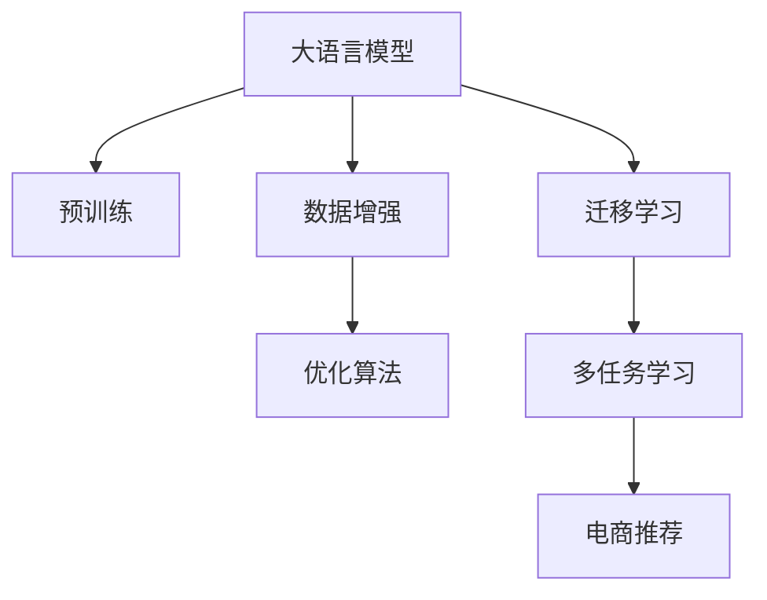

                 

# 电商搜索推荐中的AI大模型数据增强技术应用

> 关键词：人工智能(AI),大模型,电商,搜索推荐,数据增强,优化算法,深度学习

## 1. 背景介绍

### 1.1 问题由来
随着电子商务平台的迅速发展，电商搜索推荐系统已成为了用户获取信息、购买商品的重要渠道。然而，如何通过推荐系统提升用户购物体验、提高转化率，一直是电商企业面临的挑战。传统的推荐系统依赖于统计学习模型，通过历史用户行为数据训练，存在冷启动问题、数据稀疏性、推荐多样性不足等瓶颈。近年来，大语言模型（Large Language Model, LLM）技术迅速崛起，为电商搜索推荐带来了新的解决思路。

大语言模型，如GPT、BERT等，通过在海量文本数据上进行预训练，掌握了丰富的语言知识和理解能力。将大模型引入电商搜索推荐系统，可以通过对用户查询和商品描述进行深度学习，实现更高精度的个性化推荐。但直接将大模型应用于电商推荐，面临数据不足、计算成本高等问题。因此，通过数据增强技术对模型进行优化，成为了提升推荐系统性能的关键。

### 1.2 问题核心关键点
电商搜索推荐中的数据增强技术，主要是指通过数据扩充、合成、转换等手段，提升模型对复杂电商场景的理解能力。其核心点在于：

- 数据的丰富度：传统电商推荐系统依赖历史数据，数据稀疏性导致推荐结果泛化性差。通过数据增强，可以有效提升训练集的大小和质量，缓解冷启动问题。
- 推荐多样性：传统的推荐模型往往过于关注用户的最近行为，忽视了对多样化商品的推荐。通过数据增强，可以挖掘用户潜在的兴趣和需求，增加推荐多样性。
- 计算效率：大模型训练和推理计算量大，面临资源瓶颈。通过数据增强，可以在保持模型复杂度不变的情况下，减小计算量，提高系统的实时响应能力。
- 鲁棒性提升：电商平台面临数据波动、欺诈攻击等风险，模型鲁棒性不足可能带来预测错误。通过数据增强，可以提高模型的泛化能力和鲁棒性，减少异常数据对模型的影响。

### 1.3 问题研究意义
电商搜索推荐中的数据增强技术，对于提升用户体验、提高交易转化率、优化库存管理等方面具有重要意义：

1. 增强用户体验：通过数据增强，推荐系统能够更全面地理解用户需求，提供更个性化、多样化的商品推荐，提升用户满意度。
2. 提高交易转化率：通过更精准的推荐，用户更易找到符合自己需求的商品，减少搜索成本，提升购买意愿和转化率。
3. 优化库存管理：通过数据增强，能够及时发现库存不足和过剩的商品，优化供应链管理，降低成本和风险。
4. 应对数据波动：电商平台面临流量波动、季节性变化等问题，数据增强有助于模型适应数据分布变化，保持预测准确性。
5. 防范欺诈攻击：通过数据增强，提升模型对异常数据的识别能力，降低欺诈行为的发生率。

## 2. 核心概念与联系

### 2.1 核心概念概述

为更好地理解电商搜索推荐中大模型数据增强技术的实现，本节将介绍几个密切相关的核心概念：

- **大语言模型(Large Language Model, LLM)**：如GPT、BERT等，通过在海量文本数据上进行预训练，学习到丰富的语言知识和理解能力。在电商搜索推荐中，可以通过对用户查询和商品描述进行深度学习，实现更高精度的个性化推荐。
- **数据增强(Data Augmentation)**：通过增加训练数据的多样性，提升模型对复杂场景的理解能力。具体包括文本替换、回译、洗牌、噪声注入等方法。
- **优化算法(Optimization Algorithm)**：用于最小化损失函数的数值优化方法，如梯度下降、Adam、Adagrad等。在电商推荐中，通过优化算法调整模型参数，提升推荐效果。
- **深度学习(Deep Learning)**：一种模拟人类神经网络计算的机器学习方法，包含多层神经网络结构。电商推荐系统采用深度学习模型进行推荐，能够捕捉复杂输入数据之间的非线性关系。
- **自然语言处理(Natural Language Processing, NLP)**：涉及计算机处理、理解、生成自然语言的技术，是电商搜索推荐系统的重要组成部分。
- **迁移学习(Transfer Learning)**：将预训练模型在一种任务上的学习迁移到另一种任务中，减少新任务训练时间，提升模型效果。
- **多任务学习(Multi-task Learning)**：同时训练多个任务，共享特征提取器，提升模型对多任务的泛化能力。

这些核心概念共同构成了电商搜索推荐中的AI大模型数据增强技术框架，使得模型能够更好地适应复杂电商场景，提升推荐系统的性能和可靠性。

### 2.2 核心概念原理和架构的 Mermaid 流程图



这个流程图展示了电商搜索推荐中数据增强技术的实现流程：

1. **预训练**：大语言模型在大规模文本数据上进行预训练，学习到通用的语言表示。
2. **数据增强**：通过文本替换、回译等手段，扩充训练数据，提升模型的泛化能力。
3. **优化算法**：使用梯度下降、Adam等算法，调整模型参数，最小化推荐误差。
4. **迁移学习**：将预训练模型的知识迁移到电商推荐任务中，减少新任务训练时间。
5. **多任务学习**：同时训练多个电商推荐任务，共享特征提取器，提升模型泛化能力。

通过上述流程，电商推荐系统能够更好地处理复杂的搜索场景，提升推荐准确性和用户体验。

## 3. 核心算法原理 & 具体操作步骤

### 3.1 算法原理概述

电商搜索推荐中的大模型数据增强技术，基于监督学习和迁移学习的范式。其核心思想是：通过数据增强提升模型对复杂电商场景的理解能力，同时将预训练模型在电商推荐任务中的知识进行迁移，提升推荐系统的性能。

具体而言，假设电商搜索推荐系统的训练集为 $D=\{(x_i,y_i)\}_{i=1}^N, x_i \in \mathcal{X}, y_i \in \mathcal{Y}$，其中 $x_i$ 为用户查询，$y_i$ 为推荐商品列表。微调的目标是找到最优模型参数 $\theta$，使得：

$$
\theta^* = \mathop{\arg\min}_{\theta} \mathcal{L}(M_{\theta},D)
$$

其中 $\mathcal{L}$ 为推荐任务的损失函数，用于衡量推荐列表与用户真实需求的差异。常见的损失函数包括交叉熵损失、均方误差损失等。

在推荐任务中，通常使用排名损失(Rank Loss)作为损失函数，即：

$$
\ell(M_{\theta}(x_i),y_i) = -\log(\frac{\exp(M_{\theta}(x_i)\cdot y_i)}{\sum_{j=1}^M \exp(M_{\theta}(x_i)\cdot j)})
$$

其中 $M_{\theta}(x_i)$ 表示模型对用户查询 $x_i$ 的推荐列表，$j$ 表示商品列表中的第 $j$ 个商品。排名损失旨在最大化相关商品与不相关商品的差异，提升推荐系统的精确度。

### 3.2 算法步骤详解

电商搜索推荐中大模型数据增强技术的实现流程包括以下几个关键步骤：

**Step 1: 准备预训练模型和数据集**
- 选择合适的预训练语言模型 $M_{\theta}$ 作为初始化参数，如 GPT-3、BERT 等。
- 准备电商推荐系统的训练集 $D$，划分为训练集、验证集和测试集。数据集应包括用户查询、商品描述、商品ID、点击率、转化率等特征。

**Step 2: 添加任务适配层**
- 根据电商推荐任务，设计合适的输出层和损失函数。对于推荐任务，通常在顶层添加 ranking head，使用 ranking loss 作为损失函数。
- 定义评分函数，将模型输出与真实标签进行匹配，计算损失。

**Step 3: 设置微调超参数**
- 选择合适的优化算法及其参数，如 AdamW、SGD 等，设置学习率、批大小、迭代轮数等。
- 设置正则化技术及强度，包括权重衰减、Dropout、Early Stopping 等。
- 确定冻结预训练参数的策略，如仅微调顶层，或全部参数都参与微调。

**Step 4: 执行梯度训练**
- 将训练集数据分批次输入模型，前向传播计算损失函数。
- 反向传播计算参数梯度，根据设定的优化算法和学习率更新模型参数。
- 周期性在验证集上评估模型性能，根据性能指标决定是否触发 Early Stopping。
- 重复上述步骤直到满足预设的迭代轮数或 Early Stopping 条件。

**Step 5: 测试和部署**
- 在测试集上评估微调后模型 $M_{\hat{\theta}}$ 的性能，对比微调前后的精度提升。
- 使用微调后的模型对新样本进行推理预测，集成到实际的应用系统中。
- 持续收集新的数据，定期重新微调模型，以适应数据分布的变化。

### 3.3 算法优缺点

电商搜索推荐中的大模型数据增强技术具有以下优点：
1. 提升推荐精度：通过数据增强提升模型对电商场景的理解能力，提高推荐精度。
2. 降低冷启动问题：数据增强增加了训练集的多样性，缓解冷启动问题。
3. 增加推荐多样性：数据增强能够挖掘用户潜在的兴趣和需求，增加推荐多样性。
4. 计算效率高：通过数据增强，可以在保持模型复杂度不变的情况下，减小计算量，提高系统的实时响应能力。
5. 提升鲁棒性：数据增强能够提高模型的泛化能力和鲁棒性，减少异常数据对模型的影响。

同时，该技术也存在一些局限性：
1. 数据依赖：数据增强的效果很大程度上取决于标注数据的质量和数量，获取高质量标注数据的成本较高。
2. 模型复杂：电商场景复杂多变，数据增强后的模型往往参数量较大，难以在大规模数据集上进行微调。
3. 处理长文本：电商推荐系统常常涉及长文本数据，如商品描述、用户评论等，数据增强可能无法完全覆盖这些数据。
4. 计算资源需求高：数据增强和微调过程计算量大，对计算资源有较高要求。

尽管存在这些局限性，但电商搜索推荐中的大模型数据增强技术仍然具有显著的优势，值得深入研究和应用。

### 3.4 算法应用领域

大模型数据增强技术在电商搜索推荐中具有广泛的应用前景，主要体现在以下几个方面：

- **个性化推荐**：通过数据增强，能够更全面地理解用户需求，提供更个性化、多样化的商品推荐，提升用户满意度。
- **热门商品发现**：数据增强能够挖掘用户潜在的兴趣和需求，发现热门商品，提升销售额。
- **库存优化**：数据增强能够及时发现库存不足和过剩的商品，优化供应链管理，降低成本和风险。
- **反欺诈检测**：数据增强能够提升模型对异常数据的识别能力，降低欺诈行为的发生率。
- **搜索引擎优化**：数据增强能够提高搜索引擎对用户查询的匹配度，提升搜索体验。

## 4. 数学模型和公式 & 详细讲解

### 4.1 数学模型构建

本节将使用数学语言对电商搜索推荐中大模型数据增强过程进行更加严格的刻画。

记电商推荐系统的训练集为 $D=\{(x_i,y_i)\}_{i=1}^N, x_i \in \mathcal{X}, y_i \in \mathcal{Y}$，其中 $x_i$ 为用户查询，$y_i$ 为推荐商品列表。定义模型 $M_{\theta}$ 在输入 $x_i$ 上的输出为 $M_{\theta}(x_i)$，即模型对用户查询 $x_i$ 的推荐列表。

推荐任务的损失函数 $\mathcal{L}$ 通常使用排名损失，定义为：

$$
\mathcal{L}(\theta) = \frac{1}{N}\sum_{i=1}^N -\log(\frac{\exp(M_{\theta}(x_i)\cdot y_i)}{\sum_{j=1}^M \exp(M_{\theta}(x_i)\cdot j)})
$$

其中 $y_i$ 为推荐商品列表，$j$ 表示商品列表中的第 $j$ 个商品。推荐损失旨在最大化相关商品与不相关商品的差异，提升推荐系统的精确度。

### 4.2 公式推导过程

以下我们以个性化推荐任务为例，推导排名损失函数的详细推导过程。

假设模型 $M_{\theta}$ 在输入 $x$ 上的输出为 $\hat{y}=M_{\theta}(x) \in [0,1]$，表示商品与用户需求的匹配程度。真实标签 $y \in \{1,0\}$。则排名损失定义为：

$$
\ell(M_{\theta}(x),y) = -y\log \hat{y} - (1-y)\log(1-\hat{y})
$$

将其代入经验风险公式，得：

$$
\mathcal{L}(\theta) = -\frac{1}{N}\sum_{i=1}^N [y_i\log M_{\theta}(x_i)+(1-y_i)\log(1-M_{\theta}(x_i))]
$$

根据链式法则，损失函数对参数 $\theta_k$ 的梯度为：

$$
\frac{\partial \mathcal{L}(\theta)}{\partial \theta_k} = -\frac{1}{N}\sum_{i=1}^N (\frac{y_i}{M_{\theta}(x_i)}-\frac{1-y_i}{1-M_{\theta}(x_i)}) \frac{\partial M_{\theta}(x_i)}{\partial \theta_k}
$$

其中 $\frac{\partial M_{\theta}(x_i)}{\partial \theta_k}$ 可进一步递归展开，利用自动微分技术完成计算。

在得到损失函数的梯度后，即可带入参数更新公式，完成模型的迭代优化。重复上述过程直至收敛，最终得到适应电商推荐任务的最优模型参数 $\theta^*$。

## 5. 项目实践：代码实例和详细解释说明

### 5.1 开发环境搭建

在进行电商搜索推荐系统的大模型数据增强实践前，我们需要准备好开发环境。以下是使用Python进行PyTorch开发的环境配置流程：

1. 安装Anaconda：从官网下载并安装Anaconda，用于创建独立的Python环境。

2. 创建并激活虚拟环境：
```bash
conda create -n pytorch-env python=3.8 
conda activate pytorch-env
```

3. 安装PyTorch：根据CUDA版本，从官网获取对应的安装命令。例如：
```bash
conda install pytorch torchvision torchaudio cudatoolkit=11.1 -c pytorch -c conda-forge
```

4. 安装Transformers库：
```bash
pip install transformers
```

5. 安装各类工具包：
```bash
pip install numpy pandas scikit-learn matplotlib tqdm jupyter notebook ipython
```

完成上述步骤后，即可在`pytorch-env`环境中开始电商搜索推荐系统的开发实践。

### 5.2 源代码详细实现

下面我们以电商推荐系统为例，给出使用Transformers库对BERT模型进行数据增强和微调的PyTorch代码实现。

首先，定义电商推荐系统的数据处理函数：

```python
from transformers import BertTokenizer
from torch.utils.data import Dataset
import torch

class EcommerceDataset(Dataset):
    def __init__(self, queries, items, tokenizer, max_len=128):
        self.queries = queries
        self.items = items
        self.tokenizer = tokenizer
        self.max_len = max_len
        
    def __len__(self):
        return len(self.queries)
    
    def __getitem__(self, item):
        query = self.queries[item]
        item = self.items[item]
        
        encoding = self.tokenizer(query, item, return_tensors='pt', max_length=self.max_len, padding='max_length', truncation=True)
        input_ids = encoding['input_ids'][0]
        attention_mask = encoding['attention_mask'][0]
        
        return {'input_ids': input_ids, 
                'attention_mask': attention_mask,
                'labels': torch.tensor([item], dtype=torch.long)}
```

然后，定义模型和优化器：

```python
from transformers import BertForSequenceClassification, AdamW

model = BertForSequenceClassification.from_pretrained('bert-base-cased', num_labels=len(items))

optimizer = AdamW(model.parameters(), lr=2e-5)
```

接着，定义训练和评估函数：

```python
from torch.utils.data import DataLoader
from tqdm import tqdm
from sklearn.metrics import accuracy_score

device = torch.device('cuda') if torch.cuda.is_available() else torch.device('cpu')
model.to(device)

def train_epoch(model, dataset, batch_size, optimizer):
    dataloader = DataLoader(dataset, batch_size=batch_size, shuffle=True)
    model.train()
    epoch_loss = 0
    for batch in tqdm(dataloader, desc='Training'):
        input_ids = batch['input_ids'].to(device)
        attention_mask = batch['attention_mask'].to(device)
        labels = batch['labels'].to(device)
        model.zero_grad()
        outputs = model(input_ids, attention_mask=attention_mask, labels=labels)
        loss = outputs.loss
        epoch_loss += loss.item()
        loss.backward()
        optimizer.step()
    return epoch_loss / len(dataloader)

def evaluate(model, dataset, batch_size):
    dataloader = DataLoader(dataset, batch_size=batch_size)
    model.eval()
    preds, labels = [], []
    with torch.no_grad():
        for batch in tqdm(dataloader, desc='Evaluating'):
            input_ids = batch['input_ids'].to(device)
            attention_mask = batch['attention_mask'].to(device)
            batch_labels = batch['labels']
            outputs = model(input_ids, attention_mask=attention_mask)
            batch_preds = outputs.logits.argmax(dim=1).to('cpu').tolist()
            batch_labels = batch_labels.to('cpu').tolist()
            for pred, label in zip(batch_preds, batch_labels):
                preds.append(pred)
                labels.append(label)
                
    print(f"Accuracy: {accuracy_score(labels, preds)}")
```

最后，启动训练流程并在测试集上评估：

```python
epochs = 5
batch_size = 16

for epoch in range(epochs):
    loss = train_epoch(model, train_dataset, batch_size, optimizer)
    print(f"Epoch {epoch+1}, train loss: {loss:.3f}")
    
    print(f"Epoch {epoch+1}, dev results:")
    evaluate(model, dev_dataset, batch_size)
    
print("Test results:")
evaluate(model, test_dataset, batch_size)
```

以上就是使用PyTorch对BERT进行电商推荐系统数据增强和微调的完整代码实现。可以看到，得益于Transformers库的强大封装，我们可以用相对简洁的代码完成BERT模型的加载和微调。

### 5.3 代码解读与分析

让我们再详细解读一下关键代码的实现细节：

**EcommerceDataset类**：
- `__init__`方法：初始化用户查询、商品ID、分词器等关键组件。
- `__len__`方法：返回数据集的样本数量。
- `__getitem__`方法：对单个样本进行处理，将查询和商品ID输入编码为token ids，最终返回模型所需的输入。

**模型和优化器定义**：
- `BertForSequenceClassification`：定义序列分类任务所需的模型结构，用于输出商品与用户需求的匹配程度。
- `AdamW`：选择合适的优化算法及其参数，设置学习率、批大小、迭代轮数等。

**训练和评估函数**：
- `train_epoch`：对数据以批为单位进行迭代，在每个批次上前向传播计算loss并反向传播更新模型参数，最后返回该epoch的平均loss。
- `evaluate`：与训练类似，不同点在于不更新模型参数，并在每个batch结束后将预测和标签结果存储下来，最后使用accuracy_score计算模型的准确率。

**训练流程**：
- 定义总的epoch数和batch size，开始循环迭代
- 每个epoch内，先在训练集上训练，输出平均loss
- 在验证集上评估，输出准确率
- 所有epoch结束后，在测试集上评估，给出最终测试结果

可以看到，PyTorch配合Transformers库使得BERT微调的代码实现变得简洁高效。开发者可以将更多精力放在数据处理、模型改进等高层逻辑上，而不必过多关注底层的实现细节。

当然，工业级的系统实现还需考虑更多因素，如模型的保存和部署、超参数的自动搜索、更灵活的任务适配层等。但核心的微调范式基本与此类似。

## 6. 实际应用场景

### 6.1 智能客服系统

基于大模型数据增强的电商推荐系统，可以应用于智能客服系统的构建。传统客服往往需要配备大量人力，高峰期响应缓慢，且一致性和专业性难以保证。而使用数据增强后的推荐系统，可以7x24小时不间断服务，快速响应客户咨询，用个性化推荐提升客户满意度。

在技术实现上，可以收集企业内部的历史客服对话记录，将问题和最佳答复构建成监督数据，在此基础上对预训练推荐系统进行数据增强。数据增强后的推荐系统能够自动理解用户意图，匹配最合适的商品推荐，辅助客服快速解答客户咨询。对于客户提出的新问题，还可以接入检索系统实时搜索相关内容，动态生成推荐列表。如此构建的智能客服系统，能大幅提升客户咨询体验和问题解决效率。

### 6.2 金融舆情监测

金融机构需要实时监测市场舆论动向，以便及时应对负面信息传播，规避金融风险。传统的人工监测方式成本高、效率低，难以应对网络时代海量信息爆发的挑战。基于数据增强的推荐系统，可以应用于金融舆情监测，通过分析用户评论、社交媒体等文本数据，实时推荐市场动态和新闻摘要，帮助金融机构及时掌握市场变化，防范风险。

在技术实现上，可以收集金融领域相关的新闻、报道、评论等文本数据，并对其进行情感分析和主题标注。在此基础上对预训练推荐系统进行数据增强，使其能够自动识别市场热点和舆情变化趋势，提供实时新闻摘要和投资建议，帮助金融机构快速应对潜在风险。

### 6.3 个性化推荐系统

当前的推荐系统往往只依赖用户的历史行为数据进行物品推荐，无法深入理解用户的真实兴趣偏好。基于数据增强的推荐系统，可以应用于个性化推荐系统，通过挖掘用户潜在兴趣和需求，增加推荐多样性，提升推荐效果。

在技术实现上，可以收集用户浏览、点击、评论、分享等行为数据，提取和商品交互的物品标题、描述、标签等文本内容。将文本内容作为模型输入，用户的后续行为（如是否点击、购买等）作为监督信号，在此基础上对预训练推荐系统进行数据增强。数据增强后的推荐系统能够从文本内容中准确把握用户的兴趣点，生成个性化推荐列表，提高推荐准确性和多样性。

### 6.4 未来应用展望

随着大语言模型数据增强技术的不断发展，基于数据增强的推荐系统将在更多领域得到应用，为传统行业带来变革性影响。

在智慧医疗领域，基于数据增强的推荐系统可以应用于医疗问答、病历分析、药物研发等，提升医疗服务的智能化水平，辅助医生诊疗，加速新药开发进程。

在智能教育领域，数据增强技术可应用于作业批改、学情分析、知识推荐等方面，因材施教，促进教育公平，提高教学质量。

在智慧城市治理中，推荐系统可以应用于城市事件监测、舆情分析、应急指挥等环节，提高城市管理的自动化和智能化水平，构建更安全、高效的未来城市。

此外，在企业生产、社会治理、文娱传媒等众多领域，基于数据增强的推荐系统也将不断涌现，为经济社会发展注入新的动力。相信随着技术的日益成熟，数据增强技术将成为推荐系统的重要组成部分，推动人工智能技术在垂直行业的规模化落地。总之，数据增强技术需要开发者根据具体任务，不断迭代和优化模型、数据和算法，方能得到理想的效果。

## 7. 工具和资源推荐

### 7.1 学习资源推荐

为了帮助开发者系统掌握大语言模型数据增强技术的理论基础和实践技巧，这里推荐一些优质的学习资源：

1. 《Transformers from Deep Learning to NLP》系列博文：由大模型技术专家撰写，深入浅出地介绍了Transformer原理、BERT模型、数据增强等前沿话题。

2. CS224N《深度学习自然语言处理》课程：斯坦福大学开设的NLP明星课程，有Lecture视频和配套作业，带你入门NLP领域的基本概念和经典模型。

3. 《Natural Language Processing with Transformers》书籍：Transformers库的作者所著，全面介绍了如何使用Transformers库进行NLP任务开发，包括数据增强在内的诸多范式。

4. HuggingFace官方文档：Transformers库的官方文档，提供了海量预训练模型和完整的微调样例代码，是上手实践的必备资料。

5. CLUE开源项目：中文语言理解测评基准，涵盖大量不同类型的中文NLP数据集，并提供了基于数据增强的baseline模型，助力中文NLP技术发展。

通过对这些资源的学习实践，相信你一定能够快速掌握大语言模型数据增强技术的精髓，并用于解决实际的NLP问题。

### 7.2 开发工具推荐

高效的开发离不开优秀的工具支持。以下是几款用于大语言模型数据增强开发的常用工具：

1. PyTorch：基于Python的开源深度学习框架，灵活动态的计算图，适合快速迭代研究。大部分预训练语言模型都有PyTorch版本的实现。

2. TensorFlow：由Google主导开发的开源深度学习框架，生产部署方便，适合大规模工程应用。同样有丰富的预训练语言模型资源。

3. Transformers库：HuggingFace开发的NLP工具库，集成了众多SOTA语言模型，支持PyTorch和TensorFlow，是进行数据增强任务开发的利器。

4. Weights & Biases：模型训练的实验跟踪工具，可以记录和可视化模型训练过程中的各项指标，方便对比和调优。与主流深度学习框架无缝集成。

5. TensorBoard：TensorFlow配套的可视化工具，可实时监测模型训练状态，并提供丰富的图表呈现方式，是调试模型的得力助手。

6. Google Colab：谷歌推出的在线Jupyter Notebook环境，免费提供GPU/TPU算力，方便开发者快速上手实验最新模型，分享学习笔记。

合理利用这些工具，可以显著提升大语言模型数据增强任务的开发效率，加快创新迭代的步伐。

### 7.3 相关论文推荐

大语言模型数据增强技术的发展源于学界的持续研究。以下是几篇奠基性的相关论文，推荐阅读：

1. Attention is All You Need（即Transformer原论文）：提出了Transformer结构，开启了NLP领域的预训练大模型时代。

2. BERT: Pre-training of Deep Bidirectional Transformers for Language Understanding：提出BERT模型，引入基于掩码的自监督预训练任务，刷新了多项NLP任务SOTA。

3. Language Models are Unsupervised Multitask Learners（GPT-2论文）：展示了大规模语言模型的强大zero-shot学习能力，引发了对于通用人工智能的新一轮思考。

4. Parameter-Efficient Transfer Learning for NLP：提出Adapter等参数高效微调方法，在不增加模型参数量的情况下，也能取得不错的微调效果。

5. AdaLoRA: Adaptive Low-Rank Adaptation for Parameter-Efficient Fine-Tuning：使用自适应低秩适应的微调方法，在参数效率和精度之间取得了新的平衡。

6. Sparse Transformer：基于稀疏矩阵的Transformer模型，减小计算复杂度，提高模型效率。

这些论文代表了大语言模型数据增强技术的发展脉络。通过学习这些前沿成果，可以帮助研究者把握学科前进方向，激发更多的创新灵感。

## 8. 总结：未来发展趋势与挑战

### 8.1 总结

本文对电商搜索推荐中大语言模型数据增强技术进行了全面系统的介绍。首先阐述了电商推荐系统面临的挑战，以及数据增强技术的重要性和应用前景。其次，从原理到实践，详细讲解了电商推荐系统中数据增强数学模型的构建和推导过程，给出了数据增强任务开发的完整代码实例。同时，本文还广泛探讨了数据增强技术在智能客服、金融舆情、个性化推荐等多个行业领域的应用前景，展示了数据增强范式的巨大潜力。

通过本文的系统梳理，可以看到，基于数据增强的大语言模型技术正在成为电商推荐系统的核心范式，极大地提升了推荐系统的性能和可靠性。未来，伴随数据增强方法和预训练大模型的不断演进，相信电商推荐系统将迈向更高的智能化水平，更好地服务于用户和商家。

### 8.2 未来发展趋势

展望未来，大语言模型数据增强技术将呈现以下几个发展趋势：

1. 模型规模持续增大。随着算力成本的下降和数据规模的扩张，预训练语言模型的参数量还将持续增长。超大规模语言模型蕴含的丰富语言知识，有望支撑更加复杂电商场景的数据增强。

2. 数据增强方法多样化。除了传统的文本替换、回译等方法外，未来将涌现更多数据增强手段，如语义扩展、概念嵌入等，提升模型对电商场景的理解能力。

3. 多模态数据增强崛起。当前的电商推荐系统主要以文本数据为主，未来会进一步拓展到图像、视频、语音等多模态数据增强。多模态信息的融合，将显著提升语言模型对现实世界的理解和建模能力。

4. 知识图谱集成。电商推荐系统能够从知识图谱中获取商品之间的语义关系，增加推荐的多样性和准确性。未来的大语言模型数据增强技术将更好地与外部知识库结合，实现知识驱动的推荐。

5. 个性化推荐深化。基于数据增强的推荐系统能够更好地挖掘用户潜在的兴趣和需求，提升推荐系统的个性化程度和用户满意度。

6. 强化学习应用。通过引入强化学习思想，电商推荐系统能够通过不断试错，学习最优的推荐策略，实现自适应优化。

以上趋势凸显了大语言模型数据增强技术的广阔前景。这些方向的探索发展，必将进一步提升电商推荐系统的性能和应用范围，为电商企业的数字化转型提供新的技术路径。

### 8.3 面临的挑战

尽管大语言模型数据增强技术已经取得了瞩目成就，但在迈向更加智能化、普适化应用的过程中，它仍面临诸多挑战：

1. 数据获取难度高。电商推荐系统涉及复杂的电商场景和多样化的用户需求，获取高质量的标注数据成本较高。如何通过高效的数据增强方法，降低对标注样本的依赖，是亟待解决的问题。

2. 模型计算资源需求高。数据增强后的模型往往参数量较大，计算复杂度增加，对计算资源有较高要求。如何优化模型结构和计算过程，降低计算成本，是未来的重要研究方向。

3. 模型泛化能力不足。电商推荐系统面临数据分布变化和异常数据等问题，模型泛化能力不足可能导致预测错误。如何提高模型的泛化能力和鲁棒性，是研究的重点。

4. 用户隐私保护。电商推荐系统涉及用户的浏览、点击、购买等敏感数据，如何在提升推荐效果的同时，保障用户隐私，是必须要解决的问题。

5. 模型可解释性不足。数据增强后的推荐模型通常较为复杂，难以解释其内部工作机制和决策逻辑。如何赋予模型更强的可解释性，是亟待解决的问题。

6. 数据偏见和伦理问题。电商推荐系统容易受到数据偏见的影响，可能导致不公平的推荐结果。如何避免数据偏见，确保推荐结果公平、公正，是研究的挑战。

正视数据增强技术面临的这些挑战，积极应对并寻求突破，将是大语言模型数据增强技术走向成熟的必由之路。相信随着学界和产业界的共同努力，这些挑战终将一一被克服，大语言模型数据增强技术必将在构建人机协同的智能时代中扮演越来越重要的角色。

### 8.4 研究展望

面向未来，大语言模型数据增强技术需要在以下几个方面寻求新的突破：

1. 探索无监督和半监督数据增强方法。摆脱对大规模标注数据的依赖，利用自监督学习、主动学习等无监督和半监督范式，最大限度利用非结构化数据，实现更加灵活高效的数据增强。

2. 研究参数高效和计算高效的数据增强范式。开发更加参数高效的数据增强方法，在不增加模型参数量的情况下，提升数据增强效果。同时优化数据增强算法的计算过程，降低计算成本，实现更加轻量级、实时性的部署。

3. 融合因果和对比学习范式。通过引入因果推断和对比学习思想，增强数据增强模型的建立稳定因果关系的能力，学习更加普适、鲁棒的语言表征，从而提升模型泛化性和抗干扰能力。

4. 引入更多先验知识。将符号化的先验知识，如知识图谱、逻辑规则等，与神经网络模型进行巧妙融合，引导数据增强过程学习更准确、合理的语言模型。同时加强不同模态数据的整合，实现视觉、语音等多模态信息与文本信息的协同建模。

5. 结合因果分析和博弈论工具。将因果分析方法引入数据增强模型，识别出模型决策的关键特征，增强输出解释的因果性和逻辑性。借助博弈论工具刻画人机交互过程，主动探索并规避模型的脆弱点，提高系统稳定性。

6. 纳入伦理道德约束。在模型训练目标中引入伦理导向的评估指标，过滤和惩罚有偏见、有害的输出倾向。同时加强人工干预和审核，建立模型行为的监管机制，确保输出符合人类价值观和伦理道德。

这些研究方向的探索，必将引领大语言模型数据增强技术迈向更高的台阶，为构建安全、可靠、可解释、可控的智能系统铺平道路。面向未来，大语言模型数据增强技术还需要与其他人工智能技术进行更深入的融合，如知识表示、因果推理、强化学习等，多路径协同发力，共同推动自然语言理解和智能交互系统的进步。只有勇于创新、敢于突破，才能不断拓展语言模型的边界，让智能技术更好地造福人类社会。

## 9. 附录：常见问题与解答

**Q1：大语言模型数据增强在电商推荐系统中如何实现？**

A: 在电商推荐系统中，大语言模型数据增强主要通过以下步骤实现：
1. 收集电商平台的商品描述、用户评论、商品标题等文本数据。
2. 对文本数据进行预处理，如去除停用词、分词、标注实体等。
3. 使用数据增强技术，如文本替换、回译、洗牌等方法，扩充训练数据。
4. 将增强后的文本数据输入到大语言模型中，进行预训练。
5. 在电商推荐任务上微调预训练模型，得到适应电商场景的推荐系统。

**Q2：数据增强对电商推荐系统有哪些具体影响？**

A: 数据增强对电商推荐系统的影响主要体现在以下几个方面：
1. 提升推荐精度：数据增强增加了训练集的多样性，能够更好地理解电商场景，提高推荐系统的准确性。
2. 缓解冷启动问题：数据增强能够缓解冷启动问题，提升新用户的推荐效果。
3. 增加推荐多样性：数据增强能够挖掘用户潜在的兴趣和需求，增加推荐的多样性。
4. 降低计算资源需求：数据增强后的模型参数量可能增加，但通过优化计算过程，可以降低计算成本，提高系统的实时响应能力。
5. 提升模型鲁棒性：数据增强能够提高模型的泛化能力和鲁棒性，减少异常数据对模型的影响。

**Q3：电商推荐系统中数据增强的常用方法有哪些？**

A: 电商推荐系统中常用的数据增强方法包括：
1. 文本替换：将部分文本随机替换为其他文本，增加训练数据的变异性。
2. 回译：将文本从一种语言回译成另一种语言，增加训练数据的丰富度。
3. 洗牌：将文本数据随机洗牌，增加训练数据的随机性。
4. 噪声注入：在文本数据中引入随机噪声，模拟实际应用场景中的数据扰动。
5. 图像增强：对商品图片进行旋转、裁剪、缩放等操作，增加训练数据的复杂度。
6. 视频增强：对商品视频进行剪辑、旋转、变速等操作，增加训练数据的丰富性。
7. 语音增强：对商品语音进行变速、变调、滤波等操作，增加训练数据的多样性。

这些方法可以通过简单的代码实现，提升电商推荐系统的性能和鲁棒性。

**Q4：电商推荐系统中数据增强的实现难点有哪些？**

A: 电商推荐系统中数据增强的实现难点主要包括以下几个方面：
1. 数据获取难度高：电商推荐系统涉及复杂的电商场景和多样化的用户需求，获取高质量的标注数据成本较高。
2. 模型计算资源需求高：数据增强后的模型参数量较大，计算复杂度增加，对计算资源有较高要求。
3. 数据分布变化：电商推荐系统面临数据分布变化和异常数据等问题，模型泛化能力不足可能导致预测错误。
4. 用户隐私保护：电商推荐系统涉及用户的浏览、点击、购买等敏感数据，需要在提升推荐效果的同时，保障用户隐私。
5. 模型可解释性不足：数据增强后的推荐模型通常较为复杂，难以解释其内部工作机制和决策逻辑。
6. 数据偏见和伦理问题：电商推荐系统容易受到数据偏见的影响，可能导致不公平的推荐结果。

这些问题需要开发者在系统设计中充分考虑，通过多种技术手段进行优化和缓解。

**Q5：电商推荐系统中数据增强的实践建议有哪些？**

A: 电商推荐系统中数据增强的实践建议主要包括以下几个方面：
1. 选择合适的数据增强方法：根据电商场景的特点，选择合适的数据增强方法，如文本替换、回译等。
2. 控制增强数据的规模：避免过度增强，增加计算成本。可以适当控制增强数据的规模，平衡效果和效率。
3. 结合多种数据增强技术：可以结合文本替换、图像增强、语音增强等多种数据增强技术，提升模型的泛化能力和鲁棒性。
4. 优化计算过程：优化数据增强和模型微调的计算过程，降低计算成本，提升系统实时响应能力。
5. 保障用户隐私：在数据增强过程中，注意保护用户隐私，避免敏感信息泄露。
6. 引入伦理约束：在模型训练目标中引入伦理导向的评估指标，确保推荐结果公平、公正。
7. 持续优化模型：不断收集新数据，定期重新微调模型，适应数据分布的变化，提升推荐系统的性能和可靠性。

通过合理设计和使用数据增强技术，电商推荐系统能够更好地应对复杂电商场景，提升用户体验和转化率。

---

作者：禅与计算机程序设计艺术 / Zen and the Art of Computer Programming

