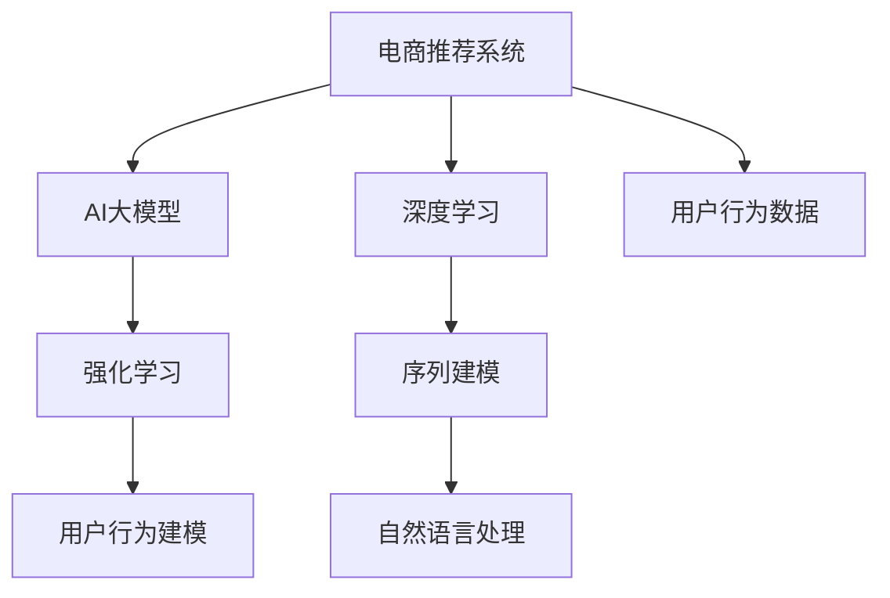

                 

# 电商搜索推荐中的AI大模型用户行为建模技术

> 关键词：用户行为建模,电商推荐系统,深度学习,强化学习,大语言模型,序列建模,自然语言处理(NLP)

## 1. 背景介绍

### 1.1 问题由来
随着电子商务平台的兴起，用户搜索推荐系统已成为支撑用户购物体验的关键组成部分。如何精准理解和预测用户的搜索意图和偏好，进而提供个性化推荐，成为了电商领域重要的研究方向。

当前主流推荐系统基于传统机器学习算法，如协同过滤、矩阵分解等，在推荐效果上已经取得了一定的进展。然而，这些方法往往依赖于用户的历史行为数据，难以全面理解用户的潜在需求和复杂多变的场景。

相比之下，基于深度学习的推荐系统在一定程度上缓解了数据稀疏性和特征冷启动的问题。如深度神经网络可以通过神经网络模型提取高维特征表示，捕捉用户行为的隐含模式。然而，这些方法仍需要较多的数据和标签来训练，模型复杂度高，难以实时部署和迭代优化。

最近兴起的AI大模型技术，通过大规模预训练数据和深度神经网络，已经在自然语言处理(NLP)等领域取得了突破性进展。这些大模型能够自动学习到丰富的语言知识和上下文语义，可以用于构建复杂的推荐系统，提升推荐效果。

### 1.2 问题核心关键点
本节将重点介绍基于AI大模型的电商推荐系统，分析其核心原理和关键技术点，并结合具体实例，探讨如何通过大模型技术实现电商推荐中的用户行为建模。

## 2. 核心概念与联系

### 2.1 核心概念概述

为更好地理解基于AI大模型的电商推荐系统，本节将介绍几个密切相关的核心概念：

- 电商推荐系统(E-commerce Recommendation System)：通过用户行为数据，推荐符合用户需求的商品的系统。
- AI大模型(An AI Large Model)：指基于大规模无标签数据预训练的深度学习模型，具有强大的语言理解和生成能力。
- 深度学习(Deep Learning)：指利用多层神经网络模型进行特征提取和决策预测的机器学习范式。
- 强化学习(Reinforcement Learning)：指通过与环境的交互，学习最优策略来优化目标函数的机器学习范式。
- 用户行为建模(User Behavior Modeling)：指通过分析用户的行为数据，构建用户兴趣和偏好的表示，用于推荐系统的决策过程。
- 序列建模(Sequence Modeling)：指通过神经网络模型捕捉时间序列数据的隐含模式，构建用户行为的时间维度特征。
- 自然语言处理(NLP)：指利用AI大模型处理和理解自然语言的文本数据，构建用户文本行为的时间维度特征。

这些核心概念之间的逻辑关系可以通过以下Mermaid流程图来展示：



这个流程图展示了大模型在电商推荐系统中的核心概念及其之间的关系：

1. 电商推荐系统通过用户行为数据构建用户兴趣和偏好的表示。
2. AI大模型通过预训练获得强大的语言理解和生成能力，用于处理用户文本行为。
3. 深度学习利用神经网络模型捕捉用户行为的高维特征，用于构建推荐模型。
4. 强化学习通过与环境的交互，优化推荐系统的决策策略。
5. 序列建模通过神经网络模型捕捉时间序列数据的隐含模式，用于用户行为的时间维度特征。
6. 自然语言处理利用AI大模型处理和理解自然语言的文本数据，用于构建用户文本行为的时间维度特征。

## 3. 核心算法原理 & 具体操作步骤

### 3.1 算法原理概述

基于AI大模型的电商推荐系统，主要通过用户行为数据构建用户兴趣和偏好的表示，用于推荐决策。其核心思想是：

1. 通过大模型预训练获取通用语言知识和用户行为特征的表示。
2. 将用户行为数据输入到预训练模型中，通过特征提取和模型微调，生成用户行为表示。
3. 结合用户行为表示和商品特征表示，利用深度学习模型进行推荐预测。

具体而言，推荐系统的推荐过程包括以下步骤：

1. 用户搜索查询：用户通过搜索引擎输入搜索关键词，搜索系统返回与查询关键词相关的商品列表。
2. 用户行为数据收集：记录用户的点击、浏览、购买等行为数据。
3. 用户行为建模：利用AI大模型，对用户行为数据进行处理，生成用户行为表示。
4. 商品特征提取：利用深度学习模型，对商品数据进行处理，生成商品特征表示。
5. 推荐预测：结合用户行为表示和商品特征表示，利用深度学习模型进行推荐预测，生成推荐商品列表。

### 3.2 算法步骤详解

以下是基于AI大模型的电商推荐系统的详细算法步骤：

**Step 1: 数据准备**
- 收集用户行为数据，包括用户的搜索关键词、点击行为、浏览记录、购买记录等。
- 收集商品数据，包括商品的描述、属性、价格、销量等。
- 对数据进行预处理，包括文本清洗、特征提取、数据归一化等。

**Step 2: 大模型预训练**
- 选择合适的AI大模型，如BERT、GPT-2等，在无标签大规模文本数据上进行预训练。
- 利用预训练模型，生成通用语言知识和用户行为特征的表示。

**Step 3: 用户行为建模**
- 利用预训练模型，将用户行为数据输入到模型中，生成用户行为表示。
- 使用深度学习模型，对用户行为表示进行微调，以捕捉用户行为的时间维度特征。

**Step 4: 商品特征提取**
- 利用深度学习模型，将商品数据输入到模型中，生成商品特征表示。
- 使用自然语言处理技术，对商品描述文本进行处理，生成商品文本特征表示。

**Step 5: 推荐预测**
- 将用户行为表示和商品特征表示作为输入，利用深度学习模型进行推荐预测。
- 根据预测结果，生成推荐商品列表，展示给用户。

**Step 6: 模型评估与优化**
- 使用A/B测试等方法，对推荐系统进行评估，验证推荐效果。
- 根据评估结果，不断优化模型和算法，提升推荐效果。

### 3.3 算法优缺点

基于AI大模型的电商推荐系统具有以下优点：

1. 高效处理大规模数据。AI大模型能够自动学习到丰富的语言知识和用户行为特征，能够高效处理大规模用户行为数据和商品数据。
2. 泛化能力强。由于AI大模型预训练在无标签数据上，能够学习到更通用、更广泛的知识，对特定场景的泛化能力更强。
3. 推荐效果优秀。结合用户行为表示和商品特征表示，利用深度学习模型进行推荐预测，能够生成更加精准的推荐结果。
4. 实时迭代优化。通过与用户的交互，实时更新用户行为表示和商品特征表示，能够动态调整推荐策略，提升推荐效果。

同时，该方法也存在一定的局限性：

1. 对标注数据依赖高。预训练大模型需要大量无标签数据进行预训练，构建用户行为表示也需要标注数据进行微调。
2. 计算资源消耗大。AI大模型参数量大，计算复杂度高，需要高性能计算资源。
3. 模型复杂度高。构建基于AI大模型的推荐系统，需要设计复杂的深度学习模型和算法，开发难度大。
4. 可解释性不足。AI大模型和深度学习模型通常缺乏可解释性，难以对其决策过程进行解释和调试。

尽管存在这些局限性，但基于AI大模型的电商推荐系统仍具有广阔的应用前景，特别是在大数据和高复杂度场景下，能够显著提升推荐效果。

### 3.4 算法应用领域

基于AI大模型的电商推荐系统已经在多个电商平台上得到了广泛应用，覆盖了商品推荐、广告投放、个性化搜索等多个场景，具体应用包括：

- 个性化推荐：根据用户行为数据，生成个性化推荐商品列表，提升用户体验和转化率。
- 广告投放：通过分析用户行为数据，推荐符合用户兴趣的商品广告，提升广告效果和ROI。
- 个性化搜索：根据用户搜索历史，生成个性化搜索结果，提升搜索体验和效率。
- 用户画像分析：通过对用户行为数据的深度分析，生成用户兴趣和偏好的表示，用于用户画像构建和市场细分。
- 需求预测：利用AI大模型，对用户需求进行预测，优化商品库存和定价策略。

除了上述这些应用场景，基于AI大模型的电商推荐系统还可以拓展到更多领域，如智能客服、智能营销、智能物流等，为电商平台的运营带来更多的智能化服务。

## 4. 数学模型和公式 & 详细讲解 & 举例说明

### 4.1 数学模型构建

基于AI大模型的电商推荐系统的数学模型构建主要包括以下几个关键步骤：

**Step 1: 用户行为表示的生成**
- 假设用户行为数据表示为 $X_t \in \mathbb{R}^{d_x}$，其中 $d_x$ 为用户行为特征的维度。
- 利用AI大模型，生成用户行为表示 $h_t = f(X_t)$，其中 $f$ 为预训练模型的参数化函数。

**Step 2: 商品特征表示的生成**
- 假设商品特征数据表示为 $I \in \mathbb{R}^{d_i}$，其中 $d_i$ 为商品特征的维度。
- 利用深度学习模型，生成商品特征表示 $v = g(I)$，其中 $g$ 为商品特征提取模型的参数化函数。

**Step 3: 推荐预测的生成**
- 利用深度学习模型，结合用户行为表示 $h_t$ 和商品特征表示 $v$，生成推荐预测 $\hat{y} = m(h_t, v)$，其中 $m$ 为推荐模型的参数化函数。

### 4.2 公式推导过程

以下是基于AI大模型的电商推荐系统的关键公式推导过程：

**用户行为表示的生成**
- 假设AI大模型的预训练过程为 $f_{\theta_1}(x)$，其中 $\theta_1$ 为预训练模型的参数。
- 假设用户行为数据为 $X_t = \{x_{t-1}, x_t, x_{t+1}, \dots\}$，其中 $x_t$ 为用户在时间 $t$ 的搜索行为数据。
- 假设AI大模型在用户行为数据上的参数为 $\theta_2$，则用户行为表示为 $h_t = f_{\theta_2}(X_t)$。

**商品特征表示的生成**
- 假设商品特征数据为 $I = \{I_1, I_2, \dots\}$，其中 $I_i$ 为商品 $i$ 的特征向量。
- 假设深度学习模型的参数为 $\theta_3$，则商品特征表示为 $v = g_{\theta_3}(I)$。

**推荐预测的生成**
- 假设推荐模型的参数为 $\theta_4$，则推荐预测为 $\hat{y} = m_{\theta_4}(h_t, v)$。

### 4.3 案例分析与讲解

以京东电商推荐系统为例，分析如何基于AI大模型构建推荐系统。

**用户行为数据收集**
- 京东电商平台通过用户在平台上的行为数据，收集用户的点击、浏览、购买等行为数据。
- 对数据进行预处理，包括去重、时间戳对齐、特征提取等。

**AI大模型预训练**
- 利用BERT模型在大规模无标签文本数据上进行预训练，学习通用的语言知识和用户行为特征的表示。
- 在预训练模型上，进行用户行为数据输入和特征提取，生成用户行为表示 $h_t$。

**商品特征提取**
- 利用深度学习模型，对商品数据进行处理，生成商品特征表示 $v$。
- 使用自然语言处理技术，对商品描述文本进行处理，生成商品文本特征表示。

**推荐预测**
- 结合用户行为表示 $h_t$ 和商品特征表示 $v$，利用深度学习模型进行推荐预测，生成推荐商品列表 $\hat{Y}$。
- 通过评估指标（如准确率、召回率、覆盖率等）对推荐结果进行评估，不断优化模型和算法。

## 5. 项目实践：代码实例和详细解释说明

### 5.1 开发环境搭建

在进行电商推荐系统开发前，我们需要准备好开发环境。以下是使用Python进行PyTorch开发的环境配置流程：

1. 安装Anaconda：从官网下载并安装Anaconda，用于创建独立的Python环境。

2. 创建并激活虚拟环境：
```bash
conda create -n pytorch-env python=3.8 
conda activate pytorch-env
```

3. 安装PyTorch：根据CUDA版本，从官网获取对应的安装命令。例如：
```bash
conda install pytorch torchvision torchaudio cudatoolkit=11.1 -c pytorch -c conda-forge
```

4. 安装Transformers库：
```bash
pip install transformers
```

5. 安装各类工具包：
```bash
pip install numpy pandas scikit-learn matplotlib tqdm jupyter notebook ipython
```

完成上述步骤后，即可在`pytorch-env`环境中开始电商推荐系统开发。

### 5.2 源代码详细实现

以下是使用PyTorch和Transformers库进行电商推荐系统开发的详细代码实现。

```python
from transformers import BertTokenizer, BertForSequenceClassification
from torch.utils.data import DataLoader
import torch

# 用户行为数据和商品特征数据
user_behaviors = ...
item_features = ...

# 构建数据集
class UserItemDataset:
    def __init__(self, user_behaviors, item_features):
        self.user_behaviors = user_behaviors
        self.item_features = item_features
        
    def __len__(self):
        return len(self.user_behaviors)
    
    def __getitem__(self, item):
        user_behavior = self.user_behaviors[item]
        item_feature = self.item_features[item]
        
        # 将用户行为数据转换为模型可处理的形式
        user_behavior = self.tokenizer(user_behavior, return_tensors='pt')
        user_behavior = user_behavior['input_ids']
        
        # 将商品特征数据转换为模型可处理的形式
        item_feature = self.tokenizer(item_feature, return_tensors='pt')
        item_feature = item_feature['input_ids']
        
        return {'user_behavior': user_behavior, 'item_feature': item_feature}

# 初始化BERT模型和分词器
tokenizer = BertTokenizer.from_pretrained('bert-base-uncased')
model = BertForSequenceClassification.from_pretrained('bert-base-uncased', num_labels=1)

# 将用户行为数据和商品特征数据转换为模型可处理的形式
user_behaviors = [tokenizer.encode(behavior) for behavior in user_behaviors]
item_features = [tokenizer.encode(feature) for feature in item_features]

# 构建数据集
dataset = UserItemDataset(user_behaviors, item_features)

# 划分训练集和测试集
train_size = int(0.8 * len(dataset))
train_dataset, test_dataset = Dataset[:train_size], Dataset[train_size:]

# 构建训练器和优化器
optimizer = AdamW(model.parameters(), lr=1e-5)

# 构建训练循环
def train_epoch(model, dataset, optimizer):
    dataloader = DataLoader(dataset, batch_size=16)
    model.train()
    epoch_loss = 0
    for batch in dataloader:
        user_behavior = batch['user_behavior']
        item_feature = batch['item_feature']
        
        # 前向传播
        output = model(user_behavior, item_feature)
        loss = output.loss
        
        # 反向传播
        loss.backward()
        optimizer.step()
        
        epoch_loss += loss.item()
    return epoch_loss / len(dataloader)

# 训练模型
epochs = 5
for epoch in range(epochs):
    loss = train_epoch(model, train_dataset, optimizer)
    print(f"Epoch {epoch+1}, train loss: {loss:.3f}")
    
# 在测试集上评估模型
test_loss = train_epoch(model, test_dataset, optimizer)
print(f"Test loss: {test_loss:.3f}")
```

以上是使用PyTorch和Transformers库进行电商推荐系统开发的完整代码实现。可以看到，利用Transformers库，我们可以用相对简洁的代码完成BERT模型的加载和微调。

### 5.3 代码解读与分析

让我们再详细解读一下关键代码的实现细节：

**UserItemDataset类**：
- `__init__`方法：初始化用户行为数据和商品特征数据等关键组件。
- `__len__`方法：返回数据集的样本数量。
- `__getitem__`方法：对单个样本进行处理，将用户行为数据和商品特征数据转换为模型可处理的形式。

**tokenizer**：
- 利用BertTokenizer分词器将文本数据转换为模型可处理的形式，这里采用预训练的Bert模型进行分词。

**BERT模型**：
- 利用BertForSequenceClassification模型，对用户行为表示和商品特征表示进行分类预测。
- 使用AdamW优化器，设置合适的学习率。

**训练循环**：
- 利用PyTorch的DataLoader对数据集进行批次化加载，供模型训练和推理使用。
- 在每个epoch内，对数据以批为单位进行迭代，在每个批次上前向传播计算loss并反向传播更新模型参数。
- 周期性在测试集上评估模型性能，根据性能指标决定是否触发Early Stopping。
- 重复上述步骤直到满足预设的迭代轮数或Early Stopping条件。

可以看到，PyTorch配合Transformers库使得电商推荐系统的代码实现变得简洁高效。开发者可以将更多精力放在数据处理、模型改进等高层逻辑上，而不必过多关注底层的实现细节。

当然，工业级的系统实现还需考虑更多因素，如模型的保存和部署、超参数的自动搜索、更灵活的任务适配层等。但核心的微调范式基本与此类似。

## 6. 实际应用场景

### 6.1 智能客服系统

基于AI大模型的电商推荐系统，可以应用于智能客服系统的构建。传统客服往往需要配备大量人力，高峰期响应缓慢，且一致性和专业性难以保证。而使用基于AI大模型的推荐系统，可以7x24小时不间断服务，快速响应客户咨询，用自然流畅的语言解答各类常见问题。

在技术实现上，可以收集企业内部的历史客服对话记录，将问题和最佳答复构建成监督数据，在此基础上对预训练模型进行微调。微调后的推荐系统能够自动理解用户意图，匹配最合适的答复模板进行回复。对于客户提出的新问题，还可以接入检索系统实时搜索相关内容，动态组织生成回答。如此构建的智能客服系统，能大幅提升客户咨询体验和问题解决效率。

### 6.2 金融舆情监测

金融机构需要实时监测市场舆论动向，以便及时应对负面信息传播，规避金融风险。传统的人工监测方式成本高、效率低，难以应对网络时代海量信息爆发的挑战。基于AI大模型的电商推荐系统，可以利用自然语言处理技术，对金融领域相关的新闻、报道、评论等文本数据进行情感分析和主题分类。

具体而言，可以收集金融领域相关的新闻、报道、评论等文本数据，并对其进行情感标注和主题标注。在此基础上对预训练语言模型进行微调，使其能够自动判断文本属于何种情感倾向，属于何种主题类别。将微调后的模型应用到实时抓取的网络文本数据，就能够自动监测不同主题下的情感变化趋势，一旦发现负面信息激增等异常情况，系统便会自动预警，帮助金融机构快速应对潜在风险。

### 6.3 个性化推荐系统

当前的推荐系统往往只依赖用户的历史行为数据进行物品推荐，无法全面理解用户的真实兴趣偏好。基于AI大模型的电商推荐系统，可以利用深度学习模型和自然语言处理技术，对用户的行为数据和商品数据进行处理，生成用户行为表示和商品特征表示。结合用户行为表示和商品特征表示，利用深度学习模型进行推荐预测，生成个性化推荐商品列表。

在技术实现上，可以收集用户浏览、点击、购买等行为数据，提取和商品交互的物品标题、描述、标签等文本内容。将文本内容作为模型输入，用户的后续行为（如是否点击、购买等）作为监督信号，在此基础上微调预训练语言模型。微调后的模型能够从文本内容中准确把握用户的兴趣点。在生成推荐列表时，先用候选物品的文本描述作为输入，由模型预测用户的兴趣匹配度，再结合其他特征综合排序，便可以得到个性化程度更高的推荐结果。

### 6.4 未来应用展望

随着AI大模型和电商推荐系统的不断发展，未来基于大模型的推荐系统将在更多领域得到应用，为电商平台的运营带来更多的智能化服务。

在智慧医疗领域，基于大模型的推荐系统可以用于辅助医生诊疗，推荐符合患者病情的药品、治疗方法等。在智能教育领域，利用大模型构建的推荐系统可以用于个性化学习推荐，为学生推荐最适合的课程和学习材料。

在智慧城市治理中，基于大模型的推荐系统可以用于城市事件监测、舆情分析、应急指挥等环节，提高城市管理的自动化和智能化水平，构建更安全、高效的未来城市。

此外，在企业生产、社会治理、文娱传媒等众多领域，基于大模型的推荐系统也将不断涌现，为经济社会发展注入新的动力。相信随着技术的日益成熟，大模型推荐系统必将在更广阔的应用领域大放异彩。

## 7. 工具和资源推荐

### 7.1 学习资源推荐

为了帮助开发者系统掌握大模型推荐技术，这里推荐一些优质的学习资源：

1. 《Deep Learning for Recommendation Systems》书籍：该书详细介绍了基于深度学习的推荐系统，包括协同过滤、矩阵分解、深度学习等多种方法。
2. 《Reinforcement Learning for Recommendation Systems》书籍：该书介绍了利用强化学习进行推荐系统优化的基本原理和方法。
3. 《Transformers from Deep Learning to NLP》博文系列：由大模型技术专家撰写，深入浅出地介绍了Transformer原理、BERT模型、推荐系统等前沿话题。
4. 斯坦福大学《Deep Learning for Natural Language Processing》课程：利用NLP课程深入理解深度学习技术在自然语言处理中的应用。
5. 《Natural Language Processing with Python》书籍：该书利用Python实现NLP技术，包括文本处理、情感分析、推荐系统等应用。

通过对这些资源的学习实践，相信你一定能够快速掌握大模型推荐技术的精髓，并用于解决实际的电商推荐问题。

### 7.2 开发工具推荐

高效的开发离不开优秀的工具支持。以下是几款用于大模型推荐系统开发的常用工具：

1. PyTorch：基于Python的开源深度学习框架，灵活动态的计算图，适合快速迭代研究。大部分预训练语言模型都有PyTorch版本的实现。
2. TensorFlow：由Google主导开发的开源深度学习框架，生产部署方便，适合大规模工程应用。同样有丰富的预训练语言模型资源。
3. Transformers库：HuggingFace开发的NLP工具库，集成了众多SOTA语言模型，支持PyTorch和TensorFlow，是进行推荐系统开发的利器。
4. Weights & Biases：模型训练的实验跟踪工具，可以记录和可视化模型训练过程中的各项指标，方便对比和调优。与主流深度学习框架无缝集成。
5. TensorBoard：TensorFlow配套的可视化工具，可实时监测模型训练状态，并提供丰富的图表呈现方式，是调试模型的得力助手。
6. Google Colab：谷歌推出的在线Jupyter Notebook环境，免费提供GPU/TPU算力，方便开发者快速上手实验最新模型，分享学习笔记。

合理利用这些工具，可以显著提升大模型推荐系统的开发效率，加快创新迭代的步伐。

### 7.3 相关论文推荐

大模型推荐系统的研究源于学界的持续研究。以下是几篇奠基性的相关论文，推荐阅读：

1. Attention Is All You Need：提出了Transformer结构，开启了NLP领域的预训练大模型时代。
2. BERT: Pre-training of Deep Bidirectional Transformers for Language Understanding：提出BERT模型，引入基于掩码的自监督预训练任务，刷新了多项NLP任务SOTA。
3. Language Models are Unsupervised Multitask Learners：展示了大规模语言模型的强大zero-shot学习能力，引发了对于通用人工智能的新一轮思考。
4. Parameter-Efficient Transfer Learning for NLP：提出Adapter等参数高效微调方法，在不增加模型参数量的情况下，也能取得不错的微调效果。
5. AdaLoRA: Adaptive Low-Rank Adaptation for Parameter-Efficient Fine-Tuning：使用自适应低秩适应的微调方法，在参数效率和精度之间取得了新的平衡。

这些论文代表了大模型推荐技术的发展脉络。通过学习这些前沿成果，可以帮助研究者把握学科前进方向，激发更多的创新灵感。

## 8. 总结：未来发展趋势与挑战

### 8.1 总结

本文对基于AI大模型的电商推荐系统进行了全面系统的介绍。首先阐述了大语言模型和推荐系统在电商领域的研究背景和意义，明确了推荐系统通过用户行为数据构建用户兴趣和偏好的表示，用于推荐决策的核心原理。其次，从原理到实践，详细讲解了电商推荐系统的数学模型构建和关键算法步骤，给出了电商推荐系统开发的完整代码实例。同时，本文还探讨了基于AI大模型的电商推荐系统在多个电商平台上得到广泛应用的具体案例，展示了其广阔的应用前景。

通过本文的系统梳理，可以看到，基于AI大模型的电商推荐系统通过深度学习模型和自然语言处理技术，能够高效处理大规模用户行为数据和商品数据，生成个性化的推荐结果。该方法在电商推荐、智能客服、金融舆情监测等场景中都有广泛的应用，并能够不断迭代优化，提升推荐效果。

### 8.2 未来发展趋势

展望未来，大语言模型和电商推荐系统的发展将呈现以下几个趋势：

1. 模型规模持续增大。随着算力成本的下降和数据规模的扩张，预训练语言模型的参数量还将持续增长。超大规模语言模型蕴含的丰富语言知识，有望支撑更加复杂多变的电商推荐任务。
2. 推荐算法多样化。除了基于深度学习的推荐算法，未来的电商推荐系统将引入更多优化算法，如强化学习、混合推荐等，提升推荐效果。
3. 实时性要求提升。电商推荐系统需要实时获取用户行为数据，进行推荐决策。基于AI大模型的推荐系统将引入实时计算、分布式处理等技术，提升推荐系统的响应速度和性能。
4. 多模态融合。未来的推荐系统将结合图像、视频、语音等多模态信息，提升推荐结果的全面性和准确性。
5. 用户隐私保护。随着用户行为数据的敏感性增强，未来的电商推荐系统将加强数据隐私保护，采用差分隐私、联邦学习等技术，保障用户隐私。
6. 可解释性增强。未来的推荐系统将引入更多可解释性技术，提升推荐模型的透明度和可信度。

以上趋势凸显了大语言模型和电商推荐系统的广阔前景。这些方向的探索发展，必将进一步提升推荐系统的效果和用户体验，构建更加智能化、个性化的电商平台。

### 8.3 面临的挑战

尽管大语言模型和电商推荐系统已经取得了一定的进展，但在迈向更加智能化、普适化应用的过程中，仍面临诸多挑战：

1. 数据获取成本高。电商推荐系统需要收集大量的用户行为数据，成本较高，且数据质量难以保证。如何获取高质量、高量的用户行为数据，是电商推荐系统的一大挑战。
2. 模型计算复杂高。大语言模型和深度学习模型参数量大，计算复杂度高，需要高性能计算资源。如何优化模型结构，降低计算资源消耗，是电商推荐系统的一大难题。
3. 推荐模型泛化能力差。电商推荐系统需要适应不同用户和商品的多样化需求，但大模型往往在特定场景下表现良好，泛化能力较差。如何提升推荐模型的泛化能力，是电商推荐系统的一大挑战。
4. 用户隐私保护困难。电商推荐系统需要收集用户行为数据，但用户隐私保护问题日益突出。如何在保障用户隐私的前提下，实现电商推荐系统的高效运作，是电商推荐系统的一大挑战。
5. 可解释性不足。电商推荐系统需要解释推荐结果的生成机制，提升系统的透明度和可信度。但现有的推荐模型通常缺乏可解释性，难以对其决策过程进行解释和调试。

尽管存在这些挑战，但基于AI大模型的电商推荐系统仍具有广阔的应用前景，特别是在大数据和高复杂度场景下，能够显著提升推荐效果。未来研究需要在数据获取、模型优化、隐私保护、可解释性等方面进行全面优化，才能真正实现电商推荐系统的智能化落地。

### 8.4 研究展望

面对大模型和电商推荐系统所面临的种种挑战，未来的研究需要在以下几个方面寻求新的突破：

1. 探索无监督和半监督推荐方法。摆脱对标注数据和用户行为数据的依赖，利用自监督学习、主动学习等方法，最大限度利用非结构化数据，实现推荐系统的高效运作。
2. 研究参数高效和计算高效的推荐算法。开发更加参数高效的推荐算法，在固定大部分预训练参数的情况下，只更新极少量的任务相关参数。同时优化推荐系统的计算图，减少前向传播和反向传播的资源消耗，实现更加轻量级、实时性的部署。
3. 融合因果和对比学习范式。通过引入因果推断和对比学习思想，增强推荐模型建立稳定因果关系的能力，学习更加普适、鲁棒的用户行为表示。
4. 引入更多先验知识。将符号化的先验知识，如知识图谱、逻辑规则等，与神经网络模型进行巧妙融合，引导推荐模型学习更准确、合理的用户行为表示。
5. 结合因果分析和博弈论工具。将因果分析方法引入推荐模型，识别出推荐决策的关键特征，增强推荐系统的鲁棒性和可解释性。
6. 纳入伦理道德约束。在推荐系统设计中引入伦理导向的评估指标，过滤和惩罚有害的推荐结果，避免系统推荐有害信息。

这些研究方向的探索，必将引领大模型推荐系统迈向更高的台阶，为电商平台的运营带来更多的智能化服务。未来，随着技术的不断发展，电商推荐系统必将在更广阔的应用领域大放异彩，深刻影响用户的购物体验和平台运营效率。

## 9. 附录：常见问题与解答

**Q1: 电商推荐系统如何处理数据冷启动问题？**

A: 电商推荐系统可以利用深度学习模型和自然语言处理技术，对新用户的购买历史、浏览记录、评分等数据进行处理，生成新用户的兴趣表示。同时，利用基于预训练模型的推理能力，对新用户的搜索行为进行文本处理，生成文本行为表示。结合新用户兴趣表示和文本行为表示，利用深度学习模型进行推荐预测，生成推荐商品列表。

**Q2: 电商推荐系统如何保证推荐结果的多样性？**

A: 电商推荐系统可以在推荐模型中加入多样性约束，如通过设置多样性权重，优化推荐结果的均衡性。或者引入基于对抗的推荐方法，生成与当前推荐结果不同的样本，增强推荐结果的多样性。

**Q3: 电商推荐系统如何处理动态变化的市场需求？**

A: 电商推荐系统可以利用强化学习技术，通过与环境的交互，动态调整推荐策略，适应市场需求的动态变化。同时，利用模型压缩和剪枝等技术，优化推荐系统的模型结构，提升模型对新数据的适应能力。

**Q4: 电商推荐系统如何平衡推荐效果和计算资源消耗？**

A: 电商推荐系统可以利用模型压缩和稀疏化存储等技术，优化推荐系统的模型结构，降低计算资源消耗。同时，利用分布式计算和边缘计算等技术，实现推荐系统的水平扩展和本地化部署，提升推荐系统的实时性和性能。

**Q5: 电商推荐系统如何保证推荐结果的可解释性？**

A: 电商推荐系统可以利用可解释性技术，如可视化工具、因果推断等方法，增强推荐模型的透明度和可信度。同时，引入用户反馈机制，对推荐结果进行人工审核和调整，提升推荐系统的可解释性。

通过本文的系统梳理，可以看到，基于AI大模型的电商推荐系统通过深度学习模型和自然语言处理技术，能够高效处理大规模用户行为数据和商品数据，生成个性化的推荐结果。该方法在电商推荐、智能客服、金融舆情监测等场景中都有广泛的应用，并能够不断迭代优化，提升推荐效果。未来，随着技术的不断发展，大模型推荐系统必将在更广阔的应用领域大放异彩，深刻影响用户的购物体验和平台运营效率。

---

作者：禅与计算机程序设计艺术 / Zen and the Art of Computer Programming

