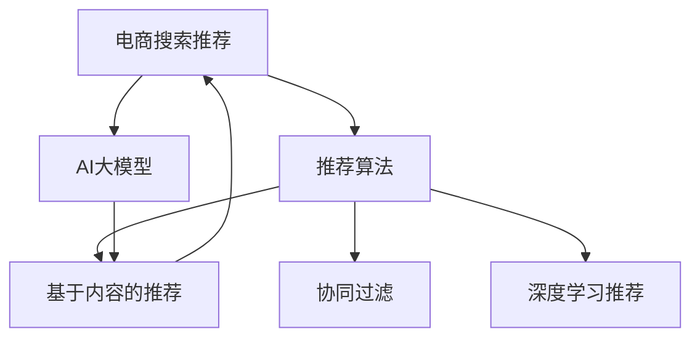

                 

# 电商搜索推荐中的AI大模型算法工程化实践

> 关键词：电商搜索推荐, AI大模型, 工程化实践, 推荐算法, 推荐系统

## 1. 背景介绍

在电商领域，搜索推荐系统一直是提升用户体验、增加销售转化的核心技术。传统的推荐系统依赖于用户行为数据进行协同过滤、基于内容的推荐等方法，往往忽略了对用户偏好的动态学习和对商品信息的深度理解。

近年来，随着深度学习和预训练大模型的兴起，越来越多的电商企业开始探索将AI大模型引入推荐系统，以期通过大规模语言模型的语义理解能力，提升推荐效果和个性化水平。本文将详细介绍如何将AI大模型算法工程化，并将其应用于电商搜索推荐系统。

## 2. 核心概念与联系

### 2.1 核心概念概述

为更好地理解基于大模型的电商推荐系统，本节将介绍几个密切相关的核心概念：

- **电商搜索推荐**：通过分析用户查询和点击记录，推荐相关商品给用户的技术。是电商个性化服务的重要一环。
- **AI大模型**：如BERT、GPT-3等大规模预训练语言模型。通过在大量无标签文本数据上预训练，具备强大的语言理解和生成能力。
- **推荐算法**：如协同过滤、基于内容的推荐、深度学习等方法。用于构建推荐模型，预测用户对商品的兴趣。
- **工程化实践**：将算法思想转化为实际应用的工程方法，包括模型部署、数据处理、超参调优等。

这些核心概念之间的逻辑关系可以通过以下Mermaid流程图来展示：



这个流程图展示了大模型与推荐算法在电商推荐系统中的连接关系：

1. 电商搜索推荐系统采用多种推荐算法，包括协同过滤、内容推荐和深度学习推荐等。
2. AI大模型可以辅助推荐算法，提升其推荐效果和个性化水平。
3. 大模型在预训练和微调过程中，逐步学习到商品信息的丰富表示，可以用于提升推荐质量。

## 3. 核心算法原理 & 具体操作步骤

### 3.1 算法原理概述

基于AI大模型的电商搜索推荐系统，本质上是一个基于语义理解的推荐框架。其核心思想是：利用大模型的语言理解和生成能力，对用户查询和商品信息进行语义匹配，从而提升推荐的相关性和个性化。

具体地，假设用户查询 $Q$ 和商品 $I$ 分别被编码成向量 $\boldsymbol{q}$ 和 $\boldsymbol{i}$。模型在预训练和微调过程中，逐步学习到 $\boldsymbol{q}$ 和 $\boldsymbol{i}$ 之间的语义相似度 $S(\boldsymbol{q},\boldsymbol{i})$，用于度量查询和商品的匹配程度。

基于相似度，推荐系统可以采用如下策略进行推荐：
1. 计算相似度 $S(\boldsymbol{q},\boldsymbol{i})$，得到推荐列表 $I'$。
2. 排序推荐列表 $I'$，输出前$k$个最相关的商品。

### 3.2 算法步骤详解

基于AI大模型的电商搜索推荐系统主要包括以下几个关键步骤：

**Step 1: 数据收集与预处理**

- 收集电商平台上的用户查询、点击、购买等行为数据，并进行清洗和标注。
- 对商品信息进行语义处理，提取关键词、描述等文本信息，进行向量编码。
- 使用开源工具如BERT、GPT-3等，对用户查询和商品信息进行预训练，生成预训练向量。

**Step 2: 模型选择与微调**

- 选择合适的大模型作为初始化参数，如BERT、GPT-3等。
- 设计任务适配层，如线性分类器、池化层等，将大模型输出转换为推荐分数。
- 在微调过程中，保持大部分预训练参数不变，仅微调顶层分类器或解码器。
- 使用少量标注数据进行微调，优化模型以适应电商推荐场景。

**Step 3: 特征工程与模型集成**

- 设计多种特征，如商品类别、价格、评分、用户历史行为等，并进行特征组合和选择。
- 结合大模型输出的语义匹配分数，采用加权、融合等方法，进行模型集成。
- 使用交叉验证等方法，评估模型在验证集上的效果，进行超参数调优。

**Step 4: 部署与监控**

- 将微调后的模型部署到电商平台的推荐引擎中，实时响应用户查询。
- 实时监控推荐系统性能，如召回率、点击率、转化率等指标。
- 根据监控结果，动态调整模型参数和特征，优化推荐效果。

### 3.3 算法优缺点

基于AI大模型的电商推荐系统具有以下优点：
1. 语义匹配能力强。大模型通过语义理解，能够精确匹配用户查询和商品信息。
2. 个性化水平高。能够根据用户的历史行为和当前查询，动态调整推荐策略。
3. 可扩展性强。大模型具备强大的泛化能力，可以应用于多种电商推荐场景。

同时，该方法也存在一定的局限性：
1. 对标注数据依赖强。推荐系统的性能很大程度上取决于标注数据的丰富性。
2. 计算成本高。大模型的推理速度和内存占用较大，可能会影响实时推荐。
3. 模型复杂度大。大模型的参数量和计算量较大，需要进行细致的模型裁剪和优化。
4. 鲁棒性不足。面对噪声数据和对抗样本，模型可能会产生误判。

尽管存在这些局限性，但就目前而言，基于AI大模型的推荐系统仍然是电商推荐领域的前沿技术，具有广阔的应用前景。

### 3.4 算法应用领域

基于AI大模型的电商推荐系统已经在众多电商企业中得到了应用，覆盖了从商品推荐到个性化展示等多个环节，例如：

- **商品推荐**：根据用户查询，推荐相关商品，如T恤、手机、书籍等。
- **个性化展示**：在搜索结果页面上，展示最相关和最有吸引力的商品，提升用户点击率。
- **新用户引导**：针对新用户，推荐品牌和热门商品，加速用户购买决策。
- **商品搜索**：提升搜索结果的相关性，减少用户查找时间，提升搜索体验。

除了上述这些经典应用外，AI大模型推荐系统还被创新性地应用于搜索智能、广告投放、客户维护等环节，为电商企业带来了新的业务机会。

## 4. 数学模型和公式 & 详细讲解 & 举例说明

### 4.1 数学模型构建

本节将使用数学语言对基于AI大模型的电商推荐系统进行更加严格的刻画。

记用户查询为 $Q=\{q_1,q_2,\cdots,q_l\}$，商品信息为 $I=\{i_1,i_2,\cdots,i_m\}$，其中 $q_i$ 和 $i_j$ 分别表示查询和商品的词语。假设用户查询 $Q$ 和商品 $I$ 分别被编码成向量 $\boldsymbol{q} \in \mathbb{R}^d$ 和 $\boldsymbol{i} \in \mathbb{R}^d$。

定义模型 $M_{\theta}$ 在查询 $Q$ 和商品 $I$ 上的语义匹配分数为 $S(Q,I)=\mathbb{E}_{Q,I}[\cos(\boldsymbol{q},\boldsymbol{i})]$，其中 $\cos(\cdot,\cdot)$ 为余弦相似度。

推荐系统采用如下策略进行推荐：
1. 计算语义匹配分数 $S(Q,I)$，得到推荐列表 $I'$。
2. 排序推荐列表 $I'$，输出前$k$个最相关的商品。

### 4.2 公式推导过程

以下我们以二分类任务为例，推导语义匹配分数的计算公式。

假设模型 $M_{\theta}$ 在查询 $Q$ 和商品 $I$ 上的输出为 $\hat{y}=\text{softmax}(M_{\theta}(Q,I))$，表示模型预测商品 $i_j$ 与查询 $q_i$ 的匹配概率。则语义匹配分数 $S(Q,I)$ 可以定义为：

$$
S(Q,I)=\mathbb{E}_{Q,I}[\hat{y}_i] = \mathbb{E}_{Q,I}[\text{softmax}(M_{\theta}(Q,I))_i]
$$

其中 $i$ 表示商品 $i_j$ 的索引。

将 $\text{softmax}$ 函数展开，得到：

$$
S(Q,I)=\frac{\exp(\mathbb{E}_{Q,I}[M_{\theta}(Q,I)])}{\sum_j \exp(\mathbb{E}_{Q,I}[M_{\theta}(Q,i_j)])
$$

根据链式法则，上式可以进一步推导为：

$$
S(Q,I)=\frac{\exp(\sum_i \mathbb{E}_{Q}[M_{\theta}(Q,i_i)])}{\sum_j \exp(\mathbb{E}_{Q}[M_{\theta}(Q,i_j)])
$$

在微调过程中，目标是最小化经验风险，即：

$$
\theta^* = \mathop{\arg\min}_{\theta} \frac{1}{N}\sum_{i=1}^N \sum_{j=1}^M \mathbb{E}_{Q}[\ell(Q,i_j)]
$$

其中 $\ell(Q,i_j)$ 为语义匹配分数的损失函数，如交叉熵损失等。

### 4.3 案例分析与讲解

假设电商平台收集到一批用户查询 $Q=\{q_1,q_2,\cdots,q_l\}$ 和商品 $I=\{i_1,i_2,\cdots,i_m\}$ 的语义匹配分数，并通过负采样策略构造训练集 $\{(Q_i,i_j)\}_{i=1}^N$。假设查询 $Q_i$ 与商品 $i_j$ 的匹配概率为 $y_i=\text{softmax}(M_{\theta}(Q_i,i_j))$，则目标是最小化经验风险：

$$
\theta^* = \mathop{\arg\min}_{\theta} \frac{1}{N}\sum_{i=1}^N \sum_{j=1}^M y_j \ell(Q_i,i_j)
$$

其中 $\ell(Q_i,i_j)$ 为交叉熵损失。

## 5. 项目实践：代码实例和详细解释说明

### 5.1 开发环境搭建

在进行电商搜索推荐系统的开发之前，我们需要准备好开发环境。以下是使用Python进行PyTorch开发的环境配置流程：

1. 安装Anaconda：从官网下载并安装Anaconda，用于创建独立的Python环境。

2. 创建并激活虚拟环境：
```bash
conda create -n ecommerce-env python=3.8 
conda activate ecommerce-env
```

3. 安装PyTorch：根据CUDA版本，从官网获取对应的安装命令。例如：
```bash
conda install pytorch torchvision torchaudio cudatoolkit=11.1 -c pytorch -c conda-forge
```

4. 安装Transformer库：
```bash
pip install transformers
```

5. 安装各类工具包：
```bash
pip install numpy pandas scikit-learn matplotlib tqdm jupyter notebook ipython
```

完成上述步骤后，即可在`ecommerce-env`环境中开始电商搜索推荐系统的开发。

### 5.2 源代码详细实现

下面我们以电商商品推荐为例，给出使用Transformers库进行大模型微调的PyTorch代码实现。

首先，定义商品数据的处理函数：

```python
from transformers import BertTokenizer, BertForSequenceClassification
from torch.utils.data import Dataset, DataLoader
import torch

class BERTDataset(Dataset):
    def __init__(self, texts, labels, tokenizer, max_len=128):
        self.texts = texts
        self.labels = labels
        self.tokenizer = tokenizer
        self.max_len = max_len
        
    def __len__(self):
        return len(self.texts)
    
    def __getitem__(self, item):
        text = self.texts[item]
        label = self.labels[item]
        
        encoding = self.tokenizer(text, return_tensors='pt', max_length=self.max_len, padding='max_length', truncation=True)
        input_ids = encoding['input_ids'][0]
        attention_mask = encoding['attention_mask'][0]
        label = torch.tensor(label, dtype=torch.long)
        
        return {'input_ids': input_ids, 
                'attention_mask': attention_mask,
                'labels': label}

# 数据集准备
tokenizer = BertTokenizer.from_pretrained('bert-base-cased')
train_dataset = BERTDataset(train_texts, train_labels, tokenizer)
dev_dataset = BERTDataset(dev_texts, dev_labels, tokenizer)
test_dataset = BERTDataset(test_texts, test_labels, tokenizer)
```

然后，定义模型和优化器：

```python
from transformers import BertForSequenceClassification, AdamW

model = BertForSequenceClassification.from_pretrained('bert-base-cased', num_labels=num_labels)

optimizer = AdamW(model.parameters(), lr=2e-5)
```

接着，定义训练和评估函数：

```python
from sklearn.metrics import accuracy_score

device = torch.device('cuda') if torch.cuda.is_available() else torch.device('cpu')
model.to(device)

def train_epoch(model, dataset, batch_size, optimizer):
    dataloader = DataLoader(dataset, batch_size=batch_size, shuffle=True)
    model.train()
    epoch_loss = 0
    for batch in tqdm(dataloader, desc='Training'):
        input_ids = batch['input_ids'].to(device)
        attention_mask = batch['attention_mask'].to(device)
        labels = batch['labels'].to(device)
        model.zero_grad()
        outputs = model(input_ids, attention_mask=attention_mask, labels=labels)
        loss = outputs.loss
        epoch_loss += loss.item()
        loss.backward()
        optimizer.step()
    return epoch_loss / len(dataloader)

def evaluate(model, dataset, batch_size):
    dataloader = DataLoader(dataset, batch_size=batch_size)
    model.eval()
    preds, labels = [], []
    with torch.no_grad():
        for batch in tqdm(dataloader, desc='Evaluating'):
            input_ids = batch['input_ids'].to(device)
            attention_mask = batch['attention_mask'].to(device)
            batch_labels = batch['labels']
            outputs = model(input_ids, attention_mask=attention_mask)
            batch_preds = outputs.logits.argmax(dim=2).to('cpu').tolist()
            batch_labels = batch_labels.to('cpu').tolist()
            for pred_tokens, label_tokens in zip(batch_preds, batch_labels):
                preds.append(pred_tokens[:len(label_tokens)])
                labels.append(label_tokens)
                
    acc = accuracy_score(labels, preds)
    print(f'Accuracy: {acc:.3f}')
```

最后，启动训练流程并在测试集上评估：

```python
epochs = 5
batch_size = 16

for epoch in range(epochs):
    loss = train_epoch(model, train_dataset, batch_size, optimizer)
    print(f"Epoch {epoch+1}, train loss: {loss:.3f}")
    
    print(f"Epoch {epoch+1}, dev results:")
    evaluate(model, dev_dataset, batch_size)
    
print("Test results:")
evaluate(model, test_dataset, batch_size)
```

以上就是使用PyTorch对BERT进行电商商品推荐任务微调的完整代码实现。可以看到，得益于Transformers库的强大封装，我们可以用相对简洁的代码完成BERT模型的加载和微调。

### 5.3 代码解读与分析

让我们再详细解读一下关键代码的实现细节：

**BERTDataset类**：
- `__init__`方法：初始化文本、标签、分词器等关键组件。
- `__len__`方法：返回数据集的样本数量。
- `__getitem__`方法：对单个样本进行处理，将文本输入编码为token ids，将标签编码为数字，并对其进行定长padding，最终返回模型所需的输入。

**BertForSequenceClassification模型**：
- `__init__`方法：初始化大模型参数，设置输出层和分类器。
- `forward`方法：前向传播计算模型的输出。
- `loss`方法：计算模型的损失函数。

**训练和评估函数**：
- 使用PyTorch的DataLoader对数据集进行批次化加载，供模型训练和推理使用。
- 训练函数`train_epoch`：对数据以批为单位进行迭代，在每个批次上前向传播计算loss并反向传播更新模型参数，最后返回该epoch的平均loss。
- 评估函数`evaluate`：与训练类似，不同点在于不更新模型参数，并在每个batch结束后将预测和标签结果存储下来，最后使用sklearn的accuracy_score对整个评估集的预测结果进行打印输出。

**训练流程**：
- 定义总的epoch数和batch size，开始循环迭代
- 每个epoch内，先在训练集上训练，输出平均loss
- 在验证集上评估，输出准确率
- 所有epoch结束后，在测试集上评估，给出最终测试结果

可以看到，PyTorch配合Transformers库使得BERT微调的代码实现变得简洁高效。开发者可以将更多精力放在数据处理、模型改进等高层逻辑上，而不必过多关注底层的实现细节。

当然，工业级的系统实现还需考虑更多因素，如模型的保存和部署、超参数的自动搜索、更灵活的任务适配层等。但核心的微调范式基本与此类似。

## 6. 实际应用场景
### 6.1 智能搜索推荐

电商搜索推荐系统通过分析用户查询，推荐最相关的商品给用户。传统推荐系统往往依赖于用户行为数据进行协同过滤或基于内容的推荐，无法精确匹配查询意图。

引入大模型的电商推荐系统，可以通过语义匹配提升推荐效果。具体而言，平台可以收集用户查询和商品信息，使用大模型对其进行预训练和微调，从而提升匹配精度。微调后的模型能够准确理解查询和商品之间的语义关系，推荐出更加相关和多样化的商品。

例如，当用户输入“我想买一件T恤”时，推荐系统可以通过预训练大模型识别出查询中的实体“T恤”，并在商品信息中查找与之匹配的商品。如果匹配到“Nike运动T恤”，系统则推荐该商品。

### 6.2 个性化展示

电商平台的商品展示页面需要根据用户的浏览记录和点击行为，动态调整展示顺序，提升用户体验和购买转化率。传统推荐系统往往无法实时调整展示策略。

引入大模型的电商推荐系统，可以通过语义匹配和上下文理解，动态调整推荐列表。例如，当用户点击浏览商品A时，系统可以实时调整后续推荐列表，添加类似商品B和相关商品C，提高用户浏览和购买兴趣。

此外，大模型还可以通过分析用户行为数据，预测用户的潜在需求，提前推荐相关商品。例如，当用户搜索“手机”时，推荐系统可以提前推荐新款手机，提升购买转化率。

### 6.3 新用户引导

电商平台的推广活动和新人引导，需要快速吸引新用户关注，提升其购买转化率。传统推荐系统往往无法实时响应新用户的浏览和点击行为。

引入大模型的电商推荐系统，可以通过语义匹配和新用户行为分析，提升新用户购买转化率。例如，当新用户访问电商平台时，推荐系统可以实时推荐热门商品、优惠券和促销信息，引导其完成购买。

### 6.4 商品搜索

电商平台的商品搜索功能需要提升搜索结果的相关性和准确性，缩短用户查找时间。传统推荐系统往往依赖于关键字匹配，无法理解查询的语义。

引入大模型的电商推荐系统，可以通过语义匹配和上下文理解，提升搜索结果的相关性。例如，当用户搜索“做饭食谱”时，推荐系统可以匹配出各种烹饪技巧、食材购买和厨具推荐，缩短用户查找时间。

## 7. 工具和资源推荐
### 7.1 学习资源推荐

为了帮助开发者系统掌握基于大模型的电商推荐技术的理论基础和实践技巧，这里推荐一些优质的学习资源：

1. **《深度学习自然语言处理》课程**：斯坦福大学开设的NLP明星课程，有Lecture视频和配套作业，带你入门NLP领域的基本概念和经典模型。

2. **Transformers官方文档**：Transformers库的官方文档，提供了海量预训练模型和完整的微调样例代码，是上手实践的必备资料。

3. **《Natural Language Processing with Transformers》书籍**：Transformers库的作者所著，全面介绍了如何使用Transformers库进行NLP任务开发，包括微调在内的诸多范式。

4. **Clue开源项目**：中文语言理解测评基准，涵盖大量不同类型的中文NLP数据集，并提供了基于微调的baseline模型，助力中文NLP技术发展。

通过对这些资源的学习实践，相信你一定能够快速掌握基于大模型的电商推荐技术的精髓，并用于解决实际的NLP问题。

### 7.2 开发工具推荐

高效的开发离不开优秀的工具支持。以下是几款用于大模型电商推荐系统开发的常用工具：

1. **PyTorch**：基于Python的开源深度学习框架，灵活动态的计算图，适合快速迭代研究。大部分预训练语言模型都有PyTorch版本的实现。

2. **TensorFlow**：由Google主导开发的开源深度学习框架，生产部署方便，适合大规模工程应用。同样有丰富的预训练语言模型资源。

3. **Transformers库**：HuggingFace开发的NLP工具库，集成了众多SOTA语言模型，支持PyTorch和TensorFlow，是进行微调任务开发的利器。

4. **Weights & Biases**：模型训练的实验跟踪工具，可以记录和可视化模型训练过程中的各项指标，方便对比和调优。与主流深度学习框架无缝集成。

5. **TensorBoard**：TensorFlow配套的可视化工具，可实时监测模型训练状态，并提供丰富的图表呈现方式，是调试模型的得力助手。

6. **Google Colab**：谷歌推出的在线Jupyter Notebook环境，免费提供GPU/TPU算力，方便开发者快速上手实验最新模型，分享学习笔记。

合理利用这些工具，可以显著提升大模型电商推荐系统的开发效率，加快创新迭代的步伐。

### 7.3 相关论文推荐

电商推荐系统和大模型推荐技术的发展源于学界的持续研究。以下是几篇奠基性的相关论文，推荐阅读：

1. **Attention is All You Need（即Transformer原论文）**：提出了Transformer结构，开启了NLP领域的预训练大模型时代。

2. **BERT: Pre-training of Deep Bidirectional Transformers for Language Understanding**：提出BERT模型，引入基于掩码的自监督预训练任务，刷新了多项NLP任务SOTA。

3. **Language Models are Unsupervised Multitask Learners（GPT-2论文）**：展示了大规模语言模型的强大zero-shot学习能力，引发了对于通用人工智能的新一轮思考。

4. **Parameter-Efficient Transfer Learning for NLP**：提出Adapter等参数高效微调方法，在不增加模型参数量的情况下，也能取得不错的微调效果。

5. **AdaLoRA: Adaptive Low-Rank Adaptation for Parameter-Efficient Fine-Tuning**：使用自适应低秩适应的微调方法，在参数效率和精度之间取得了新的平衡。

这些论文代表了大模型电商推荐系统的发展脉络。通过学习这些前沿成果，可以帮助研究者把握学科前进方向，激发更多的创新灵感。

## 8. 总结：未来发展趋势与挑战

### 8.1 总结

本文对基于大模型的电商搜索推荐系统进行了全面系统的介绍。首先阐述了大模型和电商推荐系统的发展背景和意义，明确了基于大模型的推荐系统在电商领域的重要价值。其次，从原理到实践，详细讲解了电商推荐系统的数学模型和关键步骤，给出了电商商品推荐任务的完整代码实例。同时，本文还广泛探讨了电商推荐系统在智能搜索、个性化展示、新用户引导等多个领域的应用前景，展示了大模型推荐系统的广阔前景。最后，本文精选了电商推荐系统的各类学习资源，力求为读者提供全方位的技术指引。

通过本文的系统梳理，可以看到，基于大模型的电商推荐系统正在成为电商推荐领域的重要范式，极大地拓展了电商推荐系统的应用边界，催生了更多的落地场景。受益于大模型的语言理解能力，推荐系统能够更好地理解用户查询和商品信息的语义关系，提升推荐效果和个性化水平。未来，伴随大模型的不断进步，基于大模型的电商推荐系统必将在更多电商应用中大放异彩。

### 8.2 未来发展趋势

展望未来，大模型电商推荐系统将呈现以下几个发展趋势：

1. **模型规模持续增大**：随着算力成本的下降和数据规模的扩张，电商推荐模型的参数量还将持续增长。超大规模语言模型蕴含的丰富语义信息，有望支撑更加复杂和个性化的电商推荐任务。

2. **推荐算法多样化**：除了传统的协同过滤、基于内容的推荐外，未来会涌现更多结合大模型的推荐算法，如深度学习推荐、序列生成推荐等，提升推荐效果。

3. **实时推荐成为常态**：实时推荐系统需要不断调整推荐策略，大模型的语义匹配能力将使得实时推荐成为可能，提升用户体验。

4. **跨领域迁移学习**：大模型可以在不同领域之间迁移应用，提升电商平台的跨领域推荐能力，如同时推荐商品和视频内容。

5. **多模态融合推荐**：电商推荐系统将结合商品图片、用户视频等多模态数据，提升推荐效果。

6. **用户行为理解**：大模型可以理解用户的意图和情感，根据用户行为进行个性化推荐。

7. **知识图谱融合**：电商推荐系统可以结合知识图谱进行推荐，提高推荐的准确性和多样性。

以上趋势凸显了大模型电商推荐技术的广阔前景。这些方向的探索发展，必将进一步提升电商推荐系统的性能和应用范围，为电商企业带来更多的商业价值。

### 8.3 面临的挑战

尽管大模型电商推荐系统已经取得了瞩目成就，但在迈向更加智能化、普适化应用的过程中，它仍面临着诸多挑战：

1. **标注成本瓶颈**：虽然推荐系统的性能很大程度上取决于标注数据的丰富性，但对于长尾应用场景，难以获得充足的高质量标注数据，成为制约推荐系统性能的瓶颈。如何进一步降低微调对标注样本的依赖，将是一大难题。

2. **计算资源消耗**：大模型的推理速度和内存占用较大，可能会影响实时推荐。如何优化大模型的计算图和部署方式，提升推荐系统的响应速度，是一个重要问题。

3. **模型复杂度大**：大模型的参数量和计算量较大，需要进行细致的模型裁剪和优化。如何在保证性能的同时，减小模型复杂度，也是一个重要问题。

4. **鲁棒性不足**：面对噪声数据和对抗样本，模型可能会产生误判。如何提高模型的鲁棒性，避免灾难性遗忘，还需要更多理论和实践的积累。

5. **可解释性不足**：电商推荐系统的决策过程通常缺乏可解释性，难以对其推理逻辑进行分析和调试。如何赋予推荐系统更强的可解释性，将是亟待攻克的难题。

6. **安全性有待保障**：电商推荐系统中的推荐结果可能会对用户的购买行为产生影响，如何确保推荐系统的安全性，避免误导性推荐，也是一个重要问题。

7. **数据隐私保护**：电商推荐系统需要收集用户数据进行训练和推荐，如何保护用户隐私，避免数据泄露，也是一个重要问题。

正视电商推荐系统和大模型推荐系统面临的这些挑战，积极应对并寻求突破，将是大模型电商推荐系统走向成熟的必由之路。相信随着学界和产业界的共同努力，这些挑战终将一一被克服，大模型电商推荐系统必将在构建智能化的电商推荐引擎中扮演越来越重要的角色。

### 8.4 研究展望

面对大模型电商推荐系统面临的挑战，未来的研究需要在以下几个方面寻求新的突破：

1. **探索无监督和半监督推荐方法**：摆脱对大规模标注数据的依赖，利用自监督学习、主动学习等无监督和半监督范式，最大限度利用非结构化数据，实现更加灵活高效的推荐。

2. **研究参数高效和计算高效的推荐范式**：开发更加参数高效的推荐方法，在固定大部分预训练参数的情况下，只更新极少量的任务相关参数。同时优化推荐系统的计算图，减少前向传播和反向传播的资源消耗，实现更加轻量级、实时性的部署。

3. **融合因果和对比学习范式**：通过引入因果推断和对比学习思想，增强推荐系统建立稳定因果关系的能力，学习更加普适、鲁棒的用户行为模型。

4. **引入更多先验知识**：将符号化的先验知识，如知识图谱、逻辑规则等，与神经网络模型进行巧妙融合，引导推荐系统学习更准确、合理的用户行为模型。

5. **结合因果分析和博弈论工具**：将因果分析方法引入推荐系统，识别出推荐系统决策的关键特征，增强推荐结果的因果性和逻辑性。借助博弈论工具刻画人机交互过程，主动探索并规避推荐系统的脆弱点，提高系统稳定性。

6. **纳入伦理道德约束**：在推荐系统训练目标中引入伦理导向的评估指标，过滤和惩罚有偏见、有害的推荐结果，确保推荐系统的公平性和安全性。

这些研究方向的探索，必将引领大模型电商推荐技术迈向更高的台阶，为构建安全、可靠、可解释、可控的智能电商推荐系统铺平道路。面向未来，大模型电商推荐系统还需要与其他人工智能技术进行更深入的融合，如知识表示、因果推理、强化学习等，多路径协同发力，共同推动电商推荐系统的进步。只有勇于创新、敢于突破，才能不断拓展电商推荐系统的边界，让智能技术更好地造福电商企业。

## 9. 附录：常见问题与解答

**Q1：电商推荐系统和大模型推荐系统有何不同？**

A: 电商推荐系统和大模型推荐系统的主要区别在于推荐算法的选择和模型训练的数据来源。

电商推荐系统通常采用协同过滤、基于内容的推荐等传统算法，依赖于用户行为数据进行推荐。而大模型推荐系统则是利用大模型对用户查询和商品信息进行语义匹配，提升推荐的个性化水平。大模型推荐系统可以更好地理解用户查询的语义意图，从而推荐更相关和多样化的商品。

**Q2：大模型电商推荐系统是否适用于所有电商场景？**

A: 大模型电商推荐系统在大多数电商场景下都能取得不错的效果，特别是对于数据量较小的电商平台。但对于一些特定领域，如医药、汽车等，可能需要结合领域知识进行进一步优化。

**Q3：大模型电商推荐系统如何优化计算资源消耗？**

A: 大模型电商推荐系统的计算资源消耗可以通过以下方式进行优化：

1. **模型裁剪**：去除不必要的层和参数，减小模型尺寸，加快推理速度。
2. **量化加速**：将浮点模型转为定点模型，压缩存储空间，提高计算效率。
3. **模型并行**：利用GPU、TPU等硬件加速，提升计算速度。
4. **算法优化**：改进推理算法，减少计算量和内存占用。

这些优化措施可以帮助大模型电商推荐系统更好地适应实时推荐场景，提高系统响应速度和稳定性。

**Q4：大模型电商推荐系统的鲁棒性如何？**

A: 大模型电商推荐系统的鲁棒性可以通过以下方式进行提升：

1. **数据清洗和预处理**：去除噪声数据和异常值，提升数据质量。
2. **正则化和对抗训练**：使用L2正则、Dropout、对抗样本等技术，增强模型的鲁棒性。
3. **参数高效微调**：只调整少量参数，保持大部分预训练参数不变，减小过拟合风险。

这些技术可以增强大模型电商推荐系统的鲁棒性，提高其在复杂环境下的稳定性和抗干扰能力。

**Q5：大模型电商推荐系统的可解释性如何？**

A: 大模型电商推荐系统的可解释性可以通过以下方式进行提升：

1. **特征工程**：设计有意义的特征，增强模型的可解释性。
2. **因果分析**：引入因果分析方法，识别推荐结果的关键因素，提高可解释性。
3. **透明度和可控性**：提高模型的透明度和可控性，让用户能够理解推荐过程和决策依据。

这些措施可以提高大模型电商推荐系统的可解释性，增强用户信任和满意度。

---

作者：禅与计算机程序设计艺术 / Zen and the Art of Computer Programming

