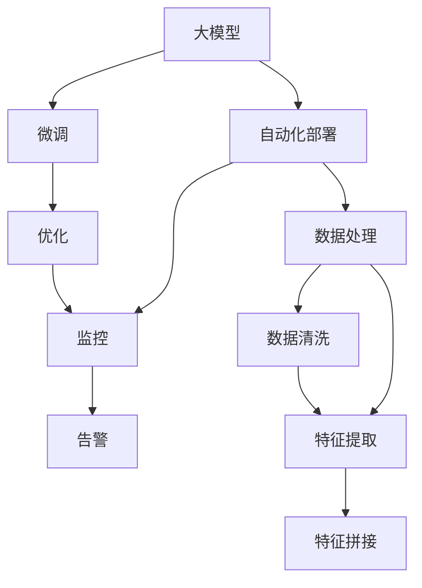

                 

# 电商搜索推荐场景下的AI大模型模型部署全流程自动化平台搭建与优化

> 关键词：电商搜索推荐, 大模型, 模型部署, 自动化平台, 优化

## 1. 背景介绍

### 1.1 问题由来
随着电商平台的快速发展和消费者购物习惯的转变，个性化推荐系统已经成为提升用户购物体验、提高销售转化率的重要手段。传统的推荐系统主要基于协同过滤和内容推荐，依赖用户行为数据和物品特征构建推荐模型。然而，这些方法往往难以处理长尾商品和复杂用户需求，推荐精度和多样性有待提升。

人工智能大模型的崛起，为电商推荐系统注入了新的活力。基于大模型的推荐算法能够利用大规模无标签文本语料进行预训练，学习通用的语言表示，从而具备强大的语义理解和生成能力。在大模型的基础上，通过微调等技术，可以提升推荐系统的个性化和多样性，提供更加精准和贴合用户需求的推荐结果。

但在大模型应用的过程中，也面临着模型部署、数据处理、自动化运维等诸多挑战。如何高效、稳定地部署和优化大模型，是大模型落地应用的关键。为此，搭建一个高效、自动化的大模型部署平台，成为当前电商推荐领域的一个重要研究方向。

## 2. 核心概念与联系

### 2.1 核心概念概述

为更好地理解电商搜索推荐场景下的大模型部署自动化平台，本节将介绍几个密切相关的核心概念：

- 大模型(如BERT、GPT等)：以自回归(如GPT)或自编码(如BERT)模型为代表的大规模预训练语言模型。通过在大规模无标签文本语料上进行预训练，学习通用的语言表示，具备强大的语言理解和生成能力。

- 微调(Fine-tuning)：指在预训练模型的基础上，使用下游任务的少量标注数据，通过有监督地训练来优化模型在特定任务上的性能。通常只需要调整顶层分类器或解码器，并以较小的学习率更新全部或部分的模型参数。

- 自动化部署(Automated Deployment)：利用自动化工具和脚本，将大模型部署到生产环境，并监控其性能和运行状态，以减少人工操作的复杂度和错误率。

- 性能优化(Performance Optimization)：对大模型部署平台进行优化，以提高计算资源利用率，降低响应时间，提升系统稳定性。

- 监控和告警(Monitoring & Alerting)：对大模型在生产环境中的运行状态进行实时监控，设置告警阈值，及时发现和处理异常情况。

- 数据处理(Data Processing)：对电商推荐系统中涉及的各类数据进行处理，包括文本清洗、特征提取、特征拼接等，为模型训练和推理提供高质量的数据输入。

这些核心概念之间的逻辑关系可以通过以下Mermaid流程图来展示：



这个流程图展示了大模型在电商推荐中的应用流程：

1. 大模型通过预训练获得基础能力。
2. 微调使其适应电商推荐任务，提升推荐精度和多样化。
3. 自动化部署将微调后的模型快速部署到生产环境。
4. 性能优化保证系统高效稳定运行。
5. 监控和告警实时发现异常情况。
6. 数据处理为模型训练和推理提供高质量数据。

这些概念共同构成了大模型在电商推荐领域的应用框架，使其能够在电商推荐场景下发挥强大的语言理解和生成能力。通过理解这些核心概念，我们可以更好地把握大模型部署平台的优化方向。

## 3. 核心算法原理 & 具体操作步骤
### 3.1 算法原理概述

基于电商搜索推荐场景的大模型部署自动化平台，本质上是一个大模型微调和自动化部署的集成过程。其核心思想是：将大模型视作一种高效的处理工具，通过微调优化其对电商推荐任务的适应能力，通过自动化工具将其快速部署到生产环境中，并在实际应用中不断优化性能，保障系统的稳定运行。

形式化地，假设电商推荐系统中的大模型为 $M_{\theta}$，其中 $\theta$ 为模型参数。给定电商推荐任务的标注数据集 $D=\{(x_i, y_i)\}_{i=1}^N, x_i \in \mathcal{X}, y_i \in \mathcal{Y}$，微调的目标是找到新的模型参数 $\hat{\theta}$，使得：

$$
\hat{\theta}=\mathop{\arg\min}_{\theta} \mathcal{L}(M_{\theta},D)
$$

其中 $\mathcal{L}$ 为针对电商推荐任务的损失函数，用于衡量模型预测结果与真实标签之间的差异。常见的损失函数包括交叉熵损失、均方误差损失等。

通过梯度下降等优化算法，微调过程不断更新模型参数 $\theta$，最小化损失函数 $\mathcal{L}$，使得模型输出逼近真实标签。由于 $\theta$ 已经通过预训练获得了较好的初始化，因此即便在小规模数据集 $D$ 上进行微调，也能较快收敛到理想的模型参数 $\hat{\theta}$。

在微调完成后，将 $\hat{\theta}$ 部署到生产环境中，通过自动化工具和脚本，完成模型的快速部署和系统上线。在实际应用中，还需要不断对系统进行性能优化，实时监控系统状态，及时发现和处理异常情况，以保障系统的长期稳定运行。

### 3.2 算法步骤详解

基于电商搜索推荐场景的大模型部署自动化平台一般包括以下几个关键步骤：

**Step 1: 准备预训练模型和数据集**
- 选择合适的预训练语言模型 $M_{\theta}$ 作为初始化参数，如 BERT、GPT等。
- 准备电商推荐任务的标注数据集 $D$，划分为训练集、验证集和测试集。一般要求标注数据与电商推荐数据集的分布不要差异过大。

**Step 2: 添加任务适配层**
- 根据电商推荐任务类型，在预训练模型顶层设计合适的输出层和损失函数。
- 对于分类任务，通常在顶层添加线性分类器和交叉熵损失函数。
- 对于生成任务，通常使用语言模型的解码器输出概率分布，并以负对数似然为损失函数。

**Step 3: 设置微调超参数**
- 选择合适的优化算法及其参数，如 AdamW、SGD 等，设置学习率、批大小、迭代轮数等。
- 设置正则化技术及强度，包括权重衰减、Dropout、Early Stopping 等。
- 确定冻结预训练参数的策略，如仅微调顶层，或全部参数都参与微调。

**Step 4: 执行梯度训练**
- 将训练集数据分批次输入模型，前向传播计算损失函数。
- 反向传播计算参数梯度，根据设定的优化算法和学习率更新模型参数。
- 周期性在验证集上评估模型性能，根据性能指标决定是否触发 Early Stopping。
- 重复上述步骤直到满足预设的迭代轮数或 Early Stopping 条件。

**Step 5: 自动化部署**
- 将微调后的模型参数 $\hat{\theta}$ 导入生产环境中的目标服务器。
- 使用脚本或自动化工具，完成模型的快速部署和系统上线。
- 对生产环境进行配置，包括数据输入输出、计算资源分配、模型更新等。

**Step 6: 性能优化和监控**
- 在生产环境中，实时监控模型的性能指标，如响应时间、计算资源利用率、内存占用等。
- 根据监控结果进行性能调优，如调整批大小、学习率、模型架构等。
- 定期检查和更新模型参数，保障模型长期稳定运行。

**Step 7: 数据处理和特征工程**
- 收集电商推荐系统中的各类数据，包括用户行为数据、商品描述、用户画像等。
- 对数据进行清洗、转换、拼接等处理，提取有用的特征信息。
- 设计合适的特征提取和拼接方式，提高特征表示的准确性和有效性。

**Step 8: 用户反馈与模型更新**
- 收集用户对推荐结果的反馈，如点击率、转化率、满意度等。
- 根据反馈结果调整模型参数，优化推荐策略。
- 定期对模型进行重新训练和微调，提升推荐效果。

以上是基于电商搜索推荐场景的大模型部署自动化平台的一般流程。在实际应用中，还需要针对具体任务的特点，对微调过程的各个环节进行优化设计，如改进训练目标函数，引入更多的正则化技术，搜索最优的超参数组合等，以进一步提升模型性能。

### 3.3 算法优缺点

基于电商搜索推荐场景的大模型微调和自动化部署方法具有以下优点：

1. 高效利用数据和计算资源。通过大模型的预训练和微调，可以快速适应电商推荐任务，提高推荐精度和多样性。同时，通过自动化部署工具，减少人工操作，提升部署效率。

2. 减少人为误差和错误。自动化部署工具可以避免人为错误和操作失误，提高系统稳定性和可靠性。实时监控工具可以及时发现系统异常，保障系统运行。

3. 提高模型适应性和泛化能力。通过微调和优化，大模型可以更好地适应电商推荐任务，泛化能力更强，适应更多复杂用户需求和长尾商品。

4. 促进持续改进和创新。定期收集用户反馈，进行模型优化和重新训练，不断提升推荐效果，推动系统创新。

但该方法也存在一定的局限性：

1. 依赖标注数据。微调的效果很大程度上取决于标注数据的质量和数量，获取高质量标注数据的成本较高。

2. 模型复杂度增加。大规模语言模型和复杂的微调过程，可能导致系统复杂度增加，部署和维护成本上升。

3. 预训练模型的偏差。预训练模型可能学习到社会偏见或有害信息，通过微调和部署传递到实际应用，造成潜在风险。

4. 计算资源要求高。大模型和复杂的微调过程，对计算资源要求较高，需要高性能服务器和GPU支持。

尽管存在这些局限性，但就目前而言，基于电商搜索推荐场景的大模型微调和自动化部署方法仍是推荐系统领域的主流范式。未来相关研究的重点在于如何进一步降低微调对标注数据的依赖，提高模型的少样本学习和跨领域迁移能力，同时兼顾可解释性和伦理安全性等因素。

### 3.4 算法应用领域

基于大模型微调的电商搜索推荐系统，在电商推荐领域已经得到了广泛的应用，覆盖了几乎所有常见任务，例如：

- 商品推荐：根据用户浏览、购买、评价等行为，推荐最适合的商品。
- 个性化营销：通过用户画像和行为分析，进行精准营销。
- 广告投放：根据用户兴趣和行为，推荐最相关的广告。
- 智能客服：通过自然语言处理技术，自动回答用户问题，提供服务。
- 价格优化：根据市场需求和用户行为，进行动态价格调整。
- 库存管理：预测商品销售趋势，优化库存水平。

除了上述这些经典任务外，大模型微调也被创新性地应用到更多场景中，如可控商品生成、销售预测、供应链优化等，为电商推荐系统带来了全新的突破。随着预训练模型和微调方法的不断进步，相信电商推荐系统必将在更广阔的应用领域大放异彩。

## 4. 数学模型和公式 & 详细讲解  
### 4.1 数学模型构建

本节将使用数学语言对电商搜索推荐场景下的大模型微调过程进行更加严格的刻画。

记电商推荐系统中的大模型为 $M_{\theta}$，其中 $\theta$ 为模型参数。假设电商推荐任务的训练集为 $D=\{(x_i,y_i)\}_{i=1}^N, x_i \in \mathcal{X}, y_i \in \mathcal{Y}$。

定义模型 $M_{\theta}$ 在输入 $x$ 上的输出为 $\hat{y}=M_{\theta}(x) \in [0,1]$，表示商品被用户点击的概率。真实标签 $y \in \{0,1\}$。则二分类交叉熵损失函数定义为：

$$
\ell(M_{\theta}(x),y) = -[y\log \hat{y} + (1-y)\log (1-\hat{y})]
$$

将其代入经验风险公式，得：

$$
\mathcal{L}(\theta) = -\frac{1}{N}\sum_{i=1}^N [y_i\log M_{\theta}(x_i)+(1-y_i)\log(1-M_{\theta}(x_i))]
$$

在得到损失函数的梯度后，即可带入参数更新公式，完成模型的迭代优化。重复上述过程直至收敛，最终得到适应电商推荐任务的最优模型参数 $\theta^*$。

## 5. 项目实践：代码实例和详细解释说明
### 5.1 开发环境搭建

在进行电商搜索推荐场景下的AI大模型部署实践前，我们需要准备好开发环境。以下是使用Python进行PyTorch开发的环境配置流程：

1. 安装Anaconda：从官网下载并安装Anaconda，用于创建独立的Python环境。

2. 创建并激活虚拟环境：
```bash
conda create -n pytorch-env python=3.8 
conda activate pytorch-env
```

3. 安装PyTorch：根据CUDA版本，从官网获取对应的安装命令。例如：
```bash
conda install pytorch torchvision torchaudio cudatoolkit=11.1 -c pytorch -c conda-forge
```

4. 安装Transformers库：
```bash
pip install transformers
```

5. 安装各类工具包：
```bash
pip install numpy pandas scikit-learn matplotlib tqdm jupyter notebook ipython
```

完成上述步骤后，即可在`pytorch-env`环境中开始部署实践。

### 5.2 源代码详细实现

下面我们以电商推荐任务为例，给出使用Transformers库对BERT模型进行电商推荐微调的PyTorch代码实现。

首先，定义电商推荐任务的数据处理函数：

```python
from transformers import BertTokenizer
from torch.utils.data import Dataset
import torch

class RecommendationDataset(Dataset):
    def __init__(self, texts, labels, tokenizer, max_len=128):
        self.texts = texts
        self.labels = labels
        self.tokenizer = tokenizer
        self.max_len = max_len
        
    def __len__(self):
        return len(self.texts)
    
    def __getitem__(self, item):
        text = self.texts[item]
        label = self.labels[item]
        
        encoding = self.tokenizer(text, return_tensors='pt', max_length=self.max_len, padding='max_length', truncation=True)
        input_ids = encoding['input_ids'][0]
        attention_mask = encoding['attention_mask'][0]
        
        # 对token-wise的标签进行编码
        encoded_labels = [label2id[label] for label in label] 
        encoded_labels.extend([label2id['O']] * (self.max_len - len(encoded_labels)))
        labels = torch.tensor(encoded_labels, dtype=torch.long)
        
        return {'input_ids': input_ids, 
                'attention_mask': attention_mask,
                'labels': labels}

# 标签与id的映射
label2id = {'O': 0, 'click': 1}
id2label = {v: k for k, v in label2id.items()}

# 创建dataset
tokenizer = BertTokenizer.from_pretrained('bert-base-cased')

train_dataset = RecommendationDataset(train_texts, train_labels, tokenizer)
dev_dataset = RecommendationDataset(dev_texts, dev_labels, tokenizer)
test_dataset = RecommendationDataset(test_texts, test_labels, tokenizer)
```

然后，定义模型和优化器：

```python
from transformers import BertForTokenClassification, AdamW

model = BertForTokenClassification.from_pretrained('bert-base-cased', num_labels=len(label2id))

optimizer = AdamW(model.parameters(), lr=2e-5)
```

接着，定义训练和评估函数：

```python
from torch.utils.data import DataLoader
from tqdm import tqdm
from sklearn.metrics import classification_report

device = torch.device('cuda') if torch.cuda.is_available() else torch.device('cpu')
model.to(device)

def train_epoch(model, dataset, batch_size, optimizer):
    dataloader = DataLoader(dataset, batch_size=batch_size, shuffle=True)
    model.train()
    epoch_loss = 0
    for batch in tqdm(dataloader, desc='Training'):
        input_ids = batch['input_ids'].to(device)
        attention_mask = batch['attention_mask'].to(device)
        labels = batch['labels'].to(device)
        model.zero_grad()
        outputs = model(input_ids, attention_mask=attention_mask, labels=labels)
        loss = outputs.loss
        epoch_loss += loss.item()
        loss.backward()
        optimizer.step()
    return epoch_loss / len(dataloader)

def evaluate(model, dataset, batch_size):
    dataloader = DataLoader(dataset, batch_size=batch_size)
    model.eval()
    preds, labels = [], []
    with torch.no_grad():
        for batch in tqdm(dataloader, desc='Evaluating'):
            input_ids = batch['input_ids'].to(device)
            attention_mask = batch['attention_mask'].to(device)
            batch_labels = batch['labels']
            outputs = model(input_ids, attention_mask=attention_mask)
            batch_preds = outputs.logits.argmax(dim=2).to('cpu').tolist()
            batch_labels = batch_labels.to('cpu').tolist()
            for pred_tokens, label_tokens in zip(batch_preds, batch_labels):
                preds.append(pred_tokens[:len(label_tokens)])
                labels.append(label_tokens)
                
    print(classification_report(labels, preds))
```

最后，启动训练流程并在测试集上评估：

```python
epochs = 5
batch_size = 16

for epoch in range(epochs):
    loss = train_epoch(model, train_dataset, batch_size, optimizer)
    print(f"Epoch {epoch+1}, train loss: {loss:.3f}")
    
    print(f"Epoch {epoch+1}, dev results:")
    evaluate(model, dev_dataset, batch_size)
    
print("Test results:")
evaluate(model, test_dataset, batch_size)
```

以上就是使用PyTorch对BERT进行电商推荐任务微调的完整代码实现。可以看到，得益于Transformers库的强大封装，我们可以用相对简洁的代码完成BERT模型的加载和微调。

### 5.3 代码解读与分析

让我们再详细解读一下关键代码的实现细节：

**RecommendationDataset类**：
- `__init__`方法：初始化文本、标签、分词器等关键组件。
- `__len__`方法：返回数据集的样本数量。
- `__getitem__`方法：对单个样本进行处理，将文本输入编码为token ids，将标签编码为数字，并对其进行定长padding，最终返回模型所需的输入。

**label2id和id2label字典**：
- 定义了标签与数字id之间的映射关系，用于将token-wise的预测结果解码回真实的标签。

**训练和评估函数**：
- 使用PyTorch的DataLoader对数据集进行批次化加载，供模型训练和推理使用。
- 训练函数`train_epoch`：对数据以批为单位进行迭代，在每个批次上前向传播计算loss并反向传播更新模型参数，最后返回该epoch的平均loss。
- 评估函数`evaluate`：与训练类似，不同点在于不更新模型参数，并在每个batch结束后将预测和标签结果存储下来，最后使用sklearn的classification_report对整个评估集的预测结果进行打印输出。

**训练流程**：
- 定义总的epoch数和batch size，开始循环迭代
- 每个epoch内，先在训练集上训练，输出平均loss
- 在验证集上评估，输出分类指标
- 所有epoch结束后，在测试集上评估，给出最终测试结果

可以看到，PyTorch配合Transformers库使得BERT微调的代码实现变得简洁高效。开发者可以将更多精力放在数据处理、模型改进等高层逻辑上，而不必过多关注底层的实现细节。

当然，工业级的系统实现还需考虑更多因素，如模型的保存和部署、超参数的自动搜索、更灵活的任务适配层等。但核心的微调范式基本与此类似。

## 6. 实际应用场景
### 6.1 智能推荐系统

基于大模型微调的电商推荐系统，能够通过分析用户行为和商品描述，进行个性化推荐，提升用户购物体验。在技术实现上，可以收集用户的浏览、点击、购买等行为数据，结合商品标题、描述、标签等文本信息，构建电商推荐任务的监督数据。在此基础上对预训练语言模型进行微调，使得模型能够自动理解用户意图，匹配最合适的商品。对于新商品，还可以实时抓取商品描述，动态生成推荐结果，提高推荐的相关性和个性化。

### 6.2 个性化营销策略

电商推荐系统还可以通过大模型的微调，进行精准营销。通过分析用户的浏览、点击、评价等行为数据，结合商品信息和用户画像，生成个性化的营销方案。如根据用户的购物历史，推荐最适合的商品；根据用户的兴趣标签，推送相关的广告内容；根据用户的地理位置，推送当地特色商品等。这样不仅提高了营销效果，也提升了用户的购物体验。

### 6.3 智能客服系统

大模型微调技术还可以应用于电商智能客服系统。通过自然语言处理技术，自动回答用户咨询，提供个性化的购物建议。具体而言，可以收集用户的历史咨询记录，将问题和最佳答复构建成监督数据，在此基础上对预训练语言模型进行微调。微调后的模型能够自动理解用户意图，匹配最合适的答案模板进行回复。对于用户提出的新问题，还可以实时搜索相关内容，动态组织生成回答。如此构建的智能客服系统，能够大大提高客服效率和质量，减少人工操作。

### 6.4 未来应用展望

随着大模型和微调方法的不断发展，基于大模型微调的方法将在电商推荐领域得到更广泛的应用，为电商推荐系统带来新的突破：

在智慧零售领域，基于大模型微调的推荐系统可以结合物联网、大数据等技术，构建智能零售新生态，提升用户体验，促进零售产业的智能化转型。

在智能制造领域，基于大模型的推荐系统可以与工业互联网、5G等技术结合，推动制造业的数字化转型，提升生产效率和产品质量。

在智慧物流领域，基于大模型的推荐系统可以优化配送路线、提高配送效率，提升用户体验，降低物流成本。

此外，在智能家居、智慧农业、智慧旅游等众多领域，基于大模型微调的推荐系统也将不断涌现，为各行各业带来变革性影响。相信随着技术的日益成熟，大模型微调技术必将在更广阔的应用领域大放异彩，深刻影响人类的生产生活方式。

## 7. 工具和资源推荐
### 7.1 学习资源推荐

为了帮助开发者系统掌握电商搜索推荐场景下的大模型微调理论基础和实践技巧，这里推荐一些优质的学习资源：

1. 《深度学习在电商推荐中的应用》系列博文：由电商推荐领域专家撰写，深入浅出地介绍了深度学习在电商推荐中的应用，包括大模型微调在内的诸多前沿话题。

2. CS294《深度学习在电商推荐中的应用》课程：伯克利大学开设的电商推荐领域顶级课程，有Lecture视频和配套作业，带你入门电商推荐领域的基本概念和经典模型。

3. 《电商推荐系统：理论与实践》书籍：电商推荐领域经典书籍，全面介绍了电商推荐系统的原理和实现方法，包括大模型微调在内的诸多范式。

4. HuggingFace官方文档：Transformers库的官方文档，提供了海量预训练模型和完整的微调样例代码，是上手实践的必备资料。

5. Kaggle电商推荐竞赛：通过参与电商推荐竞赛，实际动手实践电商推荐系统，积累电商推荐领域的实战经验。

通过对这些资源的学习实践，相信你一定能够快速掌握电商推荐场景下的大模型微调精髓，并用于解决实际的电商推荐问题。
###  7.2 开发工具推荐

高效的开发离不开优秀的工具支持。以下是几款用于电商推荐场景下大模型微调开发的常用工具：

1. PyTorch：基于Python的开源深度学习框架，灵活动态的计算图，适合快速迭代研究。大部分预训练语言模型都有PyTorch版本的实现。

2. TensorFlow：由Google主导开发的开源深度学习框架，生产部署方便，适合大规模工程应用。同样有丰富的预训练语言模型资源。

3. Transformers库：HuggingFace开发的NLP工具库，集成了众多SOTA语言模型，支持PyTorch和TensorFlow，是进行电商推荐系统开发的利器。

4. Weights & Biases：模型训练的实验跟踪工具，可以记录和可视化模型训练过程中的各项指标，方便对比和调优。与主流深度学习框架无缝集成。

5. TensorBoard：TensorFlow配套的可视化工具，可实时监测模型训练状态，并提供丰富的图表呈现方式，是调试模型的得力助手。

6. Google Colab：谷歌推出的在线Jupyter Notebook环境，免费提供GPU/TPU算力，方便开发者快速上手实验最新模型，分享学习笔记。

合理利用这些工具，可以显著提升电商推荐场景下大模型微调的开发效率，加快创新迭代的步伐。

### 7.3 相关论文推荐

大语言模型和微调技术的发展源于学界的持续研究。以下是几篇奠基性的相关论文，推荐阅读：

1. Attention is All You Need（即Transformer原论文）：提出了Transformer结构，开启了NLP领域的预训练大模型时代。

2. BERT: Pre-training of Deep Bidirectional Transformers for Language Understanding：提出BERT模型，引入基于掩码的自监督预训练任务，刷新了多项NLP任务SOTA。

3. Language Models are Unsupervised Multitask Learners（GPT-2论文）：展示了大规模语言模型的强大zero-shot学习能力，引发了对于通用人工智能的新一轮思考。

4. Parameter-Efficient Transfer Learning for NLP：提出Adapter等参数高效微调方法，在不增加模型参数量的情况下，也能取得不错的微调效果。

5. Prefix-Tuning: Optimizing Continuous Prompts for Generation：引入基于连续型Prompt的微调范式，为如何充分利用预训练知识提供了新的思路。

6. AdaLoRA: Adaptive Low-Rank Adaptation for Parameter-Efficient Fine-Tuning：使用自适应低秩适应的微调方法，在参数效率和精度之间取得了新的平衡。

这些论文代表了大模型微调技术的发展脉络。通过学习这些前沿成果，可以帮助研究者把握学科前进方向，激发更多的创新灵感。

## 8. 总结：未来发展趋势与挑战

### 8.1 总结

本文对电商搜索推荐场景下的大模型微调部署自动化平台进行了全面系统的介绍。首先阐述了大模型微调和自动化部署的背景和意义，明确了大模型在电商推荐场景下微调的优势和价值。其次，从原理到实践，详细讲解了电商推荐任务的大模型微调过程，给出了微调任务开发的完整代码实例。同时，本文还广泛探讨了微调方法在电商推荐系统中的实际应用，展示了微调范式的巨大潜力。此外，本文精选了微调技术的各类学习资源，力求为读者提供全方位的技术指引。

通过本文的系统梳理，可以看到，基于电商搜索推荐场景的大模型微调和自动化部署方法，在电商推荐领域已经得到了广泛的应用，覆盖了几乎所有常见任务。得益于大模型的预训练和微调，推荐系统的个性化和多样化程度大大提升，电商推荐系统的效果和用户体验不断得到改善。未来，伴随预训练语言模型和微调方法的持续演进，相信电商推荐系统必将在更广阔的应用领域大放异彩，深刻影响人类的生产生活方式。

### 8.2 未来发展趋势

展望未来，电商搜索推荐场景下的大模型微调和自动化部署技术将呈现以下几个发展趋势：

1. 模型规模持续增大。随着算力成本的下降和数据规模的扩张，电商推荐系统中的大模型参数量还将持续增长。超大批次的训练和推理也可能遇到显存不足的问题。如何提高计算资源利用率，降低响应时间，提升系统稳定性，将是重要的研究方向。

2. 微调方法日趋多样。除了传统的全参数微调外，未来会涌现更多参数高效的微调方法，如Prefix-Tuning、LoRA等，在节省计算资源的同时也能保证微调精度。

3. 持续学习成为常态。随着电商推荐数据分布的不断变化，微调模型也需要持续学习新知识以保持性能。如何在不遗忘原有知识的同时，高效吸收新样本信息，将是重要的研究课题。

4. 标注样本需求降低。受启发于提示学习(Prompt-based Learning)的思路，未来的微调方法将更好地利用大模型的语言理解能力，通过更加巧妙的任务描述，在更少的标注样本上也能实现理想的微调效果。

5. 多模态微调崛起。当前的微调主要聚焦于纯文本数据，未来会进一步拓展到图像、视频、语音等多模态数据微调。多模态信息的融合，将显著提升语言模型对现实世界的理解和建模能力。

6. 模型通用性增强。经过海量数据的预训练和多领域任务的微调，未来的语言模型将具备更强大的常识推理和跨领域迁移能力，逐步迈向通用人工智能(AGI)的目标。

以上趋势凸显了大模型微调和自动化部署技术的广阔前景。这些方向的探索发展，必将进一步提升电商推荐系统的性能和应用范围，为电商推荐系统带来新的突破。

### 8.3 面临的挑战

尽管大模型微调和自动化部署技术已经取得了瞩目成就，但在迈向更加智能化、普适化应用的过程中，它仍面临着诸多挑战：

1. 标注成本瓶颈。虽然微调大大降低了标注数据的需求，但对于长尾应用场景，难以获得充足的高质量标注数据，成为制约微调性能的瓶颈。如何进一步降低微调对标注样本的依赖，将是一大难题。

2. 模型鲁棒性不足。当前微调模型面对域外数据时，泛化性能往往大打折扣。对于测试样本的微小扰动，微调模型的预测也容易发生波动。如何提高微调模型的鲁棒性，避免灾难性遗忘，还需要更多理论和实践的积累。

3. 推理效率有待提高。大规模语言模型虽然精度高，但在实际部署时往往面临推理速度慢、内存占用大等效率问题。如何在保证性能的同时，简化模型结构，提升推理速度，优化资源占用，将是重要的优化方向。

4. 可解释性亟需加强。当前微调模型更像是"黑盒"系统，难以解释其内部工作机制和决策逻辑。对于医疗、金融等高风险应用，算法的可解释性和可审计性尤为重要。如何赋予微调模型更强的可解释性，将是亟待攻克的难题。

5. 安全性有待保障。预训练语言模型难免会学习到有偏见、有害的信息，通过微调和部署传递到实际应用，产生误导性、歧视性的输出，给实际应用带来安全隐患。如何从数据和算法层面消除模型偏见，避免恶意用途，确保输出的安全性，也将是重要的研究课题。

6. 知识整合能力不足。现有的微调模型往往局限于任务内数据，难以灵活吸收和运用更广泛的先验知识。如何让微调过程更好地与外部知识库、规则库等专家知识结合，形成更加全面、准确的信息整合能力，还有很大的想象空间。

正视微调面临的这些挑战，积极应对并寻求突破，将是大模型微调技术走向成熟的必由之路。相信随着学界和产业界的共同努力，这些挑战终将一一被克服，大模型微调必将在构建人机协同的智能时代中扮演越来越重要的角色。

### 8.4 未来突破

面对大模型微调和自动化部署技术所面临的种种挑战，未来的研究需要在以下几个方面寻求新的突破：

1. 探索无监督和半监督微调方法。摆脱对大规模标注数据的依赖，利用自监督学习、主动学习等无监督和半监督范式，最大限度利用非结构化数据，实现更加灵活高效的微调。

2. 研究参数高效和计算高效的微调范式。开发更加参数高效的微调方法，在固定大部分预训练参数的同时，只更新极少量的任务相关参数。同时优化微调模型的计算图，减少前向传播和反向传播的资源消耗，实现更加轻量级、实时性的部署。

3. 引入因果和对比学习范式。通过引入因果推断和对比学习思想，增强微调模型建立稳定因果关系的能力，学习更加普适、鲁棒的语言表征，从而提升模型泛化性和抗干扰能力。

4. 结合因果分析和博弈论工具。将因果分析方法引入微调模型，识别出模型决策的关键特征，增强输出解释的因果性和逻辑性。借助博弈论工具刻画人机交互过程，主动探索并规避模型的脆弱点，提高系统稳定性。

5. 纳入伦理道德约束。在模型训练目标中引入伦理导向的评估指标，过滤和惩罚有偏见、有害的输出倾向。同时加强人工干预和审核，建立模型行为的监管机制，确保输出符合人类价值观和伦理道德。

这些研究方向的探索，必将引领大模型微调技术迈向更高的台阶，为构建安全、可靠、可解释、可控的智能系统铺平道路。面向未来，大模型微调和自动化部署技术还需要与其他人工智能技术进行更深入的融合，如知识表示、因果推理、强化学习等，多路径协同发力，共同推动自然语言理解和智能交互系统的进步。只有勇于创新、敢于突破，才能不断拓展语言模型的边界，让智能技术更好地造福人类社会。

## 9. 附录：常见问题与解答

**Q1：电商搜索推荐场景下的AI大模型部署自动化平台是否适用于所有电商推荐任务？**

A: 电商搜索推荐场景下的AI大模型部署自动化平台在大多数电商推荐任务上都能取得不错的效果，特别是对于数据量较大的任务。但对于一些特定领域的任务，如医学、法律等，仅仅依靠通用语料预训练的模型可能难以很好地适应。此时需要在特定领域语料上进一步预训练，再进行微调，才能获得理想效果。此外，对于一些需要时效性、个性化很强的任务，如对话、推荐等，微调方法也需要针对性的改进优化。

**Q2：大模型在电商推荐系统中的微调过程中，如何选择合适的学习率？**

A: 大模型在电商推荐系统中的微调过程中，通常会选择较小的学习率。一般建议从1e-5开始调参，逐步减小学习率，直至收敛。如果使用过大的学习率，容易破坏预训练权重，导致过拟合。常用的学习率调度策略包括Warmup策略，即开始阶段使用较小的学习率，再逐渐过渡到预设值。需要注意的是，不同的优化器(如AdamW、Adafactor等)以及不同的学习率调度策略，可能需要设置不同的学习率阈值。

**Q3：大模型在电商推荐系统中的微调过程中，如何缓解过拟合问题？**

A: 电商推荐系统中的大模型微调过程中，过拟合是一个常见问题。缓解过拟合的方法包括数据增强、正则化、早停等。具体而言，可以采取以下策略：

1. 数据增强：通过回译、近义替换等方式扩充训练集。
2. 正则化：使用L2正则、Dropout、Early Stopping等避免过拟合。
3. 对抗训练：加入对抗样本，提高模型鲁棒性。
4. 参数高效微调：只调整少量参数(如Adapter、Prefix等)，减小过拟合风险。
5. 多模型集成：训练多个微调模型，取平均输出，抑制过拟合。

这些策略往往需要根据具体任务和数据特点进行灵活组合。只有在数据、模型、训练、推理等各环节进行全面优化，才能最大限度地发挥大模型微调的威力。

**Q4：电商推荐系统中的大模型微调过程中，如何提高模型适应性和泛化能力？**

A: 电商推荐系统中的大模型微调过程中，提高模型适应性和泛化能力是关键。具体而言，可以采取以下策略：

1. 数据集多样性：收集更多的电商推荐数据，涵盖不同类型的商品、用户、场景等。
2. 超参数调优：通过网格搜索、贝叶斯优化等方法，找到最优的超参数组合。
3. 多任务学习：同时训练多个电商推荐任务，共享底层特征提取器，提高模型的泛化能力。
4. 对抗训练：加入对抗样本，提高模型的鲁棒性和泛化能力。
5. 参数高效微调：只调整少量参数(如Adapter、Prefix等)，减小过拟合风险。

这些策略可以帮助电商推荐系统中的大模型更好地适应电商推荐任务，提升模型的泛化能力和鲁棒性。

**Q5：电商推荐系统中的大模型微调过程中，如何提升模型性能？**

A: 电商推荐系统中的大模型微调过程中，提升模型性能是关键。具体而言，可以采取以下策略：

1. 数据集质量：确保训练数据集的质量和多样性，避免数据偏见和噪声。
2. 超参数调优：通过网格搜索、贝叶斯优化等方法，找到最优的超参数组合。
3. 多模型集成：训练多个微调模型，取平均输出，抑制过拟合。
4. 对抗训练：加入对抗样本，提高模型的鲁棒性和泛化能力。
5. 参数高效微调：只调整少量参数(如Adapter、Prefix等)，减小过拟合风险。

这些策略可以帮助电商推荐系统中的大模型更好地适应电商推荐任务，提升模型的泛化能力和鲁棒性。

---

作者：禅与计算机程序设计艺术 / Zen and the Art of Computer Programming

