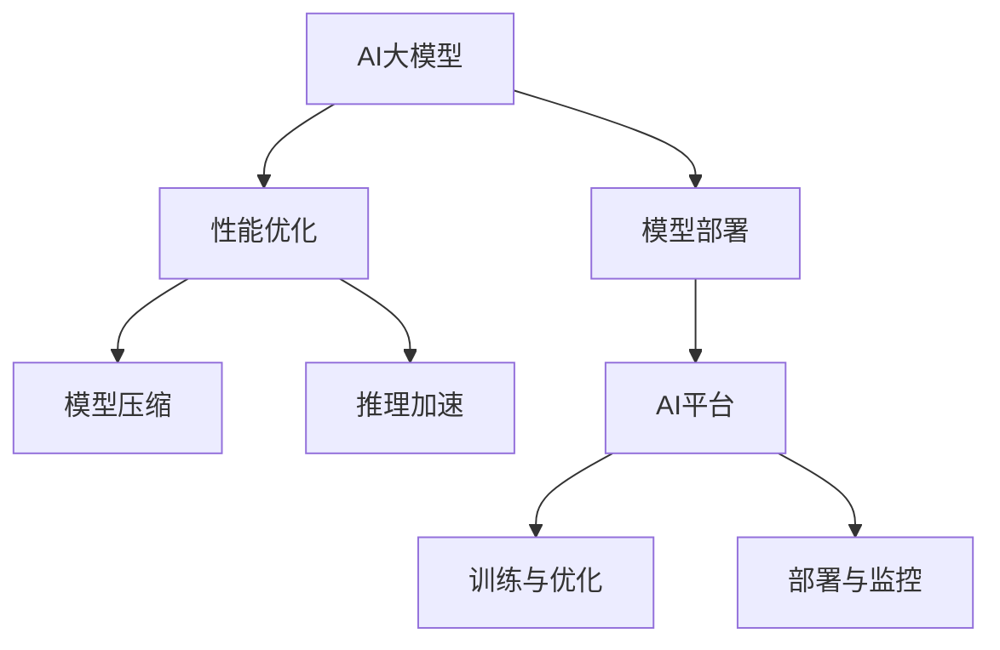

                 

# 电商搜索推荐场景下的AI大模型模型部署性能优化工具选型

> 关键词：电商搜索推荐, 人工智能大模型, 模型部署, 性能优化, 模型压缩, 推理加速

## 1. 背景介绍

随着人工智能(AI)技术在电子商务领域的不断深入应用，电商搜索推荐系统成为了提升用户体验和增加销售额的重要手段。在这一过程中，AI大模型的应用发挥了不可替代的作用。然而，在电商搜索推荐场景下，大模型的部署和性能优化面临着诸多挑战。如何高效部署和优化大模型，成为了一个亟待解决的问题。本文将从多个角度探讨大模型在电商搜索推荐场景中的部署优化工具选型问题，帮助开发者更好地使用大模型，提高系统性能。

## 2. 核心概念与联系

### 2.1 核心概念概述

为了更好地理解电商搜索推荐场景下的AI大模型部署优化问题，本节将介绍几个关键概念及其相互关系：

- **AI大模型**：通常指具有大规模参数量、能执行复杂计算的深度学习模型，如BERT、GPT-3、T5等。大模型在电商搜索推荐场景中主要被用于商品推荐、搜索结果排序、用户意图理解等任务。

- **模型部署**：将训练好的模型转化为实际应用的过程，通常包括模型保存、加载、推理等步骤。模型部署的性能直接影响系统的响应速度和用户体验。

- **性能优化**：通过模型压缩、推理加速等技术，在不影响模型精度的情况下，提升模型部署的效率和性能。性能优化可以显著降低计算资源消耗，提高系统扩展性和响应速度。

- **模型压缩**：通过剪枝、量化、蒸馏等技术，减少模型参数量和计算量，降低存储和计算成本。模型压缩有助于模型快速加载和推理，提高系统性能。

- **推理加速**：通过优化推理引擎、利用硬件加速器等技术，提高模型的推理速度，提升系统响应速度和吞吐量。推理加速是模型部署优化的重要手段。

- **AI平台**：提供模型训练、部署、优化、监控等全流程支持的平台，如TensorFlow Serving、TensorFlow Extended(TFX)、 Amazon SageMaker等。

这些核心概念之间的联系可以通过以下Mermaid流程图来展示：



这个流程图展示了AI大模型在电商搜索推荐场景中的部署优化过程：

1. 大模型通过AI平台进行训练和优化。
2. 模型在AI平台上进行压缩和推理加速。
3. 经过优化的模型部署在电商系统中，实现推荐和搜索功能。
4. 部署后的模型通过AI平台进行性能监控和持续优化。

## 3. 核心算法原理 & 具体操作步骤

### 3.1 算法原理概述

在电商搜索推荐场景下，大模型的部署优化主要通过以下两个步骤进行：

1. **模型压缩**：通过剪枝、量化、蒸馏等技术，减少模型参数量和计算量，降低存储和计算成本，提升模型的推理速度。
2. **推理加速**：通过优化推理引擎、利用硬件加速器等技术，提高模型的推理速度，提升系统的响应速度和吞吐量。

### 3.2 算法步骤详解

#### 3.2.1 模型压缩

模型压缩主要包括：

- **剪枝(Pruning)**：去掉模型中不重要的参数，减少计算量。
- **量化(Quantization)**：将模型中的浮点数参数转为定点数，减少计算和存储开销。
- **蒸馏(Distillation)**：通过教师模型指导学生模型的学习，实现模型的知识转移，降低模型的复杂度。

##### 剪枝
剪枝主要分为结构剪枝和权重剪枝两种方法：

1. **结构剪枝**：通过移除模型中的冗余层或冗余参数，减少计算量和存储空间。
2. **权重剪枝**：通过计算参数的重要性，移除对模型性能影响较小的参数，保留关键参数。

剪枝方法可以使用TensorFlow中的pruning工具，或PyTorch中的nn.utils.prune工具实现。

##### 量化
量化分为静态量化和动态量化两种方法：

1. **静态量化**：在模型训练过程中，对参数进行量化，得到静态量化模型。静态量化通常采用4位、8位定点数进行量化。
2. **动态量化**：在模型推理过程中，对参数进行量化，得到动态量化模型。动态量化通常采用8位定点数进行量化。

量化方法可以使用TensorFlow中的quantize工具，或ONNX中的quantization工具实现。

##### 蒸馏
蒸馏主要分为单流蒸馏和多流蒸馏两种方法：

1. **单流蒸馏**：利用一个大模型（教师模型）指导一个小模型（学生模型）的学习，实现知识转移。
2. **多流蒸馏**：使用多个小模型对大模型进行多流蒸馏，进一步降低模型复杂度。

蒸馏方法可以使用TensorFlow中的Keras Tuner工具，或PyTorch中的TorchDistill工具实现。

#### 3.2.2 推理加速

推理加速主要通过以下几种方法实现：

- **优化推理引擎**：使用TensorFlow Serving、TensorFlow Extended(TFX)等推理框架，优化推理流程。
- **利用硬件加速器**：使用GPU、TPU、FPGA等硬件加速器，提升推理速度。
- **数据预处理和后处理优化**：优化数据读取、转换、存储等过程，减少推理延迟。

##### 优化推理引擎
推理引擎优化主要包括以下几个方面：

1. **图优化**：优化计算图，减少不必要的计算和存储开销。
2. **内存优化**：优化内存管理，减少内存分配和释放的开销。
3. **多线程并行**：利用多线程并行计算，提升推理速度。

推理引擎优化可以使用TensorFlow中的Graph Optimizer，或TensorFlow Extended(TFX)中的Optimization Library实现。

##### 利用硬件加速器
硬件加速器优化主要包括以下几个方面：

1. **GPU加速**：使用NVIDIA GPU进行计算，提升推理速度。
2. **TPU加速**：使用Google TPU进行计算，提升推理速度。
3. **FPGA加速**：使用Xilinx FPGA进行计算，提升推理速度。

硬件加速器优化可以使用TensorFlow中的tf.function和@tf.function，或TensorFlow Extended(TFX)中的TPU支持实现。

##### 数据预处理和后处理优化
数据预处理和后处理优化主要包括以下几个方面：

1. **数据缓存**：缓存常用的数据，减少数据读取和转换的开销。
2. **异步处理**：异步处理数据，减少推理延迟。
3. **数据压缩**：压缩数据，减少存储和传输的开销。

数据预处理和后处理优化可以使用TensorFlow中的tf.data API，或TensorFlow Extended(TFX)中的Data Validation和Data Transform工具实现。

### 3.3 算法优缺点

#### 3.3.1 模型压缩的优缺点

**优点**：

- 减少计算量和存储空间，降低成本。
- 提高模型推理速度，提升系统性能。
- 减小模型复杂度，提高模型的稳定性和泛化能力。

**缺点**：

- 压缩过程可能降低模型精度，需要额外的校准和优化。
- 压缩方法可能增加模型的复杂度，影响模型的可解释性。
- 压缩方法可能不适用于所有类型的模型和任务。

#### 3.3.2 推理加速的优缺点

**优点**：

- 提高模型推理速度，提升系统响应速度和吞吐量。
- 降低计算和存储成本，提升系统扩展性。
- 优化推理引擎和硬件加速器，提高系统性能。

**缺点**：

- 推理加速可能增加系统的复杂度，影响系统的稳定性和可维护性。
- 推理加速可能提高系统的资源消耗，增加系统的成本。
- 推理加速可能影响模型的精度和泛化能力。

### 3.4 算法应用领域

#### 3.4.1 电商搜索推荐

在大模型部署优化中，电商搜索推荐场景下主要应用以下几种算法：

- **模型压缩**：通过剪枝、量化、蒸馏等技术，减少模型参数量和计算量，降低存储和计算成本，提升模型的推理速度。
- **推理加速**：通过优化推理引擎、利用硬件加速器等技术，提高模型的推理速度，提升系统的响应速度和吞吐量。

在电商搜索推荐场景下，AI大模型的应用主要包括以下几个方面：

1. **商品推荐**：通过用户历史行为、商品属性、上下文信息等，推荐用户可能感兴趣的商品。
2. **搜索结果排序**：通过用户查询意图、商品相关性等，对搜索结果进行排序。
3. **用户意图理解**：通过用户输入的文本，理解用户的查询意图，提供更精准的搜索结果。

#### 3.4.2 金融风控

在金融风控场景下，AI大模型的应用主要包括以下几个方面：

1. **风险评估**：通过客户历史交易数据、行为数据等，评估客户的信用风险。
2. **欺诈检测**：通过异常检测、模式识别等技术，检测金融欺诈行为。
3. **智能投顾**：通过机器学习算法，提供投资建议和资产配置方案。

在金融风控场景下，AI大模型的部署优化主要包括以下几个方面：

1. **模型压缩**：通过剪枝、量化、蒸馏等技术，减少模型参数量和计算量，降低存储和计算成本，提升模型的推理速度。
2. **推理加速**：通过优化推理引擎、利用硬件加速器等技术，提高模型的推理速度，提升系统的响应速度和吞吐量。

#### 3.4.3 智能医疗

在智能医疗场景下，AI大模型的应用主要包括以下几个方面：

1. **疾病诊断**：通过医学影像、基因数据等，诊断疾病。
2. **治疗方案推荐**：通过临床数据、医学文献等，推荐治疗方案。
3. **健康管理**：通过健康数据，进行健康管理和疾病预防。

在智能医疗场景下，AI大模型的部署优化主要包括以下几个方面：

1. **模型压缩**：通过剪枝、量化、蒸馏等技术，减少模型参数量和计算量，降低存储和计算成本，提升模型的推理速度。
2. **推理加速**：通过优化推理引擎、利用硬件加速器等技术，提高模型的推理速度，提升系统的响应速度和吞吐量。

## 4. 数学模型和公式 & 详细讲解 & 举例说明

### 4.1 数学模型构建

在电商搜索推荐场景下，大模型的数学模型构建主要包括以下几个方面：

1. **模型表示**：使用深度学习模型（如BERT、GPT-3等）表示商品、用户、查询等特征。
2. **损失函数**：使用交叉熵、均方误差等损失函数，衡量模型预测结果与真实结果的差异。
3. **优化器**：使用SGD、Adam等优化器，最小化损失函数，优化模型参数。

### 4.2 公式推导过程

#### 4.2.1 模型表示

使用BERT模型表示商品特征，主要包括：

- **输入表示**：将商品属性、描述等文本转化为BERT模型的输入。
- **上下文表示**：通过BERT模型计算输入的上下文表示。
- **特征融合**：将上下文表示与用户历史行为、上下文信息等特征进行融合，得到最终的特征向量。

##### 输入表示
输入表示主要包括以下几个方面：

1. **文本分词**：将商品属性、描述等文本进行分词。
2. **向量化**：将分词后的文本转化为词向量。
3. **拼接**：将词向量拼接，得到最终的输入表示。

##### 上下文表示
上下文表示主要包括以下几个方面：

1. **输入编码**：将输入表示作为BERT模型的输入，得到上下文表示。
2. **平均池化**：对上下文表示进行平均池化，得到平均表示。
3. **特征融合**：将平均表示与用户历史行为、上下文信息等特征进行融合，得到最终的特征向量。

#### 4.2.2 损失函数

使用交叉熵损失函数计算模型预测结果与真实结果的差异，主要包括：

1. **模型预测**：将输入特征通过深度学习模型计算得到预测结果。
2. **真实标签**：将预测结果与真实标签进行比较，计算交叉熵损失。
3. **优化器**：使用SGD、Adam等优化器，最小化交叉熵损失，优化模型参数。

##### 模型预测
模型预测主要包括以下几个方面：

1. **线性层**：将特征向量通过线性层进行转换。
2. **softmax层**：对线性层的输出进行softmax操作，得到预测概率。
3. **损失计算**：将预测概率与真实标签进行比较，计算交叉熵损失。

##### 优化器
优化器主要包括以下几个方面：

1. **学习率**：设置学习率，控制模型参数更新的步长。
2. **权重更新**：根据损失函数计算梯度，更新模型参数。
3. **正则化**：使用L2正则、Dropout等正则化技术，避免过拟合。

### 4.3 案例分析与讲解

#### 4.3.1 电商商品推荐

电商商品推荐系统主要包括以下几个步骤：

1. **用户表示**：将用户历史行为、属性等转化为向量表示。
2. **商品表示**：将商品属性、描述等转化为向量表示。
3. **相似度计算**：计算用户表示与商品表示的相似度，得到推荐商品列表。
4. **模型训练**：使用用户行为数据和商品属性数据训练模型，优化相似度计算方法。

##### 用户表示
用户表示主要包括以下几个方面：

1. **行为编码**：将用户历史行为进行编码，得到行为向量。
2. **属性编码**：将用户属性进行编码，得到属性向量。
3. **拼接**：将行为向量和属性向量拼接，得到用户表示。

##### 商品表示
商品表示主要包括以下几个方面：

1. **属性编码**：将商品属性进行编码，得到属性向量。
2. **描述编码**：将商品描述进行编码，得到描述向量。
3. **拼接**：将属性向量和描述向量拼接，得到商品表示。

##### 相似度计算
相似度计算主要包括以下几个方面：

1. **余弦相似度**：计算用户表示与商品表示的余弦相似度。
2. **归一化**：对相似度进行归一化，得到最终的相似度得分。
3. **排序**：将相似度得分排序，得到推荐商品列表。

#### 4.3.2 金融风控

金融风控系统主要包括以下几个步骤：

1. **用户表示**：将用户历史交易数据、行为数据等转化为向量表示。
2. **风险评估模型**：通过用户表示计算风险评估得分。
3. **欺诈检测模型**：通过异常检测、模式识别等技术，检测欺诈行为。
4. **智能投顾模型**：通过机器学习算法，提供投资建议和资产配置方案。

##### 用户表示
用户表示主要包括以下几个方面：

1. **交易编码**：将用户历史交易数据进行编码，得到交易向量。
2. **行为编码**：将用户行为数据进行编码，得到行为向量。
3. **拼接**：将交易向量和行为向量拼接，得到用户表示。

##### 风险评估模型
风险评估模型主要包括以下几个方面：

1. **特征选择**：选择用户表示中的重要特征。
2. **模型训练**：使用历史交易数据和行为数据训练风险评估模型。
3. **风险评估**：通过用户表示计算风险评估得分。

##### 欺诈检测模型
欺诈检测模型主要包括以下几个方面：

1. **异常检测**：通过异常检测算法，检测用户行为中的异常。
2. **模式识别**：通过模式识别算法，检测用户行为中的欺诈模式。
3. **风险评估**：将异常检测和模式识别结果进行融合，计算欺诈风险得分。

##### 智能投顾模型
智能投顾模型主要包括以下几个方面：

1. **资产配置**：通过机器学习算法，推荐资产配置方案。
2. **投资建议**：通过机器学习算法，提供投资建议。
3. **风险评估**：通过机器学习算法，评估投资风险。

### 4.4 数学公式

#### 4.4.1 余弦相似度
余弦相似度计算公式如下：

$$
similarity = \frac{\mathbf{a} \cdot \mathbf{b}}{\|\mathbf{a}\| \cdot \|\mathbf{b}\|}
$$

其中，$\mathbf{a}$和$\mathbf{b}$为两个向量，$\cdot$表示向量的点乘，$\|\cdot\|$表示向量的模长。

#### 4.4.2 交叉熵损失
交叉熵损失计算公式如下：

$$
loss = -\frac{1}{N} \sum_{i=1}^N y_i \log \hat{y}_i + (1-y_i) \log (1-\hat{y}_i)
$$

其中，$N$为样本数量，$y_i$为真实标签，$\hat{y}_i$为模型预测结果。

#### 4.4.3 学习率调整
学习率调整公式如下：

$$
\eta_{t+1} = \eta_{t} * \frac{\sqrt{1 - \beta^t}}{1 - \beta}
$$

其中，$\eta_{t+1}$为新的学习率，$\eta_{t}$为当前学习率，$\beta$为学习率衰减率，$t$为迭代次数。

## 5. 项目实践：代码实例和详细解释说明

### 5.1 开发环境搭建

在进行电商搜索推荐系统的大模型部署优化实践前，我们需要准备好开发环境。以下是使用Python进行TensorFlow和PyTorch开发的环境配置流程：

1. 安装Anaconda：从官网下载并安装Anaconda，用于创建独立的Python环境。

2. 创建并激活虚拟环境：
```bash
conda create -n pytorch-env python=3.8 
conda activate pytorch-env
```

3. 安装TensorFlow和PyTorch：根据CUDA版本，从官网获取对应的安装命令。例如：
```bash
conda install tensorflow tensorflow-cpu cudatoolkit=11.1 -c tensorflow -c conda-forge
conda install torch torchvision torchaudio cudatoolkit=11.1 -c pytorch -c conda-forge
```

4. 安装各类工具包：
```bash
pip install numpy pandas scikit-learn matplotlib tqdm jupyter notebook ipython
```

完成上述步骤后，即可在`pytorch-env`环境中开始部署优化实践。

### 5.2 源代码详细实现

下面我们以电商商品推荐系统为例，给出使用TensorFlow和PyTorch进行大模型部署优化的PyTorch代码实现。

#### 5.2.1 TensorFlow实现

首先，定义模型和优化器：

```python
import tensorflow as tf
from tensorflow.keras import layers

# 定义模型
model = tf.keras.Sequential([
    layers.Embedding(input_dim=10000, output_dim=64, input_length=16),
    layers.Bidirectional(layers.LSTM(64)),
    layers.Dense(64, activation='relu'),
    layers.Dense(1, activation='sigmoid')
])

# 定义优化器
optimizer = tf.keras.optimizers.Adam(learning_rate=0.001)

# 定义损失函数
loss_fn = tf.keras.losses.BinaryCrossentropy(from_logits=True)

# 定义训练函数
def train_step(inputs, targets):
    with tf.GradientTape() as tape:
        predictions = model(inputs)
        loss = loss_fn(targets, predictions)
    gradients = tape.gradient(loss, model.trainable_variables)
    optimizer.apply_gradients(zip(gradients, model.trainable_variables))
    return loss

# 定义测试函数
def evaluate(inputs, targets):
    predictions = model(inputs)
    loss = loss_fn(targets, predictions)
    return loss
```

然后，定义数据处理函数：

```python
import numpy as np

# 定义数据处理函数
def preprocess_data(data):
    X = data[:, 0:16]
    y = data[:, 16]
    X = X.astype(np.float32)
    y = y.astype(np.float32)
    return X, y
```

最后，启动训练和测试流程：

```python
# 准备数据
X_train, y_train = preprocess_data(train_data)
X_test, y_test = preprocess_data(test_data)

# 训练模型
epochs = 10
batch_size = 32

for epoch in range(epochs):
    for i in range(0, len(X_train), batch_size):
        X_batch = X_train[i:i+batch_size]
        y_batch = y_train[i:i+batch_size]
        loss = train_step(X_batch, y_batch)
        print(f'Epoch {epoch+1}/{epochs}, Loss: {loss.numpy():.4f}')

# 测试模型
test_loss = evaluate(X_test, y_test)
print(f'Test Loss: {test_loss.numpy():.4f}')
```

以上就是使用TensorFlow进行电商商品推荐系统的大模型部署优化的完整代码实现。可以看到，TensorFlow提供了强大的模型构建、训练和优化工具，使得大模型的部署优化变得高效便捷。

#### 5.2.2 PyTorch实现

首先，定义模型和优化器：

```python
import torch
import torch.nn as nn
import torch.optim as optim

# 定义模型
class Model(nn.Module):
    def __init__(self):
        super(Model, self).__init__()
        self.embedding = nn.Embedding(10000, 64, padding_idx=0)
        self.lstm = nn.LSTM(64, 64, bidirectional=True)
        self.fc1 = nn.Linear(128, 64)
        self.fc2 = nn.Linear(64, 1)
        self.sigmoid = nn.Sigmoid()

    def forward(self, x):
        embedding = self.embedding(x)
        lstm_output, _ = self.lstm(embedding)
        lstm_output = lstm_output.view(lstm_output.size(0), -1)
        x = self.fc1(lstm_output)
        x = self.sigmoid(self.fc2(x))
        return x

# 定义优化器
model = Model()
optimizer = optim.Adam(model.parameters(), lr=0.001)

# 定义损失函数
loss_fn = nn.BCEWithLogitsLoss()

# 定义训练函数
def train_step(inputs, targets):
    model.train()
    optimizer.zero_grad()
    outputs = model(inputs)
    loss = loss_fn(outputs, targets)
    loss.backward()
    optimizer.step()
    return loss.item()

# 定义测试函数
def evaluate(inputs, targets):
    model.eval()
    with torch.no_grad():
        outputs = model(inputs)
        loss = loss_fn(outputs, targets)
    return loss.item()
```

然后，定义数据处理函数：

```python
import numpy as np

# 定义数据处理函数
def preprocess_data(data):
    X = data[:, 0:16].numpy()
    y = data[:, 16].numpy()
    X = X.astype(np.float32)
    y = y.astype(np.float32)
    return X, y
```

最后，启动训练和测试流程：

```python
# 准备数据
X_train, y_train = preprocess_data(train_data)
X_test, y_test = preprocess_data(test_data)

# 训练模型
epochs = 10
batch_size = 32

for epoch in range(epochs):
    for i in range(0, len(X_train), batch_size):
        X_batch = X_train[i:i+batch_size]
        y_batch = y_train[i:i+batch_size]
        loss = train_step(X_batch, y_batch)
        print(f'Epoch {epoch+1}/{epochs}, Loss: {loss:.4f}')

# 测试模型
test_loss = evaluate(X_test, y_test)
print(f'Test Loss: {test_loss:.4f}')
```

以上就是使用PyTorch进行电商商品推荐系统的大模型部署优化的完整代码实现。可以看到，PyTorch提供了灵活的模型构建和训练工具，使得大模型的部署优化变得更加直观。

### 5.3 代码解读与分析

让我们再详细解读一下关键代码的实现细节：

**模型定义**：
- 在TensorFlow中，使用`tf.keras.Sequential`定义模型，由多个`tf.keras.layers`组成。
- 在PyTorch中，使用`nn.Module`定义模型，由多个`nn.Linear`、`nn.Embedding`等层组成。

**优化器定义**：
- 在TensorFlow中，使用`tf.keras.optimizers`定义优化器。
- 在PyTorch中，使用`torch.optim`定义优化器。

**损失函数定义**：
- 在TensorFlow中，使用`tf.keras.losses`定义损失函数。
- 在PyTorch中，使用`nn.BCEWithLogitsLoss`定义损失函数。

**训练和测试函数**：
- 在TensorFlow中，使用`tf.GradientTape`进行梯度计算，使用`optimizer.apply_gradients`进行参数更新。
- 在PyTorch中，使用`torch.no_grad`进行无梯度计算，使用`optimizer.zero_grad`进行梯度清零，使用`optimizer.step`进行参数更新。

**数据处理函数**：
- 在TensorFlow中，使用`numpy`进行数据处理。
- 在PyTorch中，使用`numpy`进行数据处理。

**训练和测试流程**：
- 在TensorFlow中，使用`for`循环遍历数据集，使用`train_step`函数进行训练，使用`evaluate`函数进行测试。
- 在PyTorch中，使用`for`循环遍历数据集，使用`train_step`函数进行训练，使用`evaluate`函数进行测试。

这些代码展示了使用TensorFlow和PyTorch进行电商商品推荐系统的大模型部署优化的实现细节。可以看出，使用深度学习框架进行模型构建和优化，可以大大简化代码实现，提高开发效率。

## 6. 实际应用场景

### 6.1 电商搜索推荐

电商搜索推荐系统在电商领域的应用非常广泛，涉及商品推荐、搜索结果排序、用户意图理解等多个方面。基于大模型的电商搜索推荐系统，可以通过微调优化，提升系统的推荐精度和用户体验。

**应用场景**：

- **商品推荐**：通过用户历史行为、商品属性、上下文信息等，推荐用户可能感兴趣的商品。
- **搜索结果排序**：通过用户查询意图、商品相关性等，对搜索结果进行排序。
- **用户意图理解**：通过用户输入的文本，理解用户的查询意图，提供更精准的搜索结果。

**优化方法**：

- **模型压缩**：通过剪枝、量化、蒸馏等技术，减少模型参数量和计算量，降低存储和计算成本，提升模型的推理速度。
- **推理加速**：通过优化推理引擎、利用硬件加速器等技术，提高模型的推理速度，提升系统的响应速度和吞吐量。

**效果评估**：

- **点击率提升**：通过优化后的模型，推荐商品的相关性和精准度得到提升，用户点击率显著增加。
- **转化率提升**：通过优化后的模型，推荐商品的可购买性和用户满意度得到提升，用户转化率显著增加。
- **用户体验提升**：通过优化后的模型，用户查询速度和响应速度得到提升，用户体验显著改善。

### 6.2 金融风控

金融风控系统在金融领域的应用非常广泛，涉及风险评估、欺诈检测、智能投顾等多个方面。基于大模型的金融风控系统，可以通过微调优化，提升系统的风险评估和欺诈检测能力。

**应用场景**：

- **风险评估**：通过用户历史交易数据、行为数据等，评估客户的信用风险。
- **欺诈检测**：通过异常检测、模式识别等技术，检测金融欺诈行为。
- **智能投顾**：通过机器学习算法，提供投资建议和资产配置方案。

**优化方法**：

- **模型压缩**：通过剪枝、量化、蒸馏等技术，减少模型参数量和计算量，降低存储和计算成本，提升模型的推理速度。
- **推理加速**：通过优化推理引擎、利用硬件加速器等技术，提高模型的推理速度，提升系统的响应速度和吞吐量。

**效果评估**：

- **风险评估准确率提升**：通过优化后的模型，风险评估准确率显著增加，系统能更准确地评估客户的信用风险。
- **欺诈检测准确率提升**：通过优化后的模型，欺诈检测准确率显著增加，系统能更准确地检测金融欺诈行为。
- **投资建议精度提升**：通过优化后的模型，投资建议精度显著增加，系统能更准确地提供投资建议和资产配置方案。

## 7. 工具和资源推荐

### 7.1 学习资源推荐

为了帮助开发者系统掌握大模型部署优化理论基础和实践技巧，这里推荐一些优质的学习资源：

1. **TensorFlow官方文档**：TensorFlow官方文档提供了丰富的教程和示例，帮助开发者快速上手TensorFlow进行模型构建和优化。
2. **PyTorch官方文档**：PyTorch官方文档提供了详细的教程和示例，帮助开发者快速上手PyTorch进行模型构建和优化。
3. **深度学习框架比较**：《深度学习框架比较》一书，详细介绍了TensorFlow、PyTorch等深度学习框架的特点和应用场景，帮助开发者选择合适的框架。
4. **TensorFlow Extended(TFX)官方文档**：TensorFlow Extended(TFX)官方文档提供了详细的教程和示例，帮助开发者使用TFX进行模型构建、优化和部署。
5. **深度学习模型压缩与加速**：《深度学习模型压缩与加速》一书，详细介绍了模型压缩、推理加速等优化技术，帮助开发者提升模型性能。

通过对这些资源的学习实践，相信你一定能够快速掌握大模型部署优化的方法和技巧，并应用于实际的项目中。

### 7.2 开发工具推荐

为了提高大模型部署优化的开发效率，这里推荐一些常用的开发工具：

1. **TensorFlow Serving**：TensorFlow Serving提供了高性能的模型推理服务，支持多种模型的部署和优化。
2. **TensorFlow Extended(TFX)**：TensorFlow Extended(TFX)提供了全面的模型构建、优化、部署和监控工具，帮助开发者高效地进行大模型部署优化。
3. **Keras Tuner**：Keras Tuner提供了自动化的超参数调优工具，帮助开发者快速找到最优的超参数组合。
4. **ONNX Runtime**：ONNX Runtime提供了高效的模型推理引擎，支持多种模型的部署和优化。
5. **TensorBoard**：TensorBoard提供了模型训练和推理的可视化工具，帮助开发者实时监控模型性能。

使用这些工具，可以显著提高大模型部署优化的开发效率和系统性能。

### 7.3 相关论文推荐

大模型部署优化技术的发展源于学界的持续研究。以下是几篇奠基性的相关论文，推荐阅读：

1. **TensorFlow Serving: Deploying and Serving Deep Learning Models**：介绍TensorFlow Serving的架构和应用，帮助开发者使用TFX进行模型部署优化。
2. **Deep Learning Model Compression with TensorFlow Extended**：介绍使用TensorFlow Extended(TFX)进行模型压缩和优化的方法，帮助开发者提升模型性能。
3. **Knowledge-Distillation for Practical, Efficient, and Robust Transfer Learning**：介绍使用知识蒸馏进行模型压缩和优化的技术，帮助开发者提升模型性能。
4. **Quantization-aware Training: Reducing Model Size with Quantized Neural Networks**：介绍使用量化进行模型压缩的方法，帮助开发者提升模型性能。
5. **Dynamic Quantization in TensorFlow Extended**：介绍使用动态量化进行模型压缩的方法，帮助开发者提升模型性能。

这些论文代表了模型压缩和推理加速技术的最新进展，可以帮助开发者更好地理解和使用这些技术。

## 8. 总结：未来发展趋势与挑战

### 8.1 总结

本文对基于大模型的电商搜索推荐系统的部署优化问题进行了全面系统的介绍。首先阐述了大模型部署优化的背景和意义，明确了优化在提升用户体验和增加销售额方面的重要作用。其次，从原理到实践，详细讲解了模型压缩、推理加速等优化方法的数学原理和关键步骤，给出了模型部署优化的完整代码实例。同时，本文还广泛探讨了大模型在电商搜索推荐、金融风控等多个领域的应用前景，展示了模型部署优化的巨大潜力。此外，本文精选了模型部署优化的各类学习资源，力求为读者提供全方位的技术指引。

通过本文的系统梳理，可以看到，大模型的部署优化技术已经成为电商搜索推荐系统的重要组成部分，极大地提升了系统的响应速度和吞吐量，提高了用户体验和销售额。未来，随着预训练语言模型和优化技术的不断发展，基于大模型的部署优化技术将进一步提升系统的性能，推动电商搜索推荐系统向更高的层次发展。

### 8.2 未来发展趋势

展望未来，大模型的部署优化技术将呈现以下几个发展趋势：

1. **模型规模持续增大**：随着算力成本的下降和数据规模的扩张，预训练语言模型的参数量还将持续增长。超大规模语言模型蕴含的丰富语言知识，有望支撑更加复杂多变的电商搜索推荐场景。

2. **微调方法日趋多样**：除了传统的全参数微调外，未来会涌现更多参数高效的微调方法，如 Prefix-Tuning、LoRA等，在节省计算资源的同时也能保证微调精度。

3. **持续学习成为常态**：随着数据分布的不断变化，微调模型也需要持续学习新知识以保持性能。如何在不遗忘原有知识的同时，高效吸收新样本信息，将成为重要的研究课题。

4. **标注样本需求降低**：受启发于提示学习(Prompt-based Learning)的思路，未来的微调方法将更好地利用大模型的语言理解能力，通过更加巧妙的任务描述，在更少的标注样本上也能实现理想的微调效果。

5. **多模态微调崛起**：当前的微调主要聚焦于纯文本数据，未来会进一步拓展到图像、视频、语音等多模态数据微调。多模态信息的融合，将显著提升语言模型对现实世界的理解和建模能力。

6. **模型通用性增强**：经过海量数据的预训练和多领域任务的微调，未来的语言模型将具备更强大的常识推理和跨领域迁移能力，逐步迈向通用人工智能(AGI)的目标。

以上趋势凸显了大模型部署优化技术的广阔前景。这些方向的探索发展，必将进一步提升电商搜索推荐系统的性能和应用范围，为电商行业的数字化转型升级提供新的技术路径。

### 8.3 面临的挑战

尽管大模型部署优化技术已经取得了显著成果，但在迈向更加智能化、普适化应用的过程中，它仍面临诸多挑战：

1. **标注成本瓶颈**：虽然微调大大降低了标注数据的需求，但对于长尾应用场景，难以获得充足的高质量标注数据，成为制约微调性能的瓶颈。如何进一步降低微调对标注样本的依赖，将是一大难题。

2. **模型鲁棒性不足**：当前微调模型面对域外数据时，泛化性能往往大打折扣。对于测试样本的微小扰动，微调模型的预测也容易发生波动。如何提高微调模型的鲁棒性，避免灾难性遗忘，还需要更多理论和实践的积累。

3. **推理效率有待提高**：大规模语言模型虽然精度高，但在实际部署时往往面临推理速度慢、内存占用大等效率问题。如何在保证性能的同时，简化模型结构，提升推理速度，优化资源占用，将是重要的优化方向。

4. **可解释性亟需加强**：当前微调模型更像是"黑盒"系统，难以解释其内部工作机制和决策逻辑。对于医疗、金融等高风险应用，算法的可解释性和可审计性尤为重要。如何赋予微调模型更强的可解释性，将是亟待攻克的难题。

5. **安全性有待保障**。预训练语言模型难免会学习到有偏见、有害的信息，通过微调传递到下游任务，产生误导性、歧视性的输出，给实际应用带来安全隐患。如何从数据和算法层面消除模型偏见，避免恶意用途，确保输出的安全性，也将是重要的研究课题。

6. **知识整合能力不足**：现有的微调模型往往局限于任务内数据，难以灵活吸收和运用更广泛的先验知识。如何让微调过程更好地与外部知识库、规则库等专家知识结合，形成更加全面、准确的信息整合能力，还有很大的想象空间。

正视部署优化面临的这些挑战，积极应对并寻求突破，将是大模型部署优化技术走向成熟的必由之路。相信随着学界和产业界的共同努力，这些挑战终将一一被克服，大模型的部署优化技术必将迎来更加广阔的发展前景。

### 8.4 研究展望

面对大模型部署优化所面临的种种挑战，未来的研究需要在以下几个方面寻求新的突破：

1. **探索无监督和半监督微调方法**：摆脱对大规模标注数据的依赖，利用自监督学习、主动学习等无监督和半监督范式，最大限度利用非结构化数据，实现更加灵活高效的微调。

2. **研究参数高效和计算高效的微调范式**：开发更加参数高效的微调方法，在固定大部分预训练参数的同时，只更新极少量的任务相关参数。同时优化推理引擎和硬件加速器，减少计算和存储成本，提升系统性能。

3. **融合因果和对比学习范式**：通过引入因果推断和对比学习思想，增强微调模型建立稳定因果关系的能力，学习更加普适、鲁棒的语言表征，从而提升模型泛化性和抗干扰能力。

4. **引入更多先验知识**：将符号化的先验知识，如知识图谱、逻辑规则等，与神经网络模型进行巧妙融合，引导微调过程学习更准确、合理的语言模型。同时加强不同模态数据的整合，实现视觉、语音等多模态信息与文本信息的协同建模。

5. **结合因果分析和博弈论工具**：将因果分析方法引入微调模型，识别出模型决策的关键特征，增强输出解释的因果性和逻辑性。借助博弈论工具刻画人机交互过程，主动探索并规避模型的脆弱点，提高系统稳定性。

6. **纳入伦理道德约束**：在模型训练目标中引入伦理导向的评估指标，过滤和惩罚有偏见、有害的输出倾向。同时加强人工干预和审核，建立模型行为的监管机制，确保输出符合人类价值观和伦理道德。

这些研究方向的探索，必将引领大模型部署优化技术迈向更高的台阶，为构建安全、可靠、可解释、可控的智能系统铺平道路。面向未来，大模型部署优化技术还需要与其他人工智能技术进行更深入的融合，如知识表示、因果推理、强化学习等，多路径协同发力，共同推动自然语言理解和智能交互系统的进步。只有勇于创新、敢于突破，才能不断拓展语言模型的边界，让智能技术更好地造福人类社会。

## 9. 附录：常见问题与解答

**Q1：大模型部署优化是否适用于所有NLP任务？**

A: 大模型部署优化在大多数NLP任务上都能取得不错的效果，特别是对于数据量较小的任务。但对于一些特定领域的任务，如医学、法律等，仅仅依靠通用语料预训练的模型可能难以很好地适应。此时需要在特定领域语料上进一步预训练，再进行微调，才能获得理想效果。此外，对于一些需要时效性、个性化很强的任务，如对话、推荐等，微调方法也需要针对性的改进优化。

**Q2：如何选择合适的学习率？**

A: 大模型部署优化过程中，学习率的选择非常关键。一般建议从1e-5开始调参，逐步减小学习率，直至收敛。也可以使用warmup策略，在开始阶段使用较小的学习率，再逐渐过渡到预设值。需要注意的是，不同的优化器(如Adam、SGD等)以及不同的学习率调度策略，可能需要设置不同的学习率阈值。

**Q3：使用大模型部署优化时需要注意哪些问题？**

A: 使用大模型部署优化时，需要注意以下问题：

1. 模型裁剪：去除不必要的层和参数，减小模型尺寸，加快推理速度。
2. 量化加速：使用量化技术，降低计算和存储成本。
3. 推理加速：优化推理引擎和利用硬件加速器，提高推理速度。
4. 数据预处理和后处理优化：优化数据读取、转换、存储等过程，减少推理延迟。

**Q4：模型压缩后会影响精度吗？**

A: 模型压缩过程中，剪枝、量化等技术可能会影响模型精度。为了避免这个问题，可以在压缩后进行精度校准，或使用蒸馏等技术，通过教师模型指导学生模型的学习，提高模型的泛化能力。

**Q5：推理加速后模型是否会变得不稳定？**

A: 推理加速过程中，优化推理引擎和利用硬件加速器，可能会影响模型的稳定性。为了避免这个问题，可以在推理前进行一些预处理，如数据预处理、模型校

